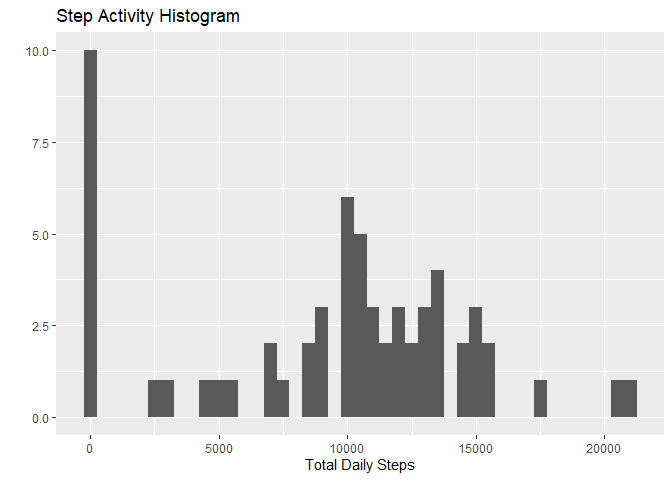
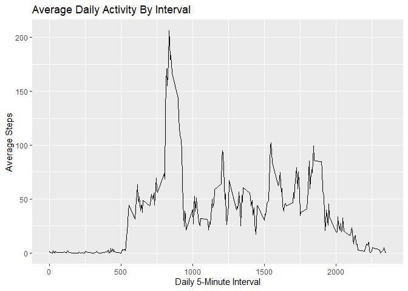
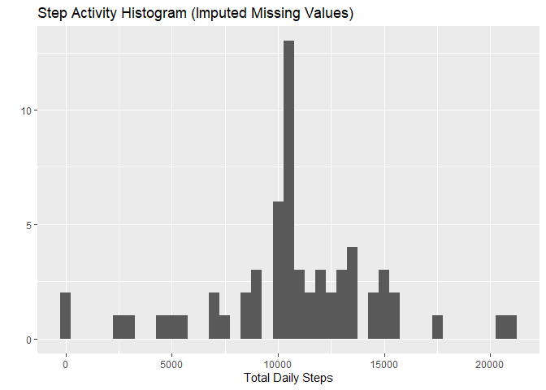

## Loading and preprocessing the data

```r
library(dplyr)
library(lubridate)
library(ggplot2)
```

```r
if (!file.exists("activity.csv")) unzip("activity.zip")
activity <- read.csv("activity.csv", colClasses=c("integer", "character", "integer"))
activity <- mutate(activity, date=ymd(date))
```

## What is mean total number of steps taken per day?
<!-- For this part of the assignment, you can ignore the missing values in the dataset.
     Calculate the total number of steps taken per day
     Make a histogram of the total number of steps taken each day
     Calculate and report the mean and median of the total number of steps taken per day -->


```r
activityByDate <- select(activity, -interval) %>%
                  group_by(date) %>%
                  summarize(steps=sum(steps,na.rm=TRUE))
qplot(activityByDate$steps, geom="histogram", binwidth=500, 
      xlab="Total Daily Steps", main="Step Activity Histogram")
```

<!-- -->

The mean of the total number of steps taken per day is: 

```r
averageSteps <- mean(activityByDate$steps)
print(averageSteps)
```

```
## [1] 9354.23
```

The median of the total number of steps taken per day is: 

```r
medianSteps <- median(activityByDate$steps)
print(medianSteps)
```

```
## [1] 10395
```

## What is the average daily activity pattern?
<!-- Make a time series plot (i.e. type="l") of the 5-minute interval (x-axis)
     and the average number of steps taken, averaged across all days (y-axis)
     Which 5-minute interval, on average across all the days in the dataset,
     contains the maximum number of steps? -->


```r
activityByInterval <- select(activity, -date) %>%
                      group_by(interval) %>%
                      summarize(average_steps=mean(steps,na.rm=TRUE))

ggplot(activityByInterval, aes(x=interval, y=average_steps)) + geom_line() + 
       labs(x="Daily 5-Minute Interval", y="Average Steps", 
            title="Average Daily Activity By Interval")
```

<!-- -->

The 5-minute interval, on average across all the days in the dataset, 
with the maximum number of steps is: 

```r
maxSteps <- filter(activityByInterval, average_steps==max(average_steps))
print(maxSteps$interval)
```

```
## [1] 835
```

The maximum number of average steps per 5-minute interval is:  

```r
print(maxSteps$average_steps)
```

```
## [1] 206.1698
```

## Imputing missing values
<!-- Note that there are a number of days/intervals where there are missing
values (coded as NA). The presence of missing days may introduce bias into some
calculations or summaries of the data. Calculate and report the total number of
missing values in the dataset (i.e. the total number of rows with NAs) Devise a
strategy for filling in all of the missing values in the dataset. The strategy
does not need to be sophisticated. For example, you could use the mean/median
for that day, or the mean for that 5-minute interval, etc. Create a new dataset
that is equal to the original dataset but with the missing data filled in. Make
a histogram of the total number of steps taken each day and Calculate and report
the mean and median total number of steps taken per day. Do these values differ
from the estimates from the first part of the assignment? What is the impact of
imputing missing data on the estimates of the total daily number of steps? -->

The total number of missing values in the dataset is: 

```r
totalMissingVales <- sum(is.na(activity$steps))
print(totalMissingVales)
```

```
## [1] 2304
```

```r
imputedMissingSteps <- merge(activity, activityByInterval) %>%
                       mutate(steps=if_else(is.na(steps), 
                                            as.integer(average_steps), steps)) %>%
                       select(-average_steps) %>% arrange(date, interval)


newActivityByDate <- select(imputedMissingSteps, -interval) %>%
                  group_by(date) %>%
                  summarize(steps=sum(steps))
qplot(newActivityByDate$steps, geom="histogram", binwidth=500, 
      xlab="Total Daily Steps", main="Step Activity Histogram (Imputed Missing Values)")
```

<!-- -->

The mean of the total number of steps taken per day (with imputed missing values) is: 

```r
newAverageSteps <- mean(newActivityByDate$steps)
print(newAverageSteps)
```

```
## [1] 10749.77
```

The difference of the mean with and without imputed values:  

```r
print(newAverageSteps - averageSteps)
```

```
## [1] 1395.541
```

The median of the total number of steps taken per day (with imputed missing values) is: 

```r
newMedianSteps <- median(newActivityByDate$steps)
print(newMedianSteps)
```

```
## [1] 10641
```

The difference of the median with and without imputed values:  

```r
print(newMedianSteps - medianSteps)
```

```
## [1] 246
```

Missing step values were imputed using the average steps for that time interval.
The result of using imputed values was to decrease the number of days with zero 
steps and increase the overall mean and median steps per day.

## Are there differences in activity patterns between weekdays and weekends?
<!-- For this part the weekdays() function may be of some help here. Use the
dataset with the filled-in missing values for this part. Create a new factor
variable in the dataset with two levels – “weekday” and “weekend” indicating
whether a given date is a weekday or weekend day. Make a panel plot containing a
time series plot (i.e. type="l") of the 5-minute interval (x-axis) and the
average number of steps taken, averaged across all weekday days or weekend days
(y-axis). See the README file in the GitHub repository to see an example of what
this plot should look like using simulated data. -->

```r
activityWithWeekdays <- mutate(imputedMissingSteps, 
                               day=as.factor(if_else(wday(date) == 1 | 
                                                       wday(date) == 7, 
                                                     "weekend", "weekday")))
print(activityWithWeekdays)
```

```
##       interval steps       date     day
## 1            0     1 2012-10-01 weekday
## 2            5     0 2012-10-01 weekday
## 3           10     0 2012-10-01 weekday
## 4           15     0 2012-10-01 weekday
## 5           20     0 2012-10-01 weekday
## 6           25     2 2012-10-01 weekday
## 7           30     0 2012-10-01 weekday
## 8           35     0 2012-10-01 weekday
## 9           40     0 2012-10-01 weekday
## 10          45     1 2012-10-01 weekday
## 11          50     0 2012-10-01 weekday
## 12          55     0 2012-10-01 weekday
## 13         100     0 2012-10-01 weekday
## 14         105     0 2012-10-01 weekday
## 15         110     0 2012-10-01 weekday
## 16         115     0 2012-10-01 weekday
## 17         120     0 2012-10-01 weekday
## 18         125     1 2012-10-01 weekday
## 19         130     1 2012-10-01 weekday
## 20         135     0 2012-10-01 weekday
## 21         140     0 2012-10-01 weekday
## 22         145     0 2012-10-01 weekday
## 23         150     0 2012-10-01 weekday
## 24         155     0 2012-10-01 weekday
## 25         200     0 2012-10-01 weekday
## 26         205     0 2012-10-01 weekday
## 27         210     1 2012-10-01 weekday
## 28         215     0 2012-10-01 weekday
## 29         220     0 2012-10-01 weekday
## 30         225     0 2012-10-01 weekday
## 31         230     0 2012-10-01 weekday
## 32         235     0 2012-10-01 weekday
## 33         240     0 2012-10-01 weekday
## 34         245     0 2012-10-01 weekday
## 35         250     1 2012-10-01 weekday
## 36         255     0 2012-10-01 weekday
## 37         300     0 2012-10-01 weekday
## 38         305     0 2012-10-01 weekday
## 39         310     0 2012-10-01 weekday
## 40         315     0 2012-10-01 weekday
## 41         320     0 2012-10-01 weekday
## 42         325     0 2012-10-01 weekday
## 43         330     1 2012-10-01 weekday
## 44         335     0 2012-10-01 weekday
## 45         340     0 2012-10-01 weekday
## 46         345     0 2012-10-01 weekday
## 47         350     0 2012-10-01 weekday
## 48         355     0 2012-10-01 weekday
## 49         400     1 2012-10-01 weekday
## 50         405     0 2012-10-01 weekday
## 51         410     2 2012-10-01 weekday
## 52         415     0 2012-10-01 weekday
## 53         420     0 2012-10-01 weekday
## 54         425     0 2012-10-01 weekday
## 55         430     4 2012-10-01 weekday
## 56         435     0 2012-10-01 weekday
## 57         440     3 2012-10-01 weekday
## 58         445     0 2012-10-01 weekday
## 59         450     3 2012-10-01 weekday
## 60         455     1 2012-10-01 weekday
## 61         500     0 2012-10-01 weekday
## 62         505     1 2012-10-01 weekday
## 63         510     3 2012-10-01 weekday
## 64         515     2 2012-10-01 weekday
## 65         520     3 2012-10-01 weekday
## 66         525     2 2012-10-01 weekday
## 67         530     2 2012-10-01 weekday
## 68         535     6 2012-10-01 weekday
## 69         540    16 2012-10-01 weekday
## 70         545    18 2012-10-01 weekday
## 71         550    39 2012-10-01 weekday
## 72         555    44 2012-10-01 weekday
## 73         600    31 2012-10-01 weekday
## 74         605    49 2012-10-01 weekday
## 75         610    53 2012-10-01 weekday
## 76         615    63 2012-10-01 weekday
## 77         620    49 2012-10-01 weekday
## 78         625    47 2012-10-01 weekday
## 79         630    52 2012-10-01 weekday
## 80         635    39 2012-10-01 weekday
## 81         640    44 2012-10-01 weekday
## 82         645    44 2012-10-01 weekday
## 83         650    37 2012-10-01 weekday
## 84         655    49 2012-10-01 weekday
## 85         700    43 2012-10-01 weekday
## 86         705    44 2012-10-01 weekday
## 87         710    50 2012-10-01 weekday
## 88         715    54 2012-10-01 weekday
## 89         720    49 2012-10-01 weekday
## 90         725    50 2012-10-01 weekday
## 91         730    55 2012-10-01 weekday
## 92         735    44 2012-10-01 weekday
## 93         740    52 2012-10-01 weekday
## 94         745    69 2012-10-01 weekday
## 95         750    57 2012-10-01 weekday
## 96         755    56 2012-10-01 weekday
## 97         800    73 2012-10-01 weekday
## 98         805    68 2012-10-01 weekday
## 99         810   129 2012-10-01 weekday
## 100        815   157 2012-10-01 weekday
## 101        820   171 2012-10-01 weekday
## 102        825   155 2012-10-01 weekday
## 103        830   177 2012-10-01 weekday
## 104        835   206 2012-10-01 weekday
## 105        840   195 2012-10-01 weekday
## 106        845   179 2012-10-01 weekday
## 107        850   183 2012-10-01 weekday
## 108        855   167 2012-10-01 weekday
## 109        900   143 2012-10-01 weekday
## 110        905   124 2012-10-01 weekday
## 111        910   109 2012-10-01 weekday
## 112        915   108 2012-10-01 weekday
## 113        920   103 2012-10-01 weekday
## 114        925    95 2012-10-01 weekday
## 115        930    66 2012-10-01 weekday
## 116        935    45 2012-10-01 weekday
## 117        940    24 2012-10-01 weekday
## 118        945    38 2012-10-01 weekday
## 119        950    34 2012-10-01 weekday
## 120        955    21 2012-10-01 weekday
## 121       1000    40 2012-10-01 weekday
## 122       1005    26 2012-10-01 weekday
## 123       1010    42 2012-10-01 weekday
## 124       1015    52 2012-10-01 weekday
## 125       1020    38 2012-10-01 weekday
## 126       1025    50 2012-10-01 weekday
## 127       1030    44 2012-10-01 weekday
## 128       1035    37 2012-10-01 weekday
## 129       1040    34 2012-10-01 weekday
## 130       1045    28 2012-10-01 weekday
## 131       1050    25 2012-10-01 weekday
## 132       1055    31 2012-10-01 weekday
## 133       1100    31 2012-10-01 weekday
## 134       1105    29 2012-10-01 weekday
## 135       1110    21 2012-10-01 weekday
## 136       1115    25 2012-10-01 weekday
## 137       1120    28 2012-10-01 weekday
## 138       1125    26 2012-10-01 weekday
## 139       1130    33 2012-10-01 weekday
## 140       1135    49 2012-10-01 weekday
## 141       1140    42 2012-10-01 weekday
## 142       1145    44 2012-10-01 weekday
## 143       1150    46 2012-10-01 weekday
## 144       1155    59 2012-10-01 weekday
## 145       1200    63 2012-10-01 weekday
## 146       1205    87 2012-10-01 weekday
## 147       1210    94 2012-10-01 weekday
## 148       1215    92 2012-10-01 weekday
## 149       1220    63 2012-10-01 weekday
## 150       1225    50 2012-10-01 weekday
## 151       1230    54 2012-10-01 weekday
## 152       1235    32 2012-10-01 weekday
## 153       1240    26 2012-10-01 weekday
## 154       1245    37 2012-10-01 weekday
## 155       1250    45 2012-10-01 weekday
## 156       1255    67 2012-10-01 weekday
## 157       1300    42 2012-10-01 weekday
## 158       1305    39 2012-10-01 weekday
## 159       1310    43 2012-10-01 weekday
## 160       1315    40 2012-10-01 weekday
## 161       1320    46 2012-10-01 weekday
## 162       1325    56 2012-10-01 weekday
## 163       1330    42 2012-10-01 weekday
## 164       1335    25 2012-10-01 weekday
## 165       1340    39 2012-10-01 weekday
## 166       1345    53 2012-10-01 weekday
## 167       1350    47 2012-10-01 weekday
## 168       1355    60 2012-10-01 weekday
## 169       1400    55 2012-10-01 weekday
## 170       1405    51 2012-10-01 weekday
## 171       1410    43 2012-10-01 weekday
## 172       1415    48 2012-10-01 weekday
## 173       1420    35 2012-10-01 weekday
## 174       1425    37 2012-10-01 weekday
## 175       1430    41 2012-10-01 weekday
## 176       1435    27 2012-10-01 weekday
## 177       1440    17 2012-10-01 weekday
## 178       1445    26 2012-10-01 weekday
## 179       1450    43 2012-10-01 weekday
## 180       1455    43 2012-10-01 weekday
## 181       1500    30 2012-10-01 weekday
## 182       1505    36 2012-10-01 weekday
## 183       1510    35 2012-10-01 weekday
## 184       1515    38 2012-10-01 weekday
## 185       1520    45 2012-10-01 weekday
## 186       1525    47 2012-10-01 weekday
## 187       1530    48 2012-10-01 weekday
## 188       1535    65 2012-10-01 weekday
## 189       1540    82 2012-10-01 weekday
## 190       1545    98 2012-10-01 weekday
## 191       1550   102 2012-10-01 weekday
## 192       1555    83 2012-10-01 weekday
## 193       1600    62 2012-10-01 weekday
## 194       1605    64 2012-10-01 weekday
## 195       1610    74 2012-10-01 weekday
## 196       1615    63 2012-10-01 weekday
## 197       1620    56 2012-10-01 weekday
## 198       1625    59 2012-10-01 weekday
## 199       1630    43 2012-10-01 weekday
## 200       1635    38 2012-10-01 weekday
## 201       1640    44 2012-10-01 weekday
## 202       1645    45 2012-10-01 weekday
## 203       1650    46 2012-10-01 weekday
## 204       1655    43 2012-10-01 weekday
## 205       1700    46 2012-10-01 weekday
## 206       1705    56 2012-10-01 weekday
## 207       1710    50 2012-10-01 weekday
## 208       1715    61 2012-10-01 weekday
## 209       1720    72 2012-10-01 weekday
## 210       1725    78 2012-10-01 weekday
## 211       1730    68 2012-10-01 weekday
## 212       1735    59 2012-10-01 weekday
## 213       1740    75 2012-10-01 weekday
## 214       1745    56 2012-10-01 weekday
## 215       1750    34 2012-10-01 weekday
## 216       1755    37 2012-10-01 weekday
## 217       1800    40 2012-10-01 weekday
## 218       1805    58 2012-10-01 weekday
## 219       1810    74 2012-10-01 weekday
## 220       1815    85 2012-10-01 weekday
## 221       1820    59 2012-10-01 weekday
## 222       1825    67 2012-10-01 weekday
## 223       1830    77 2012-10-01 weekday
## 224       1835    74 2012-10-01 weekday
## 225       1840    85 2012-10-01 weekday
## 226       1845    99 2012-10-01 weekday
## 227       1850    86 2012-10-01 weekday
## 228       1855    85 2012-10-01 weekday
## 229       1900    84 2012-10-01 weekday
## 230       1905    77 2012-10-01 weekday
## 231       1910    58 2012-10-01 weekday
## 232       1915    53 2012-10-01 weekday
## 233       1920    36 2012-10-01 weekday
## 234       1925    20 2012-10-01 weekday
## 235       1930    27 2012-10-01 weekday
## 236       1935    40 2012-10-01 weekday
## 237       1940    30 2012-10-01 weekday
## 238       1945    25 2012-10-01 weekday
## 239       1950    45 2012-10-01 weekday
## 240       1955    33 2012-10-01 weekday
## 241       2000    19 2012-10-01 weekday
## 242       2005    19 2012-10-01 weekday
## 243       2010    19 2012-10-01 weekday
## 244       2015    33 2012-10-01 weekday
## 245       2020    26 2012-10-01 weekday
## 246       2025    21 2012-10-01 weekday
## 247       2030    27 2012-10-01 weekday
## 248       2035    21 2012-10-01 weekday
## 249       2040    19 2012-10-01 weekday
## 250       2045    21 2012-10-01 weekday
## 251       2050    32 2012-10-01 weekday
## 252       2055    20 2012-10-01 weekday
## 253       2100    15 2012-10-01 weekday
## 254       2105    17 2012-10-01 weekday
## 255       2110    23 2012-10-01 weekday
## 256       2115    19 2012-10-01 weekday
## 257       2120    12 2012-10-01 weekday
## 258       2125     8 2012-10-01 weekday
## 259       2130    14 2012-10-01 weekday
## 260       2135    16 2012-10-01 weekday
## 261       2140     8 2012-10-01 weekday
## 262       2145     7 2012-10-01 weekday
## 263       2150     8 2012-10-01 weekday
## 264       2155     2 2012-10-01 weekday
## 265       2200     1 2012-10-01 weekday
## 266       2205     3 2012-10-01 weekday
## 267       2210     4 2012-10-01 weekday
## 268       2215     8 2012-10-01 weekday
## 269       2220     7 2012-10-01 weekday
## 270       2225     8 2012-10-01 weekday
## 271       2230     9 2012-10-01 weekday
## 272       2235     2 2012-10-01 weekday
## 273       2240     0 2012-10-01 weekday
## 274       2245     0 2012-10-01 weekday
## 275       2250     1 2012-10-01 weekday
## 276       2255     4 2012-10-01 weekday
## 277       2300     3 2012-10-01 weekday
## 278       2305     2 2012-10-01 weekday
## 279       2310     0 2012-10-01 weekday
## 280       2315     0 2012-10-01 weekday
## 281       2320     0 2012-10-01 weekday
## 282       2325     1 2012-10-01 weekday
## 283       2330     2 2012-10-01 weekday
## 284       2335     4 2012-10-01 weekday
## 285       2340     3 2012-10-01 weekday
## 286       2345     0 2012-10-01 weekday
## 287       2350     0 2012-10-01 weekday
## 288       2355     1 2012-10-01 weekday
## 289          0     0 2012-10-02 weekday
## 290          5     0 2012-10-02 weekday
## 291         10     0 2012-10-02 weekday
## 292         15     0 2012-10-02 weekday
## 293         20     0 2012-10-02 weekday
## 294         25     0 2012-10-02 weekday
## 295         30     0 2012-10-02 weekday
## 296         35     0 2012-10-02 weekday
## 297         40     0 2012-10-02 weekday
## 298         45     0 2012-10-02 weekday
## 299         50     0 2012-10-02 weekday
## 300         55     0 2012-10-02 weekday
## 301        100     0 2012-10-02 weekday
## 302        105     0 2012-10-02 weekday
## 303        110     0 2012-10-02 weekday
## 304        115     0 2012-10-02 weekday
## 305        120     0 2012-10-02 weekday
## 306        125     0 2012-10-02 weekday
## 307        130     0 2012-10-02 weekday
## 308        135     0 2012-10-02 weekday
## 309        140     0 2012-10-02 weekday
## 310        145     0 2012-10-02 weekday
## 311        150     0 2012-10-02 weekday
## 312        155     0 2012-10-02 weekday
## 313        200     0 2012-10-02 weekday
## 314        205     0 2012-10-02 weekday
## 315        210     0 2012-10-02 weekday
## 316        215     0 2012-10-02 weekday
## 317        220     0 2012-10-02 weekday
## 318        225     0 2012-10-02 weekday
## 319        230     0 2012-10-02 weekday
## 320        235     0 2012-10-02 weekday
## 321        240     0 2012-10-02 weekday
## 322        245     0 2012-10-02 weekday
## 323        250     0 2012-10-02 weekday
## 324        255     0 2012-10-02 weekday
## 325        300     0 2012-10-02 weekday
## 326        305     0 2012-10-02 weekday
## 327        310     0 2012-10-02 weekday
## 328        315     0 2012-10-02 weekday
## 329        320     0 2012-10-02 weekday
## 330        325     0 2012-10-02 weekday
## 331        330     0 2012-10-02 weekday
## 332        335     0 2012-10-02 weekday
## 333        340     0 2012-10-02 weekday
## 334        345     0 2012-10-02 weekday
## 335        350     0 2012-10-02 weekday
## 336        355     0 2012-10-02 weekday
## 337        400     0 2012-10-02 weekday
## 338        405     0 2012-10-02 weekday
## 339        410     0 2012-10-02 weekday
## 340        415     0 2012-10-02 weekday
## 341        420     0 2012-10-02 weekday
## 342        425     0 2012-10-02 weekday
## 343        430     0 2012-10-02 weekday
## 344        435     0 2012-10-02 weekday
## 345        440     0 2012-10-02 weekday
## 346        445     0 2012-10-02 weekday
## 347        450     0 2012-10-02 weekday
## 348        455     0 2012-10-02 weekday
## 349        500     0 2012-10-02 weekday
## 350        505     0 2012-10-02 weekday
## 351        510     0 2012-10-02 weekday
## 352        515     0 2012-10-02 weekday
## 353        520     0 2012-10-02 weekday
## 354        525     0 2012-10-02 weekday
## 355        530     0 2012-10-02 weekday
## 356        535     0 2012-10-02 weekday
## 357        540     0 2012-10-02 weekday
## 358        545     0 2012-10-02 weekday
## 359        550     0 2012-10-02 weekday
## 360        555     0 2012-10-02 weekday
## 361        600     0 2012-10-02 weekday
## 362        605     0 2012-10-02 weekday
## 363        610     0 2012-10-02 weekday
## 364        615     0 2012-10-02 weekday
## 365        620     0 2012-10-02 weekday
## 366        625     0 2012-10-02 weekday
## 367        630     0 2012-10-02 weekday
## 368        635     0 2012-10-02 weekday
## 369        640     0 2012-10-02 weekday
## 370        645     0 2012-10-02 weekday
## 371        650     0 2012-10-02 weekday
## 372        655     0 2012-10-02 weekday
## 373        700     0 2012-10-02 weekday
## 374        705     0 2012-10-02 weekday
## 375        710     0 2012-10-02 weekday
## 376        715     0 2012-10-02 weekday
## 377        720     0 2012-10-02 weekday
## 378        725     0 2012-10-02 weekday
## 379        730     0 2012-10-02 weekday
## 380        735     0 2012-10-02 weekday
## 381        740     0 2012-10-02 weekday
## 382        745     0 2012-10-02 weekday
## 383        750     0 2012-10-02 weekday
## 384        755     0 2012-10-02 weekday
## 385        800     0 2012-10-02 weekday
## 386        805     0 2012-10-02 weekday
## 387        810     0 2012-10-02 weekday
## 388        815     0 2012-10-02 weekday
## 389        820     0 2012-10-02 weekday
## 390        825     0 2012-10-02 weekday
## 391        830     0 2012-10-02 weekday
## 392        835     0 2012-10-02 weekday
## 393        840     0 2012-10-02 weekday
## 394        845     0 2012-10-02 weekday
## 395        850     0 2012-10-02 weekday
## 396        855     0 2012-10-02 weekday
## 397        900     0 2012-10-02 weekday
## 398        905     0 2012-10-02 weekday
## 399        910     0 2012-10-02 weekday
## 400        915     0 2012-10-02 weekday
## 401        920     0 2012-10-02 weekday
## 402        925     0 2012-10-02 weekday
## 403        930     0 2012-10-02 weekday
## 404        935     0 2012-10-02 weekday
## 405        940     0 2012-10-02 weekday
## 406        945     0 2012-10-02 weekday
## 407        950     0 2012-10-02 weekday
## 408        955     0 2012-10-02 weekday
## 409       1000     0 2012-10-02 weekday
## 410       1005     0 2012-10-02 weekday
## 411       1010     0 2012-10-02 weekday
## 412       1015     0 2012-10-02 weekday
## 413       1020     0 2012-10-02 weekday
## 414       1025     0 2012-10-02 weekday
## 415       1030     0 2012-10-02 weekday
## 416       1035     0 2012-10-02 weekday
## 417       1040     0 2012-10-02 weekday
## 418       1045     0 2012-10-02 weekday
## 419       1050     0 2012-10-02 weekday
## 420       1055     0 2012-10-02 weekday
## 421       1100     0 2012-10-02 weekday
## 422       1105     0 2012-10-02 weekday
## 423       1110     0 2012-10-02 weekday
## 424       1115     0 2012-10-02 weekday
## 425       1120     0 2012-10-02 weekday
## 426       1125     0 2012-10-02 weekday
## 427       1130     0 2012-10-02 weekday
## 428       1135     0 2012-10-02 weekday
## 429       1140     0 2012-10-02 weekday
## 430       1145     0 2012-10-02 weekday
## 431       1150     0 2012-10-02 weekday
## 432       1155     0 2012-10-02 weekday
## 433       1200     0 2012-10-02 weekday
## 434       1205     0 2012-10-02 weekday
## 435       1210     0 2012-10-02 weekday
## 436       1215     0 2012-10-02 weekday
## 437       1220     0 2012-10-02 weekday
## 438       1225     0 2012-10-02 weekday
## 439       1230     0 2012-10-02 weekday
## 440       1235     0 2012-10-02 weekday
## 441       1240     0 2012-10-02 weekday
## 442       1245     0 2012-10-02 weekday
## 443       1250     0 2012-10-02 weekday
## 444       1255     0 2012-10-02 weekday
## 445       1300     0 2012-10-02 weekday
## 446       1305     0 2012-10-02 weekday
## 447       1310     0 2012-10-02 weekday
## 448       1315     0 2012-10-02 weekday
## 449       1320     0 2012-10-02 weekday
## 450       1325     0 2012-10-02 weekday
## 451       1330     0 2012-10-02 weekday
## 452       1335     0 2012-10-02 weekday
## 453       1340     0 2012-10-02 weekday
## 454       1345     0 2012-10-02 weekday
## 455       1350     0 2012-10-02 weekday
## 456       1355     0 2012-10-02 weekday
## 457       1400     0 2012-10-02 weekday
## 458       1405     0 2012-10-02 weekday
## 459       1410     0 2012-10-02 weekday
## 460       1415     0 2012-10-02 weekday
## 461       1420     0 2012-10-02 weekday
## 462       1425     0 2012-10-02 weekday
## 463       1430     0 2012-10-02 weekday
## 464       1435     0 2012-10-02 weekday
## 465       1440     0 2012-10-02 weekday
## 466       1445     0 2012-10-02 weekday
## 467       1450     0 2012-10-02 weekday
## 468       1455     0 2012-10-02 weekday
## 469       1500     0 2012-10-02 weekday
## 470       1505     0 2012-10-02 weekday
## 471       1510     0 2012-10-02 weekday
## 472       1515     0 2012-10-02 weekday
## 473       1520     0 2012-10-02 weekday
## 474       1525     0 2012-10-02 weekday
## 475       1530     0 2012-10-02 weekday
## 476       1535     0 2012-10-02 weekday
## 477       1540     0 2012-10-02 weekday
## 478       1545     0 2012-10-02 weekday
## 479       1550     0 2012-10-02 weekday
## 480       1555     0 2012-10-02 weekday
## 481       1600     0 2012-10-02 weekday
## 482       1605     0 2012-10-02 weekday
## 483       1610     0 2012-10-02 weekday
## 484       1615     0 2012-10-02 weekday
## 485       1620     0 2012-10-02 weekday
## 486       1625     0 2012-10-02 weekday
## 487       1630     0 2012-10-02 weekday
## 488       1635     0 2012-10-02 weekday
## 489       1640     0 2012-10-02 weekday
## 490       1645     0 2012-10-02 weekday
## 491       1650     0 2012-10-02 weekday
## 492       1655     0 2012-10-02 weekday
## 493       1700     0 2012-10-02 weekday
## 494       1705     0 2012-10-02 weekday
## 495       1710     0 2012-10-02 weekday
## 496       1715     0 2012-10-02 weekday
## 497       1720     0 2012-10-02 weekday
## 498       1725     0 2012-10-02 weekday
## 499       1730     0 2012-10-02 weekday
## 500       1735     0 2012-10-02 weekday
## 501       1740     0 2012-10-02 weekday
## 502       1745     0 2012-10-02 weekday
## 503       1750     0 2012-10-02 weekday
## 504       1755     0 2012-10-02 weekday
## 505       1800     0 2012-10-02 weekday
## 506       1805     0 2012-10-02 weekday
## 507       1810     0 2012-10-02 weekday
## 508       1815     0 2012-10-02 weekday
## 509       1820     0 2012-10-02 weekday
## 510       1825     0 2012-10-02 weekday
## 511       1830     0 2012-10-02 weekday
## 512       1835     0 2012-10-02 weekday
## 513       1840     0 2012-10-02 weekday
## 514       1845     0 2012-10-02 weekday
## 515       1850     0 2012-10-02 weekday
## 516       1855     0 2012-10-02 weekday
## 517       1900     0 2012-10-02 weekday
## 518       1905     0 2012-10-02 weekday
## 519       1910     0 2012-10-02 weekday
## 520       1915     0 2012-10-02 weekday
## 521       1920     0 2012-10-02 weekday
## 522       1925     0 2012-10-02 weekday
## 523       1930     0 2012-10-02 weekday
## 524       1935     0 2012-10-02 weekday
## 525       1940     0 2012-10-02 weekday
## 526       1945     0 2012-10-02 weekday
## 527       1950     0 2012-10-02 weekday
## 528       1955     0 2012-10-02 weekday
## 529       2000     0 2012-10-02 weekday
## 530       2005     0 2012-10-02 weekday
## 531       2010     0 2012-10-02 weekday
## 532       2015     0 2012-10-02 weekday
## 533       2020     0 2012-10-02 weekday
## 534       2025     0 2012-10-02 weekday
## 535       2030     0 2012-10-02 weekday
## 536       2035     0 2012-10-02 weekday
## 537       2040     0 2012-10-02 weekday
## 538       2045     0 2012-10-02 weekday
## 539       2050     0 2012-10-02 weekday
## 540       2055     0 2012-10-02 weekday
## 541       2100     0 2012-10-02 weekday
## 542       2105     0 2012-10-02 weekday
## 543       2110     0 2012-10-02 weekday
## 544       2115     0 2012-10-02 weekday
## 545       2120     0 2012-10-02 weekday
## 546       2125     0 2012-10-02 weekday
## 547       2130     0 2012-10-02 weekday
## 548       2135     0 2012-10-02 weekday
## 549       2140     0 2012-10-02 weekday
## 550       2145     0 2012-10-02 weekday
## 551       2150     0 2012-10-02 weekday
## 552       2155     0 2012-10-02 weekday
## 553       2200     0 2012-10-02 weekday
## 554       2205     0 2012-10-02 weekday
## 555       2210   117 2012-10-02 weekday
## 556       2215     9 2012-10-02 weekday
## 557       2220     0 2012-10-02 weekday
## 558       2225     0 2012-10-02 weekday
## 559       2230     0 2012-10-02 weekday
## 560       2235     0 2012-10-02 weekday
## 561       2240     0 2012-10-02 weekday
## 562       2245     0 2012-10-02 weekday
## 563       2250     0 2012-10-02 weekday
## 564       2255     0 2012-10-02 weekday
## 565       2300     0 2012-10-02 weekday
## 566       2305     0 2012-10-02 weekday
## 567       2310     0 2012-10-02 weekday
## 568       2315     0 2012-10-02 weekday
## 569       2320     0 2012-10-02 weekday
## 570       2325     0 2012-10-02 weekday
## 571       2330     0 2012-10-02 weekday
## 572       2335     0 2012-10-02 weekday
## 573       2340     0 2012-10-02 weekday
## 574       2345     0 2012-10-02 weekday
## 575       2350     0 2012-10-02 weekday
## 576       2355     0 2012-10-02 weekday
## 577          0     0 2012-10-03 weekday
## 578          5     0 2012-10-03 weekday
## 579         10     0 2012-10-03 weekday
## 580         15     0 2012-10-03 weekday
## 581         20     0 2012-10-03 weekday
## 582         25     0 2012-10-03 weekday
## 583         30     0 2012-10-03 weekday
## 584         35     0 2012-10-03 weekday
## 585         40     0 2012-10-03 weekday
## 586         45     0 2012-10-03 weekday
## 587         50     0 2012-10-03 weekday
## 588         55     0 2012-10-03 weekday
## 589        100     0 2012-10-03 weekday
## 590        105     0 2012-10-03 weekday
## 591        110     0 2012-10-03 weekday
## 592        115     0 2012-10-03 weekday
## 593        120     0 2012-10-03 weekday
## 594        125     0 2012-10-03 weekday
## 595        130     0 2012-10-03 weekday
## 596        135     0 2012-10-03 weekday
## 597        140     0 2012-10-03 weekday
## 598        145     0 2012-10-03 weekday
## 599        150     0 2012-10-03 weekday
## 600        155     0 2012-10-03 weekday
## 601        200     0 2012-10-03 weekday
## 602        205     0 2012-10-03 weekday
## 603        210     0 2012-10-03 weekday
## 604        215     0 2012-10-03 weekday
## 605        220     0 2012-10-03 weekday
## 606        225     0 2012-10-03 weekday
## 607        230     0 2012-10-03 weekday
## 608        235     0 2012-10-03 weekday
## 609        240     0 2012-10-03 weekday
## 610        245     0 2012-10-03 weekday
## 611        250     0 2012-10-03 weekday
## 612        255     0 2012-10-03 weekday
## 613        300     0 2012-10-03 weekday
## 614        305     0 2012-10-03 weekday
## 615        310     0 2012-10-03 weekday
## 616        315     0 2012-10-03 weekday
## 617        320     0 2012-10-03 weekday
## 618        325     0 2012-10-03 weekday
## 619        330     0 2012-10-03 weekday
## 620        335     0 2012-10-03 weekday
## 621        340     0 2012-10-03 weekday
## 622        345     0 2012-10-03 weekday
## 623        350     0 2012-10-03 weekday
## 624        355     0 2012-10-03 weekday
## 625        400     0 2012-10-03 weekday
## 626        405     0 2012-10-03 weekday
## 627        410     4 2012-10-03 weekday
## 628        415     0 2012-10-03 weekday
## 629        420     0 2012-10-03 weekday
## 630        425     0 2012-10-03 weekday
## 631        430    36 2012-10-03 weekday
## 632        435     0 2012-10-03 weekday
## 633        440     0 2012-10-03 weekday
## 634        445     0 2012-10-03 weekday
## 635        450     0 2012-10-03 weekday
## 636        455     0 2012-10-03 weekday
## 637        500     0 2012-10-03 weekday
## 638        505     0 2012-10-03 weekday
## 639        510     0 2012-10-03 weekday
## 640        515     0 2012-10-03 weekday
## 641        520     0 2012-10-03 weekday
## 642        525     0 2012-10-03 weekday
## 643        530     0 2012-10-03 weekday
## 644        535    25 2012-10-03 weekday
## 645        540     0 2012-10-03 weekday
## 646        545     0 2012-10-03 weekday
## 647        550    90 2012-10-03 weekday
## 648        555   411 2012-10-03 weekday
## 649        600   413 2012-10-03 weekday
## 650        605   415 2012-10-03 weekday
## 651        610   519 2012-10-03 weekday
## 652        615   529 2012-10-03 weekday
## 653        620   613 2012-10-03 weekday
## 654        625   562 2012-10-03 weekday
## 655        630   612 2012-10-03 weekday
## 656        635   534 2012-10-03 weekday
## 657        640   323 2012-10-03 weekday
## 658        645   600 2012-10-03 weekday
## 659        650   533 2012-10-03 weekday
## 660        655   251 2012-10-03 weekday
## 661        700    56 2012-10-03 weekday
## 662        705     0 2012-10-03 weekday
## 663        710    32 2012-10-03 weekday
## 664        715    80 2012-10-03 weekday
## 665        720    10 2012-10-03 weekday
## 666        725     9 2012-10-03 weekday
## 667        730   145 2012-10-03 weekday
## 668        735    46 2012-10-03 weekday
## 669        740     0 2012-10-03 weekday
## 670        745    44 2012-10-03 weekday
## 671        750   126 2012-10-03 weekday
## 672        755    42 2012-10-03 weekday
## 673        800   138 2012-10-03 weekday
## 674        805    53 2012-10-03 weekday
## 675        810     0 2012-10-03 weekday
## 676        815     0 2012-10-03 weekday
## 677        820    22 2012-10-03 weekday
## 678        825    57 2012-10-03 weekday
## 679        830   161 2012-10-03 weekday
## 680        835    19 2012-10-03 weekday
## 681        840    15 2012-10-03 weekday
## 682        845     0 2012-10-03 weekday
## 683        850    16 2012-10-03 weekday
## 684        855     0 2012-10-03 weekday
## 685        900     0 2012-10-03 weekday
## 686        905     8 2012-10-03 weekday
## 687        910     0 2012-10-03 weekday
## 688        915    51 2012-10-03 weekday
## 689        920   516 2012-10-03 weekday
## 690        925   245 2012-10-03 weekday
## 691        930     0 2012-10-03 weekday
## 692        935   161 2012-10-03 weekday
## 693        940     7 2012-10-03 weekday
## 694        945     0 2012-10-03 weekday
## 695        950     0 2012-10-03 weekday
## 696        955     0 2012-10-03 weekday
## 697       1000     0 2012-10-03 weekday
## 698       1005     0 2012-10-03 weekday
## 699       1010     0 2012-10-03 weekday
## 700       1015     0 2012-10-03 weekday
## 701       1020     0 2012-10-03 weekday
## 702       1025     0 2012-10-03 weekday
## 703       1030     0 2012-10-03 weekday
## 704       1035     0 2012-10-03 weekday
## 705       1040     0 2012-10-03 weekday
## 706       1045     0 2012-10-03 weekday
## 707       1050     0 2012-10-03 weekday
## 708       1055     0 2012-10-03 weekday
## 709       1100     0 2012-10-03 weekday
## 710       1105     0 2012-10-03 weekday
## 711       1110     0 2012-10-03 weekday
## 712       1115     0 2012-10-03 weekday
## 713       1120     0 2012-10-03 weekday
## 714       1125     0 2012-10-03 weekday
## 715       1130     0 2012-10-03 weekday
## 716       1135    72 2012-10-03 weekday
## 717       1140    73 2012-10-03 weekday
## 718       1145     0 2012-10-03 weekday
## 719       1150     0 2012-10-03 weekday
## 720       1155   116 2012-10-03 weekday
## 721       1200    97 2012-10-03 weekday
## 722       1205     0 2012-10-03 weekday
## 723       1210     0 2012-10-03 weekday
## 724       1215     0 2012-10-03 weekday
## 725       1220     0 2012-10-03 weekday
## 726       1225     0 2012-10-03 weekday
## 727       1230    15 2012-10-03 weekday
## 728       1235     0 2012-10-03 weekday
## 729       1240     0 2012-10-03 weekday
## 730       1245     0 2012-10-03 weekday
## 731       1250     0 2012-10-03 weekday
## 732       1255     0 2012-10-03 weekday
## 733       1300    80 2012-10-03 weekday
## 734       1305    69 2012-10-03 weekday
## 735       1310     0 2012-10-03 weekday
## 736       1315     0 2012-10-03 weekday
## 737       1320     0 2012-10-03 weekday
## 738       1325     0 2012-10-03 weekday
## 739       1330     0 2012-10-03 weekday
## 740       1335     0 2012-10-03 weekday
## 741       1340     0 2012-10-03 weekday
## 742       1345    99 2012-10-03 weekday
## 743       1350   100 2012-10-03 weekday
## 744       1355     0 2012-10-03 weekday
## 745       1400     0 2012-10-03 weekday
## 746       1405    33 2012-10-03 weekday
## 747       1410     0 2012-10-03 weekday
## 748       1415     0 2012-10-03 weekday
## 749       1420     7 2012-10-03 weekday
## 750       1425     0 2012-10-03 weekday
## 751       1430     0 2012-10-03 weekday
## 752       1435     0 2012-10-03 weekday
## 753       1440     0 2012-10-03 weekday
## 754       1445     0 2012-10-03 weekday
## 755       1450     0 2012-10-03 weekday
## 756       1455     0 2012-10-03 weekday
## 757       1500     0 2012-10-03 weekday
## 758       1505     0 2012-10-03 weekday
## 759       1510     0 2012-10-03 weekday
## 760       1515     0 2012-10-03 weekday
## 761       1520     0 2012-10-03 weekday
## 762       1525     0 2012-10-03 weekday
## 763       1530     0 2012-10-03 weekday
## 764       1535     0 2012-10-03 weekday
## 765       1540     0 2012-10-03 weekday
## 766       1545    88 2012-10-03 weekday
## 767       1550   154 2012-10-03 weekday
## 768       1555     0 2012-10-03 weekday
## 769       1600    20 2012-10-03 weekday
## 770       1605     0 2012-10-03 weekday
## 771       1610     0 2012-10-03 weekday
## 772       1615     0 2012-10-03 weekday
## 773       1620     0 2012-10-03 weekday
## 774       1625     0 2012-10-03 weekday
## 775       1630     0 2012-10-03 weekday
## 776       1635     0 2012-10-03 weekday
## 777       1640     0 2012-10-03 weekday
## 778       1645     0 2012-10-03 weekday
## 779       1650     0 2012-10-03 weekday
## 780       1655     0 2012-10-03 weekday
## 781       1700     0 2012-10-03 weekday
## 782       1705     0 2012-10-03 weekday
## 783       1710   198 2012-10-03 weekday
## 784       1715    61 2012-10-03 weekday
## 785       1720    75 2012-10-03 weekday
## 786       1725     0 2012-10-03 weekday
## 787       1730     0 2012-10-03 weekday
## 788       1735   193 2012-10-03 weekday
## 789       1740   298 2012-10-03 weekday
## 790       1745     0 2012-10-03 weekday
## 791       1750    15 2012-10-03 weekday
## 792       1755    21 2012-10-03 weekday
## 793       1800     0 2012-10-03 weekday
## 794       1805     0 2012-10-03 weekday
## 795       1810     0 2012-10-03 weekday
## 796       1815     0 2012-10-03 weekday
## 797       1820    51 2012-10-03 weekday
## 798       1825    36 2012-10-03 weekday
## 799       1830     0 2012-10-03 weekday
## 800       1835    26 2012-10-03 weekday
## 801       1840    22 2012-10-03 weekday
## 802       1845     0 2012-10-03 weekday
## 803       1850    39 2012-10-03 weekday
## 804       1855    52 2012-10-03 weekday
## 805       1900    15 2012-10-03 weekday
## 806       1905    41 2012-10-03 weekday
## 807       1910     0 2012-10-03 weekday
## 808       1915    42 2012-10-03 weekday
## 809       1920     0 2012-10-03 weekday
## 810       1925     0 2012-10-03 weekday
## 811       1930   159 2012-10-03 weekday
## 812       1935    32 2012-10-03 weekday
## 813       1940     0 2012-10-03 weekday
## 814       1945     0 2012-10-03 weekday
## 815       1950     0 2012-10-03 weekday
## 816       1955     0 2012-10-03 weekday
## 817       2000    34 2012-10-03 weekday
## 818       2005     0 2012-10-03 weekday
## 819       2010     0 2012-10-03 weekday
## 820       2015     0 2012-10-03 weekday
## 821       2020     0 2012-10-03 weekday
## 822       2025    36 2012-10-03 weekday
## 823       2030    73 2012-10-03 weekday
## 824       2035     9 2012-10-03 weekday
## 825       2040     0 2012-10-03 weekday
## 826       2045     0 2012-10-03 weekday
## 827       2050     0 2012-10-03 weekday
## 828       2055     0 2012-10-03 weekday
## 829       2100     0 2012-10-03 weekday
## 830       2105     0 2012-10-03 weekday
## 831       2110     0 2012-10-03 weekday
## 832       2115     0 2012-10-03 weekday
## 833       2120     0 2012-10-03 weekday
## 834       2125     0 2012-10-03 weekday
## 835       2130    90 2012-10-03 weekday
## 836       2135   128 2012-10-03 weekday
## 837       2140    46 2012-10-03 weekday
## 838       2145     0 2012-10-03 weekday
## 839       2150     0 2012-10-03 weekday
## 840       2155     0 2012-10-03 weekday
## 841       2200     0 2012-10-03 weekday
## 842       2205     0 2012-10-03 weekday
## 843       2210     0 2012-10-03 weekday
## 844       2215     0 2012-10-03 weekday
## 845       2220     0 2012-10-03 weekday
## 846       2225     0 2012-10-03 weekday
## 847       2230     0 2012-10-03 weekday
## 848       2235     0 2012-10-03 weekday
## 849       2240     0 2012-10-03 weekday
## 850       2245     0 2012-10-03 weekday
## 851       2250     0 2012-10-03 weekday
## 852       2255     0 2012-10-03 weekday
## 853       2300     0 2012-10-03 weekday
## 854       2305     0 2012-10-03 weekday
## 855       2310     0 2012-10-03 weekday
## 856       2315     0 2012-10-03 weekday
## 857       2320     0 2012-10-03 weekday
## 858       2325     0 2012-10-03 weekday
## 859       2330     0 2012-10-03 weekday
## 860       2335     0 2012-10-03 weekday
## 861       2340     0 2012-10-03 weekday
## 862       2345     8 2012-10-03 weekday
## 863       2350     0 2012-10-03 weekday
## 864       2355     0 2012-10-03 weekday
## 865          0    47 2012-10-04 weekday
## 866          5     0 2012-10-04 weekday
## 867         10     0 2012-10-04 weekday
## 868         15     0 2012-10-04 weekday
## 869         20     0 2012-10-04 weekday
## 870         25     0 2012-10-04 weekday
## 871         30     0 2012-10-04 weekday
## 872         35     0 2012-10-04 weekday
## 873         40     0 2012-10-04 weekday
## 874         45     0 2012-10-04 weekday
## 875         50     0 2012-10-04 weekday
## 876         55     0 2012-10-04 weekday
## 877        100     0 2012-10-04 weekday
## 878        105     0 2012-10-04 weekday
## 879        110     0 2012-10-04 weekday
## 880        115     0 2012-10-04 weekday
## 881        120     0 2012-10-04 weekday
## 882        125     0 2012-10-04 weekday
## 883        130     0 2012-10-04 weekday
## 884        135     0 2012-10-04 weekday
## 885        140     0 2012-10-04 weekday
## 886        145     0 2012-10-04 weekday
## 887        150     0 2012-10-04 weekday
## 888        155     0 2012-10-04 weekday
## 889        200     0 2012-10-04 weekday
## 890        205     0 2012-10-04 weekday
## 891        210     0 2012-10-04 weekday
## 892        215     0 2012-10-04 weekday
## 893        220     0 2012-10-04 weekday
## 894        225     0 2012-10-04 weekday
## 895        230     0 2012-10-04 weekday
## 896        235     0 2012-10-04 weekday
## 897        240     0 2012-10-04 weekday
## 898        245     0 2012-10-04 weekday
## 899        250     0 2012-10-04 weekday
## 900        255     0 2012-10-04 weekday
## 901        300     0 2012-10-04 weekday
## 902        305     0 2012-10-04 weekday
## 903        310     0 2012-10-04 weekday
## 904        315     0 2012-10-04 weekday
## 905        320     0 2012-10-04 weekday
## 906        325     0 2012-10-04 weekday
## 907        330     0 2012-10-04 weekday
## 908        335     0 2012-10-04 weekday
## 909        340     0 2012-10-04 weekday
## 910        345     0 2012-10-04 weekday
## 911        350     0 2012-10-04 weekday
## 912        355     0 2012-10-04 weekday
## 913        400     0 2012-10-04 weekday
## 914        405     0 2012-10-04 weekday
## 915        410     0 2012-10-04 weekday
## 916        415     0 2012-10-04 weekday
## 917        420     0 2012-10-04 weekday
## 918        425     0 2012-10-04 weekday
## 919        430     0 2012-10-04 weekday
## 920        435     0 2012-10-04 weekday
## 921        440     0 2012-10-04 weekday
## 922        445     0 2012-10-04 weekday
## 923        450     0 2012-10-04 weekday
## 924        455     0 2012-10-04 weekday
## 925        500     0 2012-10-04 weekday
## 926        505     0 2012-10-04 weekday
## 927        510     7 2012-10-04 weekday
## 928        515    18 2012-10-04 weekday
## 929        520    57 2012-10-04 weekday
## 930        525    40 2012-10-04 weekday
## 931        530     0 2012-10-04 weekday
## 932        535     0 2012-10-04 weekday
## 933        540     0 2012-10-04 weekday
## 934        545     0 2012-10-04 weekday
## 935        550    16 2012-10-04 weekday
## 936        555     1 2012-10-04 weekday
## 937        600     0 2012-10-04 weekday
## 938        605    18 2012-10-04 weekday
## 939        610    20 2012-10-04 weekday
## 940        615    40 2012-10-04 weekday
## 941        620    36 2012-10-04 weekday
## 942        625    17 2012-10-04 weekday
## 943        630    49 2012-10-04 weekday
## 944        635    86 2012-10-04 weekday
## 945        640    49 2012-10-04 weekday
## 946        645     0 2012-10-04 weekday
## 947        650    29 2012-10-04 weekday
## 948        655    59 2012-10-04 weekday
## 949        700     7 2012-10-04 weekday
## 950        705    25 2012-10-04 weekday
## 951        710    30 2012-10-04 weekday
## 952        715    31 2012-10-04 weekday
## 953        720     7 2012-10-04 weekday
## 954        725    18 2012-10-04 weekday
## 955        730   113 2012-10-04 weekday
## 956        735   181 2012-10-04 weekday
## 957        740    87 2012-10-04 weekday
## 958        745     0 2012-10-04 weekday
## 959        750     0 2012-10-04 weekday
## 960        755     0 2012-10-04 weekday
## 961        800    57 2012-10-04 weekday
## 962        805    99 2012-10-04 weekday
## 963        810   507 2012-10-04 weekday
## 964        815   522 2012-10-04 weekday
## 965        820   510 2012-10-04 weekday
## 966        825   519 2012-10-04 weekday
## 967        830   508 2012-10-04 weekday
## 968        835   423 2012-10-04 weekday
## 969        840   499 2012-10-04 weekday
## 970        845   259 2012-10-04 weekday
## 971        850    31 2012-10-04 weekday
## 972        855    17 2012-10-04 weekday
## 973        900     0 2012-10-04 weekday
## 974        905     0 2012-10-04 weekday
## 975        910     0 2012-10-04 weekday
## 976        915     0 2012-10-04 weekday
## 977        920     0 2012-10-04 weekday
## 978        925    17 2012-10-04 weekday
## 979        930     0 2012-10-04 weekday
## 980        935   145 2012-10-04 weekday
## 981        940   453 2012-10-04 weekday
## 982        945   229 2012-10-04 weekday
## 983        950   144 2012-10-04 weekday
## 984        955     0 2012-10-04 weekday
## 985       1000     0 2012-10-04 weekday
## 986       1005     0 2012-10-04 weekday
## 987       1010    82 2012-10-04 weekday
## 988       1015     0 2012-10-04 weekday
## 989       1020     0 2012-10-04 weekday
## 990       1025     0 2012-10-04 weekday
## 991       1030     0 2012-10-04 weekday
## 992       1035     0 2012-10-04 weekday
## 993       1040     0 2012-10-04 weekday
## 994       1045     0 2012-10-04 weekday
## 995       1050     0 2012-10-04 weekday
## 996       1055     0 2012-10-04 weekday
## 997       1100     0 2012-10-04 weekday
## 998       1105     0 2012-10-04 weekday
## 999       1110     0 2012-10-04 weekday
## 1000      1115     0 2012-10-04 weekday
## 1001      1120     0 2012-10-04 weekday
## 1002      1125   180 2012-10-04 weekday
## 1003      1130    21 2012-10-04 weekday
## 1004      1135     0 2012-10-04 weekday
## 1005      1140     0 2012-10-04 weekday
## 1006      1145     0 2012-10-04 weekday
## 1007      1150     0 2012-10-04 weekday
## 1008      1155     0 2012-10-04 weekday
## 1009      1200   160 2012-10-04 weekday
## 1010      1205    79 2012-10-04 weekday
## 1011      1210     0 2012-10-04 weekday
## 1012      1215     0 2012-10-04 weekday
## 1013      1220     0 2012-10-04 weekday
## 1014      1225    46 2012-10-04 weekday
## 1015      1230    66 2012-10-04 weekday
## 1016      1235   127 2012-10-04 weekday
## 1017      1240     0 2012-10-04 weekday
## 1018      1245     0 2012-10-04 weekday
## 1019      1250     0 2012-10-04 weekday
## 1020      1255     0 2012-10-04 weekday
## 1021      1300     0 2012-10-04 weekday
## 1022      1305     0 2012-10-04 weekday
## 1023      1310    31 2012-10-04 weekday
## 1024      1315     0 2012-10-04 weekday
## 1025      1320     0 2012-10-04 weekday
## 1026      1325     0 2012-10-04 weekday
## 1027      1330     0 2012-10-04 weekday
## 1028      1335     0 2012-10-04 weekday
## 1029      1340    28 2012-10-04 weekday
## 1030      1345   496 2012-10-04 weekday
## 1031      1350    78 2012-10-04 weekday
## 1032      1355     0 2012-10-04 weekday
## 1033      1400     0 2012-10-04 weekday
## 1034      1405     0 2012-10-04 weekday
## 1035      1410     0 2012-10-04 weekday
## 1036      1415     0 2012-10-04 weekday
## 1037      1420     0 2012-10-04 weekday
## 1038      1425     0 2012-10-04 weekday
## 1039      1430     0 2012-10-04 weekday
## 1040      1435    77 2012-10-04 weekday
## 1041      1440    20 2012-10-04 weekday
## 1042      1445     7 2012-10-04 weekday
## 1043      1450     1 2012-10-04 weekday
## 1044      1455   128 2012-10-04 weekday
## 1045      1500   354 2012-10-04 weekday
## 1046      1505   310 2012-10-04 weekday
## 1047      1510     0 2012-10-04 weekday
## 1048      1515     0 2012-10-04 weekday
## 1049      1520    25 2012-10-04 weekday
## 1050      1525    15 2012-10-04 weekday
## 1051      1530     0 2012-10-04 weekday
## 1052      1535     0 2012-10-04 weekday
## 1053      1540     0 2012-10-04 weekday
## 1054      1545     0 2012-10-04 weekday
## 1055      1550    33 2012-10-04 weekday
## 1056      1555    33 2012-10-04 weekday
## 1057      1600    32 2012-10-04 weekday
## 1058      1605    66 2012-10-04 weekday
## 1059      1610    77 2012-10-04 weekday
## 1060      1615     0 2012-10-04 weekday
## 1061      1620    44 2012-10-04 weekday
## 1062      1625     0 2012-10-04 weekday
## 1063      1630     0 2012-10-04 weekday
## 1064      1635     0 2012-10-04 weekday
## 1065      1640     0 2012-10-04 weekday
## 1066      1645     0 2012-10-04 weekday
## 1067      1650     0 2012-10-04 weekday
## 1068      1655     0 2012-10-04 weekday
## 1069      1700     0 2012-10-04 weekday
## 1070      1705     0 2012-10-04 weekday
## 1071      1710     0 2012-10-04 weekday
## 1072      1715     0 2012-10-04 weekday
## 1073      1720     0 2012-10-04 weekday
## 1074      1725    40 2012-10-04 weekday
## 1075      1730     0 2012-10-04 weekday
## 1076      1735    37 2012-10-04 weekday
## 1077      1740    90 2012-10-04 weekday
## 1078      1745    53 2012-10-04 weekday
## 1079      1750    73 2012-10-04 weekday
## 1080      1755    92 2012-10-04 weekday
## 1081      1800   285 2012-10-04 weekday
## 1082      1805   527 2012-10-04 weekday
## 1083      1810   531 2012-10-04 weekday
## 1084      1815   547 2012-10-04 weekday
## 1085      1820   175 2012-10-04 weekday
## 1086      1825   114 2012-10-04 weekday
## 1087      1830    62 2012-10-04 weekday
## 1088      1835     0 2012-10-04 weekday
## 1089      1840    59 2012-10-04 weekday
## 1090      1845    65 2012-10-04 weekday
## 1091      1850     0 2012-10-04 weekday
## 1092      1855   101 2012-10-04 weekday
## 1093      1900    43 2012-10-04 weekday
## 1094      1905     0 2012-10-04 weekday
## 1095      1910     0 2012-10-04 weekday
## 1096      1915     0 2012-10-04 weekday
## 1097      1920    49 2012-10-04 weekday
## 1098      1925    21 2012-10-04 weekday
## 1099      1930     0 2012-10-04 weekday
## 1100      1935    16 2012-10-04 weekday
## 1101      1940    56 2012-10-04 weekday
## 1102      1945     0 2012-10-04 weekday
## 1103      1950     0 2012-10-04 weekday
## 1104      1955     0 2012-10-04 weekday
## 1105      2000     0 2012-10-04 weekday
## 1106      2005     0 2012-10-04 weekday
## 1107      2010     0 2012-10-04 weekday
## 1108      2015     0 2012-10-04 weekday
## 1109      2020     0 2012-10-04 weekday
## 1110      2025     0 2012-10-04 weekday
## 1111      2030     0 2012-10-04 weekday
## 1112      2035     0 2012-10-04 weekday
## 1113      2040    17 2012-10-04 weekday
## 1114      2045    15 2012-10-04 weekday
## 1115      2050     0 2012-10-04 weekday
## 1116      2055     0 2012-10-04 weekday
## 1117      2100    27 2012-10-04 weekday
## 1118      2105   106 2012-10-04 weekday
## 1119      2110   122 2012-10-04 weekday
## 1120      2115    41 2012-10-04 weekday
## 1121      2120    35 2012-10-04 weekday
## 1122      2125     6 2012-10-04 weekday
## 1123      2130     0 2012-10-04 weekday
## 1124      2135     0 2012-10-04 weekday
## 1125      2140    68 2012-10-04 weekday
## 1126      2145     0 2012-10-04 weekday
## 1127      2150     0 2012-10-04 weekday
## 1128      2155     0 2012-10-04 weekday
## 1129      2200     0 2012-10-04 weekday
## 1130      2205     0 2012-10-04 weekday
## 1131      2210     0 2012-10-04 weekday
## 1132      2215     0 2012-10-04 weekday
## 1133      2220     0 2012-10-04 weekday
## 1134      2225     0 2012-10-04 weekday
## 1135      2230     0 2012-10-04 weekday
## 1136      2235     0 2012-10-04 weekday
## 1137      2240     0 2012-10-04 weekday
## 1138      2245     0 2012-10-04 weekday
## 1139      2250     0 2012-10-04 weekday
## 1140      2255     0 2012-10-04 weekday
## 1141      2300     0 2012-10-04 weekday
## 1142      2305     0 2012-10-04 weekday
## 1143      2310     0 2012-10-04 weekday
## 1144      2315     0 2012-10-04 weekday
## 1145      2320     0 2012-10-04 weekday
## 1146      2325     0 2012-10-04 weekday
## 1147      2330     0 2012-10-04 weekday
## 1148      2335     0 2012-10-04 weekday
## 1149      2340     0 2012-10-04 weekday
## 1150      2345     0 2012-10-04 weekday
## 1151      2350     0 2012-10-04 weekday
## 1152      2355     0 2012-10-04 weekday
## 1153         0     0 2012-10-05 weekday
## 1154         5     0 2012-10-05 weekday
## 1155        10     0 2012-10-05 weekday
## 1156        15     0 2012-10-05 weekday
## 1157        20     0 2012-10-05 weekday
## 1158        25     0 2012-10-05 weekday
## 1159        30     0 2012-10-05 weekday
## 1160        35     0 2012-10-05 weekday
## 1161        40     0 2012-10-05 weekday
## 1162        45     0 2012-10-05 weekday
## 1163        50     0 2012-10-05 weekday
## 1164        55     0 2012-10-05 weekday
## 1165       100     0 2012-10-05 weekday
## 1166       105     0 2012-10-05 weekday
## 1167       110     0 2012-10-05 weekday
## 1168       115     0 2012-10-05 weekday
## 1169       120     0 2012-10-05 weekday
## 1170       125     0 2012-10-05 weekday
## 1171       130     0 2012-10-05 weekday
## 1172       135     0 2012-10-05 weekday
## 1173       140     0 2012-10-05 weekday
## 1174       145     9 2012-10-05 weekday
## 1175       150    14 2012-10-05 weekday
## 1176       155     0 2012-10-05 weekday
## 1177       200     0 2012-10-05 weekday
## 1178       205     0 2012-10-05 weekday
## 1179       210     0 2012-10-05 weekday
## 1180       215     0 2012-10-05 weekday
## 1181       220     0 2012-10-05 weekday
## 1182       225     7 2012-10-05 weekday
## 1183       230     0 2012-10-05 weekday
## 1184       235     0 2012-10-05 weekday
## 1185       240     0 2012-10-05 weekday
## 1186       245     0 2012-10-05 weekday
## 1187       250    27 2012-10-05 weekday
## 1188       255     0 2012-10-05 weekday
## 1189       300     0 2012-10-05 weekday
## 1190       305     0 2012-10-05 weekday
## 1191       310     0 2012-10-05 weekday
## 1192       315     0 2012-10-05 weekday
## 1193       320     0 2012-10-05 weekday
## 1194       325     0 2012-10-05 weekday
## 1195       330     0 2012-10-05 weekday
## 1196       335     0 2012-10-05 weekday
## 1197       340     0 2012-10-05 weekday
## 1198       345     0 2012-10-05 weekday
## 1199       350     0 2012-10-05 weekday
## 1200       355     0 2012-10-05 weekday
## 1201       400     0 2012-10-05 weekday
## 1202       405    39 2012-10-05 weekday
## 1203       410     0 2012-10-05 weekday
## 1204       415     0 2012-10-05 weekday
## 1205       420     0 2012-10-05 weekday
## 1206       425     0 2012-10-05 weekday
## 1207       430     0 2012-10-05 weekday
## 1208       435     0 2012-10-05 weekday
## 1209       440     0 2012-10-05 weekday
## 1210       445     0 2012-10-05 weekday
## 1211       450     0 2012-10-05 weekday
## 1212       455     0 2012-10-05 weekday
## 1213       500     0 2012-10-05 weekday
## 1214       505    27 2012-10-05 weekday
## 1215       510     0 2012-10-05 weekday
## 1216       515     0 2012-10-05 weekday
## 1217       520     0 2012-10-05 weekday
## 1218       525     0 2012-10-05 weekday
## 1219       530     0 2012-10-05 weekday
## 1220       535     0 2012-10-05 weekday
## 1221       540     0 2012-10-05 weekday
## 1222       545     0 2012-10-05 weekday
## 1223       550     0 2012-10-05 weekday
## 1224       555    52 2012-10-05 weekday
## 1225       600    36 2012-10-05 weekday
## 1226       605     0 2012-10-05 weekday
## 1227       610     0 2012-10-05 weekday
## 1228       615    28 2012-10-05 weekday
## 1229       620    67 2012-10-05 weekday
## 1230       625   119 2012-10-05 weekday
## 1231       630     7 2012-10-05 weekday
## 1232       635    21 2012-10-05 weekday
## 1233       640    29 2012-10-05 weekday
## 1234       645    68 2012-10-05 weekday
## 1235       650    29 2012-10-05 weekday
## 1236       655     0 2012-10-05 weekday
## 1237       700    11 2012-10-05 weekday
## 1238       705    19 2012-10-05 weekday
## 1239       710    84 2012-10-05 weekday
## 1240       715    50 2012-10-05 weekday
## 1241       720     2 2012-10-05 weekday
## 1242       725    43 2012-10-05 weekday
## 1243       730   126 2012-10-05 weekday
## 1244       735    30 2012-10-05 weekday
## 1245       740    19 2012-10-05 weekday
## 1246       745     8 2012-10-05 weekday
## 1247       750   171 2012-10-05 weekday
## 1248       755    68 2012-10-05 weekday
## 1249       800   114 2012-10-05 weekday
## 1250       805     0 2012-10-05 weekday
## 1251       810     9 2012-10-05 weekday
## 1252       815   122 2012-10-05 weekday
## 1253       820   400 2012-10-05 weekday
## 1254       825   451 2012-10-05 weekday
## 1255       830   371 2012-10-05 weekday
## 1256       835   470 2012-10-05 weekday
## 1257       840   473 2012-10-05 weekday
## 1258       845   512 2012-10-05 weekday
## 1259       850   449 2012-10-05 weekday
## 1260       855   496 2012-10-05 weekday
## 1261       900   530 2012-10-05 weekday
## 1262       905   509 2012-10-05 weekday
## 1263       910   252 2012-10-05 weekday
## 1264       915    84 2012-10-05 weekday
## 1265       920    16 2012-10-05 weekday
## 1266       925     0 2012-10-05 weekday
## 1267       930     6 2012-10-05 weekday
## 1268       935    46 2012-10-05 weekday
## 1269       940    39 2012-10-05 weekday
## 1270       945     0 2012-10-05 weekday
## 1271       950     0 2012-10-05 weekday
## 1272       955     0 2012-10-05 weekday
## 1273      1000     0 2012-10-05 weekday
## 1274      1005     0 2012-10-05 weekday
## 1275      1010     0 2012-10-05 weekday
## 1276      1015     0 2012-10-05 weekday
## 1277      1020     0 2012-10-05 weekday
## 1278      1025     0 2012-10-05 weekday
## 1279      1030     0 2012-10-05 weekday
## 1280      1035     0 2012-10-05 weekday
## 1281      1040     0 2012-10-05 weekday
## 1282      1045     0 2012-10-05 weekday
## 1283      1050     0 2012-10-05 weekday
## 1284      1055     0 2012-10-05 weekday
## 1285      1100     0 2012-10-05 weekday
## 1286      1105     0 2012-10-05 weekday
## 1287      1110     0 2012-10-05 weekday
## 1288      1115     0 2012-10-05 weekday
## 1289      1120     0 2012-10-05 weekday
## 1290      1125     0 2012-10-05 weekday
## 1291      1130     0 2012-10-05 weekday
## 1292      1135     0 2012-10-05 weekday
## 1293      1140     0 2012-10-05 weekday
## 1294      1145     0 2012-10-05 weekday
## 1295      1150     0 2012-10-05 weekday
## 1296      1155     0 2012-10-05 weekday
## 1297      1200   138 2012-10-05 weekday
## 1298      1205   541 2012-10-05 weekday
## 1299      1210   555 2012-10-05 weekday
## 1300      1215   345 2012-10-05 weekday
## 1301      1220   345 2012-10-05 weekday
## 1302      1225    10 2012-10-05 weekday
## 1303      1230   485 2012-10-05 weekday
## 1304      1235   515 2012-10-05 weekday
## 1305      1240   168 2012-10-05 weekday
## 1306      1245     0 2012-10-05 weekday
## 1307      1250     0 2012-10-05 weekday
## 1308      1255     0 2012-10-05 weekday
## 1309      1300     0 2012-10-05 weekday
## 1310      1305     0 2012-10-05 weekday
## 1311      1310     0 2012-10-05 weekday
## 1312      1315     0 2012-10-05 weekday
## 1313      1320   349 2012-10-05 weekday
## 1314      1325   341 2012-10-05 weekday
## 1315      1330     0 2012-10-05 weekday
## 1316      1335     0 2012-10-05 weekday
## 1317      1340     0 2012-10-05 weekday
## 1318      1345     0 2012-10-05 weekday
## 1319      1350     0 2012-10-05 weekday
## 1320      1355   158 2012-10-05 weekday
## 1321      1400   545 2012-10-05 weekday
## 1322      1405    82 2012-10-05 weekday
## 1323      1410     0 2012-10-05 weekday
## 1324      1415   105 2012-10-05 weekday
## 1325      1420     0 2012-10-05 weekday
## 1326      1425     0 2012-10-05 weekday
## 1327      1430     0 2012-10-05 weekday
## 1328      1435     0 2012-10-05 weekday
## 1329      1440     0 2012-10-05 weekday
## 1330      1445     0 2012-10-05 weekday
## 1331      1450     0 2012-10-05 weekday
## 1332      1455     0 2012-10-05 weekday
## 1333      1500     0 2012-10-05 weekday
## 1334      1505     0 2012-10-05 weekday
## 1335      1510     0 2012-10-05 weekday
## 1336      1515     0 2012-10-05 weekday
## 1337      1520     0 2012-10-05 weekday
## 1338      1525     0 2012-10-05 weekday
## 1339      1530     0 2012-10-05 weekday
## 1340      1535     0 2012-10-05 weekday
## 1341      1540   326 2012-10-05 weekday
## 1342      1545   172 2012-10-05 weekday
## 1343      1550   332 2012-10-05 weekday
## 1344      1555   402 2012-10-05 weekday
## 1345      1600    70 2012-10-05 weekday
## 1346      1605     0 2012-10-05 weekday
## 1347      1610     0 2012-10-05 weekday
## 1348      1615     0 2012-10-05 weekday
## 1349      1620     0 2012-10-05 weekday
## 1350      1625     0 2012-10-05 weekday
## 1351      1630     0 2012-10-05 weekday
## 1352      1635     0 2012-10-05 weekday
## 1353      1640     0 2012-10-05 weekday
## 1354      1645     0 2012-10-05 weekday
## 1355      1650     0 2012-10-05 weekday
## 1356      1655     0 2012-10-05 weekday
## 1357      1700     0 2012-10-05 weekday
## 1358      1705     0 2012-10-05 weekday
## 1359      1710     0 2012-10-05 weekday
## 1360      1715    53 2012-10-05 weekday
## 1361      1720     0 2012-10-05 weekday
## 1362      1725     0 2012-10-05 weekday
## 1363      1730     0 2012-10-05 weekday
## 1364      1735     0 2012-10-05 weekday
## 1365      1740     0 2012-10-05 weekday
## 1366      1745     0 2012-10-05 weekday
## 1367      1750     7 2012-10-05 weekday
## 1368      1755    10 2012-10-05 weekday
## 1369      1800    65 2012-10-05 weekday
## 1370      1805    40 2012-10-05 weekday
## 1371      1810    15 2012-10-05 weekday
## 1372      1815    29 2012-10-05 weekday
## 1373      1820     0 2012-10-05 weekday
## 1374      1825    20 2012-10-05 weekday
## 1375      1830    35 2012-10-05 weekday
## 1376      1835    69 2012-10-05 weekday
## 1377      1840    25 2012-10-05 weekday
## 1378      1845    46 2012-10-05 weekday
## 1379      1850    15 2012-10-05 weekday
## 1380      1855    26 2012-10-05 weekday
## 1381      1900    33 2012-10-05 weekday
## 1382      1905    58 2012-10-05 weekday
## 1383      1910    75 2012-10-05 weekday
## 1384      1915    59 2012-10-05 weekday
## 1385      1920     0 2012-10-05 weekday
## 1386      1925     0 2012-10-05 weekday
## 1387      1930     0 2012-10-05 weekday
## 1388      1935     0 2012-10-05 weekday
## 1389      1940     0 2012-10-05 weekday
## 1390      1945     0 2012-10-05 weekday
## 1391      1950     0 2012-10-05 weekday
## 1392      1955     0 2012-10-05 weekday
## 1393      2000     0 2012-10-05 weekday
## 1394      2005     0 2012-10-05 weekday
## 1395      2010     0 2012-10-05 weekday
## 1396      2015     0 2012-10-05 weekday
## 1397      2020     0 2012-10-05 weekday
## 1398      2025     0 2012-10-05 weekday
## 1399      2030     0 2012-10-05 weekday
## 1400      2035    71 2012-10-05 weekday
## 1401      2040     0 2012-10-05 weekday
## 1402      2045     0 2012-10-05 weekday
## 1403      2050     0 2012-10-05 weekday
## 1404      2055     0 2012-10-05 weekday
## 1405      2100     0 2012-10-05 weekday
## 1406      2105     0 2012-10-05 weekday
## 1407      2110     0 2012-10-05 weekday
## 1408      2115     0 2012-10-05 weekday
## 1409      2120     0 2012-10-05 weekday
## 1410      2125     0 2012-10-05 weekday
## 1411      2130     0 2012-10-05 weekday
## 1412      2135     0 2012-10-05 weekday
## 1413      2140     0 2012-10-05 weekday
## 1414      2145     0 2012-10-05 weekday
## 1415      2150     0 2012-10-05 weekday
## 1416      2155     0 2012-10-05 weekday
## 1417      2200     0 2012-10-05 weekday
## 1418      2205     0 2012-10-05 weekday
## 1419      2210     0 2012-10-05 weekday
## 1420      2215     0 2012-10-05 weekday
## 1421      2220     0 2012-10-05 weekday
## 1422      2225     0 2012-10-05 weekday
## 1423      2230     0 2012-10-05 weekday
## 1424      2235     0 2012-10-05 weekday
## 1425      2240     0 2012-10-05 weekday
## 1426      2245     0 2012-10-05 weekday
## 1427      2250     0 2012-10-05 weekday
## 1428      2255     0 2012-10-05 weekday
## 1429      2300     0 2012-10-05 weekday
## 1430      2305     0 2012-10-05 weekday
## 1431      2310     0 2012-10-05 weekday
## 1432      2315     0 2012-10-05 weekday
## 1433      2320     0 2012-10-05 weekday
## 1434      2325     0 2012-10-05 weekday
## 1435      2330     0 2012-10-05 weekday
## 1436      2335     0 2012-10-05 weekday
## 1437      2340     0 2012-10-05 weekday
## 1438      2345     0 2012-10-05 weekday
## 1439      2350     0 2012-10-05 weekday
## 1440      2355     0 2012-10-05 weekday
## 1441         0     0 2012-10-06 weekend
## 1442         5     0 2012-10-06 weekend
## 1443        10     0 2012-10-06 weekend
## 1444        15     0 2012-10-06 weekend
## 1445        20     0 2012-10-06 weekend
## 1446        25     0 2012-10-06 weekend
## 1447        30     0 2012-10-06 weekend
## 1448        35     0 2012-10-06 weekend
## 1449        40     0 2012-10-06 weekend
## 1450        45     0 2012-10-06 weekend
## 1451        50     0 2012-10-06 weekend
## 1452        55     0 2012-10-06 weekend
## 1453       100     0 2012-10-06 weekend
## 1454       105     0 2012-10-06 weekend
## 1455       110     0 2012-10-06 weekend
## 1456       115     0 2012-10-06 weekend
## 1457       120     0 2012-10-06 weekend
## 1458       125     0 2012-10-06 weekend
## 1459       130     0 2012-10-06 weekend
## 1460       135     0 2012-10-06 weekend
## 1461       140     0 2012-10-06 weekend
## 1462       145     0 2012-10-06 weekend
## 1463       150     0 2012-10-06 weekend
## 1464       155     0 2012-10-06 weekend
## 1465       200     0 2012-10-06 weekend
## 1466       205     0 2012-10-06 weekend
## 1467       210     0 2012-10-06 weekend
## 1468       215     0 2012-10-06 weekend
## 1469       220     0 2012-10-06 weekend
## 1470       225     0 2012-10-06 weekend
## 1471       230     0 2012-10-06 weekend
## 1472       235     0 2012-10-06 weekend
## 1473       240     0 2012-10-06 weekend
## 1474       245     0 2012-10-06 weekend
## 1475       250     0 2012-10-06 weekend
## 1476       255     0 2012-10-06 weekend
## 1477       300     0 2012-10-06 weekend
## 1478       305     0 2012-10-06 weekend
## 1479       310     0 2012-10-06 weekend
## 1480       315     0 2012-10-06 weekend
## 1481       320     0 2012-10-06 weekend
## 1482       325     0 2012-10-06 weekend
## 1483       330    40 2012-10-06 weekend
## 1484       335    11 2012-10-06 weekend
## 1485       340     0 2012-10-06 weekend
## 1486       345     0 2012-10-06 weekend
## 1487       350     0 2012-10-06 weekend
## 1488       355     0 2012-10-06 weekend
## 1489       400     0 2012-10-06 weekend
## 1490       405     0 2012-10-06 weekend
## 1491       410     0 2012-10-06 weekend
## 1492       415     0 2012-10-06 weekend
## 1493       420     0 2012-10-06 weekend
## 1494       425    19 2012-10-06 weekend
## 1495       430    67 2012-10-06 weekend
## 1496       435     0 2012-10-06 weekend
## 1497       440     0 2012-10-06 weekend
## 1498       445     0 2012-10-06 weekend
## 1499       450     0 2012-10-06 weekend
## 1500       455     0 2012-10-06 weekend
## 1501       500     0 2012-10-06 weekend
## 1502       505     0 2012-10-06 weekend
## 1503       510     0 2012-10-06 weekend
## 1504       515     0 2012-10-06 weekend
## 1505       520     0 2012-10-06 weekend
## 1506       525     0 2012-10-06 weekend
## 1507       530     0 2012-10-06 weekend
## 1508       535     0 2012-10-06 weekend
## 1509       540    27 2012-10-06 weekend
## 1510       545     0 2012-10-06 weekend
## 1511       550     0 2012-10-06 weekend
## 1512       555     0 2012-10-06 weekend
## 1513       600     0 2012-10-06 weekend
## 1514       605     0 2012-10-06 weekend
## 1515       610     0 2012-10-06 weekend
## 1516       615    36 2012-10-06 weekend
## 1517       620    50 2012-10-06 weekend
## 1518       625    38 2012-10-06 weekend
## 1519       630     0 2012-10-06 weekend
## 1520       635     4 2012-10-06 weekend
## 1521       640    42 2012-10-06 weekend
## 1522       645    14 2012-10-06 weekend
## 1523       650     8 2012-10-06 weekend
## 1524       655   135 2012-10-06 weekend
## 1525       700   172 2012-10-06 weekend
## 1526       705   124 2012-10-06 weekend
## 1527       710    31 2012-10-06 weekend
## 1528       715    52 2012-10-06 weekend
## 1529       720     0 2012-10-06 weekend
## 1530       725   104 2012-10-06 weekend
## 1531       730   170 2012-10-06 weekend
## 1532       735    58 2012-10-06 weekend
## 1533       740     0 2012-10-06 weekend
## 1534       745     0 2012-10-06 weekend
## 1535       750    75 2012-10-06 weekend
## 1536       755     0 2012-10-06 weekend
## 1537       800     0 2012-10-06 weekend
## 1538       805   211 2012-10-06 weekend
## 1539       810   321 2012-10-06 weekend
## 1540       815   149 2012-10-06 weekend
## 1541       820     0 2012-10-06 weekend
## 1542       825    82 2012-10-06 weekend
## 1543       830    94 2012-10-06 weekend
## 1544       835   225 2012-10-06 weekend
## 1545       840   216 2012-10-06 weekend
## 1546       845   199 2012-10-06 weekend
## 1547       850    50 2012-10-06 weekend
## 1548       855   187 2012-10-06 weekend
## 1549       900    30 2012-10-06 weekend
## 1550       905     0 2012-10-06 weekend
## 1551       910    65 2012-10-06 weekend
## 1552       915   173 2012-10-06 weekend
## 1553       920    43 2012-10-06 weekend
## 1554       925     0 2012-10-06 weekend
## 1555       930     0 2012-10-06 weekend
## 1556       935     0 2012-10-06 weekend
## 1557       940     0 2012-10-06 weekend
## 1558       945     0 2012-10-06 weekend
## 1559       950     0 2012-10-06 weekend
## 1560       955     0 2012-10-06 weekend
## 1561      1000    16 2012-10-06 weekend
## 1562      1005    26 2012-10-06 weekend
## 1563      1010     0 2012-10-06 weekend
## 1564      1015     0 2012-10-06 weekend
## 1565      1020     0 2012-10-06 weekend
## 1566      1025     0 2012-10-06 weekend
## 1567      1030     0 2012-10-06 weekend
## 1568      1035     0 2012-10-06 weekend
## 1569      1040     0 2012-10-06 weekend
## 1570      1045     0 2012-10-06 weekend
## 1571      1050     0 2012-10-06 weekend
## 1572      1055     0 2012-10-06 weekend
## 1573      1100     0 2012-10-06 weekend
## 1574      1105     0 2012-10-06 weekend
## 1575      1110     0 2012-10-06 weekend
## 1576      1115     0 2012-10-06 weekend
## 1577      1120     0 2012-10-06 weekend
## 1578      1125     0 2012-10-06 weekend
## 1579      1130     0 2012-10-06 weekend
## 1580      1135    95 2012-10-06 weekend
## 1581      1140    64 2012-10-06 weekend
## 1582      1145     7 2012-10-06 weekend
## 1583      1150    33 2012-10-06 weekend
## 1584      1155    72 2012-10-06 weekend
## 1585      1200   221 2012-10-06 weekend
## 1586      1205   439 2012-10-06 weekend
## 1587      1210   519 2012-10-06 weekend
## 1588      1215   440 2012-10-06 weekend
## 1589      1220   394 2012-10-06 weekend
## 1590      1225    97 2012-10-06 weekend
## 1591      1230    71 2012-10-06 weekend
## 1592      1235    10 2012-10-06 weekend
## 1593      1240    87 2012-10-06 weekend
## 1594      1245   443 2012-10-06 weekend
## 1595      1250   500 2012-10-06 weekend
## 1596      1255   465 2012-10-06 weekend
## 1597      1300   485 2012-10-06 weekend
## 1598      1305   351 2012-10-06 weekend
## 1599      1310   515 2012-10-06 weekend
## 1600      1315   511 2012-10-06 weekend
## 1601      1320   506 2012-10-06 weekend
## 1602      1325   486 2012-10-06 weekend
## 1603      1330   171 2012-10-06 weekend
## 1604      1335    12 2012-10-06 weekend
## 1605      1340    24 2012-10-06 weekend
## 1606      1345    42 2012-10-06 weekend
## 1607      1350   140 2012-10-06 weekend
## 1608      1355    15 2012-10-06 weekend
## 1609      1400     0 2012-10-06 weekend
## 1610      1405    43 2012-10-06 weekend
## 1611      1410    67 2012-10-06 weekend
## 1612      1415    48 2012-10-06 weekend
## 1613      1420     0 2012-10-06 weekend
## 1614      1425     0 2012-10-06 weekend
## 1615      1430     9 2012-10-06 weekend
## 1616      1435    31 2012-10-06 weekend
## 1617      1440    30 2012-10-06 weekend
## 1618      1445    64 2012-10-06 weekend
## 1619      1450   115 2012-10-06 weekend
## 1620      1455    25 2012-10-06 weekend
## 1621      1500     0 2012-10-06 weekend
## 1622      1505    27 2012-10-06 weekend
## 1623      1510     0 2012-10-06 weekend
## 1624      1515     0 2012-10-06 weekend
## 1625      1520     0 2012-10-06 weekend
## 1626      1525     0 2012-10-06 weekend
## 1627      1530     0 2012-10-06 weekend
## 1628      1535     0 2012-10-06 weekend
## 1629      1540     0 2012-10-06 weekend
## 1630      1545     0 2012-10-06 weekend
## 1631      1550     0 2012-10-06 weekend
## 1632      1555     0 2012-10-06 weekend
## 1633      1600    27 2012-10-06 weekend
## 1634      1605    27 2012-10-06 weekend
## 1635      1610     0 2012-10-06 weekend
## 1636      1615     0 2012-10-06 weekend
## 1637      1620     9 2012-10-06 weekend
## 1638      1625     0 2012-10-06 weekend
## 1639      1630     0 2012-10-06 weekend
## 1640      1635    54 2012-10-06 weekend
## 1641      1640    35 2012-10-06 weekend
## 1642      1645     0 2012-10-06 weekend
## 1643      1650    49 2012-10-06 weekend
## 1644      1655     0 2012-10-06 weekend
## 1645      1700     0 2012-10-06 weekend
## 1646      1705     0 2012-10-06 weekend
## 1647      1710     0 2012-10-06 weekend
## 1648      1715    93 2012-10-06 weekend
## 1649      1720     0 2012-10-06 weekend
## 1650      1725     0 2012-10-06 weekend
## 1651      1730    13 2012-10-06 weekend
## 1652      1735     0 2012-10-06 weekend
## 1653      1740     6 2012-10-06 weekend
## 1654      1745    12 2012-10-06 weekend
## 1655      1750     0 2012-10-06 weekend
## 1656      1755     0 2012-10-06 weekend
## 1657      1800    34 2012-10-06 weekend
## 1658      1805    77 2012-10-06 weekend
## 1659      1810   173 2012-10-06 weekend
## 1660      1815   370 2012-10-06 weekend
## 1661      1820   402 2012-10-06 weekend
## 1662      1825   504 2012-10-06 weekend
## 1663      1830   485 2012-10-06 weekend
## 1664      1835   437 2012-10-06 weekend
## 1665      1840   526 2012-10-06 weekend
## 1666      1845   264 2012-10-06 weekend
## 1667      1850     0 2012-10-06 weekend
## 1668      1855    35 2012-10-06 weekend
## 1669      1900   124 2012-10-06 weekend
## 1670      1905    93 2012-10-06 weekend
## 1671      1910     0 2012-10-06 weekend
## 1672      1915     0 2012-10-06 weekend
## 1673      1920     0 2012-10-06 weekend
## 1674      1925     0 2012-10-06 weekend
## 1675      1930     0 2012-10-06 weekend
## 1676      1935     0 2012-10-06 weekend
## 1677      1940     0 2012-10-06 weekend
## 1678      1945     0 2012-10-06 weekend
## 1679      1950     0 2012-10-06 weekend
## 1680      1955     0 2012-10-06 weekend
## 1681      2000     0 2012-10-06 weekend
## 1682      2005     0 2012-10-06 weekend
## 1683      2010    33 2012-10-06 weekend
## 1684      2015   118 2012-10-06 weekend
## 1685      2020     0 2012-10-06 weekend
## 1686      2025     6 2012-10-06 weekend
## 1687      2030     0 2012-10-06 weekend
## 1688      2035   262 2012-10-06 weekend
## 1689      2040    33 2012-10-06 weekend
## 1690      2045    46 2012-10-06 weekend
## 1691      2050    35 2012-10-06 weekend
## 1692      2055     0 2012-10-06 weekend
## 1693      2100     0 2012-10-06 weekend
## 1694      2105     0 2012-10-06 weekend
## 1695      2110     0 2012-10-06 weekend
## 1696      2115     0 2012-10-06 weekend
## 1697      2120     0 2012-10-06 weekend
## 1698      2125     0 2012-10-06 weekend
## 1699      2130     0 2012-10-06 weekend
## 1700      2135     0 2012-10-06 weekend
## 1701      2140     0 2012-10-06 weekend
## 1702      2145     0 2012-10-06 weekend
## 1703      2150     0 2012-10-06 weekend
## 1704      2155     0 2012-10-06 weekend
## 1705      2200     0 2012-10-06 weekend
## 1706      2205     0 2012-10-06 weekend
## 1707      2210     0 2012-10-06 weekend
## 1708      2215     0 2012-10-06 weekend
## 1709      2220     0 2012-10-06 weekend
## 1710      2225     0 2012-10-06 weekend
## 1711      2230     0 2012-10-06 weekend
## 1712      2235     0 2012-10-06 weekend
## 1713      2240     0 2012-10-06 weekend
## 1714      2245     0 2012-10-06 weekend
## 1715      2250     0 2012-10-06 weekend
## 1716      2255     0 2012-10-06 weekend
## 1717      2300     0 2012-10-06 weekend
## 1718      2305     0 2012-10-06 weekend
## 1719      2310     0 2012-10-06 weekend
## 1720      2315     0 2012-10-06 weekend
## 1721      2320     0 2012-10-06 weekend
## 1722      2325     0 2012-10-06 weekend
## 1723      2330     0 2012-10-06 weekend
## 1724      2335     0 2012-10-06 weekend
## 1725      2340     0 2012-10-06 weekend
## 1726      2345     0 2012-10-06 weekend
## 1727      2350     0 2012-10-06 weekend
## 1728      2355     0 2012-10-06 weekend
## 1729         0     0 2012-10-07 weekend
## 1730         5     0 2012-10-07 weekend
## 1731        10     0 2012-10-07 weekend
## 1732        15     0 2012-10-07 weekend
## 1733        20     0 2012-10-07 weekend
## 1734        25     0 2012-10-07 weekend
## 1735        30     0 2012-10-07 weekend
## 1736        35     0 2012-10-07 weekend
## 1737        40     0 2012-10-07 weekend
## 1738        45     0 2012-10-07 weekend
## 1739        50     0 2012-10-07 weekend
## 1740        55     7 2012-10-07 weekend
## 1741       100     0 2012-10-07 weekend
## 1742       105    36 2012-10-07 weekend
## 1743       110     0 2012-10-07 weekend
## 1744       115     0 2012-10-07 weekend
## 1745       120     0 2012-10-07 weekend
## 1746       125     0 2012-10-07 weekend
## 1747       130     8 2012-10-07 weekend
## 1748       135     0 2012-10-07 weekend
## 1749       140     0 2012-10-07 weekend
## 1750       145    11 2012-10-07 weekend
## 1751       150     0 2012-10-07 weekend
## 1752       155     0 2012-10-07 weekend
## 1753       200     0 2012-10-07 weekend
## 1754       205     0 2012-10-07 weekend
## 1755       210     0 2012-10-07 weekend
## 1756       215     0 2012-10-07 weekend
## 1757       220     0 2012-10-07 weekend
## 1758       225     0 2012-10-07 weekend
## 1759       230     0 2012-10-07 weekend
## 1760       235     0 2012-10-07 weekend
## 1761       240     0 2012-10-07 weekend
## 1762       245     0 2012-10-07 weekend
## 1763       250     0 2012-10-07 weekend
## 1764       255     0 2012-10-07 weekend
## 1765       300     0 2012-10-07 weekend
## 1766       305     0 2012-10-07 weekend
## 1767       310     0 2012-10-07 weekend
## 1768       315     0 2012-10-07 weekend
## 1769       320     0 2012-10-07 weekend
## 1770       325     0 2012-10-07 weekend
## 1771       330     0 2012-10-07 weekend
## 1772       335     0 2012-10-07 weekend
## 1773       340     0 2012-10-07 weekend
## 1774       345     0 2012-10-07 weekend
## 1775       350     0 2012-10-07 weekend
## 1776       355     0 2012-10-07 weekend
## 1777       400     0 2012-10-07 weekend
## 1778       405     0 2012-10-07 weekend
## 1779       410     0 2012-10-07 weekend
## 1780       415     0 2012-10-07 weekend
## 1781       420     0 2012-10-07 weekend
## 1782       425     0 2012-10-07 weekend
## 1783       430     0 2012-10-07 weekend
## 1784       435     0 2012-10-07 weekend
## 1785       440    36 2012-10-07 weekend
## 1786       445     0 2012-10-07 weekend
## 1787       450     0 2012-10-07 weekend
## 1788       455     0 2012-10-07 weekend
## 1789       500     0 2012-10-07 weekend
## 1790       505     0 2012-10-07 weekend
## 1791       510     0 2012-10-07 weekend
## 1792       515     0 2012-10-07 weekend
## 1793       520     0 2012-10-07 weekend
## 1794       525     0 2012-10-07 weekend
## 1795       530     0 2012-10-07 weekend
## 1796       535     0 2012-10-07 weekend
## 1797       540     0 2012-10-07 weekend
## 1798       545     0 2012-10-07 weekend
## 1799       550     0 2012-10-07 weekend
## 1800       555     0 2012-10-07 weekend
## 1801       600     0 2012-10-07 weekend
## 1802       605     0 2012-10-07 weekend
## 1803       610     0 2012-10-07 weekend
## 1804       615    34 2012-10-07 weekend
## 1805       620    13 2012-10-07 weekend
## 1806       625     7 2012-10-07 weekend
## 1807       630    71 2012-10-07 weekend
## 1808       635     0 2012-10-07 weekend
## 1809       640     0 2012-10-07 weekend
## 1810       645    10 2012-10-07 weekend
## 1811       650    29 2012-10-07 weekend
## 1812       655    19 2012-10-07 weekend
## 1813       700    30 2012-10-07 weekend
## 1814       705     0 2012-10-07 weekend
## 1815       710    43 2012-10-07 weekend
## 1816       715     0 2012-10-07 weekend
## 1817       720    99 2012-10-07 weekend
## 1818       725    66 2012-10-07 weekend
## 1819       730     0 2012-10-07 weekend
## 1820       735     0 2012-10-07 weekend
## 1821       740    43 2012-10-07 weekend
## 1822       745    40 2012-10-07 weekend
## 1823       750    19 2012-10-07 weekend
## 1824       755    74 2012-10-07 weekend
## 1825       800   121 2012-10-07 weekend
## 1826       805    73 2012-10-07 weekend
## 1827       810     0 2012-10-07 weekend
## 1828       815    27 2012-10-07 weekend
## 1829       820    99 2012-10-07 weekend
## 1830       825    58 2012-10-07 weekend
## 1831       830    62 2012-10-07 weekend
## 1832       835     0 2012-10-07 weekend
## 1833       840     0 2012-10-07 weekend
## 1834       845     0 2012-10-07 weekend
## 1835       850     0 2012-10-07 weekend
## 1836       855     0 2012-10-07 weekend
## 1837       900    23 2012-10-07 weekend
## 1838       905     0 2012-10-07 weekend
## 1839       910   223 2012-10-07 weekend
## 1840       915   312 2012-10-07 weekend
## 1841       920   106 2012-10-07 weekend
## 1842       925   284 2012-10-07 weekend
## 1843       930    88 2012-10-07 weekend
## 1844       935   124 2012-10-07 weekend
## 1845       940   102 2012-10-07 weekend
## 1846       945   230 2012-10-07 weekend
## 1847       950    78 2012-10-07 weekend
## 1848       955   207 2012-10-07 weekend
## 1849      1000   281 2012-10-07 weekend
## 1850      1005   247 2012-10-07 weekend
## 1851      1010   235 2012-10-07 weekend
## 1852      1015   334 2012-10-07 weekend
## 1853      1020   389 2012-10-07 weekend
## 1854      1025   414 2012-10-07 weekend
## 1855      1030    88 2012-10-07 weekend
## 1856      1035     0 2012-10-07 weekend
## 1857      1040     0 2012-10-07 weekend
## 1858      1045     0 2012-10-07 weekend
## 1859      1050     0 2012-10-07 weekend
## 1860      1055    19 2012-10-07 weekend
## 1861      1100     0 2012-10-07 weekend
## 1862      1105    16 2012-10-07 weekend
## 1863      1110     0 2012-10-07 weekend
## 1864      1115     0 2012-10-07 weekend
## 1865      1120     0 2012-10-07 weekend
## 1866      1125    68 2012-10-07 weekend
## 1867      1130    64 2012-10-07 weekend
## 1868      1135     0 2012-10-07 weekend
## 1869      1140   118 2012-10-07 weekend
## 1870      1145    26 2012-10-07 weekend
## 1871      1150     0 2012-10-07 weekend
## 1872      1155    34 2012-10-07 weekend
## 1873      1200    18 2012-10-07 weekend
## 1874      1205    34 2012-10-07 weekend
## 1875      1210    28 2012-10-07 weekend
## 1876      1215     0 2012-10-07 weekend
## 1877      1220     0 2012-10-07 weekend
## 1878      1225     0 2012-10-07 weekend
## 1879      1230    37 2012-10-07 weekend
## 1880      1235    40 2012-10-07 weekend
## 1881      1240    35 2012-10-07 weekend
## 1882      1245    53 2012-10-07 weekend
## 1883      1250    15 2012-10-07 weekend
## 1884      1255    12 2012-10-07 weekend
## 1885      1300     0 2012-10-07 weekend
## 1886      1305     0 2012-10-07 weekend
## 1887      1310    16 2012-10-07 weekend
## 1888      1315     0 2012-10-07 weekend
## 1889      1320     0 2012-10-07 weekend
## 1890      1325     0 2012-10-07 weekend
## 1891      1330    44 2012-10-07 weekend
## 1892      1335     0 2012-10-07 weekend
## 1893      1340     0 2012-10-07 weekend
## 1894      1345     0 2012-10-07 weekend
## 1895      1350     0 2012-10-07 weekend
## 1896      1355     0 2012-10-07 weekend
## 1897      1400     0 2012-10-07 weekend
## 1898      1405     0 2012-10-07 weekend
## 1899      1410     0 2012-10-07 weekend
## 1900      1415     0 2012-10-07 weekend
## 1901      1420     0 2012-10-07 weekend
## 1902      1425    11 2012-10-07 weekend
## 1903      1430    11 2012-10-07 weekend
## 1904      1435     0 2012-10-07 weekend
## 1905      1440     0 2012-10-07 weekend
## 1906      1445     0 2012-10-07 weekend
## 1907      1450     0 2012-10-07 weekend
## 1908      1455     0 2012-10-07 weekend
## 1909      1500     0 2012-10-07 weekend
## 1910      1505     0 2012-10-07 weekend
## 1911      1510     0 2012-10-07 weekend
## 1912      1515     0 2012-10-07 weekend
## 1913      1520     0 2012-10-07 weekend
## 1914      1525     0 2012-10-07 weekend
## 1915      1530     0 2012-10-07 weekend
## 1916      1535     0 2012-10-07 weekend
## 1917      1540     0 2012-10-07 weekend
## 1918      1545    80 2012-10-07 weekend
## 1919      1550     0 2012-10-07 weekend
## 1920      1555     0 2012-10-07 weekend
## 1921      1600     0 2012-10-07 weekend
## 1922      1605     0 2012-10-07 weekend
## 1923      1610    12 2012-10-07 weekend
## 1924      1615    25 2012-10-07 weekend
## 1925      1620    30 2012-10-07 weekend
## 1926      1625    50 2012-10-07 weekend
## 1927      1630     0 2012-10-07 weekend
## 1928      1635    83 2012-10-07 weekend
## 1929      1640    13 2012-10-07 weekend
## 1930      1645   146 2012-10-07 weekend
## 1931      1650   422 2012-10-07 weekend
## 1932      1655   453 2012-10-07 weekend
## 1933      1700   411 2012-10-07 weekend
## 1934      1705   439 2012-10-07 weekend
## 1935      1710   523 2012-10-07 weekend
## 1936      1715   413 2012-10-07 weekend
## 1937      1720    13 2012-10-07 weekend
## 1938      1725   165 2012-10-07 weekend
## 1939      1730     0 2012-10-07 weekend
## 1940      1735    79 2012-10-07 weekend
## 1941      1740     7 2012-10-07 weekend
## 1942      1745   142 2012-10-07 weekend
## 1943      1750   107 2012-10-07 weekend
## 1944      1755     0 2012-10-07 weekend
## 1945      1800    90 2012-10-07 weekend
## 1946      1805    17 2012-10-07 weekend
## 1947      1810    18 2012-10-07 weekend
## 1948      1815    61 2012-10-07 weekend
## 1949      1820     0 2012-10-07 weekend
## 1950      1825     0 2012-10-07 weekend
## 1951      1830     0 2012-10-07 weekend
## 1952      1835    80 2012-10-07 weekend
## 1953      1840   190 2012-10-07 weekend
## 1954      1845    82 2012-10-07 weekend
## 1955      1850    51 2012-10-07 weekend
## 1956      1855    30 2012-10-07 weekend
## 1957      1900    23 2012-10-07 weekend
## 1958      1905    51 2012-10-07 weekend
## 1959      1910    31 2012-10-07 weekend
## 1960      1915     0 2012-10-07 weekend
## 1961      1920     7 2012-10-07 weekend
## 1962      1925    49 2012-10-07 weekend
## 1963      1930     0 2012-10-07 weekend
## 1964      1935     0 2012-10-07 weekend
## 1965      1940     0 2012-10-07 weekend
## 1966      1945     0 2012-10-07 weekend
## 1967      1950     0 2012-10-07 weekend
## 1968      1955     0 2012-10-07 weekend
## 1969      2000     0 2012-10-07 weekend
## 1970      2005     0 2012-10-07 weekend
## 1971      2010    42 2012-10-07 weekend
## 1972      2015   175 2012-10-07 weekend
## 1973      2020   170 2012-10-07 weekend
## 1974      2025     0 2012-10-07 weekend
## 1975      2030   290 2012-10-07 weekend
## 1976      2035     0 2012-10-07 weekend
## 1977      2040     0 2012-10-07 weekend
## 1978      2045     0 2012-10-07 weekend
## 1979      2050    36 2012-10-07 weekend
## 1980      2055     0 2012-10-07 weekend
## 1981      2100   117 2012-10-07 weekend
## 1982      2105    72 2012-10-07 weekend
## 1983      2110    52 2012-10-07 weekend
## 1984      2115     8 2012-10-07 weekend
## 1985      2120     0 2012-10-07 weekend
## 1986      2125     0 2012-10-07 weekend
## 1987      2130     0 2012-10-07 weekend
## 1988      2135     0 2012-10-07 weekend
## 1989      2140     0 2012-10-07 weekend
## 1990      2145    61 2012-10-07 weekend
## 1991      2150     0 2012-10-07 weekend
## 1992      2155     0 2012-10-07 weekend
## 1993      2200     0 2012-10-07 weekend
## 1994      2205     0 2012-10-07 weekend
## 1995      2210     0 2012-10-07 weekend
## 1996      2215     0 2012-10-07 weekend
## 1997      2220     0 2012-10-07 weekend
## 1998      2225     0 2012-10-07 weekend
## 1999      2230     0 2012-10-07 weekend
## 2000      2235     0 2012-10-07 weekend
## 2001      2240     0 2012-10-07 weekend
## 2002      2245     0 2012-10-07 weekend
## 2003      2250     0 2012-10-07 weekend
## 2004      2255     0 2012-10-07 weekend
## 2005      2300     0 2012-10-07 weekend
## 2006      2305     0 2012-10-07 weekend
## 2007      2310     0 2012-10-07 weekend
## 2008      2315     0 2012-10-07 weekend
## 2009      2320     0 2012-10-07 weekend
## 2010      2325     0 2012-10-07 weekend
## 2011      2330     0 2012-10-07 weekend
## 2012      2335     0 2012-10-07 weekend
## 2013      2340     0 2012-10-07 weekend
## 2014      2345     0 2012-10-07 weekend
## 2015      2350     0 2012-10-07 weekend
## 2016      2355     0 2012-10-07 weekend
## 2017         0     1 2012-10-08 weekday
## 2018         5     0 2012-10-08 weekday
## 2019        10     0 2012-10-08 weekday
## 2020        15     0 2012-10-08 weekday
## 2021        20     0 2012-10-08 weekday
## 2022        25     2 2012-10-08 weekday
## 2023        30     0 2012-10-08 weekday
## 2024        35     0 2012-10-08 weekday
## 2025        40     0 2012-10-08 weekday
## 2026        45     1 2012-10-08 weekday
## 2027        50     0 2012-10-08 weekday
## 2028        55     0 2012-10-08 weekday
## 2029       100     0 2012-10-08 weekday
## 2030       105     0 2012-10-08 weekday
## 2031       110     0 2012-10-08 weekday
## 2032       115     0 2012-10-08 weekday
## 2033       120     0 2012-10-08 weekday
## 2034       125     1 2012-10-08 weekday
## 2035       130     1 2012-10-08 weekday
## 2036       135     0 2012-10-08 weekday
## 2037       140     0 2012-10-08 weekday
## 2038       145     0 2012-10-08 weekday
## 2039       150     0 2012-10-08 weekday
## 2040       155     0 2012-10-08 weekday
## 2041       200     0 2012-10-08 weekday
## 2042       205     0 2012-10-08 weekday
## 2043       210     1 2012-10-08 weekday
## 2044       215     0 2012-10-08 weekday
## 2045       220     0 2012-10-08 weekday
## 2046       225     0 2012-10-08 weekday
## 2047       230     0 2012-10-08 weekday
## 2048       235     0 2012-10-08 weekday
## 2049       240     0 2012-10-08 weekday
## 2050       245     0 2012-10-08 weekday
## 2051       250     1 2012-10-08 weekday
## 2052       255     0 2012-10-08 weekday
## 2053       300     0 2012-10-08 weekday
## 2054       305     0 2012-10-08 weekday
## 2055       310     0 2012-10-08 weekday
## 2056       315     0 2012-10-08 weekday
## 2057       320     0 2012-10-08 weekday
## 2058       325     0 2012-10-08 weekday
## 2059       330     1 2012-10-08 weekday
## 2060       335     0 2012-10-08 weekday
## 2061       340     0 2012-10-08 weekday
## 2062       345     0 2012-10-08 weekday
## 2063       350     0 2012-10-08 weekday
## 2064       355     0 2012-10-08 weekday
## 2065       400     1 2012-10-08 weekday
## 2066       405     0 2012-10-08 weekday
## 2067       410     2 2012-10-08 weekday
## 2068       415     0 2012-10-08 weekday
## 2069       420     0 2012-10-08 weekday
## 2070       425     0 2012-10-08 weekday
## 2071       430     4 2012-10-08 weekday
## 2072       435     0 2012-10-08 weekday
## 2073       440     3 2012-10-08 weekday
## 2074       445     0 2012-10-08 weekday
## 2075       450     3 2012-10-08 weekday
## 2076       455     1 2012-10-08 weekday
## 2077       500     0 2012-10-08 weekday
## 2078       505     1 2012-10-08 weekday
## 2079       510     3 2012-10-08 weekday
## 2080       515     2 2012-10-08 weekday
## 2081       520     3 2012-10-08 weekday
## 2082       525     2 2012-10-08 weekday
## 2083       530     2 2012-10-08 weekday
## 2084       535     6 2012-10-08 weekday
## 2085       540    16 2012-10-08 weekday
## 2086       545    18 2012-10-08 weekday
## 2087       550    39 2012-10-08 weekday
## 2088       555    44 2012-10-08 weekday
## 2089       600    31 2012-10-08 weekday
## 2090       605    49 2012-10-08 weekday
## 2091       610    53 2012-10-08 weekday
## 2092       615    63 2012-10-08 weekday
## 2093       620    49 2012-10-08 weekday
## 2094       625    47 2012-10-08 weekday
## 2095       630    52 2012-10-08 weekday
## 2096       635    39 2012-10-08 weekday
## 2097       640    44 2012-10-08 weekday
## 2098       645    44 2012-10-08 weekday
## 2099       650    37 2012-10-08 weekday
## 2100       655    49 2012-10-08 weekday
## 2101       700    43 2012-10-08 weekday
## 2102       705    44 2012-10-08 weekday
## 2103       710    50 2012-10-08 weekday
## 2104       715    54 2012-10-08 weekday
## 2105       720    49 2012-10-08 weekday
## 2106       725    50 2012-10-08 weekday
## 2107       730    55 2012-10-08 weekday
## 2108       735    44 2012-10-08 weekday
## 2109       740    52 2012-10-08 weekday
## 2110       745    69 2012-10-08 weekday
## 2111       750    57 2012-10-08 weekday
## 2112       755    56 2012-10-08 weekday
## 2113       800    73 2012-10-08 weekday
## 2114       805    68 2012-10-08 weekday
## 2115       810   129 2012-10-08 weekday
## 2116       815   157 2012-10-08 weekday
## 2117       820   171 2012-10-08 weekday
## 2118       825   155 2012-10-08 weekday
## 2119       830   177 2012-10-08 weekday
## 2120       835   206 2012-10-08 weekday
## 2121       840   195 2012-10-08 weekday
## 2122       845   179 2012-10-08 weekday
## 2123       850   183 2012-10-08 weekday
## 2124       855   167 2012-10-08 weekday
## 2125       900   143 2012-10-08 weekday
## 2126       905   124 2012-10-08 weekday
## 2127       910   109 2012-10-08 weekday
## 2128       915   108 2012-10-08 weekday
## 2129       920   103 2012-10-08 weekday
## 2130       925    95 2012-10-08 weekday
## 2131       930    66 2012-10-08 weekday
## 2132       935    45 2012-10-08 weekday
## 2133       940    24 2012-10-08 weekday
## 2134       945    38 2012-10-08 weekday
## 2135       950    34 2012-10-08 weekday
## 2136       955    21 2012-10-08 weekday
## 2137      1000    40 2012-10-08 weekday
## 2138      1005    26 2012-10-08 weekday
## 2139      1010    42 2012-10-08 weekday
## 2140      1015    52 2012-10-08 weekday
## 2141      1020    38 2012-10-08 weekday
## 2142      1025    50 2012-10-08 weekday
## 2143      1030    44 2012-10-08 weekday
## 2144      1035    37 2012-10-08 weekday
## 2145      1040    34 2012-10-08 weekday
## 2146      1045    28 2012-10-08 weekday
## 2147      1050    25 2012-10-08 weekday
## 2148      1055    31 2012-10-08 weekday
## 2149      1100    31 2012-10-08 weekday
## 2150      1105    29 2012-10-08 weekday
## 2151      1110    21 2012-10-08 weekday
## 2152      1115    25 2012-10-08 weekday
## 2153      1120    28 2012-10-08 weekday
## 2154      1125    26 2012-10-08 weekday
## 2155      1130    33 2012-10-08 weekday
## 2156      1135    49 2012-10-08 weekday
## 2157      1140    42 2012-10-08 weekday
## 2158      1145    44 2012-10-08 weekday
## 2159      1150    46 2012-10-08 weekday
## 2160      1155    59 2012-10-08 weekday
## 2161      1200    63 2012-10-08 weekday
## 2162      1205    87 2012-10-08 weekday
## 2163      1210    94 2012-10-08 weekday
## 2164      1215    92 2012-10-08 weekday
## 2165      1220    63 2012-10-08 weekday
## 2166      1225    50 2012-10-08 weekday
## 2167      1230    54 2012-10-08 weekday
## 2168      1235    32 2012-10-08 weekday
## 2169      1240    26 2012-10-08 weekday
## 2170      1245    37 2012-10-08 weekday
## 2171      1250    45 2012-10-08 weekday
## 2172      1255    67 2012-10-08 weekday
## 2173      1300    42 2012-10-08 weekday
## 2174      1305    39 2012-10-08 weekday
## 2175      1310    43 2012-10-08 weekday
## 2176      1315    40 2012-10-08 weekday
## 2177      1320    46 2012-10-08 weekday
## 2178      1325    56 2012-10-08 weekday
## 2179      1330    42 2012-10-08 weekday
## 2180      1335    25 2012-10-08 weekday
## 2181      1340    39 2012-10-08 weekday
## 2182      1345    53 2012-10-08 weekday
## 2183      1350    47 2012-10-08 weekday
## 2184      1355    60 2012-10-08 weekday
## 2185      1400    55 2012-10-08 weekday
## 2186      1405    51 2012-10-08 weekday
## 2187      1410    43 2012-10-08 weekday
## 2188      1415    48 2012-10-08 weekday
## 2189      1420    35 2012-10-08 weekday
## 2190      1425    37 2012-10-08 weekday
## 2191      1430    41 2012-10-08 weekday
## 2192      1435    27 2012-10-08 weekday
## 2193      1440    17 2012-10-08 weekday
## 2194      1445    26 2012-10-08 weekday
## 2195      1450    43 2012-10-08 weekday
## 2196      1455    43 2012-10-08 weekday
## 2197      1500    30 2012-10-08 weekday
## 2198      1505    36 2012-10-08 weekday
## 2199      1510    35 2012-10-08 weekday
## 2200      1515    38 2012-10-08 weekday
## 2201      1520    45 2012-10-08 weekday
## 2202      1525    47 2012-10-08 weekday
## 2203      1530    48 2012-10-08 weekday
## 2204      1535    65 2012-10-08 weekday
## 2205      1540    82 2012-10-08 weekday
## 2206      1545    98 2012-10-08 weekday
## 2207      1550   102 2012-10-08 weekday
## 2208      1555    83 2012-10-08 weekday
## 2209      1600    62 2012-10-08 weekday
## 2210      1605    64 2012-10-08 weekday
## 2211      1610    74 2012-10-08 weekday
## 2212      1615    63 2012-10-08 weekday
## 2213      1620    56 2012-10-08 weekday
## 2214      1625    59 2012-10-08 weekday
## 2215      1630    43 2012-10-08 weekday
## 2216      1635    38 2012-10-08 weekday
## 2217      1640    44 2012-10-08 weekday
## 2218      1645    45 2012-10-08 weekday
## 2219      1650    46 2012-10-08 weekday
## 2220      1655    43 2012-10-08 weekday
## 2221      1700    46 2012-10-08 weekday
## 2222      1705    56 2012-10-08 weekday
## 2223      1710    50 2012-10-08 weekday
## 2224      1715    61 2012-10-08 weekday
## 2225      1720    72 2012-10-08 weekday
## 2226      1725    78 2012-10-08 weekday
## 2227      1730    68 2012-10-08 weekday
## 2228      1735    59 2012-10-08 weekday
## 2229      1740    75 2012-10-08 weekday
## 2230      1745    56 2012-10-08 weekday
## 2231      1750    34 2012-10-08 weekday
## 2232      1755    37 2012-10-08 weekday
## 2233      1800    40 2012-10-08 weekday
## 2234      1805    58 2012-10-08 weekday
## 2235      1810    74 2012-10-08 weekday
## 2236      1815    85 2012-10-08 weekday
## 2237      1820    59 2012-10-08 weekday
## 2238      1825    67 2012-10-08 weekday
## 2239      1830    77 2012-10-08 weekday
## 2240      1835    74 2012-10-08 weekday
## 2241      1840    85 2012-10-08 weekday
## 2242      1845    99 2012-10-08 weekday
## 2243      1850    86 2012-10-08 weekday
## 2244      1855    85 2012-10-08 weekday
## 2245      1900    84 2012-10-08 weekday
## 2246      1905    77 2012-10-08 weekday
## 2247      1910    58 2012-10-08 weekday
## 2248      1915    53 2012-10-08 weekday
## 2249      1920    36 2012-10-08 weekday
## 2250      1925    20 2012-10-08 weekday
## 2251      1930    27 2012-10-08 weekday
## 2252      1935    40 2012-10-08 weekday
## 2253      1940    30 2012-10-08 weekday
## 2254      1945    25 2012-10-08 weekday
## 2255      1950    45 2012-10-08 weekday
## 2256      1955    33 2012-10-08 weekday
## 2257      2000    19 2012-10-08 weekday
## 2258      2005    19 2012-10-08 weekday
## 2259      2010    19 2012-10-08 weekday
## 2260      2015    33 2012-10-08 weekday
## 2261      2020    26 2012-10-08 weekday
## 2262      2025    21 2012-10-08 weekday
## 2263      2030    27 2012-10-08 weekday
## 2264      2035    21 2012-10-08 weekday
## 2265      2040    19 2012-10-08 weekday
## 2266      2045    21 2012-10-08 weekday
## 2267      2050    32 2012-10-08 weekday
## 2268      2055    20 2012-10-08 weekday
## 2269      2100    15 2012-10-08 weekday
## 2270      2105    17 2012-10-08 weekday
## 2271      2110    23 2012-10-08 weekday
## 2272      2115    19 2012-10-08 weekday
## 2273      2120    12 2012-10-08 weekday
## 2274      2125     8 2012-10-08 weekday
## 2275      2130    14 2012-10-08 weekday
## 2276      2135    16 2012-10-08 weekday
## 2277      2140     8 2012-10-08 weekday
## 2278      2145     7 2012-10-08 weekday
## 2279      2150     8 2012-10-08 weekday
## 2280      2155     2 2012-10-08 weekday
## 2281      2200     1 2012-10-08 weekday
## 2282      2205     3 2012-10-08 weekday
## 2283      2210     4 2012-10-08 weekday
## 2284      2215     8 2012-10-08 weekday
## 2285      2220     7 2012-10-08 weekday
## 2286      2225     8 2012-10-08 weekday
## 2287      2230     9 2012-10-08 weekday
## 2288      2235     2 2012-10-08 weekday
## 2289      2240     0 2012-10-08 weekday
## 2290      2245     0 2012-10-08 weekday
## 2291      2250     1 2012-10-08 weekday
## 2292      2255     4 2012-10-08 weekday
## 2293      2300     3 2012-10-08 weekday
## 2294      2305     2 2012-10-08 weekday
## 2295      2310     0 2012-10-08 weekday
## 2296      2315     0 2012-10-08 weekday
## 2297      2320     0 2012-10-08 weekday
## 2298      2325     1 2012-10-08 weekday
## 2299      2330     2 2012-10-08 weekday
## 2300      2335     4 2012-10-08 weekday
## 2301      2340     3 2012-10-08 weekday
## 2302      2345     0 2012-10-08 weekday
## 2303      2350     0 2012-10-08 weekday
## 2304      2355     1 2012-10-08 weekday
## 2305         0     0 2012-10-09 weekday
## 2306         5     0 2012-10-09 weekday
## 2307        10     0 2012-10-09 weekday
## 2308        15     0 2012-10-09 weekday
## 2309        20     0 2012-10-09 weekday
## 2310        25    13 2012-10-09 weekday
## 2311        30    28 2012-10-09 weekday
## 2312        35     0 2012-10-09 weekday
## 2313        40     0 2012-10-09 weekday
## 2314        45     0 2012-10-09 weekday
## 2315        50     0 2012-10-09 weekday
## 2316        55     0 2012-10-09 weekday
## 2317       100     0 2012-10-09 weekday
## 2318       105     0 2012-10-09 weekday
## 2319       110     0 2012-10-09 weekday
## 2320       115     0 2012-10-09 weekday
## 2321       120     0 2012-10-09 weekday
## 2322       125     0 2012-10-09 weekday
## 2323       130     0 2012-10-09 weekday
## 2324       135     0 2012-10-09 weekday
## 2325       140     0 2012-10-09 weekday
## 2326       145     0 2012-10-09 weekday
## 2327       150     0 2012-10-09 weekday
## 2328       155     0 2012-10-09 weekday
## 2329       200     0 2012-10-09 weekday
## 2330       205     0 2012-10-09 weekday
## 2331       210    56 2012-10-09 weekday
## 2332       215     0 2012-10-09 weekday
## 2333       220     0 2012-10-09 weekday
## 2334       225     0 2012-10-09 weekday
## 2335       230     0 2012-10-09 weekday
## 2336       235     0 2012-10-09 weekday
## 2337       240     0 2012-10-09 weekday
## 2338       245     0 2012-10-09 weekday
## 2339       250     0 2012-10-09 weekday
## 2340       255    50 2012-10-09 weekday
## 2341       300     0 2012-10-09 weekday
## 2342       305     0 2012-10-09 weekday
## 2343       310     0 2012-10-09 weekday
## 2344       315     0 2012-10-09 weekday
## 2345       320     0 2012-10-09 weekday
## 2346       325     0 2012-10-09 weekday
## 2347       330     0 2012-10-09 weekday
## 2348       335     0 2012-10-09 weekday
## 2349       340     0 2012-10-09 weekday
## 2350       345     0 2012-10-09 weekday
## 2351       350     0 2012-10-09 weekday
## 2352       355     0 2012-10-09 weekday
## 2353       400     0 2012-10-09 weekday
## 2354       405     0 2012-10-09 weekday
## 2355       410    57 2012-10-09 weekday
## 2356       415     0 2012-10-09 weekday
## 2357       420     0 2012-10-09 weekday
## 2358       425     0 2012-10-09 weekday
## 2359       430     0 2012-10-09 weekday
## 2360       435     0 2012-10-09 weekday
## 2361       440     0 2012-10-09 weekday
## 2362       445     0 2012-10-09 weekday
## 2363       450     0 2012-10-09 weekday
## 2364       455     0 2012-10-09 weekday
## 2365       500     0 2012-10-09 weekday
## 2366       505     0 2012-10-09 weekday
## 2367       510     0 2012-10-09 weekday
## 2368       515     0 2012-10-09 weekday
## 2369       520     0 2012-10-09 weekday
## 2370       525     0 2012-10-09 weekday
## 2371       530     0 2012-10-09 weekday
## 2372       535     0 2012-10-09 weekday
## 2373       540     0 2012-10-09 weekday
## 2374       545     4 2012-10-09 weekday
## 2375       550     0 2012-10-09 weekday
## 2376       555     0 2012-10-09 weekday
## 2377       600     0 2012-10-09 weekday
## 2378       605     0 2012-10-09 weekday
## 2379       610     0 2012-10-09 weekday
## 2380       615     8 2012-10-09 weekday
## 2381       620     0 2012-10-09 weekday
## 2382       625    13 2012-10-09 weekday
## 2383       630    45 2012-10-09 weekday
## 2384       635    25 2012-10-09 weekday
## 2385       640    28 2012-10-09 weekday
## 2386       645    15 2012-10-09 weekday
## 2387       650    34 2012-10-09 weekday
## 2388       655    63 2012-10-09 weekday
## 2389       700    18 2012-10-09 weekday
## 2390       705    62 2012-10-09 weekday
## 2391       710    22 2012-10-09 weekday
## 2392       715     0 2012-10-09 weekday
## 2393       720    26 2012-10-09 weekday
## 2394       725    19 2012-10-09 weekday
## 2395       730     0 2012-10-09 weekday
## 2396       735    10 2012-10-09 weekday
## 2397       740    22 2012-10-09 weekday
## 2398       745    18 2012-10-09 weekday
## 2399       750   161 2012-10-09 weekday
## 2400       755   146 2012-10-09 weekday
## 2401       800    26 2012-10-09 weekday
## 2402       805   257 2012-10-09 weekday
## 2403       810   748 2012-10-09 weekday
## 2404       815   743 2012-10-09 weekday
## 2405       820   727 2012-10-09 weekday
## 2406       825   393 2012-10-09 weekday
## 2407       830   667 2012-10-09 weekday
## 2408       835   635 2012-10-09 weekday
## 2409       840   732 2012-10-09 weekday
## 2410       845   613 2012-10-09 weekday
## 2411       850   530 2012-10-09 weekday
## 2412       855   655 2012-10-09 weekday
## 2413       900   134 2012-10-09 weekday
## 2414       905     0 2012-10-09 weekday
## 2415       910     0 2012-10-09 weekday
## 2416       915    32 2012-10-09 weekday
## 2417       920    75 2012-10-09 weekday
## 2418       925   182 2012-10-09 weekday
## 2419       930     0 2012-10-09 weekday
## 2420       935     6 2012-10-09 weekday
## 2421       940     0 2012-10-09 weekday
## 2422       945    41 2012-10-09 weekday
## 2423       950     0 2012-10-09 weekday
## 2424       955     0 2012-10-09 weekday
## 2425      1000    23 2012-10-09 weekday
## 2426      1005     0 2012-10-09 weekday
## 2427      1010    35 2012-10-09 weekday
## 2428      1015   526 2012-10-09 weekday
## 2429      1020     0 2012-10-09 weekday
## 2430      1025     0 2012-10-09 weekday
## 2431      1030   133 2012-10-09 weekday
## 2432      1035    45 2012-10-09 weekday
## 2433      1040     0 2012-10-09 weekday
## 2434      1045     0 2012-10-09 weekday
## 2435      1050     0 2012-10-09 weekday
## 2436      1055    57 2012-10-09 weekday
## 2437      1100     0 2012-10-09 weekday
## 2438      1105     0 2012-10-09 weekday
## 2439      1110     0 2012-10-09 weekday
## 2440      1115     0 2012-10-09 weekday
## 2441      1120     0 2012-10-09 weekday
## 2442      1125     0 2012-10-09 weekday
## 2443      1130     0 2012-10-09 weekday
## 2444      1135     0 2012-10-09 weekday
## 2445      1140     0 2012-10-09 weekday
## 2446      1145     0 2012-10-09 weekday
## 2447      1150     0 2012-10-09 weekday
## 2448      1155    38 2012-10-09 weekday
## 2449      1200   211 2012-10-09 weekday
## 2450      1205   279 2012-10-09 weekday
## 2451      1210    19 2012-10-09 weekday
## 2452      1215    20 2012-10-09 weekday
## 2453      1220    19 2012-10-09 weekday
## 2454      1225     0 2012-10-09 weekday
## 2455      1230     0 2012-10-09 weekday
## 2456      1235     0 2012-10-09 weekday
## 2457      1240     0 2012-10-09 weekday
## 2458      1245     0 2012-10-09 weekday
## 2459      1250     0 2012-10-09 weekday
## 2460      1255     0 2012-10-09 weekday
## 2461      1300     0 2012-10-09 weekday
## 2462      1305     0 2012-10-09 weekday
## 2463      1310     0 2012-10-09 weekday
## 2464      1315     0 2012-10-09 weekday
## 2465      1320     0 2012-10-09 weekday
## 2466      1325     0 2012-10-09 weekday
## 2467      1330   247 2012-10-09 weekday
## 2468      1335   196 2012-10-09 weekday
## 2469      1340   108 2012-10-09 weekday
## 2470      1345   137 2012-10-09 weekday
## 2471      1350     0 2012-10-09 weekday
## 2472      1355     0 2012-10-09 weekday
## 2473      1400     0 2012-10-09 weekday
## 2474      1405    10 2012-10-09 weekday
## 2475      1410     0 2012-10-09 weekday
## 2476      1415     0 2012-10-09 weekday
## 2477      1420     0 2012-10-09 weekday
## 2478      1425     0 2012-10-09 weekday
## 2479      1430     0 2012-10-09 weekday
## 2480      1435     0 2012-10-09 weekday
## 2481      1440     0 2012-10-09 weekday
## 2482      1445     0 2012-10-09 weekday
## 2483      1450     0 2012-10-09 weekday
## 2484      1455     0 2012-10-09 weekday
## 2485      1500     0 2012-10-09 weekday
## 2486      1505     0 2012-10-09 weekday
## 2487      1510     0 2012-10-09 weekday
## 2488      1515     0 2012-10-09 weekday
## 2489      1520     0 2012-10-09 weekday
## 2490      1525     0 2012-10-09 weekday
## 2491      1530     0 2012-10-09 weekday
## 2492      1535     0 2012-10-09 weekday
## 2493      1540     0 2012-10-09 weekday
## 2494      1545    76 2012-10-09 weekday
## 2495      1550     0 2012-10-09 weekday
## 2496      1555     0 2012-10-09 weekday
## 2497      1600     0 2012-10-09 weekday
## 2498      1605    61 2012-10-09 weekday
## 2499      1610    58 2012-10-09 weekday
## 2500      1615     0 2012-10-09 weekday
## 2501      1620     0 2012-10-09 weekday
## 2502      1625     0 2012-10-09 weekday
## 2503      1630     0 2012-10-09 weekday
## 2504      1635     0 2012-10-09 weekday
## 2505      1640     0 2012-10-09 weekday
## 2506      1645     0 2012-10-09 weekday
## 2507      1650    43 2012-10-09 weekday
## 2508      1655     3 2012-10-09 weekday
## 2509      1700     0 2012-10-09 weekday
## 2510      1705     7 2012-10-09 weekday
## 2511      1710    34 2012-10-09 weekday
## 2512      1715    46 2012-10-09 weekday
## 2513      1720   336 2012-10-09 weekday
## 2514      1725   283 2012-10-09 weekday
## 2515      1730     0 2012-10-09 weekday
## 2516      1735     7 2012-10-09 weekday
## 2517      1740     0 2012-10-09 weekday
## 2518      1745     0 2012-10-09 weekday
## 2519      1750     0 2012-10-09 weekday
## 2520      1755     0 2012-10-09 weekday
## 2521      1800     0 2012-10-09 weekday
## 2522      1805     0 2012-10-09 weekday
## 2523      1810    75 2012-10-09 weekday
## 2524      1815    82 2012-10-09 weekday
## 2525      1820     0 2012-10-09 weekday
## 2526      1825    33 2012-10-09 weekday
## 2527      1830    24 2012-10-09 weekday
## 2528      1835    61 2012-10-09 weekday
## 2529      1840    16 2012-10-09 weekday
## 2530      1845    76 2012-10-09 weekday
## 2531      1850    33 2012-10-09 weekday
## 2532      1855     0 2012-10-09 weekday
## 2533      1900     0 2012-10-09 weekday
## 2534      1905    57 2012-10-09 weekday
## 2535      1910     0 2012-10-09 weekday
## 2536      1915     0 2012-10-09 weekday
## 2537      1920     0 2012-10-09 weekday
## 2538      1925     0 2012-10-09 weekday
## 2539      1930     0 2012-10-09 weekday
## 2540      1935     0 2012-10-09 weekday
## 2541      1940     0 2012-10-09 weekday
## 2542      1945     0 2012-10-09 weekday
## 2543      1950     0 2012-10-09 weekday
## 2544      1955     0 2012-10-09 weekday
## 2545      2000     0 2012-10-09 weekday
## 2546      2005     0 2012-10-09 weekday
## 2547      2010     0 2012-10-09 weekday
## 2548      2015    81 2012-10-09 weekday
## 2549      2020    48 2012-10-09 weekday
## 2550      2025     0 2012-10-09 weekday
## 2551      2030     0 2012-10-09 weekday
## 2552      2035     0 2012-10-09 weekday
## 2553      2040     0 2012-10-09 weekday
## 2554      2045     0 2012-10-09 weekday
## 2555      2050     0 2012-10-09 weekday
## 2556      2055     0 2012-10-09 weekday
## 2557      2100    31 2012-10-09 weekday
## 2558      2105    15 2012-10-09 weekday
## 2559      2110   138 2012-10-09 weekday
## 2560      2115    88 2012-10-09 weekday
## 2561      2120     0 2012-10-09 weekday
## 2562      2125    14 2012-10-09 weekday
## 2563      2130    36 2012-10-09 weekday
## 2564      2135   102 2012-10-09 weekday
## 2565      2140    14 2012-10-09 weekday
## 2566      2145   279 2012-10-09 weekday
## 2567      2150   153 2012-10-09 weekday
## 2568      2155     0 2012-10-09 weekday
## 2569      2200     0 2012-10-09 weekday
## 2570      2205   109 2012-10-09 weekday
## 2571      2210     0 2012-10-09 weekday
## 2572      2215     0 2012-10-09 weekday
## 2573      2220     0 2012-10-09 weekday
## 2574      2225    14 2012-10-09 weekday
## 2575      2230    16 2012-10-09 weekday
## 2576      2235     0 2012-10-09 weekday
## 2577      2240     0 2012-10-09 weekday
## 2578      2245     0 2012-10-09 weekday
## 2579      2250     0 2012-10-09 weekday
## 2580      2255     0 2012-10-09 weekday
## 2581      2300     0 2012-10-09 weekday
## 2582      2305     0 2012-10-09 weekday
## 2583      2310     0 2012-10-09 weekday
## 2584      2315     0 2012-10-09 weekday
## 2585      2320     0 2012-10-09 weekday
## 2586      2325     0 2012-10-09 weekday
## 2587      2330     0 2012-10-09 weekday
## 2588      2335     0 2012-10-09 weekday
## 2589      2340     0 2012-10-09 weekday
## 2590      2345     0 2012-10-09 weekday
## 2591      2350     0 2012-10-09 weekday
## 2592      2355    20 2012-10-09 weekday
## 2593         0    34 2012-10-10 weekday
## 2594         5    18 2012-10-10 weekday
## 2595        10     7 2012-10-10 weekday
## 2596        15     0 2012-10-10 weekday
## 2597        20     0 2012-10-10 weekday
## 2598        25     0 2012-10-10 weekday
## 2599        30     0 2012-10-10 weekday
## 2600        35     0 2012-10-10 weekday
## 2601        40     0 2012-10-10 weekday
## 2602        45     0 2012-10-10 weekday
## 2603        50     0 2012-10-10 weekday
## 2604        55     0 2012-10-10 weekday
## 2605       100     0 2012-10-10 weekday
## 2606       105     0 2012-10-10 weekday
## 2607       110     0 2012-10-10 weekday
## 2608       115     0 2012-10-10 weekday
## 2609       120     0 2012-10-10 weekday
## 2610       125     0 2012-10-10 weekday
## 2611       130     0 2012-10-10 weekday
## 2612       135     0 2012-10-10 weekday
## 2613       140     0 2012-10-10 weekday
## 2614       145     0 2012-10-10 weekday
## 2615       150     0 2012-10-10 weekday
## 2616       155     0 2012-10-10 weekday
## 2617       200     0 2012-10-10 weekday
## 2618       205     0 2012-10-10 weekday
## 2619       210     0 2012-10-10 weekday
## 2620       215     0 2012-10-10 weekday
## 2621       220     0 2012-10-10 weekday
## 2622       225     0 2012-10-10 weekday
## 2623       230     0 2012-10-10 weekday
## 2624       235     0 2012-10-10 weekday
## 2625       240     0 2012-10-10 weekday
## 2626       245     0 2012-10-10 weekday
## 2627       250     0 2012-10-10 weekday
## 2628       255     0 2012-10-10 weekday
## 2629       300     0 2012-10-10 weekday
## 2630       305     0 2012-10-10 weekday
## 2631       310     0 2012-10-10 weekday
## 2632       315     0 2012-10-10 weekday
## 2633       320     0 2012-10-10 weekday
## 2634       325     0 2012-10-10 weekday
## 2635       330     0 2012-10-10 weekday
## 2636       335     0 2012-10-10 weekday
## 2637       340     0 2012-10-10 weekday
## 2638       345     0 2012-10-10 weekday
## 2639       350     0 2012-10-10 weekday
## 2640       355     0 2012-10-10 weekday
## 2641       400     0 2012-10-10 weekday
## 2642       405     0 2012-10-10 weekday
## 2643       410     0 2012-10-10 weekday
## 2644       415     0 2012-10-10 weekday
## 2645       420     0 2012-10-10 weekday
## 2646       425     0 2012-10-10 weekday
## 2647       430     0 2012-10-10 weekday
## 2648       435     0 2012-10-10 weekday
## 2649       440     0 2012-10-10 weekday
## 2650       445     0 2012-10-10 weekday
## 2651       450     0 2012-10-10 weekday
## 2652       455     0 2012-10-10 weekday
## 2653       500     0 2012-10-10 weekday
## 2654       505    34 2012-10-10 weekday
## 2655       510     0 2012-10-10 weekday
## 2656       515     0 2012-10-10 weekday
## 2657       520     0 2012-10-10 weekday
## 2658       525     0 2012-10-10 weekday
## 2659       530     0 2012-10-10 weekday
## 2660       535     0 2012-10-10 weekday
## 2661       540     0 2012-10-10 weekday
## 2662       545     0 2012-10-10 weekday
## 2663       550     0 2012-10-10 weekday
## 2664       555     0 2012-10-10 weekday
## 2665       600     0 2012-10-10 weekday
## 2666       605     7 2012-10-10 weekday
## 2667       610     9 2012-10-10 weekday
## 2668       615    36 2012-10-10 weekday
## 2669       620     0 2012-10-10 weekday
## 2670       625    47 2012-10-10 weekday
## 2671       630    67 2012-10-10 weekday
## 2672       635     0 2012-10-10 weekday
## 2673       640    49 2012-10-10 weekday
## 2674       645    23 2012-10-10 weekday
## 2675       650    15 2012-10-10 weekday
## 2676       655    29 2012-10-10 weekday
## 2677       700    42 2012-10-10 weekday
## 2678       705    49 2012-10-10 weekday
## 2679       710    92 2012-10-10 weekday
## 2680       715    28 2012-10-10 weekday
## 2681       720    33 2012-10-10 weekday
## 2682       725    63 2012-10-10 weekday
## 2683       730    97 2012-10-10 weekday
## 2684       735    90 2012-10-10 weekday
## 2685       740   101 2012-10-10 weekday
## 2686       745    55 2012-10-10 weekday
## 2687       750    75 2012-10-10 weekday
## 2688       755    40 2012-10-10 weekday
## 2689       800    47 2012-10-10 weekday
## 2690       805    22 2012-10-10 weekday
## 2691       810    61 2012-10-10 weekday
## 2692       815     0 2012-10-10 weekday
## 2693       820     0 2012-10-10 weekday
## 2694       825     0 2012-10-10 weekday
## 2695       830     0 2012-10-10 weekday
## 2696       835     0 2012-10-10 weekday
## 2697       840     0 2012-10-10 weekday
## 2698       845    60 2012-10-10 weekday
## 2699       850    54 2012-10-10 weekday
## 2700       855    16 2012-10-10 weekday
## 2701       900   135 2012-10-10 weekday
## 2702       905    61 2012-10-10 weekday
## 2703       910    69 2012-10-10 weekday
## 2704       915    32 2012-10-10 weekday
## 2705       920     0 2012-10-10 weekday
## 2706       925     0 2012-10-10 weekday
## 2707       930    17 2012-10-10 weekday
## 2708       935     0 2012-10-10 weekday
## 2709       940     0 2012-10-10 weekday
## 2710       945    69 2012-10-10 weekday
## 2711       950     0 2012-10-10 weekday
## 2712       955    20 2012-10-10 weekday
## 2713      1000   400 2012-10-10 weekday
## 2714      1005   105 2012-10-10 weekday
## 2715      1010   292 2012-10-10 weekday
## 2716      1015   291 2012-10-10 weekday
## 2717      1020    30 2012-10-10 weekday
## 2718      1025     0 2012-10-10 weekday
## 2719      1030     0 2012-10-10 weekday
## 2720      1035    40 2012-10-10 weekday
## 2721      1040    38 2012-10-10 weekday
## 2722      1045     0 2012-10-10 weekday
## 2723      1050     0 2012-10-10 weekday
## 2724      1055     0 2012-10-10 weekday
## 2725      1100     0 2012-10-10 weekday
## 2726      1105     0 2012-10-10 weekday
## 2727      1110     0 2012-10-10 weekday
## 2728      1115    72 2012-10-10 weekday
## 2729      1120    37 2012-10-10 weekday
## 2730      1125     0 2012-10-10 weekday
## 2731      1130     0 2012-10-10 weekday
## 2732      1135    25 2012-10-10 weekday
## 2733      1140    17 2012-10-10 weekday
## 2734      1145     0 2012-10-10 weekday
## 2735      1150     0 2012-10-10 weekday
## 2736      1155    88 2012-10-10 weekday
## 2737      1200     7 2012-10-10 weekday
## 2738      1205   413 2012-10-10 weekday
## 2739      1210   326 2012-10-10 weekday
## 2740      1215    93 2012-10-10 weekday
## 2741      1220   334 2012-10-10 weekday
## 2742      1225   317 2012-10-10 weekday
## 2743      1230     0 2012-10-10 weekday
## 2744      1235     0 2012-10-10 weekday
## 2745      1240     0 2012-10-10 weekday
## 2746      1245     0 2012-10-10 weekday
## 2747      1250    68 2012-10-10 weekday
## 2748      1255   129 2012-10-10 weekday
## 2749      1300     0 2012-10-10 weekday
## 2750      1305     0 2012-10-10 weekday
## 2751      1310     0 2012-10-10 weekday
## 2752      1315     0 2012-10-10 weekday
## 2753      1320     0 2012-10-10 weekday
## 2754      1325     0 2012-10-10 weekday
## 2755      1330     0 2012-10-10 weekday
## 2756      1335     0 2012-10-10 weekday
## 2757      1340     0 2012-10-10 weekday
## 2758      1345     0 2012-10-10 weekday
## 2759      1350     0 2012-10-10 weekday
## 2760      1355     0 2012-10-10 weekday
## 2761      1400     0 2012-10-10 weekday
## 2762      1405     0 2012-10-10 weekday
## 2763      1410   103 2012-10-10 weekday
## 2764      1415   119 2012-10-10 weekday
## 2765      1420     0 2012-10-10 weekday
## 2766      1425     0 2012-10-10 weekday
## 2767      1430     0 2012-10-10 weekday
## 2768      1435    70 2012-10-10 weekday
## 2769      1440   125 2012-10-10 weekday
## 2770      1445     0 2012-10-10 weekday
## 2771      1450     0 2012-10-10 weekday
## 2772      1455     0 2012-10-10 weekday
## 2773      1500     0 2012-10-10 weekday
## 2774      1505     0 2012-10-10 weekday
## 2775      1510     0 2012-10-10 weekday
## 2776      1515     0 2012-10-10 weekday
## 2777      1520     0 2012-10-10 weekday
## 2778      1525     0 2012-10-10 weekday
## 2779      1530   176 2012-10-10 weekday
## 2780      1535    71 2012-10-10 weekday
## 2781      1540    43 2012-10-10 weekday
## 2782      1545   340 2012-10-10 weekday
## 2783      1550     7 2012-10-10 weekday
## 2784      1555    13 2012-10-10 weekday
## 2785      1600    15 2012-10-10 weekday
## 2786      1605     0 2012-10-10 weekday
## 2787      1610     0 2012-10-10 weekday
## 2788      1615     0 2012-10-10 weekday
## 2789      1620     0 2012-10-10 weekday
## 2790      1625     0 2012-10-10 weekday
## 2791      1630     0 2012-10-10 weekday
## 2792      1635     0 2012-10-10 weekday
## 2793      1640     0 2012-10-10 weekday
## 2794      1645     0 2012-10-10 weekday
## 2795      1650     0 2012-10-10 weekday
## 2796      1655    15 2012-10-10 weekday
## 2797      1700    50 2012-10-10 weekday
## 2798      1705   271 2012-10-10 weekday
## 2799      1710   106 2012-10-10 weekday
## 2800      1715   272 2012-10-10 weekday
## 2801      1720   308 2012-10-10 weekday
## 2802      1725     0 2012-10-10 weekday
## 2803      1730     0 2012-10-10 weekday
## 2804      1735   111 2012-10-10 weekday
## 2805      1740   281 2012-10-10 weekday
## 2806      1745    11 2012-10-10 weekday
## 2807      1750   139 2012-10-10 weekday
## 2808      1755    36 2012-10-10 weekday
## 2809      1800     0 2012-10-10 weekday
## 2810      1805     0 2012-10-10 weekday
## 2811      1810     0 2012-10-10 weekday
## 2812      1815     0 2012-10-10 weekday
## 2813      1820     0 2012-10-10 weekday
## 2814      1825     0 2012-10-10 weekday
## 2815      1830    58 2012-10-10 weekday
## 2816      1835    63 2012-10-10 weekday
## 2817      1840   260 2012-10-10 weekday
## 2818      1845    82 2012-10-10 weekday
## 2819      1850   310 2012-10-10 weekday
## 2820      1855     0 2012-10-10 weekday
## 2821      1900     0 2012-10-10 weekday
## 2822      1905     0 2012-10-10 weekday
## 2823      1910     8 2012-10-10 weekday
## 2824      1915    12 2012-10-10 weekday
## 2825      1920   364 2012-10-10 weekday
## 2826      1925   219 2012-10-10 weekday
## 2827      1930     0 2012-10-10 weekday
## 2828      1935     0 2012-10-10 weekday
## 2829      1940     0 2012-10-10 weekday
## 2830      1945   174 2012-10-10 weekday
## 2831      1950   205 2012-10-10 weekday
## 2832      1955    12 2012-10-10 weekday
## 2833      2000     0 2012-10-10 weekday
## 2834      2005     0 2012-10-10 weekday
## 2835      2010    11 2012-10-10 weekday
## 2836      2015    17 2012-10-10 weekday
## 2837      2020     0 2012-10-10 weekday
## 2838      2025     0 2012-10-10 weekday
## 2839      2030    37 2012-10-10 weekday
## 2840      2035     0 2012-10-10 weekday
## 2841      2040     0 2012-10-10 weekday
## 2842      2045   105 2012-10-10 weekday
## 2843      2050    34 2012-10-10 weekday
## 2844      2055     0 2012-10-10 weekday
## 2845      2100   152 2012-10-10 weekday
## 2846      2105     0 2012-10-10 weekday
## 2847      2110     0 2012-10-10 weekday
## 2848      2115     0 2012-10-10 weekday
## 2849      2120     0 2012-10-10 weekday
## 2850      2125     0 2012-10-10 weekday
## 2851      2130     0 2012-10-10 weekday
## 2852      2135     0 2012-10-10 weekday
## 2853      2140     0 2012-10-10 weekday
## 2854      2145     0 2012-10-10 weekday
## 2855      2150     0 2012-10-10 weekday
## 2856      2155     0 2012-10-10 weekday
## 2857      2200     0 2012-10-10 weekday
## 2858      2205     0 2012-10-10 weekday
## 2859      2210     0 2012-10-10 weekday
## 2860      2215   112 2012-10-10 weekday
## 2861      2220    23 2012-10-10 weekday
## 2862      2225    12 2012-10-10 weekday
## 2863      2230     8 2012-10-10 weekday
## 2864      2235     0 2012-10-10 weekday
## 2865      2240     0 2012-10-10 weekday
## 2866      2245     0 2012-10-10 weekday
## 2867      2250     0 2012-10-10 weekday
## 2868      2255     0 2012-10-10 weekday
## 2869      2300     7 2012-10-10 weekday
## 2870      2305     0 2012-10-10 weekday
## 2871      2310     0 2012-10-10 weekday
## 2872      2315     0 2012-10-10 weekday
## 2873      2320     0 2012-10-10 weekday
## 2874      2325     0 2012-10-10 weekday
## 2875      2330     0 2012-10-10 weekday
## 2876      2335     0 2012-10-10 weekday
## 2877      2340     0 2012-10-10 weekday
## 2878      2345     0 2012-10-10 weekday
## 2879      2350     8 2012-10-10 weekday
## 2880      2355     0 2012-10-10 weekday
## 2881         0     0 2012-10-11 weekday
## 2882         5     0 2012-10-11 weekday
## 2883        10     0 2012-10-11 weekday
## 2884        15     8 2012-10-11 weekday
## 2885        20     0 2012-10-11 weekday
## 2886        25     0 2012-10-11 weekday
## 2887        30     0 2012-10-11 weekday
## 2888        35     0 2012-10-11 weekday
## 2889        40     0 2012-10-11 weekday
## 2890        45     0 2012-10-11 weekday
## 2891        50     0 2012-10-11 weekday
## 2892        55     0 2012-10-11 weekday
## 2893       100     0 2012-10-11 weekday
## 2894       105     0 2012-10-11 weekday
## 2895       110     8 2012-10-11 weekday
## 2896       115     0 2012-10-11 weekday
## 2897       120     0 2012-10-11 weekday
## 2898       125     0 2012-10-11 weekday
## 2899       130     0 2012-10-11 weekday
## 2900       135     0 2012-10-11 weekday
## 2901       140     0 2012-10-11 weekday
## 2902       145     0 2012-10-11 weekday
## 2903       150     0 2012-10-11 weekday
## 2904       155     0 2012-10-11 weekday
## 2905       200     0 2012-10-11 weekday
## 2906       205     0 2012-10-11 weekday
## 2907       210     0 2012-10-11 weekday
## 2908       215     0 2012-10-11 weekday
## 2909       220     0 2012-10-11 weekday
## 2910       225     0 2012-10-11 weekday
## 2911       230     0 2012-10-11 weekday
## 2912       235     0 2012-10-11 weekday
## 2913       240     0 2012-10-11 weekday
## 2914       245     0 2012-10-11 weekday
## 2915       250     0 2012-10-11 weekday
## 2916       255     0 2012-10-11 weekday
## 2917       300     0 2012-10-11 weekday
## 2918       305     0 2012-10-11 weekday
## 2919       310     0 2012-10-11 weekday
## 2920       315     0 2012-10-11 weekday
## 2921       320     0 2012-10-11 weekday
## 2922       325     0 2012-10-11 weekday
## 2923       330     0 2012-10-11 weekday
## 2924       335     0 2012-10-11 weekday
## 2925       340     0 2012-10-11 weekday
## 2926       345     0 2012-10-11 weekday
## 2927       350     0 2012-10-11 weekday
## 2928       355     0 2012-10-11 weekday
## 2929       400     0 2012-10-11 weekday
## 2930       405     0 2012-10-11 weekday
## 2931       410     0 2012-10-11 weekday
## 2932       415     0 2012-10-11 weekday
## 2933       420     0 2012-10-11 weekday
## 2934       425     0 2012-10-11 weekday
## 2935       430     0 2012-10-11 weekday
## 2936       435     0 2012-10-11 weekday
## 2937       440   139 2012-10-11 weekday
## 2938       445    15 2012-10-11 weekday
## 2939       450     0 2012-10-11 weekday
## 2940       455     0 2012-10-11 weekday
## 2941       500     0 2012-10-11 weekday
## 2942       505     0 2012-10-11 weekday
## 2943       510     0 2012-10-11 weekday
## 2944       515     0 2012-10-11 weekday
## 2945       520     0 2012-10-11 weekday
## 2946       525     0 2012-10-11 weekday
## 2947       530     0 2012-10-11 weekday
## 2948       535     0 2012-10-11 weekday
## 2949       540     0 2012-10-11 weekday
## 2950       545     0 2012-10-11 weekday
## 2951       550     0 2012-10-11 weekday
## 2952       555    11 2012-10-11 weekday
## 2953       600     0 2012-10-11 weekday
## 2954       605    10 2012-10-11 weekday
## 2955       610    40 2012-10-11 weekday
## 2956       615     0 2012-10-11 weekday
## 2957       620     0 2012-10-11 weekday
## 2958       625    32 2012-10-11 weekday
## 2959       630    34 2012-10-11 weekday
## 2960       635   105 2012-10-11 weekday
## 2961       640    33 2012-10-11 weekday
## 2962       645     8 2012-10-11 weekday
## 2963       650    16 2012-10-11 weekday
## 2964       655    18 2012-10-11 weekday
## 2965       700     0 2012-10-11 weekday
## 2966       705     9 2012-10-11 weekday
## 2967       710     0 2012-10-11 weekday
## 2968       715     0 2012-10-11 weekday
## 2969       720    27 2012-10-11 weekday
## 2970       725    22 2012-10-11 weekday
## 2971       730     0 2012-10-11 weekday
## 2972       735    50 2012-10-11 weekday
## 2973       740     0 2012-10-11 weekday
## 2974       745     0 2012-10-11 weekday
## 2975       750     0 2012-10-11 weekday
## 2976       755    23 2012-10-11 weekday
## 2977       800    43 2012-10-11 weekday
## 2978       805    70 2012-10-11 weekday
## 2979       810   619 2012-10-11 weekday
## 2980       815   743 2012-10-11 weekday
## 2981       820   446 2012-10-11 weekday
## 2982       825   748 2012-10-11 weekday
## 2983       830   424 2012-10-11 weekday
## 2984       835   747 2012-10-11 weekday
## 2985       840   739 2012-10-11 weekday
## 2986       845   741 2012-10-11 weekday
## 2987       850   726 2012-10-11 weekday
## 2988       855   166 2012-10-11 weekday
## 2989       900   548 2012-10-11 weekday
## 2990       905   343 2012-10-11 weekday
## 2991       910    13 2012-10-11 weekday
## 2992       915    26 2012-10-11 weekday
## 2993       920    64 2012-10-11 weekday
## 2994       925     0 2012-10-11 weekday
## 2995       930     0 2012-10-11 weekday
## 2996       935     0 2012-10-11 weekday
## 2997       940     0 2012-10-11 weekday
## 2998       945     0 2012-10-11 weekday
## 2999       950     0 2012-10-11 weekday
## 3000       955     0 2012-10-11 weekday
## 3001      1000     0 2012-10-11 weekday
## 3002      1005     0 2012-10-11 weekday
## 3003      1010     0 2012-10-11 weekday
## 3004      1015     0 2012-10-11 weekday
## 3005      1020     0 2012-10-11 weekday
## 3006      1025     0 2012-10-11 weekday
## 3007      1030     0 2012-10-11 weekday
## 3008      1035     0 2012-10-11 weekday
## 3009      1040     0 2012-10-11 weekday
## 3010      1045     0 2012-10-11 weekday
## 3011      1050     0 2012-10-11 weekday
## 3012      1055     0 2012-10-11 weekday
## 3013      1100     0 2012-10-11 weekday
## 3014      1105     0 2012-10-11 weekday
## 3015      1110     0 2012-10-11 weekday
## 3016      1115     0 2012-10-11 weekday
## 3017      1120     0 2012-10-11 weekday
## 3018      1125     7 2012-10-11 weekday
## 3019      1130    46 2012-10-11 weekday
## 3020      1135     0 2012-10-11 weekday
## 3021      1140     0 2012-10-11 weekday
## 3022      1145     0 2012-10-11 weekday
## 3023      1150     0 2012-10-11 weekday
## 3024      1155     0 2012-10-11 weekday
## 3025      1200     0 2012-10-11 weekday
## 3026      1205     0 2012-10-11 weekday
## 3027      1210     0 2012-10-11 weekday
## 3028      1215    31 2012-10-11 weekday
## 3029      1220    45 2012-10-11 weekday
## 3030      1225     0 2012-10-11 weekday
## 3031      1230     0 2012-10-11 weekday
## 3032      1235     0 2012-10-11 weekday
## 3033      1240     0 2012-10-11 weekday
## 3034      1245     0 2012-10-11 weekday
## 3035      1250     0 2012-10-11 weekday
## 3036      1255     0 2012-10-11 weekday
## 3037      1300     0 2012-10-11 weekday
## 3038      1305     0 2012-10-11 weekday
## 3039      1310     0 2012-10-11 weekday
## 3040      1315     0 2012-10-11 weekday
## 3041      1320     0 2012-10-11 weekday
## 3042      1325     0 2012-10-11 weekday
## 3043      1330     0 2012-10-11 weekday
## 3044      1335     0 2012-10-11 weekday
## 3045      1340     0 2012-10-11 weekday
## 3046      1345     0 2012-10-11 weekday
## 3047      1350     0 2012-10-11 weekday
## 3048      1355     0 2012-10-11 weekday
## 3049      1400     0 2012-10-11 weekday
## 3050      1405     0 2012-10-11 weekday
## 3051      1410     0 2012-10-11 weekday
## 3052      1415     0 2012-10-11 weekday
## 3053      1420     0 2012-10-11 weekday
## 3054      1425     0 2012-10-11 weekday
## 3055      1430    22 2012-10-11 weekday
## 3056      1435    27 2012-10-11 weekday
## 3057      1440     0 2012-10-11 weekday
## 3058      1445     0 2012-10-11 weekday
## 3059      1450     0 2012-10-11 weekday
## 3060      1455     0 2012-10-11 weekday
## 3061      1500     0 2012-10-11 weekday
## 3062      1505     0 2012-10-11 weekday
## 3063      1510     0 2012-10-11 weekday
## 3064      1515     0 2012-10-11 weekday
## 3065      1520     0 2012-10-11 weekday
## 3066      1525     0 2012-10-11 weekday
## 3067      1530    75 2012-10-11 weekday
## 3068      1535   119 2012-10-11 weekday
## 3069      1540   395 2012-10-11 weekday
## 3070      1545    78 2012-10-11 weekday
## 3071      1550   292 2012-10-11 weekday
## 3072      1555   416 2012-10-11 weekday
## 3073      1600    35 2012-10-11 weekday
## 3074      1605     0 2012-10-11 weekday
## 3075      1610     0 2012-10-11 weekday
## 3076      1615    27 2012-10-11 weekday
## 3077      1620    32 2012-10-11 weekday
## 3078      1625     0 2012-10-11 weekday
## 3079      1630     0 2012-10-11 weekday
## 3080      1635     0 2012-10-11 weekday
## 3081      1640     0 2012-10-11 weekday
## 3082      1645     0 2012-10-11 weekday
## 3083      1650    49 2012-10-11 weekday
## 3084      1655    57 2012-10-11 weekday
## 3085      1700    34 2012-10-11 weekday
## 3086      1705     0 2012-10-11 weekday
## 3087      1710     0 2012-10-11 weekday
## 3088      1715     0 2012-10-11 weekday
## 3089      1720     0 2012-10-11 weekday
## 3090      1725     0 2012-10-11 weekday
## 3091      1730    39 2012-10-11 weekday
## 3092      1735    30 2012-10-11 weekday
## 3093      1740     9 2012-10-11 weekday
## 3094      1745    41 2012-10-11 weekday
## 3095      1750     7 2012-10-11 weekday
## 3096      1755     0 2012-10-11 weekday
## 3097      1800     0 2012-10-11 weekday
## 3098      1805    40 2012-10-11 weekday
## 3099      1810    22 2012-10-11 weekday
## 3100      1815    31 2012-10-11 weekday
## 3101      1820    19 2012-10-11 weekday
## 3102      1825     0 2012-10-11 weekday
## 3103      1830     8 2012-10-11 weekday
## 3104      1835    22 2012-10-11 weekday
## 3105      1840    62 2012-10-11 weekday
## 3106      1845    60 2012-10-11 weekday
## 3107      1850     0 2012-10-11 weekday
## 3108      1855     0 2012-10-11 weekday
## 3109      1900     0 2012-10-11 weekday
## 3110      1905     0 2012-10-11 weekday
## 3111      1910     0 2012-10-11 weekday
## 3112      1915     0 2012-10-11 weekday
## 3113      1920     0 2012-10-11 weekday
## 3114      1925     0 2012-10-11 weekday
## 3115      1930     0 2012-10-11 weekday
## 3116      1935     0 2012-10-11 weekday
## 3117      1940     0 2012-10-11 weekday
## 3118      1945     0 2012-10-11 weekday
## 3119      1950     0 2012-10-11 weekday
## 3120      1955     0 2012-10-11 weekday
## 3121      2000     0 2012-10-11 weekday
## 3122      2005     0 2012-10-11 weekday
## 3123      2010     0 2012-10-11 weekday
## 3124      2015     0 2012-10-11 weekday
## 3125      2020     0 2012-10-11 weekday
## 3126      2025     0 2012-10-11 weekday
## 3127      2030     0 2012-10-11 weekday
## 3128      2035     0 2012-10-11 weekday
## 3129      2040     0 2012-10-11 weekday
## 3130      2045     0 2012-10-11 weekday
## 3131      2050     0 2012-10-11 weekday
## 3132      2055     0 2012-10-11 weekday
## 3133      2100     0 2012-10-11 weekday
## 3134      2105     0 2012-10-11 weekday
## 3135      2110    95 2012-10-11 weekday
## 3136      2115     0 2012-10-11 weekday
## 3137      2120    91 2012-10-11 weekday
## 3138      2125    50 2012-10-11 weekday
## 3139      2130    31 2012-10-11 weekday
## 3140      2135     0 2012-10-11 weekday
## 3141      2140     0 2012-10-11 weekday
## 3142      2145     0 2012-10-11 weekday
## 3143      2150    20 2012-10-11 weekday
## 3144      2155    11 2012-10-11 weekday
## 3145      2200     0 2012-10-11 weekday
## 3146      2205     0 2012-10-11 weekday
## 3147      2210     0 2012-10-11 weekday
## 3148      2215     0 2012-10-11 weekday
## 3149      2220     0 2012-10-11 weekday
## 3150      2225     0 2012-10-11 weekday
## 3151      2230     0 2012-10-11 weekday
## 3152      2235     0 2012-10-11 weekday
## 3153      2240     0 2012-10-11 weekday
## 3154      2245     0 2012-10-11 weekday
## 3155      2250     0 2012-10-11 weekday
## 3156      2255     0 2012-10-11 weekday
## 3157      2300    11 2012-10-11 weekday
## 3158      2305     0 2012-10-11 weekday
## 3159      2310     0 2012-10-11 weekday
## 3160      2315     0 2012-10-11 weekday
## 3161      2320     0 2012-10-11 weekday
## 3162      2325     4 2012-10-11 weekday
## 3163      2330     0 2012-10-11 weekday
## 3164      2335     0 2012-10-11 weekday
## 3165      2340     0 2012-10-11 weekday
## 3166      2345     0 2012-10-11 weekday
## 3167      2350     0 2012-10-11 weekday
## 3168      2355     0 2012-10-11 weekday
## 3169         0     0 2012-10-12 weekday
## 3170         5     0 2012-10-12 weekday
## 3171        10     0 2012-10-12 weekday
## 3172        15     0 2012-10-12 weekday
## 3173        20     0 2012-10-12 weekday
## 3174        25     0 2012-10-12 weekday
## 3175        30     0 2012-10-12 weekday
## 3176        35     0 2012-10-12 weekday
## 3177        40     0 2012-10-12 weekday
## 3178        45     0 2012-10-12 weekday
## 3179        50     0 2012-10-12 weekday
## 3180        55     0 2012-10-12 weekday
## 3181       100     0 2012-10-12 weekday
## 3182       105     0 2012-10-12 weekday
## 3183       110     0 2012-10-12 weekday
## 3184       115     0 2012-10-12 weekday
## 3185       120     0 2012-10-12 weekday
## 3186       125     0 2012-10-12 weekday
## 3187       130    38 2012-10-12 weekday
## 3188       135     0 2012-10-12 weekday
## 3189       140     0 2012-10-12 weekday
## 3190       145     0 2012-10-12 weekday
## 3191       150     0 2012-10-12 weekday
## 3192       155     0 2012-10-12 weekday
## 3193       200     0 2012-10-12 weekday
## 3194       205     0 2012-10-12 weekday
## 3195       210     0 2012-10-12 weekday
## 3196       215     0 2012-10-12 weekday
## 3197       220     0 2012-10-12 weekday
## 3198       225     0 2012-10-12 weekday
## 3199       230     0 2012-10-12 weekday
## 3200       235     0 2012-10-12 weekday
## 3201       240     0 2012-10-12 weekday
## 3202       245     0 2012-10-12 weekday
## 3203       250     7 2012-10-12 weekday
## 3204       255     0 2012-10-12 weekday
## 3205       300     0 2012-10-12 weekday
## 3206       305     0 2012-10-12 weekday
## 3207       310     0 2012-10-12 weekday
## 3208       315     0 2012-10-12 weekday
## 3209       320     0 2012-10-12 weekday
## 3210       325     0 2012-10-12 weekday
## 3211       330     0 2012-10-12 weekday
## 3212       335     0 2012-10-12 weekday
## 3213       340     0 2012-10-12 weekday
## 3214       345     0 2012-10-12 weekday
## 3215       350     0 2012-10-12 weekday
## 3216       355     0 2012-10-12 weekday
## 3217       400     0 2012-10-12 weekday
## 3218       405     0 2012-10-12 weekday
## 3219       410     0 2012-10-12 weekday
## 3220       415     0 2012-10-12 weekday
## 3221       420     0 2012-10-12 weekday
## 3222       425     0 2012-10-12 weekday
## 3223       430    48 2012-10-12 weekday
## 3224       435     0 2012-10-12 weekday
## 3225       440     0 2012-10-12 weekday
## 3226       445     0 2012-10-12 weekday
## 3227       450     0 2012-10-12 weekday
## 3228       455     0 2012-10-12 weekday
## 3229       500     0 2012-10-12 weekday
## 3230       505     0 2012-10-12 weekday
## 3231       510     0 2012-10-12 weekday
## 3232       515     0 2012-10-12 weekday
## 3233       520     0 2012-10-12 weekday
## 3234       525     0 2012-10-12 weekday
## 3235       530     0 2012-10-12 weekday
## 3236       535     0 2012-10-12 weekday
## 3237       540    30 2012-10-12 weekday
## 3238       545    92 2012-10-12 weekday
## 3239       550     0 2012-10-12 weekday
## 3240       555    11 2012-10-12 weekday
## 3241       600     0 2012-10-12 weekday
## 3242       605    10 2012-10-12 weekday
## 3243       610    19 2012-10-12 weekday
## 3244       615   111 2012-10-12 weekday
## 3245       620    38 2012-10-12 weekday
## 3246       625    16 2012-10-12 weekday
## 3247       630    29 2012-10-12 weekday
## 3248       635     9 2012-10-12 weekday
## 3249       640    45 2012-10-12 weekday
## 3250       645    35 2012-10-12 weekday
## 3251       650    53 2012-10-12 weekday
## 3252       655    43 2012-10-12 weekday
## 3253       700     8 2012-10-12 weekday
## 3254       705    40 2012-10-12 weekday
## 3255       710     0 2012-10-12 weekday
## 3256       715    32 2012-10-12 weekday
## 3257       720    57 2012-10-12 weekday
## 3258       725    35 2012-10-12 weekday
## 3259       730   117 2012-10-12 weekday
## 3260       735   117 2012-10-12 weekday
## 3261       740    25 2012-10-12 weekday
## 3262       745    95 2012-10-12 weekday
## 3263       750    29 2012-10-12 weekday
## 3264       755   141 2012-10-12 weekday
## 3265       800    51 2012-10-12 weekday
## 3266       805   123 2012-10-12 weekday
## 3267       810   440 2012-10-12 weekday
## 3268       815   687 2012-10-12 weekday
## 3269       820   614 2012-10-12 weekday
## 3270       825   474 2012-10-12 weekday
## 3271       830   750 2012-10-12 weekday
## 3272       835   742 2012-10-12 weekday
## 3273       840   770 2012-10-12 weekday
## 3274       845   735 2012-10-12 weekday
## 3275       850   746 2012-10-12 weekday
## 3276       855   748 2012-10-12 weekday
## 3277       900   802 2012-10-12 weekday
## 3278       905   280 2012-10-12 weekday
## 3279       910    31 2012-10-12 weekday
## 3280       915     0 2012-10-12 weekday
## 3281       920     0 2012-10-12 weekday
## 3282       925     0 2012-10-12 weekday
## 3283       930     0 2012-10-12 weekday
## 3284       935     0 2012-10-12 weekday
## 3285       940     0 2012-10-12 weekday
## 3286       945     7 2012-10-12 weekday
## 3287       950    92 2012-10-12 weekday
## 3288       955     0 2012-10-12 weekday
## 3289      1000     0 2012-10-12 weekday
## 3290      1005     0 2012-10-12 weekday
## 3291      1010     0 2012-10-12 weekday
## 3292      1015     0 2012-10-12 weekday
## 3293      1020    46 2012-10-12 weekday
## 3294      1025     7 2012-10-12 weekday
## 3295      1030     0 2012-10-12 weekday
## 3296      1035   328 2012-10-12 weekday
## 3297      1040   156 2012-10-12 weekday
## 3298      1045     0 2012-10-12 weekday
## 3299      1050     0 2012-10-12 weekday
## 3300      1055     0 2012-10-12 weekday
## 3301      1100   129 2012-10-12 weekday
## 3302      1105   339 2012-10-12 weekday
## 3303      1110   150 2012-10-12 weekday
## 3304      1115     0 2012-10-12 weekday
## 3305      1120     0 2012-10-12 weekday
## 3306      1125     0 2012-10-12 weekday
## 3307      1130    70 2012-10-12 weekday
## 3308      1135     0 2012-10-12 weekday
## 3309      1140     9 2012-10-12 weekday
## 3310      1145     0 2012-10-12 weekday
## 3311      1150     0 2012-10-12 weekday
## 3312      1155     0 2012-10-12 weekday
## 3313      1200    70 2012-10-12 weekday
## 3314      1205     0 2012-10-12 weekday
## 3315      1210     0 2012-10-12 weekday
## 3316      1215     0 2012-10-12 weekday
## 3317      1220     0 2012-10-12 weekday
## 3318      1225     0 2012-10-12 weekday
## 3319      1230     0 2012-10-12 weekday
## 3320      1235     0 2012-10-12 weekday
## 3321      1240    18 2012-10-12 weekday
## 3322      1245    91 2012-10-12 weekday
## 3323      1250     0 2012-10-12 weekday
## 3324      1255     0 2012-10-12 weekday
## 3325      1300     0 2012-10-12 weekday
## 3326      1305    75 2012-10-12 weekday
## 3327      1310     0 2012-10-12 weekday
## 3328      1315     0 2012-10-12 weekday
## 3329      1320     0 2012-10-12 weekday
## 3330      1325     0 2012-10-12 weekday
## 3331      1330    99 2012-10-12 weekday
## 3332      1335     0 2012-10-12 weekday
## 3333      1340     0 2012-10-12 weekday
## 3334      1345     0 2012-10-12 weekday
## 3335      1350     0 2012-10-12 weekday
## 3336      1355    96 2012-10-12 weekday
## 3337      1400    16 2012-10-12 weekday
## 3338      1405    20 2012-10-12 weekday
## 3339      1410   144 2012-10-12 weekday
## 3340      1415   321 2012-10-12 weekday
## 3341      1420   267 2012-10-12 weekday
## 3342      1425     0 2012-10-12 weekday
## 3343      1430     0 2012-10-12 weekday
## 3344      1435     0 2012-10-12 weekday
## 3345      1440     0 2012-10-12 weekday
## 3346      1445     0 2012-10-12 weekday
## 3347      1450     9 2012-10-12 weekday
## 3348      1455     0 2012-10-12 weekday
## 3349      1500     0 2012-10-12 weekday
## 3350      1505    24 2012-10-12 weekday
## 3351      1510    78 2012-10-12 weekday
## 3352      1515     0 2012-10-12 weekday
## 3353      1520    26 2012-10-12 weekday
## 3354      1525    35 2012-10-12 weekday
## 3355      1530     0 2012-10-12 weekday
## 3356      1535     0 2012-10-12 weekday
## 3357      1540     0 2012-10-12 weekday
## 3358      1545   365 2012-10-12 weekday
## 3359      1550    90 2012-10-12 weekday
## 3360      1555   432 2012-10-12 weekday
## 3361      1600   275 2012-10-12 weekday
## 3362      1605    34 2012-10-12 weekday
## 3363      1610     0 2012-10-12 weekday
## 3364      1615    92 2012-10-12 weekday
## 3365      1620    15 2012-10-12 weekday
## 3366      1625     0 2012-10-12 weekday
## 3367      1630     0 2012-10-12 weekday
## 3368      1635     0 2012-10-12 weekday
## 3369      1640     0 2012-10-12 weekday
## 3370      1645    20 2012-10-12 weekday
## 3371      1650    10 2012-10-12 weekday
## 3372      1655     9 2012-10-12 weekday
## 3373      1700     0 2012-10-12 weekday
## 3374      1705     0 2012-10-12 weekday
## 3375      1710    32 2012-10-12 weekday
## 3376      1715    24 2012-10-12 weekday
## 3377      1720     0 2012-10-12 weekday
## 3378      1725     0 2012-10-12 weekday
## 3379      1730    38 2012-10-12 weekday
## 3380      1735    40 2012-10-12 weekday
## 3381      1740    19 2012-10-12 weekday
## 3382      1745    71 2012-10-12 weekday
## 3383      1750     2 2012-10-12 weekday
## 3384      1755    21 2012-10-12 weekday
## 3385      1800     0 2012-10-12 weekday
## 3386      1805   433 2012-10-12 weekday
## 3387      1810   463 2012-10-12 weekday
## 3388      1815   511 2012-10-12 weekday
## 3389      1820   298 2012-10-12 weekday
## 3390      1825   500 2012-10-12 weekday
## 3391      1830   473 2012-10-12 weekday
## 3392      1835   506 2012-10-12 weekday
## 3393      1840    24 2012-10-12 weekday
## 3394      1845    35 2012-10-12 weekday
## 3395      1850    41 2012-10-12 weekday
## 3396      1855    46 2012-10-12 weekday
## 3397      1900     0 2012-10-12 weekday
## 3398      1905     0 2012-10-12 weekday
## 3399      1910     0 2012-10-12 weekday
## 3400      1915    16 2012-10-12 weekday
## 3401      1920    23 2012-10-12 weekday
## 3402      1925     0 2012-10-12 weekday
## 3403      1930     0 2012-10-12 weekday
## 3404      1935     0 2012-10-12 weekday
## 3405      1940    18 2012-10-12 weekday
## 3406      1945    54 2012-10-12 weekday
## 3407      1950    36 2012-10-12 weekday
## 3408      1955     0 2012-10-12 weekday
## 3409      2000     0 2012-10-12 weekday
## 3410      2005     0 2012-10-12 weekday
## 3411      2010     0 2012-10-12 weekday
## 3412      2015     0 2012-10-12 weekday
## 3413      2020     0 2012-10-12 weekday
## 3414      2025     0 2012-10-12 weekday
## 3415      2030     0 2012-10-12 weekday
## 3416      2035     0 2012-10-12 weekday
## 3417      2040     0 2012-10-12 weekday
## 3418      2045    18 2012-10-12 weekday
## 3419      2050    30 2012-10-12 weekday
## 3420      2055    23 2012-10-12 weekday
## 3421      2100    70 2012-10-12 weekday
## 3422      2105   113 2012-10-12 weekday
## 3423      2110     0 2012-10-12 weekday
## 3424      2115     0 2012-10-12 weekday
## 3425      2120     0 2012-10-12 weekday
## 3426      2125     0 2012-10-12 weekday
## 3427      2130     0 2012-10-12 weekday
## 3428      2135     0 2012-10-12 weekday
## 3429      2140     0 2012-10-12 weekday
## 3430      2145     0 2012-10-12 weekday
## 3431      2150     0 2012-10-12 weekday
## 3432      2155     0 2012-10-12 weekday
## 3433      2200     0 2012-10-12 weekday
## 3434      2205     0 2012-10-12 weekday
## 3435      2210     0 2012-10-12 weekday
## 3436      2215     9 2012-10-12 weekday
## 3437      2220     0 2012-10-12 weekday
## 3438      2225     0 2012-10-12 weekday
## 3439      2230     8 2012-10-12 weekday
## 3440      2235     0 2012-10-12 weekday
## 3441      2240     0 2012-10-12 weekday
## 3442      2245     0 2012-10-12 weekday
## 3443      2250     0 2012-10-12 weekday
## 3444      2255     0 2012-10-12 weekday
## 3445      2300     0 2012-10-12 weekday
## 3446      2305     0 2012-10-12 weekday
## 3447      2310     0 2012-10-12 weekday
## 3448      2315     0 2012-10-12 weekday
## 3449      2320     0 2012-10-12 weekday
## 3450      2325     0 2012-10-12 weekday
## 3451      2330     0 2012-10-12 weekday
## 3452      2335     0 2012-10-12 weekday
## 3453      2340     0 2012-10-12 weekday
## 3454      2345     0 2012-10-12 weekday
## 3455      2350     0 2012-10-12 weekday
## 3456      2355     0 2012-10-12 weekday
## 3457         0     0 2012-10-13 weekend
## 3458         5     0 2012-10-13 weekend
## 3459        10     0 2012-10-13 weekend
## 3460        15     0 2012-10-13 weekend
## 3461        20     0 2012-10-13 weekend
## 3462        25     0 2012-10-13 weekend
## 3463        30     0 2012-10-13 weekend
## 3464        35     0 2012-10-13 weekend
## 3465        40     0 2012-10-13 weekend
## 3466        45     0 2012-10-13 weekend
## 3467        50     0 2012-10-13 weekend
## 3468        55     0 2012-10-13 weekend
## 3469       100     0 2012-10-13 weekend
## 3470       105     0 2012-10-13 weekend
## 3471       110     0 2012-10-13 weekend
## 3472       115     0 2012-10-13 weekend
## 3473       120     0 2012-10-13 weekend
## 3474       125     0 2012-10-13 weekend
## 3475       130     0 2012-10-13 weekend
## 3476       135     0 2012-10-13 weekend
## 3477       140     0 2012-10-13 weekend
## 3478       145     0 2012-10-13 weekend
## 3479       150     0 2012-10-13 weekend
## 3480       155     0 2012-10-13 weekend
## 3481       200     0 2012-10-13 weekend
## 3482       205     0 2012-10-13 weekend
## 3483       210     0 2012-10-13 weekend
## 3484       215     0 2012-10-13 weekend
## 3485       220     0 2012-10-13 weekend
## 3486       225     0 2012-10-13 weekend
## 3487       230     0 2012-10-13 weekend
## 3488       235     0 2012-10-13 weekend
## 3489       240     0 2012-10-13 weekend
## 3490       245     0 2012-10-13 weekend
## 3491       250     0 2012-10-13 weekend
## 3492       255     0 2012-10-13 weekend
## 3493       300     0 2012-10-13 weekend
## 3494       305     0 2012-10-13 weekend
## 3495       310     0 2012-10-13 weekend
## 3496       315     0 2012-10-13 weekend
## 3497       320     0 2012-10-13 weekend
## 3498       325     0 2012-10-13 weekend
## 3499       330     0 2012-10-13 weekend
## 3500       335     0 2012-10-13 weekend
## 3501       340    10 2012-10-13 weekend
## 3502       345     0 2012-10-13 weekend
## 3503       350     0 2012-10-13 weekend
## 3504       355     0 2012-10-13 weekend
## 3505       400     0 2012-10-13 weekend
## 3506       405     0 2012-10-13 weekend
## 3507       410     0 2012-10-13 weekend
## 3508       415     0 2012-10-13 weekend
## 3509       420     0 2012-10-13 weekend
## 3510       425     0 2012-10-13 weekend
## 3511       430    24 2012-10-13 weekend
## 3512       435    29 2012-10-13 weekend
## 3513       440     0 2012-10-13 weekend
## 3514       445     9 2012-10-13 weekend
## 3515       450    33 2012-10-13 weekend
## 3516       455     0 2012-10-13 weekend
## 3517       500     0 2012-10-13 weekend
## 3518       505     0 2012-10-13 weekend
## 3519       510     0 2012-10-13 weekend
## 3520       515     0 2012-10-13 weekend
## 3521       520     0 2012-10-13 weekend
## 3522       525     0 2012-10-13 weekend
## 3523       530     0 2012-10-13 weekend
## 3524       535     0 2012-10-13 weekend
## 3525       540     0 2012-10-13 weekend
## 3526       545     0 2012-10-13 weekend
## 3527       550     0 2012-10-13 weekend
## 3528       555    39 2012-10-13 weekend
## 3529       600     0 2012-10-13 weekend
## 3530       605     0 2012-10-13 weekend
## 3531       610     0 2012-10-13 weekend
## 3532       615    55 2012-10-13 weekend
## 3533       620     0 2012-10-13 weekend
## 3534       625     0 2012-10-13 weekend
## 3535       630     0 2012-10-13 weekend
## 3536       635    69 2012-10-13 weekend
## 3537       640    26 2012-10-13 weekend
## 3538       645    12 2012-10-13 weekend
## 3539       650    28 2012-10-13 weekend
## 3540       655     0 2012-10-13 weekend
## 3541       700     0 2012-10-13 weekend
## 3542       705     0 2012-10-13 weekend
## 3543       710    32 2012-10-13 weekend
## 3544       715     0 2012-10-13 weekend
## 3545       720     0 2012-10-13 weekend
## 3546       725     6 2012-10-13 weekend
## 3547       730    52 2012-10-13 weekend
## 3548       735    32 2012-10-13 weekend
## 3549       740     8 2012-10-13 weekend
## 3550       745    88 2012-10-13 weekend
## 3551       750     0 2012-10-13 weekend
## 3552       755     0 2012-10-13 weekend
## 3553       800    73 2012-10-13 weekend
## 3554       805     0 2012-10-13 weekend
## 3555       810     7 2012-10-13 weekend
## 3556       815     0 2012-10-13 weekend
## 3557       820    24 2012-10-13 weekend
## 3558       825   103 2012-10-13 weekend
## 3559       830    23 2012-10-13 weekend
## 3560       835    67 2012-10-13 weekend
## 3561       840   248 2012-10-13 weekend
## 3562       845   512 2012-10-13 weekend
## 3563       850   542 2012-10-13 weekend
## 3564       855   265 2012-10-13 weekend
## 3565       900    18 2012-10-13 weekend
## 3566       905   497 2012-10-13 weekend
## 3567       910   476 2012-10-13 weekend
## 3568       915   479 2012-10-13 weekend
## 3569       920   491 2012-10-13 weekend
## 3570       925   504 2012-10-13 weekend
## 3571       930   488 2012-10-13 weekend
## 3572       935   498 2012-10-13 weekend
## 3573       940    55 2012-10-13 weekend
## 3574       945   120 2012-10-13 weekend
## 3575       950    57 2012-10-13 weekend
## 3576       955     0 2012-10-13 weekend
## 3577      1000     0 2012-10-13 weekend
## 3578      1005     0 2012-10-13 weekend
## 3579      1010     0 2012-10-13 weekend
## 3580      1015     0 2012-10-13 weekend
## 3581      1020    15 2012-10-13 weekend
## 3582      1025    29 2012-10-13 weekend
## 3583      1030    88 2012-10-13 weekend
## 3584      1035     0 2012-10-13 weekend
## 3585      1040     0 2012-10-13 weekend
## 3586      1045    22 2012-10-13 weekend
## 3587      1050     0 2012-10-13 weekend
## 3588      1055    69 2012-10-13 weekend
## 3589      1100    22 2012-10-13 weekend
## 3590      1105     0 2012-10-13 weekend
## 3591      1110    20 2012-10-13 weekend
## 3592      1115    80 2012-10-13 weekend
## 3593      1120     6 2012-10-13 weekend
## 3594      1125    79 2012-10-13 weekend
## 3595      1130     6 2012-10-13 weekend
## 3596      1135    79 2012-10-13 weekend
## 3597      1140     0 2012-10-13 weekend
## 3598      1145     0 2012-10-13 weekend
## 3599      1150     0 2012-10-13 weekend
## 3600      1155     0 2012-10-13 weekend
## 3601      1200    23 2012-10-13 weekend
## 3602      1205    74 2012-10-13 weekend
## 3603      1210   335 2012-10-13 weekend
## 3604      1215   429 2012-10-13 weekend
## 3605      1220    64 2012-10-13 weekend
## 3606      1225     0 2012-10-13 weekend
## 3607      1230     0 2012-10-13 weekend
## 3608      1235     0 2012-10-13 weekend
## 3609      1240     0 2012-10-13 weekend
## 3610      1245    81 2012-10-13 weekend
## 3611      1250    38 2012-10-13 weekend
## 3612      1255     9 2012-10-13 weekend
## 3613      1300     0 2012-10-13 weekend
## 3614      1305     0 2012-10-13 weekend
## 3615      1310     0 2012-10-13 weekend
## 3616      1315     0 2012-10-13 weekend
## 3617      1320     0 2012-10-13 weekend
## 3618      1325     0 2012-10-13 weekend
## 3619      1330     0 2012-10-13 weekend
## 3620      1335    11 2012-10-13 weekend
## 3621      1340    38 2012-10-13 weekend
## 3622      1345   139 2012-10-13 weekend
## 3623      1350   532 2012-10-13 weekend
## 3624      1355   507 2012-10-13 weekend
## 3625      1400   210 2012-10-13 weekend
## 3626      1405   276 2012-10-13 weekend
## 3627      1410   518 2012-10-13 weekend
## 3628      1415   495 2012-10-13 weekend
## 3629      1420   214 2012-10-13 weekend
## 3630      1425    98 2012-10-13 weekend
## 3631      1430   161 2012-10-13 weekend
## 3632      1435     0 2012-10-13 weekend
## 3633      1440     0 2012-10-13 weekend
## 3634      1445     0 2012-10-13 weekend
## 3635      1450    12 2012-10-13 weekend
## 3636      1455   120 2012-10-13 weekend
## 3637      1500   194 2012-10-13 weekend
## 3638      1505     0 2012-10-13 weekend
## 3639      1510     0 2012-10-13 weekend
## 3640      1515   114 2012-10-13 weekend
## 3641      1520     7 2012-10-13 weekend
## 3642      1525     0 2012-10-13 weekend
## 3643      1530    34 2012-10-13 weekend
## 3644      1535     0 2012-10-13 weekend
## 3645      1540     0 2012-10-13 weekend
## 3646      1545    18 2012-10-13 weekend
## 3647      1550    31 2012-10-13 weekend
## 3648      1555    15 2012-10-13 weekend
## 3649      1600     0 2012-10-13 weekend
## 3650      1605     0 2012-10-13 weekend
## 3651      1610    18 2012-10-13 weekend
## 3652      1615    39 2012-10-13 weekend
## 3653      1620    66 2012-10-13 weekend
## 3654      1625   111 2012-10-13 weekend
## 3655      1630     7 2012-10-13 weekend
## 3656      1635     0 2012-10-13 weekend
## 3657      1640     0 2012-10-13 weekend
## 3658      1645    71 2012-10-13 weekend
## 3659      1650    41 2012-10-13 weekend
## 3660      1655     0 2012-10-13 weekend
## 3661      1700     0 2012-10-13 weekend
## 3662      1705     0 2012-10-13 weekend
## 3663      1710     0 2012-10-13 weekend
## 3664      1715     0 2012-10-13 weekend
## 3665      1720     0 2012-10-13 weekend
## 3666      1725     0 2012-10-13 weekend
## 3667      1730     0 2012-10-13 weekend
## 3668      1735     0 2012-10-13 weekend
## 3669      1740     0 2012-10-13 weekend
## 3670      1745     0 2012-10-13 weekend
## 3671      1750     0 2012-10-13 weekend
## 3672      1755    20 2012-10-13 weekend
## 3673      1800    43 2012-10-13 weekend
## 3674      1805    23 2012-10-13 weekend
## 3675      1810     0 2012-10-13 weekend
## 3676      1815    25 2012-10-13 weekend
## 3677      1820    54 2012-10-13 weekend
## 3678      1825     0 2012-10-13 weekend
## 3679      1830    19 2012-10-13 weekend
## 3680      1835     0 2012-10-13 weekend
## 3681      1840     0 2012-10-13 weekend
## 3682      1845     0 2012-10-13 weekend
## 3683      1850     0 2012-10-13 weekend
## 3684      1855     0 2012-10-13 weekend
## 3685      1900     9 2012-10-13 weekend
## 3686      1905    28 2012-10-13 weekend
## 3687      1910     8 2012-10-13 weekend
## 3688      1915     0 2012-10-13 weekend
## 3689      1920    48 2012-10-13 weekend
## 3690      1925    64 2012-10-13 weekend
## 3691      1930     0 2012-10-13 weekend
## 3692      1935     0 2012-10-13 weekend
## 3693      1940    67 2012-10-13 weekend
## 3694      1945    29 2012-10-13 weekend
## 3695      1950     0 2012-10-13 weekend
## 3696      1955     0 2012-10-13 weekend
## 3697      2000     0 2012-10-13 weekend
## 3698      2005     0 2012-10-13 weekend
## 3699      2010     0 2012-10-13 weekend
## 3700      2015    36 2012-10-13 weekend
## 3701      2020    22 2012-10-13 weekend
## 3702      2025     0 2012-10-13 weekend
## 3703      2030     9 2012-10-13 weekend
## 3704      2035     0 2012-10-13 weekend
## 3705      2040     0 2012-10-13 weekend
## 3706      2045     0 2012-10-13 weekend
## 3707      2050    29 2012-10-13 weekend
## 3708      2055   129 2012-10-13 weekend
## 3709      2100     0 2012-10-13 weekend
## 3710      2105     0 2012-10-13 weekend
## 3711      2110     0 2012-10-13 weekend
## 3712      2115     0 2012-10-13 weekend
## 3713      2120     0 2012-10-13 weekend
## 3714      2125     0 2012-10-13 weekend
## 3715      2130     0 2012-10-13 weekend
## 3716      2135     0 2012-10-13 weekend
## 3717      2140     0 2012-10-13 weekend
## 3718      2145     0 2012-10-13 weekend
## 3719      2150     0 2012-10-13 weekend
## 3720      2155     0 2012-10-13 weekend
## 3721      2200     0 2012-10-13 weekend
## 3722      2205     0 2012-10-13 weekend
## 3723      2210     0 2012-10-13 weekend
## 3724      2215     0 2012-10-13 weekend
## 3725      2220     0 2012-10-13 weekend
## 3726      2225     0 2012-10-13 weekend
## 3727      2230     0 2012-10-13 weekend
## 3728      2235     0 2012-10-13 weekend
## 3729      2240     0 2012-10-13 weekend
## 3730      2245     0 2012-10-13 weekend
## 3731      2250     0 2012-10-13 weekend
## 3732      2255     0 2012-10-13 weekend
## 3733      2300     0 2012-10-13 weekend
## 3734      2305     0 2012-10-13 weekend
## 3735      2310     0 2012-10-13 weekend
## 3736      2315     0 2012-10-13 weekend
## 3737      2320     0 2012-10-13 weekend
## 3738      2325     0 2012-10-13 weekend
## 3739      2330     0 2012-10-13 weekend
## 3740      2335     0 2012-10-13 weekend
## 3741      2340     0 2012-10-13 weekend
## 3742      2345     0 2012-10-13 weekend
## 3743      2350     0 2012-10-13 weekend
## 3744      2355     0 2012-10-13 weekend
## 3745         0     0 2012-10-14 weekend
## 3746         5     0 2012-10-14 weekend
## 3747        10     0 2012-10-14 weekend
## 3748        15     0 2012-10-14 weekend
## 3749        20     0 2012-10-14 weekend
## 3750        25    52 2012-10-14 weekend
## 3751        30     0 2012-10-14 weekend
## 3752        35     0 2012-10-14 weekend
## 3753        40     0 2012-10-14 weekend
## 3754        45     0 2012-10-14 weekend
## 3755        50     0 2012-10-14 weekend
## 3756        55     0 2012-10-14 weekend
## 3757       100     0 2012-10-14 weekend
## 3758       105     0 2012-10-14 weekend
## 3759       110     0 2012-10-14 weekend
## 3760       115     0 2012-10-14 weekend
## 3761       120     0 2012-10-14 weekend
## 3762       125     0 2012-10-14 weekend
## 3763       130     0 2012-10-14 weekend
## 3764       135     9 2012-10-14 weekend
## 3765       140     0 2012-10-14 weekend
## 3766       145     0 2012-10-14 weekend
## 3767       150     0 2012-10-14 weekend
## 3768       155     0 2012-10-14 weekend
## 3769       200     0 2012-10-14 weekend
## 3770       205     0 2012-10-14 weekend
## 3771       210     4 2012-10-14 weekend
## 3772       215     0 2012-10-14 weekend
## 3773       220     0 2012-10-14 weekend
## 3774       225     0 2012-10-14 weekend
## 3775       230     0 2012-10-14 weekend
## 3776       235     0 2012-10-14 weekend
## 3777       240     0 2012-10-14 weekend
## 3778       245     0 2012-10-14 weekend
## 3779       250     0 2012-10-14 weekend
## 3780       255     0 2012-10-14 weekend
## 3781       300     0 2012-10-14 weekend
## 3782       305     0 2012-10-14 weekend
## 3783       310     0 2012-10-14 weekend
## 3784       315     0 2012-10-14 weekend
## 3785       320     0 2012-10-14 weekend
## 3786       325     0 2012-10-14 weekend
## 3787       330     0 2012-10-14 weekend
## 3788       335     0 2012-10-14 weekend
## 3789       340     0 2012-10-14 weekend
## 3790       345     0 2012-10-14 weekend
## 3791       350     0 2012-10-14 weekend
## 3792       355     0 2012-10-14 weekend
## 3793       400     0 2012-10-14 weekend
## 3794       405     0 2012-10-14 weekend
## 3795       410     0 2012-10-14 weekend
## 3796       415     0 2012-10-14 weekend
## 3797       420     0 2012-10-14 weekend
## 3798       425     0 2012-10-14 weekend
## 3799       430     0 2012-10-14 weekend
## 3800       435     0 2012-10-14 weekend
## 3801       440     0 2012-10-14 weekend
## 3802       445     0 2012-10-14 weekend
## 3803       450    45 2012-10-14 weekend
## 3804       455     0 2012-10-14 weekend
## 3805       500     0 2012-10-14 weekend
## 3806       505     0 2012-10-14 weekend
## 3807       510     0 2012-10-14 weekend
## 3808       515     0 2012-10-14 weekend
## 3809       520     0 2012-10-14 weekend
## 3810       525     0 2012-10-14 weekend
## 3811       530     0 2012-10-14 weekend
## 3812       535     0 2012-10-14 weekend
## 3813       540     0 2012-10-14 weekend
## 3814       545     0 2012-10-14 weekend
## 3815       550    18 2012-10-14 weekend
## 3816       555    41 2012-10-14 weekend
## 3817       600     0 2012-10-14 weekend
## 3818       605     0 2012-10-14 weekend
## 3819       610     0 2012-10-14 weekend
## 3820       615     0 2012-10-14 weekend
## 3821       620     0 2012-10-14 weekend
## 3822       625    20 2012-10-14 weekend
## 3823       630    16 2012-10-14 weekend
## 3824       635    37 2012-10-14 weekend
## 3825       640     0 2012-10-14 weekend
## 3826       645     0 2012-10-14 weekend
## 3827       650     0 2012-10-14 weekend
## 3828       655    13 2012-10-14 weekend
## 3829       700     0 2012-10-14 weekend
## 3830       705     0 2012-10-14 weekend
## 3831       710    14 2012-10-14 weekend
## 3832       715    21 2012-10-14 weekend
## 3833       720     0 2012-10-14 weekend
## 3834       725    59 2012-10-14 weekend
## 3835       730     0 2012-10-14 weekend
## 3836       735    28 2012-10-14 weekend
## 3837       740    62 2012-10-14 weekend
## 3838       745    28 2012-10-14 weekend
## 3839       750    15 2012-10-14 weekend
## 3840       755     0 2012-10-14 weekend
## 3841       800     0 2012-10-14 weekend
## 3842       805     0 2012-10-14 weekend
## 3843       810     0 2012-10-14 weekend
## 3844       815    25 2012-10-14 weekend
## 3845       820    63 2012-10-14 weekend
## 3846       825     0 2012-10-14 weekend
## 3847       830     0 2012-10-14 weekend
## 3848       835    52 2012-10-14 weekend
## 3849       840    23 2012-10-14 weekend
## 3850       845     0 2012-10-14 weekend
## 3851       850     0 2012-10-14 weekend
## 3852       855    87 2012-10-14 weekend
## 3853       900    15 2012-10-14 weekend
## 3854       905     0 2012-10-14 weekend
## 3855       910    59 2012-10-14 weekend
## 3856       915    15 2012-10-14 weekend
## 3857       920     0 2012-10-14 weekend
## 3858       925     0 2012-10-14 weekend
## 3859       930     0 2012-10-14 weekend
## 3860       935    19 2012-10-14 weekend
## 3861       940     0 2012-10-14 weekend
## 3862       945    59 2012-10-14 weekend
## 3863       950    78 2012-10-14 weekend
## 3864       955   221 2012-10-14 weekend
## 3865      1000   392 2012-10-14 weekend
## 3866      1005   468 2012-10-14 weekend
## 3867      1010   475 2012-10-14 weekend
## 3868      1015   524 2012-10-14 weekend
## 3869      1020   507 2012-10-14 weekend
## 3870      1025   528 2012-10-14 weekend
## 3871      1030   533 2012-10-14 weekend
## 3872      1035   540 2012-10-14 weekend
## 3873      1040   540 2012-10-14 weekend
## 3874      1045    65 2012-10-14 weekend
## 3875      1050    48 2012-10-14 weekend
## 3876      1055    46 2012-10-14 weekend
## 3877      1100   143 2012-10-14 weekend
## 3878      1105     0 2012-10-14 weekend
## 3879      1110    79 2012-10-14 weekend
## 3880      1115     0 2012-10-14 weekend
## 3881      1120     0 2012-10-14 weekend
## 3882      1125     0 2012-10-14 weekend
## 3883      1130     0 2012-10-14 weekend
## 3884      1135     0 2012-10-14 weekend
## 3885      1140     0 2012-10-14 weekend
## 3886      1145     0 2012-10-14 weekend
## 3887      1150     0 2012-10-14 weekend
## 3888      1155     0 2012-10-14 weekend
## 3889      1200     0 2012-10-14 weekend
## 3890      1205     0 2012-10-14 weekend
## 3891      1210     0 2012-10-14 weekend
## 3892      1215     0 2012-10-14 weekend
## 3893      1220     0 2012-10-14 weekend
## 3894      1225     0 2012-10-14 weekend
## 3895      1230     0 2012-10-14 weekend
## 3896      1235     0 2012-10-14 weekend
## 3897      1240     0 2012-10-14 weekend
## 3898      1245     0 2012-10-14 weekend
## 3899      1250     0 2012-10-14 weekend
## 3900      1255     0 2012-10-14 weekend
## 3901      1300    17 2012-10-14 weekend
## 3902      1305     0 2012-10-14 weekend
## 3903      1310     0 2012-10-14 weekend
## 3904      1315     0 2012-10-14 weekend
## 3905      1320     0 2012-10-14 weekend
## 3906      1325     0 2012-10-14 weekend
## 3907      1330     0 2012-10-14 weekend
## 3908      1335     0 2012-10-14 weekend
## 3909      1340     0 2012-10-14 weekend
## 3910      1345     0 2012-10-14 weekend
## 3911      1350     0 2012-10-14 weekend
## 3912      1355     0 2012-10-14 weekend
## 3913      1400    44 2012-10-14 weekend
## 3914      1405    32 2012-10-14 weekend
## 3915      1410     0 2012-10-14 weekend
## 3916      1415     0 2012-10-14 weekend
## 3917      1420    38 2012-10-14 weekend
## 3918      1425    17 2012-10-14 weekend
## 3919      1430     4 2012-10-14 weekend
## 3920      1435    59 2012-10-14 weekend
## 3921      1440    78 2012-10-14 weekend
## 3922      1445     0 2012-10-14 weekend
## 3923      1450     0 2012-10-14 weekend
## 3924      1455     8 2012-10-14 weekend
## 3925      1500    10 2012-10-14 weekend
## 3926      1505    82 2012-10-14 weekend
## 3927      1510   120 2012-10-14 weekend
## 3928      1515   232 2012-10-14 weekend
## 3929      1520   505 2012-10-14 weekend
## 3930      1525   498 2012-10-14 weekend
## 3931      1530   298 2012-10-14 weekend
## 3932      1535   330 2012-10-14 weekend
## 3933      1540   486 2012-10-14 weekend
## 3934      1545   533 2012-10-14 weekend
## 3935      1550   298 2012-10-14 weekend
## 3936      1555   285 2012-10-14 weekend
## 3937      1600   250 2012-10-14 weekend
## 3938      1605   223 2012-10-14 weekend
## 3939      1610   302 2012-10-14 weekend
## 3940      1615   465 2012-10-14 weekend
## 3941      1620   520 2012-10-14 weekend
## 3942      1625   526 2012-10-14 weekend
## 3943      1630   535 2012-10-14 weekend
## 3944      1635   247 2012-10-14 weekend
## 3945      1640   400 2012-10-14 weekend
## 3946      1645    72 2012-10-14 weekend
## 3947      1650     0 2012-10-14 weekend
## 3948      1655     0 2012-10-14 weekend
## 3949      1700     0 2012-10-14 weekend
## 3950      1705     0 2012-10-14 weekend
## 3951      1710     0 2012-10-14 weekend
## 3952      1715     0 2012-10-14 weekend
## 3953      1720   432 2012-10-14 weekend
## 3954      1725    85 2012-10-14 weekend
## 3955      1730    39 2012-10-14 weekend
## 3956      1735    55 2012-10-14 weekend
## 3957      1740     0 2012-10-14 weekend
## 3958      1745    17 2012-10-14 weekend
## 3959      1750    30 2012-10-14 weekend
## 3960      1755    43 2012-10-14 weekend
## 3961      1800     0 2012-10-14 weekend
## 3962      1805     0 2012-10-14 weekend
## 3963      1810     0 2012-10-14 weekend
## 3964      1815     0 2012-10-14 weekend
## 3965      1820    63 2012-10-14 weekend
## 3966      1825    58 2012-10-14 weekend
## 3967      1830    49 2012-10-14 weekend
## 3968      1835    16 2012-10-14 weekend
## 3969      1840     0 2012-10-14 weekend
## 3970      1845    65 2012-10-14 weekend
## 3971      1850     0 2012-10-14 weekend
## 3972      1855   153 2012-10-14 weekend
## 3973      1900    73 2012-10-14 weekend
## 3974      1905     1 2012-10-14 weekend
## 3975      1910     0 2012-10-14 weekend
## 3976      1915     0 2012-10-14 weekend
## 3977      1920     0 2012-10-14 weekend
## 3978      1925     0 2012-10-14 weekend
## 3979      1930     0 2012-10-14 weekend
## 3980      1935     0 2012-10-14 weekend
## 3981      1940     0 2012-10-14 weekend
## 3982      1945     0 2012-10-14 weekend
## 3983      1950     0 2012-10-14 weekend
## 3984      1955     0 2012-10-14 weekend
## 3985      2000     0 2012-10-14 weekend
## 3986      2005     0 2012-10-14 weekend
## 3987      2010     0 2012-10-14 weekend
## 3988      2015     0 2012-10-14 weekend
## 3989      2020     0 2012-10-14 weekend
## 3990      2025     0 2012-10-14 weekend
## 3991      2030     0 2012-10-14 weekend
## 3992      2035     0 2012-10-14 weekend
## 3993      2040     0 2012-10-14 weekend
## 3994      2045     0 2012-10-14 weekend
## 3995      2050     8 2012-10-14 weekend
## 3996      2055    95 2012-10-14 weekend
## 3997      2100   157 2012-10-14 weekend
## 3998      2105    22 2012-10-14 weekend
## 3999      2110     0 2012-10-14 weekend
## 4000      2115     0 2012-10-14 weekend
## 4001      2120     0 2012-10-14 weekend
## 4002      2125     0 2012-10-14 weekend
## 4003      2130    37 2012-10-14 weekend
## 4004      2135     0 2012-10-14 weekend
## 4005      2140     0 2012-10-14 weekend
## 4006      2145     0 2012-10-14 weekend
## 4007      2150     0 2012-10-14 weekend
## 4008      2155     0 2012-10-14 weekend
## 4009      2200     0 2012-10-14 weekend
## 4010      2205     0 2012-10-14 weekend
## 4011      2210     0 2012-10-14 weekend
## 4012      2215     0 2012-10-14 weekend
## 4013      2220     0 2012-10-14 weekend
## 4014      2225     0 2012-10-14 weekend
## 4015      2230     0 2012-10-14 weekend
## 4016      2235     0 2012-10-14 weekend
## 4017      2240     0 2012-10-14 weekend
## 4018      2245     0 2012-10-14 weekend
## 4019      2250     0 2012-10-14 weekend
## 4020      2255     0 2012-10-14 weekend
## 4021      2300     0 2012-10-14 weekend
## 4022      2305     0 2012-10-14 weekend
## 4023      2310     0 2012-10-14 weekend
## 4024      2315     0 2012-10-14 weekend
## 4025      2320     0 2012-10-14 weekend
## 4026      2325     0 2012-10-14 weekend
## 4027      2330     0 2012-10-14 weekend
## 4028      2335     0 2012-10-14 weekend
## 4029      2340     0 2012-10-14 weekend
## 4030      2345     0 2012-10-14 weekend
## 4031      2350     0 2012-10-14 weekend
## 4032      2355     0 2012-10-14 weekend
## 4033         0     0 2012-10-15 weekday
## 4034         5     0 2012-10-15 weekday
## 4035        10     0 2012-10-15 weekday
## 4036        15     0 2012-10-15 weekday
## 4037        20     0 2012-10-15 weekday
## 4038        25    35 2012-10-15 weekday
## 4039        30     0 2012-10-15 weekday
## 4040        35     0 2012-10-15 weekday
## 4041        40     0 2012-10-15 weekday
## 4042        45     0 2012-10-15 weekday
## 4043        50     0 2012-10-15 weekday
## 4044        55     0 2012-10-15 weekday
## 4045       100     0 2012-10-15 weekday
## 4046       105     0 2012-10-15 weekday
## 4047       110     0 2012-10-15 weekday
## 4048       115     0 2012-10-15 weekday
## 4049       120     0 2012-10-15 weekday
## 4050       125     0 2012-10-15 weekday
## 4051       130     0 2012-10-15 weekday
## 4052       135     0 2012-10-15 weekday
## 4053       140     0 2012-10-15 weekday
## 4054       145     0 2012-10-15 weekday
## 4055       150     0 2012-10-15 weekday
## 4056       155     0 2012-10-15 weekday
## 4057       200     0 2012-10-15 weekday
## 4058       205     0 2012-10-15 weekday
## 4059       210     0 2012-10-15 weekday
## 4060       215     0 2012-10-15 weekday
## 4061       220     0 2012-10-15 weekday
## 4062       225     0 2012-10-15 weekday
## 4063       230     0 2012-10-15 weekday
## 4064       235     0 2012-10-15 weekday
## 4065       240     0 2012-10-15 weekday
## 4066       245     0 2012-10-15 weekday
## 4067       250     0 2012-10-15 weekday
## 4068       255     0 2012-10-15 weekday
## 4069       300     0 2012-10-15 weekday
## 4070       305     0 2012-10-15 weekday
## 4071       310     0 2012-10-15 weekday
## 4072       315     0 2012-10-15 weekday
## 4073       320     0 2012-10-15 weekday
## 4074       325     0 2012-10-15 weekday
## 4075       330     0 2012-10-15 weekday
## 4076       335     0 2012-10-15 weekday
## 4077       340    16 2012-10-15 weekday
## 4078       345     0 2012-10-15 weekday
## 4079       350     0 2012-10-15 weekday
## 4080       355     0 2012-10-15 weekday
## 4081       400     0 2012-10-15 weekday
## 4082       405    11 2012-10-15 weekday
## 4083       410    24 2012-10-15 weekday
## 4084       415     0 2012-10-15 weekday
## 4085       420     0 2012-10-15 weekday
## 4086       425     0 2012-10-15 weekday
## 4087       430     0 2012-10-15 weekday
## 4088       435     0 2012-10-15 weekday
## 4089       440     0 2012-10-15 weekday
## 4090       445     0 2012-10-15 weekday
## 4091       450     0 2012-10-15 weekday
## 4092       455     0 2012-10-15 weekday
## 4093       500     0 2012-10-15 weekday
## 4094       505     0 2012-10-15 weekday
## 4095       510     0 2012-10-15 weekday
## 4096       515     0 2012-10-15 weekday
## 4097       520     0 2012-10-15 weekday
## 4098       525     0 2012-10-15 weekday
## 4099       530     0 2012-10-15 weekday
## 4100       535     0 2012-10-15 weekday
## 4101       540     0 2012-10-15 weekday
## 4102       545     0 2012-10-15 weekday
## 4103       550     0 2012-10-15 weekday
## 4104       555     0 2012-10-15 weekday
## 4105       600    10 2012-10-15 weekday
## 4106       605     0 2012-10-15 weekday
## 4107       610     0 2012-10-15 weekday
## 4108       615     0 2012-10-15 weekday
## 4109       620    54 2012-10-15 weekday
## 4110       625     0 2012-10-15 weekday
## 4111       630    20 2012-10-15 weekday
## 4112       635     0 2012-10-15 weekday
## 4113       640    90 2012-10-15 weekday
## 4114       645     0 2012-10-15 weekday
## 4115       650     7 2012-10-15 weekday
## 4116       655     0 2012-10-15 weekday
## 4117       700    54 2012-10-15 weekday
## 4118       705    20 2012-10-15 weekday
## 4119       710     0 2012-10-15 weekday
## 4120       715     0 2012-10-15 weekday
## 4121       720     0 2012-10-15 weekday
## 4122       725    64 2012-10-15 weekday
## 4123       730    24 2012-10-15 weekday
## 4124       735     0 2012-10-15 weekday
## 4125       740    68 2012-10-15 weekday
## 4126       745    43 2012-10-15 weekday
## 4127       750    43 2012-10-15 weekday
## 4128       755    81 2012-10-15 weekday
## 4129       800    35 2012-10-15 weekday
## 4130       805   133 2012-10-15 weekday
## 4131       810    99 2012-10-15 weekday
## 4132       815    22 2012-10-15 weekday
## 4133       820    75 2012-10-15 weekday
## 4134       825    72 2012-10-15 weekday
## 4135       830   224 2012-10-15 weekday
## 4136       835   786 2012-10-15 weekday
## 4137       840   315 2012-10-15 weekday
## 4138       845   264 2012-10-15 weekday
## 4139       850   781 2012-10-15 weekday
## 4140       855   757 2012-10-15 weekday
## 4141       900   732 2012-10-15 weekday
## 4142       905   686 2012-10-15 weekday
## 4143       910   592 2012-10-15 weekday
## 4144       915   119 2012-10-15 weekday
## 4145       920   127 2012-10-15 weekday
## 4146       925    21 2012-10-15 weekday
## 4147       930    35 2012-10-15 weekday
## 4148       935     0 2012-10-15 weekday
## 4149       940     0 2012-10-15 weekday
## 4150       945    78 2012-10-15 weekday
## 4151       950     2 2012-10-15 weekday
## 4152       955     0 2012-10-15 weekday
## 4153      1000     0 2012-10-15 weekday
## 4154      1005     0 2012-10-15 weekday
## 4155      1010     0 2012-10-15 weekday
## 4156      1015     0 2012-10-15 weekday
## 4157      1020     0 2012-10-15 weekday
## 4158      1025     0 2012-10-15 weekday
## 4159      1030     0 2012-10-15 weekday
## 4160      1035     0 2012-10-15 weekday
## 4161      1040     0 2012-10-15 weekday
## 4162      1045     0 2012-10-15 weekday
## 4163      1050     0 2012-10-15 weekday
## 4164      1055     0 2012-10-15 weekday
## 4165      1100     0 2012-10-15 weekday
## 4166      1105     0 2012-10-15 weekday
## 4167      1110     0 2012-10-15 weekday
## 4168      1115     0 2012-10-15 weekday
## 4169      1120     0 2012-10-15 weekday
## 4170      1125     0 2012-10-15 weekday
## 4171      1130     0 2012-10-15 weekday
## 4172      1135    38 2012-10-15 weekday
## 4173      1140    37 2012-10-15 weekday
## 4174      1145   193 2012-10-15 weekday
## 4175      1150    25 2012-10-15 weekday
## 4176      1155     0 2012-10-15 weekday
## 4177      1200     0 2012-10-15 weekday
## 4178      1205     0 2012-10-15 weekday
## 4179      1210    29 2012-10-15 weekday
## 4180      1215    71 2012-10-15 weekday
## 4181      1220    73 2012-10-15 weekday
## 4182      1225     8 2012-10-15 weekday
## 4183      1230     6 2012-10-15 weekday
## 4184      1235    38 2012-10-15 weekday
## 4185      1240     0 2012-10-15 weekday
## 4186      1245     0 2012-10-15 weekday
## 4187      1250     0 2012-10-15 weekday
## 4188      1255     0 2012-10-15 weekday
## 4189      1300     0 2012-10-15 weekday
## 4190      1305     0 2012-10-15 weekday
## 4191      1310     0 2012-10-15 weekday
## 4192      1315     0 2012-10-15 weekday
## 4193      1320     0 2012-10-15 weekday
## 4194      1325     0 2012-10-15 weekday
## 4195      1330     0 2012-10-15 weekday
## 4196      1335     0 2012-10-15 weekday
## 4197      1340     0 2012-10-15 weekday
## 4198      1345     0 2012-10-15 weekday
## 4199      1350     0 2012-10-15 weekday
## 4200      1355     0 2012-10-15 weekday
## 4201      1400     0 2012-10-15 weekday
## 4202      1405     0 2012-10-15 weekday
## 4203      1410     0 2012-10-15 weekday
## 4204      1415     0 2012-10-15 weekday
## 4205      1420     0 2012-10-15 weekday
## 4206      1425     0 2012-10-15 weekday
## 4207      1430     0 2012-10-15 weekday
## 4208      1435     0 2012-10-15 weekday
## 4209      1440     0 2012-10-15 weekday
## 4210      1445     0 2012-10-15 weekday
## 4211      1450     0 2012-10-15 weekday
## 4212      1455     0 2012-10-15 weekday
## 4213      1500     0 2012-10-15 weekday
## 4214      1505    64 2012-10-15 weekday
## 4215      1510    82 2012-10-15 weekday
## 4216      1515     0 2012-10-15 weekday
## 4217      1520     0 2012-10-15 weekday
## 4218      1525     4 2012-10-15 weekday
## 4219      1530     0 2012-10-15 weekday
## 4220      1535     0 2012-10-15 weekday
## 4221      1540     0 2012-10-15 weekday
## 4222      1545     0 2012-10-15 weekday
## 4223      1550     0 2012-10-15 weekday
## 4224      1555    19 2012-10-15 weekday
## 4225      1600     0 2012-10-15 weekday
## 4226      1605     0 2012-10-15 weekday
## 4227      1610    58 2012-10-15 weekday
## 4228      1615    94 2012-10-15 weekday
## 4229      1620     0 2012-10-15 weekday
## 4230      1625     0 2012-10-15 weekday
## 4231      1630     0 2012-10-15 weekday
## 4232      1635     0 2012-10-15 weekday
## 4233      1640     0 2012-10-15 weekday
## 4234      1645     0 2012-10-15 weekday
## 4235      1650     0 2012-10-15 weekday
## 4236      1655     0 2012-10-15 weekday
## 4237      1700     0 2012-10-15 weekday
## 4238      1705     0 2012-10-15 weekday
## 4239      1710     0 2012-10-15 weekday
## 4240      1715     0 2012-10-15 weekday
## 4241      1720     0 2012-10-15 weekday
## 4242      1725     0 2012-10-15 weekday
## 4243      1730     0 2012-10-15 weekday
## 4244      1735     0 2012-10-15 weekday
## 4245      1740     0 2012-10-15 weekday
## 4246      1745     4 2012-10-15 weekday
## 4247      1750     0 2012-10-15 weekday
## 4248      1755     0 2012-10-15 weekday
## 4249      1800    30 2012-10-15 weekday
## 4250      1805     0 2012-10-15 weekday
## 4251      1810     7 2012-10-15 weekday
## 4252      1815     0 2012-10-15 weekday
## 4253      1820    32 2012-10-15 weekday
## 4254      1825    54 2012-10-15 weekday
## 4255      1830    83 2012-10-15 weekday
## 4256      1835     0 2012-10-15 weekday
## 4257      1840   203 2012-10-15 weekday
## 4258      1845   581 2012-10-15 weekday
## 4259      1850    55 2012-10-15 weekday
## 4260      1855   310 2012-10-15 weekday
## 4261      1900   437 2012-10-15 weekday
## 4262      1905     0 2012-10-15 weekday
## 4263      1910    46 2012-10-15 weekday
## 4264      1915     0 2012-10-15 weekday
## 4265      1920     0 2012-10-15 weekday
## 4266      1925    50 2012-10-15 weekday
## 4267      1930     0 2012-10-15 weekday
## 4268      1935     0 2012-10-15 weekday
## 4269      1940     0 2012-10-15 weekday
## 4270      1945     0 2012-10-15 weekday
## 4271      1950     0 2012-10-15 weekday
## 4272      1955     0 2012-10-15 weekday
## 4273      2000     0 2012-10-15 weekday
## 4274      2005     0 2012-10-15 weekday
## 4275      2010     0 2012-10-15 weekday
## 4276      2015    65 2012-10-15 weekday
## 4277      2020     0 2012-10-15 weekday
## 4278      2025     0 2012-10-15 weekday
## 4279      2030     0 2012-10-15 weekday
## 4280      2035     0 2012-10-15 weekday
## 4281      2040     0 2012-10-15 weekday
## 4282      2045     0 2012-10-15 weekday
## 4283      2050     0 2012-10-15 weekday
## 4284      2055     0 2012-10-15 weekday
## 4285      2100    22 2012-10-15 weekday
## 4286      2105     8 2012-10-15 weekday
## 4287      2110     0 2012-10-15 weekday
## 4288      2115     9 2012-10-15 weekday
## 4289      2120     0 2012-10-15 weekday
## 4290      2125     0 2012-10-15 weekday
## 4291      2130   152 2012-10-15 weekday
## 4292      2135   406 2012-10-15 weekday
## 4293      2140    86 2012-10-15 weekday
## 4294      2145     0 2012-10-15 weekday
## 4295      2150     8 2012-10-15 weekday
## 4296      2155    17 2012-10-15 weekday
## 4297      2200     0 2012-10-15 weekday
## 4298      2205     0 2012-10-15 weekday
## 4299      2210     0 2012-10-15 weekday
## 4300      2215     0 2012-10-15 weekday
## 4301      2220     0 2012-10-15 weekday
## 4302      2225     0 2012-10-15 weekday
## 4303      2230     0 2012-10-15 weekday
## 4304      2235     0 2012-10-15 weekday
## 4305      2240     0 2012-10-15 weekday
## 4306      2245     0 2012-10-15 weekday
## 4307      2250     0 2012-10-15 weekday
## 4308      2255     0 2012-10-15 weekday
## 4309      2300     0 2012-10-15 weekday
## 4310      2305    16 2012-10-15 weekday
## 4311      2310     0 2012-10-15 weekday
## 4312      2315     0 2012-10-15 weekday
## 4313      2320     0 2012-10-15 weekday
## 4314      2325     0 2012-10-15 weekday
## 4315      2330     0 2012-10-15 weekday
## 4316      2335     0 2012-10-15 weekday
## 4317      2340     0 2012-10-15 weekday
## 4318      2345     0 2012-10-15 weekday
## 4319      2350     0 2012-10-15 weekday
## 4320      2355     0 2012-10-15 weekday
## 4321         0     0 2012-10-16 weekday
## 4322         5     0 2012-10-16 weekday
## 4323        10     0 2012-10-16 weekday
## 4324        15     0 2012-10-16 weekday
## 4325        20     0 2012-10-16 weekday
## 4326        25     0 2012-10-16 weekday
## 4327        30     0 2012-10-16 weekday
## 4328        35     0 2012-10-16 weekday
## 4329        40     0 2012-10-16 weekday
## 4330        45     0 2012-10-16 weekday
## 4331        50     0 2012-10-16 weekday
## 4332        55     0 2012-10-16 weekday
## 4333       100     0 2012-10-16 weekday
## 4334       105     0 2012-10-16 weekday
## 4335       110     0 2012-10-16 weekday
## 4336       115     0 2012-10-16 weekday
## 4337       120     0 2012-10-16 weekday
## 4338       125     0 2012-10-16 weekday
## 4339       130     0 2012-10-16 weekday
## 4340       135     0 2012-10-16 weekday
## 4341       140     4 2012-10-16 weekday
## 4342       145     0 2012-10-16 weekday
## 4343       150     0 2012-10-16 weekday
## 4344       155     0 2012-10-16 weekday
## 4345       200     0 2012-10-16 weekday
## 4346       205     0 2012-10-16 weekday
## 4347       210     0 2012-10-16 weekday
## 4348       215     0 2012-10-16 weekday
## 4349       220     0 2012-10-16 weekday
## 4350       225     0 2012-10-16 weekday
## 4351       230     0 2012-10-16 weekday
## 4352       235    12 2012-10-16 weekday
## 4353       240     0 2012-10-16 weekday
## 4354       245     0 2012-10-16 weekday
## 4355       250     0 2012-10-16 weekday
## 4356       255     0 2012-10-16 weekday
## 4357       300     0 2012-10-16 weekday
## 4358       305     0 2012-10-16 weekday
## 4359       310     0 2012-10-16 weekday
## 4360       315     0 2012-10-16 weekday
## 4361       320     0 2012-10-16 weekday
## 4362       325     0 2012-10-16 weekday
## 4363       330     0 2012-10-16 weekday
## 4364       335     0 2012-10-16 weekday
## 4365       340     0 2012-10-16 weekday
## 4366       345     0 2012-10-16 weekday
## 4367       350     0 2012-10-16 weekday
## 4368       355     0 2012-10-16 weekday
## 4369       400     0 2012-10-16 weekday
## 4370       405     0 2012-10-16 weekday
## 4371       410     0 2012-10-16 weekday
## 4372       415     0 2012-10-16 weekday
## 4373       420     0 2012-10-16 weekday
## 4374       425     0 2012-10-16 weekday
## 4375       430     0 2012-10-16 weekday
## 4376       435     0 2012-10-16 weekday
## 4377       440     0 2012-10-16 weekday
## 4378       445     0 2012-10-16 weekday
## 4379       450     0 2012-10-16 weekday
## 4380       455     0 2012-10-16 weekday
## 4381       500     0 2012-10-16 weekday
## 4382       505     0 2012-10-16 weekday
## 4383       510    12 2012-10-16 weekday
## 4384       515     0 2012-10-16 weekday
## 4385       520     0 2012-10-16 weekday
## 4386       525     0 2012-10-16 weekday
## 4387       530     0 2012-10-16 weekday
## 4388       535     0 2012-10-16 weekday
## 4389       540     0 2012-10-16 weekday
## 4390       545     0 2012-10-16 weekday
## 4391       550    12 2012-10-16 weekday
## 4392       555     0 2012-10-16 weekday
## 4393       600     0 2012-10-16 weekday
## 4394       605    17 2012-10-16 weekday
## 4395       610     0 2012-10-16 weekday
## 4396       615     0 2012-10-16 weekday
## 4397       620     0 2012-10-16 weekday
## 4398       625     0 2012-10-16 weekday
## 4399       630    58 2012-10-16 weekday
## 4400       635   178 2012-10-16 weekday
## 4401       640    15 2012-10-16 weekday
## 4402       645    55 2012-10-16 weekday
## 4403       650    55 2012-10-16 weekday
## 4404       655    83 2012-10-16 weekday
## 4405       700    29 2012-10-16 weekday
## 4406       705    57 2012-10-16 weekday
## 4407       710    13 2012-10-16 weekday
## 4408       715    38 2012-10-16 weekday
## 4409       720   166 2012-10-16 weekday
## 4410       725    65 2012-10-16 weekday
## 4411       730    86 2012-10-16 weekday
## 4412       735    58 2012-10-16 weekday
## 4413       740   135 2012-10-16 weekday
## 4414       745   119 2012-10-16 weekday
## 4415       750     0 2012-10-16 weekday
## 4416       755    80 2012-10-16 weekday
## 4417       800   146 2012-10-16 weekday
## 4418       805    89 2012-10-16 weekday
## 4419       810   317 2012-10-16 weekday
## 4420       815   758 2012-10-16 weekday
## 4421       820   750 2012-10-16 weekday
## 4422       825   721 2012-10-16 weekday
## 4423       830   697 2012-10-16 weekday
## 4424       835   743 2012-10-16 weekday
## 4425       840   755 2012-10-16 weekday
## 4426       845   737 2012-10-16 weekday
## 4427       850   495 2012-10-16 weekday
## 4428       855   385 2012-10-16 weekday
## 4429       900    36 2012-10-16 weekday
## 4430       905    31 2012-10-16 weekday
## 4431       910    71 2012-10-16 weekday
## 4432       915     0 2012-10-16 weekday
## 4433       920    56 2012-10-16 weekday
## 4434       925   100 2012-10-16 weekday
## 4435       930     0 2012-10-16 weekday
## 4436       935     0 2012-10-16 weekday
## 4437       940     0 2012-10-16 weekday
## 4438       945    29 2012-10-16 weekday
## 4439       950     0 2012-10-16 weekday
## 4440       955     0 2012-10-16 weekday
## 4441      1000     0 2012-10-16 weekday
## 4442      1005     0 2012-10-16 weekday
## 4443      1010    16 2012-10-16 weekday
## 4444      1015   433 2012-10-16 weekday
## 4445      1020   143 2012-10-16 weekday
## 4446      1025     7 2012-10-16 weekday
## 4447      1030   232 2012-10-16 weekday
## 4448      1035     0 2012-10-16 weekday
## 4449      1040     0 2012-10-16 weekday
## 4450      1045     0 2012-10-16 weekday
## 4451      1050     0 2012-10-16 weekday
## 4452      1055    46 2012-10-16 weekday
## 4453      1100     0 2012-10-16 weekday
## 4454      1105     0 2012-10-16 weekday
## 4455      1110     0 2012-10-16 weekday
## 4456      1115     0 2012-10-16 weekday
## 4457      1120     0 2012-10-16 weekday
## 4458      1125     0 2012-10-16 weekday
## 4459      1130     0 2012-10-16 weekday
## 4460      1135     0 2012-10-16 weekday
## 4461      1140     0 2012-10-16 weekday
## 4462      1145     0 2012-10-16 weekday
## 4463      1150     0 2012-10-16 weekday
## 4464      1155     0 2012-10-16 weekday
## 4465      1200     0 2012-10-16 weekday
## 4466      1205     0 2012-10-16 weekday
## 4467      1210    36 2012-10-16 weekday
## 4468      1215     0 2012-10-16 weekday
## 4469      1220    16 2012-10-16 weekday
## 4470      1225    92 2012-10-16 weekday
## 4471      1230    96 2012-10-16 weekday
## 4472      1235     0 2012-10-16 weekday
## 4473      1240    56 2012-10-16 weekday
## 4474      1245     0 2012-10-16 weekday
## 4475      1250    21 2012-10-16 weekday
## 4476      1255   308 2012-10-16 weekday
## 4477      1300   120 2012-10-16 weekday
## 4478      1305     0 2012-10-16 weekday
## 4479      1310     0 2012-10-16 weekday
## 4480      1315     0 2012-10-16 weekday
## 4481      1320     0 2012-10-16 weekday
## 4482      1325    81 2012-10-16 weekday
## 4483      1330    11 2012-10-16 weekday
## 4484      1335    57 2012-10-16 weekday
## 4485      1340     0 2012-10-16 weekday
## 4486      1345     0 2012-10-16 weekday
## 4487      1350     0 2012-10-16 weekday
## 4488      1355     0 2012-10-16 weekday
## 4489      1400     0 2012-10-16 weekday
## 4490      1405     0 2012-10-16 weekday
## 4491      1410    28 2012-10-16 weekday
## 4492      1415    41 2012-10-16 weekday
## 4493      1420   179 2012-10-16 weekday
## 4494      1425   143 2012-10-16 weekday
## 4495      1430    13 2012-10-16 weekday
## 4496      1435     0 2012-10-16 weekday
## 4497      1440     0 2012-10-16 weekday
## 4498      1445     0 2012-10-16 weekday
## 4499      1450     0 2012-10-16 weekday
## 4500      1455     0 2012-10-16 weekday
## 4501      1500     0 2012-10-16 weekday
## 4502      1505   211 2012-10-16 weekday
## 4503      1510     0 2012-10-16 weekday
## 4504      1515   168 2012-10-16 weekday
## 4505      1520     0 2012-10-16 weekday
## 4506      1525     8 2012-10-16 weekday
## 4507      1530     0 2012-10-16 weekday
## 4508      1535     0 2012-10-16 weekday
## 4509      1540     0 2012-10-16 weekday
## 4510      1545     0 2012-10-16 weekday
## 4511      1550     0 2012-10-16 weekday
## 4512      1555     0 2012-10-16 weekday
## 4513      1600     0 2012-10-16 weekday
## 4514      1605     0 2012-10-16 weekday
## 4515      1610     0 2012-10-16 weekday
## 4516      1615     0 2012-10-16 weekday
## 4517      1620     0 2012-10-16 weekday
## 4518      1625     0 2012-10-16 weekday
## 4519      1630     0 2012-10-16 weekday
## 4520      1635     0 2012-10-16 weekday
## 4521      1640    10 2012-10-16 weekday
## 4522      1645     0 2012-10-16 weekday
## 4523      1650     0 2012-10-16 weekday
## 4524      1655     0 2012-10-16 weekday
## 4525      1700   260 2012-10-16 weekday
## 4526      1705   464 2012-10-16 weekday
## 4527      1710     0 2012-10-16 weekday
## 4528      1715    15 2012-10-16 weekday
## 4529      1720     7 2012-10-16 weekday
## 4530      1725    20 2012-10-16 weekday
## 4531      1730     0 2012-10-16 weekday
## 4532      1735     0 2012-10-16 weekday
## 4533      1740    15 2012-10-16 weekday
## 4534      1745     0 2012-10-16 weekday
## 4535      1750     0 2012-10-16 weekday
## 4536      1755     0 2012-10-16 weekday
## 4537      1800    86 2012-10-16 weekday
## 4538      1805    24 2012-10-16 weekday
## 4539      1810    26 2012-10-16 weekday
## 4540      1815    19 2012-10-16 weekday
## 4541      1820    17 2012-10-16 weekday
## 4542      1825     0 2012-10-16 weekday
## 4543      1830    26 2012-10-16 weekday
## 4544      1835   107 2012-10-16 weekday
## 4545      1840   513 2012-10-16 weekday
## 4546      1845   318 2012-10-16 weekday
## 4547      1850   325 2012-10-16 weekday
## 4548      1855   467 2012-10-16 weekday
## 4549      1900   494 2012-10-16 weekday
## 4550      1905   426 2012-10-16 weekday
## 4551      1910    70 2012-10-16 weekday
## 4552      1915    67 2012-10-16 weekday
## 4553      1920    45 2012-10-16 weekday
## 4554      1925    39 2012-10-16 weekday
## 4555      1930    60 2012-10-16 weekday
## 4556      1935    19 2012-10-16 weekday
## 4557      1940    63 2012-10-16 weekday
## 4558      1945    39 2012-10-16 weekday
## 4559      1950     0 2012-10-16 weekday
## 4560      1955     0 2012-10-16 weekday
## 4561      2000     0 2012-10-16 weekday
## 4562      2005     0 2012-10-16 weekday
## 4563      2010     0 2012-10-16 weekday
## 4564      2015     0 2012-10-16 weekday
## 4565      2020     0 2012-10-16 weekday
## 4566      2025     0 2012-10-16 weekday
## 4567      2030     0 2012-10-16 weekday
## 4568      2035     0 2012-10-16 weekday
## 4569      2040     0 2012-10-16 weekday
## 4570      2045     0 2012-10-16 weekday
## 4571      2050    88 2012-10-16 weekday
## 4572      2055     0 2012-10-16 weekday
## 4573      2100     0 2012-10-16 weekday
## 4574      2105     0 2012-10-16 weekday
## 4575      2110     0 2012-10-16 weekday
## 4576      2115     0 2012-10-16 weekday
## 4577      2120     0 2012-10-16 weekday
## 4578      2125     0 2012-10-16 weekday
## 4579      2130     0 2012-10-16 weekday
## 4580      2135     0 2012-10-16 weekday
## 4581      2140     0 2012-10-16 weekday
## 4582      2145     0 2012-10-16 weekday
## 4583      2150     0 2012-10-16 weekday
## 4584      2155     0 2012-10-16 weekday
## 4585      2200     0 2012-10-16 weekday
## 4586      2205     0 2012-10-16 weekday
## 4587      2210     0 2012-10-16 weekday
## 4588      2215     0 2012-10-16 weekday
## 4589      2220    74 2012-10-16 weekday
## 4590      2225     0 2012-10-16 weekday
## 4591      2230     0 2012-10-16 weekday
## 4592      2235     0 2012-10-16 weekday
## 4593      2240     0 2012-10-16 weekday
## 4594      2245     0 2012-10-16 weekday
## 4595      2250     0 2012-10-16 weekday
## 4596      2255     0 2012-10-16 weekday
## 4597      2300     0 2012-10-16 weekday
## 4598      2305     0 2012-10-16 weekday
## 4599      2310     0 2012-10-16 weekday
## 4600      2315     0 2012-10-16 weekday
## 4601      2320     0 2012-10-16 weekday
## 4602      2325     0 2012-10-16 weekday
## 4603      2330    56 2012-10-16 weekday
## 4604      2335     0 2012-10-16 weekday
## 4605      2340     0 2012-10-16 weekday
## 4606      2345     0 2012-10-16 weekday
## 4607      2350     0 2012-10-16 weekday
## 4608      2355     0 2012-10-16 weekday
## 4609         0     0 2012-10-17 weekday
## 4610         5     0 2012-10-17 weekday
## 4611        10     0 2012-10-17 weekday
## 4612        15     0 2012-10-17 weekday
## 4613        20     0 2012-10-17 weekday
## 4614        25     0 2012-10-17 weekday
## 4615        30     0 2012-10-17 weekday
## 4616        35     0 2012-10-17 weekday
## 4617        40     0 2012-10-17 weekday
## 4618        45    72 2012-10-17 weekday
## 4619        50     8 2012-10-17 weekday
## 4620        55     0 2012-10-17 weekday
## 4621       100    17 2012-10-17 weekday
## 4622       105     0 2012-10-17 weekday
## 4623       110     0 2012-10-17 weekday
## 4624       115     0 2012-10-17 weekday
## 4625       120     0 2012-10-17 weekday
## 4626       125     0 2012-10-17 weekday
## 4627       130     0 2012-10-17 weekday
## 4628       135     0 2012-10-17 weekday
## 4629       140     0 2012-10-17 weekday
## 4630       145     0 2012-10-17 weekday
## 4631       150     0 2012-10-17 weekday
## 4632       155     0 2012-10-17 weekday
## 4633       200     0 2012-10-17 weekday
## 4634       205     0 2012-10-17 weekday
## 4635       210     0 2012-10-17 weekday
## 4636       215     0 2012-10-17 weekday
## 4637       220     0 2012-10-17 weekday
## 4638       225     0 2012-10-17 weekday
## 4639       230     0 2012-10-17 weekday
## 4640       235     0 2012-10-17 weekday
## 4641       240     0 2012-10-17 weekday
## 4642       245     0 2012-10-17 weekday
## 4643       250     0 2012-10-17 weekday
## 4644       255     0 2012-10-17 weekday
## 4645       300     0 2012-10-17 weekday
## 4646       305     0 2012-10-17 weekday
## 4647       310     0 2012-10-17 weekday
## 4648       315     0 2012-10-17 weekday
## 4649       320     0 2012-10-17 weekday
## 4650       325     0 2012-10-17 weekday
## 4651       330     0 2012-10-17 weekday
## 4652       335     8 2012-10-17 weekday
## 4653       340     0 2012-10-17 weekday
## 4654       345     4 2012-10-17 weekday
## 4655       350     0 2012-10-17 weekday
## 4656       355     0 2012-10-17 weekday
## 4657       400     5 2012-10-17 weekday
## 4658       405     0 2012-10-17 weekday
## 4659       410     0 2012-10-17 weekday
## 4660       415     0 2012-10-17 weekday
## 4661       420     0 2012-10-17 weekday
## 4662       425     0 2012-10-17 weekday
## 4663       430    43 2012-10-17 weekday
## 4664       435     0 2012-10-17 weekday
## 4665       440     0 2012-10-17 weekday
## 4666       445     0 2012-10-17 weekday
## 4667       450     0 2012-10-17 weekday
## 4668       455     0 2012-10-17 weekday
## 4669       500     0 2012-10-17 weekday
## 4670       505     9 2012-10-17 weekday
## 4671       510    39 2012-10-17 weekday
## 4672       515     0 2012-10-17 weekday
## 4673       520     0 2012-10-17 weekday
## 4674       525     0 2012-10-17 weekday
## 4675       530     0 2012-10-17 weekday
## 4676       535     0 2012-10-17 weekday
## 4677       540     0 2012-10-17 weekday
## 4678       545     0 2012-10-17 weekday
## 4679       550     0 2012-10-17 weekday
## 4680       555     0 2012-10-17 weekday
## 4681       600     0 2012-10-17 weekday
## 4682       605     0 2012-10-17 weekday
## 4683       610     0 2012-10-17 weekday
## 4684       615     8 2012-10-17 weekday
## 4685       620    43 2012-10-17 weekday
## 4686       625     0 2012-10-17 weekday
## 4687       630     0 2012-10-17 weekday
## 4688       635     0 2012-10-17 weekday
## 4689       640    33 2012-10-17 weekday
## 4690       645     0 2012-10-17 weekday
## 4691       650    17 2012-10-17 weekday
## 4692       655    31 2012-10-17 weekday
## 4693       700    45 2012-10-17 weekday
## 4694       705    23 2012-10-17 weekday
## 4695       710    35 2012-10-17 weekday
## 4696       715     0 2012-10-17 weekday
## 4697       720    37 2012-10-17 weekday
## 4698       725   127 2012-10-17 weekday
## 4699       730     7 2012-10-17 weekday
## 4700       735    10 2012-10-17 weekday
## 4701       740     0 2012-10-17 weekday
## 4702       745    26 2012-10-17 weekday
## 4703       750    66 2012-10-17 weekday
## 4704       755    74 2012-10-17 weekday
## 4705       800   540 2012-10-17 weekday
## 4706       805   364 2012-10-17 weekday
## 4707       810   344 2012-10-17 weekday
## 4708       815   652 2012-10-17 weekday
## 4709       820   680 2012-10-17 weekday
## 4710       825   680 2012-10-17 weekday
## 4711       830   744 2012-10-17 weekday
## 4712       835   720 2012-10-17 weekday
## 4713       840   701 2012-10-17 weekday
## 4714       845   266 2012-10-17 weekday
## 4715       850     0 2012-10-17 weekday
## 4716       855   103 2012-10-17 weekday
## 4717       900   668 2012-10-17 weekday
## 4718       905   101 2012-10-17 weekday
## 4719       910     0 2012-10-17 weekday
## 4720       915     0 2012-10-17 weekday
## 4721       920     0 2012-10-17 weekday
## 4722       925     0 2012-10-17 weekday
## 4723       930     0 2012-10-17 weekday
## 4724       935     0 2012-10-17 weekday
## 4725       940     0 2012-10-17 weekday
## 4726       945     0 2012-10-17 weekday
## 4727       950     0 2012-10-17 weekday
## 4728       955     0 2012-10-17 weekday
## 4729      1000    92 2012-10-17 weekday
## 4730      1005     0 2012-10-17 weekday
## 4731      1010     0 2012-10-17 weekday
## 4732      1015     0 2012-10-17 weekday
## 4733      1020     0 2012-10-17 weekday
## 4734      1025    16 2012-10-17 weekday
## 4735      1030     0 2012-10-17 weekday
## 4736      1035     0 2012-10-17 weekday
## 4737      1040     0 2012-10-17 weekday
## 4738      1045     0 2012-10-17 weekday
## 4739      1050     0 2012-10-17 weekday
## 4740      1055     0 2012-10-17 weekday
## 4741      1100     0 2012-10-17 weekday
## 4742      1105    16 2012-10-17 weekday
## 4743      1110    17 2012-10-17 weekday
## 4744      1115   199 2012-10-17 weekday
## 4745      1120   429 2012-10-17 weekday
## 4746      1125     0 2012-10-17 weekday
## 4747      1130   186 2012-10-17 weekday
## 4748      1135   160 2012-10-17 weekday
## 4749      1140     0 2012-10-17 weekday
## 4750      1145     0 2012-10-17 weekday
## 4751      1150     0 2012-10-17 weekday
## 4752      1155     0 2012-10-17 weekday
## 4753      1200     0 2012-10-17 weekday
## 4754      1205     0 2012-10-17 weekday
## 4755      1210     0 2012-10-17 weekday
## 4756      1215     0 2012-10-17 weekday
## 4757      1220     0 2012-10-17 weekday
## 4758      1225   143 2012-10-17 weekday
## 4759      1230    86 2012-10-17 weekday
## 4760      1235     0 2012-10-17 weekday
## 4761      1240     0 2012-10-17 weekday
## 4762      1245     0 2012-10-17 weekday
## 4763      1250     0 2012-10-17 weekday
## 4764      1255     0 2012-10-17 weekday
## 4765      1300    30 2012-10-17 weekday
## 4766      1305     0 2012-10-17 weekday
## 4767      1310     0 2012-10-17 weekday
## 4768      1315     8 2012-10-17 weekday
## 4769      1320     0 2012-10-17 weekday
## 4770      1325   285 2012-10-17 weekday
## 4771      1330   146 2012-10-17 weekday
## 4772      1335     3 2012-10-17 weekday
## 4773      1340     0 2012-10-17 weekday
## 4774      1345     0 2012-10-17 weekday
## 4775      1350     0 2012-10-17 weekday
## 4776      1355     0 2012-10-17 weekday
## 4777      1400     0 2012-10-17 weekday
## 4778      1405     0 2012-10-17 weekday
## 4779      1410     0 2012-10-17 weekday
## 4780      1415     0 2012-10-17 weekday
## 4781      1420     0 2012-10-17 weekday
## 4782      1425     0 2012-10-17 weekday
## 4783      1430     0 2012-10-17 weekday
## 4784      1435     0 2012-10-17 weekday
## 4785      1440     0 2012-10-17 weekday
## 4786      1445     0 2012-10-17 weekday
## 4787      1450   241 2012-10-17 weekday
## 4788      1455    11 2012-10-17 weekday
## 4789      1500     0 2012-10-17 weekday
## 4790      1505     0 2012-10-17 weekday
## 4791      1510     0 2012-10-17 weekday
## 4792      1515     0 2012-10-17 weekday
## 4793      1520     0 2012-10-17 weekday
## 4794      1525    80 2012-10-17 weekday
## 4795      1530     0 2012-10-17 weekday
## 4796      1535     0 2012-10-17 weekday
## 4797      1540     0 2012-10-17 weekday
## 4798      1545     0 2012-10-17 weekday
## 4799      1550    86 2012-10-17 weekday
## 4800      1555    48 2012-10-17 weekday
## 4801      1600    28 2012-10-17 weekday
## 4802      1605     0 2012-10-17 weekday
## 4803      1610     0 2012-10-17 weekday
## 4804      1615     0 2012-10-17 weekday
## 4805      1620     0 2012-10-17 weekday
## 4806      1625     0 2012-10-17 weekday
## 4807      1630     0 2012-10-17 weekday
## 4808      1635     0 2012-10-17 weekday
## 4809      1640     0 2012-10-17 weekday
## 4810      1645     0 2012-10-17 weekday
## 4811      1650     0 2012-10-17 weekday
## 4812      1655   137 2012-10-17 weekday
## 4813      1700    40 2012-10-17 weekday
## 4814      1705     0 2012-10-17 weekday
## 4815      1710     0 2012-10-17 weekday
## 4816      1715    63 2012-10-17 weekday
## 4817      1720   163 2012-10-17 weekday
## 4818      1725   408 2012-10-17 weekday
## 4819      1730   153 2012-10-17 weekday
## 4820      1735     0 2012-10-17 weekday
## 4821      1740    12 2012-10-17 weekday
## 4822      1745     0 2012-10-17 weekday
## 4823      1750     8 2012-10-17 weekday
## 4824      1755     0 2012-10-17 weekday
## 4825      1800     0 2012-10-17 weekday
## 4826      1805     0 2012-10-17 weekday
## 4827      1810     0 2012-10-17 weekday
## 4828      1815   115 2012-10-17 weekday
## 4829      1820    31 2012-10-17 weekday
## 4830      1825    52 2012-10-17 weekday
## 4831      1830    60 2012-10-17 weekday
## 4832      1835     0 2012-10-17 weekday
## 4833      1840     0 2012-10-17 weekday
## 4834      1845    42 2012-10-17 weekday
## 4835      1850   178 2012-10-17 weekday
## 4836      1855   479 2012-10-17 weekday
## 4837      1900   297 2012-10-17 weekday
## 4838      1905   371 2012-10-17 weekday
## 4839      1910   483 2012-10-17 weekday
## 4840      1915   319 2012-10-17 weekday
## 4841      1920    26 2012-10-17 weekday
## 4842      1925    14 2012-10-17 weekday
## 4843      1930    79 2012-10-17 weekday
## 4844      1935     0 2012-10-17 weekday
## 4845      1940     0 2012-10-17 weekday
## 4846      1945     0 2012-10-17 weekday
## 4847      1950    47 2012-10-17 weekday
## 4848      1955     0 2012-10-17 weekday
## 4849      2000     0 2012-10-17 weekday
## 4850      2005     0 2012-10-17 weekday
## 4851      2010     0 2012-10-17 weekday
## 4852      2015     0 2012-10-17 weekday
## 4853      2020     0 2012-10-17 weekday
## 4854      2025     0 2012-10-17 weekday
## 4855      2030     0 2012-10-17 weekday
## 4856      2035     0 2012-10-17 weekday
## 4857      2040     0 2012-10-17 weekday
## 4858      2045     0 2012-10-17 weekday
## 4859      2050     0 2012-10-17 weekday
## 4860      2055     0 2012-10-17 weekday
## 4861      2100     0 2012-10-17 weekday
## 4862      2105    88 2012-10-17 weekday
## 4863      2110    68 2012-10-17 weekday
## 4864      2115     6 2012-10-17 weekday
## 4865      2120     0 2012-10-17 weekday
## 4866      2125     0 2012-10-17 weekday
## 4867      2130     0 2012-10-17 weekday
## 4868      2135     0 2012-10-17 weekday
## 4869      2140     0 2012-10-17 weekday
## 4870      2145     8 2012-10-17 weekday
## 4871      2150     0 2012-10-17 weekday
## 4872      2155     0 2012-10-17 weekday
## 4873      2200     0 2012-10-17 weekday
## 4874      2205     0 2012-10-17 weekday
## 4875      2210     0 2012-10-17 weekday
## 4876      2215     0 2012-10-17 weekday
## 4877      2220     8 2012-10-17 weekday
## 4878      2225     0 2012-10-17 weekday
## 4879      2230     8 2012-10-17 weekday
## 4880      2235     0 2012-10-17 weekday
## 4881      2240     0 2012-10-17 weekday
## 4882      2245     0 2012-10-17 weekday
## 4883      2250     0 2012-10-17 weekday
## 4884      2255     0 2012-10-17 weekday
## 4885      2300     0 2012-10-17 weekday
## 4886      2305     0 2012-10-17 weekday
## 4887      2310     0 2012-10-17 weekday
## 4888      2315     0 2012-10-17 weekday
## 4889      2320     0 2012-10-17 weekday
## 4890      2325     0 2012-10-17 weekday
## 4891      2330     0 2012-10-17 weekday
## 4892      2335     0 2012-10-17 weekday
## 4893      2340     0 2012-10-17 weekday
## 4894      2345     0 2012-10-17 weekday
## 4895      2350     0 2012-10-17 weekday
## 4896      2355    29 2012-10-17 weekday
## 4897         0     0 2012-10-18 weekday
## 4898         5     0 2012-10-18 weekday
## 4899        10     0 2012-10-18 weekday
## 4900        15     0 2012-10-18 weekday
## 4901        20     0 2012-10-18 weekday
## 4902        25    11 2012-10-18 weekday
## 4903        30     0 2012-10-18 weekday
## 4904        35     0 2012-10-18 weekday
## 4905        40     0 2012-10-18 weekday
## 4906        45     0 2012-10-18 weekday
## 4907        50     0 2012-10-18 weekday
## 4908        55     0 2012-10-18 weekday
## 4909       100     0 2012-10-18 weekday
## 4910       105     0 2012-10-18 weekday
## 4911       110     0 2012-10-18 weekday
## 4912       115     0 2012-10-18 weekday
## 4913       120     0 2012-10-18 weekday
## 4914       125     0 2012-10-18 weekday
## 4915       130    42 2012-10-18 weekday
## 4916       135     0 2012-10-18 weekday
## 4917       140     0 2012-10-18 weekday
## 4918       145     0 2012-10-18 weekday
## 4919       150     0 2012-10-18 weekday
## 4920       155     0 2012-10-18 weekday
## 4921       200     0 2012-10-18 weekday
## 4922       205     0 2012-10-18 weekday
## 4923       210     0 2012-10-18 weekday
## 4924       215     0 2012-10-18 weekday
## 4925       220     0 2012-10-18 weekday
## 4926       225     0 2012-10-18 weekday
## 4927       230     0 2012-10-18 weekday
## 4928       235     0 2012-10-18 weekday
## 4929       240     0 2012-10-18 weekday
## 4930       245     0 2012-10-18 weekday
## 4931       250     0 2012-10-18 weekday
## 4932       255     0 2012-10-18 weekday
## 4933       300     0 2012-10-18 weekday
## 4934       305     0 2012-10-18 weekday
## 4935       310     0 2012-10-18 weekday
## 4936       315     0 2012-10-18 weekday
## 4937       320     0 2012-10-18 weekday
## 4938       325     0 2012-10-18 weekday
## 4939       330     0 2012-10-18 weekday
## 4940       335    12 2012-10-18 weekday
## 4941       340     0 2012-10-18 weekday
## 4942       345     0 2012-10-18 weekday
## 4943       350     0 2012-10-18 weekday
## 4944       355     0 2012-10-18 weekday
## 4945       400     0 2012-10-18 weekday
## 4946       405     0 2012-10-18 weekday
## 4947       410     0 2012-10-18 weekday
## 4948       415     0 2012-10-18 weekday
## 4949       420     9 2012-10-18 weekday
## 4950       425     0 2012-10-18 weekday
## 4951       430     0 2012-10-18 weekday
## 4952       435     0 2012-10-18 weekday
## 4953       440     0 2012-10-18 weekday
## 4954       445     0 2012-10-18 weekday
## 4955       450    68 2012-10-18 weekday
## 4956       455     0 2012-10-18 weekday
## 4957       500     0 2012-10-18 weekday
## 4958       505     0 2012-10-18 weekday
## 4959       510     0 2012-10-18 weekday
## 4960       515     0 2012-10-18 weekday
## 4961       520     0 2012-10-18 weekday
## 4962       525     8 2012-10-18 weekday
## 4963       530     0 2012-10-18 weekday
## 4964       535     0 2012-10-18 weekday
## 4965       540     0 2012-10-18 weekday
## 4966       545     0 2012-10-18 weekday
## 4967       550     0 2012-10-18 weekday
## 4968       555    11 2012-10-18 weekday
## 4969       600     0 2012-10-18 weekday
## 4970       605     0 2012-10-18 weekday
## 4971       610     0 2012-10-18 weekday
## 4972       615    20 2012-10-18 weekday
## 4973       620     0 2012-10-18 weekday
## 4974       625    65 2012-10-18 weekday
## 4975       630    22 2012-10-18 weekday
## 4976       635     0 2012-10-18 weekday
## 4977       640     0 2012-10-18 weekday
## 4978       645    33 2012-10-18 weekday
## 4979       650    32 2012-10-18 weekday
## 4980       655    81 2012-10-18 weekday
## 4981       700    62 2012-10-18 weekday
## 4982       705     0 2012-10-18 weekday
## 4983       710    12 2012-10-18 weekday
## 4984       715    68 2012-10-18 weekday
## 4985       720     0 2012-10-18 weekday
## 4986       725     0 2012-10-18 weekday
## 4987       730   114 2012-10-18 weekday
## 4988       735    20 2012-10-18 weekday
## 4989       740     0 2012-10-18 weekday
## 4990       745     0 2012-10-18 weekday
## 4991       750     0 2012-10-18 weekday
## 4992       755     0 2012-10-18 weekday
## 4993       800   105 2012-10-18 weekday
## 4994       805    48 2012-10-18 weekday
## 4995       810   619 2012-10-18 weekday
## 4996       815   759 2012-10-18 weekday
## 4997       820   735 2012-10-18 weekday
## 4998       825   618 2012-10-18 weekday
## 4999       830   446 2012-10-18 weekday
## 5000       835   757 2012-10-18 weekday
## 5001       840   608 2012-10-18 weekday
## 5002       845   568 2012-10-18 weekday
## 5003       850   571 2012-10-18 weekday
## 5004       855   355 2012-10-18 weekday
## 5005       900    55 2012-10-18 weekday
## 5006       905    32 2012-10-18 weekday
## 5007       910    79 2012-10-18 weekday
## 5008       915    49 2012-10-18 weekday
## 5009       920     0 2012-10-18 weekday
## 5010       925     0 2012-10-18 weekday
## 5011       930     0 2012-10-18 weekday
## 5012       935     0 2012-10-18 weekday
## 5013       940     0 2012-10-18 weekday
## 5014       945     0 2012-10-18 weekday
## 5015       950     0 2012-10-18 weekday
## 5016       955     0 2012-10-18 weekday
## 5017      1000     0 2012-10-18 weekday
## 5018      1005     0 2012-10-18 weekday
## 5019      1010     0 2012-10-18 weekday
## 5020      1015     0 2012-10-18 weekday
## 5021      1020     0 2012-10-18 weekday
## 5022      1025     0 2012-10-18 weekday
## 5023      1030     0 2012-10-18 weekday
## 5024      1035     0 2012-10-18 weekday
## 5025      1040     0 2012-10-18 weekday
## 5026      1045     0 2012-10-18 weekday
## 5027      1050     0 2012-10-18 weekday
## 5028      1055     0 2012-10-18 weekday
## 5029      1100     0 2012-10-18 weekday
## 5030      1105     0 2012-10-18 weekday
## 5031      1110     0 2012-10-18 weekday
## 5032      1115     0 2012-10-18 weekday
## 5033      1120     0 2012-10-18 weekday
## 5034      1125     0 2012-10-18 weekday
## 5035      1130     0 2012-10-18 weekday
## 5036      1135     0 2012-10-18 weekday
## 5037      1140     0 2012-10-18 weekday
## 5038      1145     0 2012-10-18 weekday
## 5039      1150     0 2012-10-18 weekday
## 5040      1155     0 2012-10-18 weekday
## 5041      1200     0 2012-10-18 weekday
## 5042      1205     0 2012-10-18 weekday
## 5043      1210     0 2012-10-18 weekday
## 5044      1215   193 2012-10-18 weekday
## 5045      1220    37 2012-10-18 weekday
## 5046      1225     0 2012-10-18 weekday
## 5047      1230     0 2012-10-18 weekday
## 5048      1235     0 2012-10-18 weekday
## 5049      1240     0 2012-10-18 weekday
## 5050      1245     0 2012-10-18 weekday
## 5051      1250     0 2012-10-18 weekday
## 5052      1255     0 2012-10-18 weekday
## 5053      1300     0 2012-10-18 weekday
## 5054      1305     0 2012-10-18 weekday
## 5055      1310     0 2012-10-18 weekday
## 5056      1315     0 2012-10-18 weekday
## 5057      1320     0 2012-10-18 weekday
## 5058      1325     0 2012-10-18 weekday
## 5059      1330     0 2012-10-18 weekday
## 5060      1335     0 2012-10-18 weekday
## 5061      1340     0 2012-10-18 weekday
## 5062      1345     0 2012-10-18 weekday
## 5063      1350     0 2012-10-18 weekday
## 5064      1355     0 2012-10-18 weekday
## 5065      1400     0 2012-10-18 weekday
## 5066      1405     0 2012-10-18 weekday
## 5067      1410     0 2012-10-18 weekday
## 5068      1415     0 2012-10-18 weekday
## 5069      1420     0 2012-10-18 weekday
## 5070      1425     0 2012-10-18 weekday
## 5071      1430     0 2012-10-18 weekday
## 5072      1435    63 2012-10-18 weekday
## 5073      1440     4 2012-10-18 weekday
## 5074      1445     0 2012-10-18 weekday
## 5075      1450     0 2012-10-18 weekday
## 5076      1455     0 2012-10-18 weekday
## 5077      1500     0 2012-10-18 weekday
## 5078      1505     0 2012-10-18 weekday
## 5079      1510     0 2012-10-18 weekday
## 5080      1515     0 2012-10-18 weekday
## 5081      1520     0 2012-10-18 weekday
## 5082      1525     0 2012-10-18 weekday
## 5083      1530     0 2012-10-18 weekday
## 5084      1535    64 2012-10-18 weekday
## 5085      1540   468 2012-10-18 weekday
## 5086      1545   127 2012-10-18 weekday
## 5087      1550   504 2012-10-18 weekday
## 5088      1555   286 2012-10-18 weekday
## 5089      1600    44 2012-10-18 weekday
## 5090      1605    61 2012-10-18 weekday
## 5091      1610    27 2012-10-18 weekday
## 5092      1615     0 2012-10-18 weekday
## 5093      1620     0 2012-10-18 weekday
## 5094      1625     0 2012-10-18 weekday
## 5095      1630     0 2012-10-18 weekday
## 5096      1635     0 2012-10-18 weekday
## 5097      1640     0 2012-10-18 weekday
## 5098      1645     0 2012-10-18 weekday
## 5099      1650     0 2012-10-18 weekday
## 5100      1655     0 2012-10-18 weekday
## 5101      1700     0 2012-10-18 weekday
## 5102      1705     0 2012-10-18 weekday
## 5103      1710     0 2012-10-18 weekday
## 5104      1715     0 2012-10-18 weekday
## 5105      1720     0 2012-10-18 weekday
## 5106      1725     0 2012-10-18 weekday
## 5107      1730     0 2012-10-18 weekday
## 5108      1735     0 2012-10-18 weekday
## 5109      1740     0 2012-10-18 weekday
## 5110      1745    21 2012-10-18 weekday
## 5111      1750   106 2012-10-18 weekday
## 5112      1755     0 2012-10-18 weekday
## 5113      1800     0 2012-10-18 weekday
## 5114      1805   163 2012-10-18 weekday
## 5115      1810     0 2012-10-18 weekday
## 5116      1815   168 2012-10-18 weekday
## 5117      1820     0 2012-10-18 weekday
## 5118      1825   111 2012-10-18 weekday
## 5119      1830     8 2012-10-18 weekday
## 5120      1835     8 2012-10-18 weekday
## 5121      1840    26 2012-10-18 weekday
## 5122      1845    20 2012-10-18 weekday
## 5123      1850     0 2012-10-18 weekday
## 5124      1855    21 2012-10-18 weekday
## 5125      1900     0 2012-10-18 weekday
## 5126      1905   168 2012-10-18 weekday
## 5127      1910    42 2012-10-18 weekday
## 5128      1915     0 2012-10-18 weekday
## 5129      1920     0 2012-10-18 weekday
## 5130      1925     0 2012-10-18 weekday
## 5131      1930     0 2012-10-18 weekday
## 5132      1935     0 2012-10-18 weekday
## 5133      1940     5 2012-10-18 weekday
## 5134      1945     0 2012-10-18 weekday
## 5135      1950    62 2012-10-18 weekday
## 5136      1955    17 2012-10-18 weekday
## 5137      2000     0 2012-10-18 weekday
## 5138      2005     0 2012-10-18 weekday
## 5139      2010     0 2012-10-18 weekday
## 5140      2015     0 2012-10-18 weekday
## 5141      2020     0 2012-10-18 weekday
## 5142      2025     0 2012-10-18 weekday
## 5143      2030     0 2012-10-18 weekday
## 5144      2035     0 2012-10-18 weekday
## 5145      2040     0 2012-10-18 weekday
## 5146      2045     0 2012-10-18 weekday
## 5147      2050     0 2012-10-18 weekday
## 5148      2055     0 2012-10-18 weekday
## 5149      2100     0 2012-10-18 weekday
## 5150      2105     0 2012-10-18 weekday
## 5151      2110     0 2012-10-18 weekday
## 5152      2115     0 2012-10-18 weekday
## 5153      2120     0 2012-10-18 weekday
## 5154      2125    23 2012-10-18 weekday
## 5155      2130    43 2012-10-18 weekday
## 5156      2135     0 2012-10-18 weekday
## 5157      2140     0 2012-10-18 weekday
## 5158      2145     0 2012-10-18 weekday
## 5159      2150     0 2012-10-18 weekday
## 5160      2155     0 2012-10-18 weekday
## 5161      2200    50 2012-10-18 weekday
## 5162      2205     0 2012-10-18 weekday
## 5163      2210    17 2012-10-18 weekday
## 5164      2215     5 2012-10-18 weekday
## 5165      2220     0 2012-10-18 weekday
## 5166      2225     0 2012-10-18 weekday
## 5167      2230     0 2012-10-18 weekday
## 5168      2235     0 2012-10-18 weekday
## 5169      2240     0 2012-10-18 weekday
## 5170      2245     0 2012-10-18 weekday
## 5171      2250     0 2012-10-18 weekday
## 5172      2255     0 2012-10-18 weekday
## 5173      2300     0 2012-10-18 weekday
## 5174      2305     0 2012-10-18 weekday
## 5175      2310     0 2012-10-18 weekday
## 5176      2315     0 2012-10-18 weekday
## 5177      2320     0 2012-10-18 weekday
## 5178      2325     0 2012-10-18 weekday
## 5179      2330     0 2012-10-18 weekday
## 5180      2335     0 2012-10-18 weekday
## 5181      2340     0 2012-10-18 weekday
## 5182      2345     0 2012-10-18 weekday
## 5183      2350     0 2012-10-18 weekday
## 5184      2355     0 2012-10-18 weekday
## 5185         0     0 2012-10-19 weekday
## 5186         5     0 2012-10-19 weekday
## 5187        10     0 2012-10-19 weekday
## 5188        15     0 2012-10-19 weekday
## 5189        20     0 2012-10-19 weekday
## 5190        25     0 2012-10-19 weekday
## 5191        30     0 2012-10-19 weekday
## 5192        35     0 2012-10-19 weekday
## 5193        40     0 2012-10-19 weekday
## 5194        45     0 2012-10-19 weekday
## 5195        50     8 2012-10-19 weekday
## 5196        55     0 2012-10-19 weekday
## 5197       100     0 2012-10-19 weekday
## 5198       105     0 2012-10-19 weekday
## 5199       110     0 2012-10-19 weekday
## 5200       115     0 2012-10-19 weekday
## 5201       120     0 2012-10-19 weekday
## 5202       125     0 2012-10-19 weekday
## 5203       130     0 2012-10-19 weekday
## 5204       135     0 2012-10-19 weekday
## 5205       140     0 2012-10-19 weekday
## 5206       145     0 2012-10-19 weekday
## 5207       150     0 2012-10-19 weekday
## 5208       155     0 2012-10-19 weekday
## 5209       200     0 2012-10-19 weekday
## 5210       205     0 2012-10-19 weekday
## 5211       210     0 2012-10-19 weekday
## 5212       215     0 2012-10-19 weekday
## 5213       220     0 2012-10-19 weekday
## 5214       225     0 2012-10-19 weekday
## 5215       230     0 2012-10-19 weekday
## 5216       235     0 2012-10-19 weekday
## 5217       240     0 2012-10-19 weekday
## 5218       245     0 2012-10-19 weekday
## 5219       250     0 2012-10-19 weekday
## 5220       255     0 2012-10-19 weekday
## 5221       300     0 2012-10-19 weekday
## 5222       305     0 2012-10-19 weekday
## 5223       310     0 2012-10-19 weekday
## 5224       315     0 2012-10-19 weekday
## 5225       320     0 2012-10-19 weekday
## 5226       325     0 2012-10-19 weekday
## 5227       330     0 2012-10-19 weekday
## 5228       335     0 2012-10-19 weekday
## 5229       340     0 2012-10-19 weekday
## 5230       345     0 2012-10-19 weekday
## 5231       350     0 2012-10-19 weekday
## 5232       355     0 2012-10-19 weekday
## 5233       400     0 2012-10-19 weekday
## 5234       405     0 2012-10-19 weekday
## 5235       410     0 2012-10-19 weekday
## 5236       415     0 2012-10-19 weekday
## 5237       420     9 2012-10-19 weekday
## 5238       425     0 2012-10-19 weekday
## 5239       430     0 2012-10-19 weekday
## 5240       435     0 2012-10-19 weekday
## 5241       440     0 2012-10-19 weekday
## 5242       445     0 2012-10-19 weekday
## 5243       450     5 2012-10-19 weekday
## 5244       455     7 2012-10-19 weekday
## 5245       500     0 2012-10-19 weekday
## 5246       505     0 2012-10-19 weekday
## 5247       510     0 2012-10-19 weekday
## 5248       515     0 2012-10-19 weekday
## 5249       520     0 2012-10-19 weekday
## 5250       525     0 2012-10-19 weekday
## 5251       530     0 2012-10-19 weekday
## 5252       535     0 2012-10-19 weekday
## 5253       540     0 2012-10-19 weekday
## 5254       545     0 2012-10-19 weekday
## 5255       550     0 2012-10-19 weekday
## 5256       555     0 2012-10-19 weekday
## 5257       600     0 2012-10-19 weekday
## 5258       605     0 2012-10-19 weekday
## 5259       610    20 2012-10-19 weekday
## 5260       615     0 2012-10-19 weekday
## 5261       620     0 2012-10-19 weekday
## 5262       625     0 2012-10-19 weekday
## 5263       630    16 2012-10-19 weekday
## 5264       635     0 2012-10-19 weekday
## 5265       640   149 2012-10-19 weekday
## 5266       645     0 2012-10-19 weekday
## 5267       650     0 2012-10-19 weekday
## 5268       655    31 2012-10-19 weekday
## 5269       700    17 2012-10-19 weekday
## 5270       705     0 2012-10-19 weekday
## 5271       710     0 2012-10-19 weekday
## 5272       715     0 2012-10-19 weekday
## 5273       720    20 2012-10-19 weekday
## 5274       725     0 2012-10-19 weekday
## 5275       730     0 2012-10-19 weekday
## 5276       735    62 2012-10-19 weekday
## 5277       740   182 2012-10-19 weekday
## 5278       745    15 2012-10-19 weekday
## 5279       750    54 2012-10-19 weekday
## 5280       755     6 2012-10-19 weekday
## 5281       800    66 2012-10-19 weekday
## 5282       805    12 2012-10-19 weekday
## 5283       810   156 2012-10-19 weekday
## 5284       815     0 2012-10-19 weekday
## 5285       820    32 2012-10-19 weekday
## 5286       825   158 2012-10-19 weekday
## 5287       830    33 2012-10-19 weekday
## 5288       835     0 2012-10-19 weekday
## 5289       840     0 2012-10-19 weekday
## 5290       845     0 2012-10-19 weekday
## 5291       850     0 2012-10-19 weekday
## 5292       855     0 2012-10-19 weekday
## 5293       900    15 2012-10-19 weekday
## 5294       905     0 2012-10-19 weekday
## 5295       910    95 2012-10-19 weekday
## 5296       915   511 2012-10-19 weekday
## 5297       920   186 2012-10-19 weekday
## 5298       925     0 2012-10-19 weekday
## 5299       930     0 2012-10-19 weekday
## 5300       935     0 2012-10-19 weekday
## 5301       940     0 2012-10-19 weekday
## 5302       945   193 2012-10-19 weekday
## 5303       950   108 2012-10-19 weekday
## 5304       955     0 2012-10-19 weekday
## 5305      1000     0 2012-10-19 weekday
## 5306      1005     0 2012-10-19 weekday
## 5307      1010     0 2012-10-19 weekday
## 5308      1015     0 2012-10-19 weekday
## 5309      1020     0 2012-10-19 weekday
## 5310      1025     0 2012-10-19 weekday
## 5311      1030     0 2012-10-19 weekday
## 5312      1035     0 2012-10-19 weekday
## 5313      1040   160 2012-10-19 weekday
## 5314      1045    43 2012-10-19 weekday
## 5315      1050   257 2012-10-19 weekday
## 5316      1055    31 2012-10-19 weekday
## 5317      1100     0 2012-10-19 weekday
## 5318      1105     0 2012-10-19 weekday
## 5319      1110     0 2012-10-19 weekday
## 5320      1115     0 2012-10-19 weekday
## 5321      1120   152 2012-10-19 weekday
## 5322      1125   362 2012-10-19 weekday
## 5323      1130   167 2012-10-19 weekday
## 5324      1135   290 2012-10-19 weekday
## 5325      1140     0 2012-10-19 weekday
## 5326      1145     0 2012-10-19 weekday
## 5327      1150     0 2012-10-19 weekday
## 5328      1155     0 2012-10-19 weekday
## 5329      1200     0 2012-10-19 weekday
## 5330      1205   121 2012-10-19 weekday
## 5331      1210   303 2012-10-19 weekday
## 5332      1215    52 2012-10-19 weekday
## 5333      1220    11 2012-10-19 weekday
## 5334      1225   260 2012-10-19 weekday
## 5335      1230    77 2012-10-19 weekday
## 5336      1235     0 2012-10-19 weekday
## 5337      1240     0 2012-10-19 weekday
## 5338      1245    77 2012-10-19 weekday
## 5339      1250   137 2012-10-19 weekday
## 5340      1255     0 2012-10-19 weekday
## 5341      1300     0 2012-10-19 weekday
## 5342      1305     0 2012-10-19 weekday
## 5343      1310     0 2012-10-19 weekday
## 5344      1315     0 2012-10-19 weekday
## 5345      1320   146 2012-10-19 weekday
## 5346      1325   428 2012-10-19 weekday
## 5347      1330     0 2012-10-19 weekday
## 5348      1335     0 2012-10-19 weekday
## 5349      1340     0 2012-10-19 weekday
## 5350      1345   143 2012-10-19 weekday
## 5351      1350     0 2012-10-19 weekday
## 5352      1355    74 2012-10-19 weekday
## 5353      1400     0 2012-10-19 weekday
## 5354      1405     0 2012-10-19 weekday
## 5355      1410     0 2012-10-19 weekday
## 5356      1415     0 2012-10-19 weekday
## 5357      1420     0 2012-10-19 weekday
## 5358      1425     0 2012-10-19 weekday
## 5359      1430     0 2012-10-19 weekday
## 5360      1435     0 2012-10-19 weekday
## 5361      1440     0 2012-10-19 weekday
## 5362      1445     0 2012-10-19 weekday
## 5363      1450     0 2012-10-19 weekday
## 5364      1455     0 2012-10-19 weekday
## 5365      1500     0 2012-10-19 weekday
## 5366      1505     0 2012-10-19 weekday
## 5367      1510     0 2012-10-19 weekday
## 5368      1515    86 2012-10-19 weekday
## 5369      1520     0 2012-10-19 weekday
## 5370      1525     0 2012-10-19 weekday
## 5371      1530   351 2012-10-19 weekday
## 5372      1535   236 2012-10-19 weekday
## 5373      1540   128 2012-10-19 weekday
## 5374      1545    80 2012-10-19 weekday
## 5375      1550     0 2012-10-19 weekday
## 5376      1555    62 2012-10-19 weekday
## 5377      1600     0 2012-10-19 weekday
## 5378      1605   258 2012-10-19 weekday
## 5379      1610   311 2012-10-19 weekday
## 5380      1615     0 2012-10-19 weekday
## 5381      1620     0 2012-10-19 weekday
## 5382      1625     0 2012-10-19 weekday
## 5383      1630    30 2012-10-19 weekday
## 5384      1635     9 2012-10-19 weekday
## 5385      1640   282 2012-10-19 weekday
## 5386      1645   476 2012-10-19 weekday
## 5387      1650   168 2012-10-19 weekday
## 5388      1655   415 2012-10-19 weekday
## 5389      1700    88 2012-10-19 weekday
## 5390      1705     0 2012-10-19 weekday
## 5391      1710    19 2012-10-19 weekday
## 5392      1715     0 2012-10-19 weekday
## 5393      1720     0 2012-10-19 weekday
## 5394      1725     0 2012-10-19 weekday
## 5395      1730     0 2012-10-19 weekday
## 5396      1735     0 2012-10-19 weekday
## 5397      1740    85 2012-10-19 weekday
## 5398      1745     0 2012-10-19 weekday
## 5399      1750    28 2012-10-19 weekday
## 5400      1755    71 2012-10-19 weekday
## 5401      1800    28 2012-10-19 weekday
## 5402      1805    19 2012-10-19 weekday
## 5403      1810   391 2012-10-19 weekday
## 5404      1815   494 2012-10-19 weekday
## 5405      1820   299 2012-10-19 weekday
## 5406      1825   512 2012-10-19 weekday
## 5407      1830   482 2012-10-19 weekday
## 5408      1835    74 2012-10-19 weekday
## 5409      1840    56 2012-10-19 weekday
## 5410      1845     0 2012-10-19 weekday
## 5411      1850     9 2012-10-19 weekday
## 5412      1855     0 2012-10-19 weekday
## 5413      1900     7 2012-10-19 weekday
## 5414      1905    25 2012-10-19 weekday
## 5415      1910     0 2012-10-19 weekday
## 5416      1915     0 2012-10-19 weekday
## 5417      1920     0 2012-10-19 weekday
## 5418      1925     0 2012-10-19 weekday
## 5419      1930    46 2012-10-19 weekday
## 5420      1935    66 2012-10-19 weekday
## 5421      1940    62 2012-10-19 weekday
## 5422      1945     1 2012-10-19 weekday
## 5423      1950   200 2012-10-19 weekday
## 5424      1955    86 2012-10-19 weekday
## 5425      2000    51 2012-10-19 weekday
## 5426      2005    58 2012-10-19 weekday
## 5427      2010     0 2012-10-19 weekday
## 5428      2015     0 2012-10-19 weekday
## 5429      2020    24 2012-10-19 weekday
## 5430      2025     0 2012-10-19 weekday
## 5431      2030    33 2012-10-19 weekday
## 5432      2035     0 2012-10-19 weekday
## 5433      2040     0 2012-10-19 weekday
## 5434      2045     0 2012-10-19 weekday
## 5435      2050     0 2012-10-19 weekday
## 5436      2055     0 2012-10-19 weekday
## 5437      2100     0 2012-10-19 weekday
## 5438      2105     0 2012-10-19 weekday
## 5439      2110     0 2012-10-19 weekday
## 5440      2115     0 2012-10-19 weekday
## 5441      2120     0 2012-10-19 weekday
## 5442      2125     0 2012-10-19 weekday
## 5443      2130     0 2012-10-19 weekday
## 5444      2135     0 2012-10-19 weekday
## 5445      2140     0 2012-10-19 weekday
## 5446      2145     0 2012-10-19 weekday
## 5447      2150     0 2012-10-19 weekday
## 5448      2155     0 2012-10-19 weekday
## 5449      2200    10 2012-10-19 weekday
## 5450      2205    30 2012-10-19 weekday
## 5451      2210    97 2012-10-19 weekday
## 5452      2215     0 2012-10-19 weekday
## 5453      2220     0 2012-10-19 weekday
## 5454      2225    21 2012-10-19 weekday
## 5455      2230     0 2012-10-19 weekday
## 5456      2235     0 2012-10-19 weekday
## 5457      2240     0 2012-10-19 weekday
## 5458      2245     0 2012-10-19 weekday
## 5459      2250     0 2012-10-19 weekday
## 5460      2255     0 2012-10-19 weekday
## 5461      2300     0 2012-10-19 weekday
## 5462      2305     0 2012-10-19 weekday
## 5463      2310     0 2012-10-19 weekday
## 5464      2315     0 2012-10-19 weekday
## 5465      2320     0 2012-10-19 weekday
## 5466      2325     0 2012-10-19 weekday
## 5467      2330     0 2012-10-19 weekday
## 5468      2335     0 2012-10-19 weekday
## 5469      2340     0 2012-10-19 weekday
## 5470      2345     0 2012-10-19 weekday
## 5471      2350     0 2012-10-19 weekday
## 5472      2355     8 2012-10-19 weekday
## 5473         0     0 2012-10-20 weekend
## 5474         5     0 2012-10-20 weekend
## 5475        10     0 2012-10-20 weekend
## 5476        15     0 2012-10-20 weekend
## 5477        20     0 2012-10-20 weekend
## 5478        25     0 2012-10-20 weekend
## 5479        30     0 2012-10-20 weekend
## 5480        35     0 2012-10-20 weekend
## 5481        40     0 2012-10-20 weekend
## 5482        45     6 2012-10-20 weekend
## 5483        50     0 2012-10-20 weekend
## 5484        55     0 2012-10-20 weekend
## 5485       100     0 2012-10-20 weekend
## 5486       105     0 2012-10-20 weekend
## 5487       110     0 2012-10-20 weekend
## 5488       115     0 2012-10-20 weekend
## 5489       120     0 2012-10-20 weekend
## 5490       125     0 2012-10-20 weekend
## 5491       130     0 2012-10-20 weekend
## 5492       135     0 2012-10-20 weekend
## 5493       140     0 2012-10-20 weekend
## 5494       145     0 2012-10-20 weekend
## 5495       150     0 2012-10-20 weekend
## 5496       155     0 2012-10-20 weekend
## 5497       200     0 2012-10-20 weekend
## 5498       205     0 2012-10-20 weekend
## 5499       210     0 2012-10-20 weekend
## 5500       215     0 2012-10-20 weekend
## 5501       220     0 2012-10-20 weekend
## 5502       225     0 2012-10-20 weekend
## 5503       230     0 2012-10-20 weekend
## 5504       235     0 2012-10-20 weekend
## 5505       240     0 2012-10-20 weekend
## 5506       245     0 2012-10-20 weekend
## 5507       250     0 2012-10-20 weekend
## 5508       255     0 2012-10-20 weekend
## 5509       300     0 2012-10-20 weekend
## 5510       305     0 2012-10-20 weekend
## 5511       310     0 2012-10-20 weekend
## 5512       315     0 2012-10-20 weekend
## 5513       320     0 2012-10-20 weekend
## 5514       325     0 2012-10-20 weekend
## 5515       330     0 2012-10-20 weekend
## 5516       335     0 2012-10-20 weekend
## 5517       340     0 2012-10-20 weekend
## 5518       345     0 2012-10-20 weekend
## 5519       350     0 2012-10-20 weekend
## 5520       355     0 2012-10-20 weekend
## 5521       400     0 2012-10-20 weekend
## 5522       405     0 2012-10-20 weekend
## 5523       410    51 2012-10-20 weekend
## 5524       415     0 2012-10-20 weekend
## 5525       420     0 2012-10-20 weekend
## 5526       425     0 2012-10-20 weekend
## 5527       430     0 2012-10-20 weekend
## 5528       435     0 2012-10-20 weekend
## 5529       440     0 2012-10-20 weekend
## 5530       445     0 2012-10-20 weekend
## 5531       450     0 2012-10-20 weekend
## 5532       455     9 2012-10-20 weekend
## 5533       500     0 2012-10-20 weekend
## 5534       505     0 2012-10-20 weekend
## 5535       510     0 2012-10-20 weekend
## 5536       515     0 2012-10-20 weekend
## 5537       520     0 2012-10-20 weekend
## 5538       525    53 2012-10-20 weekend
## 5539       530     0 2012-10-20 weekend
## 5540       535     0 2012-10-20 weekend
## 5541       540     0 2012-10-20 weekend
## 5542       545     0 2012-10-20 weekend
## 5543       550     0 2012-10-20 weekend
## 5544       555     7 2012-10-20 weekend
## 5545       600     0 2012-10-20 weekend
## 5546       605     0 2012-10-20 weekend
## 5547       610     0 2012-10-20 weekend
## 5548       615    73 2012-10-20 weekend
## 5549       620     7 2012-10-20 weekend
## 5550       625     0 2012-10-20 weekend
## 5551       630     0 2012-10-20 weekend
## 5552       635     4 2012-10-20 weekend
## 5553       640     0 2012-10-20 weekend
## 5554       645     0 2012-10-20 weekend
## 5555       650     0 2012-10-20 weekend
## 5556       655     0 2012-10-20 weekend
## 5557       700     0 2012-10-20 weekend
## 5558       705     0 2012-10-20 weekend
## 5559       710     0 2012-10-20 weekend
## 5560       715     0 2012-10-20 weekend
## 5561       720     0 2012-10-20 weekend
## 5562       725     0 2012-10-20 weekend
## 5563       730     0 2012-10-20 weekend
## 5564       735     0 2012-10-20 weekend
## 5565       740     0 2012-10-20 weekend
## 5566       745     0 2012-10-20 weekend
## 5567       750     0 2012-10-20 weekend
## 5568       755     0 2012-10-20 weekend
## 5569       800     0 2012-10-20 weekend
## 5570       805     0 2012-10-20 weekend
## 5571       810     0 2012-10-20 weekend
## 5572       815     0 2012-10-20 weekend
## 5573       820     0 2012-10-20 weekend
## 5574       825     0 2012-10-20 weekend
## 5575       830     0 2012-10-20 weekend
## 5576       835     0 2012-10-20 weekend
## 5577       840     0 2012-10-20 weekend
## 5578       845     0 2012-10-20 weekend
## 5579       850     0 2012-10-20 weekend
## 5580       855     0 2012-10-20 weekend
## 5581       900     0 2012-10-20 weekend
## 5582       905     0 2012-10-20 weekend
## 5583       910    33 2012-10-20 weekend
## 5584       915    61 2012-10-20 weekend
## 5585       920     0 2012-10-20 weekend
## 5586       925     0 2012-10-20 weekend
## 5587       930    24 2012-10-20 weekend
## 5588       935    48 2012-10-20 weekend
## 5589       940     0 2012-10-20 weekend
## 5590       945     0 2012-10-20 weekend
## 5591       950    42 2012-10-20 weekend
## 5592       955    21 2012-10-20 weekend
## 5593      1000     0 2012-10-20 weekend
## 5594      1005     0 2012-10-20 weekend
## 5595      1010     0 2012-10-20 weekend
## 5596      1015     0 2012-10-20 weekend
## 5597      1020     0 2012-10-20 weekend
## 5598      1025     0 2012-10-20 weekend
## 5599      1030     0 2012-10-20 weekend
## 5600      1035     0 2012-10-20 weekend
## 5601      1040    85 2012-10-20 weekend
## 5602      1045    30 2012-10-20 weekend
## 5603      1050     0 2012-10-20 weekend
## 5604      1055     0 2012-10-20 weekend
## 5605      1100     0 2012-10-20 weekend
## 5606      1105    13 2012-10-20 weekend
## 5607      1110     0 2012-10-20 weekend
## 5608      1115     0 2012-10-20 weekend
## 5609      1120    22 2012-10-20 weekend
## 5610      1125    11 2012-10-20 weekend
## 5611      1130     0 2012-10-20 weekend
## 5612      1135    69 2012-10-20 weekend
## 5613      1140    75 2012-10-20 weekend
## 5614      1145   128 2012-10-20 weekend
## 5615      1150     6 2012-10-20 weekend
## 5616      1155     0 2012-10-20 weekend
## 5617      1200     0 2012-10-20 weekend
## 5618      1205     0 2012-10-20 weekend
## 5619      1210     0 2012-10-20 weekend
## 5620      1215   129 2012-10-20 weekend
## 5621      1220    63 2012-10-20 weekend
## 5622      1225   133 2012-10-20 weekend
## 5623      1230    49 2012-10-20 weekend
## 5624      1235    13 2012-10-20 weekend
## 5625      1240     0 2012-10-20 weekend
## 5626      1245     0 2012-10-20 weekend
## 5627      1250     0 2012-10-20 weekend
## 5628      1255    53 2012-10-20 weekend
## 5629      1300    21 2012-10-20 weekend
## 5630      1305     0 2012-10-20 weekend
## 5631      1310     0 2012-10-20 weekend
## 5632      1315     0 2012-10-20 weekend
## 5633      1320     0 2012-10-20 weekend
## 5634      1325    19 2012-10-20 weekend
## 5635      1330    71 2012-10-20 weekend
## 5636      1335     0 2012-10-20 weekend
## 5637      1340     0 2012-10-20 weekend
## 5638      1345     0 2012-10-20 weekend
## 5639      1350     0 2012-10-20 weekend
## 5640      1355     0 2012-10-20 weekend
## 5641      1400     0 2012-10-20 weekend
## 5642      1405     0 2012-10-20 weekend
## 5643      1410     0 2012-10-20 weekend
## 5644      1415    44 2012-10-20 weekend
## 5645      1420    35 2012-10-20 weekend
## 5646      1425    44 2012-10-20 weekend
## 5647      1430     0 2012-10-20 weekend
## 5648      1435   137 2012-10-20 weekend
## 5649      1440     0 2012-10-20 weekend
## 5650      1445     0 2012-10-20 weekend
## 5651      1450     0 2012-10-20 weekend
## 5652      1455     0 2012-10-20 weekend
## 5653      1500     0 2012-10-20 weekend
## 5654      1505     0 2012-10-20 weekend
## 5655      1510     0 2012-10-20 weekend
## 5656      1515     0 2012-10-20 weekend
## 5657      1520     0 2012-10-20 weekend
## 5658      1525     0 2012-10-20 weekend
## 5659      1530     0 2012-10-20 weekend
## 5660      1535     0 2012-10-20 weekend
## 5661      1540     0 2012-10-20 weekend
## 5662      1545     0 2012-10-20 weekend
## 5663      1550    28 2012-10-20 weekend
## 5664      1555    87 2012-10-20 weekend
## 5665      1600    53 2012-10-20 weekend
## 5666      1605     0 2012-10-20 weekend
## 5667      1610     0 2012-10-20 weekend
## 5668      1615    32 2012-10-20 weekend
## 5669      1620    26 2012-10-20 weekend
## 5670      1625     0 2012-10-20 weekend
## 5671      1630     5 2012-10-20 weekend
## 5672      1635    30 2012-10-20 weekend
## 5673      1640   122 2012-10-20 weekend
## 5674      1645    92 2012-10-20 weekend
## 5675      1650     0 2012-10-20 weekend
## 5676      1655    19 2012-10-20 weekend
## 5677      1700     0 2012-10-20 weekend
## 5678      1705     0 2012-10-20 weekend
## 5679      1710     0 2012-10-20 weekend
## 5680      1715     0 2012-10-20 weekend
## 5681      1720     0 2012-10-20 weekend
## 5682      1725     0 2012-10-20 weekend
## 5683      1730     0 2012-10-20 weekend
## 5684      1735     0 2012-10-20 weekend
## 5685      1740    38 2012-10-20 weekend
## 5686      1745     0 2012-10-20 weekend
## 5687      1750     0 2012-10-20 weekend
## 5688      1755     0 2012-10-20 weekend
## 5689      1800     0 2012-10-20 weekend
## 5690      1805   135 2012-10-20 weekend
## 5691      1810   142 2012-10-20 weekend
## 5692      1815    16 2012-10-20 weekend
## 5693      1820     0 2012-10-20 weekend
## 5694      1825     0 2012-10-20 weekend
## 5695      1830    16 2012-10-20 weekend
## 5696      1835    38 2012-10-20 weekend
## 5697      1840    78 2012-10-20 weekend
## 5698      1845    12 2012-10-20 weekend
## 5699      1850    75 2012-10-20 weekend
## 5700      1855    34 2012-10-20 weekend
## 5701      1900   112 2012-10-20 weekend
## 5702      1905   119 2012-10-20 weekend
## 5703      1910    43 2012-10-20 weekend
## 5704      1915     0 2012-10-20 weekend
## 5705      1920    53 2012-10-20 weekend
## 5706      1925    36 2012-10-20 weekend
## 5707      1930    19 2012-10-20 weekend
## 5708      1935     0 2012-10-20 weekend
## 5709      1940    32 2012-10-20 weekend
## 5710      1945   508 2012-10-20 weekend
## 5711      1950   439 2012-10-20 weekend
## 5712      1955   529 2012-10-20 weekend
## 5713      2000   489 2012-10-20 weekend
## 5714      2005   528 2012-10-20 weekend
## 5715      2010   473 2012-10-20 weekend
## 5716      2015   516 2012-10-20 weekend
## 5717      2020   480 2012-10-20 weekend
## 5718      2025   532 2012-10-20 weekend
## 5719      2030   529 2012-10-20 weekend
## 5720      2035   529 2012-10-20 weekend
## 5721      2040   517 2012-10-20 weekend
## 5722      2045   489 2012-10-20 weekend
## 5723      2050   453 2012-10-20 weekend
## 5724      2055    56 2012-10-20 weekend
## 5725      2100    38 2012-10-20 weekend
## 5726      2105    52 2012-10-20 weekend
## 5727      2110     0 2012-10-20 weekend
## 5728      2115     0 2012-10-20 weekend
## 5729      2120     0 2012-10-20 weekend
## 5730      2125     0 2012-10-20 weekend
## 5731      2130     0 2012-10-20 weekend
## 5732      2135    23 2012-10-20 weekend
## 5733      2140     9 2012-10-20 weekend
## 5734      2145     0 2012-10-20 weekend
## 5735      2150     0 2012-10-20 weekend
## 5736      2155     0 2012-10-20 weekend
## 5737      2200     0 2012-10-20 weekend
## 5738      2205     0 2012-10-20 weekend
## 5739      2210     0 2012-10-20 weekend
## 5740      2215     0 2012-10-20 weekend
## 5741      2220     0 2012-10-20 weekend
## 5742      2225    25 2012-10-20 weekend
## 5743      2230     0 2012-10-20 weekend
## 5744      2235     0 2012-10-20 weekend
## 5745      2240     0 2012-10-20 weekend
## 5746      2245     0 2012-10-20 weekend
## 5747      2250     0 2012-10-20 weekend
## 5748      2255     0 2012-10-20 weekend
## 5749      2300     0 2012-10-20 weekend
## 5750      2305     0 2012-10-20 weekend
## 5751      2310     0 2012-10-20 weekend
## 5752      2315     0 2012-10-20 weekend
## 5753      2320     0 2012-10-20 weekend
## 5754      2325     0 2012-10-20 weekend
## 5755      2330     0 2012-10-20 weekend
## 5756      2335     0 2012-10-20 weekend
## 5757      2340     0 2012-10-20 weekend
## 5758      2345     0 2012-10-20 weekend
## 5759      2350     0 2012-10-20 weekend
## 5760      2355     0 2012-10-20 weekend
## 5761         0     0 2012-10-21 weekend
## 5762         5     0 2012-10-21 weekend
## 5763        10     0 2012-10-21 weekend
## 5764        15     0 2012-10-21 weekend
## 5765        20     0 2012-10-21 weekend
## 5766        25     0 2012-10-21 weekend
## 5767        30     0 2012-10-21 weekend
## 5768        35     0 2012-10-21 weekend
## 5769        40     0 2012-10-21 weekend
## 5770        45     0 2012-10-21 weekend
## 5771        50     0 2012-10-21 weekend
## 5772        55     0 2012-10-21 weekend
## 5773       100     0 2012-10-21 weekend
## 5774       105     0 2012-10-21 weekend
## 5775       110     0 2012-10-21 weekend
## 5776       115     0 2012-10-21 weekend
## 5777       120     0 2012-10-21 weekend
## 5778       125     0 2012-10-21 weekend
## 5779       130     0 2012-10-21 weekend
## 5780       135     0 2012-10-21 weekend
## 5781       140     0 2012-10-21 weekend
## 5782       145     0 2012-10-21 weekend
## 5783       150     0 2012-10-21 weekend
## 5784       155     0 2012-10-21 weekend
## 5785       200     0 2012-10-21 weekend
## 5786       205     0 2012-10-21 weekend
## 5787       210     0 2012-10-21 weekend
## 5788       215     0 2012-10-21 weekend
## 5789       220     0 2012-10-21 weekend
## 5790       225     0 2012-10-21 weekend
## 5791       230     0 2012-10-21 weekend
## 5792       235     0 2012-10-21 weekend
## 5793       240     0 2012-10-21 weekend
## 5794       245     0 2012-10-21 weekend
## 5795       250     0 2012-10-21 weekend
## 5796       255     0 2012-10-21 weekend
## 5797       300     0 2012-10-21 weekend
## 5798       305     0 2012-10-21 weekend
## 5799       310     0 2012-10-21 weekend
## 5800       315     0 2012-10-21 weekend
## 5801       320     0 2012-10-21 weekend
## 5802       325     0 2012-10-21 weekend
## 5803       330     0 2012-10-21 weekend
## 5804       335     0 2012-10-21 weekend
## 5805       340     0 2012-10-21 weekend
## 5806       345     0 2012-10-21 weekend
## 5807       350     0 2012-10-21 weekend
## 5808       355     0 2012-10-21 weekend
## 5809       400    58 2012-10-21 weekend
## 5810       405     0 2012-10-21 weekend
## 5811       410     0 2012-10-21 weekend
## 5812       415     0 2012-10-21 weekend
## 5813       420     0 2012-10-21 weekend
## 5814       425     0 2012-10-21 weekend
## 5815       430     0 2012-10-21 weekend
## 5816       435     0 2012-10-21 weekend
## 5817       440     0 2012-10-21 weekend
## 5818       445     0 2012-10-21 weekend
## 5819       450     0 2012-10-21 weekend
## 5820       455     8 2012-10-21 weekend
## 5821       500     0 2012-10-21 weekend
## 5822       505     0 2012-10-21 weekend
## 5823       510     0 2012-10-21 weekend
## 5824       515    34 2012-10-21 weekend
## 5825       520     0 2012-10-21 weekend
## 5826       525     0 2012-10-21 weekend
## 5827       530     0 2012-10-21 weekend
## 5828       535     0 2012-10-21 weekend
## 5829       540     0 2012-10-21 weekend
## 5830       545     0 2012-10-21 weekend
## 5831       550     0 2012-10-21 weekend
## 5832       555     0 2012-10-21 weekend
## 5833       600     0 2012-10-21 weekend
## 5834       605     0 2012-10-21 weekend
## 5835       610    19 2012-10-21 weekend
## 5836       615    74 2012-10-21 weekend
## 5837       620     1 2012-10-21 weekend
## 5838       625    11 2012-10-21 weekend
## 5839       630     0 2012-10-21 weekend
## 5840       635    48 2012-10-21 weekend
## 5841       640    24 2012-10-21 weekend
## 5842       645    16 2012-10-21 weekend
## 5843       650     0 2012-10-21 weekend
## 5844       655     7 2012-10-21 weekend
## 5845       700    15 2012-10-21 weekend
## 5846       705    77 2012-10-21 weekend
## 5847       710    52 2012-10-21 weekend
## 5848       715    23 2012-10-21 weekend
## 5849       720     0 2012-10-21 weekend
## 5850       725    49 2012-10-21 weekend
## 5851       730     0 2012-10-21 weekend
## 5852       735    51 2012-10-21 weekend
## 5853       740     0 2012-10-21 weekend
## 5854       745     0 2012-10-21 weekend
## 5855       750     0 2012-10-21 weekend
## 5856       755     0 2012-10-21 weekend
## 5857       800     0 2012-10-21 weekend
## 5858       805     0 2012-10-21 weekend
## 5859       810     0 2012-10-21 weekend
## 5860       815     0 2012-10-21 weekend
## 5861       820    25 2012-10-21 weekend
## 5862       825     8 2012-10-21 weekend
## 5863       830    32 2012-10-21 weekend
## 5864       835    14 2012-10-21 weekend
## 5865       840    85 2012-10-21 weekend
## 5866       845     0 2012-10-21 weekend
## 5867       850    21 2012-10-21 weekend
## 5868       855     0 2012-10-21 weekend
## 5869       900     0 2012-10-21 weekend
## 5870       905     0 2012-10-21 weekend
## 5871       910     0 2012-10-21 weekend
## 5872       915     0 2012-10-21 weekend
## 5873       920    75 2012-10-21 weekend
## 5874       925    56 2012-10-21 weekend
## 5875       930   132 2012-10-21 weekend
## 5876       935     0 2012-10-21 weekend
## 5877       940     0 2012-10-21 weekend
## 5878       945     0 2012-10-21 weekend
## 5879       950     0 2012-10-21 weekend
## 5880       955     0 2012-10-21 weekend
## 5881      1000     0 2012-10-21 weekend
## 5882      1005     0 2012-10-21 weekend
## 5883      1010     0 2012-10-21 weekend
## 5884      1015     0 2012-10-21 weekend
## 5885      1020     0 2012-10-21 weekend
## 5886      1025     0 2012-10-21 weekend
## 5887      1030     0 2012-10-21 weekend
## 5888      1035     0 2012-10-21 weekend
## 5889      1040     0 2012-10-21 weekend
## 5890      1045     0 2012-10-21 weekend
## 5891      1050    49 2012-10-21 weekend
## 5892      1055    17 2012-10-21 weekend
## 5893      1100    98 2012-10-21 weekend
## 5894      1105   122 2012-10-21 weekend
## 5895      1110    35 2012-10-21 weekend
## 5896      1115    59 2012-10-21 weekend
## 5897      1120   179 2012-10-21 weekend
## 5898      1125   203 2012-10-21 weekend
## 5899      1130   117 2012-10-21 weekend
## 5900      1135     0 2012-10-21 weekend
## 5901      1140    43 2012-10-21 weekend
## 5902      1145     6 2012-10-21 weekend
## 5903      1150    91 2012-10-21 weekend
## 5904      1155    88 2012-10-21 weekend
## 5905      1200    61 2012-10-21 weekend
## 5906      1205    64 2012-10-21 weekend
## 5907      1210    18 2012-10-21 weekend
## 5908      1215     0 2012-10-21 weekend
## 5909      1220     0 2012-10-21 weekend
## 5910      1225     0 2012-10-21 weekend
## 5911      1230     0 2012-10-21 weekend
## 5912      1235    54 2012-10-21 weekend
## 5913      1240     0 2012-10-21 weekend
## 5914      1245    46 2012-10-21 weekend
## 5915      1250   184 2012-10-21 weekend
## 5916      1255     0 2012-10-21 weekend
## 5917      1300     0 2012-10-21 weekend
## 5918      1305     0 2012-10-21 weekend
## 5919      1310     0 2012-10-21 weekend
## 5920      1315     0 2012-10-21 weekend
## 5921      1320    36 2012-10-21 weekend
## 5922      1325     0 2012-10-21 weekend
## 5923      1330     0 2012-10-21 weekend
## 5924      1335     0 2012-10-21 weekend
## 5925      1340     0 2012-10-21 weekend
## 5926      1345    18 2012-10-21 weekend
## 5927      1350    14 2012-10-21 weekend
## 5928      1355   309 2012-10-21 weekend
## 5929      1400   119 2012-10-21 weekend
## 5930      1405     0 2012-10-21 weekend
## 5931      1410     0 2012-10-21 weekend
## 5932      1415     0 2012-10-21 weekend
## 5933      1420     0 2012-10-21 weekend
## 5934      1425     0 2012-10-21 weekend
## 5935      1430     0 2012-10-21 weekend
## 5936      1435     0 2012-10-21 weekend
## 5937      1440     0 2012-10-21 weekend
## 5938      1445   188 2012-10-21 weekend
## 5939      1450   361 2012-10-21 weekend
## 5940      1455     0 2012-10-21 weekend
## 5941      1500    19 2012-10-21 weekend
## 5942      1505   305 2012-10-21 weekend
## 5943      1510   462 2012-10-21 weekend
## 5944      1515   384 2012-10-21 weekend
## 5945      1520   395 2012-10-21 weekend
## 5946      1525   451 2012-10-21 weekend
## 5947      1530   223 2012-10-21 weekend
## 5948      1535   260 2012-10-21 weekend
## 5949      1540    14 2012-10-21 weekend
## 5950      1545     0 2012-10-21 weekend
## 5951      1550     0 2012-10-21 weekend
## 5952      1555     0 2012-10-21 weekend
## 5953      1600    30 2012-10-21 weekend
## 5954      1605     7 2012-10-21 weekend
## 5955      1610     0 2012-10-21 weekend
## 5956      1615     0 2012-10-21 weekend
## 5957      1620     0 2012-10-21 weekend
## 5958      1625     0 2012-10-21 weekend
## 5959      1630    16 2012-10-21 weekend
## 5960      1635     0 2012-10-21 weekend
## 5961      1640     0 2012-10-21 weekend
## 5962      1645     0 2012-10-21 weekend
## 5963      1650    74 2012-10-21 weekend
## 5964      1655    22 2012-10-21 weekend
## 5965      1700   110 2012-10-21 weekend
## 5966      1705     7 2012-10-21 weekend
## 5967      1710     0 2012-10-21 weekend
## 5968      1715     0 2012-10-21 weekend
## 5969      1720    25 2012-10-21 weekend
## 5970      1725    48 2012-10-21 weekend
## 5971      1730    69 2012-10-21 weekend
## 5972      1735    62 2012-10-21 weekend
## 5973      1740    40 2012-10-21 weekend
## 5974      1745     0 2012-10-21 weekend
## 5975      1750     0 2012-10-21 weekend
## 5976      1755     0 2012-10-21 weekend
## 5977      1800     0 2012-10-21 weekend
## 5978      1805    31 2012-10-21 weekend
## 5979      1810     0 2012-10-21 weekend
## 5980      1815    51 2012-10-21 weekend
## 5981      1820    24 2012-10-21 weekend
## 5982      1825    33 2012-10-21 weekend
## 5983      1830     0 2012-10-21 weekend
## 5984      1835    41 2012-10-21 weekend
## 5985      1840     0 2012-10-21 weekend
## 5986      1845     0 2012-10-21 weekend
## 5987      1850     0 2012-10-21 weekend
## 5988      1855     0 2012-10-21 weekend
## 5989      1900     0 2012-10-21 weekend
## 5990      1905     0 2012-10-21 weekend
## 5991      1910     0 2012-10-21 weekend
## 5992      1915     0 2012-10-21 weekend
## 5993      1920     0 2012-10-21 weekend
## 5994      1925     0 2012-10-21 weekend
## 5995      1930     0 2012-10-21 weekend
## 5996      1935     0 2012-10-21 weekend
## 5997      1940     0 2012-10-21 weekend
## 5998      1945     0 2012-10-21 weekend
## 5999      1950     0 2012-10-21 weekend
## 6000      1955     6 2012-10-21 weekend
## 6001      2000    12 2012-10-21 weekend
## 6002      2005   219 2012-10-21 weekend
## 6003      2010    94 2012-10-21 weekend
## 6004      2015   457 2012-10-21 weekend
## 6005      2020   501 2012-10-21 weekend
## 6006      2025   454 2012-10-21 weekend
## 6007      2030   184 2012-10-21 weekend
## 6008      2035    20 2012-10-21 weekend
## 6009      2040    35 2012-10-21 weekend
## 6010      2045    18 2012-10-21 weekend
## 6011      2050    15 2012-10-21 weekend
## 6012      2055     0 2012-10-21 weekend
## 6013      2100     0 2012-10-21 weekend
## 6014      2105     0 2012-10-21 weekend
## 6015      2110     0 2012-10-21 weekend
## 6016      2115     0 2012-10-21 weekend
## 6017      2120     0 2012-10-21 weekend
## 6018      2125     0 2012-10-21 weekend
## 6019      2130     0 2012-10-21 weekend
## 6020      2135     0 2012-10-21 weekend
## 6021      2140     0 2012-10-21 weekend
## 6022      2145     0 2012-10-21 weekend
## 6023      2150     0 2012-10-21 weekend
## 6024      2155     0 2012-10-21 weekend
## 6025      2200     0 2012-10-21 weekend
## 6026      2205     0 2012-10-21 weekend
## 6027      2210     0 2012-10-21 weekend
## 6028      2215     0 2012-10-21 weekend
## 6029      2220     0 2012-10-21 weekend
## 6030      2225     0 2012-10-21 weekend
## 6031      2230     0 2012-10-21 weekend
## 6032      2235     0 2012-10-21 weekend
## 6033      2240     0 2012-10-21 weekend
## 6034      2245     0 2012-10-21 weekend
## 6035      2250     0 2012-10-21 weekend
## 6036      2255     0 2012-10-21 weekend
## 6037      2300     0 2012-10-21 weekend
## 6038      2305     0 2012-10-21 weekend
## 6039      2310     0 2012-10-21 weekend
## 6040      2315     0 2012-10-21 weekend
## 6041      2320     0 2012-10-21 weekend
## 6042      2325     9 2012-10-21 weekend
## 6043      2330     0 2012-10-21 weekend
## 6044      2335     0 2012-10-21 weekend
## 6045      2340     0 2012-10-21 weekend
## 6046      2345     0 2012-10-21 weekend
## 6047      2350     0 2012-10-21 weekend
## 6048      2355     0 2012-10-21 weekend
## 6049         0    10 2012-10-22 weekday
## 6050         5     0 2012-10-22 weekday
## 6051        10     0 2012-10-22 weekday
## 6052        15     0 2012-10-22 weekday
## 6053        20     0 2012-10-22 weekday
## 6054        25     0 2012-10-22 weekday
## 6055        30     0 2012-10-22 weekday
## 6056        35     0 2012-10-22 weekday
## 6057        40     0 2012-10-22 weekday
## 6058        45     0 2012-10-22 weekday
## 6059        50     0 2012-10-22 weekday
## 6060        55     0 2012-10-22 weekday
## 6061       100     0 2012-10-22 weekday
## 6062       105     0 2012-10-22 weekday
## 6063       110     0 2012-10-22 weekday
## 6064       115     0 2012-10-22 weekday
## 6065       120     0 2012-10-22 weekday
## 6066       125     0 2012-10-22 weekday
## 6067       130     0 2012-10-22 weekday
## 6068       135     0 2012-10-22 weekday
## 6069       140     0 2012-10-22 weekday
## 6070       145     0 2012-10-22 weekday
## 6071       150     0 2012-10-22 weekday
## 6072       155     0 2012-10-22 weekday
## 6073       200     0 2012-10-22 weekday
## 6074       205     0 2012-10-22 weekday
## 6075       210     0 2012-10-22 weekday
## 6076       215     0 2012-10-22 weekday
## 6077       220     0 2012-10-22 weekday
## 6078       225     0 2012-10-22 weekday
## 6079       230     0 2012-10-22 weekday
## 6080       235     0 2012-10-22 weekday
## 6081       240     0 2012-10-22 weekday
## 6082       245     0 2012-10-22 weekday
## 6083       250    38 2012-10-22 weekday
## 6084       255     0 2012-10-22 weekday
## 6085       300     0 2012-10-22 weekday
## 6086       305     0 2012-10-22 weekday
## 6087       310     0 2012-10-22 weekday
## 6088       315     0 2012-10-22 weekday
## 6089       320     0 2012-10-22 weekday
## 6090       325     0 2012-10-22 weekday
## 6091       330    38 2012-10-22 weekday
## 6092       335     0 2012-10-22 weekday
## 6093       340     0 2012-10-22 weekday
## 6094       345     0 2012-10-22 weekday
## 6095       350     0 2012-10-22 weekday
## 6096       355     0 2012-10-22 weekday
## 6097       400     0 2012-10-22 weekday
## 6098       405     0 2012-10-22 weekday
## 6099       410     0 2012-10-22 weekday
## 6100       415     0 2012-10-22 weekday
## 6101       420     0 2012-10-22 weekday
## 6102       425     0 2012-10-22 weekday
## 6103       430     0 2012-10-22 weekday
## 6104       435     0 2012-10-22 weekday
## 6105       440     0 2012-10-22 weekday
## 6106       445     0 2012-10-22 weekday
## 6107       450     0 2012-10-22 weekday
## 6108       455     0 2012-10-22 weekday
## 6109       500     0 2012-10-22 weekday
## 6110       505     0 2012-10-22 weekday
## 6111       510     0 2012-10-22 weekday
## 6112       515     0 2012-10-22 weekday
## 6113       520     0 2012-10-22 weekday
## 6114       525     0 2012-10-22 weekday
## 6115       530    13 2012-10-22 weekday
## 6116       535     0 2012-10-22 weekday
## 6117       540     0 2012-10-22 weekday
## 6118       545     0 2012-10-22 weekday
## 6119       550     0 2012-10-22 weekday
## 6120       555    70 2012-10-22 weekday
## 6121       600    19 2012-10-22 weekday
## 6122       605     0 2012-10-22 weekday
## 6123       610     0 2012-10-22 weekday
## 6124       615    32 2012-10-22 weekday
## 6125       620   102 2012-10-22 weekday
## 6126       625     0 2012-10-22 weekday
## 6127       630     0 2012-10-22 weekday
## 6128       635     0 2012-10-22 weekday
## 6129       640    38 2012-10-22 weekday
## 6130       645     0 2012-10-22 weekday
## 6131       650    76 2012-10-22 weekday
## 6132       655    43 2012-10-22 weekday
## 6133       700     0 2012-10-22 weekday
## 6134       705    14 2012-10-22 weekday
## 6135       710    33 2012-10-22 weekday
## 6136       715    16 2012-10-22 weekday
## 6137       720    23 2012-10-22 weekday
## 6138       725     8 2012-10-22 weekday
## 6139       730    16 2012-10-22 weekday
## 6140       735     0 2012-10-22 weekday
## 6141       740     0 2012-10-22 weekday
## 6142       745    49 2012-10-22 weekday
## 6143       750    34 2012-10-22 weekday
## 6144       755    29 2012-10-22 weekday
## 6145       800    48 2012-10-22 weekday
## 6146       805    47 2012-10-22 weekday
## 6147       810   122 2012-10-22 weekday
## 6148       815    13 2012-10-22 weekday
## 6149       820   255 2012-10-22 weekday
## 6150       825     0 2012-10-22 weekday
## 6151       830    64 2012-10-22 weekday
## 6152       835    25 2012-10-22 weekday
## 6153       840   162 2012-10-22 weekday
## 6154       845    31 2012-10-22 weekday
## 6155       850    63 2012-10-22 weekday
## 6156       855     0 2012-10-22 weekday
## 6157       900    71 2012-10-22 weekday
## 6158       905     3 2012-10-22 weekday
## 6159       910     0 2012-10-22 weekday
## 6160       915     0 2012-10-22 weekday
## 6161       920    18 2012-10-22 weekday
## 6162       925   540 2012-10-22 weekday
## 6163       930    38 2012-10-22 weekday
## 6164       935     0 2012-10-22 weekday
## 6165       940     0 2012-10-22 weekday
## 6166       945     0 2012-10-22 weekday
## 6167       950     0 2012-10-22 weekday
## 6168       955     0 2012-10-22 weekday
## 6169      1000     0 2012-10-22 weekday
## 6170      1005     0 2012-10-22 weekday
## 6171      1010     0 2012-10-22 weekday
## 6172      1015     0 2012-10-22 weekday
## 6173      1020     0 2012-10-22 weekday
## 6174      1025     0 2012-10-22 weekday
## 6175      1030     0 2012-10-22 weekday
## 6176      1035     0 2012-10-22 weekday
## 6177      1040     0 2012-10-22 weekday
## 6178      1045     0 2012-10-22 weekday
## 6179      1050     0 2012-10-22 weekday
## 6180      1055     0 2012-10-22 weekday
## 6181      1100    95 2012-10-22 weekday
## 6182      1105    29 2012-10-22 weekday
## 6183      1110    96 2012-10-22 weekday
## 6184      1115   107 2012-10-22 weekday
## 6185      1120    45 2012-10-22 weekday
## 6186      1125    52 2012-10-22 weekday
## 6187      1130   527 2012-10-22 weekday
## 6188      1135   729 2012-10-22 weekday
## 6189      1140   783 2012-10-22 weekday
## 6190      1145   756 2012-10-22 weekday
## 6191      1150   715 2012-10-22 weekday
## 6192      1155   713 2012-10-22 weekday
## 6193      1200   283 2012-10-22 weekday
## 6194      1205    81 2012-10-22 weekday
## 6195      1210    85 2012-10-22 weekday
## 6196      1215   489 2012-10-22 weekday
## 6197      1220   136 2012-10-22 weekday
## 6198      1225   141 2012-10-22 weekday
## 6199      1230   519 2012-10-22 weekday
## 6200      1235     7 2012-10-22 weekday
## 6201      1240     8 2012-10-22 weekday
## 6202      1245   109 2012-10-22 weekday
## 6203      1250     0 2012-10-22 weekday
## 6204      1255     0 2012-10-22 weekday
## 6205      1300     0 2012-10-22 weekday
## 6206      1305     0 2012-10-22 weekday
## 6207      1310     0 2012-10-22 weekday
## 6208      1315     0 2012-10-22 weekday
## 6209      1320     0 2012-10-22 weekday
## 6210      1325     0 2012-10-22 weekday
## 6211      1330     0 2012-10-22 weekday
## 6212      1335     0 2012-10-22 weekday
## 6213      1340     0 2012-10-22 weekday
## 6214      1345     0 2012-10-22 weekday
## 6215      1350     0 2012-10-22 weekday
## 6216      1355     0 2012-10-22 weekday
## 6217      1400     0 2012-10-22 weekday
## 6218      1405     0 2012-10-22 weekday
## 6219      1410     0 2012-10-22 weekday
## 6220      1415     0 2012-10-22 weekday
## 6221      1420     0 2012-10-22 weekday
## 6222      1425     0 2012-10-22 weekday
## 6223      1430     0 2012-10-22 weekday
## 6224      1435     0 2012-10-22 weekday
## 6225      1440     0 2012-10-22 weekday
## 6226      1445     0 2012-10-22 weekday
## 6227      1450     0 2012-10-22 weekday
## 6228      1455     0 2012-10-22 weekday
## 6229      1500     0 2012-10-22 weekday
## 6230      1505     0 2012-10-22 weekday
## 6231      1510     0 2012-10-22 weekday
## 6232      1515     0 2012-10-22 weekday
## 6233      1520     0 2012-10-22 weekday
## 6234      1525     0 2012-10-22 weekday
## 6235      1530     0 2012-10-22 weekday
## 6236      1535     0 2012-10-22 weekday
## 6237      1540     0 2012-10-22 weekday
## 6238      1545     0 2012-10-22 weekday
## 6239      1550     0 2012-10-22 weekday
## 6240      1555     0 2012-10-22 weekday
## 6241      1600     0 2012-10-22 weekday
## 6242      1605     0 2012-10-22 weekday
## 6243      1610     0 2012-10-22 weekday
## 6244      1615     0 2012-10-22 weekday
## 6245      1620     0 2012-10-22 weekday
## 6246      1625     0 2012-10-22 weekday
## 6247      1630     0 2012-10-22 weekday
## 6248      1635     0 2012-10-22 weekday
## 6249      1640     0 2012-10-22 weekday
## 6250      1645     0 2012-10-22 weekday
## 6251      1650     0 2012-10-22 weekday
## 6252      1655     0 2012-10-22 weekday
## 6253      1700     0 2012-10-22 weekday
## 6254      1705     0 2012-10-22 weekday
## 6255      1710     7 2012-10-22 weekday
## 6256      1715    80 2012-10-22 weekday
## 6257      1720   160 2012-10-22 weekday
## 6258      1725   403 2012-10-22 weekday
## 6259      1730   263 2012-10-22 weekday
## 6260      1735   411 2012-10-22 weekday
## 6261      1740   375 2012-10-22 weekday
## 6262      1745   465 2012-10-22 weekday
## 6263      1750   472 2012-10-22 weekday
## 6264      1755   487 2012-10-22 weekday
## 6265      1800    27 2012-10-22 weekday
## 6266      1805     0 2012-10-22 weekday
## 6267      1810     0 2012-10-22 weekday
## 6268      1815    39 2012-10-22 weekday
## 6269      1820    24 2012-10-22 weekday
## 6270      1825     0 2012-10-22 weekday
## 6271      1830    33 2012-10-22 weekday
## 6272      1835    32 2012-10-22 weekday
## 6273      1840    33 2012-10-22 weekday
## 6274      1845    10 2012-10-22 weekday
## 6275      1850   136 2012-10-22 weekday
## 6276      1855    38 2012-10-22 weekday
## 6277      1900     0 2012-10-22 weekday
## 6278      1905     0 2012-10-22 weekday
## 6279      1910    14 2012-10-22 weekday
## 6280      1915    41 2012-10-22 weekday
## 6281      1920     0 2012-10-22 weekday
## 6282      1925     0 2012-10-22 weekday
## 6283      1930     0 2012-10-22 weekday
## 6284      1935     0 2012-10-22 weekday
## 6285      1940     0 2012-10-22 weekday
## 6286      1945     0 2012-10-22 weekday
## 6287      1950     0 2012-10-22 weekday
## 6288      1955    19 2012-10-22 weekday
## 6289      2000    23 2012-10-22 weekday
## 6290      2005     0 2012-10-22 weekday
## 6291      2010     0 2012-10-22 weekday
## 6292      2015     0 2012-10-22 weekday
## 6293      2020     0 2012-10-22 weekday
## 6294      2025     0 2012-10-22 weekday
## 6295      2030     0 2012-10-22 weekday
## 6296      2035     0 2012-10-22 weekday
## 6297      2040     0 2012-10-22 weekday
## 6298      2045     0 2012-10-22 weekday
## 6299      2050     0 2012-10-22 weekday
## 6300      2055     0 2012-10-22 weekday
## 6301      2100     0 2012-10-22 weekday
## 6302      2105     0 2012-10-22 weekday
## 6303      2110     0 2012-10-22 weekday
## 6304      2115     0 2012-10-22 weekday
## 6305      2120     0 2012-10-22 weekday
## 6306      2125     0 2012-10-22 weekday
## 6307      2130     0 2012-10-22 weekday
## 6308      2135     0 2012-10-22 weekday
## 6309      2140     0 2012-10-22 weekday
## 6310      2145     0 2012-10-22 weekday
## 6311      2150     0 2012-10-22 weekday
## 6312      2155     0 2012-10-22 weekday
## 6313      2200     0 2012-10-22 weekday
## 6314      2205     0 2012-10-22 weekday
## 6315      2210     0 2012-10-22 weekday
## 6316      2215    77 2012-10-22 weekday
## 6317      2220   174 2012-10-22 weekday
## 6318      2225   389 2012-10-22 weekday
## 6319      2230   396 2012-10-22 weekday
## 6320      2235    62 2012-10-22 weekday
## 6321      2240     0 2012-10-22 weekday
## 6322      2245     6 2012-10-22 weekday
## 6323      2250    58 2012-10-22 weekday
## 6324      2255     0 2012-10-22 weekday
## 6325      2300     0 2012-10-22 weekday
## 6326      2305     0 2012-10-22 weekday
## 6327      2310     0 2012-10-22 weekday
## 6328      2315     0 2012-10-22 weekday
## 6329      2320     0 2012-10-22 weekday
## 6330      2325     0 2012-10-22 weekday
## 6331      2330     0 2012-10-22 weekday
## 6332      2335     0 2012-10-22 weekday
## 6333      2340     0 2012-10-22 weekday
## 6334      2345     0 2012-10-22 weekday
## 6335      2350     0 2012-10-22 weekday
## 6336      2355     0 2012-10-22 weekday
## 6337         0     0 2012-10-23 weekday
## 6338         5     0 2012-10-23 weekday
## 6339        10     0 2012-10-23 weekday
## 6340        15     0 2012-10-23 weekday
## 6341        20     4 2012-10-23 weekday
## 6342        25     0 2012-10-23 weekday
## 6343        30     0 2012-10-23 weekday
## 6344        35     0 2012-10-23 weekday
## 6345        40     0 2012-10-23 weekday
## 6346        45     0 2012-10-23 weekday
## 6347        50     0 2012-10-23 weekday
## 6348        55     0 2012-10-23 weekday
## 6349       100     0 2012-10-23 weekday
## 6350       105     0 2012-10-23 weekday
## 6351       110     0 2012-10-23 weekday
## 6352       115     0 2012-10-23 weekday
## 6353       120     0 2012-10-23 weekday
## 6354       125     0 2012-10-23 weekday
## 6355       130     0 2012-10-23 weekday
## 6356       135     0 2012-10-23 weekday
## 6357       140     5 2012-10-23 weekday
## 6358       145     0 2012-10-23 weekday
## 6359       150     0 2012-10-23 weekday
## 6360       155     0 2012-10-23 weekday
## 6361       200     0 2012-10-23 weekday
## 6362       205     0 2012-10-23 weekday
## 6363       210     0 2012-10-23 weekday
## 6364       215     0 2012-10-23 weekday
## 6365       220     0 2012-10-23 weekday
## 6366       225     0 2012-10-23 weekday
## 6367       230     0 2012-10-23 weekday
## 6368       235     0 2012-10-23 weekday
## 6369       240     0 2012-10-23 weekday
## 6370       245     0 2012-10-23 weekday
## 6371       250    10 2012-10-23 weekday
## 6372       255     0 2012-10-23 weekday
## 6373       300     0 2012-10-23 weekday
## 6374       305     0 2012-10-23 weekday
## 6375       310     0 2012-10-23 weekday
## 6376       315     0 2012-10-23 weekday
## 6377       320     0 2012-10-23 weekday
## 6378       325     0 2012-10-23 weekday
## 6379       330     0 2012-10-23 weekday
## 6380       335     0 2012-10-23 weekday
## 6381       340     0 2012-10-23 weekday
## 6382       345     0 2012-10-23 weekday
## 6383       350     0 2012-10-23 weekday
## 6384       355     0 2012-10-23 weekday
## 6385       400     0 2012-10-23 weekday
## 6386       405     0 2012-10-23 weekday
## 6387       410     0 2012-10-23 weekday
## 6388       415     0 2012-10-23 weekday
## 6389       420     0 2012-10-23 weekday
## 6390       425     0 2012-10-23 weekday
## 6391       430     0 2012-10-23 weekday
## 6392       435     0 2012-10-23 weekday
## 6393       440     0 2012-10-23 weekday
## 6394       445     0 2012-10-23 weekday
## 6395       450     0 2012-10-23 weekday
## 6396       455     0 2012-10-23 weekday
## 6397       500     0 2012-10-23 weekday
## 6398       505     0 2012-10-23 weekday
## 6399       510     0 2012-10-23 weekday
## 6400       515     0 2012-10-23 weekday
## 6401       520     0 2012-10-23 weekday
## 6402       525     0 2012-10-23 weekday
## 6403       530     0 2012-10-23 weekday
## 6404       535     0 2012-10-23 weekday
## 6405       540     0 2012-10-23 weekday
## 6406       545     0 2012-10-23 weekday
## 6407       550     0 2012-10-23 weekday
## 6408       555     0 2012-10-23 weekday
## 6409       600     7 2012-10-23 weekday
## 6410       605     0 2012-10-23 weekday
## 6411       610     0 2012-10-23 weekday
## 6412       615     0 2012-10-23 weekday
## 6413       620     0 2012-10-23 weekday
## 6414       625     0 2012-10-23 weekday
## 6415       630     0 2012-10-23 weekday
## 6416       635     0 2012-10-23 weekday
## 6417       640     0 2012-10-23 weekday
## 6418       645     0 2012-10-23 weekday
## 6419       650    10 2012-10-23 weekday
## 6420       655    12 2012-10-23 weekday
## 6421       700    38 2012-10-23 weekday
## 6422       705     0 2012-10-23 weekday
## 6423       710    27 2012-10-23 weekday
## 6424       715    18 2012-10-23 weekday
## 6425       720    56 2012-10-23 weekday
## 6426       725    12 2012-10-23 weekday
## 6427       730    96 2012-10-23 weekday
## 6428       735     7 2012-10-23 weekday
## 6429       740    27 2012-10-23 weekday
## 6430       745     4 2012-10-23 weekday
## 6431       750    40 2012-10-23 weekday
## 6432       755    84 2012-10-23 weekday
## 6433       800     0 2012-10-23 weekday
## 6434       805   190 2012-10-23 weekday
## 6435       810    79 2012-10-23 weekday
## 6436       815    15 2012-10-23 weekday
## 6437       820     0 2012-10-23 weekday
## 6438       825     0 2012-10-23 weekday
## 6439       830    19 2012-10-23 weekday
## 6440       835     0 2012-10-23 weekday
## 6441       840    28 2012-10-23 weekday
## 6442       845    20 2012-10-23 weekday
## 6443       850     0 2012-10-23 weekday
## 6444       855    62 2012-10-23 weekday
## 6445       900   400 2012-10-23 weekday
## 6446       905   189 2012-10-23 weekday
## 6447       910     9 2012-10-23 weekday
## 6448       915   192 2012-10-23 weekday
## 6449       920    42 2012-10-23 weekday
## 6450       925     0 2012-10-23 weekday
## 6451       930     0 2012-10-23 weekday
## 6452       935     0 2012-10-23 weekday
## 6453       940     0 2012-10-23 weekday
## 6454       945    27 2012-10-23 weekday
## 6455       950    70 2012-10-23 weekday
## 6456       955     0 2012-10-23 weekday
## 6457      1000     0 2012-10-23 weekday
## 6458      1005     0 2012-10-23 weekday
## 6459      1010     0 2012-10-23 weekday
## 6460      1015     0 2012-10-23 weekday
## 6461      1020     0 2012-10-23 weekday
## 6462      1025     0 2012-10-23 weekday
## 6463      1030     0 2012-10-23 weekday
## 6464      1035     0 2012-10-23 weekday
## 6465      1040     0 2012-10-23 weekday
## 6466      1045     0 2012-10-23 weekday
## 6467      1050     0 2012-10-23 weekday
## 6468      1055     0 2012-10-23 weekday
## 6469      1100   260 2012-10-23 weekday
## 6470      1105   182 2012-10-23 weekday
## 6471      1110     8 2012-10-23 weekday
## 6472      1115    66 2012-10-23 weekday
## 6473      1120     0 2012-10-23 weekday
## 6474      1125     0 2012-10-23 weekday
## 6475      1130    62 2012-10-23 weekday
## 6476      1135   114 2012-10-23 weekday
## 6477      1140    20 2012-10-23 weekday
## 6478      1145    19 2012-10-23 weekday
## 6479      1150     0 2012-10-23 weekday
## 6480      1155   156 2012-10-23 weekday
## 6481      1200   499 2012-10-23 weekday
## 6482      1205    64 2012-10-23 weekday
## 6483      1210   376 2012-10-23 weekday
## 6484      1215   209 2012-10-23 weekday
## 6485      1220     0 2012-10-23 weekday
## 6486      1225     0 2012-10-23 weekday
## 6487      1230     0 2012-10-23 weekday
## 6488      1235     0 2012-10-23 weekday
## 6489      1240     0 2012-10-23 weekday
## 6490      1245     0 2012-10-23 weekday
## 6491      1250    13 2012-10-23 weekday
## 6492      1255   346 2012-10-23 weekday
## 6493      1300    50 2012-10-23 weekday
## 6494      1305    40 2012-10-23 weekday
## 6495      1310     0 2012-10-23 weekday
## 6496      1315     0 2012-10-23 weekday
## 6497      1320     0 2012-10-23 weekday
## 6498      1325     0 2012-10-23 weekday
## 6499      1330    17 2012-10-23 weekday
## 6500      1335     7 2012-10-23 weekday
## 6501      1340     0 2012-10-23 weekday
## 6502      1345     0 2012-10-23 weekday
## 6503      1350    79 2012-10-23 weekday
## 6504      1355    95 2012-10-23 weekday
## 6505      1400    50 2012-10-23 weekday
## 6506      1405    71 2012-10-23 weekday
## 6507      1410     0 2012-10-23 weekday
## 6508      1415     0 2012-10-23 weekday
## 6509      1420     0 2012-10-23 weekday
## 6510      1425     0 2012-10-23 weekday
## 6511      1430     0 2012-10-23 weekday
## 6512      1435    16 2012-10-23 weekday
## 6513      1440   124 2012-10-23 weekday
## 6514      1445     0 2012-10-23 weekday
## 6515      1450     0 2012-10-23 weekday
## 6516      1455     0 2012-10-23 weekday
## 6517      1500   109 2012-10-23 weekday
## 6518      1505     0 2012-10-23 weekday
## 6519      1510     0 2012-10-23 weekday
## 6520      1515     0 2012-10-23 weekday
## 6521      1520   139 2012-10-23 weekday
## 6522      1525    56 2012-10-23 weekday
## 6523      1530   110 2012-10-23 weekday
## 6524      1535     0 2012-10-23 weekday
## 6525      1540    75 2012-10-23 weekday
## 6526      1545   276 2012-10-23 weekday
## 6527      1550     0 2012-10-23 weekday
## 6528      1555     0 2012-10-23 weekday
## 6529      1600   154 2012-10-23 weekday
## 6530      1605     0 2012-10-23 weekday
## 6531      1610     0 2012-10-23 weekday
## 6532      1615     0 2012-10-23 weekday
## 6533      1620     0 2012-10-23 weekday
## 6534      1625     0 2012-10-23 weekday
## 6535      1630     0 2012-10-23 weekday
## 6536      1635     0 2012-10-23 weekday
## 6537      1640     0 2012-10-23 weekday
## 6538      1645     0 2012-10-23 weekday
## 6539      1650    36 2012-10-23 weekday
## 6540      1655   116 2012-10-23 weekday
## 6541      1700    11 2012-10-23 weekday
## 6542      1705     0 2012-10-23 weekday
## 6543      1710     8 2012-10-23 weekday
## 6544      1715   120 2012-10-23 weekday
## 6545      1720     0 2012-10-23 weekday
## 6546      1725     0 2012-10-23 weekday
## 6547      1730   237 2012-10-23 weekday
## 6548      1735   198 2012-10-23 weekday
## 6549      1740   304 2012-10-23 weekday
## 6550      1745     0 2012-10-23 weekday
## 6551      1750     0 2012-10-23 weekday
## 6552      1755   154 2012-10-23 weekday
## 6553      1800     0 2012-10-23 weekday
## 6554      1805     0 2012-10-23 weekday
## 6555      1810     0 2012-10-23 weekday
## 6556      1815     0 2012-10-23 weekday
## 6557      1820     0 2012-10-23 weekday
## 6558      1825     0 2012-10-23 weekday
## 6559      1830     0 2012-10-23 weekday
## 6560      1835     0 2012-10-23 weekday
## 6561      1840     0 2012-10-23 weekday
## 6562      1845     0 2012-10-23 weekday
## 6563      1850     0 2012-10-23 weekday
## 6564      1855     0 2012-10-23 weekday
## 6565      1900     0 2012-10-23 weekday
## 6566      1905     0 2012-10-23 weekday
## 6567      1910     0 2012-10-23 weekday
## 6568      1915     0 2012-10-23 weekday
## 6569      1920     0 2012-10-23 weekday
## 6570      1925     0 2012-10-23 weekday
## 6571      1930    33 2012-10-23 weekday
## 6572      1935   451 2012-10-23 weekday
## 6573      1940   432 2012-10-23 weekday
## 6574      1945   146 2012-10-23 weekday
## 6575      1950   483 2012-10-23 weekday
## 6576      1955   201 2012-10-23 weekday
## 6577      2000     0 2012-10-23 weekday
## 6578      2005     0 2012-10-23 weekday
## 6579      2010    46 2012-10-23 weekday
## 6580      2015     7 2012-10-23 weekday
## 6581      2020     0 2012-10-23 weekday
## 6582      2025     0 2012-10-23 weekday
## 6583      2030     0 2012-10-23 weekday
## 6584      2035    17 2012-10-23 weekday
## 6585      2040    61 2012-10-23 weekday
## 6586      2045     0 2012-10-23 weekday
## 6587      2050     0 2012-10-23 weekday
## 6588      2055     0 2012-10-23 weekday
## 6589      2100     0 2012-10-23 weekday
## 6590      2105     0 2012-10-23 weekday
## 6591      2110    62 2012-10-23 weekday
## 6592      2115    28 2012-10-23 weekday
## 6593      2120     0 2012-10-23 weekday
## 6594      2125     0 2012-10-23 weekday
## 6595      2130     0 2012-10-23 weekday
## 6596      2135     0 2012-10-23 weekday
## 6597      2140     0 2012-10-23 weekday
## 6598      2145     0 2012-10-23 weekday
## 6599      2150     0 2012-10-23 weekday
## 6600      2155     0 2012-10-23 weekday
## 6601      2200     0 2012-10-23 weekday
## 6602      2205     0 2012-10-23 weekday
## 6603      2210     0 2012-10-23 weekday
## 6604      2215     0 2012-10-23 weekday
## 6605      2220    18 2012-10-23 weekday
## 6606      2225     0 2012-10-23 weekday
## 6607      2230    26 2012-10-23 weekday
## 6608      2235    55 2012-10-23 weekday
## 6609      2240     0 2012-10-23 weekday
## 6610      2245     0 2012-10-23 weekday
## 6611      2250     0 2012-10-23 weekday
## 6612      2255     0 2012-10-23 weekday
## 6613      2300     7 2012-10-23 weekday
## 6614      2305     0 2012-10-23 weekday
## 6615      2310     0 2012-10-23 weekday
## 6616      2315     0 2012-10-23 weekday
## 6617      2320     0 2012-10-23 weekday
## 6618      2325     0 2012-10-23 weekday
## 6619      2330     0 2012-10-23 weekday
## 6620      2335     0 2012-10-23 weekday
## 6621      2340     0 2012-10-23 weekday
## 6622      2345     0 2012-10-23 weekday
## 6623      2350     0 2012-10-23 weekday
## 6624      2355     0 2012-10-23 weekday
## 6625         0     0 2012-10-24 weekday
## 6626         5     0 2012-10-24 weekday
## 6627        10     0 2012-10-24 weekday
## 6628        15     0 2012-10-24 weekday
## 6629        20     0 2012-10-24 weekday
## 6630        25     0 2012-10-24 weekday
## 6631        30     0 2012-10-24 weekday
## 6632        35     0 2012-10-24 weekday
## 6633        40     0 2012-10-24 weekday
## 6634        45     0 2012-10-24 weekday
## 6635        50     0 2012-10-24 weekday
## 6636        55     0 2012-10-24 weekday
## 6637       100     0 2012-10-24 weekday
## 6638       105     0 2012-10-24 weekday
## 6639       110     0 2012-10-24 weekday
## 6640       115     0 2012-10-24 weekday
## 6641       120     0 2012-10-24 weekday
## 6642       125     0 2012-10-24 weekday
## 6643       130     0 2012-10-24 weekday
## 6644       135     0 2012-10-24 weekday
## 6645       140     0 2012-10-24 weekday
## 6646       145     0 2012-10-24 weekday
## 6647       150     0 2012-10-24 weekday
## 6648       155     0 2012-10-24 weekday
## 6649       200     0 2012-10-24 weekday
## 6650       205     0 2012-10-24 weekday
## 6651       210     0 2012-10-24 weekday
## 6652       215     0 2012-10-24 weekday
## 6653       220     0 2012-10-24 weekday
## 6654       225     0 2012-10-24 weekday
## 6655       230     0 2012-10-24 weekday
## 6656       235     0 2012-10-24 weekday
## 6657       240     0 2012-10-24 weekday
## 6658       245     0 2012-10-24 weekday
## 6659       250     0 2012-10-24 weekday
## 6660       255     0 2012-10-24 weekday
## 6661       300     0 2012-10-24 weekday
## 6662       305     0 2012-10-24 weekday
## 6663       310     0 2012-10-24 weekday
## 6664       315     0 2012-10-24 weekday
## 6665       320     0 2012-10-24 weekday
## 6666       325     0 2012-10-24 weekday
## 6667       330     0 2012-10-24 weekday
## 6668       335     0 2012-10-24 weekday
## 6669       340     0 2012-10-24 weekday
## 6670       345     0 2012-10-24 weekday
## 6671       350     0 2012-10-24 weekday
## 6672       355     0 2012-10-24 weekday
## 6673       400     0 2012-10-24 weekday
## 6674       405     0 2012-10-24 weekday
## 6675       410     0 2012-10-24 weekday
## 6676       415     0 2012-10-24 weekday
## 6677       420     0 2012-10-24 weekday
## 6678       425     0 2012-10-24 weekday
## 6679       430     0 2012-10-24 weekday
## 6680       435     0 2012-10-24 weekday
## 6681       440     0 2012-10-24 weekday
## 6682       445     0 2012-10-24 weekday
## 6683       450     0 2012-10-24 weekday
## 6684       455     0 2012-10-24 weekday
## 6685       500     0 2012-10-24 weekday
## 6686       505     0 2012-10-24 weekday
## 6687       510     0 2012-10-24 weekday
## 6688       515     0 2012-10-24 weekday
## 6689       520     0 2012-10-24 weekday
## 6690       525     0 2012-10-24 weekday
## 6691       530     0 2012-10-24 weekday
## 6692       535     0 2012-10-24 weekday
## 6693       540     0 2012-10-24 weekday
## 6694       545     0 2012-10-24 weekday
## 6695       550     0 2012-10-24 weekday
## 6696       555     0 2012-10-24 weekday
## 6697       600     0 2012-10-24 weekday
## 6698       605     0 2012-10-24 weekday
## 6699       610     0 2012-10-24 weekday
## 6700       615     0 2012-10-24 weekday
## 6701       620     0 2012-10-24 weekday
## 6702       625     0 2012-10-24 weekday
## 6703       630     0 2012-10-24 weekday
## 6704       635     0 2012-10-24 weekday
## 6705       640     0 2012-10-24 weekday
## 6706       645     0 2012-10-24 weekday
## 6707       650     0 2012-10-24 weekday
## 6708       655    83 2012-10-24 weekday
## 6709       700     0 2012-10-24 weekday
## 6710       705    32 2012-10-24 weekday
## 6711       710    18 2012-10-24 weekday
## 6712       715     0 2012-10-24 weekday
## 6713       720    60 2012-10-24 weekday
## 6714       725     0 2012-10-24 weekday
## 6715       730     0 2012-10-24 weekday
## 6716       735     0 2012-10-24 weekday
## 6717       740   105 2012-10-24 weekday
## 6718       745    29 2012-10-24 weekday
## 6719       750    15 2012-10-24 weekday
## 6720       755    49 2012-10-24 weekday
## 6721       800    43 2012-10-24 weekday
## 6722       805     4 2012-10-24 weekday
## 6723       810   111 2012-10-24 weekday
## 6724       815     0 2012-10-24 weekday
## 6725       820     0 2012-10-24 weekday
## 6726       825     0 2012-10-24 weekday
## 6727       830     0 2012-10-24 weekday
## 6728       835     0 2012-10-24 weekday
## 6729       840     0 2012-10-24 weekday
## 6730       845     0 2012-10-24 weekday
## 6731       850     0 2012-10-24 weekday
## 6732       855     0 2012-10-24 weekday
## 6733       900     0 2012-10-24 weekday
## 6734       905     0 2012-10-24 weekday
## 6735       910    90 2012-10-24 weekday
## 6736       915    18 2012-10-24 weekday
## 6737       920     0 2012-10-24 weekday
## 6738       925     0 2012-10-24 weekday
## 6739       930    19 2012-10-24 weekday
## 6740       935    16 2012-10-24 weekday
## 6741       940     0 2012-10-24 weekday
## 6742       945     0 2012-10-24 weekday
## 6743       950    14 2012-10-24 weekday
## 6744       955     0 2012-10-24 weekday
## 6745      1000     0 2012-10-24 weekday
## 6746      1005     0 2012-10-24 weekday
## 6747      1010     0 2012-10-24 weekday
## 6748      1015     0 2012-10-24 weekday
## 6749      1020   137 2012-10-24 weekday
## 6750      1025   323 2012-10-24 weekday
## 6751      1030   286 2012-10-24 weekday
## 6752      1035     0 2012-10-24 weekday
## 6753      1040     0 2012-10-24 weekday
## 6754      1045   171 2012-10-24 weekday
## 6755      1050   173 2012-10-24 weekday
## 6756      1055    84 2012-10-24 weekday
## 6757      1100     5 2012-10-24 weekday
## 6758      1105     0 2012-10-24 weekday
## 6759      1110     0 2012-10-24 weekday
## 6760      1115     0 2012-10-24 weekday
## 6761      1120     0 2012-10-24 weekday
## 6762      1125     0 2012-10-24 weekday
## 6763      1130     0 2012-10-24 weekday
## 6764      1135     0 2012-10-24 weekday
## 6765      1140     0 2012-10-24 weekday
## 6766      1145     0 2012-10-24 weekday
## 6767      1150     7 2012-10-24 weekday
## 6768      1155     0 2012-10-24 weekday
## 6769      1200     0 2012-10-24 weekday
## 6770      1205   124 2012-10-24 weekday
## 6771      1210   135 2012-10-24 weekday
## 6772      1215     0 2012-10-24 weekday
## 6773      1220     0 2012-10-24 weekday
## 6774      1225     0 2012-10-24 weekday
## 6775      1230     0 2012-10-24 weekday
## 6776      1235     0 2012-10-24 weekday
## 6777      1240     0 2012-10-24 weekday
## 6778      1245     0 2012-10-24 weekday
## 6779      1250     7 2012-10-24 weekday
## 6780      1255   261 2012-10-24 weekday
## 6781      1300     0 2012-10-24 weekday
## 6782      1305     0 2012-10-24 weekday
## 6783      1310     0 2012-10-24 weekday
## 6784      1315     0 2012-10-24 weekday
## 6785      1320     8 2012-10-24 weekday
## 6786      1325     0 2012-10-24 weekday
## 6787      1330     0 2012-10-24 weekday
## 6788      1335     0 2012-10-24 weekday
## 6789      1340     0 2012-10-24 weekday
## 6790      1345     0 2012-10-24 weekday
## 6791      1350     0 2012-10-24 weekday
## 6792      1355     0 2012-10-24 weekday
## 6793      1400     0 2012-10-24 weekday
## 6794      1405     0 2012-10-24 weekday
## 6795      1410   159 2012-10-24 weekday
## 6796      1415     0 2012-10-24 weekday
## 6797      1420    26 2012-10-24 weekday
## 6798      1425   350 2012-10-24 weekday
## 6799      1430   274 2012-10-24 weekday
## 6800      1435     0 2012-10-24 weekday
## 6801      1440     0 2012-10-24 weekday
## 6802      1445    19 2012-10-24 weekday
## 6803      1450    82 2012-10-24 weekday
## 6804      1455     0 2012-10-24 weekday
## 6805      1500     9 2012-10-24 weekday
## 6806      1505     0 2012-10-24 weekday
## 6807      1510     0 2012-10-24 weekday
## 6808      1515    52 2012-10-24 weekday
## 6809      1520    51 2012-10-24 weekday
## 6810      1525     0 2012-10-24 weekday
## 6811      1530    20 2012-10-24 weekday
## 6812      1535   130 2012-10-24 weekday
## 6813      1540   334 2012-10-24 weekday
## 6814      1545   156 2012-10-24 weekday
## 6815      1550   506 2012-10-24 weekday
## 6816      1555    59 2012-10-24 weekday
## 6817      1600     0 2012-10-24 weekday
## 6818      1605     0 2012-10-24 weekday
## 6819      1610     0 2012-10-24 weekday
## 6820      1615    25 2012-10-24 weekday
## 6821      1620    21 2012-10-24 weekday
## 6822      1625     0 2012-10-24 weekday
## 6823      1630     0 2012-10-24 weekday
## 6824      1635     0 2012-10-24 weekday
## 6825      1640     0 2012-10-24 weekday
## 6826      1645     0 2012-10-24 weekday
## 6827      1650     0 2012-10-24 weekday
## 6828      1655   117 2012-10-24 weekday
## 6829      1700     0 2012-10-24 weekday
## 6830      1705     0 2012-10-24 weekday
## 6831      1710    18 2012-10-24 weekday
## 6832      1715    26 2012-10-24 weekday
## 6833      1720     0 2012-10-24 weekday
## 6834      1725     0 2012-10-24 weekday
## 6835      1730     0 2012-10-24 weekday
## 6836      1735     0 2012-10-24 weekday
## 6837      1740     0 2012-10-24 weekday
## 6838      1745     0 2012-10-24 weekday
## 6839      1750     9 2012-10-24 weekday
## 6840      1755    42 2012-10-24 weekday
## 6841      1800    42 2012-10-24 weekday
## 6842      1805    44 2012-10-24 weekday
## 6843      1810    94 2012-10-24 weekday
## 6844      1815    80 2012-10-24 weekday
## 6845      1820     0 2012-10-24 weekday
## 6846      1825    53 2012-10-24 weekday
## 6847      1830   103 2012-10-24 weekday
## 6848      1835    70 2012-10-24 weekday
## 6849      1840    93 2012-10-24 weekday
## 6850      1845   413 2012-10-24 weekday
## 6851      1850   524 2012-10-24 weekday
## 6852      1855   410 2012-10-24 weekday
## 6853      1900   533 2012-10-24 weekday
## 6854      1905   311 2012-10-24 weekday
## 6855      1910    38 2012-10-24 weekday
## 6856      1915    46 2012-10-24 weekday
## 6857      1920    77 2012-10-24 weekday
## 6858      1925    58 2012-10-24 weekday
## 6859      1930     0 2012-10-24 weekday
## 6860      1935     0 2012-10-24 weekday
## 6861      1940    48 2012-10-24 weekday
## 6862      1945     0 2012-10-24 weekday
## 6863      1950    38 2012-10-24 weekday
## 6864      1955     0 2012-10-24 weekday
## 6865      2000    40 2012-10-24 weekday
## 6866      2005    15 2012-10-24 weekday
## 6867      2010     0 2012-10-24 weekday
## 6868      2015    37 2012-10-24 weekday
## 6869      2020     0 2012-10-24 weekday
## 6870      2025     0 2012-10-24 weekday
## 6871      2030     0 2012-10-24 weekday
## 6872      2035     0 2012-10-24 weekday
## 6873      2040     0 2012-10-24 weekday
## 6874      2045     0 2012-10-24 weekday
## 6875      2050     0 2012-10-24 weekday
## 6876      2055     0 2012-10-24 weekday
## 6877      2100     0 2012-10-24 weekday
## 6878      2105    42 2012-10-24 weekday
## 6879      2110    23 2012-10-24 weekday
## 6880      2115    74 2012-10-24 weekday
## 6881      2120     0 2012-10-24 weekday
## 6882      2125     0 2012-10-24 weekday
## 6883      2130    21 2012-10-24 weekday
## 6884      2135     0 2012-10-24 weekday
## 6885      2140     0 2012-10-24 weekday
## 6886      2145     0 2012-10-24 weekday
## 6887      2150     0 2012-10-24 weekday
## 6888      2155     0 2012-10-24 weekday
## 6889      2200     0 2012-10-24 weekday
## 6890      2205     0 2012-10-24 weekday
## 6891      2210     0 2012-10-24 weekday
## 6892      2215    62 2012-10-24 weekday
## 6893      2220     0 2012-10-24 weekday
## 6894      2225     0 2012-10-24 weekday
## 6895      2230     0 2012-10-24 weekday
## 6896      2235     0 2012-10-24 weekday
## 6897      2240     0 2012-10-24 weekday
## 6898      2245     0 2012-10-24 weekday
## 6899      2250     0 2012-10-24 weekday
## 6900      2255     0 2012-10-24 weekday
## 6901      2300     0 2012-10-24 weekday
## 6902      2305     0 2012-10-24 weekday
## 6903      2310     0 2012-10-24 weekday
## 6904      2315     0 2012-10-24 weekday
## 6905      2320     0 2012-10-24 weekday
## 6906      2325     0 2012-10-24 weekday
## 6907      2330    27 2012-10-24 weekday
## 6908      2335    27 2012-10-24 weekday
## 6909      2340     0 2012-10-24 weekday
## 6910      2345     0 2012-10-24 weekday
## 6911      2350     0 2012-10-24 weekday
## 6912      2355     0 2012-10-24 weekday
## 6913         0     0 2012-10-25 weekday
## 6914         5     0 2012-10-25 weekday
## 6915        10     0 2012-10-25 weekday
## 6916        15     0 2012-10-25 weekday
## 6917        20     0 2012-10-25 weekday
## 6918        25     0 2012-10-25 weekday
## 6919        30     0 2012-10-25 weekday
## 6920        35    46 2012-10-25 weekday
## 6921        40     0 2012-10-25 weekday
## 6922        45     0 2012-10-25 weekday
## 6923        50     0 2012-10-25 weekday
## 6924        55     0 2012-10-25 weekday
## 6925       100     0 2012-10-25 weekday
## 6926       105     0 2012-10-25 weekday
## 6927       110     0 2012-10-25 weekday
## 6928       115     0 2012-10-25 weekday
## 6929       120     0 2012-10-25 weekday
## 6930       125    59 2012-10-25 weekday
## 6931       130     9 2012-10-25 weekday
## 6932       135     0 2012-10-25 weekday
## 6933       140     0 2012-10-25 weekday
## 6934       145     0 2012-10-25 weekday
## 6935       150     0 2012-10-25 weekday
## 6936       155     0 2012-10-25 weekday
## 6937       200     0 2012-10-25 weekday
## 6938       205     0 2012-10-25 weekday
## 6939       210     0 2012-10-25 weekday
## 6940       215     0 2012-10-25 weekday
## 6941       220     0 2012-10-25 weekday
## 6942       225     0 2012-10-25 weekday
## 6943       230     0 2012-10-25 weekday
## 6944       235     0 2012-10-25 weekday
## 6945       240     0 2012-10-25 weekday
## 6946       245     0 2012-10-25 weekday
## 6947       250     0 2012-10-25 weekday
## 6948       255     0 2012-10-25 weekday
## 6949       300     0 2012-10-25 weekday
## 6950       305     0 2012-10-25 weekday
## 6951       310     0 2012-10-25 weekday
## 6952       315     0 2012-10-25 weekday
## 6953       320     0 2012-10-25 weekday
## 6954       325     0 2012-10-25 weekday
## 6955       330     0 2012-10-25 weekday
## 6956       335     0 2012-10-25 weekday
## 6957       340     0 2012-10-25 weekday
## 6958       345     0 2012-10-25 weekday
## 6959       350     0 2012-10-25 weekday
## 6960       355     0 2012-10-25 weekday
## 6961       400     0 2012-10-25 weekday
## 6962       405     0 2012-10-25 weekday
## 6963       410     0 2012-10-25 weekday
## 6964       415     0 2012-10-25 weekday
## 6965       420     0 2012-10-25 weekday
## 6966       425     0 2012-10-25 weekday
## 6967       430     0 2012-10-25 weekday
## 6968       435     0 2012-10-25 weekday
## 6969       440     0 2012-10-25 weekday
## 6970       445     0 2012-10-25 weekday
## 6971       450     0 2012-10-25 weekday
## 6972       455     0 2012-10-25 weekday
## 6973       500     0 2012-10-25 weekday
## 6974       505     0 2012-10-25 weekday
## 6975       510     0 2012-10-25 weekday
## 6976       515     0 2012-10-25 weekday
## 6977       520     0 2012-10-25 weekday
## 6978       525     0 2012-10-25 weekday
## 6979       530     0 2012-10-25 weekday
## 6980       535     0 2012-10-25 weekday
## 6981       540     0 2012-10-25 weekday
## 6982       545     0 2012-10-25 weekday
## 6983       550     0 2012-10-25 weekday
## 6984       555     0 2012-10-25 weekday
## 6985       600     0 2012-10-25 weekday
## 6986       605     0 2012-10-25 weekday
## 6987       610     0 2012-10-25 weekday
## 6988       615     0 2012-10-25 weekday
## 6989       620     0 2012-10-25 weekday
## 6990       625     0 2012-10-25 weekday
## 6991       630     0 2012-10-25 weekday
## 6992       635     0 2012-10-25 weekday
## 6993       640     0 2012-10-25 weekday
## 6994       645     0 2012-10-25 weekday
## 6995       650     0 2012-10-25 weekday
## 6996       655     0 2012-10-25 weekday
## 6997       700     0 2012-10-25 weekday
## 6998       705     0 2012-10-25 weekday
## 6999       710     0 2012-10-25 weekday
## 7000       715     0 2012-10-25 weekday
## 7001       720     0 2012-10-25 weekday
## 7002       725     0 2012-10-25 weekday
## 7003       730     0 2012-10-25 weekday
## 7004       735     0 2012-10-25 weekday
## 7005       740     0 2012-10-25 weekday
## 7006       745    11 2012-10-25 weekday
## 7007       750   109 2012-10-25 weekday
## 7008       755    25 2012-10-25 weekday
## 7009       800     0 2012-10-25 weekday
## 7010       805     0 2012-10-25 weekday
## 7011       810     0 2012-10-25 weekday
## 7012       815     0 2012-10-25 weekday
## 7013       820    78 2012-10-25 weekday
## 7014       825     8 2012-10-25 weekday
## 7015       830     0 2012-10-25 weekday
## 7016       835     0 2012-10-25 weekday
## 7017       840     4 2012-10-25 weekday
## 7018       845     0 2012-10-25 weekday
## 7019       850     0 2012-10-25 weekday
## 7020       855     0 2012-10-25 weekday
## 7021       900     0 2012-10-25 weekday
## 7022       905     0 2012-10-25 weekday
## 7023       910     0 2012-10-25 weekday
## 7024       915     0 2012-10-25 weekday
## 7025       920     0 2012-10-25 weekday
## 7026       925     0 2012-10-25 weekday
## 7027       930     0 2012-10-25 weekday
## 7028       935     0 2012-10-25 weekday
## 7029       940     0 2012-10-25 weekday
## 7030       945     0 2012-10-25 weekday
## 7031       950     0 2012-10-25 weekday
## 7032       955     0 2012-10-25 weekday
## 7033      1000     0 2012-10-25 weekday
## 7034      1005     0 2012-10-25 weekday
## 7035      1010     0 2012-10-25 weekday
## 7036      1015     0 2012-10-25 weekday
## 7037      1020     0 2012-10-25 weekday
## 7038      1025    48 2012-10-25 weekday
## 7039      1030     0 2012-10-25 weekday
## 7040      1035     0 2012-10-25 weekday
## 7041      1040     0 2012-10-25 weekday
## 7042      1045     0 2012-10-25 weekday
## 7043      1050     0 2012-10-25 weekday
## 7044      1055     0 2012-10-25 weekday
## 7045      1100     7 2012-10-25 weekday
## 7046      1105     0 2012-10-25 weekday
## 7047      1110    51 2012-10-25 weekday
## 7048      1115     0 2012-10-25 weekday
## 7049      1120    52 2012-10-25 weekday
## 7050      1125     0 2012-10-25 weekday
## 7051      1130     0 2012-10-25 weekday
## 7052      1135     0 2012-10-25 weekday
## 7053      1140     0 2012-10-25 weekday
## 7054      1145     0 2012-10-25 weekday
## 7055      1150     0 2012-10-25 weekday
## 7056      1155     0 2012-10-25 weekday
## 7057      1200     0 2012-10-25 weekday
## 7058      1205     0 2012-10-25 weekday
## 7059      1210     0 2012-10-25 weekday
## 7060      1215     0 2012-10-25 weekday
## 7061      1220     0 2012-10-25 weekday
## 7062      1225     0 2012-10-25 weekday
## 7063      1230     0 2012-10-25 weekday
## 7064      1235     0 2012-10-25 weekday
## 7065      1240     0 2012-10-25 weekday
## 7066      1245     0 2012-10-25 weekday
## 7067      1250     0 2012-10-25 weekday
## 7068      1255     0 2012-10-25 weekday
## 7069      1300     0 2012-10-25 weekday
## 7070      1305     0 2012-10-25 weekday
## 7071      1310     0 2012-10-25 weekday
## 7072      1315     0 2012-10-25 weekday
## 7073      1320   103 2012-10-25 weekday
## 7074      1325     0 2012-10-25 weekday
## 7075      1330     0 2012-10-25 weekday
## 7076      1335     0 2012-10-25 weekday
## 7077      1340    59 2012-10-25 weekday
## 7078      1345    26 2012-10-25 weekday
## 7079      1350     0 2012-10-25 weekday
## 7080      1355     0 2012-10-25 weekday
## 7081      1400     0 2012-10-25 weekday
## 7082      1405     0 2012-10-25 weekday
## 7083      1410     0 2012-10-25 weekday
## 7084      1415     0 2012-10-25 weekday
## 7085      1420     0 2012-10-25 weekday
## 7086      1425     0 2012-10-25 weekday
## 7087      1430     0 2012-10-25 weekday
## 7088      1435     0 2012-10-25 weekday
## 7089      1440     0 2012-10-25 weekday
## 7090      1445     0 2012-10-25 weekday
## 7091      1450     0 2012-10-25 weekday
## 7092      1455     0 2012-10-25 weekday
## 7093      1500     0 2012-10-25 weekday
## 7094      1505     0 2012-10-25 weekday
## 7095      1510     0 2012-10-25 weekday
## 7096      1515     0 2012-10-25 weekday
## 7097      1520     0 2012-10-25 weekday
## 7098      1525     0 2012-10-25 weekday
## 7099      1530     0 2012-10-25 weekday
## 7100      1535     0 2012-10-25 weekday
## 7101      1540     0 2012-10-25 weekday
## 7102      1545     0 2012-10-25 weekday
## 7103      1550     0 2012-10-25 weekday
## 7104      1555     0 2012-10-25 weekday
## 7105      1600     0 2012-10-25 weekday
## 7106      1605     0 2012-10-25 weekday
## 7107      1610     0 2012-10-25 weekday
## 7108      1615     0 2012-10-25 weekday
## 7109      1620    31 2012-10-25 weekday
## 7110      1625    25 2012-10-25 weekday
## 7111      1630    31 2012-10-25 weekday
## 7112      1635     0 2012-10-25 weekday
## 7113      1640     0 2012-10-25 weekday
## 7114      1645     0 2012-10-25 weekday
## 7115      1650     0 2012-10-25 weekday
## 7116      1655     0 2012-10-25 weekday
## 7117      1700     0 2012-10-25 weekday
## 7118      1705     0 2012-10-25 weekday
## 7119      1710     0 2012-10-25 weekday
## 7120      1715     0 2012-10-25 weekday
## 7121      1720     0 2012-10-25 weekday
## 7122      1725     0 2012-10-25 weekday
## 7123      1730     0 2012-10-25 weekday
## 7124      1735     0 2012-10-25 weekday
## 7125      1740     0 2012-10-25 weekday
## 7126      1745    21 2012-10-25 weekday
## 7127      1750     0 2012-10-25 weekday
## 7128      1755    10 2012-10-25 weekday
## 7129      1800     0 2012-10-25 weekday
## 7130      1805     0 2012-10-25 weekday
## 7131      1810     0 2012-10-25 weekday
## 7132      1815     0 2012-10-25 weekday
## 7133      1820     0 2012-10-25 weekday
## 7134      1825     0 2012-10-25 weekday
## 7135      1830    39 2012-10-25 weekday
## 7136      1835     0 2012-10-25 weekday
## 7137      1840    81 2012-10-25 weekday
## 7138      1845    76 2012-10-25 weekday
## 7139      1850    24 2012-10-25 weekday
## 7140      1855    45 2012-10-25 weekday
## 7141      1900    47 2012-10-25 weekday
## 7142      1905    28 2012-10-25 weekday
## 7143      1910     9 2012-10-25 weekday
## 7144      1915     0 2012-10-25 weekday
## 7145      1920    20 2012-10-25 weekday
## 7146      1925    52 2012-10-25 weekday
## 7147      1930    18 2012-10-25 weekday
## 7148      1935     0 2012-10-25 weekday
## 7149      1940     0 2012-10-25 weekday
## 7150      1945    54 2012-10-25 weekday
## 7151      1950   443 2012-10-25 weekday
## 7152      1955   399 2012-10-25 weekday
## 7153      2000    22 2012-10-25 weekday
## 7154      2005     0 2012-10-25 weekday
## 7155      2010     0 2012-10-25 weekday
## 7156      2015    41 2012-10-25 weekday
## 7157      2020     0 2012-10-25 weekday
## 7158      2025     0 2012-10-25 weekday
## 7159      2030    68 2012-10-25 weekday
## 7160      2035     0 2012-10-25 weekday
## 7161      2040     0 2012-10-25 weekday
## 7162      2045     0 2012-10-25 weekday
## 7163      2050     0 2012-10-25 weekday
## 7164      2055     0 2012-10-25 weekday
## 7165      2100     0 2012-10-25 weekday
## 7166      2105     0 2012-10-25 weekday
## 7167      2110     0 2012-10-25 weekday
## 7168      2115     0 2012-10-25 weekday
## 7169      2120     0 2012-10-25 weekday
## 7170      2125     0 2012-10-25 weekday
## 7171      2130     0 2012-10-25 weekday
## 7172      2135     0 2012-10-25 weekday
## 7173      2140     0 2012-10-25 weekday
## 7174      2145     0 2012-10-25 weekday
## 7175      2150     0 2012-10-25 weekday
## 7176      2155     0 2012-10-25 weekday
## 7177      2200     0 2012-10-25 weekday
## 7178      2205     0 2012-10-25 weekday
## 7179      2210     0 2012-10-25 weekday
## 7180      2215     0 2012-10-25 weekday
## 7181      2220     0 2012-10-25 weekday
## 7182      2225     0 2012-10-25 weekday
## 7183      2230     0 2012-10-25 weekday
## 7184      2235     0 2012-10-25 weekday
## 7185      2240     0 2012-10-25 weekday
## 7186      2245     0 2012-10-25 weekday
## 7187      2250     0 2012-10-25 weekday
## 7188      2255     0 2012-10-25 weekday
## 7189      2300     0 2012-10-25 weekday
## 7190      2305   101 2012-10-25 weekday
## 7191      2310     0 2012-10-25 weekday
## 7192      2315    24 2012-10-25 weekday
## 7193      2320    51 2012-10-25 weekday
## 7194      2325    16 2012-10-25 weekday
## 7195      2330     0 2012-10-25 weekday
## 7196      2335     0 2012-10-25 weekday
## 7197      2340    17 2012-10-25 weekday
## 7198      2345     0 2012-10-25 weekday
## 7199      2350     4 2012-10-25 weekday
## 7200      2355     0 2012-10-25 weekday
## 7201         0     0 2012-10-26 weekday
## 7202         5     0 2012-10-26 weekday
## 7203        10     0 2012-10-26 weekday
## 7204        15     0 2012-10-26 weekday
## 7205        20     0 2012-10-26 weekday
## 7206        25     0 2012-10-26 weekday
## 7207        30     0 2012-10-26 weekday
## 7208        35     0 2012-10-26 weekday
## 7209        40     0 2012-10-26 weekday
## 7210        45     0 2012-10-26 weekday
## 7211        50     0 2012-10-26 weekday
## 7212        55     0 2012-10-26 weekday
## 7213       100     0 2012-10-26 weekday
## 7214       105     0 2012-10-26 weekday
## 7215       110     0 2012-10-26 weekday
## 7216       115     0 2012-10-26 weekday
## 7217       120     0 2012-10-26 weekday
## 7218       125     0 2012-10-26 weekday
## 7219       130     0 2012-10-26 weekday
## 7220       135     0 2012-10-26 weekday
## 7221       140     0 2012-10-26 weekday
## 7222       145     0 2012-10-26 weekday
## 7223       150     0 2012-10-26 weekday
## 7224       155     0 2012-10-26 weekday
## 7225       200     0 2012-10-26 weekday
## 7226       205     0 2012-10-26 weekday
## 7227       210     0 2012-10-26 weekday
## 7228       215     0 2012-10-26 weekday
## 7229       220     0 2012-10-26 weekday
## 7230       225     0 2012-10-26 weekday
## 7231       230     0 2012-10-26 weekday
## 7232       235     0 2012-10-26 weekday
## 7233       240     0 2012-10-26 weekday
## 7234       245     0 2012-10-26 weekday
## 7235       250     0 2012-10-26 weekday
## 7236       255     0 2012-10-26 weekday
## 7237       300     0 2012-10-26 weekday
## 7238       305     0 2012-10-26 weekday
## 7239       310     0 2012-10-26 weekday
## 7240       315     0 2012-10-26 weekday
## 7241       320     0 2012-10-26 weekday
## 7242       325     0 2012-10-26 weekday
## 7243       330     0 2012-10-26 weekday
## 7244       335     0 2012-10-26 weekday
## 7245       340     0 2012-10-26 weekday
## 7246       345     0 2012-10-26 weekday
## 7247       350     0 2012-10-26 weekday
## 7248       355     0 2012-10-26 weekday
## 7249       400     0 2012-10-26 weekday
## 7250       405     0 2012-10-26 weekday
## 7251       410     0 2012-10-26 weekday
## 7252       415     0 2012-10-26 weekday
## 7253       420     0 2012-10-26 weekday
## 7254       425     0 2012-10-26 weekday
## 7255       430     0 2012-10-26 weekday
## 7256       435     6 2012-10-26 weekday
## 7257       440    10 2012-10-26 weekday
## 7258       445    20 2012-10-26 weekday
## 7259       450    14 2012-10-26 weekday
## 7260       455     0 2012-10-26 weekday
## 7261       500     0 2012-10-26 weekday
## 7262       505    13 2012-10-26 weekday
## 7263       510   101 2012-10-26 weekday
## 7264       515    67 2012-10-26 weekday
## 7265       520    37 2012-10-26 weekday
## 7266       525     0 2012-10-26 weekday
## 7267       530     0 2012-10-26 weekday
## 7268       535    15 2012-10-26 weekday
## 7269       540    27 2012-10-26 weekday
## 7270       545    40 2012-10-26 weekday
## 7271       550     0 2012-10-26 weekday
## 7272       555     0 2012-10-26 weekday
## 7273       600    55 2012-10-26 weekday
## 7274       605    23 2012-10-26 weekday
## 7275       610    69 2012-10-26 weekday
## 7276       615    30 2012-10-26 weekday
## 7277       620     0 2012-10-26 weekday
## 7278       625     0 2012-10-26 weekday
## 7279       630    10 2012-10-26 weekday
## 7280       635     0 2012-10-26 weekday
## 7281       640     0 2012-10-26 weekday
## 7282       645    32 2012-10-26 weekday
## 7283       650    14 2012-10-26 weekday
## 7284       655    54 2012-10-26 weekday
## 7285       700     0 2012-10-26 weekday
## 7286       705    14 2012-10-26 weekday
## 7287       710    12 2012-10-26 weekday
## 7288       715    11 2012-10-26 weekday
## 7289       720     0 2012-10-26 weekday
## 7290       725     0 2012-10-26 weekday
## 7291       730     0 2012-10-26 weekday
## 7292       735     0 2012-10-26 weekday
## 7293       740   134 2012-10-26 weekday
## 7294       745   170 2012-10-26 weekday
## 7295       750   153 2012-10-26 weekday
## 7296       755   167 2012-10-26 weekday
## 7297       800    78 2012-10-26 weekday
## 7298       805    34 2012-10-26 weekday
## 7299       810     0 2012-10-26 weekday
## 7300       815     0 2012-10-26 weekday
## 7301       820     8 2012-10-26 weekday
## 7302       825    13 2012-10-26 weekday
## 7303       830    15 2012-10-26 weekday
## 7304       835    34 2012-10-26 weekday
## 7305       840    16 2012-10-26 weekday
## 7306       845   203 2012-10-26 weekday
## 7307       850   440 2012-10-26 weekday
## 7308       855    56 2012-10-26 weekday
## 7309       900   164 2012-10-26 weekday
## 7310       905   159 2012-10-26 weekday
## 7311       910     0 2012-10-26 weekday
## 7312       915     0 2012-10-26 weekday
## 7313       920     0 2012-10-26 weekday
## 7314       925     0 2012-10-26 weekday
## 7315       930     0 2012-10-26 weekday
## 7316       935     0 2012-10-26 weekday
## 7317       940     0 2012-10-26 weekday
## 7318       945     0 2012-10-26 weekday
## 7319       950     0 2012-10-26 weekday
## 7320       955     0 2012-10-26 weekday
## 7321      1000     0 2012-10-26 weekday
## 7322      1005     0 2012-10-26 weekday
## 7323      1010     0 2012-10-26 weekday
## 7324      1015    55 2012-10-26 weekday
## 7325      1020    22 2012-10-26 weekday
## 7326      1025     0 2012-10-26 weekday
## 7327      1030     0 2012-10-26 weekday
## 7328      1035     0 2012-10-26 weekday
## 7329      1040     0 2012-10-26 weekday
## 7330      1045    41 2012-10-26 weekday
## 7331      1050    17 2012-10-26 weekday
## 7332      1055   306 2012-10-26 weekday
## 7333      1100     0 2012-10-26 weekday
## 7334      1105     0 2012-10-26 weekday
## 7335      1110     0 2012-10-26 weekday
## 7336      1115     0 2012-10-26 weekday
## 7337      1120     0 2012-10-26 weekday
## 7338      1125     0 2012-10-26 weekday
## 7339      1130    46 2012-10-26 weekday
## 7340      1135   313 2012-10-26 weekday
## 7341      1140    20 2012-10-26 weekday
## 7342      1145     0 2012-10-26 weekday
## 7343      1150     0 2012-10-26 weekday
## 7344      1155     0 2012-10-26 weekday
## 7345      1200     0 2012-10-26 weekday
## 7346      1205     0 2012-10-26 weekday
## 7347      1210    28 2012-10-26 weekday
## 7348      1215   225 2012-10-26 weekday
## 7349      1220     0 2012-10-26 weekday
## 7350      1225     0 2012-10-26 weekday
## 7351      1230     0 2012-10-26 weekday
## 7352      1235    21 2012-10-26 weekday
## 7353      1240     0 2012-10-26 weekday
## 7354      1245     0 2012-10-26 weekday
## 7355      1250     0 2012-10-26 weekday
## 7356      1255     0 2012-10-26 weekday
## 7357      1300     0 2012-10-26 weekday
## 7358      1305     0 2012-10-26 weekday
## 7359      1310     0 2012-10-26 weekday
## 7360      1315    11 2012-10-26 weekday
## 7361      1320     0 2012-10-26 weekday
## 7362      1325     0 2012-10-26 weekday
## 7363      1330   131 2012-10-26 weekday
## 7364      1335    80 2012-10-26 weekday
## 7365      1340    39 2012-10-26 weekday
## 7366      1345     0 2012-10-26 weekday
## 7367      1350    77 2012-10-26 weekday
## 7368      1355   111 2012-10-26 weekday
## 7369      1400   412 2012-10-26 weekday
## 7370      1405   194 2012-10-26 weekday
## 7371      1410     0 2012-10-26 weekday
## 7372      1415    15 2012-10-26 weekday
## 7373      1420    17 2012-10-26 weekday
## 7374      1425     0 2012-10-26 weekday
## 7375      1430    22 2012-10-26 weekday
## 7376      1435     0 2012-10-26 weekday
## 7377      1440     0 2012-10-26 weekday
## 7378      1445   242 2012-10-26 weekday
## 7379      1450   128 2012-10-26 weekday
## 7380      1455     0 2012-10-26 weekday
## 7381      1500   110 2012-10-26 weekday
## 7382      1505    39 2012-10-26 weekday
## 7383      1510     0 2012-10-26 weekday
## 7384      1515    31 2012-10-26 weekday
## 7385      1520   105 2012-10-26 weekday
## 7386      1525     0 2012-10-26 weekday
## 7387      1530     0 2012-10-26 weekday
## 7388      1535     0 2012-10-26 weekday
## 7389      1540     0 2012-10-26 weekday
## 7390      1545     0 2012-10-26 weekday
## 7391      1550     0 2012-10-26 weekday
## 7392      1555     0 2012-10-26 weekday
## 7393      1600     0 2012-10-26 weekday
## 7394      1605    19 2012-10-26 weekday
## 7395      1610     0 2012-10-26 weekday
## 7396      1615     0 2012-10-26 weekday
## 7397      1620     0 2012-10-26 weekday
## 7398      1625     0 2012-10-26 weekday
## 7399      1630     0 2012-10-26 weekday
## 7400      1635     0 2012-10-26 weekday
## 7401      1640     0 2012-10-26 weekday
## 7402      1645     0 2012-10-26 weekday
## 7403      1650     0 2012-10-26 weekday
## 7404      1655     0 2012-10-26 weekday
## 7405      1700     0 2012-10-26 weekday
## 7406      1705     0 2012-10-26 weekday
## 7407      1710     0 2012-10-26 weekday
## 7408      1715     0 2012-10-26 weekday
## 7409      1720     0 2012-10-26 weekday
## 7410      1725     0 2012-10-26 weekday
## 7411      1730    25 2012-10-26 weekday
## 7412      1735     0 2012-10-26 weekday
## 7413      1740     0 2012-10-26 weekday
## 7414      1745     0 2012-10-26 weekday
## 7415      1750     0 2012-10-26 weekday
## 7416      1755     0 2012-10-26 weekday
## 7417      1800     0 2012-10-26 weekday
## 7418      1805     0 2012-10-26 weekday
## 7419      1810    28 2012-10-26 weekday
## 7420      1815    19 2012-10-26 weekday
## 7421      1820    51 2012-10-26 weekday
## 7422      1825     9 2012-10-26 weekday
## 7423      1830     0 2012-10-26 weekday
## 7424      1835   257 2012-10-26 weekday
## 7425      1840   112 2012-10-26 weekday
## 7426      1845   357 2012-10-26 weekday
## 7427      1850    60 2012-10-26 weekday
## 7428      1855    15 2012-10-26 weekday
## 7429      1900    74 2012-10-26 weekday
## 7430      1905    76 2012-10-26 weekday
## 7431      1910     0 2012-10-26 weekday
## 7432      1915    35 2012-10-26 weekday
## 7433      1920    32 2012-10-26 weekday
## 7434      1925    29 2012-10-26 weekday
## 7435      1930     0 2012-10-26 weekday
## 7436      1935     0 2012-10-26 weekday
## 7437      1940     0 2012-10-26 weekday
## 7438      1945     0 2012-10-26 weekday
## 7439      1950     0 2012-10-26 weekday
## 7440      1955     0 2012-10-26 weekday
## 7441      2000    36 2012-10-26 weekday
## 7442      2005     0 2012-10-26 weekday
## 7443      2010     7 2012-10-26 weekday
## 7444      2015    65 2012-10-26 weekday
## 7445      2020     0 2012-10-26 weekday
## 7446      2025     0 2012-10-26 weekday
## 7447      2030     0 2012-10-26 weekday
## 7448      2035     0 2012-10-26 weekday
## 7449      2040     0 2012-10-26 weekday
## 7450      2045     0 2012-10-26 weekday
## 7451      2050     0 2012-10-26 weekday
## 7452      2055     0 2012-10-26 weekday
## 7453      2100     0 2012-10-26 weekday
## 7454      2105     0 2012-10-26 weekday
## 7455      2110     0 2012-10-26 weekday
## 7456      2115     0 2012-10-26 weekday
## 7457      2120     0 2012-10-26 weekday
## 7458      2125     0 2012-10-26 weekday
## 7459      2130     0 2012-10-26 weekday
## 7460      2135     0 2012-10-26 weekday
## 7461      2140     0 2012-10-26 weekday
## 7462      2145     0 2012-10-26 weekday
## 7463      2150     0 2012-10-26 weekday
## 7464      2155     0 2012-10-26 weekday
## 7465      2200     0 2012-10-26 weekday
## 7466      2205     0 2012-10-26 weekday
## 7467      2210     0 2012-10-26 weekday
## 7468      2215     0 2012-10-26 weekday
## 7469      2220     0 2012-10-26 weekday
## 7470      2225     0 2012-10-26 weekday
## 7471      2230     0 2012-10-26 weekday
## 7472      2235     0 2012-10-26 weekday
## 7473      2240     0 2012-10-26 weekday
## 7474      2245     0 2012-10-26 weekday
## 7475      2250    18 2012-10-26 weekday
## 7476      2255    63 2012-10-26 weekday
## 7477      2300    15 2012-10-26 weekday
## 7478      2305     0 2012-10-26 weekday
## 7479      2310     0 2012-10-26 weekday
## 7480      2315     0 2012-10-26 weekday
## 7481      2320     0 2012-10-26 weekday
## 7482      2325     0 2012-10-26 weekday
## 7483      2330     0 2012-10-26 weekday
## 7484      2335     0 2012-10-26 weekday
## 7485      2340     0 2012-10-26 weekday
## 7486      2345     0 2012-10-26 weekday
## 7487      2350     0 2012-10-26 weekday
## 7488      2355     0 2012-10-26 weekday
## 7489         0     0 2012-10-27 weekend
## 7490         5     0 2012-10-27 weekend
## 7491        10     0 2012-10-27 weekend
## 7492        15     0 2012-10-27 weekend
## 7493        20     0 2012-10-27 weekend
## 7494        25     0 2012-10-27 weekend
## 7495        30     0 2012-10-27 weekend
## 7496        35     0 2012-10-27 weekend
## 7497        40     0 2012-10-27 weekend
## 7498        45     0 2012-10-27 weekend
## 7499        50     0 2012-10-27 weekend
## 7500        55     0 2012-10-27 weekend
## 7501       100     0 2012-10-27 weekend
## 7502       105     0 2012-10-27 weekend
## 7503       110     0 2012-10-27 weekend
## 7504       115     0 2012-10-27 weekend
## 7505       120     0 2012-10-27 weekend
## 7506       125     0 2012-10-27 weekend
## 7507       130     0 2012-10-27 weekend
## 7508       135     0 2012-10-27 weekend
## 7509       140     0 2012-10-27 weekend
## 7510       145     0 2012-10-27 weekend
## 7511       150     0 2012-10-27 weekend
## 7512       155     0 2012-10-27 weekend
## 7513       200     0 2012-10-27 weekend
## 7514       205     0 2012-10-27 weekend
## 7515       210     0 2012-10-27 weekend
## 7516       215     0 2012-10-27 weekend
## 7517       220     0 2012-10-27 weekend
## 7518       225     0 2012-10-27 weekend
## 7519       230     0 2012-10-27 weekend
## 7520       235     0 2012-10-27 weekend
## 7521       240     0 2012-10-27 weekend
## 7522       245     0 2012-10-27 weekend
## 7523       250     0 2012-10-27 weekend
## 7524       255     0 2012-10-27 weekend
## 7525       300     0 2012-10-27 weekend
## 7526       305     0 2012-10-27 weekend
## 7527       310     0 2012-10-27 weekend
## 7528       315     0 2012-10-27 weekend
## 7529       320    11 2012-10-27 weekend
## 7530       325     0 2012-10-27 weekend
## 7531       330     0 2012-10-27 weekend
## 7532       335     0 2012-10-27 weekend
## 7533       340     0 2012-10-27 weekend
## 7534       345     0 2012-10-27 weekend
## 7535       350     0 2012-10-27 weekend
## 7536       355     0 2012-10-27 weekend
## 7537       400     0 2012-10-27 weekend
## 7538       405     0 2012-10-27 weekend
## 7539       410     0 2012-10-27 weekend
## 7540       415     0 2012-10-27 weekend
## 7541       420     0 2012-10-27 weekend
## 7542       425     0 2012-10-27 weekend
## 7543       430     0 2012-10-27 weekend
## 7544       435     0 2012-10-27 weekend
## 7545       440     0 2012-10-27 weekend
## 7546       445     0 2012-10-27 weekend
## 7547       450     0 2012-10-27 weekend
## 7548       455    16 2012-10-27 weekend
## 7549       500     0 2012-10-27 weekend
## 7550       505     0 2012-10-27 weekend
## 7551       510     0 2012-10-27 weekend
## 7552       515     0 2012-10-27 weekend
## 7553       520     6 2012-10-27 weekend
## 7554       525     0 2012-10-27 weekend
## 7555       530     0 2012-10-27 weekend
## 7556       535     0 2012-10-27 weekend
## 7557       540     0 2012-10-27 weekend
## 7558       545     0 2012-10-27 weekend
## 7559       550     0 2012-10-27 weekend
## 7560       555     0 2012-10-27 weekend
## 7561       600     0 2012-10-27 weekend
## 7562       605     0 2012-10-27 weekend
## 7563       610     0 2012-10-27 weekend
## 7564       615     0 2012-10-27 weekend
## 7565       620     0 2012-10-27 weekend
## 7566       625     0 2012-10-27 weekend
## 7567       630     0 2012-10-27 weekend
## 7568       635     0 2012-10-27 weekend
## 7569       640     0 2012-10-27 weekend
## 7570       645     0 2012-10-27 weekend
## 7571       650     0 2012-10-27 weekend
## 7572       655     0 2012-10-27 weekend
## 7573       700     0 2012-10-27 weekend
## 7574       705     0 2012-10-27 weekend
## 7575       710     0 2012-10-27 weekend
## 7576       715     0 2012-10-27 weekend
## 7577       720     0 2012-10-27 weekend
## 7578       725     0 2012-10-27 weekend
## 7579       730     0 2012-10-27 weekend
## 7580       735     0 2012-10-27 weekend
## 7581       740     0 2012-10-27 weekend
## 7582       745    19 2012-10-27 weekend
## 7583       750    50 2012-10-27 weekend
## 7584       755    11 2012-10-27 weekend
## 7585       800    56 2012-10-27 weekend
## 7586       805     0 2012-10-27 weekend
## 7587       810     0 2012-10-27 weekend
## 7588       815    62 2012-10-27 weekend
## 7589       820    40 2012-10-27 weekend
## 7590       825   132 2012-10-27 weekend
## 7591       830   505 2012-10-27 weekend
## 7592       835   544 2012-10-27 weekend
## 7593       840   345 2012-10-27 weekend
## 7594       845   446 2012-10-27 weekend
## 7595       850   366 2012-10-27 weekend
## 7596       855   527 2012-10-27 weekend
## 7597       900   519 2012-10-27 weekend
## 7598       905   489 2012-10-27 weekend
## 7599       910   549 2012-10-27 weekend
## 7600       915   555 2012-10-27 weekend
## 7601       920   179 2012-10-27 weekend
## 7602       925     0 2012-10-27 weekend
## 7603       930     0 2012-10-27 weekend
## 7604       935     0 2012-10-27 weekend
## 7605       940    10 2012-10-27 weekend
## 7606       945    19 2012-10-27 weekend
## 7607       950     2 2012-10-27 weekend
## 7608       955     0 2012-10-27 weekend
## 7609      1000     0 2012-10-27 weekend
## 7610      1005    31 2012-10-27 weekend
## 7611      1010     0 2012-10-27 weekend
## 7612      1015     0 2012-10-27 weekend
## 7613      1020     0 2012-10-27 weekend
## 7614      1025     0 2012-10-27 weekend
## 7615      1030     0 2012-10-27 weekend
## 7616      1035     0 2012-10-27 weekend
## 7617      1040     0 2012-10-27 weekend
## 7618      1045     0 2012-10-27 weekend
## 7619      1050     0 2012-10-27 weekend
## 7620      1055     0 2012-10-27 weekend
## 7621      1100     0 2012-10-27 weekend
## 7622      1105     0 2012-10-27 weekend
## 7623      1110     0 2012-10-27 weekend
## 7624      1115     0 2012-10-27 weekend
## 7625      1120    39 2012-10-27 weekend
## 7626      1125     0 2012-10-27 weekend
## 7627      1130     0 2012-10-27 weekend
## 7628      1135     0 2012-10-27 weekend
## 7629      1140     0 2012-10-27 weekend
## 7630      1145     0 2012-10-27 weekend
## 7631      1150    34 2012-10-27 weekend
## 7632      1155    47 2012-10-27 weekend
## 7633      1200    40 2012-10-27 weekend
## 7634      1205    42 2012-10-27 weekend
## 7635      1210     6 2012-10-27 weekend
## 7636      1215    22 2012-10-27 weekend
## 7637      1220    78 2012-10-27 weekend
## 7638      1225    41 2012-10-27 weekend
## 7639      1230    54 2012-10-27 weekend
## 7640      1235    38 2012-10-27 weekend
## 7641      1240     0 2012-10-27 weekend
## 7642      1245     0 2012-10-27 weekend
## 7643      1250    74 2012-10-27 weekend
## 7644      1255   314 2012-10-27 weekend
## 7645      1300    98 2012-10-27 weekend
## 7646      1305   107 2012-10-27 weekend
## 7647      1310     0 2012-10-27 weekend
## 7648      1315   180 2012-10-27 weekend
## 7649      1320   114 2012-10-27 weekend
## 7650      1325    16 2012-10-27 weekend
## 7651      1330     0 2012-10-27 weekend
## 7652      1335     0 2012-10-27 weekend
## 7653      1340     0 2012-10-27 weekend
## 7654      1345    72 2012-10-27 weekend
## 7655      1350   155 2012-10-27 weekend
## 7656      1355   135 2012-10-27 weekend
## 7657      1400   136 2012-10-27 weekend
## 7658      1405   120 2012-10-27 weekend
## 7659      1410    30 2012-10-27 weekend
## 7660      1415     0 2012-10-27 weekend
## 7661      1420   150 2012-10-27 weekend
## 7662      1425   149 2012-10-27 weekend
## 7663      1430   373 2012-10-27 weekend
## 7664      1435   166 2012-10-27 weekend
## 7665      1440     0 2012-10-27 weekend
## 7666      1445     0 2012-10-27 weekend
## 7667      1450     0 2012-10-27 weekend
## 7668      1455   108 2012-10-27 weekend
## 7669      1500     0 2012-10-27 weekend
## 7670      1505     0 2012-10-27 weekend
## 7671      1510    66 2012-10-27 weekend
## 7672      1515     0 2012-10-27 weekend
## 7673      1520     0 2012-10-27 weekend
## 7674      1525     0 2012-10-27 weekend
## 7675      1530     0 2012-10-27 weekend
## 7676      1535     0 2012-10-27 weekend
## 7677      1540     0 2012-10-27 weekend
## 7678      1545     0 2012-10-27 weekend
## 7679      1550     0 2012-10-27 weekend
## 7680      1555     0 2012-10-27 weekend
## 7681      1600     0 2012-10-27 weekend
## 7682      1605     0 2012-10-27 weekend
## 7683      1610     0 2012-10-27 weekend
## 7684      1615     0 2012-10-27 weekend
## 7685      1620     0 2012-10-27 weekend
## 7686      1625     0 2012-10-27 weekend
## 7687      1630     0 2012-10-27 weekend
## 7688      1635     0 2012-10-27 weekend
## 7689      1640     0 2012-10-27 weekend
## 7690      1645     0 2012-10-27 weekend
## 7691      1650     0 2012-10-27 weekend
## 7692      1655     0 2012-10-27 weekend
## 7693      1700     0 2012-10-27 weekend
## 7694      1705     0 2012-10-27 weekend
## 7695      1710     0 2012-10-27 weekend
## 7696      1715     0 2012-10-27 weekend
## 7697      1720     0 2012-10-27 weekend
## 7698      1725     0 2012-10-27 weekend
## 7699      1730     0 2012-10-27 weekend
## 7700      1735    46 2012-10-27 weekend
## 7701      1740   148 2012-10-27 weekend
## 7702      1745    60 2012-10-27 weekend
## 7703      1750     0 2012-10-27 weekend
## 7704      1755    76 2012-10-27 weekend
## 7705      1800   183 2012-10-27 weekend
## 7706      1805   185 2012-10-27 weekend
## 7707      1810    47 2012-10-27 weekend
## 7708      1815   178 2012-10-27 weekend
## 7709      1820    22 2012-10-27 weekend
## 7710      1825     0 2012-10-27 weekend
## 7711      1830    74 2012-10-27 weekend
## 7712      1835    72 2012-10-27 weekend
## 7713      1840    60 2012-10-27 weekend
## 7714      1845    38 2012-10-27 weekend
## 7715      1850     6 2012-10-27 weekend
## 7716      1855     0 2012-10-27 weekend
## 7717      1900     0 2012-10-27 weekend
## 7718      1905    43 2012-10-27 weekend
## 7719      1910     0 2012-10-27 weekend
## 7720      1915     0 2012-10-27 weekend
## 7721      1920     0 2012-10-27 weekend
## 7722      1925     0 2012-10-27 weekend
## 7723      1930     0 2012-10-27 weekend
## 7724      1935     0 2012-10-27 weekend
## 7725      1940     0 2012-10-27 weekend
## 7726      1945     0 2012-10-27 weekend
## 7727      1950     0 2012-10-27 weekend
## 7728      1955    48 2012-10-27 weekend
## 7729      2000     0 2012-10-27 weekend
## 7730      2005     0 2012-10-27 weekend
## 7731      2010     0 2012-10-27 weekend
## 7732      2015     0 2012-10-27 weekend
## 7733      2020     0 2012-10-27 weekend
## 7734      2025     0 2012-10-27 weekend
## 7735      2030     0 2012-10-27 weekend
## 7736      2035     0 2012-10-27 weekend
## 7737      2040     0 2012-10-27 weekend
## 7738      2045     0 2012-10-27 weekend
## 7739      2050     0 2012-10-27 weekend
## 7740      2055     0 2012-10-27 weekend
## 7741      2100     0 2012-10-27 weekend
## 7742      2105     0 2012-10-27 weekend
## 7743      2110     0 2012-10-27 weekend
## 7744      2115     0 2012-10-27 weekend
## 7745      2120     0 2012-10-27 weekend
## 7746      2125     0 2012-10-27 weekend
## 7747      2130    42 2012-10-27 weekend
## 7748      2135    82 2012-10-27 weekend
## 7749      2140   108 2012-10-27 weekend
## 7750      2145     0 2012-10-27 weekend
## 7751      2150   108 2012-10-27 weekend
## 7752      2155     0 2012-10-27 weekend
## 7753      2200     0 2012-10-27 weekend
## 7754      2205     0 2012-10-27 weekend
## 7755      2210     0 2012-10-27 weekend
## 7756      2215     0 2012-10-27 weekend
## 7757      2220     0 2012-10-27 weekend
## 7758      2225     0 2012-10-27 weekend
## 7759      2230     0 2012-10-27 weekend
## 7760      2235     0 2012-10-27 weekend
## 7761      2240     0 2012-10-27 weekend
## 7762      2245     0 2012-10-27 weekend
## 7763      2250     0 2012-10-27 weekend
## 7764      2255     0 2012-10-27 weekend
## 7765      2300     0 2012-10-27 weekend
## 7766      2305     0 2012-10-27 weekend
## 7767      2310     0 2012-10-27 weekend
## 7768      2315     0 2012-10-27 weekend
## 7769      2320     0 2012-10-27 weekend
## 7770      2325     0 2012-10-27 weekend
## 7771      2330     0 2012-10-27 weekend
## 7772      2335     0 2012-10-27 weekend
## 7773      2340     0 2012-10-27 weekend
## 7774      2345     0 2012-10-27 weekend
## 7775      2350     0 2012-10-27 weekend
## 7776      2355     0 2012-10-27 weekend
## 7777         0     0 2012-10-28 weekend
## 7778         5     0 2012-10-28 weekend
## 7779        10     0 2012-10-28 weekend
## 7780        15     0 2012-10-28 weekend
## 7781        20     0 2012-10-28 weekend
## 7782        25     0 2012-10-28 weekend
## 7783        30     0 2012-10-28 weekend
## 7784        35     0 2012-10-28 weekend
## 7785        40     0 2012-10-28 weekend
## 7786        45     0 2012-10-28 weekend
## 7787        50     0 2012-10-28 weekend
## 7788        55     0 2012-10-28 weekend
## 7789       100     0 2012-10-28 weekend
## 7790       105     0 2012-10-28 weekend
## 7791       110     0 2012-10-28 weekend
## 7792       115     0 2012-10-28 weekend
## 7793       120     0 2012-10-28 weekend
## 7794       125     0 2012-10-28 weekend
## 7795       130     0 2012-10-28 weekend
## 7796       135     0 2012-10-28 weekend
## 7797       140     0 2012-10-28 weekend
## 7798       145     0 2012-10-28 weekend
## 7799       150     0 2012-10-28 weekend
## 7800       155     0 2012-10-28 weekend
## 7801       200     0 2012-10-28 weekend
## 7802       205     0 2012-10-28 weekend
## 7803       210     0 2012-10-28 weekend
## 7804       215     0 2012-10-28 weekend
## 7805       220     0 2012-10-28 weekend
## 7806       225     0 2012-10-28 weekend
## 7807       230     0 2012-10-28 weekend
## 7808       235     0 2012-10-28 weekend
## 7809       240     0 2012-10-28 weekend
## 7810       245     0 2012-10-28 weekend
## 7811       250     0 2012-10-28 weekend
## 7812       255     0 2012-10-28 weekend
## 7813       300     0 2012-10-28 weekend
## 7814       305     0 2012-10-28 weekend
## 7815       310     0 2012-10-28 weekend
## 7816       315     0 2012-10-28 weekend
## 7817       320     0 2012-10-28 weekend
## 7818       325     0 2012-10-28 weekend
## 7819       330     0 2012-10-28 weekend
## 7820       335     0 2012-10-28 weekend
## 7821       340     0 2012-10-28 weekend
## 7822       345     0 2012-10-28 weekend
## 7823       350     0 2012-10-28 weekend
## 7824       355     0 2012-10-28 weekend
## 7825       400     0 2012-10-28 weekend
## 7826       405     0 2012-10-28 weekend
## 7827       410     0 2012-10-28 weekend
## 7828       415     0 2012-10-28 weekend
## 7829       420     0 2012-10-28 weekend
## 7830       425     0 2012-10-28 weekend
## 7831       430     0 2012-10-28 weekend
## 7832       435     0 2012-10-28 weekend
## 7833       440     0 2012-10-28 weekend
## 7834       445     0 2012-10-28 weekend
## 7835       450     0 2012-10-28 weekend
## 7836       455     0 2012-10-28 weekend
## 7837       500     0 2012-10-28 weekend
## 7838       505     0 2012-10-28 weekend
## 7839       510     0 2012-10-28 weekend
## 7840       515     0 2012-10-28 weekend
## 7841       520     0 2012-10-28 weekend
## 7842       525     0 2012-10-28 weekend
## 7843       530     0 2012-10-28 weekend
## 7844       535     0 2012-10-28 weekend
## 7845       540     0 2012-10-28 weekend
## 7846       545     0 2012-10-28 weekend
## 7847       550     0 2012-10-28 weekend
## 7848       555     0 2012-10-28 weekend
## 7849       600     0 2012-10-28 weekend
## 7850       605     0 2012-10-28 weekend
## 7851       610     0 2012-10-28 weekend
## 7852       615     0 2012-10-28 weekend
## 7853       620     0 2012-10-28 weekend
## 7854       625     0 2012-10-28 weekend
## 7855       630     0 2012-10-28 weekend
## 7856       635     0 2012-10-28 weekend
## 7857       640     0 2012-10-28 weekend
## 7858       645     0 2012-10-28 weekend
## 7859       650     0 2012-10-28 weekend
## 7860       655     0 2012-10-28 weekend
## 7861       700     0 2012-10-28 weekend
## 7862       705     0 2012-10-28 weekend
## 7863       710     0 2012-10-28 weekend
## 7864       715     0 2012-10-28 weekend
## 7865       720     0 2012-10-28 weekend
## 7866       725     0 2012-10-28 weekend
## 7867       730     0 2012-10-28 weekend
## 7868       735     0 2012-10-28 weekend
## 7869       740     0 2012-10-28 weekend
## 7870       745     0 2012-10-28 weekend
## 7871       750     9 2012-10-28 weekend
## 7872       755   109 2012-10-28 weekend
## 7873       800   208 2012-10-28 weekend
## 7874       805   203 2012-10-28 weekend
## 7875       810   472 2012-10-28 weekend
## 7876       815   533 2012-10-28 weekend
## 7877       820   380 2012-10-28 weekend
## 7878       825   156 2012-10-28 weekend
## 7879       830   475 2012-10-28 weekend
## 7880       835   489 2012-10-28 weekend
## 7881       840   406 2012-10-28 weekend
## 7882       845   513 2012-10-28 weekend
## 7883       850   522 2012-10-28 weekend
## 7884       855    92 2012-10-28 weekend
## 7885       900    23 2012-10-28 weekend
## 7886       905    67 2012-10-28 weekend
## 7887       910   148 2012-10-28 weekend
## 7888       915     0 2012-10-28 weekend
## 7889       920     0 2012-10-28 weekend
## 7890       925     0 2012-10-28 weekend
## 7891       930     0 2012-10-28 weekend
## 7892       935     0 2012-10-28 weekend
## 7893       940     0 2012-10-28 weekend
## 7894       945     0 2012-10-28 weekend
## 7895       950    46 2012-10-28 weekend
## 7896       955     0 2012-10-28 weekend
## 7897      1000     0 2012-10-28 weekend
## 7898      1005     0 2012-10-28 weekend
## 7899      1010     0 2012-10-28 weekend
## 7900      1015     0 2012-10-28 weekend
## 7901      1020     0 2012-10-28 weekend
## 7902      1025     0 2012-10-28 weekend
## 7903      1030     0 2012-10-28 weekend
## 7904      1035     0 2012-10-28 weekend
## 7905      1040     0 2012-10-28 weekend
## 7906      1045     0 2012-10-28 weekend
## 7907      1050     0 2012-10-28 weekend
## 7908      1055     0 2012-10-28 weekend
## 7909      1100     0 2012-10-28 weekend
## 7910      1105     5 2012-10-28 weekend
## 7911      1110   100 2012-10-28 weekend
## 7912      1115   149 2012-10-28 weekend
## 7913      1120     0 2012-10-28 weekend
## 7914      1125     0 2012-10-28 weekend
## 7915      1130     0 2012-10-28 weekend
## 7916      1135    86 2012-10-28 weekend
## 7917      1140    48 2012-10-28 weekend
## 7918      1145    89 2012-10-28 weekend
## 7919      1150    79 2012-10-28 weekend
## 7920      1155    51 2012-10-28 weekend
## 7921      1200    57 2012-10-28 weekend
## 7922      1205    96 2012-10-28 weekend
## 7923      1210    20 2012-10-28 weekend
## 7924      1215   144 2012-10-28 weekend
## 7925      1220   128 2012-10-28 weekend
## 7926      1225    22 2012-10-28 weekend
## 7927      1230     0 2012-10-28 weekend
## 7928      1235    60 2012-10-28 weekend
## 7929      1240     0 2012-10-28 weekend
## 7930      1245    52 2012-10-28 weekend
## 7931      1250    32 2012-10-28 weekend
## 7932      1255    58 2012-10-28 weekend
## 7933      1300    56 2012-10-28 weekend
## 7934      1305    65 2012-10-28 weekend
## 7935      1310    55 2012-10-28 weekend
## 7936      1315    48 2012-10-28 weekend
## 7937      1320    50 2012-10-28 weekend
## 7938      1325   137 2012-10-28 weekend
## 7939      1330     0 2012-10-28 weekend
## 7940      1335     0 2012-10-28 weekend
## 7941      1340   204 2012-10-28 weekend
## 7942      1345   289 2012-10-28 weekend
## 7943      1350   115 2012-10-28 weekend
## 7944      1355   174 2012-10-28 weekend
## 7945      1400     0 2012-10-28 weekend
## 7946      1405   208 2012-10-28 weekend
## 7947      1410   100 2012-10-28 weekend
## 7948      1415   148 2012-10-28 weekend
## 7949      1420     0 2012-10-28 weekend
## 7950      1425    46 2012-10-28 weekend
## 7951      1430    23 2012-10-28 weekend
## 7952      1435   154 2012-10-28 weekend
## 7953      1440    55 2012-10-28 weekend
## 7954      1445     0 2012-10-28 weekend
## 7955      1450    22 2012-10-28 weekend
## 7956      1455     0 2012-10-28 weekend
## 7957      1500     0 2012-10-28 weekend
## 7958      1505     0 2012-10-28 weekend
## 7959      1510     0 2012-10-28 weekend
## 7960      1515     0 2012-10-28 weekend
## 7961      1520     0 2012-10-28 weekend
## 7962      1525     0 2012-10-28 weekend
## 7963      1530     0 2012-10-28 weekend
## 7964      1535     0 2012-10-28 weekend
## 7965      1540     0 2012-10-28 weekend
## 7966      1545     0 2012-10-28 weekend
## 7967      1550     0 2012-10-28 weekend
## 7968      1555     0 2012-10-28 weekend
## 7969      1600     0 2012-10-28 weekend
## 7970      1605     0 2012-10-28 weekend
## 7971      1610     0 2012-10-28 weekend
## 7972      1615     0 2012-10-28 weekend
## 7973      1620     0 2012-10-28 weekend
## 7974      1625     0 2012-10-28 weekend
## 7975      1630     0 2012-10-28 weekend
## 7976      1635     0 2012-10-28 weekend
## 7977      1640     0 2012-10-28 weekend
## 7978      1645     0 2012-10-28 weekend
## 7979      1650     0 2012-10-28 weekend
## 7980      1655     0 2012-10-28 weekend
## 7981      1700     0 2012-10-28 weekend
## 7982      1705    62 2012-10-28 weekend
## 7983      1710     0 2012-10-28 weekend
## 7984      1715    39 2012-10-28 weekend
## 7985      1720    79 2012-10-28 weekend
## 7986      1725    71 2012-10-28 weekend
## 7987      1730   501 2012-10-28 weekend
## 7988      1735   158 2012-10-28 weekend
## 7989      1740    50 2012-10-28 weekend
## 7990      1745    24 2012-10-28 weekend
## 7991      1750     0 2012-10-28 weekend
## 7992      1755     0 2012-10-28 weekend
## 7993      1800    69 2012-10-28 weekend
## 7994      1805    47 2012-10-28 weekend
## 7995      1810    53 2012-10-28 weekend
## 7996      1815     0 2012-10-28 weekend
## 7997      1820    36 2012-10-28 weekend
## 7998      1825    67 2012-10-28 weekend
## 7999      1830    60 2012-10-28 weekend
## 8000      1835     5 2012-10-28 weekend
## 8001      1840     0 2012-10-28 weekend
## 8002      1845    76 2012-10-28 weekend
## 8003      1850     8 2012-10-28 weekend
## 8004      1855    91 2012-10-28 weekend
## 8005      1900    21 2012-10-28 weekend
## 8006      1905    24 2012-10-28 weekend
## 8007      1910    35 2012-10-28 weekend
## 8008      1915   135 2012-10-28 weekend
## 8009      1920   166 2012-10-28 weekend
## 8010      1925     0 2012-10-28 weekend
## 8011      1930    32 2012-10-28 weekend
## 8012      1935   171 2012-10-28 weekend
## 8013      1940    10 2012-10-28 weekend
## 8014      1945    17 2012-10-28 weekend
## 8015      1950    21 2012-10-28 weekend
## 8016      1955    31 2012-10-28 weekend
## 8017      2000    25 2012-10-28 weekend
## 8018      2005    38 2012-10-28 weekend
## 8019      2010    22 2012-10-28 weekend
## 8020      2015    30 2012-10-28 weekend
## 8021      2020    17 2012-10-28 weekend
## 8022      2025     0 2012-10-28 weekend
## 8023      2030    75 2012-10-28 weekend
## 8024      2035    44 2012-10-28 weekend
## 8025      2040   138 2012-10-28 weekend
## 8026      2045    81 2012-10-28 weekend
## 8027      2050    27 2012-10-28 weekend
## 8028      2055     0 2012-10-28 weekend
## 8029      2100     0 2012-10-28 weekend
## 8030      2105     5 2012-10-28 weekend
## 8031      2110     2 2012-10-28 weekend
## 8032      2115   172 2012-10-28 weekend
## 8033      2120    16 2012-10-28 weekend
## 8034      2125    18 2012-10-28 weekend
## 8035      2130   148 2012-10-28 weekend
## 8036      2135   101 2012-10-28 weekend
## 8037      2140     0 2012-10-28 weekend
## 8038      2145    57 2012-10-28 weekend
## 8039      2150     0 2012-10-28 weekend
## 8040      2155     0 2012-10-28 weekend
## 8041      2200     0 2012-10-28 weekend
## 8042      2205     0 2012-10-28 weekend
## 8043      2210     0 2012-10-28 weekend
## 8044      2215     0 2012-10-28 weekend
## 8045      2220     0 2012-10-28 weekend
## 8046      2225     0 2012-10-28 weekend
## 8047      2230     0 2012-10-28 weekend
## 8048      2235     0 2012-10-28 weekend
## 8049      2240    17 2012-10-28 weekend
## 8050      2245     0 2012-10-28 weekend
## 8051      2250     9 2012-10-28 weekend
## 8052      2255   181 2012-10-28 weekend
## 8053      2300     0 2012-10-28 weekend
## 8054      2305     0 2012-10-28 weekend
## 8055      2310     0 2012-10-28 weekend
## 8056      2315     0 2012-10-28 weekend
## 8057      2320     0 2012-10-28 weekend
## 8058      2325     0 2012-10-28 weekend
## 8059      2330     0 2012-10-28 weekend
## 8060      2335     0 2012-10-28 weekend
## 8061      2340     0 2012-10-28 weekend
## 8062      2345     0 2012-10-28 weekend
## 8063      2350     0 2012-10-28 weekend
## 8064      2355     0 2012-10-28 weekend
## 8065         0     0 2012-10-29 weekday
## 8066         5     0 2012-10-29 weekday
## 8067        10     0 2012-10-29 weekday
## 8068        15     0 2012-10-29 weekday
## 8069        20     0 2012-10-29 weekday
## 8070        25     0 2012-10-29 weekday
## 8071        30     0 2012-10-29 weekday
## 8072        35     0 2012-10-29 weekday
## 8073        40     0 2012-10-29 weekday
## 8074        45     0 2012-10-29 weekday
## 8075        50     0 2012-10-29 weekday
## 8076        55     0 2012-10-29 weekday
## 8077       100     0 2012-10-29 weekday
## 8078       105     0 2012-10-29 weekday
## 8079       110     0 2012-10-29 weekday
## 8080       115     0 2012-10-29 weekday
## 8081       120     0 2012-10-29 weekday
## 8082       125     0 2012-10-29 weekday
## 8083       130     0 2012-10-29 weekday
## 8084       135     0 2012-10-29 weekday
## 8085       140     0 2012-10-29 weekday
## 8086       145     0 2012-10-29 weekday
## 8087       150     0 2012-10-29 weekday
## 8088       155     0 2012-10-29 weekday
## 8089       200     0 2012-10-29 weekday
## 8090       205     0 2012-10-29 weekday
## 8091       210     0 2012-10-29 weekday
## 8092       215     0 2012-10-29 weekday
## 8093       220     0 2012-10-29 weekday
## 8094       225     0 2012-10-29 weekday
## 8095       230     0 2012-10-29 weekday
## 8096       235     0 2012-10-29 weekday
## 8097       240     0 2012-10-29 weekday
## 8098       245     0 2012-10-29 weekday
## 8099       250     0 2012-10-29 weekday
## 8100       255     0 2012-10-29 weekday
## 8101       300     0 2012-10-29 weekday
## 8102       305     0 2012-10-29 weekday
## 8103       310     0 2012-10-29 weekday
## 8104       315     0 2012-10-29 weekday
## 8105       320     0 2012-10-29 weekday
## 8106       325     0 2012-10-29 weekday
## 8107       330     0 2012-10-29 weekday
## 8108       335     0 2012-10-29 weekday
## 8109       340     0 2012-10-29 weekday
## 8110       345     0 2012-10-29 weekday
## 8111       350     0 2012-10-29 weekday
## 8112       355     0 2012-10-29 weekday
## 8113       400     0 2012-10-29 weekday
## 8114       405     0 2012-10-29 weekday
## 8115       410     0 2012-10-29 weekday
## 8116       415     0 2012-10-29 weekday
## 8117       420     0 2012-10-29 weekday
## 8118       425     0 2012-10-29 weekday
## 8119       430     0 2012-10-29 weekday
## 8120       435     0 2012-10-29 weekday
## 8121       440     0 2012-10-29 weekday
## 8122       445     0 2012-10-29 weekday
## 8123       450     0 2012-10-29 weekday
## 8124       455     0 2012-10-29 weekday
## 8125       500     0 2012-10-29 weekday
## 8126       505     0 2012-10-29 weekday
## 8127       510     0 2012-10-29 weekday
## 8128       515     0 2012-10-29 weekday
## 8129       520     0 2012-10-29 weekday
## 8130       525     0 2012-10-29 weekday
## 8131       530     0 2012-10-29 weekday
## 8132       535     0 2012-10-29 weekday
## 8133       540     0 2012-10-29 weekday
## 8134       545     0 2012-10-29 weekday
## 8135       550     0 2012-10-29 weekday
## 8136       555     0 2012-10-29 weekday
## 8137       600     0 2012-10-29 weekday
## 8138       605     0 2012-10-29 weekday
## 8139       610     0 2012-10-29 weekday
## 8140       615     0 2012-10-29 weekday
## 8141       620     0 2012-10-29 weekday
## 8142       625     0 2012-10-29 weekday
## 8143       630     0 2012-10-29 weekday
## 8144       635     0 2012-10-29 weekday
## 8145       640     0 2012-10-29 weekday
## 8146       645     0 2012-10-29 weekday
## 8147       650     0 2012-10-29 weekday
## 8148       655     0 2012-10-29 weekday
## 8149       700     0 2012-10-29 weekday
## 8150       705    13 2012-10-29 weekday
## 8151       710    14 2012-10-29 weekday
## 8152       715    51 2012-10-29 weekday
## 8153       720     0 2012-10-29 weekday
## 8154       725     0 2012-10-29 weekday
## 8155       730    76 2012-10-29 weekday
## 8156       735   167 2012-10-29 weekday
## 8157       740   401 2012-10-29 weekday
## 8158       745   397 2012-10-29 weekday
## 8159       750    35 2012-10-29 weekday
## 8160       755    36 2012-10-29 weekday
## 8161       800    12 2012-10-29 weekday
## 8162       805    16 2012-10-29 weekday
## 8163       810    32 2012-10-29 weekday
## 8164       815    23 2012-10-29 weekday
## 8165       820    67 2012-10-29 weekday
## 8166       825     0 2012-10-29 weekday
## 8167       830    40 2012-10-29 weekday
## 8168       835    56 2012-10-29 weekday
## 8169       840    64 2012-10-29 weekday
## 8170       845   117 2012-10-29 weekday
## 8171       850     0 2012-10-29 weekday
## 8172       855     0 2012-10-29 weekday
## 8173       900     4 2012-10-29 weekday
## 8174       905     0 2012-10-29 weekday
## 8175       910     0 2012-10-29 weekday
## 8176       915     0 2012-10-29 weekday
## 8177       920     0 2012-10-29 weekday
## 8178       925     0 2012-10-29 weekday
## 8179       930     0 2012-10-29 weekday
## 8180       935     0 2012-10-29 weekday
## 8181       940     0 2012-10-29 weekday
## 8182       945     0 2012-10-29 weekday
## 8183       950     0 2012-10-29 weekday
## 8184       955   129 2012-10-29 weekday
## 8185      1000   104 2012-10-29 weekday
## 8186      1005     0 2012-10-29 weekday
## 8187      1010     0 2012-10-29 weekday
## 8188      1015     0 2012-10-29 weekday
## 8189      1020     0 2012-10-29 weekday
## 8190      1025     0 2012-10-29 weekday
## 8191      1030     0 2012-10-29 weekday
## 8192      1035     0 2012-10-29 weekday
## 8193      1040     0 2012-10-29 weekday
## 8194      1045     0 2012-10-29 weekday
## 8195      1050     0 2012-10-29 weekday
## 8196      1055     0 2012-10-29 weekday
## 8197      1100     0 2012-10-29 weekday
## 8198      1105     0 2012-10-29 weekday
## 8199      1110     7 2012-10-29 weekday
## 8200      1115     0 2012-10-29 weekday
## 8201      1120     0 2012-10-29 weekday
## 8202      1125     0 2012-10-29 weekday
## 8203      1130     0 2012-10-29 weekday
## 8204      1135     0 2012-10-29 weekday
## 8205      1140     0 2012-10-29 weekday
## 8206      1145    13 2012-10-29 weekday
## 8207      1150    20 2012-10-29 weekday
## 8208      1155     0 2012-10-29 weekday
## 8209      1200     0 2012-10-29 weekday
## 8210      1205     0 2012-10-29 weekday
## 8211      1210     0 2012-10-29 weekday
## 8212      1215    59 2012-10-29 weekday
## 8213      1220     0 2012-10-29 weekday
## 8214      1225     0 2012-10-29 weekday
## 8215      1230     0 2012-10-29 weekday
## 8216      1235     0 2012-10-29 weekday
## 8217      1240     0 2012-10-29 weekday
## 8218      1245    13 2012-10-29 weekday
## 8219      1250     0 2012-10-29 weekday
## 8220      1255     0 2012-10-29 weekday
## 8221      1300     0 2012-10-29 weekday
## 8222      1305     0 2012-10-29 weekday
## 8223      1310     0 2012-10-29 weekday
## 8224      1315     0 2012-10-29 weekday
## 8225      1320    25 2012-10-29 weekday
## 8226      1325     0 2012-10-29 weekday
## 8227      1330     0 2012-10-29 weekday
## 8228      1335     0 2012-10-29 weekday
## 8229      1340     0 2012-10-29 weekday
## 8230      1345     0 2012-10-29 weekday
## 8231      1350     0 2012-10-29 weekday
## 8232      1355     0 2012-10-29 weekday
## 8233      1400   104 2012-10-29 weekday
## 8234      1405    59 2012-10-29 weekday
## 8235      1410     0 2012-10-29 weekday
## 8236      1415     0 2012-10-29 weekday
## 8237      1420     0 2012-10-29 weekday
## 8238      1425     0 2012-10-29 weekday
## 8239      1430     0 2012-10-29 weekday
## 8240      1435    20 2012-10-29 weekday
## 8241      1440     0 2012-10-29 weekday
## 8242      1445     0 2012-10-29 weekday
## 8243      1450     0 2012-10-29 weekday
## 8244      1455     0 2012-10-29 weekday
## 8245      1500     0 2012-10-29 weekday
## 8246      1505     0 2012-10-29 weekday
## 8247      1510     0 2012-10-29 weekday
## 8248      1515     0 2012-10-29 weekday
## 8249      1520     0 2012-10-29 weekday
## 8250      1525     0 2012-10-29 weekday
## 8251      1530     0 2012-10-29 weekday
## 8252      1535    56 2012-10-29 weekday
## 8253      1540     0 2012-10-29 weekday
## 8254      1545     0 2012-10-29 weekday
## 8255      1550     0 2012-10-29 weekday
## 8256      1555     0 2012-10-29 weekday
## 8257      1600     0 2012-10-29 weekday
## 8258      1605     0 2012-10-29 weekday
## 8259      1610     0 2012-10-29 weekday
## 8260      1615     0 2012-10-29 weekday
## 8261      1620     0 2012-10-29 weekday
## 8262      1625    44 2012-10-29 weekday
## 8263      1630     0 2012-10-29 weekday
## 8264      1635     0 2012-10-29 weekday
## 8265      1640     0 2012-10-29 weekday
## 8266      1645     0 2012-10-29 weekday
## 8267      1650     0 2012-10-29 weekday
## 8268      1655     0 2012-10-29 weekday
## 8269      1700     0 2012-10-29 weekday
## 8270      1705     0 2012-10-29 weekday
## 8271      1710     0 2012-10-29 weekday
## 8272      1715     7 2012-10-29 weekday
## 8273      1720    49 2012-10-29 weekday
## 8274      1725    53 2012-10-29 weekday
## 8275      1730    20 2012-10-29 weekday
## 8276      1735   113 2012-10-29 weekday
## 8277      1740    13 2012-10-29 weekday
## 8278      1745    79 2012-10-29 weekday
## 8279      1750   128 2012-10-29 weekday
## 8280      1755   108 2012-10-29 weekday
## 8281      1800    62 2012-10-29 weekday
## 8282      1805     8 2012-10-29 weekday
## 8283      1810    39 2012-10-29 weekday
## 8284      1815    60 2012-10-29 weekday
## 8285      1820    75 2012-10-29 weekday
## 8286      1825   174 2012-10-29 weekday
## 8287      1830    60 2012-10-29 weekday
## 8288      1835    59 2012-10-29 weekday
## 8289      1840    82 2012-10-29 weekday
## 8290      1845    37 2012-10-29 weekday
## 8291      1850     0 2012-10-29 weekday
## 8292      1855     0 2012-10-29 weekday
## 8293      1900     0 2012-10-29 weekday
## 8294      1905    78 2012-10-29 weekday
## 8295      1910     0 2012-10-29 weekday
## 8296      1915     0 2012-10-29 weekday
## 8297      1920     0 2012-10-29 weekday
## 8298      1925     0 2012-10-29 weekday
## 8299      1930     0 2012-10-29 weekday
## 8300      1935     0 2012-10-29 weekday
## 8301      1940     0 2012-10-29 weekday
## 8302      1945     0 2012-10-29 weekday
## 8303      1950     0 2012-10-29 weekday
## 8304      1955     0 2012-10-29 weekday
## 8305      2000     0 2012-10-29 weekday
## 8306      2005     0 2012-10-29 weekday
## 8307      2010     0 2012-10-29 weekday
## 8308      2015     0 2012-10-29 weekday
## 8309      2020     0 2012-10-29 weekday
## 8310      2025     0 2012-10-29 weekday
## 8311      2030     0 2012-10-29 weekday
## 8312      2035     0 2012-10-29 weekday
## 8313      2040    59 2012-10-29 weekday
## 8314      2045   194 2012-10-29 weekday
## 8315      2050   591 2012-10-29 weekday
## 8316      2055   349 2012-10-29 weekday
## 8317      2100    44 2012-10-29 weekday
## 8318      2105     0 2012-10-29 weekday
## 8319      2110    64 2012-10-29 weekday
## 8320      2115    32 2012-10-29 weekday
## 8321      2120    45 2012-10-29 weekday
## 8322      2125    18 2012-10-29 weekday
## 8323      2130     0 2012-10-29 weekday
## 8324      2135     0 2012-10-29 weekday
## 8325      2140     0 2012-10-29 weekday
## 8326      2145     0 2012-10-29 weekday
## 8327      2150     0 2012-10-29 weekday
## 8328      2155    44 2012-10-29 weekday
## 8329      2200     0 2012-10-29 weekday
## 8330      2205     0 2012-10-29 weekday
## 8331      2210     0 2012-10-29 weekday
## 8332      2215     0 2012-10-29 weekday
## 8333      2220     0 2012-10-29 weekday
## 8334      2225     0 2012-10-29 weekday
## 8335      2230     0 2012-10-29 weekday
## 8336      2235     0 2012-10-29 weekday
## 8337      2240     0 2012-10-29 weekday
## 8338      2245     0 2012-10-29 weekday
## 8339      2250     0 2012-10-29 weekday
## 8340      2255     0 2012-10-29 weekday
## 8341      2300     0 2012-10-29 weekday
## 8342      2305     0 2012-10-29 weekday
## 8343      2310     0 2012-10-29 weekday
## 8344      2315     0 2012-10-29 weekday
## 8345      2320     0 2012-10-29 weekday
## 8346      2325     0 2012-10-29 weekday
## 8347      2330     0 2012-10-29 weekday
## 8348      2335     0 2012-10-29 weekday
## 8349      2340     0 2012-10-29 weekday
## 8350      2345     0 2012-10-29 weekday
## 8351      2350     0 2012-10-29 weekday
## 8352      2355     0 2012-10-29 weekday
## 8353         0     0 2012-10-30 weekday
## 8354         5     0 2012-10-30 weekday
## 8355        10     0 2012-10-30 weekday
## 8356        15     0 2012-10-30 weekday
## 8357        20     0 2012-10-30 weekday
## 8358        25     0 2012-10-30 weekday
## 8359        30     0 2012-10-30 weekday
## 8360        35     0 2012-10-30 weekday
## 8361        40     0 2012-10-30 weekday
## 8362        45     0 2012-10-30 weekday
## 8363        50     0 2012-10-30 weekday
## 8364        55     0 2012-10-30 weekday
## 8365       100     0 2012-10-30 weekday
## 8366       105     0 2012-10-30 weekday
## 8367       110     0 2012-10-30 weekday
## 8368       115     0 2012-10-30 weekday
## 8369       120     0 2012-10-30 weekday
## 8370       125     0 2012-10-30 weekday
## 8371       130     0 2012-10-30 weekday
## 8372       135     0 2012-10-30 weekday
## 8373       140     0 2012-10-30 weekday
## 8374       145     0 2012-10-30 weekday
## 8375       150     0 2012-10-30 weekday
## 8376       155     0 2012-10-30 weekday
## 8377       200     0 2012-10-30 weekday
## 8378       205     0 2012-10-30 weekday
## 8379       210     0 2012-10-30 weekday
## 8380       215     0 2012-10-30 weekday
## 8381       220     0 2012-10-30 weekday
## 8382       225     0 2012-10-30 weekday
## 8383       230     0 2012-10-30 weekday
## 8384       235     0 2012-10-30 weekday
## 8385       240     0 2012-10-30 weekday
## 8386       245     0 2012-10-30 weekday
## 8387       250     0 2012-10-30 weekday
## 8388       255     0 2012-10-30 weekday
## 8389       300     0 2012-10-30 weekday
## 8390       305     0 2012-10-30 weekday
## 8391       310     0 2012-10-30 weekday
## 8392       315     0 2012-10-30 weekday
## 8393       320     0 2012-10-30 weekday
## 8394       325     0 2012-10-30 weekday
## 8395       330     0 2012-10-30 weekday
## 8396       335     0 2012-10-30 weekday
## 8397       340     0 2012-10-30 weekday
## 8398       345     0 2012-10-30 weekday
## 8399       350     0 2012-10-30 weekday
## 8400       355     0 2012-10-30 weekday
## 8401       400     0 2012-10-30 weekday
## 8402       405     0 2012-10-30 weekday
## 8403       410     0 2012-10-30 weekday
## 8404       415     0 2012-10-30 weekday
## 8405       420     0 2012-10-30 weekday
## 8406       425     0 2012-10-30 weekday
## 8407       430     0 2012-10-30 weekday
## 8408       435     0 2012-10-30 weekday
## 8409       440     0 2012-10-30 weekday
## 8410       445     0 2012-10-30 weekday
## 8411       450     0 2012-10-30 weekday
## 8412       455     0 2012-10-30 weekday
## 8413       500     0 2012-10-30 weekday
## 8414       505     0 2012-10-30 weekday
## 8415       510     0 2012-10-30 weekday
## 8416       515     0 2012-10-30 weekday
## 8417       520     0 2012-10-30 weekday
## 8418       525     0 2012-10-30 weekday
## 8419       530     0 2012-10-30 weekday
## 8420       535     0 2012-10-30 weekday
## 8421       540     0 2012-10-30 weekday
## 8422       545     0 2012-10-30 weekday
## 8423       550     0 2012-10-30 weekday
## 8424       555     0 2012-10-30 weekday
## 8425       600     0 2012-10-30 weekday
## 8426       605     0 2012-10-30 weekday
## 8427       610     6 2012-10-30 weekday
## 8428       615    41 2012-10-30 weekday
## 8429       620     0 2012-10-30 weekday
## 8430       625    33 2012-10-30 weekday
## 8431       630    61 2012-10-30 weekday
## 8432       635     0 2012-10-30 weekday
## 8433       640    54 2012-10-30 weekday
## 8434       645    69 2012-10-30 weekday
## 8435       650     0 2012-10-30 weekday
## 8436       655     0 2012-10-30 weekday
## 8437       700    11 2012-10-30 weekday
## 8438       705    81 2012-10-30 weekday
## 8439       710    39 2012-10-30 weekday
## 8440       715    22 2012-10-30 weekday
## 8441       720     0 2012-10-30 weekday
## 8442       725    31 2012-10-30 weekday
## 8443       730     0 2012-10-30 weekday
## 8444       735   178 2012-10-30 weekday
## 8445       740    33 2012-10-30 weekday
## 8446       745   137 2012-10-30 weekday
## 8447       750    25 2012-10-30 weekday
## 8448       755    28 2012-10-30 weekday
## 8449       800    15 2012-10-30 weekday
## 8450       805    25 2012-10-30 weekday
## 8451       810     0 2012-10-30 weekday
## 8452       815    75 2012-10-30 weekday
## 8453       820     0 2012-10-30 weekday
## 8454       825     0 2012-10-30 weekday
## 8455       830     0 2012-10-30 weekday
## 8456       835     0 2012-10-30 weekday
## 8457       840     0 2012-10-30 weekday
## 8458       845     0 2012-10-30 weekday
## 8459       850     5 2012-10-30 weekday
## 8460       855     0 2012-10-30 weekday
## 8461       900     0 2012-10-30 weekday
## 8462       905     0 2012-10-30 weekday
## 8463       910     0 2012-10-30 weekday
## 8464       915     0 2012-10-30 weekday
## 8465       920     0 2012-10-30 weekday
## 8466       925     0 2012-10-30 weekday
## 8467       930     0 2012-10-30 weekday
## 8468       935     0 2012-10-30 weekday
## 8469       940     0 2012-10-30 weekday
## 8470       945     0 2012-10-30 weekday
## 8471       950     0 2012-10-30 weekday
## 8472       955     0 2012-10-30 weekday
## 8473      1000     0 2012-10-30 weekday
## 8474      1005     0 2012-10-30 weekday
## 8475      1010     0 2012-10-30 weekday
## 8476      1015     0 2012-10-30 weekday
## 8477      1020     0 2012-10-30 weekday
## 8478      1025     0 2012-10-30 weekday
## 8479      1030     0 2012-10-30 weekday
## 8480      1035     0 2012-10-30 weekday
## 8481      1040     0 2012-10-30 weekday
## 8482      1045     0 2012-10-30 weekday
## 8483      1050     0 2012-10-30 weekday
## 8484      1055     0 2012-10-30 weekday
## 8485      1100     0 2012-10-30 weekday
## 8486      1105     0 2012-10-30 weekday
## 8487      1110     0 2012-10-30 weekday
## 8488      1115     4 2012-10-30 weekday
## 8489      1120    21 2012-10-30 weekday
## 8490      1125    27 2012-10-30 weekday
## 8491      1130     0 2012-10-30 weekday
## 8492      1135     0 2012-10-30 weekday
## 8493      1140     0 2012-10-30 weekday
## 8494      1145     0 2012-10-30 weekday
## 8495      1150     0 2012-10-30 weekday
## 8496      1155     0 2012-10-30 weekday
## 8497      1200     0 2012-10-30 weekday
## 8498      1205     0 2012-10-30 weekday
## 8499      1210    58 2012-10-30 weekday
## 8500      1215     0 2012-10-30 weekday
## 8501      1220     0 2012-10-30 weekday
## 8502      1225     0 2012-10-30 weekday
## 8503      1230     0 2012-10-30 weekday
## 8504      1235     0 2012-10-30 weekday
## 8505      1240     0 2012-10-30 weekday
## 8506      1245     0 2012-10-30 weekday
## 8507      1250    29 2012-10-30 weekday
## 8508      1255    13 2012-10-30 weekday
## 8509      1300    17 2012-10-30 weekday
## 8510      1305    35 2012-10-30 weekday
## 8511      1310   105 2012-10-30 weekday
## 8512      1315    28 2012-10-30 weekday
## 8513      1320    20 2012-10-30 weekday
## 8514      1325    66 2012-10-30 weekday
## 8515      1330    10 2012-10-30 weekday
## 8516      1335   100 2012-10-30 weekday
## 8517      1340    48 2012-10-30 weekday
## 8518      1345    32 2012-10-30 weekday
## 8519      1350     0 2012-10-30 weekday
## 8520      1355    56 2012-10-30 weekday
## 8521      1400   137 2012-10-30 weekday
## 8522      1405   364 2012-10-30 weekday
## 8523      1410   477 2012-10-30 weekday
## 8524      1415   509 2012-10-30 weekday
## 8525      1420   213 2012-10-30 weekday
## 8526      1425   281 2012-10-30 weekday
## 8527      1430     0 2012-10-30 weekday
## 8528      1435     0 2012-10-30 weekday
## 8529      1440    22 2012-10-30 weekday
## 8530      1445   440 2012-10-30 weekday
## 8531      1450   468 2012-10-30 weekday
## 8532      1455   432 2012-10-30 weekday
## 8533      1500    50 2012-10-30 weekday
## 8534      1505     0 2012-10-30 weekday
## 8535      1510    22 2012-10-30 weekday
## 8536      1515     0 2012-10-30 weekday
## 8537      1520    37 2012-10-30 weekday
## 8538      1525    60 2012-10-30 weekday
## 8539      1530    12 2012-10-30 weekday
## 8540      1535     0 2012-10-30 weekday
## 8541      1540    40 2012-10-30 weekday
## 8542      1545    33 2012-10-30 weekday
## 8543      1550     0 2012-10-30 weekday
## 8544      1555     0 2012-10-30 weekday
## 8545      1600     0 2012-10-30 weekday
## 8546      1605     0 2012-10-30 weekday
## 8547      1610     0 2012-10-30 weekday
## 8548      1615     0 2012-10-30 weekday
## 8549      1620     0 2012-10-30 weekday
## 8550      1625     0 2012-10-30 weekday
## 8551      1630     0 2012-10-30 weekday
## 8552      1635     0 2012-10-30 weekday
## 8553      1640     0 2012-10-30 weekday
## 8554      1645     0 2012-10-30 weekday
## 8555      1650     0 2012-10-30 weekday
## 8556      1655     0 2012-10-30 weekday
## 8557      1700    32 2012-10-30 weekday
## 8558      1705     0 2012-10-30 weekday
## 8559      1710     0 2012-10-30 weekday
## 8560      1715    24 2012-10-30 weekday
## 8561      1720    60 2012-10-30 weekday
## 8562      1725    27 2012-10-30 weekday
## 8563      1730    96 2012-10-30 weekday
## 8564      1735    35 2012-10-30 weekday
## 8565      1740    78 2012-10-30 weekday
## 8566      1745     0 2012-10-30 weekday
## 8567      1750    37 2012-10-30 weekday
## 8568      1755     9 2012-10-30 weekday
## 8569      1800     0 2012-10-30 weekday
## 8570      1805    17 2012-10-30 weekday
## 8571      1810    37 2012-10-30 weekday
## 8572      1815    48 2012-10-30 weekday
## 8573      1820    39 2012-10-30 weekday
## 8574      1825   119 2012-10-30 weekday
## 8575      1830   515 2012-10-30 weekday
## 8576      1835   523 2012-10-30 weekday
## 8577      1840   488 2012-10-30 weekday
## 8578      1845   425 2012-10-30 weekday
## 8579      1850   495 2012-10-30 weekday
## 8580      1855   129 2012-10-30 weekday
## 8581      1900    72 2012-10-30 weekday
## 8582      1905    71 2012-10-30 weekday
## 8583      1910    20 2012-10-30 weekday
## 8584      1915     0 2012-10-30 weekday
## 8585      1920    65 2012-10-30 weekday
## 8586      1925     0 2012-10-30 weekday
## 8587      1930     0 2012-10-30 weekday
## 8588      1935    35 2012-10-30 weekday
## 8589      1940    25 2012-10-30 weekday
## 8590      1945    31 2012-10-30 weekday
## 8591      1950     0 2012-10-30 weekday
## 8592      1955     0 2012-10-30 weekday
## 8593      2000     0 2012-10-30 weekday
## 8594      2005     0 2012-10-30 weekday
## 8595      2010     0 2012-10-30 weekday
## 8596      2015     0 2012-10-30 weekday
## 8597      2020     0 2012-10-30 weekday
## 8598      2025     0 2012-10-30 weekday
## 8599      2030     0 2012-10-30 weekday
## 8600      2035    51 2012-10-30 weekday
## 8601      2040     0 2012-10-30 weekday
## 8602      2045     0 2012-10-30 weekday
## 8603      2050     0 2012-10-30 weekday
## 8604      2055     0 2012-10-30 weekday
## 8605      2100    34 2012-10-30 weekday
## 8606      2105   349 2012-10-30 weekday
## 8607      2110   272 2012-10-30 weekday
## 8608      2115   154 2012-10-30 weekday
## 8609      2120   142 2012-10-30 weekday
## 8610      2125    16 2012-10-30 weekday
## 8611      2130     0 2012-10-30 weekday
## 8612      2135     0 2012-10-30 weekday
## 8613      2140    14 2012-10-30 weekday
## 8614      2145     0 2012-10-30 weekday
## 8615      2150     0 2012-10-30 weekday
## 8616      2155     0 2012-10-30 weekday
## 8617      2200     0 2012-10-30 weekday
## 8618      2205     0 2012-10-30 weekday
## 8619      2210     0 2012-10-30 weekday
## 8620      2215     0 2012-10-30 weekday
## 8621      2220     0 2012-10-30 weekday
## 8622      2225     0 2012-10-30 weekday
## 8623      2230     0 2012-10-30 weekday
## 8624      2235     0 2012-10-30 weekday
## 8625      2240     0 2012-10-30 weekday
## 8626      2245     0 2012-10-30 weekday
## 8627      2250     0 2012-10-30 weekday
## 8628      2255     0 2012-10-30 weekday
## 8629      2300     0 2012-10-30 weekday
## 8630      2305     0 2012-10-30 weekday
## 8631      2310     0 2012-10-30 weekday
## 8632      2315     0 2012-10-30 weekday
## 8633      2320     0 2012-10-30 weekday
## 8634      2325     0 2012-10-30 weekday
## 8635      2330     0 2012-10-30 weekday
## 8636      2335     0 2012-10-30 weekday
## 8637      2340     0 2012-10-30 weekday
## 8638      2345     0 2012-10-30 weekday
## 8639      2350     0 2012-10-30 weekday
## 8640      2355     0 2012-10-30 weekday
## 8641         0     0 2012-10-31 weekday
## 8642         5     0 2012-10-31 weekday
## 8643        10     0 2012-10-31 weekday
## 8644        15     0 2012-10-31 weekday
## 8645        20     0 2012-10-31 weekday
## 8646        25     0 2012-10-31 weekday
## 8647        30     0 2012-10-31 weekday
## 8648        35     0 2012-10-31 weekday
## 8649        40     0 2012-10-31 weekday
## 8650        45     0 2012-10-31 weekday
## 8651        50     0 2012-10-31 weekday
## 8652        55     0 2012-10-31 weekday
## 8653       100     0 2012-10-31 weekday
## 8654       105     0 2012-10-31 weekday
## 8655       110     0 2012-10-31 weekday
## 8656       115     0 2012-10-31 weekday
## 8657       120     0 2012-10-31 weekday
## 8658       125     0 2012-10-31 weekday
## 8659       130     0 2012-10-31 weekday
## 8660       135     0 2012-10-31 weekday
## 8661       140     0 2012-10-31 weekday
## 8662       145     0 2012-10-31 weekday
## 8663       150     0 2012-10-31 weekday
## 8664       155     0 2012-10-31 weekday
## 8665       200     0 2012-10-31 weekday
## 8666       205     0 2012-10-31 weekday
## 8667       210     0 2012-10-31 weekday
## 8668       215     0 2012-10-31 weekday
## 8669       220     0 2012-10-31 weekday
## 8670       225     0 2012-10-31 weekday
## 8671       230     0 2012-10-31 weekday
## 8672       235     0 2012-10-31 weekday
## 8673       240     0 2012-10-31 weekday
## 8674       245     0 2012-10-31 weekday
## 8675       250     0 2012-10-31 weekday
## 8676       255     0 2012-10-31 weekday
## 8677       300     0 2012-10-31 weekday
## 8678       305     0 2012-10-31 weekday
## 8679       310     0 2012-10-31 weekday
## 8680       315     0 2012-10-31 weekday
## 8681       320     0 2012-10-31 weekday
## 8682       325     0 2012-10-31 weekday
## 8683       330     0 2012-10-31 weekday
## 8684       335     0 2012-10-31 weekday
## 8685       340     0 2012-10-31 weekday
## 8686       345     0 2012-10-31 weekday
## 8687       350     0 2012-10-31 weekday
## 8688       355     0 2012-10-31 weekday
## 8689       400     0 2012-10-31 weekday
## 8690       405     0 2012-10-31 weekday
## 8691       410     0 2012-10-31 weekday
## 8692       415     0 2012-10-31 weekday
## 8693       420     0 2012-10-31 weekday
## 8694       425     0 2012-10-31 weekday
## 8695       430     0 2012-10-31 weekday
## 8696       435     0 2012-10-31 weekday
## 8697       440     0 2012-10-31 weekday
## 8698       445     0 2012-10-31 weekday
## 8699       450     0 2012-10-31 weekday
## 8700       455     0 2012-10-31 weekday
## 8701       500     0 2012-10-31 weekday
## 8702       505     0 2012-10-31 weekday
## 8703       510     0 2012-10-31 weekday
## 8704       515     0 2012-10-31 weekday
## 8705       520     0 2012-10-31 weekday
## 8706       525     0 2012-10-31 weekday
## 8707       530     0 2012-10-31 weekday
## 8708       535     0 2012-10-31 weekday
## 8709       540     0 2012-10-31 weekday
## 8710       545     0 2012-10-31 weekday
## 8711       550     0 2012-10-31 weekday
## 8712       555     0 2012-10-31 weekday
## 8713       600     0 2012-10-31 weekday
## 8714       605     0 2012-10-31 weekday
## 8715       610     0 2012-10-31 weekday
## 8716       615     0 2012-10-31 weekday
## 8717       620     0 2012-10-31 weekday
## 8718       625     0 2012-10-31 weekday
## 8719       630    22 2012-10-31 weekday
## 8720       635    63 2012-10-31 weekday
## 8721       640    36 2012-10-31 weekday
## 8722       645    65 2012-10-31 weekday
## 8723       650    84 2012-10-31 weekday
## 8724       655   436 2012-10-31 weekday
## 8725       700   594 2012-10-31 weekday
## 8726       705   443 2012-10-31 weekday
## 8727       710   749 2012-10-31 weekday
## 8728       715   717 2012-10-31 weekday
## 8729       720   751 2012-10-31 weekday
## 8730       725   747 2012-10-31 weekday
## 8731       730   757 2012-10-31 weekday
## 8732       735   714 2012-10-31 weekday
## 8733       740   301 2012-10-31 weekday
## 8734       745   584 2012-10-31 weekday
## 8735       750   358 2012-10-31 weekday
## 8736       755     0 2012-10-31 weekday
## 8737       800    32 2012-10-31 weekday
## 8738       805     0 2012-10-31 weekday
## 8739       810     0 2012-10-31 weekday
## 8740       815     0 2012-10-31 weekday
## 8741       820    15 2012-10-31 weekday
## 8742       825    85 2012-10-31 weekday
## 8743       830   146 2012-10-31 weekday
## 8744       835     0 2012-10-31 weekday
## 8745       840     0 2012-10-31 weekday
## 8746       845     0 2012-10-31 weekday
## 8747       850    18 2012-10-31 weekday
## 8748       855    18 2012-10-31 weekday
## 8749       900     0 2012-10-31 weekday
## 8750       905    23 2012-10-31 weekday
## 8751       910     0 2012-10-31 weekday
## 8752       915   143 2012-10-31 weekday
## 8753       920   463 2012-10-31 weekday
## 8754       925     0 2012-10-31 weekday
## 8755       930   103 2012-10-31 weekday
## 8756       935     0 2012-10-31 weekday
## 8757       940     0 2012-10-31 weekday
## 8758       945     0 2012-10-31 weekday
## 8759       950   123 2012-10-31 weekday
## 8760       955   260 2012-10-31 weekday
## 8761      1000   122 2012-10-31 weekday
## 8762      1005     0 2012-10-31 weekday
## 8763      1010     0 2012-10-31 weekday
## 8764      1015     0 2012-10-31 weekday
## 8765      1020     0 2012-10-31 weekday
## 8766      1025     0 2012-10-31 weekday
## 8767      1030   206 2012-10-31 weekday
## 8768      1035   128 2012-10-31 weekday
## 8769      1040    67 2012-10-31 weekday
## 8770      1045     8 2012-10-31 weekday
## 8771      1050     0 2012-10-31 weekday
## 8772      1055    15 2012-10-31 weekday
## 8773      1100    20 2012-10-31 weekday
## 8774      1105     0 2012-10-31 weekday
## 8775      1110     0 2012-10-31 weekday
## 8776      1115     0 2012-10-31 weekday
## 8777      1120     0 2012-10-31 weekday
## 8778      1125     0 2012-10-31 weekday
## 8779      1130     0 2012-10-31 weekday
## 8780      1135     0 2012-10-31 weekday
## 8781      1140     0 2012-10-31 weekday
## 8782      1145     0 2012-10-31 weekday
## 8783      1150     0 2012-10-31 weekday
## 8784      1155     0 2012-10-31 weekday
## 8785      1200     0 2012-10-31 weekday
## 8786      1205     0 2012-10-31 weekday
## 8787      1210     0 2012-10-31 weekday
## 8788      1215     0 2012-10-31 weekday
## 8789      1220   286 2012-10-31 weekday
## 8790      1225   136 2012-10-31 weekday
## 8791      1230   170 2012-10-31 weekday
## 8792      1235     0 2012-10-31 weekday
## 8793      1240     0 2012-10-31 weekday
## 8794      1245     0 2012-10-31 weekday
## 8795      1250     0 2012-10-31 weekday
## 8796      1255   157 2012-10-31 weekday
## 8797      1300     0 2012-10-31 weekday
## 8798      1305     0 2012-10-31 weekday
## 8799      1310     7 2012-10-31 weekday
## 8800      1315     0 2012-10-31 weekday
## 8801      1320     0 2012-10-31 weekday
## 8802      1325     0 2012-10-31 weekday
## 8803      1330     0 2012-10-31 weekday
## 8804      1335     0 2012-10-31 weekday
## 8805      1340    65 2012-10-31 weekday
## 8806      1345     0 2012-10-31 weekday
## 8807      1350     0 2012-10-31 weekday
## 8808      1355     0 2012-10-31 weekday
## 8809      1400    55 2012-10-31 weekday
## 8810      1405     0 2012-10-31 weekday
## 8811      1410     0 2012-10-31 weekday
## 8812      1415     0 2012-10-31 weekday
## 8813      1420    82 2012-10-31 weekday
## 8814      1425   112 2012-10-31 weekday
## 8815      1430    83 2012-10-31 weekday
## 8816      1435    17 2012-10-31 weekday
## 8817      1440     0 2012-10-31 weekday
## 8818      1445     0 2012-10-31 weekday
## 8819      1450     0 2012-10-31 weekday
## 8820      1455     0 2012-10-31 weekday
## 8821      1500     0 2012-10-31 weekday
## 8822      1505     0 2012-10-31 weekday
## 8823      1510     0 2012-10-31 weekday
## 8824      1515     0 2012-10-31 weekday
## 8825      1520     0 2012-10-31 weekday
## 8826      1525     0 2012-10-31 weekday
## 8827      1530     0 2012-10-31 weekday
## 8828      1535     6 2012-10-31 weekday
## 8829      1540    18 2012-10-31 weekday
## 8830      1545     0 2012-10-31 weekday
## 8831      1550     0 2012-10-31 weekday
## 8832      1555     0 2012-10-31 weekday
## 8833      1600     0 2012-10-31 weekday
## 8834      1605   148 2012-10-31 weekday
## 8835      1610   492 2012-10-31 weekday
## 8836      1615   191 2012-10-31 weekday
## 8837      1620     0 2012-10-31 weekday
## 8838      1625     0 2012-10-31 weekday
## 8839      1630    59 2012-10-31 weekday
## 8840      1635    17 2012-10-31 weekday
## 8841      1640    27 2012-10-31 weekday
## 8842      1645     0 2012-10-31 weekday
## 8843      1650     0 2012-10-31 weekday
## 8844      1655     0 2012-10-31 weekday
## 8845      1700    48 2012-10-31 weekday
## 8846      1705    58 2012-10-31 weekday
## 8847      1710    89 2012-10-31 weekday
## 8848      1715    24 2012-10-31 weekday
## 8849      1720   180 2012-10-31 weekday
## 8850      1725   414 2012-10-31 weekday
## 8851      1730   148 2012-10-31 weekday
## 8852      1735   306 2012-10-31 weekday
## 8853      1740   111 2012-10-31 weekday
## 8854      1745   314 2012-10-31 weekday
## 8855      1750    63 2012-10-31 weekday
## 8856      1755    68 2012-10-31 weekday
## 8857      1800    53 2012-10-31 weekday
## 8858      1805    63 2012-10-31 weekday
## 8859      1810    12 2012-10-31 weekday
## 8860      1815     0 2012-10-31 weekday
## 8861      1820    29 2012-10-31 weekday
## 8862      1825   171 2012-10-31 weekday
## 8863      1830    11 2012-10-31 weekday
## 8864      1835    77 2012-10-31 weekday
## 8865      1840    36 2012-10-31 weekday
## 8866      1845    42 2012-10-31 weekday
## 8867      1850    64 2012-10-31 weekday
## 8868      1855     0 2012-10-31 weekday
## 8869      1900    82 2012-10-31 weekday
## 8870      1905    48 2012-10-31 weekday
## 8871      1910   457 2012-10-31 weekday
## 8872      1915   503 2012-10-31 weekday
## 8873      1920   140 2012-10-31 weekday
## 8874      1925    40 2012-10-31 weekday
## 8875      1930    51 2012-10-31 weekday
## 8876      1935     0 2012-10-31 weekday
## 8877      1940     0 2012-10-31 weekday
## 8878      1945     0 2012-10-31 weekday
## 8879      1950     0 2012-10-31 weekday
## 8880      1955     0 2012-10-31 weekday
## 8881      2000     0 2012-10-31 weekday
## 8882      2005     0 2012-10-31 weekday
## 8883      2010     0 2012-10-31 weekday
## 8884      2015     0 2012-10-31 weekday
## 8885      2020     0 2012-10-31 weekday
## 8886      2025     0 2012-10-31 weekday
## 8887      2030     0 2012-10-31 weekday
## 8888      2035     0 2012-10-31 weekday
## 8889      2040     0 2012-10-31 weekday
## 8890      2045     0 2012-10-31 weekday
## 8891      2050     0 2012-10-31 weekday
## 8892      2055     0 2012-10-31 weekday
## 8893      2100     0 2012-10-31 weekday
## 8894      2105     0 2012-10-31 weekday
## 8895      2110     0 2012-10-31 weekday
## 8896      2115     0 2012-10-31 weekday
## 8897      2120     0 2012-10-31 weekday
## 8898      2125     0 2012-10-31 weekday
## 8899      2130     0 2012-10-31 weekday
## 8900      2135     0 2012-10-31 weekday
## 8901      2140     0 2012-10-31 weekday
## 8902      2145     0 2012-10-31 weekday
## 8903      2150     0 2012-10-31 weekday
## 8904      2155     0 2012-10-31 weekday
## 8905      2200     0 2012-10-31 weekday
## 8906      2205     0 2012-10-31 weekday
## 8907      2210     0 2012-10-31 weekday
## 8908      2215    90 2012-10-31 weekday
## 8909      2220    78 2012-10-31 weekday
## 8910      2225     0 2012-10-31 weekday
## 8911      2230     0 2012-10-31 weekday
## 8912      2235     0 2012-10-31 weekday
## 8913      2240     0 2012-10-31 weekday
## 8914      2245     0 2012-10-31 weekday
## 8915      2250     0 2012-10-31 weekday
## 8916      2255     0 2012-10-31 weekday
## 8917      2300     0 2012-10-31 weekday
## 8918      2305     0 2012-10-31 weekday
## 8919      2310     0 2012-10-31 weekday
## 8920      2315     0 2012-10-31 weekday
## 8921      2320     0 2012-10-31 weekday
## 8922      2325     0 2012-10-31 weekday
## 8923      2330     0 2012-10-31 weekday
## 8924      2335     0 2012-10-31 weekday
## 8925      2340     0 2012-10-31 weekday
## 8926      2345     0 2012-10-31 weekday
## 8927      2350     0 2012-10-31 weekday
## 8928      2355     0 2012-10-31 weekday
## 8929         0     1 2012-11-01 weekday
## 8930         5     0 2012-11-01 weekday
## 8931        10     0 2012-11-01 weekday
## 8932        15     0 2012-11-01 weekday
## 8933        20     0 2012-11-01 weekday
## 8934        25     2 2012-11-01 weekday
## 8935        30     0 2012-11-01 weekday
## 8936        35     0 2012-11-01 weekday
## 8937        40     0 2012-11-01 weekday
## 8938        45     1 2012-11-01 weekday
## 8939        50     0 2012-11-01 weekday
## 8940        55     0 2012-11-01 weekday
## 8941       100     0 2012-11-01 weekday
## 8942       105     0 2012-11-01 weekday
## 8943       110     0 2012-11-01 weekday
## 8944       115     0 2012-11-01 weekday
## 8945       120     0 2012-11-01 weekday
## 8946       125     1 2012-11-01 weekday
## 8947       130     1 2012-11-01 weekday
## 8948       135     0 2012-11-01 weekday
## 8949       140     0 2012-11-01 weekday
## 8950       145     0 2012-11-01 weekday
## 8951       150     0 2012-11-01 weekday
## 8952       155     0 2012-11-01 weekday
## 8953       200     0 2012-11-01 weekday
## 8954       205     0 2012-11-01 weekday
## 8955       210     1 2012-11-01 weekday
## 8956       215     0 2012-11-01 weekday
## 8957       220     0 2012-11-01 weekday
## 8958       225     0 2012-11-01 weekday
## 8959       230     0 2012-11-01 weekday
## 8960       235     0 2012-11-01 weekday
## 8961       240     0 2012-11-01 weekday
## 8962       245     0 2012-11-01 weekday
## 8963       250     1 2012-11-01 weekday
## 8964       255     0 2012-11-01 weekday
## 8965       300     0 2012-11-01 weekday
## 8966       305     0 2012-11-01 weekday
## 8967       310     0 2012-11-01 weekday
## 8968       315     0 2012-11-01 weekday
## 8969       320     0 2012-11-01 weekday
## 8970       325     0 2012-11-01 weekday
## 8971       330     1 2012-11-01 weekday
## 8972       335     0 2012-11-01 weekday
## 8973       340     0 2012-11-01 weekday
## 8974       345     0 2012-11-01 weekday
## 8975       350     0 2012-11-01 weekday
## 8976       355     0 2012-11-01 weekday
## 8977       400     1 2012-11-01 weekday
## 8978       405     0 2012-11-01 weekday
## 8979       410     2 2012-11-01 weekday
## 8980       415     0 2012-11-01 weekday
## 8981       420     0 2012-11-01 weekday
## 8982       425     0 2012-11-01 weekday
## 8983       430     4 2012-11-01 weekday
## 8984       435     0 2012-11-01 weekday
## 8985       440     3 2012-11-01 weekday
## 8986       445     0 2012-11-01 weekday
## 8987       450     3 2012-11-01 weekday
## 8988       455     1 2012-11-01 weekday
## 8989       500     0 2012-11-01 weekday
## 8990       505     1 2012-11-01 weekday
## 8991       510     3 2012-11-01 weekday
## 8992       515     2 2012-11-01 weekday
## 8993       520     3 2012-11-01 weekday
## 8994       525     2 2012-11-01 weekday
## 8995       530     2 2012-11-01 weekday
## 8996       535     6 2012-11-01 weekday
## 8997       540    16 2012-11-01 weekday
## 8998       545    18 2012-11-01 weekday
## 8999       550    39 2012-11-01 weekday
## 9000       555    44 2012-11-01 weekday
## 9001       600    31 2012-11-01 weekday
## 9002       605    49 2012-11-01 weekday
## 9003       610    53 2012-11-01 weekday
## 9004       615    63 2012-11-01 weekday
## 9005       620    49 2012-11-01 weekday
## 9006       625    47 2012-11-01 weekday
## 9007       630    52 2012-11-01 weekday
## 9008       635    39 2012-11-01 weekday
## 9009       640    44 2012-11-01 weekday
## 9010       645    44 2012-11-01 weekday
## 9011       650    37 2012-11-01 weekday
## 9012       655    49 2012-11-01 weekday
## 9013       700    43 2012-11-01 weekday
## 9014       705    44 2012-11-01 weekday
## 9015       710    50 2012-11-01 weekday
## 9016       715    54 2012-11-01 weekday
## 9017       720    49 2012-11-01 weekday
## 9018       725    50 2012-11-01 weekday
## 9019       730    55 2012-11-01 weekday
## 9020       735    44 2012-11-01 weekday
## 9021       740    52 2012-11-01 weekday
## 9022       745    69 2012-11-01 weekday
## 9023       750    57 2012-11-01 weekday
## 9024       755    56 2012-11-01 weekday
## 9025       800    73 2012-11-01 weekday
## 9026       805    68 2012-11-01 weekday
## 9027       810   129 2012-11-01 weekday
## 9028       815   157 2012-11-01 weekday
## 9029       820   171 2012-11-01 weekday
## 9030       825   155 2012-11-01 weekday
## 9031       830   177 2012-11-01 weekday
## 9032       835   206 2012-11-01 weekday
## 9033       840   195 2012-11-01 weekday
## 9034       845   179 2012-11-01 weekday
## 9035       850   183 2012-11-01 weekday
## 9036       855   167 2012-11-01 weekday
## 9037       900   143 2012-11-01 weekday
## 9038       905   124 2012-11-01 weekday
## 9039       910   109 2012-11-01 weekday
## 9040       915   108 2012-11-01 weekday
## 9041       920   103 2012-11-01 weekday
## 9042       925    95 2012-11-01 weekday
## 9043       930    66 2012-11-01 weekday
## 9044       935    45 2012-11-01 weekday
## 9045       940    24 2012-11-01 weekday
## 9046       945    38 2012-11-01 weekday
## 9047       950    34 2012-11-01 weekday
## 9048       955    21 2012-11-01 weekday
## 9049      1000    40 2012-11-01 weekday
## 9050      1005    26 2012-11-01 weekday
## 9051      1010    42 2012-11-01 weekday
## 9052      1015    52 2012-11-01 weekday
## 9053      1020    38 2012-11-01 weekday
## 9054      1025    50 2012-11-01 weekday
## 9055      1030    44 2012-11-01 weekday
## 9056      1035    37 2012-11-01 weekday
## 9057      1040    34 2012-11-01 weekday
## 9058      1045    28 2012-11-01 weekday
## 9059      1050    25 2012-11-01 weekday
## 9060      1055    31 2012-11-01 weekday
## 9061      1100    31 2012-11-01 weekday
## 9062      1105    29 2012-11-01 weekday
## 9063      1110    21 2012-11-01 weekday
## 9064      1115    25 2012-11-01 weekday
## 9065      1120    28 2012-11-01 weekday
## 9066      1125    26 2012-11-01 weekday
## 9067      1130    33 2012-11-01 weekday
## 9068      1135    49 2012-11-01 weekday
## 9069      1140    42 2012-11-01 weekday
## 9070      1145    44 2012-11-01 weekday
## 9071      1150    46 2012-11-01 weekday
## 9072      1155    59 2012-11-01 weekday
## 9073      1200    63 2012-11-01 weekday
## 9074      1205    87 2012-11-01 weekday
## 9075      1210    94 2012-11-01 weekday
## 9076      1215    92 2012-11-01 weekday
## 9077      1220    63 2012-11-01 weekday
## 9078      1225    50 2012-11-01 weekday
## 9079      1230    54 2012-11-01 weekday
## 9080      1235    32 2012-11-01 weekday
## 9081      1240    26 2012-11-01 weekday
## 9082      1245    37 2012-11-01 weekday
## 9083      1250    45 2012-11-01 weekday
## 9084      1255    67 2012-11-01 weekday
## 9085      1300    42 2012-11-01 weekday
## 9086      1305    39 2012-11-01 weekday
## 9087      1310    43 2012-11-01 weekday
## 9088      1315    40 2012-11-01 weekday
## 9089      1320    46 2012-11-01 weekday
## 9090      1325    56 2012-11-01 weekday
## 9091      1330    42 2012-11-01 weekday
## 9092      1335    25 2012-11-01 weekday
## 9093      1340    39 2012-11-01 weekday
## 9094      1345    53 2012-11-01 weekday
## 9095      1350    47 2012-11-01 weekday
## 9096      1355    60 2012-11-01 weekday
## 9097      1400    55 2012-11-01 weekday
## 9098      1405    51 2012-11-01 weekday
## 9099      1410    43 2012-11-01 weekday
## 9100      1415    48 2012-11-01 weekday
## 9101      1420    35 2012-11-01 weekday
## 9102      1425    37 2012-11-01 weekday
## 9103      1430    41 2012-11-01 weekday
## 9104      1435    27 2012-11-01 weekday
## 9105      1440    17 2012-11-01 weekday
## 9106      1445    26 2012-11-01 weekday
## 9107      1450    43 2012-11-01 weekday
## 9108      1455    43 2012-11-01 weekday
## 9109      1500    30 2012-11-01 weekday
## 9110      1505    36 2012-11-01 weekday
## 9111      1510    35 2012-11-01 weekday
## 9112      1515    38 2012-11-01 weekday
## 9113      1520    45 2012-11-01 weekday
## 9114      1525    47 2012-11-01 weekday
## 9115      1530    48 2012-11-01 weekday
## 9116      1535    65 2012-11-01 weekday
## 9117      1540    82 2012-11-01 weekday
## 9118      1545    98 2012-11-01 weekday
## 9119      1550   102 2012-11-01 weekday
## 9120      1555    83 2012-11-01 weekday
## 9121      1600    62 2012-11-01 weekday
## 9122      1605    64 2012-11-01 weekday
## 9123      1610    74 2012-11-01 weekday
## 9124      1615    63 2012-11-01 weekday
## 9125      1620    56 2012-11-01 weekday
## 9126      1625    59 2012-11-01 weekday
## 9127      1630    43 2012-11-01 weekday
## 9128      1635    38 2012-11-01 weekday
## 9129      1640    44 2012-11-01 weekday
## 9130      1645    45 2012-11-01 weekday
## 9131      1650    46 2012-11-01 weekday
## 9132      1655    43 2012-11-01 weekday
## 9133      1700    46 2012-11-01 weekday
## 9134      1705    56 2012-11-01 weekday
## 9135      1710    50 2012-11-01 weekday
## 9136      1715    61 2012-11-01 weekday
## 9137      1720    72 2012-11-01 weekday
## 9138      1725    78 2012-11-01 weekday
## 9139      1730    68 2012-11-01 weekday
## 9140      1735    59 2012-11-01 weekday
## 9141      1740    75 2012-11-01 weekday
## 9142      1745    56 2012-11-01 weekday
## 9143      1750    34 2012-11-01 weekday
## 9144      1755    37 2012-11-01 weekday
## 9145      1800    40 2012-11-01 weekday
## 9146      1805    58 2012-11-01 weekday
## 9147      1810    74 2012-11-01 weekday
## 9148      1815    85 2012-11-01 weekday
## 9149      1820    59 2012-11-01 weekday
## 9150      1825    67 2012-11-01 weekday
## 9151      1830    77 2012-11-01 weekday
## 9152      1835    74 2012-11-01 weekday
## 9153      1840    85 2012-11-01 weekday
## 9154      1845    99 2012-11-01 weekday
## 9155      1850    86 2012-11-01 weekday
## 9156      1855    85 2012-11-01 weekday
## 9157      1900    84 2012-11-01 weekday
## 9158      1905    77 2012-11-01 weekday
## 9159      1910    58 2012-11-01 weekday
## 9160      1915    53 2012-11-01 weekday
## 9161      1920    36 2012-11-01 weekday
## 9162      1925    20 2012-11-01 weekday
## 9163      1930    27 2012-11-01 weekday
## 9164      1935    40 2012-11-01 weekday
## 9165      1940    30 2012-11-01 weekday
## 9166      1945    25 2012-11-01 weekday
## 9167      1950    45 2012-11-01 weekday
## 9168      1955    33 2012-11-01 weekday
## 9169      2000    19 2012-11-01 weekday
## 9170      2005    19 2012-11-01 weekday
## 9171      2010    19 2012-11-01 weekday
## 9172      2015    33 2012-11-01 weekday
## 9173      2020    26 2012-11-01 weekday
## 9174      2025    21 2012-11-01 weekday
## 9175      2030    27 2012-11-01 weekday
## 9176      2035    21 2012-11-01 weekday
## 9177      2040    19 2012-11-01 weekday
## 9178      2045    21 2012-11-01 weekday
## 9179      2050    32 2012-11-01 weekday
## 9180      2055    20 2012-11-01 weekday
## 9181      2100    15 2012-11-01 weekday
## 9182      2105    17 2012-11-01 weekday
## 9183      2110    23 2012-11-01 weekday
## 9184      2115    19 2012-11-01 weekday
## 9185      2120    12 2012-11-01 weekday
## 9186      2125     8 2012-11-01 weekday
## 9187      2130    14 2012-11-01 weekday
## 9188      2135    16 2012-11-01 weekday
## 9189      2140     8 2012-11-01 weekday
## 9190      2145     7 2012-11-01 weekday
## 9191      2150     8 2012-11-01 weekday
## 9192      2155     2 2012-11-01 weekday
## 9193      2200     1 2012-11-01 weekday
## 9194      2205     3 2012-11-01 weekday
## 9195      2210     4 2012-11-01 weekday
## 9196      2215     8 2012-11-01 weekday
## 9197      2220     7 2012-11-01 weekday
## 9198      2225     8 2012-11-01 weekday
## 9199      2230     9 2012-11-01 weekday
## 9200      2235     2 2012-11-01 weekday
## 9201      2240     0 2012-11-01 weekday
## 9202      2245     0 2012-11-01 weekday
## 9203      2250     1 2012-11-01 weekday
## 9204      2255     4 2012-11-01 weekday
## 9205      2300     3 2012-11-01 weekday
## 9206      2305     2 2012-11-01 weekday
## 9207      2310     0 2012-11-01 weekday
## 9208      2315     0 2012-11-01 weekday
## 9209      2320     0 2012-11-01 weekday
## 9210      2325     1 2012-11-01 weekday
## 9211      2330     2 2012-11-01 weekday
## 9212      2335     4 2012-11-01 weekday
## 9213      2340     3 2012-11-01 weekday
## 9214      2345     0 2012-11-01 weekday
## 9215      2350     0 2012-11-01 weekday
## 9216      2355     1 2012-11-01 weekday
## 9217         0     0 2012-11-02 weekday
## 9218         5     0 2012-11-02 weekday
## 9219        10     0 2012-11-02 weekday
## 9220        15     0 2012-11-02 weekday
## 9221        20     0 2012-11-02 weekday
## 9222        25     0 2012-11-02 weekday
## 9223        30     0 2012-11-02 weekday
## 9224        35     0 2012-11-02 weekday
## 9225        40     0 2012-11-02 weekday
## 9226        45     0 2012-11-02 weekday
## 9227        50     0 2012-11-02 weekday
## 9228        55     0 2012-11-02 weekday
## 9229       100     0 2012-11-02 weekday
## 9230       105     0 2012-11-02 weekday
## 9231       110     0 2012-11-02 weekday
## 9232       115     0 2012-11-02 weekday
## 9233       120     0 2012-11-02 weekday
## 9234       125     0 2012-11-02 weekday
## 9235       130     0 2012-11-02 weekday
## 9236       135     0 2012-11-02 weekday
## 9237       140     0 2012-11-02 weekday
## 9238       145     0 2012-11-02 weekday
## 9239       150     0 2012-11-02 weekday
## 9240       155     0 2012-11-02 weekday
## 9241       200     0 2012-11-02 weekday
## 9242       205     0 2012-11-02 weekday
## 9243       210     0 2012-11-02 weekday
## 9244       215     0 2012-11-02 weekday
## 9245       220     0 2012-11-02 weekday
## 9246       225     0 2012-11-02 weekday
## 9247       230     0 2012-11-02 weekday
## 9248       235     0 2012-11-02 weekday
## 9249       240     0 2012-11-02 weekday
## 9250       245     0 2012-11-02 weekday
## 9251       250     0 2012-11-02 weekday
## 9252       255     0 2012-11-02 weekday
## 9253       300     0 2012-11-02 weekday
## 9254       305     0 2012-11-02 weekday
## 9255       310     0 2012-11-02 weekday
## 9256       315     0 2012-11-02 weekday
## 9257       320     0 2012-11-02 weekday
## 9258       325     0 2012-11-02 weekday
## 9259       330     0 2012-11-02 weekday
## 9260       335     0 2012-11-02 weekday
## 9261       340     0 2012-11-02 weekday
## 9262       345     0 2012-11-02 weekday
## 9263       350     0 2012-11-02 weekday
## 9264       355     0 2012-11-02 weekday
## 9265       400     0 2012-11-02 weekday
## 9266       405     0 2012-11-02 weekday
## 9267       410     0 2012-11-02 weekday
## 9268       415     0 2012-11-02 weekday
## 9269       420     0 2012-11-02 weekday
## 9270       425     0 2012-11-02 weekday
## 9271       430     0 2012-11-02 weekday
## 9272       435     0 2012-11-02 weekday
## 9273       440     0 2012-11-02 weekday
## 9274       445     0 2012-11-02 weekday
## 9275       450     0 2012-11-02 weekday
## 9276       455     0 2012-11-02 weekday
## 9277       500     0 2012-11-02 weekday
## 9278       505     0 2012-11-02 weekday
## 9279       510     0 2012-11-02 weekday
## 9280       515     0 2012-11-02 weekday
## 9281       520     0 2012-11-02 weekday
## 9282       525     0 2012-11-02 weekday
## 9283       530     0 2012-11-02 weekday
## 9284       535     0 2012-11-02 weekday
## 9285       540     0 2012-11-02 weekday
## 9286       545     0 2012-11-02 weekday
## 9287       550     0 2012-11-02 weekday
## 9288       555     0 2012-11-02 weekday
## 9289       600     0 2012-11-02 weekday
## 9290       605     0 2012-11-02 weekday
## 9291       610     0 2012-11-02 weekday
## 9292       615     0 2012-11-02 weekday
## 9293       620     0 2012-11-02 weekday
## 9294       625     0 2012-11-02 weekday
## 9295       630     0 2012-11-02 weekday
## 9296       635     0 2012-11-02 weekday
## 9297       640     0 2012-11-02 weekday
## 9298       645     0 2012-11-02 weekday
## 9299       650     0 2012-11-02 weekday
## 9300       655     0 2012-11-02 weekday
## 9301       700     0 2012-11-02 weekday
## 9302       705     0 2012-11-02 weekday
## 9303       710     0 2012-11-02 weekday
## 9304       715   117 2012-11-02 weekday
## 9305       720     0 2012-11-02 weekday
## 9306       725    34 2012-11-02 weekday
## 9307       730   121 2012-11-02 weekday
## 9308       735    27 2012-11-02 weekday
## 9309       740    70 2012-11-02 weekday
## 9310       745    45 2012-11-02 weekday
## 9311       750     9 2012-11-02 weekday
## 9312       755    80 2012-11-02 weekday
## 9313       800   138 2012-11-02 weekday
## 9314       805    95 2012-11-02 weekday
## 9315       810   556 2012-11-02 weekday
## 9316       815   753 2012-11-02 weekday
## 9317       820   747 2012-11-02 weekday
## 9318       825   731 2012-11-02 weekday
## 9319       830   748 2012-11-02 weekday
## 9320       835   708 2012-11-02 weekday
## 9321       840   377 2012-11-02 weekday
## 9322       845   190 2012-11-02 weekday
## 9323       850   665 2012-11-02 weekday
## 9324       855    47 2012-11-02 weekday
## 9325       900    16 2012-11-02 weekday
## 9326       905     0 2012-11-02 weekday
## 9327       910    42 2012-11-02 weekday
## 9328       915    60 2012-11-02 weekday
## 9329       920    17 2012-11-02 weekday
## 9330       925     0 2012-11-02 weekday
## 9331       930     0 2012-11-02 weekday
## 9332       935     0 2012-11-02 weekday
## 9333       940    10 2012-11-02 weekday
## 9334       945    27 2012-11-02 weekday
## 9335       950     0 2012-11-02 weekday
## 9336       955    46 2012-11-02 weekday
## 9337      1000   487 2012-11-02 weekday
## 9338      1005   356 2012-11-02 weekday
## 9339      1010   146 2012-11-02 weekday
## 9340      1015     0 2012-11-02 weekday
## 9341      1020     0 2012-11-02 weekday
## 9342      1025     0 2012-11-02 weekday
## 9343      1030     8 2012-11-02 weekday
## 9344      1035    80 2012-11-02 weekday
## 9345      1040     0 2012-11-02 weekday
## 9346      1045     0 2012-11-02 weekday
## 9347      1050     0 2012-11-02 weekday
## 9348      1055     0 2012-11-02 weekday
## 9349      1100     0 2012-11-02 weekday
## 9350      1105     0 2012-11-02 weekday
## 9351      1110     0 2012-11-02 weekday
## 9352      1115     0 2012-11-02 weekday
## 9353      1120     0 2012-11-02 weekday
## 9354      1125     0 2012-11-02 weekday
## 9355      1130     0 2012-11-02 weekday
## 9356      1135     0 2012-11-02 weekday
## 9357      1140   415 2012-11-02 weekday
## 9358      1145   270 2012-11-02 weekday
## 9359      1150    17 2012-11-02 weekday
## 9360      1155     0 2012-11-02 weekday
## 9361      1200     0 2012-11-02 weekday
## 9362      1205     0 2012-11-02 weekday
## 9363      1210   328 2012-11-02 weekday
## 9364      1215    28 2012-11-02 weekday
## 9365      1220     0 2012-11-02 weekday
## 9366      1225    49 2012-11-02 weekday
## 9367      1230     0 2012-11-02 weekday
## 9368      1235     0 2012-11-02 weekday
## 9369      1240     0 2012-11-02 weekday
## 9370      1245     0 2012-11-02 weekday
## 9371      1250     0 2012-11-02 weekday
## 9372      1255     0 2012-11-02 weekday
## 9373      1300     0 2012-11-02 weekday
## 9374      1305     0 2012-11-02 weekday
## 9375      1310    95 2012-11-02 weekday
## 9376      1315     0 2012-11-02 weekday
## 9377      1320     0 2012-11-02 weekday
## 9378      1325     0 2012-11-02 weekday
## 9379      1330     0 2012-11-02 weekday
## 9380      1335     0 2012-11-02 weekday
## 9381      1340     0 2012-11-02 weekday
## 9382      1345     0 2012-11-02 weekday
## 9383      1350     0 2012-11-02 weekday
## 9384      1355     0 2012-11-02 weekday
## 9385      1400     0 2012-11-02 weekday
## 9386      1405    17 2012-11-02 weekday
## 9387      1410    11 2012-11-02 weekday
## 9388      1415    20 2012-11-02 weekday
## 9389      1420     0 2012-11-02 weekday
## 9390      1425     0 2012-11-02 weekday
## 9391      1430     0 2012-11-02 weekday
## 9392      1435    46 2012-11-02 weekday
## 9393      1440     0 2012-11-02 weekday
## 9394      1445     0 2012-11-02 weekday
## 9395      1450    94 2012-11-02 weekday
## 9396      1455     0 2012-11-02 weekday
## 9397      1500     0 2012-11-02 weekday
## 9398      1505    72 2012-11-02 weekday
## 9399      1510    89 2012-11-02 weekday
## 9400      1515     0 2012-11-02 weekday
## 9401      1520     0 2012-11-02 weekday
## 9402      1525     0 2012-11-02 weekday
## 9403      1530     0 2012-11-02 weekday
## 9404      1535     0 2012-11-02 weekday
## 9405      1540     0 2012-11-02 weekday
## 9406      1545     0 2012-11-02 weekday
## 9407      1550     0 2012-11-02 weekday
## 9408      1555     0 2012-11-02 weekday
## 9409      1600     0 2012-11-02 weekday
## 9410      1605     0 2012-11-02 weekday
## 9411      1610     0 2012-11-02 weekday
## 9412      1615    14 2012-11-02 weekday
## 9413      1620   112 2012-11-02 weekday
## 9414      1625   124 2012-11-02 weekday
## 9415      1630    97 2012-11-02 weekday
## 9416      1635     0 2012-11-02 weekday
## 9417      1640    15 2012-11-02 weekday
## 9418      1645     0 2012-11-02 weekday
## 9419      1650     0 2012-11-02 weekday
## 9420      1655     0 2012-11-02 weekday
## 9421      1700    17 2012-11-02 weekday
## 9422      1705     0 2012-11-02 weekday
## 9423      1710     0 2012-11-02 weekday
## 9424      1715     0 2012-11-02 weekday
## 9425      1720     0 2012-11-02 weekday
## 9426      1725     0 2012-11-02 weekday
## 9427      1730     0 2012-11-02 weekday
## 9428      1735     0 2012-11-02 weekday
## 9429      1740    54 2012-11-02 weekday
## 9430      1745   130 2012-11-02 weekday
## 9431      1750     6 2012-11-02 weekday
## 9432      1755    57 2012-11-02 weekday
## 9433      1800    27 2012-11-02 weekday
## 9434      1805     0 2012-11-02 weekday
## 9435      1810    38 2012-11-02 weekday
## 9436      1815    52 2012-11-02 weekday
## 9437      1820    93 2012-11-02 weekday
## 9438      1825    53 2012-11-02 weekday
## 9439      1830     0 2012-11-02 weekday
## 9440      1835    55 2012-11-02 weekday
## 9441      1840     0 2012-11-02 weekday
## 9442      1845    74 2012-11-02 weekday
## 9443      1850    14 2012-11-02 weekday
## 9444      1855     0 2012-11-02 weekday
## 9445      1900     0 2012-11-02 weekday
## 9446      1905     0 2012-11-02 weekday
## 9447      1910     0 2012-11-02 weekday
## 9448      1915     0 2012-11-02 weekday
## 9449      1920    98 2012-11-02 weekday
## 9450      1925    56 2012-11-02 weekday
## 9451      1930    54 2012-11-02 weekday
## 9452      1935    50 2012-11-02 weekday
## 9453      1940     0 2012-11-02 weekday
## 9454      1945    40 2012-11-02 weekday
## 9455      1950    15 2012-11-02 weekday
## 9456      1955    15 2012-11-02 weekday
## 9457      2000    35 2012-11-02 weekday
## 9458      2005     0 2012-11-02 weekday
## 9459      2010     0 2012-11-02 weekday
## 9460      2015     0 2012-11-02 weekday
## 9461      2020     0 2012-11-02 weekday
## 9462      2025     0 2012-11-02 weekday
## 9463      2030     0 2012-11-02 weekday
## 9464      2035     0 2012-11-02 weekday
## 9465      2040     0 2012-11-02 weekday
## 9466      2045    24 2012-11-02 weekday
## 9467      2050     0 2012-11-02 weekday
## 9468      2055     0 2012-11-02 weekday
## 9469      2100     0 2012-11-02 weekday
## 9470      2105     0 2012-11-02 weekday
## 9471      2110    77 2012-11-02 weekday
## 9472      2115     0 2012-11-02 weekday
## 9473      2120     0 2012-11-02 weekday
## 9474      2125     0 2012-11-02 weekday
## 9475      2130     0 2012-11-02 weekday
## 9476      2135     0 2012-11-02 weekday
## 9477      2140     0 2012-11-02 weekday
## 9478      2145     0 2012-11-02 weekday
## 9479      2150     0 2012-11-02 weekday
## 9480      2155     0 2012-11-02 weekday
## 9481      2200     0 2012-11-02 weekday
## 9482      2205     0 2012-11-02 weekday
## 9483      2210     0 2012-11-02 weekday
## 9484      2215     0 2012-11-02 weekday
## 9485      2220     0 2012-11-02 weekday
## 9486      2225     0 2012-11-02 weekday
## 9487      2230     0 2012-11-02 weekday
## 9488      2235     0 2012-11-02 weekday
## 9489      2240     0 2012-11-02 weekday
## 9490      2245     0 2012-11-02 weekday
## 9491      2250     0 2012-11-02 weekday
## 9492      2255     0 2012-11-02 weekday
## 9493      2300     0 2012-11-02 weekday
## 9494      2305     0 2012-11-02 weekday
## 9495      2310     0 2012-11-02 weekday
## 9496      2315     0 2012-11-02 weekday
## 9497      2320     0 2012-11-02 weekday
## 9498      2325     0 2012-11-02 weekday
## 9499      2330     0 2012-11-02 weekday
## 9500      2335     0 2012-11-02 weekday
## 9501      2340     0 2012-11-02 weekday
## 9502      2345     0 2012-11-02 weekday
## 9503      2350     0 2012-11-02 weekday
## 9504      2355     0 2012-11-02 weekday
## 9505         0     0 2012-11-03 weekend
## 9506         5     0 2012-11-03 weekend
## 9507        10     0 2012-11-03 weekend
## 9508        15     0 2012-11-03 weekend
## 9509        20     0 2012-11-03 weekend
## 9510        25     0 2012-11-03 weekend
## 9511        30     0 2012-11-03 weekend
## 9512        35     0 2012-11-03 weekend
## 9513        40     0 2012-11-03 weekend
## 9514        45     0 2012-11-03 weekend
## 9515        50     0 2012-11-03 weekend
## 9516        55     0 2012-11-03 weekend
## 9517       100     0 2012-11-03 weekend
## 9518       105     0 2012-11-03 weekend
## 9519       110     0 2012-11-03 weekend
## 9520       115     0 2012-11-03 weekend
## 9521       120     0 2012-11-03 weekend
## 9522       125     0 2012-11-03 weekend
## 9523       130     0 2012-11-03 weekend
## 9524       135     0 2012-11-03 weekend
## 9525       140     0 2012-11-03 weekend
## 9526       145     0 2012-11-03 weekend
## 9527       150     0 2012-11-03 weekend
## 9528       155     0 2012-11-03 weekend
## 9529       200     0 2012-11-03 weekend
## 9530       205     0 2012-11-03 weekend
## 9531       210     0 2012-11-03 weekend
## 9532       215     0 2012-11-03 weekend
## 9533       220     0 2012-11-03 weekend
## 9534       225     0 2012-11-03 weekend
## 9535       230     0 2012-11-03 weekend
## 9536       235     0 2012-11-03 weekend
## 9537       240     0 2012-11-03 weekend
## 9538       245     0 2012-11-03 weekend
## 9539       250     0 2012-11-03 weekend
## 9540       255     0 2012-11-03 weekend
## 9541       300     0 2012-11-03 weekend
## 9542       305     0 2012-11-03 weekend
## 9543       310     0 2012-11-03 weekend
## 9544       315     0 2012-11-03 weekend
## 9545       320     0 2012-11-03 weekend
## 9546       325     0 2012-11-03 weekend
## 9547       330     0 2012-11-03 weekend
## 9548       335     0 2012-11-03 weekend
## 9549       340     0 2012-11-03 weekend
## 9550       345     0 2012-11-03 weekend
## 9551       350     0 2012-11-03 weekend
## 9552       355     0 2012-11-03 weekend
## 9553       400     0 2012-11-03 weekend
## 9554       405     0 2012-11-03 weekend
## 9555       410     0 2012-11-03 weekend
## 9556       415     0 2012-11-03 weekend
## 9557       420     0 2012-11-03 weekend
## 9558       425     0 2012-11-03 weekend
## 9559       430     0 2012-11-03 weekend
## 9560       435     0 2012-11-03 weekend
## 9561       440     0 2012-11-03 weekend
## 9562       445     0 2012-11-03 weekend
## 9563       450     0 2012-11-03 weekend
## 9564       455     0 2012-11-03 weekend
## 9565       500     0 2012-11-03 weekend
## 9566       505     0 2012-11-03 weekend
## 9567       510     0 2012-11-03 weekend
## 9568       515     0 2012-11-03 weekend
## 9569       520     0 2012-11-03 weekend
## 9570       525     0 2012-11-03 weekend
## 9571       530     0 2012-11-03 weekend
## 9572       535     0 2012-11-03 weekend
## 9573       540     0 2012-11-03 weekend
## 9574       545     0 2012-11-03 weekend
## 9575       550     0 2012-11-03 weekend
## 9576       555     0 2012-11-03 weekend
## 9577       600     0 2012-11-03 weekend
## 9578       605     0 2012-11-03 weekend
## 9579       610     0 2012-11-03 weekend
## 9580       615     0 2012-11-03 weekend
## 9581       620     0 2012-11-03 weekend
## 9582       625     0 2012-11-03 weekend
## 9583       630     0 2012-11-03 weekend
## 9584       635     0 2012-11-03 weekend
## 9585       640     0 2012-11-03 weekend
## 9586       645     0 2012-11-03 weekend
## 9587       650     0 2012-11-03 weekend
## 9588       655     0 2012-11-03 weekend
## 9589       700    24 2012-11-03 weekend
## 9590       705    57 2012-11-03 weekend
## 9591       710     0 2012-11-03 weekend
## 9592       715     0 2012-11-03 weekend
## 9593       720     0 2012-11-03 weekend
## 9594       725    40 2012-11-03 weekend
## 9595       730    49 2012-11-03 weekend
## 9596       735     0 2012-11-03 weekend
## 9597       740    43 2012-11-03 weekend
## 9598       745     9 2012-11-03 weekend
## 9599       750     0 2012-11-03 weekend
## 9600       755     7 2012-11-03 weekend
## 9601       800    35 2012-11-03 weekend
## 9602       805     9 2012-11-03 weekend
## 9603       810    31 2012-11-03 weekend
## 9604       815    32 2012-11-03 weekend
## 9605       820    90 2012-11-03 weekend
## 9606       825    27 2012-11-03 weekend
## 9607       830    25 2012-11-03 weekend
## 9608       835     0 2012-11-03 weekend
## 9609       840    58 2012-11-03 weekend
## 9610       845   241 2012-11-03 weekend
## 9611       850   509 2012-11-03 weekend
## 9612       855   508 2012-11-03 weekend
## 9613       900   198 2012-11-03 weekend
## 9614       905   450 2012-11-03 weekend
## 9615       910   443 2012-11-03 weekend
## 9616       915   494 2012-11-03 weekend
## 9617       920   461 2012-11-03 weekend
## 9618       925   533 2012-11-03 weekend
## 9619       930   496 2012-11-03 weekend
## 9620       935   319 2012-11-03 weekend
## 9621       940    60 2012-11-03 weekend
## 9622       945     0 2012-11-03 weekend
## 9623       950     0 2012-11-03 weekend
## 9624       955     0 2012-11-03 weekend
## 9625      1000     0 2012-11-03 weekend
## 9626      1005     0 2012-11-03 weekend
## 9627      1010     0 2012-11-03 weekend
## 9628      1015    40 2012-11-03 weekend
## 9629      1020     0 2012-11-03 weekend
## 9630      1025     0 2012-11-03 weekend
## 9631      1030     0 2012-11-03 weekend
## 9632      1035     0 2012-11-03 weekend
## 9633      1040     0 2012-11-03 weekend
## 9634      1045     0 2012-11-03 weekend
## 9635      1050     0 2012-11-03 weekend
## 9636      1055     0 2012-11-03 weekend
## 9637      1100     0 2012-11-03 weekend
## 9638      1105     0 2012-11-03 weekend
## 9639      1110     0 2012-11-03 weekend
## 9640      1115     0 2012-11-03 weekend
## 9641      1120     0 2012-11-03 weekend
## 9642      1125    29 2012-11-03 weekend
## 9643      1130    12 2012-11-03 weekend
## 9644      1135    60 2012-11-03 weekend
## 9645      1140     8 2012-11-03 weekend
## 9646      1145    43 2012-11-03 weekend
## 9647      1150    54 2012-11-03 weekend
## 9648      1155    68 2012-11-03 weekend
## 9649      1200   104 2012-11-03 weekend
## 9650      1205     0 2012-11-03 weekend
## 9651      1210     0 2012-11-03 weekend
## 9652      1215    50 2012-11-03 weekend
## 9653      1220   266 2012-11-03 weekend
## 9654      1225    65 2012-11-03 weekend
## 9655      1230     0 2012-11-03 weekend
## 9656      1235     0 2012-11-03 weekend
## 9657      1240    52 2012-11-03 weekend
## 9658      1245     0 2012-11-03 weekend
## 9659      1250    52 2012-11-03 weekend
## 9660      1255    94 2012-11-03 weekend
## 9661      1300   179 2012-11-03 weekend
## 9662      1305     0 2012-11-03 weekend
## 9663      1310     0 2012-11-03 weekend
## 9664      1315   154 2012-11-03 weekend
## 9665      1320    33 2012-11-03 weekend
## 9666      1325    16 2012-11-03 weekend
## 9667      1330    79 2012-11-03 weekend
## 9668      1335   119 2012-11-03 weekend
## 9669      1340     0 2012-11-03 weekend
## 9670      1345     0 2012-11-03 weekend
## 9671      1350    41 2012-11-03 weekend
## 9672      1355    66 2012-11-03 weekend
## 9673      1400     0 2012-11-03 weekend
## 9674      1405    44 2012-11-03 weekend
## 9675      1410    31 2012-11-03 weekend
## 9676      1415    12 2012-11-03 weekend
## 9677      1420    23 2012-11-03 weekend
## 9678      1425    41 2012-11-03 weekend
## 9679      1430    50 2012-11-03 weekend
## 9680      1435     0 2012-11-03 weekend
## 9681      1440     0 2012-11-03 weekend
## 9682      1445     0 2012-11-03 weekend
## 9683      1450    24 2012-11-03 weekend
## 9684      1455    21 2012-11-03 weekend
## 9685      1500     0 2012-11-03 weekend
## 9686      1505     0 2012-11-03 weekend
## 9687      1510     0 2012-11-03 weekend
## 9688      1515     0 2012-11-03 weekend
## 9689      1520     0 2012-11-03 weekend
## 9690      1525     0 2012-11-03 weekend
## 9691      1530     0 2012-11-03 weekend
## 9692      1535   114 2012-11-03 weekend
## 9693      1540     0 2012-11-03 weekend
## 9694      1545     0 2012-11-03 weekend
## 9695      1550     0 2012-11-03 weekend
## 9696      1555     0 2012-11-03 weekend
## 9697      1600     0 2012-11-03 weekend
## 9698      1605     0 2012-11-03 weekend
## 9699      1610     0 2012-11-03 weekend
## 9700      1615     0 2012-11-03 weekend
## 9701      1620     0 2012-11-03 weekend
## 9702      1625     0 2012-11-03 weekend
## 9703      1630    20 2012-11-03 weekend
## 9704      1635    47 2012-11-03 weekend
## 9705      1640    24 2012-11-03 weekend
## 9706      1645    67 2012-11-03 weekend
## 9707      1650     0 2012-11-03 weekend
## 9708      1655     0 2012-11-03 weekend
## 9709      1700     0 2012-11-03 weekend
## 9710      1705     0 2012-11-03 weekend
## 9711      1710    86 2012-11-03 weekend
## 9712      1715   112 2012-11-03 weekend
## 9713      1720   142 2012-11-03 weekend
## 9714      1725    80 2012-11-03 weekend
## 9715      1730     0 2012-11-03 weekend
## 9716      1735     0 2012-11-03 weekend
## 9717      1740   277 2012-11-03 weekend
## 9718      1745   103 2012-11-03 weekend
## 9719      1750   117 2012-11-03 weekend
## 9720      1755   183 2012-11-03 weekend
## 9721      1800   263 2012-11-03 weekend
## 9722      1805   295 2012-11-03 weekend
## 9723      1810   392 2012-11-03 weekend
## 9724      1815   324 2012-11-03 weekend
## 9725      1820     0 2012-11-03 weekend
## 9726      1825     0 2012-11-03 weekend
## 9727      1830   112 2012-11-03 weekend
## 9728      1835     0 2012-11-03 weekend
## 9729      1840     8 2012-11-03 weekend
## 9730      1845     8 2012-11-03 weekend
## 9731      1850     0 2012-11-03 weekend
## 9732      1855    33 2012-11-03 weekend
## 9733      1900    71 2012-11-03 weekend
## 9734      1905    62 2012-11-03 weekend
## 9735      1910     0 2012-11-03 weekend
## 9736      1915    33 2012-11-03 weekend
## 9737      1920     5 2012-11-03 weekend
## 9738      1925     0 2012-11-03 weekend
## 9739      1930    34 2012-11-03 weekend
## 9740      1935    37 2012-11-03 weekend
## 9741      1940    90 2012-11-03 weekend
## 9742      1945    90 2012-11-03 weekend
## 9743      1950     0 2012-11-03 weekend
## 9744      1955     0 2012-11-03 weekend
## 9745      2000     0 2012-11-03 weekend
## 9746      2005     0 2012-11-03 weekend
## 9747      2010     0 2012-11-03 weekend
## 9748      2015     0 2012-11-03 weekend
## 9749      2020     0 2012-11-03 weekend
## 9750      2025     0 2012-11-03 weekend
## 9751      2030     0 2012-11-03 weekend
## 9752      2035     0 2012-11-03 weekend
## 9753      2040     0 2012-11-03 weekend
## 9754      2045     0 2012-11-03 weekend
## 9755      2050    74 2012-11-03 weekend
## 9756      2055    18 2012-11-03 weekend
## 9757      2100    72 2012-11-03 weekend
## 9758      2105     0 2012-11-03 weekend
## 9759      2110     0 2012-11-03 weekend
## 9760      2115     0 2012-11-03 weekend
## 9761      2120     0 2012-11-03 weekend
## 9762      2125     0 2012-11-03 weekend
## 9763      2130     0 2012-11-03 weekend
## 9764      2135     0 2012-11-03 weekend
## 9765      2140     0 2012-11-03 weekend
## 9766      2145     0 2012-11-03 weekend
## 9767      2150     0 2012-11-03 weekend
## 9768      2155     0 2012-11-03 weekend
## 9769      2200     0 2012-11-03 weekend
## 9770      2205     0 2012-11-03 weekend
## 9771      2210     0 2012-11-03 weekend
## 9772      2215     0 2012-11-03 weekend
## 9773      2220     0 2012-11-03 weekend
## 9774      2225     0 2012-11-03 weekend
## 9775      2230     0 2012-11-03 weekend
## 9776      2235     0 2012-11-03 weekend
## 9777      2240     0 2012-11-03 weekend
## 9778      2245     0 2012-11-03 weekend
## 9779      2250     0 2012-11-03 weekend
## 9780      2255     0 2012-11-03 weekend
## 9781      2300     0 2012-11-03 weekend
## 9782      2305     0 2012-11-03 weekend
## 9783      2310     0 2012-11-03 weekend
## 9784      2315     0 2012-11-03 weekend
## 9785      2320     0 2012-11-03 weekend
## 9786      2325     0 2012-11-03 weekend
## 9787      2330     0 2012-11-03 weekend
## 9788      2335     0 2012-11-03 weekend
## 9789      2340     0 2012-11-03 weekend
## 9790      2345     0 2012-11-03 weekend
## 9791      2350     0 2012-11-03 weekend
## 9792      2355     0 2012-11-03 weekend
## 9793         0     1 2012-11-04 weekend
## 9794         5     0 2012-11-04 weekend
## 9795        10     0 2012-11-04 weekend
## 9796        15     0 2012-11-04 weekend
## 9797        20     0 2012-11-04 weekend
## 9798        25     2 2012-11-04 weekend
## 9799        30     0 2012-11-04 weekend
## 9800        35     0 2012-11-04 weekend
## 9801        40     0 2012-11-04 weekend
## 9802        45     1 2012-11-04 weekend
## 9803        50     0 2012-11-04 weekend
## 9804        55     0 2012-11-04 weekend
## 9805       100     0 2012-11-04 weekend
## 9806       105     0 2012-11-04 weekend
## 9807       110     0 2012-11-04 weekend
## 9808       115     0 2012-11-04 weekend
## 9809       120     0 2012-11-04 weekend
## 9810       125     1 2012-11-04 weekend
## 9811       130     1 2012-11-04 weekend
## 9812       135     0 2012-11-04 weekend
## 9813       140     0 2012-11-04 weekend
## 9814       145     0 2012-11-04 weekend
## 9815       150     0 2012-11-04 weekend
## 9816       155     0 2012-11-04 weekend
## 9817       200     0 2012-11-04 weekend
## 9818       205     0 2012-11-04 weekend
## 9819       210     1 2012-11-04 weekend
## 9820       215     0 2012-11-04 weekend
## 9821       220     0 2012-11-04 weekend
## 9822       225     0 2012-11-04 weekend
## 9823       230     0 2012-11-04 weekend
## 9824       235     0 2012-11-04 weekend
## 9825       240     0 2012-11-04 weekend
## 9826       245     0 2012-11-04 weekend
## 9827       250     1 2012-11-04 weekend
## 9828       255     0 2012-11-04 weekend
## 9829       300     0 2012-11-04 weekend
## 9830       305     0 2012-11-04 weekend
## 9831       310     0 2012-11-04 weekend
## 9832       315     0 2012-11-04 weekend
## 9833       320     0 2012-11-04 weekend
## 9834       325     0 2012-11-04 weekend
## 9835       330     1 2012-11-04 weekend
## 9836       335     0 2012-11-04 weekend
## 9837       340     0 2012-11-04 weekend
## 9838       345     0 2012-11-04 weekend
## 9839       350     0 2012-11-04 weekend
## 9840       355     0 2012-11-04 weekend
## 9841       400     1 2012-11-04 weekend
## 9842       405     0 2012-11-04 weekend
## 9843       410     2 2012-11-04 weekend
## 9844       415     0 2012-11-04 weekend
## 9845       420     0 2012-11-04 weekend
## 9846       425     0 2012-11-04 weekend
## 9847       430     4 2012-11-04 weekend
## 9848       435     0 2012-11-04 weekend
## 9849       440     3 2012-11-04 weekend
## 9850       445     0 2012-11-04 weekend
## 9851       450     3 2012-11-04 weekend
## 9852       455     1 2012-11-04 weekend
## 9853       500     0 2012-11-04 weekend
## 9854       505     1 2012-11-04 weekend
## 9855       510     3 2012-11-04 weekend
## 9856       515     2 2012-11-04 weekend
## 9857       520     3 2012-11-04 weekend
## 9858       525     2 2012-11-04 weekend
## 9859       530     2 2012-11-04 weekend
## 9860       535     6 2012-11-04 weekend
## 9861       540    16 2012-11-04 weekend
## 9862       545    18 2012-11-04 weekend
## 9863       550    39 2012-11-04 weekend
## 9864       555    44 2012-11-04 weekend
## 9865       600    31 2012-11-04 weekend
## 9866       605    49 2012-11-04 weekend
## 9867       610    53 2012-11-04 weekend
## 9868       615    63 2012-11-04 weekend
## 9869       620    49 2012-11-04 weekend
## 9870       625    47 2012-11-04 weekend
## 9871       630    52 2012-11-04 weekend
## 9872       635    39 2012-11-04 weekend
## 9873       640    44 2012-11-04 weekend
## 9874       645    44 2012-11-04 weekend
## 9875       650    37 2012-11-04 weekend
## 9876       655    49 2012-11-04 weekend
## 9877       700    43 2012-11-04 weekend
## 9878       705    44 2012-11-04 weekend
## 9879       710    50 2012-11-04 weekend
## 9880       715    54 2012-11-04 weekend
## 9881       720    49 2012-11-04 weekend
## 9882       725    50 2012-11-04 weekend
## 9883       730    55 2012-11-04 weekend
## 9884       735    44 2012-11-04 weekend
## 9885       740    52 2012-11-04 weekend
## 9886       745    69 2012-11-04 weekend
## 9887       750    57 2012-11-04 weekend
## 9888       755    56 2012-11-04 weekend
## 9889       800    73 2012-11-04 weekend
## 9890       805    68 2012-11-04 weekend
## 9891       810   129 2012-11-04 weekend
## 9892       815   157 2012-11-04 weekend
## 9893       820   171 2012-11-04 weekend
## 9894       825   155 2012-11-04 weekend
## 9895       830   177 2012-11-04 weekend
## 9896       835   206 2012-11-04 weekend
## 9897       840   195 2012-11-04 weekend
## 9898       845   179 2012-11-04 weekend
## 9899       850   183 2012-11-04 weekend
## 9900       855   167 2012-11-04 weekend
## 9901       900   143 2012-11-04 weekend
## 9902       905   124 2012-11-04 weekend
## 9903       910   109 2012-11-04 weekend
## 9904       915   108 2012-11-04 weekend
## 9905       920   103 2012-11-04 weekend
## 9906       925    95 2012-11-04 weekend
## 9907       930    66 2012-11-04 weekend
## 9908       935    45 2012-11-04 weekend
## 9909       940    24 2012-11-04 weekend
## 9910       945    38 2012-11-04 weekend
## 9911       950    34 2012-11-04 weekend
## 9912       955    21 2012-11-04 weekend
## 9913      1000    40 2012-11-04 weekend
## 9914      1005    26 2012-11-04 weekend
## 9915      1010    42 2012-11-04 weekend
## 9916      1015    52 2012-11-04 weekend
## 9917      1020    38 2012-11-04 weekend
## 9918      1025    50 2012-11-04 weekend
## 9919      1030    44 2012-11-04 weekend
## 9920      1035    37 2012-11-04 weekend
## 9921      1040    34 2012-11-04 weekend
## 9922      1045    28 2012-11-04 weekend
## 9923      1050    25 2012-11-04 weekend
## 9924      1055    31 2012-11-04 weekend
## 9925      1100    31 2012-11-04 weekend
## 9926      1105    29 2012-11-04 weekend
## 9927      1110    21 2012-11-04 weekend
## 9928      1115    25 2012-11-04 weekend
## 9929      1120    28 2012-11-04 weekend
## 9930      1125    26 2012-11-04 weekend
## 9931      1130    33 2012-11-04 weekend
## 9932      1135    49 2012-11-04 weekend
## 9933      1140    42 2012-11-04 weekend
## 9934      1145    44 2012-11-04 weekend
## 9935      1150    46 2012-11-04 weekend
## 9936      1155    59 2012-11-04 weekend
## 9937      1200    63 2012-11-04 weekend
## 9938      1205    87 2012-11-04 weekend
## 9939      1210    94 2012-11-04 weekend
## 9940      1215    92 2012-11-04 weekend
## 9941      1220    63 2012-11-04 weekend
## 9942      1225    50 2012-11-04 weekend
## 9943      1230    54 2012-11-04 weekend
## 9944      1235    32 2012-11-04 weekend
## 9945      1240    26 2012-11-04 weekend
## 9946      1245    37 2012-11-04 weekend
## 9947      1250    45 2012-11-04 weekend
## 9948      1255    67 2012-11-04 weekend
## 9949      1300    42 2012-11-04 weekend
## 9950      1305    39 2012-11-04 weekend
## 9951      1310    43 2012-11-04 weekend
## 9952      1315    40 2012-11-04 weekend
## 9953      1320    46 2012-11-04 weekend
## 9954      1325    56 2012-11-04 weekend
## 9955      1330    42 2012-11-04 weekend
## 9956      1335    25 2012-11-04 weekend
## 9957      1340    39 2012-11-04 weekend
## 9958      1345    53 2012-11-04 weekend
## 9959      1350    47 2012-11-04 weekend
## 9960      1355    60 2012-11-04 weekend
## 9961      1400    55 2012-11-04 weekend
## 9962      1405    51 2012-11-04 weekend
## 9963      1410    43 2012-11-04 weekend
## 9964      1415    48 2012-11-04 weekend
## 9965      1420    35 2012-11-04 weekend
## 9966      1425    37 2012-11-04 weekend
## 9967      1430    41 2012-11-04 weekend
## 9968      1435    27 2012-11-04 weekend
## 9969      1440    17 2012-11-04 weekend
## 9970      1445    26 2012-11-04 weekend
## 9971      1450    43 2012-11-04 weekend
## 9972      1455    43 2012-11-04 weekend
## 9973      1500    30 2012-11-04 weekend
## 9974      1505    36 2012-11-04 weekend
## 9975      1510    35 2012-11-04 weekend
## 9976      1515    38 2012-11-04 weekend
## 9977      1520    45 2012-11-04 weekend
## 9978      1525    47 2012-11-04 weekend
## 9979      1530    48 2012-11-04 weekend
## 9980      1535    65 2012-11-04 weekend
## 9981      1540    82 2012-11-04 weekend
## 9982      1545    98 2012-11-04 weekend
## 9983      1550   102 2012-11-04 weekend
## 9984      1555    83 2012-11-04 weekend
## 9985      1600    62 2012-11-04 weekend
## 9986      1605    64 2012-11-04 weekend
## 9987      1610    74 2012-11-04 weekend
## 9988      1615    63 2012-11-04 weekend
## 9989      1620    56 2012-11-04 weekend
## 9990      1625    59 2012-11-04 weekend
## 9991      1630    43 2012-11-04 weekend
## 9992      1635    38 2012-11-04 weekend
## 9993      1640    44 2012-11-04 weekend
## 9994      1645    45 2012-11-04 weekend
## 9995      1650    46 2012-11-04 weekend
## 9996      1655    43 2012-11-04 weekend
## 9997      1700    46 2012-11-04 weekend
## 9998      1705    56 2012-11-04 weekend
## 9999      1710    50 2012-11-04 weekend
## 10000     1715    61 2012-11-04 weekend
## 10001     1720    72 2012-11-04 weekend
## 10002     1725    78 2012-11-04 weekend
## 10003     1730    68 2012-11-04 weekend
## 10004     1735    59 2012-11-04 weekend
## 10005     1740    75 2012-11-04 weekend
## 10006     1745    56 2012-11-04 weekend
## 10007     1750    34 2012-11-04 weekend
## 10008     1755    37 2012-11-04 weekend
## 10009     1800    40 2012-11-04 weekend
## 10010     1805    58 2012-11-04 weekend
## 10011     1810    74 2012-11-04 weekend
## 10012     1815    85 2012-11-04 weekend
## 10013     1820    59 2012-11-04 weekend
## 10014     1825    67 2012-11-04 weekend
## 10015     1830    77 2012-11-04 weekend
## 10016     1835    74 2012-11-04 weekend
## 10017     1840    85 2012-11-04 weekend
## 10018     1845    99 2012-11-04 weekend
## 10019     1850    86 2012-11-04 weekend
## 10020     1855    85 2012-11-04 weekend
## 10021     1900    84 2012-11-04 weekend
## 10022     1905    77 2012-11-04 weekend
## 10023     1910    58 2012-11-04 weekend
## 10024     1915    53 2012-11-04 weekend
## 10025     1920    36 2012-11-04 weekend
## 10026     1925    20 2012-11-04 weekend
## 10027     1930    27 2012-11-04 weekend
## 10028     1935    40 2012-11-04 weekend
## 10029     1940    30 2012-11-04 weekend
## 10030     1945    25 2012-11-04 weekend
## 10031     1950    45 2012-11-04 weekend
## 10032     1955    33 2012-11-04 weekend
## 10033     2000    19 2012-11-04 weekend
## 10034     2005    19 2012-11-04 weekend
## 10035     2010    19 2012-11-04 weekend
## 10036     2015    33 2012-11-04 weekend
## 10037     2020    26 2012-11-04 weekend
## 10038     2025    21 2012-11-04 weekend
## 10039     2030    27 2012-11-04 weekend
## 10040     2035    21 2012-11-04 weekend
## 10041     2040    19 2012-11-04 weekend
## 10042     2045    21 2012-11-04 weekend
## 10043     2050    32 2012-11-04 weekend
## 10044     2055    20 2012-11-04 weekend
## 10045     2100    15 2012-11-04 weekend
## 10046     2105    17 2012-11-04 weekend
## 10047     2110    23 2012-11-04 weekend
## 10048     2115    19 2012-11-04 weekend
## 10049     2120    12 2012-11-04 weekend
## 10050     2125     8 2012-11-04 weekend
## 10051     2130    14 2012-11-04 weekend
## 10052     2135    16 2012-11-04 weekend
## 10053     2140     8 2012-11-04 weekend
## 10054     2145     7 2012-11-04 weekend
## 10055     2150     8 2012-11-04 weekend
## 10056     2155     2 2012-11-04 weekend
## 10057     2200     1 2012-11-04 weekend
## 10058     2205     3 2012-11-04 weekend
## 10059     2210     4 2012-11-04 weekend
## 10060     2215     8 2012-11-04 weekend
## 10061     2220     7 2012-11-04 weekend
## 10062     2225     8 2012-11-04 weekend
## 10063     2230     9 2012-11-04 weekend
## 10064     2235     2 2012-11-04 weekend
## 10065     2240     0 2012-11-04 weekend
## 10066     2245     0 2012-11-04 weekend
## 10067     2250     1 2012-11-04 weekend
## 10068     2255     4 2012-11-04 weekend
## 10069     2300     3 2012-11-04 weekend
## 10070     2305     2 2012-11-04 weekend
## 10071     2310     0 2012-11-04 weekend
## 10072     2315     0 2012-11-04 weekend
## 10073     2320     0 2012-11-04 weekend
## 10074     2325     1 2012-11-04 weekend
## 10075     2330     2 2012-11-04 weekend
## 10076     2335     4 2012-11-04 weekend
## 10077     2340     3 2012-11-04 weekend
## 10078     2345     0 2012-11-04 weekend
## 10079     2350     0 2012-11-04 weekend
## 10080     2355     1 2012-11-04 weekend
## 10081        0     0 2012-11-05 weekday
## 10082        5     0 2012-11-05 weekday
## 10083       10     0 2012-11-05 weekday
## 10084       15     0 2012-11-05 weekday
## 10085       20     0 2012-11-05 weekday
## 10086       25     0 2012-11-05 weekday
## 10087       30     0 2012-11-05 weekday
## 10088       35     0 2012-11-05 weekday
## 10089       40     0 2012-11-05 weekday
## 10090       45     0 2012-11-05 weekday
## 10091       50     0 2012-11-05 weekday
## 10092       55     0 2012-11-05 weekday
## 10093      100     0 2012-11-05 weekday
## 10094      105     0 2012-11-05 weekday
## 10095      110     0 2012-11-05 weekday
## 10096      115     0 2012-11-05 weekday
## 10097      120     0 2012-11-05 weekday
## 10098      125     0 2012-11-05 weekday
## 10099      130     0 2012-11-05 weekday
## 10100      135     0 2012-11-05 weekday
## 10101      140     0 2012-11-05 weekday
## 10102      145     0 2012-11-05 weekday
## 10103      150     0 2012-11-05 weekday
## 10104      155     0 2012-11-05 weekday
## 10105      200     0 2012-11-05 weekday
## 10106      205     0 2012-11-05 weekday
## 10107      210     0 2012-11-05 weekday
## 10108      215     0 2012-11-05 weekday
## 10109      220     0 2012-11-05 weekday
## 10110      225     0 2012-11-05 weekday
## 10111      230     0 2012-11-05 weekday
## 10112      235     0 2012-11-05 weekday
## 10113      240     0 2012-11-05 weekday
## 10114      245     0 2012-11-05 weekday
## 10115      250     0 2012-11-05 weekday
## 10116      255     0 2012-11-05 weekday
## 10117      300     0 2012-11-05 weekday
## 10118      305     0 2012-11-05 weekday
## 10119      310     0 2012-11-05 weekday
## 10120      315     0 2012-11-05 weekday
## 10121      320     0 2012-11-05 weekday
## 10122      325     0 2012-11-05 weekday
## 10123      330     0 2012-11-05 weekday
## 10124      335     0 2012-11-05 weekday
## 10125      340     0 2012-11-05 weekday
## 10126      345     0 2012-11-05 weekday
## 10127      350     0 2012-11-05 weekday
## 10128      355     0 2012-11-05 weekday
## 10129      400     0 2012-11-05 weekday
## 10130      405     0 2012-11-05 weekday
## 10131      410     0 2012-11-05 weekday
## 10132      415     0 2012-11-05 weekday
## 10133      420     0 2012-11-05 weekday
## 10134      425     0 2012-11-05 weekday
## 10135      430     0 2012-11-05 weekday
## 10136      435     0 2012-11-05 weekday
## 10137      440     0 2012-11-05 weekday
## 10138      445     0 2012-11-05 weekday
## 10139      450     0 2012-11-05 weekday
## 10140      455     0 2012-11-05 weekday
## 10141      500     0 2012-11-05 weekday
## 10142      505     0 2012-11-05 weekday
## 10143      510     0 2012-11-05 weekday
## 10144      515     0 2012-11-05 weekday
## 10145      520     0 2012-11-05 weekday
## 10146      525     0 2012-11-05 weekday
## 10147      530     0 2012-11-05 weekday
## 10148      535     0 2012-11-05 weekday
## 10149      540     0 2012-11-05 weekday
## 10150      545     0 2012-11-05 weekday
## 10151      550     0 2012-11-05 weekday
## 10152      555     0 2012-11-05 weekday
## 10153      600     0 2012-11-05 weekday
## 10154      605     0 2012-11-05 weekday
## 10155      610     0 2012-11-05 weekday
## 10156      615     0 2012-11-05 weekday
## 10157      620     0 2012-11-05 weekday
## 10158      625     0 2012-11-05 weekday
## 10159      630     0 2012-11-05 weekday
## 10160      635     0 2012-11-05 weekday
## 10161      640     0 2012-11-05 weekday
## 10162      645     0 2012-11-05 weekday
## 10163      650     0 2012-11-05 weekday
## 10164      655     0 2012-11-05 weekday
## 10165      700     0 2012-11-05 weekday
## 10166      705     0 2012-11-05 weekday
## 10167      710     0 2012-11-05 weekday
## 10168      715   111 2012-11-05 weekday
## 10169      720    44 2012-11-05 weekday
## 10170      725     7 2012-11-05 weekday
## 10171      730     0 2012-11-05 weekday
## 10172      735     0 2012-11-05 weekday
## 10173      740     7 2012-11-05 weekday
## 10174      745    25 2012-11-05 weekday
## 10175      750    37 2012-11-05 weekday
## 10176      755    24 2012-11-05 weekday
## 10177      800     0 2012-11-05 weekday
## 10178      805    36 2012-11-05 weekday
## 10179      810    19 2012-11-05 weekday
## 10180      815     7 2012-11-05 weekday
## 10181      820   183 2012-11-05 weekday
## 10182      825    42 2012-11-05 weekday
## 10183      830   114 2012-11-05 weekday
## 10184      835   131 2012-11-05 weekday
## 10185      840    51 2012-11-05 weekday
## 10186      845    82 2012-11-05 weekday
## 10187      850   127 2012-11-05 weekday
## 10188      855    80 2012-11-05 weekday
## 10189      900   363 2012-11-05 weekday
## 10190      905   625 2012-11-05 weekday
## 10191      910   682 2012-11-05 weekday
## 10192      915   706 2012-11-05 weekday
## 10193      920   602 2012-11-05 weekday
## 10194      925   785 2012-11-05 weekday
## 10195      930   754 2012-11-05 weekday
## 10196      935   638 2012-11-05 weekday
## 10197      940   112 2012-11-05 weekday
## 10198      945   606 2012-11-05 weekday
## 10199      950   508 2012-11-05 weekday
## 10200      955   101 2012-11-05 weekday
## 10201     1000     0 2012-11-05 weekday
## 10202     1005     0 2012-11-05 weekday
## 10203     1010     0 2012-11-05 weekday
## 10204     1015     0 2012-11-05 weekday
## 10205     1020   168 2012-11-05 weekday
## 10206     1025     0 2012-11-05 weekday
## 10207     1030     0 2012-11-05 weekday
## 10208     1035     0 2012-11-05 weekday
## 10209     1040     0 2012-11-05 weekday
## 10210     1045     0 2012-11-05 weekday
## 10211     1050     0 2012-11-05 weekday
## 10212     1055     0 2012-11-05 weekday
## 10213     1100     0 2012-11-05 weekday
## 10214     1105     0 2012-11-05 weekday
## 10215     1110     0 2012-11-05 weekday
## 10216     1115     0 2012-11-05 weekday
## 10217     1120     0 2012-11-05 weekday
## 10218     1125     0 2012-11-05 weekday
## 10219     1130     0 2012-11-05 weekday
## 10220     1135     0 2012-11-05 weekday
## 10221     1140     0 2012-11-05 weekday
## 10222     1145     0 2012-11-05 weekday
## 10223     1150     0 2012-11-05 weekday
## 10224     1155     0 2012-11-05 weekday
## 10225     1200     0 2012-11-05 weekday
## 10226     1205   145 2012-11-05 weekday
## 10227     1210    64 2012-11-05 weekday
## 10228     1215    51 2012-11-05 weekday
## 10229     1220    38 2012-11-05 weekday
## 10230     1225    14 2012-11-05 weekday
## 10231     1230    69 2012-11-05 weekday
## 10232     1235     0 2012-11-05 weekday
## 10233     1240     0 2012-11-05 weekday
## 10234     1245    50 2012-11-05 weekday
## 10235     1250    12 2012-11-05 weekday
## 10236     1255     0 2012-11-05 weekday
## 10237     1300     0 2012-11-05 weekday
## 10238     1305     0 2012-11-05 weekday
## 10239     1310     0 2012-11-05 weekday
## 10240     1315     0 2012-11-05 weekday
## 10241     1320     0 2012-11-05 weekday
## 10242     1325     0 2012-11-05 weekday
## 10243     1330     0 2012-11-05 weekday
## 10244     1335     0 2012-11-05 weekday
## 10245     1340     0 2012-11-05 weekday
## 10246     1345     0 2012-11-05 weekday
## 10247     1350     0 2012-11-05 weekday
## 10248     1355     0 2012-11-05 weekday
## 10249     1400     0 2012-11-05 weekday
## 10250     1405     0 2012-11-05 weekday
## 10251     1410     0 2012-11-05 weekday
## 10252     1415     0 2012-11-05 weekday
## 10253     1420     0 2012-11-05 weekday
## 10254     1425     0 2012-11-05 weekday
## 10255     1430     0 2012-11-05 weekday
## 10256     1435     0 2012-11-05 weekday
## 10257     1440     0 2012-11-05 weekday
## 10258     1445     0 2012-11-05 weekday
## 10259     1450     0 2012-11-05 weekday
## 10260     1455     0 2012-11-05 weekday
## 10261     1500     0 2012-11-05 weekday
## 10262     1505     0 2012-11-05 weekday
## 10263     1510     0 2012-11-05 weekday
## 10264     1515     0 2012-11-05 weekday
## 10265     1520     0 2012-11-05 weekday
## 10266     1525     0 2012-11-05 weekday
## 10267     1530     0 2012-11-05 weekday
## 10268     1535     0 2012-11-05 weekday
## 10269     1540     0 2012-11-05 weekday
## 10270     1545     0 2012-11-05 weekday
## 10271     1550     0 2012-11-05 weekday
## 10272     1555     0 2012-11-05 weekday
## 10273     1600    27 2012-11-05 weekday
## 10274     1605    27 2012-11-05 weekday
## 10275     1610     0 2012-11-05 weekday
## 10276     1615     0 2012-11-05 weekday
## 10277     1620     0 2012-11-05 weekday
## 10278     1625    22 2012-11-05 weekday
## 10279     1630     0 2012-11-05 weekday
## 10280     1635     0 2012-11-05 weekday
## 10281     1640     0 2012-11-05 weekday
## 10282     1645    16 2012-11-05 weekday
## 10283     1650    19 2012-11-05 weekday
## 10284     1655     0 2012-11-05 weekday
## 10285     1700    30 2012-11-05 weekday
## 10286     1705    57 2012-11-05 weekday
## 10287     1710    76 2012-11-05 weekday
## 10288     1715   204 2012-11-05 weekday
## 10289     1720   128 2012-11-05 weekday
## 10290     1725   109 2012-11-05 weekday
## 10291     1730   170 2012-11-05 weekday
## 10292     1735    84 2012-11-05 weekday
## 10293     1740    12 2012-11-05 weekday
## 10294     1745    10 2012-11-05 weekday
## 10295     1750    85 2012-11-05 weekday
## 10296     1755     0 2012-11-05 weekday
## 10297     1800     0 2012-11-05 weekday
## 10298     1805     0 2012-11-05 weekday
## 10299     1810    63 2012-11-05 weekday
## 10300     1815     0 2012-11-05 weekday
## 10301     1820    41 2012-11-05 weekday
## 10302     1825    20 2012-11-05 weekday
## 10303     1830    84 2012-11-05 weekday
## 10304     1835    69 2012-11-05 weekday
## 10305     1840    31 2012-11-05 weekday
## 10306     1845    69 2012-11-05 weekday
## 10307     1850    55 2012-11-05 weekday
## 10308     1855     0 2012-11-05 weekday
## 10309     1900    39 2012-11-05 weekday
## 10310     1905     0 2012-11-05 weekday
## 10311     1910     0 2012-11-05 weekday
## 10312     1915    46 2012-11-05 weekday
## 10313     1920     0 2012-11-05 weekday
## 10314     1925     9 2012-11-05 weekday
## 10315     1930     0 2012-11-05 weekday
## 10316     1935   146 2012-11-05 weekday
## 10317     1940     0 2012-11-05 weekday
## 10318     1945     0 2012-11-05 weekday
## 10319     1950     0 2012-11-05 weekday
## 10320     1955     0 2012-11-05 weekday
## 10321     2000     0 2012-11-05 weekday
## 10322     2005     0 2012-11-05 weekday
## 10323     2010     0 2012-11-05 weekday
## 10324     2015     0 2012-11-05 weekday
## 10325     2020     0 2012-11-05 weekday
## 10326     2025     0 2012-11-05 weekday
## 10327     2030     0 2012-11-05 weekday
## 10328     2035     0 2012-11-05 weekday
## 10329     2040     0 2012-11-05 weekday
## 10330     2045     0 2012-11-05 weekday
## 10331     2050    33 2012-11-05 weekday
## 10332     2055    66 2012-11-05 weekday
## 10333     2100     0 2012-11-05 weekday
## 10334     2105     0 2012-11-05 weekday
## 10335     2110    66 2012-11-05 weekday
## 10336     2115    55 2012-11-05 weekday
## 10337     2120    70 2012-11-05 weekday
## 10338     2125   102 2012-11-05 weekday
## 10339     2130    79 2012-11-05 weekday
## 10340     2135     0 2012-11-05 weekday
## 10341     2140     0 2012-11-05 weekday
## 10342     2145     0 2012-11-05 weekday
## 10343     2150     0 2012-11-05 weekday
## 10344     2155     0 2012-11-05 weekday
## 10345     2200     0 2012-11-05 weekday
## 10346     2205     0 2012-11-05 weekday
## 10347     2210     0 2012-11-05 weekday
## 10348     2215     0 2012-11-05 weekday
## 10349     2220     0 2012-11-05 weekday
## 10350     2225     0 2012-11-05 weekday
## 10351     2230     0 2012-11-05 weekday
## 10352     2235     0 2012-11-05 weekday
## 10353     2240     0 2012-11-05 weekday
## 10354     2245     0 2012-11-05 weekday
## 10355     2250     0 2012-11-05 weekday
## 10356     2255     0 2012-11-05 weekday
## 10357     2300     0 2012-11-05 weekday
## 10358     2305     0 2012-11-05 weekday
## 10359     2310     0 2012-11-05 weekday
## 10360     2315     0 2012-11-05 weekday
## 10361     2320     0 2012-11-05 weekday
## 10362     2325     0 2012-11-05 weekday
## 10363     2330     0 2012-11-05 weekday
## 10364     2335     0 2012-11-05 weekday
## 10365     2340     0 2012-11-05 weekday
## 10366     2345     0 2012-11-05 weekday
## 10367     2350     0 2012-11-05 weekday
## 10368     2355     0 2012-11-05 weekday
## 10369        0     0 2012-11-06 weekday
## 10370        5     0 2012-11-06 weekday
## 10371       10     0 2012-11-06 weekday
## 10372       15     0 2012-11-06 weekday
## 10373       20     0 2012-11-06 weekday
## 10374       25     0 2012-11-06 weekday
## 10375       30     0 2012-11-06 weekday
## 10376       35     0 2012-11-06 weekday
## 10377       40     0 2012-11-06 weekday
## 10378       45     0 2012-11-06 weekday
## 10379       50     0 2012-11-06 weekday
## 10380       55     0 2012-11-06 weekday
## 10381      100     0 2012-11-06 weekday
## 10382      105     0 2012-11-06 weekday
## 10383      110     0 2012-11-06 weekday
## 10384      115     0 2012-11-06 weekday
## 10385      120     0 2012-11-06 weekday
## 10386      125     0 2012-11-06 weekday
## 10387      130     0 2012-11-06 weekday
## 10388      135     0 2012-11-06 weekday
## 10389      140     0 2012-11-06 weekday
## 10390      145     0 2012-11-06 weekday
## 10391      150     0 2012-11-06 weekday
## 10392      155     0 2012-11-06 weekday
## 10393      200     0 2012-11-06 weekday
## 10394      205     0 2012-11-06 weekday
## 10395      210     0 2012-11-06 weekday
## 10396      215     0 2012-11-06 weekday
## 10397      220     0 2012-11-06 weekday
## 10398      225     0 2012-11-06 weekday
## 10399      230     0 2012-11-06 weekday
## 10400      235     0 2012-11-06 weekday
## 10401      240     0 2012-11-06 weekday
## 10402      245     0 2012-11-06 weekday
## 10403      250     0 2012-11-06 weekday
## 10404      255     0 2012-11-06 weekday
## 10405      300     0 2012-11-06 weekday
## 10406      305     0 2012-11-06 weekday
## 10407      310     0 2012-11-06 weekday
## 10408      315     0 2012-11-06 weekday
## 10409      320     0 2012-11-06 weekday
## 10410      325     0 2012-11-06 weekday
## 10411      330     0 2012-11-06 weekday
## 10412      335     0 2012-11-06 weekday
## 10413      340     0 2012-11-06 weekday
## 10414      345     0 2012-11-06 weekday
## 10415      350     0 2012-11-06 weekday
## 10416      355     0 2012-11-06 weekday
## 10417      400     0 2012-11-06 weekday
## 10418      405     0 2012-11-06 weekday
## 10419      410     0 2012-11-06 weekday
## 10420      415     0 2012-11-06 weekday
## 10421      420     0 2012-11-06 weekday
## 10422      425     0 2012-11-06 weekday
## 10423      430     0 2012-11-06 weekday
## 10424      435     0 2012-11-06 weekday
## 10425      440     0 2012-11-06 weekday
## 10426      445     0 2012-11-06 weekday
## 10427      450     0 2012-11-06 weekday
## 10428      455     0 2012-11-06 weekday
## 10429      500     0 2012-11-06 weekday
## 10430      505     0 2012-11-06 weekday
## 10431      510     0 2012-11-06 weekday
## 10432      515     0 2012-11-06 weekday
## 10433      520     0 2012-11-06 weekday
## 10434      525     0 2012-11-06 weekday
## 10435      530     0 2012-11-06 weekday
## 10436      535     0 2012-11-06 weekday
## 10437      540     0 2012-11-06 weekday
## 10438      545     0 2012-11-06 weekday
## 10439      550     0 2012-11-06 weekday
## 10440      555     0 2012-11-06 weekday
## 10441      600     0 2012-11-06 weekday
## 10442      605     0 2012-11-06 weekday
## 10443      610     0 2012-11-06 weekday
## 10444      615     0 2012-11-06 weekday
## 10445      620    21 2012-11-06 weekday
## 10446      625    48 2012-11-06 weekday
## 10447      630     0 2012-11-06 weekday
## 10448      635    15 2012-11-06 weekday
## 10449      640    24 2012-11-06 weekday
## 10450      645    37 2012-11-06 weekday
## 10451      650   190 2012-11-06 weekday
## 10452      655    14 2012-11-06 weekday
## 10453      700   404 2012-11-06 weekday
## 10454      705   123 2012-11-06 weekday
## 10455      710     0 2012-11-06 weekday
## 10456      715     0 2012-11-06 weekday
## 10457      720     0 2012-11-06 weekday
## 10458      725     0 2012-11-06 weekday
## 10459      730    23 2012-11-06 weekday
## 10460      735     0 2012-11-06 weekday
## 10461      740    17 2012-11-06 weekday
## 10462      745   511 2012-11-06 weekday
## 10463      750   630 2012-11-06 weekday
## 10464      755   372 2012-11-06 weekday
## 10465      800    32 2012-11-06 weekday
## 10466      805    68 2012-11-06 weekday
## 10467      810   119 2012-11-06 weekday
## 10468      815     0 2012-11-06 weekday
## 10469      820     0 2012-11-06 weekday
## 10470      825     0 2012-11-06 weekday
## 10471      830    12 2012-11-06 weekday
## 10472      835     0 2012-11-06 weekday
## 10473      840    49 2012-11-06 weekday
## 10474      845    37 2012-11-06 weekday
## 10475      850     0 2012-11-06 weekday
## 10476      855   195 2012-11-06 weekday
## 10477      900   433 2012-11-06 weekday
## 10478      905   165 2012-11-06 weekday
## 10479      910     0 2012-11-06 weekday
## 10480      915     0 2012-11-06 weekday
## 10481      920     0 2012-11-06 weekday
## 10482      925     0 2012-11-06 weekday
## 10483      930     0 2012-11-06 weekday
## 10484      935     0 2012-11-06 weekday
## 10485      940     0 2012-11-06 weekday
## 10486      945     0 2012-11-06 weekday
## 10487      950     9 2012-11-06 weekday
## 10488      955     0 2012-11-06 weekday
## 10489     1000     0 2012-11-06 weekday
## 10490     1005     0 2012-11-06 weekday
## 10491     1010   238 2012-11-06 weekday
## 10492     1015    24 2012-11-06 weekday
## 10493     1020   149 2012-11-06 weekday
## 10494     1025   135 2012-11-06 weekday
## 10495     1030     0 2012-11-06 weekday
## 10496     1035     0 2012-11-06 weekday
## 10497     1040     0 2012-11-06 weekday
## 10498     1045     0 2012-11-06 weekday
## 10499     1050     0 2012-11-06 weekday
## 10500     1055     0 2012-11-06 weekday
## 10501     1100     0 2012-11-06 weekday
## 10502     1105     0 2012-11-06 weekday
## 10503     1110     6 2012-11-06 weekday
## 10504     1115    11 2012-11-06 weekday
## 10505     1120     0 2012-11-06 weekday
## 10506     1125     0 2012-11-06 weekday
## 10507     1130     0 2012-11-06 weekday
## 10508     1135     0 2012-11-06 weekday
## 10509     1140    18 2012-11-06 weekday
## 10510     1145     0 2012-11-06 weekday
## 10511     1150     0 2012-11-06 weekday
## 10512     1155     0 2012-11-06 weekday
## 10513     1200     0 2012-11-06 weekday
## 10514     1205   101 2012-11-06 weekday
## 10515     1210   351 2012-11-06 weekday
## 10516     1215    32 2012-11-06 weekday
## 10517     1220     6 2012-11-06 weekday
## 10518     1225    24 2012-11-06 weekday
## 10519     1230     0 2012-11-06 weekday
## 10520     1235     0 2012-11-06 weekday
## 10521     1240     0 2012-11-06 weekday
## 10522     1245     9 2012-11-06 weekday
## 10523     1250    12 2012-11-06 weekday
## 10524     1255     0 2012-11-06 weekday
## 10525     1300     0 2012-11-06 weekday
## 10526     1305     0 2012-11-06 weekday
## 10527     1310     0 2012-11-06 weekday
## 10528     1315     0 2012-11-06 weekday
## 10529     1320   294 2012-11-06 weekday
## 10530     1325   168 2012-11-06 weekday
## 10531     1330   154 2012-11-06 weekday
## 10532     1335     0 2012-11-06 weekday
## 10533     1340     0 2012-11-06 weekday
## 10534     1345     6 2012-11-06 weekday
## 10535     1350     5 2012-11-06 weekday
## 10536     1355     0 2012-11-06 weekday
## 10537     1400     0 2012-11-06 weekday
## 10538     1405     0 2012-11-06 weekday
## 10539     1410     0 2012-11-06 weekday
## 10540     1415    83 2012-11-06 weekday
## 10541     1420     0 2012-11-06 weekday
## 10542     1425    10 2012-11-06 weekday
## 10543     1430     0 2012-11-06 weekday
## 10544     1435     0 2012-11-06 weekday
## 10545     1440     0 2012-11-06 weekday
## 10546     1445     0 2012-11-06 weekday
## 10547     1450     0 2012-11-06 weekday
## 10548     1455     0 2012-11-06 weekday
## 10549     1500     0 2012-11-06 weekday
## 10550     1505    76 2012-11-06 weekday
## 10551     1510     0 2012-11-06 weekday
## 10552     1515     0 2012-11-06 weekday
## 10553     1520   188 2012-11-06 weekday
## 10554     1525    94 2012-11-06 weekday
## 10555     1530     0 2012-11-06 weekday
## 10556     1535   101 2012-11-06 weekday
## 10557     1540     0 2012-11-06 weekday
## 10558     1545     0 2012-11-06 weekday
## 10559     1550     0 2012-11-06 weekday
## 10560     1555     0 2012-11-06 weekday
## 10561     1600     0 2012-11-06 weekday
## 10562     1605     0 2012-11-06 weekday
## 10563     1610     0 2012-11-06 weekday
## 10564     1615     0 2012-11-06 weekday
## 10565     1620     0 2012-11-06 weekday
## 10566     1625   118 2012-11-06 weekday
## 10567     1630     8 2012-11-06 weekday
## 10568     1635   149 2012-11-06 weekday
## 10569     1640     0 2012-11-06 weekday
## 10570     1645     0 2012-11-06 weekday
## 10571     1650   387 2012-11-06 weekday
## 10572     1655   197 2012-11-06 weekday
## 10573     1700     0 2012-11-06 weekday
## 10574     1705     0 2012-11-06 weekday
## 10575     1710     0 2012-11-06 weekday
## 10576     1715     0 2012-11-06 weekday
## 10577     1720     0 2012-11-06 weekday
## 10578     1725     0 2012-11-06 weekday
## 10579     1730     0 2012-11-06 weekday
## 10580     1735     0 2012-11-06 weekday
## 10581     1740    67 2012-11-06 weekday
## 10582     1745    68 2012-11-06 weekday
## 10583     1750     0 2012-11-06 weekday
## 10584     1755    30 2012-11-06 weekday
## 10585     1800    52 2012-11-06 weekday
## 10586     1805    29 2012-11-06 weekday
## 10587     1810    32 2012-11-06 weekday
## 10588     1815    52 2012-11-06 weekday
## 10589     1820   144 2012-11-06 weekday
## 10590     1825    70 2012-11-06 weekday
## 10591     1830    48 2012-11-06 weekday
## 10592     1835     7 2012-11-06 weekday
## 10593     1840    11 2012-11-06 weekday
## 10594     1845    55 2012-11-06 weekday
## 10595     1850   110 2012-11-06 weekday
## 10596     1855    63 2012-11-06 weekday
## 10597     1900    20 2012-11-06 weekday
## 10598     1905    62 2012-11-06 weekday
## 10599     1910    99 2012-11-06 weekday
## 10600     1915     0 2012-11-06 weekday
## 10601     1920     0 2012-11-06 weekday
## 10602     1925    28 2012-11-06 weekday
## 10603     1930    55 2012-11-06 weekday
## 10604     1935   123 2012-11-06 weekday
## 10605     1940   104 2012-11-06 weekday
## 10606     1945    39 2012-11-06 weekday
## 10607     1950     0 2012-11-06 weekday
## 10608     1955     0 2012-11-06 weekday
## 10609     2000     0 2012-11-06 weekday
## 10610     2005     0 2012-11-06 weekday
## 10611     2010     0 2012-11-06 weekday
## 10612     2015     0 2012-11-06 weekday
## 10613     2020     0 2012-11-06 weekday
## 10614     2025     0 2012-11-06 weekday
## 10615     2030     0 2012-11-06 weekday
## 10616     2035     0 2012-11-06 weekday
## 10617     2040     0 2012-11-06 weekday
## 10618     2045     0 2012-11-06 weekday
## 10619     2050     0 2012-11-06 weekday
## 10620     2055    39 2012-11-06 weekday
## 10621     2100     0 2012-11-06 weekday
## 10622     2105     0 2012-11-06 weekday
## 10623     2110     0 2012-11-06 weekday
## 10624     2115     0 2012-11-06 weekday
## 10625     2120     0 2012-11-06 weekday
## 10626     2125     0 2012-11-06 weekday
## 10627     2130     0 2012-11-06 weekday
## 10628     2135     0 2012-11-06 weekday
## 10629     2140     0 2012-11-06 weekday
## 10630     2145     0 2012-11-06 weekday
## 10631     2150     0 2012-11-06 weekday
## 10632     2155     0 2012-11-06 weekday
## 10633     2200     0 2012-11-06 weekday
## 10634     2205     0 2012-11-06 weekday
## 10635     2210     0 2012-11-06 weekday
## 10636     2215     0 2012-11-06 weekday
## 10637     2220     0 2012-11-06 weekday
## 10638     2225     0 2012-11-06 weekday
## 10639     2230     0 2012-11-06 weekday
## 10640     2235     0 2012-11-06 weekday
## 10641     2240     0 2012-11-06 weekday
## 10642     2245     0 2012-11-06 weekday
## 10643     2250     0 2012-11-06 weekday
## 10644     2255     0 2012-11-06 weekday
## 10645     2300     0 2012-11-06 weekday
## 10646     2305    34 2012-11-06 weekday
## 10647     2310     0 2012-11-06 weekday
## 10648     2315     0 2012-11-06 weekday
## 10649     2320     0 2012-11-06 weekday
## 10650     2325    43 2012-11-06 weekday
## 10651     2330    38 2012-11-06 weekday
## 10652     2335    46 2012-11-06 weekday
## 10653     2340    64 2012-11-06 weekday
## 10654     2345     0 2012-11-06 weekday
## 10655     2350     0 2012-11-06 weekday
## 10656     2355     0 2012-11-06 weekday
## 10657        0     0 2012-11-07 weekday
## 10658        5     0 2012-11-07 weekday
## 10659       10     0 2012-11-07 weekday
## 10660       15     0 2012-11-07 weekday
## 10661       20     0 2012-11-07 weekday
## 10662       25     0 2012-11-07 weekday
## 10663       30     0 2012-11-07 weekday
## 10664       35     0 2012-11-07 weekday
## 10665       40     0 2012-11-07 weekday
## 10666       45     0 2012-11-07 weekday
## 10667       50     0 2012-11-07 weekday
## 10668       55     0 2012-11-07 weekday
## 10669      100     0 2012-11-07 weekday
## 10670      105     0 2012-11-07 weekday
## 10671      110     0 2012-11-07 weekday
## 10672      115     0 2012-11-07 weekday
## 10673      120     0 2012-11-07 weekday
## 10674      125     0 2012-11-07 weekday
## 10675      130     0 2012-11-07 weekday
## 10676      135     0 2012-11-07 weekday
## 10677      140     0 2012-11-07 weekday
## 10678      145     0 2012-11-07 weekday
## 10679      150     0 2012-11-07 weekday
## 10680      155     0 2012-11-07 weekday
## 10681      200     0 2012-11-07 weekday
## 10682      205     0 2012-11-07 weekday
## 10683      210     0 2012-11-07 weekday
## 10684      215     0 2012-11-07 weekday
## 10685      220     0 2012-11-07 weekday
## 10686      225     0 2012-11-07 weekday
## 10687      230     0 2012-11-07 weekday
## 10688      235     0 2012-11-07 weekday
## 10689      240     0 2012-11-07 weekday
## 10690      245     0 2012-11-07 weekday
## 10691      250     0 2012-11-07 weekday
## 10692      255     0 2012-11-07 weekday
## 10693      300     0 2012-11-07 weekday
## 10694      305     0 2012-11-07 weekday
## 10695      310     0 2012-11-07 weekday
## 10696      315     0 2012-11-07 weekday
## 10697      320     0 2012-11-07 weekday
## 10698      325     0 2012-11-07 weekday
## 10699      330     0 2012-11-07 weekday
## 10700      335     0 2012-11-07 weekday
## 10701      340     0 2012-11-07 weekday
## 10702      345     0 2012-11-07 weekday
## 10703      350     0 2012-11-07 weekday
## 10704      355     0 2012-11-07 weekday
## 10705      400     0 2012-11-07 weekday
## 10706      405     0 2012-11-07 weekday
## 10707      410     0 2012-11-07 weekday
## 10708      415     0 2012-11-07 weekday
## 10709      420     0 2012-11-07 weekday
## 10710      425     0 2012-11-07 weekday
## 10711      430     0 2012-11-07 weekday
## 10712      435     0 2012-11-07 weekday
## 10713      440     0 2012-11-07 weekday
## 10714      445     0 2012-11-07 weekday
## 10715      450     0 2012-11-07 weekday
## 10716      455     0 2012-11-07 weekday
## 10717      500     0 2012-11-07 weekday
## 10718      505     0 2012-11-07 weekday
## 10719      510     0 2012-11-07 weekday
## 10720      515     0 2012-11-07 weekday
## 10721      520     0 2012-11-07 weekday
## 10722      525     0 2012-11-07 weekday
## 10723      530     0 2012-11-07 weekday
## 10724      535     0 2012-11-07 weekday
## 10725      540     0 2012-11-07 weekday
## 10726      545     0 2012-11-07 weekday
## 10727      550     0 2012-11-07 weekday
## 10728      555     0 2012-11-07 weekday
## 10729      600     0 2012-11-07 weekday
## 10730      605     0 2012-11-07 weekday
## 10731      610    15 2012-11-07 weekday
## 10732      615    44 2012-11-07 weekday
## 10733      620     0 2012-11-07 weekday
## 10734      625     0 2012-11-07 weekday
## 10735      630   120 2012-11-07 weekday
## 10736      635    31 2012-11-07 weekday
## 10737      640    13 2012-11-07 weekday
## 10738      645    44 2012-11-07 weekday
## 10739      650    38 2012-11-07 weekday
## 10740      655   113 2012-11-07 weekday
## 10741      700    72 2012-11-07 weekday
## 10742      705    65 2012-11-07 weekday
## 10743      710    40 2012-11-07 weekday
## 10744      715     0 2012-11-07 weekday
## 10745      720    63 2012-11-07 weekday
## 10746      725     0 2012-11-07 weekday
## 10747      730     0 2012-11-07 weekday
## 10748      735    10 2012-11-07 weekday
## 10749      740    38 2012-11-07 weekday
## 10750      745   102 2012-11-07 weekday
## 10751      750   100 2012-11-07 weekday
## 10752      755   243 2012-11-07 weekday
## 10753      800   186 2012-11-07 weekday
## 10754      805    39 2012-11-07 weekday
## 10755      810     1 2012-11-07 weekday
## 10756      815   393 2012-11-07 weekday
## 10757      820   643 2012-11-07 weekday
## 10758      825   573 2012-11-07 weekday
## 10759      830   403 2012-11-07 weekday
## 10760      835   690 2012-11-07 weekday
## 10761      840   745 2012-11-07 weekday
## 10762      845   698 2012-11-07 weekday
## 10763      850   766 2012-11-07 weekday
## 10764      855   507 2012-11-07 weekday
## 10765      900    28 2012-11-07 weekday
## 10766      905     0 2012-11-07 weekday
## 10767      910    26 2012-11-07 weekday
## 10768      915   144 2012-11-07 weekday
## 10769      920   175 2012-11-07 weekday
## 10770      925    18 2012-11-07 weekday
## 10771      930     0 2012-11-07 weekday
## 10772      935     0 2012-11-07 weekday
## 10773      940    11 2012-11-07 weekday
## 10774      945    44 2012-11-07 weekday
## 10775      950    11 2012-11-07 weekday
## 10776      955    66 2012-11-07 weekday
## 10777     1000     8 2012-11-07 weekday
## 10778     1005   174 2012-11-07 weekday
## 10779     1010   483 2012-11-07 weekday
## 10780     1015   237 2012-11-07 weekday
## 10781     1020   174 2012-11-07 weekday
## 10782     1025     0 2012-11-07 weekday
## 10783     1030    68 2012-11-07 weekday
## 10784     1035    34 2012-11-07 weekday
## 10785     1040     0 2012-11-07 weekday
## 10786     1045     0 2012-11-07 weekday
## 10787     1050     0 2012-11-07 weekday
## 10788     1055     0 2012-11-07 weekday
## 10789     1100     0 2012-11-07 weekday
## 10790     1105     0 2012-11-07 weekday
## 10791     1110     0 2012-11-07 weekday
## 10792     1115     0 2012-11-07 weekday
## 10793     1120     0 2012-11-07 weekday
## 10794     1125     0 2012-11-07 weekday
## 10795     1130     0 2012-11-07 weekday
## 10796     1135     0 2012-11-07 weekday
## 10797     1140     0 2012-11-07 weekday
## 10798     1145     0 2012-11-07 weekday
## 10799     1150   131 2012-11-07 weekday
## 10800     1155     0 2012-11-07 weekday
## 10801     1200    84 2012-11-07 weekday
## 10802     1205     0 2012-11-07 weekday
## 10803     1210    27 2012-11-07 weekday
## 10804     1215   403 2012-11-07 weekday
## 10805     1220   242 2012-11-07 weekday
## 10806     1225   156 2012-11-07 weekday
## 10807     1230   466 2012-11-07 weekday
## 10808     1235    35 2012-11-07 weekday
## 10809     1240     0 2012-11-07 weekday
## 10810     1245     0 2012-11-07 weekday
## 10811     1250     0 2012-11-07 weekday
## 10812     1255     0 2012-11-07 weekday
## 10813     1300    76 2012-11-07 weekday
## 10814     1305   147 2012-11-07 weekday
## 10815     1310   155 2012-11-07 weekday
## 10816     1315     7 2012-11-07 weekday
## 10817     1320     0 2012-11-07 weekday
## 10818     1325    98 2012-11-07 weekday
## 10819     1330    12 2012-11-07 weekday
## 10820     1335     0 2012-11-07 weekday
## 10821     1340     0 2012-11-07 weekday
## 10822     1345     0 2012-11-07 weekday
## 10823     1350     0 2012-11-07 weekday
## 10824     1355    22 2012-11-07 weekday
## 10825     1400    16 2012-11-07 weekday
## 10826     1405     0 2012-11-07 weekday
## 10827     1410     0 2012-11-07 weekday
## 10828     1415     0 2012-11-07 weekday
## 10829     1420     0 2012-11-07 weekday
## 10830     1425     0 2012-11-07 weekday
## 10831     1430     0 2012-11-07 weekday
## 10832     1435     0 2012-11-07 weekday
## 10833     1440     0 2012-11-07 weekday
## 10834     1445     0 2012-11-07 weekday
## 10835     1450     0 2012-11-07 weekday
## 10836     1455     0 2012-11-07 weekday
## 10837     1500     0 2012-11-07 weekday
## 10838     1505     0 2012-11-07 weekday
## 10839     1510    65 2012-11-07 weekday
## 10840     1515     7 2012-11-07 weekday
## 10841     1520   143 2012-11-07 weekday
## 10842     1525    60 2012-11-07 weekday
## 10843     1530    17 2012-11-07 weekday
## 10844     1535     0 2012-11-07 weekday
## 10845     1540     0 2012-11-07 weekday
## 10846     1545   266 2012-11-07 weekday
## 10847     1550     0 2012-11-07 weekday
## 10848     1555     0 2012-11-07 weekday
## 10849     1600     0 2012-11-07 weekday
## 10850     1605     0 2012-11-07 weekday
## 10851     1610     0 2012-11-07 weekday
## 10852     1615     0 2012-11-07 weekday
## 10853     1620     0 2012-11-07 weekday
## 10854     1625     0 2012-11-07 weekday
## 10855     1630     0 2012-11-07 weekday
## 10856     1635     0 2012-11-07 weekday
## 10857     1640     0 2012-11-07 weekday
## 10858     1645     0 2012-11-07 weekday
## 10859     1650     0 2012-11-07 weekday
## 10860     1655     0 2012-11-07 weekday
## 10861     1700     0 2012-11-07 weekday
## 10862     1705    79 2012-11-07 weekday
## 10863     1710   115 2012-11-07 weekday
## 10864     1715     0 2012-11-07 weekday
## 10865     1720     7 2012-11-07 weekday
## 10866     1725     0 2012-11-07 weekday
## 10867     1730     0 2012-11-07 weekday
## 10868     1735     0 2012-11-07 weekday
## 10869     1740   260 2012-11-07 weekday
## 10870     1745   491 2012-11-07 weekday
## 10871     1750     0 2012-11-07 weekday
## 10872     1755     0 2012-11-07 weekday
## 10873     1800     7 2012-11-07 weekday
## 10874     1805    13 2012-11-07 weekday
## 10875     1810     0 2012-11-07 weekday
## 10876     1815    16 2012-11-07 weekday
## 10877     1820     0 2012-11-07 weekday
## 10878     1825     0 2012-11-07 weekday
## 10879     1830     0 2012-11-07 weekday
## 10880     1835    58 2012-11-07 weekday
## 10881     1840    35 2012-11-07 weekday
## 10882     1845     0 2012-11-07 weekday
## 10883     1850     7 2012-11-07 weekday
## 10884     1855     0 2012-11-07 weekday
## 10885     1900     0 2012-11-07 weekday
## 10886     1905    53 2012-11-07 weekday
## 10887     1910   104 2012-11-07 weekday
## 10888     1915    37 2012-11-07 weekday
## 10889     1920     0 2012-11-07 weekday
## 10890     1925    39 2012-11-07 weekday
## 10891     1930    52 2012-11-07 weekday
## 10892     1935    60 2012-11-07 weekday
## 10893     1940     0 2012-11-07 weekday
## 10894     1945     0 2012-11-07 weekday
## 10895     1950     0 2012-11-07 weekday
## 10896     1955    27 2012-11-07 weekday
## 10897     2000    66 2012-11-07 weekday
## 10898     2005    33 2012-11-07 weekday
## 10899     2010     0 2012-11-07 weekday
## 10900     2015    36 2012-11-07 weekday
## 10901     2020     0 2012-11-07 weekday
## 10902     2025     0 2012-11-07 weekday
## 10903     2030     0 2012-11-07 weekday
## 10904     2035     0 2012-11-07 weekday
## 10905     2040     0 2012-11-07 weekday
## 10906     2045    17 2012-11-07 weekday
## 10907     2050    19 2012-11-07 weekday
## 10908     2055     0 2012-11-07 weekday
## 10909     2100     0 2012-11-07 weekday
## 10910     2105     0 2012-11-07 weekday
## 10911     2110     0 2012-11-07 weekday
## 10912     2115    42 2012-11-07 weekday
## 10913     2120    39 2012-11-07 weekday
## 10914     2125     0 2012-11-07 weekday
## 10915     2130     0 2012-11-07 weekday
## 10916     2135     0 2012-11-07 weekday
## 10917     2140     0 2012-11-07 weekday
## 10918     2145     8 2012-11-07 weekday
## 10919     2150     0 2012-11-07 weekday
## 10920     2155     0 2012-11-07 weekday
## 10921     2200     0 2012-11-07 weekday
## 10922     2205     0 2012-11-07 weekday
## 10923     2210     0 2012-11-07 weekday
## 10924     2215     0 2012-11-07 weekday
## 10925     2220     0 2012-11-07 weekday
## 10926     2225     0 2012-11-07 weekday
## 10927     2230     0 2012-11-07 weekday
## 10928     2235     0 2012-11-07 weekday
## 10929     2240     0 2012-11-07 weekday
## 10930     2245     0 2012-11-07 weekday
## 10931     2250     0 2012-11-07 weekday
## 10932     2255     0 2012-11-07 weekday
## 10933     2300     0 2012-11-07 weekday
## 10934     2305     0 2012-11-07 weekday
## 10935     2310     0 2012-11-07 weekday
## 10936     2315    20 2012-11-07 weekday
## 10937     2320     0 2012-11-07 weekday
## 10938     2325    12 2012-11-07 weekday
## 10939     2330     0 2012-11-07 weekday
## 10940     2335     0 2012-11-07 weekday
## 10941     2340     0 2012-11-07 weekday
## 10942     2345     0 2012-11-07 weekday
## 10943     2350     0 2012-11-07 weekday
## 10944     2355     0 2012-11-07 weekday
## 10945        0     0 2012-11-08 weekday
## 10946        5     0 2012-11-08 weekday
## 10947       10     0 2012-11-08 weekday
## 10948       15     0 2012-11-08 weekday
## 10949       20     0 2012-11-08 weekday
## 10950       25     0 2012-11-08 weekday
## 10951       30     0 2012-11-08 weekday
## 10952       35     0 2012-11-08 weekday
## 10953       40     0 2012-11-08 weekday
## 10954       45     0 2012-11-08 weekday
## 10955       50     0 2012-11-08 weekday
## 10956       55     0 2012-11-08 weekday
## 10957      100     0 2012-11-08 weekday
## 10958      105     0 2012-11-08 weekday
## 10959      110     0 2012-11-08 weekday
## 10960      115     0 2012-11-08 weekday
## 10961      120     0 2012-11-08 weekday
## 10962      125     0 2012-11-08 weekday
## 10963      130     0 2012-11-08 weekday
## 10964      135     0 2012-11-08 weekday
## 10965      140     0 2012-11-08 weekday
## 10966      145     0 2012-11-08 weekday
## 10967      150     0 2012-11-08 weekday
## 10968      155     0 2012-11-08 weekday
## 10969      200     0 2012-11-08 weekday
## 10970      205     0 2012-11-08 weekday
## 10971      210     0 2012-11-08 weekday
## 10972      215     0 2012-11-08 weekday
## 10973      220     0 2012-11-08 weekday
## 10974      225     0 2012-11-08 weekday
## 10975      230     0 2012-11-08 weekday
## 10976      235     0 2012-11-08 weekday
## 10977      240     0 2012-11-08 weekday
## 10978      245     0 2012-11-08 weekday
## 10979      250     0 2012-11-08 weekday
## 10980      255     0 2012-11-08 weekday
## 10981      300     0 2012-11-08 weekday
## 10982      305     0 2012-11-08 weekday
## 10983      310     0 2012-11-08 weekday
## 10984      315     0 2012-11-08 weekday
## 10985      320     0 2012-11-08 weekday
## 10986      325     0 2012-11-08 weekday
## 10987      330     0 2012-11-08 weekday
## 10988      335     0 2012-11-08 weekday
## 10989      340     0 2012-11-08 weekday
## 10990      345     0 2012-11-08 weekday
## 10991      350     0 2012-11-08 weekday
## 10992      355     0 2012-11-08 weekday
## 10993      400     0 2012-11-08 weekday
## 10994      405     0 2012-11-08 weekday
## 10995      410     0 2012-11-08 weekday
## 10996      415     0 2012-11-08 weekday
## 10997      420     0 2012-11-08 weekday
## 10998      425     0 2012-11-08 weekday
## 10999      430     0 2012-11-08 weekday
## 11000      435     0 2012-11-08 weekday
## 11001      440     0 2012-11-08 weekday
## 11002      445     0 2012-11-08 weekday
## 11003      450     0 2012-11-08 weekday
## 11004      455     0 2012-11-08 weekday
## 11005      500     0 2012-11-08 weekday
## 11006      505     0 2012-11-08 weekday
## 11007      510     0 2012-11-08 weekday
## 11008      515     0 2012-11-08 weekday
## 11009      520     0 2012-11-08 weekday
## 11010      525     0 2012-11-08 weekday
## 11011      530     0 2012-11-08 weekday
## 11012      535     0 2012-11-08 weekday
## 11013      540     0 2012-11-08 weekday
## 11014      545     0 2012-11-08 weekday
## 11015      550     0 2012-11-08 weekday
## 11016      555     0 2012-11-08 weekday
## 11017      600     0 2012-11-08 weekday
## 11018      605     0 2012-11-08 weekday
## 11019      610     0 2012-11-08 weekday
## 11020      615     0 2012-11-08 weekday
## 11021      620     0 2012-11-08 weekday
## 11022      625     0 2012-11-08 weekday
## 11023      630     0 2012-11-08 weekday
## 11024      635    10 2012-11-08 weekday
## 11025      640    47 2012-11-08 weekday
## 11026      645     0 2012-11-08 weekday
## 11027      650     0 2012-11-08 weekday
## 11028      655    13 2012-11-08 weekday
## 11029      700    13 2012-11-08 weekday
## 11030      705     7 2012-11-08 weekday
## 11031      710    41 2012-11-08 weekday
## 11032      715    50 2012-11-08 weekday
## 11033      720    58 2012-11-08 weekday
## 11034      725    17 2012-11-08 weekday
## 11035      730     0 2012-11-08 weekday
## 11036      735     9 2012-11-08 weekday
## 11037      740    63 2012-11-08 weekday
## 11038      745   185 2012-11-08 weekday
## 11039      750    55 2012-11-08 weekday
## 11040      755    24 2012-11-08 weekday
## 11041      800   102 2012-11-08 weekday
## 11042      805     0 2012-11-08 weekday
## 11043      810     0 2012-11-08 weekday
## 11044      815     0 2012-11-08 weekday
## 11045      820     0 2012-11-08 weekday
## 11046      825     0 2012-11-08 weekday
## 11047      830     0 2012-11-08 weekday
## 11048      835    12 2012-11-08 weekday
## 11049      840     0 2012-11-08 weekday
## 11050      845     0 2012-11-08 weekday
## 11051      850     0 2012-11-08 weekday
## 11052      855     0 2012-11-08 weekday
## 11053      900     0 2012-11-08 weekday
## 11054      905     0 2012-11-08 weekday
## 11055      910     0 2012-11-08 weekday
## 11056      915     0 2012-11-08 weekday
## 11057      920    50 2012-11-08 weekday
## 11058      925     0 2012-11-08 weekday
## 11059      930     0 2012-11-08 weekday
## 11060      935     0 2012-11-08 weekday
## 11061      940     0 2012-11-08 weekday
## 11062      945     0 2012-11-08 weekday
## 11063      950     0 2012-11-08 weekday
## 11064      955     0 2012-11-08 weekday
## 11065     1000     0 2012-11-08 weekday
## 11066     1005     0 2012-11-08 weekday
## 11067     1010     0 2012-11-08 weekday
## 11068     1015     0 2012-11-08 weekday
## 11069     1020     0 2012-11-08 weekday
## 11070     1025     0 2012-11-08 weekday
## 11071     1030     0 2012-11-08 weekday
## 11072     1035     0 2012-11-08 weekday
## 11073     1040     0 2012-11-08 weekday
## 11074     1045     0 2012-11-08 weekday
## 11075     1050     0 2012-11-08 weekday
## 11076     1055     0 2012-11-08 weekday
## 11077     1100     0 2012-11-08 weekday
## 11078     1105     0 2012-11-08 weekday
## 11079     1110     0 2012-11-08 weekday
## 11080     1115     0 2012-11-08 weekday
## 11081     1120     0 2012-11-08 weekday
## 11082     1125     0 2012-11-08 weekday
## 11083     1130     0 2012-11-08 weekday
## 11084     1135     0 2012-11-08 weekday
## 11085     1140     0 2012-11-08 weekday
## 11086     1145     0 2012-11-08 weekday
## 11087     1150     0 2012-11-08 weekday
## 11088     1155     0 2012-11-08 weekday
## 11089     1200     0 2012-11-08 weekday
## 11090     1205     0 2012-11-08 weekday
## 11091     1210     0 2012-11-08 weekday
## 11092     1215     0 2012-11-08 weekday
## 11093     1220     0 2012-11-08 weekday
## 11094     1225     0 2012-11-08 weekday
## 11095     1230     0 2012-11-08 weekday
## 11096     1235     0 2012-11-08 weekday
## 11097     1240    61 2012-11-08 weekday
## 11098     1245     0 2012-11-08 weekday
## 11099     1250     0 2012-11-08 weekday
## 11100     1255     0 2012-11-08 weekday
## 11101     1300     0 2012-11-08 weekday
## 11102     1305     0 2012-11-08 weekday
## 11103     1310     0 2012-11-08 weekday
## 11104     1315     0 2012-11-08 weekday
## 11105     1320     0 2012-11-08 weekday
## 11106     1325     0 2012-11-08 weekday
## 11107     1330     0 2012-11-08 weekday
## 11108     1335     0 2012-11-08 weekday
## 11109     1340     0 2012-11-08 weekday
## 11110     1345     0 2012-11-08 weekday
## 11111     1350     0 2012-11-08 weekday
## 11112     1355     0 2012-11-08 weekday
## 11113     1400     0 2012-11-08 weekday
## 11114     1405     0 2012-11-08 weekday
## 11115     1410     0 2012-11-08 weekday
## 11116     1415     0 2012-11-08 weekday
## 11117     1420     0 2012-11-08 weekday
## 11118     1425     0 2012-11-08 weekday
## 11119     1430    24 2012-11-08 weekday
## 11120     1435    39 2012-11-08 weekday
## 11121     1440     0 2012-11-08 weekday
## 11122     1445     0 2012-11-08 weekday
## 11123     1450     0 2012-11-08 weekday
## 11124     1455     0 2012-11-08 weekday
## 11125     1500     0 2012-11-08 weekday
## 11126     1505     0 2012-11-08 weekday
## 11127     1510     0 2012-11-08 weekday
## 11128     1515     0 2012-11-08 weekday
## 11129     1520     0 2012-11-08 weekday
## 11130     1525     0 2012-11-08 weekday
## 11131     1530     0 2012-11-08 weekday
## 11132     1535    28 2012-11-08 weekday
## 11133     1540   152 2012-11-08 weekday
## 11134     1545   322 2012-11-08 weekday
## 11135     1550   359 2012-11-08 weekday
## 11136     1555   230 2012-11-08 weekday
## 11137     1600    33 2012-11-08 weekday
## 11138     1605     0 2012-11-08 weekday
## 11139     1610     0 2012-11-08 weekday
## 11140     1615     0 2012-11-08 weekday
## 11141     1620    45 2012-11-08 weekday
## 11142     1625     0 2012-11-08 weekday
## 11143     1630     0 2012-11-08 weekday
## 11144     1635     0 2012-11-08 weekday
## 11145     1640     0 2012-11-08 weekday
## 11146     1645    28 2012-11-08 weekday
## 11147     1650     0 2012-11-08 weekday
## 11148     1655     0 2012-11-08 weekday
## 11149     1700     0 2012-11-08 weekday
## 11150     1705    71 2012-11-08 weekday
## 11151     1710     0 2012-11-08 weekday
## 11152     1715     0 2012-11-08 weekday
## 11153     1720     0 2012-11-08 weekday
## 11154     1725     0 2012-11-08 weekday
## 11155     1730    44 2012-11-08 weekday
## 11156     1735     0 2012-11-08 weekday
## 11157     1740    63 2012-11-08 weekday
## 11158     1745     0 2012-11-08 weekday
## 11159     1750    61 2012-11-08 weekday
## 11160     1755    44 2012-11-08 weekday
## 11161     1800    15 2012-11-08 weekday
## 11162     1805     0 2012-11-08 weekday
## 11163     1810     9 2012-11-08 weekday
## 11164     1815     0 2012-11-08 weekday
## 11165     1820     0 2012-11-08 weekday
## 11166     1825    64 2012-11-08 weekday
## 11167     1830    72 2012-11-08 weekday
## 11168     1835     0 2012-11-08 weekday
## 11169     1840     0 2012-11-08 weekday
## 11170     1845    23 2012-11-08 weekday
## 11171     1850    38 2012-11-08 weekday
## 11172     1855    40 2012-11-08 weekday
## 11173     1900    55 2012-11-08 weekday
## 11174     1905    17 2012-11-08 weekday
## 11175     1910     0 2012-11-08 weekday
## 11176     1915     0 2012-11-08 weekday
## 11177     1920     0 2012-11-08 weekday
## 11178     1925     0 2012-11-08 weekday
## 11179     1930     0 2012-11-08 weekday
## 11180     1935     0 2012-11-08 weekday
## 11181     1940     0 2012-11-08 weekday
## 11182     1945     0 2012-11-08 weekday
## 11183     1950     0 2012-11-08 weekday
## 11184     1955     0 2012-11-08 weekday
## 11185     2000     0 2012-11-08 weekday
## 11186     2005    30 2012-11-08 weekday
## 11187     2010    96 2012-11-08 weekday
## 11188     2015     0 2012-11-08 weekday
## 11189     2020     0 2012-11-08 weekday
## 11190     2025     0 2012-11-08 weekday
## 11191     2030     0 2012-11-08 weekday
## 11192     2035     0 2012-11-08 weekday
## 11193     2040     0 2012-11-08 weekday
## 11194     2045    89 2012-11-08 weekday
## 11195     2050    77 2012-11-08 weekday
## 11196     2055    36 2012-11-08 weekday
## 11197     2100     0 2012-11-08 weekday
## 11198     2105     0 2012-11-08 weekday
## 11199     2110     0 2012-11-08 weekday
## 11200     2115     0 2012-11-08 weekday
## 11201     2120     0 2012-11-08 weekday
## 11202     2125    13 2012-11-08 weekday
## 11203     2130    36 2012-11-08 weekday
## 11204     2135     0 2012-11-08 weekday
## 11205     2140     0 2012-11-08 weekday
## 11206     2145     0 2012-11-08 weekday
## 11207     2150     0 2012-11-08 weekday
## 11208     2155     0 2012-11-08 weekday
## 11209     2200     0 2012-11-08 weekday
## 11210     2205    38 2012-11-08 weekday
## 11211     2210    24 2012-11-08 weekday
## 11212     2215    87 2012-11-08 weekday
## 11213     2220     0 2012-11-08 weekday
## 11214     2225     0 2012-11-08 weekday
## 11215     2230     0 2012-11-08 weekday
## 11216     2235     0 2012-11-08 weekday
## 11217     2240     0 2012-11-08 weekday
## 11218     2245     0 2012-11-08 weekday
## 11219     2250     0 2012-11-08 weekday
## 11220     2255     0 2012-11-08 weekday
## 11221     2300     0 2012-11-08 weekday
## 11222     2305     0 2012-11-08 weekday
## 11223     2310     0 2012-11-08 weekday
## 11224     2315     0 2012-11-08 weekday
## 11225     2320     0 2012-11-08 weekday
## 11226     2325     0 2012-11-08 weekday
## 11227     2330     0 2012-11-08 weekday
## 11228     2335     0 2012-11-08 weekday
## 11229     2340     0 2012-11-08 weekday
## 11230     2345     0 2012-11-08 weekday
## 11231     2350     0 2012-11-08 weekday
## 11232     2355     0 2012-11-08 weekday
## 11233        0     1 2012-11-09 weekday
## 11234        5     0 2012-11-09 weekday
## 11235       10     0 2012-11-09 weekday
## 11236       15     0 2012-11-09 weekday
## 11237       20     0 2012-11-09 weekday
## 11238       25     2 2012-11-09 weekday
## 11239       30     0 2012-11-09 weekday
## 11240       35     0 2012-11-09 weekday
## 11241       40     0 2012-11-09 weekday
## 11242       45     1 2012-11-09 weekday
## 11243       50     0 2012-11-09 weekday
## 11244       55     0 2012-11-09 weekday
## 11245      100     0 2012-11-09 weekday
## 11246      105     0 2012-11-09 weekday
## 11247      110     0 2012-11-09 weekday
## 11248      115     0 2012-11-09 weekday
## 11249      120     0 2012-11-09 weekday
## 11250      125     1 2012-11-09 weekday
## 11251      130     1 2012-11-09 weekday
## 11252      135     0 2012-11-09 weekday
## 11253      140     0 2012-11-09 weekday
## 11254      145     0 2012-11-09 weekday
## 11255      150     0 2012-11-09 weekday
## 11256      155     0 2012-11-09 weekday
## 11257      200     0 2012-11-09 weekday
## 11258      205     0 2012-11-09 weekday
## 11259      210     1 2012-11-09 weekday
## 11260      215     0 2012-11-09 weekday
## 11261      220     0 2012-11-09 weekday
## 11262      225     0 2012-11-09 weekday
## 11263      230     0 2012-11-09 weekday
## 11264      235     0 2012-11-09 weekday
## 11265      240     0 2012-11-09 weekday
## 11266      245     0 2012-11-09 weekday
## 11267      250     1 2012-11-09 weekday
## 11268      255     0 2012-11-09 weekday
## 11269      300     0 2012-11-09 weekday
## 11270      305     0 2012-11-09 weekday
## 11271      310     0 2012-11-09 weekday
## 11272      315     0 2012-11-09 weekday
## 11273      320     0 2012-11-09 weekday
## 11274      325     0 2012-11-09 weekday
## 11275      330     1 2012-11-09 weekday
## 11276      335     0 2012-11-09 weekday
## 11277      340     0 2012-11-09 weekday
## 11278      345     0 2012-11-09 weekday
## 11279      350     0 2012-11-09 weekday
## 11280      355     0 2012-11-09 weekday
## 11281      400     1 2012-11-09 weekday
## 11282      405     0 2012-11-09 weekday
## 11283      410     2 2012-11-09 weekday
## 11284      415     0 2012-11-09 weekday
## 11285      420     0 2012-11-09 weekday
## 11286      425     0 2012-11-09 weekday
## 11287      430     4 2012-11-09 weekday
## 11288      435     0 2012-11-09 weekday
## 11289      440     3 2012-11-09 weekday
## 11290      445     0 2012-11-09 weekday
## 11291      450     3 2012-11-09 weekday
## 11292      455     1 2012-11-09 weekday
## 11293      500     0 2012-11-09 weekday
## 11294      505     1 2012-11-09 weekday
## 11295      510     3 2012-11-09 weekday
## 11296      515     2 2012-11-09 weekday
## 11297      520     3 2012-11-09 weekday
## 11298      525     2 2012-11-09 weekday
## 11299      530     2 2012-11-09 weekday
## 11300      535     6 2012-11-09 weekday
## 11301      540    16 2012-11-09 weekday
## 11302      545    18 2012-11-09 weekday
## 11303      550    39 2012-11-09 weekday
## 11304      555    44 2012-11-09 weekday
## 11305      600    31 2012-11-09 weekday
## 11306      605    49 2012-11-09 weekday
## 11307      610    53 2012-11-09 weekday
## 11308      615    63 2012-11-09 weekday
## 11309      620    49 2012-11-09 weekday
## 11310      625    47 2012-11-09 weekday
## 11311      630    52 2012-11-09 weekday
## 11312      635    39 2012-11-09 weekday
## 11313      640    44 2012-11-09 weekday
## 11314      645    44 2012-11-09 weekday
## 11315      650    37 2012-11-09 weekday
## 11316      655    49 2012-11-09 weekday
## 11317      700    43 2012-11-09 weekday
## 11318      705    44 2012-11-09 weekday
## 11319      710    50 2012-11-09 weekday
## 11320      715    54 2012-11-09 weekday
## 11321      720    49 2012-11-09 weekday
## 11322      725    50 2012-11-09 weekday
## 11323      730    55 2012-11-09 weekday
## 11324      735    44 2012-11-09 weekday
## 11325      740    52 2012-11-09 weekday
## 11326      745    69 2012-11-09 weekday
## 11327      750    57 2012-11-09 weekday
## 11328      755    56 2012-11-09 weekday
## 11329      800    73 2012-11-09 weekday
## 11330      805    68 2012-11-09 weekday
## 11331      810   129 2012-11-09 weekday
## 11332      815   157 2012-11-09 weekday
## 11333      820   171 2012-11-09 weekday
## 11334      825   155 2012-11-09 weekday
## 11335      830   177 2012-11-09 weekday
## 11336      835   206 2012-11-09 weekday
## 11337      840   195 2012-11-09 weekday
## 11338      845   179 2012-11-09 weekday
## 11339      850   183 2012-11-09 weekday
## 11340      855   167 2012-11-09 weekday
## 11341      900   143 2012-11-09 weekday
## 11342      905   124 2012-11-09 weekday
## 11343      910   109 2012-11-09 weekday
## 11344      915   108 2012-11-09 weekday
## 11345      920   103 2012-11-09 weekday
## 11346      925    95 2012-11-09 weekday
## 11347      930    66 2012-11-09 weekday
## 11348      935    45 2012-11-09 weekday
## 11349      940    24 2012-11-09 weekday
## 11350      945    38 2012-11-09 weekday
## 11351      950    34 2012-11-09 weekday
## 11352      955    21 2012-11-09 weekday
## 11353     1000    40 2012-11-09 weekday
## 11354     1005    26 2012-11-09 weekday
## 11355     1010    42 2012-11-09 weekday
## 11356     1015    52 2012-11-09 weekday
## 11357     1020    38 2012-11-09 weekday
## 11358     1025    50 2012-11-09 weekday
## 11359     1030    44 2012-11-09 weekday
## 11360     1035    37 2012-11-09 weekday
## 11361     1040    34 2012-11-09 weekday
## 11362     1045    28 2012-11-09 weekday
## 11363     1050    25 2012-11-09 weekday
## 11364     1055    31 2012-11-09 weekday
## 11365     1100    31 2012-11-09 weekday
## 11366     1105    29 2012-11-09 weekday
## 11367     1110    21 2012-11-09 weekday
## 11368     1115    25 2012-11-09 weekday
## 11369     1120    28 2012-11-09 weekday
## 11370     1125    26 2012-11-09 weekday
## 11371     1130    33 2012-11-09 weekday
## 11372     1135    49 2012-11-09 weekday
## 11373     1140    42 2012-11-09 weekday
## 11374     1145    44 2012-11-09 weekday
## 11375     1150    46 2012-11-09 weekday
## 11376     1155    59 2012-11-09 weekday
## 11377     1200    63 2012-11-09 weekday
## 11378     1205    87 2012-11-09 weekday
## 11379     1210    94 2012-11-09 weekday
## 11380     1215    92 2012-11-09 weekday
## 11381     1220    63 2012-11-09 weekday
## 11382     1225    50 2012-11-09 weekday
## 11383     1230    54 2012-11-09 weekday
## 11384     1235    32 2012-11-09 weekday
## 11385     1240    26 2012-11-09 weekday
## 11386     1245    37 2012-11-09 weekday
## 11387     1250    45 2012-11-09 weekday
## 11388     1255    67 2012-11-09 weekday
## 11389     1300    42 2012-11-09 weekday
## 11390     1305    39 2012-11-09 weekday
## 11391     1310    43 2012-11-09 weekday
## 11392     1315    40 2012-11-09 weekday
## 11393     1320    46 2012-11-09 weekday
## 11394     1325    56 2012-11-09 weekday
## 11395     1330    42 2012-11-09 weekday
## 11396     1335    25 2012-11-09 weekday
## 11397     1340    39 2012-11-09 weekday
## 11398     1345    53 2012-11-09 weekday
## 11399     1350    47 2012-11-09 weekday
## 11400     1355    60 2012-11-09 weekday
## 11401     1400    55 2012-11-09 weekday
## 11402     1405    51 2012-11-09 weekday
## 11403     1410    43 2012-11-09 weekday
## 11404     1415    48 2012-11-09 weekday
## 11405     1420    35 2012-11-09 weekday
## 11406     1425    37 2012-11-09 weekday
## 11407     1430    41 2012-11-09 weekday
## 11408     1435    27 2012-11-09 weekday
## 11409     1440    17 2012-11-09 weekday
## 11410     1445    26 2012-11-09 weekday
## 11411     1450    43 2012-11-09 weekday
## 11412     1455    43 2012-11-09 weekday
## 11413     1500    30 2012-11-09 weekday
## 11414     1505    36 2012-11-09 weekday
## 11415     1510    35 2012-11-09 weekday
## 11416     1515    38 2012-11-09 weekday
## 11417     1520    45 2012-11-09 weekday
## 11418     1525    47 2012-11-09 weekday
## 11419     1530    48 2012-11-09 weekday
## 11420     1535    65 2012-11-09 weekday
## 11421     1540    82 2012-11-09 weekday
## 11422     1545    98 2012-11-09 weekday
## 11423     1550   102 2012-11-09 weekday
## 11424     1555    83 2012-11-09 weekday
## 11425     1600    62 2012-11-09 weekday
## 11426     1605    64 2012-11-09 weekday
## 11427     1610    74 2012-11-09 weekday
## 11428     1615    63 2012-11-09 weekday
## 11429     1620    56 2012-11-09 weekday
## 11430     1625    59 2012-11-09 weekday
## 11431     1630    43 2012-11-09 weekday
## 11432     1635    38 2012-11-09 weekday
## 11433     1640    44 2012-11-09 weekday
## 11434     1645    45 2012-11-09 weekday
## 11435     1650    46 2012-11-09 weekday
## 11436     1655    43 2012-11-09 weekday
## 11437     1700    46 2012-11-09 weekday
## 11438     1705    56 2012-11-09 weekday
## 11439     1710    50 2012-11-09 weekday
## 11440     1715    61 2012-11-09 weekday
## 11441     1720    72 2012-11-09 weekday
## 11442     1725    78 2012-11-09 weekday
## 11443     1730    68 2012-11-09 weekday
## 11444     1735    59 2012-11-09 weekday
## 11445     1740    75 2012-11-09 weekday
## 11446     1745    56 2012-11-09 weekday
## 11447     1750    34 2012-11-09 weekday
## 11448     1755    37 2012-11-09 weekday
## 11449     1800    40 2012-11-09 weekday
## 11450     1805    58 2012-11-09 weekday
## 11451     1810    74 2012-11-09 weekday
## 11452     1815    85 2012-11-09 weekday
## 11453     1820    59 2012-11-09 weekday
## 11454     1825    67 2012-11-09 weekday
## 11455     1830    77 2012-11-09 weekday
## 11456     1835    74 2012-11-09 weekday
## 11457     1840    85 2012-11-09 weekday
## 11458     1845    99 2012-11-09 weekday
## 11459     1850    86 2012-11-09 weekday
## 11460     1855    85 2012-11-09 weekday
## 11461     1900    84 2012-11-09 weekday
## 11462     1905    77 2012-11-09 weekday
## 11463     1910    58 2012-11-09 weekday
## 11464     1915    53 2012-11-09 weekday
## 11465     1920    36 2012-11-09 weekday
## 11466     1925    20 2012-11-09 weekday
## 11467     1930    27 2012-11-09 weekday
## 11468     1935    40 2012-11-09 weekday
## 11469     1940    30 2012-11-09 weekday
## 11470     1945    25 2012-11-09 weekday
## 11471     1950    45 2012-11-09 weekday
## 11472     1955    33 2012-11-09 weekday
## 11473     2000    19 2012-11-09 weekday
## 11474     2005    19 2012-11-09 weekday
## 11475     2010    19 2012-11-09 weekday
## 11476     2015    33 2012-11-09 weekday
## 11477     2020    26 2012-11-09 weekday
## 11478     2025    21 2012-11-09 weekday
## 11479     2030    27 2012-11-09 weekday
## 11480     2035    21 2012-11-09 weekday
## 11481     2040    19 2012-11-09 weekday
## 11482     2045    21 2012-11-09 weekday
## 11483     2050    32 2012-11-09 weekday
## 11484     2055    20 2012-11-09 weekday
## 11485     2100    15 2012-11-09 weekday
## 11486     2105    17 2012-11-09 weekday
## 11487     2110    23 2012-11-09 weekday
## 11488     2115    19 2012-11-09 weekday
## 11489     2120    12 2012-11-09 weekday
## 11490     2125     8 2012-11-09 weekday
## 11491     2130    14 2012-11-09 weekday
## 11492     2135    16 2012-11-09 weekday
## 11493     2140     8 2012-11-09 weekday
## 11494     2145     7 2012-11-09 weekday
## 11495     2150     8 2012-11-09 weekday
## 11496     2155     2 2012-11-09 weekday
## 11497     2200     1 2012-11-09 weekday
## 11498     2205     3 2012-11-09 weekday
## 11499     2210     4 2012-11-09 weekday
## 11500     2215     8 2012-11-09 weekday
## 11501     2220     7 2012-11-09 weekday
## 11502     2225     8 2012-11-09 weekday
## 11503     2230     9 2012-11-09 weekday
## 11504     2235     2 2012-11-09 weekday
## 11505     2240     0 2012-11-09 weekday
## 11506     2245     0 2012-11-09 weekday
## 11507     2250     1 2012-11-09 weekday
## 11508     2255     4 2012-11-09 weekday
## 11509     2300     3 2012-11-09 weekday
## 11510     2305     2 2012-11-09 weekday
## 11511     2310     0 2012-11-09 weekday
## 11512     2315     0 2012-11-09 weekday
## 11513     2320     0 2012-11-09 weekday
## 11514     2325     1 2012-11-09 weekday
## 11515     2330     2 2012-11-09 weekday
## 11516     2335     4 2012-11-09 weekday
## 11517     2340     3 2012-11-09 weekday
## 11518     2345     0 2012-11-09 weekday
## 11519     2350     0 2012-11-09 weekday
## 11520     2355     1 2012-11-09 weekday
## 11521        0     1 2012-11-10 weekend
## 11522        5     0 2012-11-10 weekend
## 11523       10     0 2012-11-10 weekend
## 11524       15     0 2012-11-10 weekend
## 11525       20     0 2012-11-10 weekend
## 11526       25     2 2012-11-10 weekend
## 11527       30     0 2012-11-10 weekend
## 11528       35     0 2012-11-10 weekend
## 11529       40     0 2012-11-10 weekend
## 11530       45     1 2012-11-10 weekend
## 11531       50     0 2012-11-10 weekend
## 11532       55     0 2012-11-10 weekend
## 11533      100     0 2012-11-10 weekend
## 11534      105     0 2012-11-10 weekend
## 11535      110     0 2012-11-10 weekend
## 11536      115     0 2012-11-10 weekend
## 11537      120     0 2012-11-10 weekend
## 11538      125     1 2012-11-10 weekend
## 11539      130     1 2012-11-10 weekend
## 11540      135     0 2012-11-10 weekend
## 11541      140     0 2012-11-10 weekend
## 11542      145     0 2012-11-10 weekend
## 11543      150     0 2012-11-10 weekend
## 11544      155     0 2012-11-10 weekend
## 11545      200     0 2012-11-10 weekend
## 11546      205     0 2012-11-10 weekend
## 11547      210     1 2012-11-10 weekend
## 11548      215     0 2012-11-10 weekend
## 11549      220     0 2012-11-10 weekend
## 11550      225     0 2012-11-10 weekend
## 11551      230     0 2012-11-10 weekend
## 11552      235     0 2012-11-10 weekend
## 11553      240     0 2012-11-10 weekend
## 11554      245     0 2012-11-10 weekend
## 11555      250     1 2012-11-10 weekend
## 11556      255     0 2012-11-10 weekend
## 11557      300     0 2012-11-10 weekend
## 11558      305     0 2012-11-10 weekend
## 11559      310     0 2012-11-10 weekend
## 11560      315     0 2012-11-10 weekend
## 11561      320     0 2012-11-10 weekend
## 11562      325     0 2012-11-10 weekend
## 11563      330     1 2012-11-10 weekend
## 11564      335     0 2012-11-10 weekend
## 11565      340     0 2012-11-10 weekend
## 11566      345     0 2012-11-10 weekend
## 11567      350     0 2012-11-10 weekend
## 11568      355     0 2012-11-10 weekend
## 11569      400     1 2012-11-10 weekend
## 11570      405     0 2012-11-10 weekend
## 11571      410     2 2012-11-10 weekend
## 11572      415     0 2012-11-10 weekend
## 11573      420     0 2012-11-10 weekend
## 11574      425     0 2012-11-10 weekend
## 11575      430     4 2012-11-10 weekend
## 11576      435     0 2012-11-10 weekend
## 11577      440     3 2012-11-10 weekend
## 11578      445     0 2012-11-10 weekend
## 11579      450     3 2012-11-10 weekend
## 11580      455     1 2012-11-10 weekend
## 11581      500     0 2012-11-10 weekend
## 11582      505     1 2012-11-10 weekend
## 11583      510     3 2012-11-10 weekend
## 11584      515     2 2012-11-10 weekend
## 11585      520     3 2012-11-10 weekend
## 11586      525     2 2012-11-10 weekend
## 11587      530     2 2012-11-10 weekend
## 11588      535     6 2012-11-10 weekend
## 11589      540    16 2012-11-10 weekend
## 11590      545    18 2012-11-10 weekend
## 11591      550    39 2012-11-10 weekend
## 11592      555    44 2012-11-10 weekend
## 11593      600    31 2012-11-10 weekend
## 11594      605    49 2012-11-10 weekend
## 11595      610    53 2012-11-10 weekend
## 11596      615    63 2012-11-10 weekend
## 11597      620    49 2012-11-10 weekend
## 11598      625    47 2012-11-10 weekend
## 11599      630    52 2012-11-10 weekend
## 11600      635    39 2012-11-10 weekend
## 11601      640    44 2012-11-10 weekend
## 11602      645    44 2012-11-10 weekend
## 11603      650    37 2012-11-10 weekend
## 11604      655    49 2012-11-10 weekend
## 11605      700    43 2012-11-10 weekend
## 11606      705    44 2012-11-10 weekend
## 11607      710    50 2012-11-10 weekend
## 11608      715    54 2012-11-10 weekend
## 11609      720    49 2012-11-10 weekend
## 11610      725    50 2012-11-10 weekend
## 11611      730    55 2012-11-10 weekend
## 11612      735    44 2012-11-10 weekend
## 11613      740    52 2012-11-10 weekend
## 11614      745    69 2012-11-10 weekend
## 11615      750    57 2012-11-10 weekend
## 11616      755    56 2012-11-10 weekend
## 11617      800    73 2012-11-10 weekend
## 11618      805    68 2012-11-10 weekend
## 11619      810   129 2012-11-10 weekend
## 11620      815   157 2012-11-10 weekend
## 11621      820   171 2012-11-10 weekend
## 11622      825   155 2012-11-10 weekend
## 11623      830   177 2012-11-10 weekend
## 11624      835   206 2012-11-10 weekend
## 11625      840   195 2012-11-10 weekend
## 11626      845   179 2012-11-10 weekend
## 11627      850   183 2012-11-10 weekend
## 11628      855   167 2012-11-10 weekend
## 11629      900   143 2012-11-10 weekend
## 11630      905   124 2012-11-10 weekend
## 11631      910   109 2012-11-10 weekend
## 11632      915   108 2012-11-10 weekend
## 11633      920   103 2012-11-10 weekend
## 11634      925    95 2012-11-10 weekend
## 11635      930    66 2012-11-10 weekend
## 11636      935    45 2012-11-10 weekend
## 11637      940    24 2012-11-10 weekend
## 11638      945    38 2012-11-10 weekend
## 11639      950    34 2012-11-10 weekend
## 11640      955    21 2012-11-10 weekend
## 11641     1000    40 2012-11-10 weekend
## 11642     1005    26 2012-11-10 weekend
## 11643     1010    42 2012-11-10 weekend
## 11644     1015    52 2012-11-10 weekend
## 11645     1020    38 2012-11-10 weekend
## 11646     1025    50 2012-11-10 weekend
## 11647     1030    44 2012-11-10 weekend
## 11648     1035    37 2012-11-10 weekend
## 11649     1040    34 2012-11-10 weekend
## 11650     1045    28 2012-11-10 weekend
## 11651     1050    25 2012-11-10 weekend
## 11652     1055    31 2012-11-10 weekend
## 11653     1100    31 2012-11-10 weekend
## 11654     1105    29 2012-11-10 weekend
## 11655     1110    21 2012-11-10 weekend
## 11656     1115    25 2012-11-10 weekend
## 11657     1120    28 2012-11-10 weekend
## 11658     1125    26 2012-11-10 weekend
## 11659     1130    33 2012-11-10 weekend
## 11660     1135    49 2012-11-10 weekend
## 11661     1140    42 2012-11-10 weekend
## 11662     1145    44 2012-11-10 weekend
## 11663     1150    46 2012-11-10 weekend
## 11664     1155    59 2012-11-10 weekend
## 11665     1200    63 2012-11-10 weekend
## 11666     1205    87 2012-11-10 weekend
## 11667     1210    94 2012-11-10 weekend
## 11668     1215    92 2012-11-10 weekend
## 11669     1220    63 2012-11-10 weekend
## 11670     1225    50 2012-11-10 weekend
## 11671     1230    54 2012-11-10 weekend
## 11672     1235    32 2012-11-10 weekend
## 11673     1240    26 2012-11-10 weekend
## 11674     1245    37 2012-11-10 weekend
## 11675     1250    45 2012-11-10 weekend
## 11676     1255    67 2012-11-10 weekend
## 11677     1300    42 2012-11-10 weekend
## 11678     1305    39 2012-11-10 weekend
## 11679     1310    43 2012-11-10 weekend
## 11680     1315    40 2012-11-10 weekend
## 11681     1320    46 2012-11-10 weekend
## 11682     1325    56 2012-11-10 weekend
## 11683     1330    42 2012-11-10 weekend
## 11684     1335    25 2012-11-10 weekend
## 11685     1340    39 2012-11-10 weekend
## 11686     1345    53 2012-11-10 weekend
## 11687     1350    47 2012-11-10 weekend
## 11688     1355    60 2012-11-10 weekend
## 11689     1400    55 2012-11-10 weekend
## 11690     1405    51 2012-11-10 weekend
## 11691     1410    43 2012-11-10 weekend
## 11692     1415    48 2012-11-10 weekend
## 11693     1420    35 2012-11-10 weekend
## 11694     1425    37 2012-11-10 weekend
## 11695     1430    41 2012-11-10 weekend
## 11696     1435    27 2012-11-10 weekend
## 11697     1440    17 2012-11-10 weekend
## 11698     1445    26 2012-11-10 weekend
## 11699     1450    43 2012-11-10 weekend
## 11700     1455    43 2012-11-10 weekend
## 11701     1500    30 2012-11-10 weekend
## 11702     1505    36 2012-11-10 weekend
## 11703     1510    35 2012-11-10 weekend
## 11704     1515    38 2012-11-10 weekend
## 11705     1520    45 2012-11-10 weekend
## 11706     1525    47 2012-11-10 weekend
## 11707     1530    48 2012-11-10 weekend
## 11708     1535    65 2012-11-10 weekend
## 11709     1540    82 2012-11-10 weekend
## 11710     1545    98 2012-11-10 weekend
## 11711     1550   102 2012-11-10 weekend
## 11712     1555    83 2012-11-10 weekend
## 11713     1600    62 2012-11-10 weekend
## 11714     1605    64 2012-11-10 weekend
## 11715     1610    74 2012-11-10 weekend
## 11716     1615    63 2012-11-10 weekend
## 11717     1620    56 2012-11-10 weekend
## 11718     1625    59 2012-11-10 weekend
## 11719     1630    43 2012-11-10 weekend
## 11720     1635    38 2012-11-10 weekend
## 11721     1640    44 2012-11-10 weekend
## 11722     1645    45 2012-11-10 weekend
## 11723     1650    46 2012-11-10 weekend
## 11724     1655    43 2012-11-10 weekend
## 11725     1700    46 2012-11-10 weekend
## 11726     1705    56 2012-11-10 weekend
## 11727     1710    50 2012-11-10 weekend
## 11728     1715    61 2012-11-10 weekend
## 11729     1720    72 2012-11-10 weekend
## 11730     1725    78 2012-11-10 weekend
## 11731     1730    68 2012-11-10 weekend
## 11732     1735    59 2012-11-10 weekend
## 11733     1740    75 2012-11-10 weekend
## 11734     1745    56 2012-11-10 weekend
## 11735     1750    34 2012-11-10 weekend
## 11736     1755    37 2012-11-10 weekend
## 11737     1800    40 2012-11-10 weekend
## 11738     1805    58 2012-11-10 weekend
## 11739     1810    74 2012-11-10 weekend
## 11740     1815    85 2012-11-10 weekend
## 11741     1820    59 2012-11-10 weekend
## 11742     1825    67 2012-11-10 weekend
## 11743     1830    77 2012-11-10 weekend
## 11744     1835    74 2012-11-10 weekend
## 11745     1840    85 2012-11-10 weekend
## 11746     1845    99 2012-11-10 weekend
## 11747     1850    86 2012-11-10 weekend
## 11748     1855    85 2012-11-10 weekend
## 11749     1900    84 2012-11-10 weekend
## 11750     1905    77 2012-11-10 weekend
## 11751     1910    58 2012-11-10 weekend
## 11752     1915    53 2012-11-10 weekend
## 11753     1920    36 2012-11-10 weekend
## 11754     1925    20 2012-11-10 weekend
## 11755     1930    27 2012-11-10 weekend
## 11756     1935    40 2012-11-10 weekend
## 11757     1940    30 2012-11-10 weekend
## 11758     1945    25 2012-11-10 weekend
## 11759     1950    45 2012-11-10 weekend
## 11760     1955    33 2012-11-10 weekend
## 11761     2000    19 2012-11-10 weekend
## 11762     2005    19 2012-11-10 weekend
## 11763     2010    19 2012-11-10 weekend
## 11764     2015    33 2012-11-10 weekend
## 11765     2020    26 2012-11-10 weekend
## 11766     2025    21 2012-11-10 weekend
## 11767     2030    27 2012-11-10 weekend
## 11768     2035    21 2012-11-10 weekend
## 11769     2040    19 2012-11-10 weekend
## 11770     2045    21 2012-11-10 weekend
## 11771     2050    32 2012-11-10 weekend
## 11772     2055    20 2012-11-10 weekend
## 11773     2100    15 2012-11-10 weekend
## 11774     2105    17 2012-11-10 weekend
## 11775     2110    23 2012-11-10 weekend
## 11776     2115    19 2012-11-10 weekend
## 11777     2120    12 2012-11-10 weekend
## 11778     2125     8 2012-11-10 weekend
## 11779     2130    14 2012-11-10 weekend
## 11780     2135    16 2012-11-10 weekend
## 11781     2140     8 2012-11-10 weekend
## 11782     2145     7 2012-11-10 weekend
## 11783     2150     8 2012-11-10 weekend
## 11784     2155     2 2012-11-10 weekend
## 11785     2200     1 2012-11-10 weekend
## 11786     2205     3 2012-11-10 weekend
## 11787     2210     4 2012-11-10 weekend
## 11788     2215     8 2012-11-10 weekend
## 11789     2220     7 2012-11-10 weekend
## 11790     2225     8 2012-11-10 weekend
## 11791     2230     9 2012-11-10 weekend
## 11792     2235     2 2012-11-10 weekend
## 11793     2240     0 2012-11-10 weekend
## 11794     2245     0 2012-11-10 weekend
## 11795     2250     1 2012-11-10 weekend
## 11796     2255     4 2012-11-10 weekend
## 11797     2300     3 2012-11-10 weekend
## 11798     2305     2 2012-11-10 weekend
## 11799     2310     0 2012-11-10 weekend
## 11800     2315     0 2012-11-10 weekend
## 11801     2320     0 2012-11-10 weekend
## 11802     2325     1 2012-11-10 weekend
## 11803     2330     2 2012-11-10 weekend
## 11804     2335     4 2012-11-10 weekend
## 11805     2340     3 2012-11-10 weekend
## 11806     2345     0 2012-11-10 weekend
## 11807     2350     0 2012-11-10 weekend
## 11808     2355     1 2012-11-10 weekend
## 11809        0     0 2012-11-11 weekend
## 11810        5     0 2012-11-11 weekend
## 11811       10     0 2012-11-11 weekend
## 11812       15     0 2012-11-11 weekend
## 11813       20     0 2012-11-11 weekend
## 11814       25     0 2012-11-11 weekend
## 11815       30     0 2012-11-11 weekend
## 11816       35     0 2012-11-11 weekend
## 11817       40     0 2012-11-11 weekend
## 11818       45     0 2012-11-11 weekend
## 11819       50     0 2012-11-11 weekend
## 11820       55     0 2012-11-11 weekend
## 11821      100     0 2012-11-11 weekend
## 11822      105     0 2012-11-11 weekend
## 11823      110     0 2012-11-11 weekend
## 11824      115     0 2012-11-11 weekend
## 11825      120     0 2012-11-11 weekend
## 11826      125     0 2012-11-11 weekend
## 11827      130     0 2012-11-11 weekend
## 11828      135     0 2012-11-11 weekend
## 11829      140     0 2012-11-11 weekend
## 11830      145     0 2012-11-11 weekend
## 11831      150     0 2012-11-11 weekend
## 11832      155     0 2012-11-11 weekend
## 11833      200     0 2012-11-11 weekend
## 11834      205     0 2012-11-11 weekend
## 11835      210     0 2012-11-11 weekend
## 11836      215     0 2012-11-11 weekend
## 11837      220     0 2012-11-11 weekend
## 11838      225     0 2012-11-11 weekend
## 11839      230     0 2012-11-11 weekend
## 11840      235     0 2012-11-11 weekend
## 11841      240     0 2012-11-11 weekend
## 11842      245     0 2012-11-11 weekend
## 11843      250     0 2012-11-11 weekend
## 11844      255     0 2012-11-11 weekend
## 11845      300     0 2012-11-11 weekend
## 11846      305     0 2012-11-11 weekend
## 11847      310     0 2012-11-11 weekend
## 11848      315     0 2012-11-11 weekend
## 11849      320     0 2012-11-11 weekend
## 11850      325     0 2012-11-11 weekend
## 11851      330     0 2012-11-11 weekend
## 11852      335     0 2012-11-11 weekend
## 11853      340     0 2012-11-11 weekend
## 11854      345     0 2012-11-11 weekend
## 11855      350     0 2012-11-11 weekend
## 11856      355     0 2012-11-11 weekend
## 11857      400     0 2012-11-11 weekend
## 11858      405     0 2012-11-11 weekend
## 11859      410     0 2012-11-11 weekend
## 11860      415     0 2012-11-11 weekend
## 11861      420     0 2012-11-11 weekend
## 11862      425     0 2012-11-11 weekend
## 11863      430     0 2012-11-11 weekend
## 11864      435     0 2012-11-11 weekend
## 11865      440     0 2012-11-11 weekend
## 11866      445     0 2012-11-11 weekend
## 11867      450     0 2012-11-11 weekend
## 11868      455     0 2012-11-11 weekend
## 11869      500     0 2012-11-11 weekend
## 11870      505     0 2012-11-11 weekend
## 11871      510     0 2012-11-11 weekend
## 11872      515     0 2012-11-11 weekend
## 11873      520     0 2012-11-11 weekend
## 11874      525     0 2012-11-11 weekend
## 11875      530     0 2012-11-11 weekend
## 11876      535     0 2012-11-11 weekend
## 11877      540     0 2012-11-11 weekend
## 11878      545     0 2012-11-11 weekend
## 11879      550     0 2012-11-11 weekend
## 11880      555     0 2012-11-11 weekend
## 11881      600     0 2012-11-11 weekend
## 11882      605     0 2012-11-11 weekend
## 11883      610     0 2012-11-11 weekend
## 11884      615     0 2012-11-11 weekend
## 11885      620     0 2012-11-11 weekend
## 11886      625     0 2012-11-11 weekend
## 11887      630     0 2012-11-11 weekend
## 11888      635     0 2012-11-11 weekend
## 11889      640     0 2012-11-11 weekend
## 11890      645     0 2012-11-11 weekend
## 11891      650     0 2012-11-11 weekend
## 11892      655     0 2012-11-11 weekend
## 11893      700     0 2012-11-11 weekend
## 11894      705    44 2012-11-11 weekend
## 11895      710     0 2012-11-11 weekend
## 11896      715     0 2012-11-11 weekend
## 11897      720     7 2012-11-11 weekend
## 11898      725    24 2012-11-11 weekend
## 11899      730    34 2012-11-11 weekend
## 11900      735     0 2012-11-11 weekend
## 11901      740     0 2012-11-11 weekend
## 11902      745    14 2012-11-11 weekend
## 11903      750    86 2012-11-11 weekend
## 11904      755    55 2012-11-11 weekend
## 11905      800     0 2012-11-11 weekend
## 11906      805   129 2012-11-11 weekend
## 11907      810   128 2012-11-11 weekend
## 11908      815   179 2012-11-11 weekend
## 11909      820    39 2012-11-11 weekend
## 11910      825    74 2012-11-11 weekend
## 11911      830    72 2012-11-11 weekend
## 11912      835     0 2012-11-11 weekend
## 11913      840    58 2012-11-11 weekend
## 11914      845    65 2012-11-11 weekend
## 11915      850    73 2012-11-11 weekend
## 11916      855    43 2012-11-11 weekend
## 11917      900     0 2012-11-11 weekend
## 11918      905     0 2012-11-11 weekend
## 11919      910    59 2012-11-11 weekend
## 11920      915     0 2012-11-11 weekend
## 11921      920    44 2012-11-11 weekend
## 11922      925    39 2012-11-11 weekend
## 11923      930     4 2012-11-11 weekend
## 11924      935     0 2012-11-11 weekend
## 11925      940     0 2012-11-11 weekend
## 11926      945     0 2012-11-11 weekend
## 11927      950     0 2012-11-11 weekend
## 11928      955     0 2012-11-11 weekend
## 11929     1000     0 2012-11-11 weekend
## 11930     1005     0 2012-11-11 weekend
## 11931     1010     0 2012-11-11 weekend
## 11932     1015     0 2012-11-11 weekend
## 11933     1020     0 2012-11-11 weekend
## 11934     1025     0 2012-11-11 weekend
## 11935     1030    36 2012-11-11 weekend
## 11936     1035    25 2012-11-11 weekend
## 11937     1040     0 2012-11-11 weekend
## 11938     1045    28 2012-11-11 weekend
## 11939     1050    26 2012-11-11 weekend
## 11940     1055    39 2012-11-11 weekend
## 11941     1100    33 2012-11-11 weekend
## 11942     1105    33 2012-11-11 weekend
## 11943     1110     0 2012-11-11 weekend
## 11944     1115     0 2012-11-11 weekend
## 11945     1120     0 2012-11-11 weekend
## 11946     1125     0 2012-11-11 weekend
## 11947     1130    10 2012-11-11 weekend
## 11948     1135     0 2012-11-11 weekend
## 11949     1140     0 2012-11-11 weekend
## 11950     1145     0 2012-11-11 weekend
## 11951     1150    81 2012-11-11 weekend
## 11952     1155   170 2012-11-11 weekend
## 11953     1200   298 2012-11-11 weekend
## 11954     1205   519 2012-11-11 weekend
## 11955     1210   450 2012-11-11 weekend
## 11956     1215   476 2012-11-11 weekend
## 11957     1220   517 2012-11-11 weekend
## 11958     1225   495 2012-11-11 weekend
## 11959     1230   170 2012-11-11 weekend
## 11960     1235   282 2012-11-11 weekend
## 11961     1240   387 2012-11-11 weekend
## 11962     1245   232 2012-11-11 weekend
## 11963     1250   269 2012-11-11 weekend
## 11964     1255   418 2012-11-11 weekend
## 11965     1300   527 2012-11-11 weekend
## 11966     1305   465 2012-11-11 weekend
## 11967     1310   540 2012-11-11 weekend
## 11968     1315   416 2012-11-11 weekend
## 11969     1320    37 2012-11-11 weekend
## 11970     1325    15 2012-11-11 weekend
## 11971     1330     0 2012-11-11 weekend
## 11972     1335     7 2012-11-11 weekend
## 11973     1340     0 2012-11-11 weekend
## 11974     1345    26 2012-11-11 weekend
## 11975     1350    10 2012-11-11 weekend
## 11976     1355    61 2012-11-11 weekend
## 11977     1400    16 2012-11-11 weekend
## 11978     1405     0 2012-11-11 weekend
## 11979     1410    58 2012-11-11 weekend
## 11980     1415     0 2012-11-11 weekend
## 11981     1420     0 2012-11-11 weekend
## 11982     1425     0 2012-11-11 weekend
## 11983     1430    44 2012-11-11 weekend
## 11984     1435    49 2012-11-11 weekend
## 11985     1440    59 2012-11-11 weekend
## 11986     1445    27 2012-11-11 weekend
## 11987     1450     0 2012-11-11 weekend
## 11988     1455   161 2012-11-11 weekend
## 11989     1500    80 2012-11-11 weekend
## 11990     1505     0 2012-11-11 weekend
## 11991     1510    13 2012-11-11 weekend
## 11992     1515     0 2012-11-11 weekend
## 11993     1520     0 2012-11-11 weekend
## 11994     1525     0 2012-11-11 weekend
## 11995     1530     0 2012-11-11 weekend
## 11996     1535     0 2012-11-11 weekend
## 11997     1540     0 2012-11-11 weekend
## 11998     1545    19 2012-11-11 weekend
## 11999     1550     0 2012-11-11 weekend
## 12000     1555     0 2012-11-11 weekend
## 12001     1600     0 2012-11-11 weekend
## 12002     1605     0 2012-11-11 weekend
## 12003     1610     0 2012-11-11 weekend
## 12004     1615     0 2012-11-11 weekend
## 12005     1620     0 2012-11-11 weekend
## 12006     1625     7 2012-11-11 weekend
## 12007     1630    22 2012-11-11 weekend
## 12008     1635     0 2012-11-11 weekend
## 12009     1640     0 2012-11-11 weekend
## 12010     1645     0 2012-11-11 weekend
## 12011     1650     0 2012-11-11 weekend
## 12012     1655     0 2012-11-11 weekend
## 12013     1700    74 2012-11-11 weekend
## 12014     1705     0 2012-11-11 weekend
## 12015     1710    75 2012-11-11 weekend
## 12016     1715     0 2012-11-11 weekend
## 12017     1720     0 2012-11-11 weekend
## 12018     1725    28 2012-11-11 weekend
## 12019     1730    25 2012-11-11 weekend
## 12020     1735     0 2012-11-11 weekend
## 12021     1740    26 2012-11-11 weekend
## 12022     1745    73 2012-11-11 weekend
## 12023     1750     7 2012-11-11 weekend
## 12024     1755    52 2012-11-11 weekend
## 12025     1800    30 2012-11-11 weekend
## 12026     1805     0 2012-11-11 weekend
## 12027     1810    62 2012-11-11 weekend
## 12028     1815     7 2012-11-11 weekend
## 12029     1820     8 2012-11-11 weekend
## 12030     1825     0 2012-11-11 weekend
## 12031     1830     0 2012-11-11 weekend
## 12032     1835     0 2012-11-11 weekend
## 12033     1840     0 2012-11-11 weekend
## 12034     1845    51 2012-11-11 weekend
## 12035     1850   281 2012-11-11 weekend
## 12036     1855   482 2012-11-11 weekend
## 12037     1900   493 2012-11-11 weekend
## 12038     1905   501 2012-11-11 weekend
## 12039     1910   469 2012-11-11 weekend
## 12040     1915   353 2012-11-11 weekend
## 12041     1920    13 2012-11-11 weekend
## 12042     1925    29 2012-11-11 weekend
## 12043     1930    76 2012-11-11 weekend
## 12044     1935    37 2012-11-11 weekend
## 12045     1940     0 2012-11-11 weekend
## 12046     1945     0 2012-11-11 weekend
## 12047     1950   179 2012-11-11 weekend
## 12048     1955    51 2012-11-11 weekend
## 12049     2000    29 2012-11-11 weekend
## 12050     2005    23 2012-11-11 weekend
## 12051     2010    64 2012-11-11 weekend
## 12052     2015     0 2012-11-11 weekend
## 12053     2020     0 2012-11-11 weekend
## 12054     2025     0 2012-11-11 weekend
## 12055     2030     0 2012-11-11 weekend
## 12056     2035     0 2012-11-11 weekend
## 12057     2040     0 2012-11-11 weekend
## 12058     2045     0 2012-11-11 weekend
## 12059     2050     0 2012-11-11 weekend
## 12060     2055     0 2012-11-11 weekend
## 12061     2100     0 2012-11-11 weekend
## 12062     2105     0 2012-11-11 weekend
## 12063     2110     0 2012-11-11 weekend
## 12064     2115     0 2012-11-11 weekend
## 12065     2120     0 2012-11-11 weekend
## 12066     2125     0 2012-11-11 weekend
## 12067     2130     0 2012-11-11 weekend
## 12068     2135    13 2012-11-11 weekend
## 12069     2140    74 2012-11-11 weekend
## 12070     2145     0 2012-11-11 weekend
## 12071     2150     0 2012-11-11 weekend
## 12072     2155     0 2012-11-11 weekend
## 12073     2200     0 2012-11-11 weekend
## 12074     2205     0 2012-11-11 weekend
## 12075     2210     0 2012-11-11 weekend
## 12076     2215     0 2012-11-11 weekend
## 12077     2220     0 2012-11-11 weekend
## 12078     2225     0 2012-11-11 weekend
## 12079     2230     0 2012-11-11 weekend
## 12080     2235     0 2012-11-11 weekend
## 12081     2240     0 2012-11-11 weekend
## 12082     2245     0 2012-11-11 weekend
## 12083     2250     0 2012-11-11 weekend
## 12084     2255     0 2012-11-11 weekend
## 12085     2300     0 2012-11-11 weekend
## 12086     2305     0 2012-11-11 weekend
## 12087     2310     0 2012-11-11 weekend
## 12088     2315     0 2012-11-11 weekend
## 12089     2320     0 2012-11-11 weekend
## 12090     2325     0 2012-11-11 weekend
## 12091     2330     0 2012-11-11 weekend
## 12092     2335     0 2012-11-11 weekend
## 12093     2340     0 2012-11-11 weekend
## 12094     2345     0 2012-11-11 weekend
## 12095     2350     0 2012-11-11 weekend
## 12096     2355     0 2012-11-11 weekend
## 12097        0     0 2012-11-12 weekday
## 12098        5     0 2012-11-12 weekday
## 12099       10     0 2012-11-12 weekday
## 12100       15     0 2012-11-12 weekday
## 12101       20     0 2012-11-12 weekday
## 12102       25     0 2012-11-12 weekday
## 12103       30     0 2012-11-12 weekday
## 12104       35     0 2012-11-12 weekday
## 12105       40     0 2012-11-12 weekday
## 12106       45     0 2012-11-12 weekday
## 12107       50     0 2012-11-12 weekday
## 12108       55     0 2012-11-12 weekday
## 12109      100     0 2012-11-12 weekday
## 12110      105     0 2012-11-12 weekday
## 12111      110     0 2012-11-12 weekday
## 12112      115     0 2012-11-12 weekday
## 12113      120     0 2012-11-12 weekday
## 12114      125     0 2012-11-12 weekday
## 12115      130     0 2012-11-12 weekday
## 12116      135     0 2012-11-12 weekday
## 12117      140     0 2012-11-12 weekday
## 12118      145     0 2012-11-12 weekday
## 12119      150     0 2012-11-12 weekday
## 12120      155     0 2012-11-12 weekday
## 12121      200     0 2012-11-12 weekday
## 12122      205     0 2012-11-12 weekday
## 12123      210     0 2012-11-12 weekday
## 12124      215     0 2012-11-12 weekday
## 12125      220     0 2012-11-12 weekday
## 12126      225     0 2012-11-12 weekday
## 12127      230     0 2012-11-12 weekday
## 12128      235     0 2012-11-12 weekday
## 12129      240     0 2012-11-12 weekday
## 12130      245     0 2012-11-12 weekday
## 12131      250     0 2012-11-12 weekday
## 12132      255     0 2012-11-12 weekday
## 12133      300     0 2012-11-12 weekday
## 12134      305     0 2012-11-12 weekday
## 12135      310     0 2012-11-12 weekday
## 12136      315     0 2012-11-12 weekday
## 12137      320     0 2012-11-12 weekday
## 12138      325     0 2012-11-12 weekday
## 12139      330     0 2012-11-12 weekday
## 12140      335     0 2012-11-12 weekday
## 12141      340     0 2012-11-12 weekday
## 12142      345     0 2012-11-12 weekday
## 12143      350     0 2012-11-12 weekday
## 12144      355     0 2012-11-12 weekday
## 12145      400     0 2012-11-12 weekday
## 12146      405     0 2012-11-12 weekday
## 12147      410     0 2012-11-12 weekday
## 12148      415     0 2012-11-12 weekday
## 12149      420     0 2012-11-12 weekday
## 12150      425     0 2012-11-12 weekday
## 12151      430     0 2012-11-12 weekday
## 12152      435     0 2012-11-12 weekday
## 12153      440     0 2012-11-12 weekday
## 12154      445     0 2012-11-12 weekday
## 12155      450     0 2012-11-12 weekday
## 12156      455     0 2012-11-12 weekday
## 12157      500     0 2012-11-12 weekday
## 12158      505     0 2012-11-12 weekday
## 12159      510     0 2012-11-12 weekday
## 12160      515     0 2012-11-12 weekday
## 12161      520     0 2012-11-12 weekday
## 12162      525     0 2012-11-12 weekday
## 12163      530     0 2012-11-12 weekday
## 12164      535     0 2012-11-12 weekday
## 12165      540     0 2012-11-12 weekday
## 12166      545     0 2012-11-12 weekday
## 12167      550     0 2012-11-12 weekday
## 12168      555     0 2012-11-12 weekday
## 12169      600     0 2012-11-12 weekday
## 12170      605     0 2012-11-12 weekday
## 12171      610     0 2012-11-12 weekday
## 12172      615     0 2012-11-12 weekday
## 12173      620     0 2012-11-12 weekday
## 12174      625     0 2012-11-12 weekday
## 12175      630     0 2012-11-12 weekday
## 12176      635     0 2012-11-12 weekday
## 12177      640     0 2012-11-12 weekday
## 12178      645    19 2012-11-12 weekday
## 12179      650    55 2012-11-12 weekday
## 12180      655     0 2012-11-12 weekday
## 12181      700    28 2012-11-12 weekday
## 12182      705    20 2012-11-12 weekday
## 12183      710   118 2012-11-12 weekday
## 12184      715     0 2012-11-12 weekday
## 12185      720     0 2012-11-12 weekday
## 12186      725     0 2012-11-12 weekday
## 12187      730     0 2012-11-12 weekday
## 12188      735     0 2012-11-12 weekday
## 12189      740     0 2012-11-12 weekday
## 12190      745     0 2012-11-12 weekday
## 12191      750     0 2012-11-12 weekday
## 12192      755     0 2012-11-12 weekday
## 12193      800     0 2012-11-12 weekday
## 12194      805     0 2012-11-12 weekday
## 12195      810     0 2012-11-12 weekday
## 12196      815     0 2012-11-12 weekday
## 12197      820    17 2012-11-12 weekday
## 12198      825    33 2012-11-12 weekday
## 12199      830   340 2012-11-12 weekday
## 12200      835   534 2012-11-12 weekday
## 12201      840   526 2012-11-12 weekday
## 12202      845   497 2012-11-12 weekday
## 12203      850   514 2012-11-12 weekday
## 12204      855   542 2012-11-12 weekday
## 12205      900   539 2012-11-12 weekday
## 12206      905   536 2012-11-12 weekday
## 12207      910   537 2012-11-12 weekday
## 12208      915   536 2012-11-12 weekday
## 12209      920   499 2012-11-12 weekday
## 12210      925   275 2012-11-12 weekday
## 12211      930   148 2012-11-12 weekday
## 12212      935     8 2012-11-12 weekday
## 12213      940     0 2012-11-12 weekday
## 12214      945     0 2012-11-12 weekday
## 12215      950     0 2012-11-12 weekday
## 12216      955     0 2012-11-12 weekday
## 12217     1000     0 2012-11-12 weekday
## 12218     1005     0 2012-11-12 weekday
## 12219     1010     0 2012-11-12 weekday
## 12220     1015     0 2012-11-12 weekday
## 12221     1020     0 2012-11-12 weekday
## 12222     1025     0 2012-11-12 weekday
## 12223     1030     5 2012-11-12 weekday
## 12224     1035    29 2012-11-12 weekday
## 12225     1040    37 2012-11-12 weekday
## 12226     1045    55 2012-11-12 weekday
## 12227     1050    85 2012-11-12 weekday
## 12228     1055    29 2012-11-12 weekday
## 12229     1100    27 2012-11-12 weekday
## 12230     1105    25 2012-11-12 weekday
## 12231     1110    28 2012-11-12 weekday
## 12232     1115     0 2012-11-12 weekday
## 12233     1120     0 2012-11-12 weekday
## 12234     1125     0 2012-11-12 weekday
## 12235     1130    27 2012-11-12 weekday
## 12236     1135    35 2012-11-12 weekday
## 12237     1140    62 2012-11-12 weekday
## 12238     1145    14 2012-11-12 weekday
## 12239     1150     0 2012-11-12 weekday
## 12240     1155     0 2012-11-12 weekday
## 12241     1200     0 2012-11-12 weekday
## 12242     1205     0 2012-11-12 weekday
## 12243     1210     0 2012-11-12 weekday
## 12244     1215     0 2012-11-12 weekday
## 12245     1220    61 2012-11-12 weekday
## 12246     1225     0 2012-11-12 weekday
## 12247     1230     0 2012-11-12 weekday
## 12248     1235    42 2012-11-12 weekday
## 12249     1240    20 2012-11-12 weekday
## 12250     1245    23 2012-11-12 weekday
## 12251     1250     0 2012-11-12 weekday
## 12252     1255     0 2012-11-12 weekday
## 12253     1300     0 2012-11-12 weekday
## 12254     1305     0 2012-11-12 weekday
## 12255     1310     0 2012-11-12 weekday
## 12256     1315     0 2012-11-12 weekday
## 12257     1320     0 2012-11-12 weekday
## 12258     1325     0 2012-11-12 weekday
## 12259     1330     0 2012-11-12 weekday
## 12260     1335     0 2012-11-12 weekday
## 12261     1340     0 2012-11-12 weekday
## 12262     1345     0 2012-11-12 weekday
## 12263     1350     0 2012-11-12 weekday
## 12264     1355     0 2012-11-12 weekday
## 12265     1400     0 2012-11-12 weekday
## 12266     1405     0 2012-11-12 weekday
## 12267     1410     0 2012-11-12 weekday
## 12268     1415     0 2012-11-12 weekday
## 12269     1420     0 2012-11-12 weekday
## 12270     1425     0 2012-11-12 weekday
## 12271     1430     0 2012-11-12 weekday
## 12272     1435     0 2012-11-12 weekday
## 12273     1440     0 2012-11-12 weekday
## 12274     1445     0 2012-11-12 weekday
## 12275     1450     0 2012-11-12 weekday
## 12276     1455     0 2012-11-12 weekday
## 12277     1500     0 2012-11-12 weekday
## 12278     1505     0 2012-11-12 weekday
## 12279     1510     0 2012-11-12 weekday
## 12280     1515     0 2012-11-12 weekday
## 12281     1520     0 2012-11-12 weekday
## 12282     1525     0 2012-11-12 weekday
## 12283     1530     0 2012-11-12 weekday
## 12284     1535     0 2012-11-12 weekday
## 12285     1540     0 2012-11-12 weekday
## 12286     1545     0 2012-11-12 weekday
## 12287     1550     0 2012-11-12 weekday
## 12288     1555     0 2012-11-12 weekday
## 12289     1600     0 2012-11-12 weekday
## 12290     1605     0 2012-11-12 weekday
## 12291     1610     0 2012-11-12 weekday
## 12292     1615     0 2012-11-12 weekday
## 12293     1620     0 2012-11-12 weekday
## 12294     1625     0 2012-11-12 weekday
## 12295     1630     0 2012-11-12 weekday
## 12296     1635     0 2012-11-12 weekday
## 12297     1640     0 2012-11-12 weekday
## 12298     1645     0 2012-11-12 weekday
## 12299     1650     0 2012-11-12 weekday
## 12300     1655     0 2012-11-12 weekday
## 12301     1700     0 2012-11-12 weekday
## 12302     1705     0 2012-11-12 weekday
## 12303     1710     0 2012-11-12 weekday
## 12304     1715     0 2012-11-12 weekday
## 12305     1720    17 2012-11-12 weekday
## 12306     1725    39 2012-11-12 weekday
## 12307     1730     0 2012-11-12 weekday
## 12308     1735     7 2012-11-12 weekday
## 12309     1740    41 2012-11-12 weekday
## 12310     1745     7 2012-11-12 weekday
## 12311     1750     0 2012-11-12 weekday
## 12312     1755     0 2012-11-12 weekday
## 12313     1800    28 2012-11-12 weekday
## 12314     1805    35 2012-11-12 weekday
## 12315     1810   109 2012-11-12 weekday
## 12316     1815   172 2012-11-12 weekday
## 12317     1820    92 2012-11-12 weekday
## 12318     1825   136 2012-11-12 weekday
## 12319     1830   231 2012-11-12 weekday
## 12320     1835   459 2012-11-12 weekday
## 12321     1840   481 2012-11-12 weekday
## 12322     1845   504 2012-11-12 weekday
## 12323     1850   473 2012-11-12 weekday
## 12324     1855   490 2012-11-12 weekday
## 12325     1900   112 2012-11-12 weekday
## 12326     1905    30 2012-11-12 weekday
## 12327     1910    62 2012-11-12 weekday
## 12328     1915     2 2012-11-12 weekday
## 12329     1920     0 2012-11-12 weekday
## 12330     1925    15 2012-11-12 weekday
## 12331     1930    49 2012-11-12 weekday
## 12332     1935     0 2012-11-12 weekday
## 12333     1940    33 2012-11-12 weekday
## 12334     1945    32 2012-11-12 weekday
## 12335     1950    70 2012-11-12 weekday
## 12336     1955     0 2012-11-12 weekday
## 12337     2000     0 2012-11-12 weekday
## 12338     2005     0 2012-11-12 weekday
## 12339     2010     0 2012-11-12 weekday
## 12340     2015     0 2012-11-12 weekday
## 12341     2020     0 2012-11-12 weekday
## 12342     2025     0 2012-11-12 weekday
## 12343     2030     0 2012-11-12 weekday
## 12344     2035     0 2012-11-12 weekday
## 12345     2040     0 2012-11-12 weekday
## 12346     2045     0 2012-11-12 weekday
## 12347     2050     0 2012-11-12 weekday
## 12348     2055     0 2012-11-12 weekday
## 12349     2100     0 2012-11-12 weekday
## 12350     2105     0 2012-11-12 weekday
## 12351     2110     0 2012-11-12 weekday
## 12352     2115     0 2012-11-12 weekday
## 12353     2120    17 2012-11-12 weekday
## 12354     2125    43 2012-11-12 weekday
## 12355     2130     0 2012-11-12 weekday
## 12356     2135     0 2012-11-12 weekday
## 12357     2140    22 2012-11-12 weekday
## 12358     2145     0 2012-11-12 weekday
## 12359     2150    21 2012-11-12 weekday
## 12360     2155    11 2012-11-12 weekday
## 12361     2200     0 2012-11-12 weekday
## 12362     2205     0 2012-11-12 weekday
## 12363     2210     0 2012-11-12 weekday
## 12364     2215     0 2012-11-12 weekday
## 12365     2220     0 2012-11-12 weekday
## 12366     2225     0 2012-11-12 weekday
## 12367     2230     0 2012-11-12 weekday
## 12368     2235     0 2012-11-12 weekday
## 12369     2240     0 2012-11-12 weekday
## 12370     2245     0 2012-11-12 weekday
## 12371     2250     0 2012-11-12 weekday
## 12372     2255     0 2012-11-12 weekday
## 12373     2300     0 2012-11-12 weekday
## 12374     2305     0 2012-11-12 weekday
## 12375     2310     0 2012-11-12 weekday
## 12376     2315     0 2012-11-12 weekday
## 12377     2320     0 2012-11-12 weekday
## 12378     2325     0 2012-11-12 weekday
## 12379     2330     0 2012-11-12 weekday
## 12380     2335     0 2012-11-12 weekday
## 12381     2340     0 2012-11-12 weekday
## 12382     2345     0 2012-11-12 weekday
## 12383     2350     0 2012-11-12 weekday
## 12384     2355     0 2012-11-12 weekday
## 12385        0     0 2012-11-13 weekday
## 12386        5     0 2012-11-13 weekday
## 12387       10     0 2012-11-13 weekday
## 12388       15     0 2012-11-13 weekday
## 12389       20     0 2012-11-13 weekday
## 12390       25     0 2012-11-13 weekday
## 12391       30     0 2012-11-13 weekday
## 12392       35     0 2012-11-13 weekday
## 12393       40     0 2012-11-13 weekday
## 12394       45     0 2012-11-13 weekday
## 12395       50     0 2012-11-13 weekday
## 12396       55     0 2012-11-13 weekday
## 12397      100     0 2012-11-13 weekday
## 12398      105     0 2012-11-13 weekday
## 12399      110     0 2012-11-13 weekday
## 12400      115     0 2012-11-13 weekday
## 12401      120     0 2012-11-13 weekday
## 12402      125     0 2012-11-13 weekday
## 12403      130     0 2012-11-13 weekday
## 12404      135     0 2012-11-13 weekday
## 12405      140     0 2012-11-13 weekday
## 12406      145     0 2012-11-13 weekday
## 12407      150     0 2012-11-13 weekday
## 12408      155     0 2012-11-13 weekday
## 12409      200     0 2012-11-13 weekday
## 12410      205     0 2012-11-13 weekday
## 12411      210     0 2012-11-13 weekday
## 12412      215     0 2012-11-13 weekday
## 12413      220     0 2012-11-13 weekday
## 12414      225     0 2012-11-13 weekday
## 12415      230     0 2012-11-13 weekday
## 12416      235     0 2012-11-13 weekday
## 12417      240     0 2012-11-13 weekday
## 12418      245     0 2012-11-13 weekday
## 12419      250     0 2012-11-13 weekday
## 12420      255     0 2012-11-13 weekday
## 12421      300     0 2012-11-13 weekday
## 12422      305     0 2012-11-13 weekday
## 12423      310     0 2012-11-13 weekday
## 12424      315     0 2012-11-13 weekday
## 12425      320     0 2012-11-13 weekday
## 12426      325     0 2012-11-13 weekday
## 12427      330     0 2012-11-13 weekday
## 12428      335     0 2012-11-13 weekday
## 12429      340     0 2012-11-13 weekday
## 12430      345     0 2012-11-13 weekday
## 12431      350     0 2012-11-13 weekday
## 12432      355     0 2012-11-13 weekday
## 12433      400     0 2012-11-13 weekday
## 12434      405     0 2012-11-13 weekday
## 12435      410     0 2012-11-13 weekday
## 12436      415     0 2012-11-13 weekday
## 12437      420     0 2012-11-13 weekday
## 12438      425     0 2012-11-13 weekday
## 12439      430     0 2012-11-13 weekday
## 12440      435     0 2012-11-13 weekday
## 12441      440     0 2012-11-13 weekday
## 12442      445     0 2012-11-13 weekday
## 12443      450     0 2012-11-13 weekday
## 12444      455     0 2012-11-13 weekday
## 12445      500     0 2012-11-13 weekday
## 12446      505     0 2012-11-13 weekday
## 12447      510     0 2012-11-13 weekday
## 12448      515     0 2012-11-13 weekday
## 12449      520     0 2012-11-13 weekday
## 12450      525     0 2012-11-13 weekday
## 12451      530     0 2012-11-13 weekday
## 12452      535     0 2012-11-13 weekday
## 12453      540     0 2012-11-13 weekday
## 12454      545     0 2012-11-13 weekday
## 12455      550     0 2012-11-13 weekday
## 12456      555     0 2012-11-13 weekday
## 12457      600     0 2012-11-13 weekday
## 12458      605     0 2012-11-13 weekday
## 12459      610     0 2012-11-13 weekday
## 12460      615     0 2012-11-13 weekday
## 12461      620     0 2012-11-13 weekday
## 12462      625     0 2012-11-13 weekday
## 12463      630    36 2012-11-13 weekday
## 12464      635    33 2012-11-13 weekday
## 12465      640     0 2012-11-13 weekday
## 12466      645    27 2012-11-13 weekday
## 12467      650   106 2012-11-13 weekday
## 12468      655    92 2012-11-13 weekday
## 12469      700    33 2012-11-13 weekday
## 12470      705    37 2012-11-13 weekday
## 12471      710    66 2012-11-13 weekday
## 12472      715    79 2012-11-13 weekday
## 12473      720   164 2012-11-13 weekday
## 12474      725   124 2012-11-13 weekday
## 12475      730     0 2012-11-13 weekday
## 12476      735     0 2012-11-13 weekday
## 12477      740     0 2012-11-13 weekday
## 12478      745    13 2012-11-13 weekday
## 12479      750     0 2012-11-13 weekday
## 12480      755    30 2012-11-13 weekday
## 12481      800    41 2012-11-13 weekday
## 12482      805     0 2012-11-13 weekday
## 12483      810    21 2012-11-13 weekday
## 12484      815     0 2012-11-13 weekday
## 12485      820    56 2012-11-13 weekday
## 12486      825   152 2012-11-13 weekday
## 12487      830    74 2012-11-13 weekday
## 12488      835    16 2012-11-13 weekday
## 12489      840     0 2012-11-13 weekday
## 12490      845     0 2012-11-13 weekday
## 12491      850     0 2012-11-13 weekday
## 12492      855     0 2012-11-13 weekday
## 12493      900     0 2012-11-13 weekday
## 12494      905    16 2012-11-13 weekday
## 12495      910    27 2012-11-13 weekday
## 12496      915     0 2012-11-13 weekday
## 12497      920     7 2012-11-13 weekday
## 12498      925   205 2012-11-13 weekday
## 12499      930   399 2012-11-13 weekday
## 12500      935    40 2012-11-13 weekday
## 12501      940   124 2012-11-13 weekday
## 12502      945   151 2012-11-13 weekday
## 12503      950   202 2012-11-13 weekday
## 12504      955     0 2012-11-13 weekday
## 12505     1000     0 2012-11-13 weekday
## 12506     1005     0 2012-11-13 weekday
## 12507     1010     0 2012-11-13 weekday
## 12508     1015   184 2012-11-13 weekday
## 12509     1020   197 2012-11-13 weekday
## 12510     1025   153 2012-11-13 weekday
## 12511     1030     8 2012-11-13 weekday
## 12512     1035     0 2012-11-13 weekday
## 12513     1040     0 2012-11-13 weekday
## 12514     1045     0 2012-11-13 weekday
## 12515     1050     0 2012-11-13 weekday
## 12516     1055    35 2012-11-13 weekday
## 12517     1100     0 2012-11-13 weekday
## 12518     1105     0 2012-11-13 weekday
## 12519     1110     0 2012-11-13 weekday
## 12520     1115     0 2012-11-13 weekday
## 12521     1120     0 2012-11-13 weekday
## 12522     1125     0 2012-11-13 weekday
## 12523     1130     0 2012-11-13 weekday
## 12524     1135     0 2012-11-13 weekday
## 12525     1140     0 2012-11-13 weekday
## 12526     1145     0 2012-11-13 weekday
## 12527     1150     0 2012-11-13 weekday
## 12528     1155     0 2012-11-13 weekday
## 12529     1200    60 2012-11-13 weekday
## 12530     1205     0 2012-11-13 weekday
## 12531     1210    16 2012-11-13 weekday
## 12532     1215   444 2012-11-13 weekday
## 12533     1220   131 2012-11-13 weekday
## 12534     1225   316 2012-11-13 weekday
## 12535     1230   284 2012-11-13 weekday
## 12536     1235     0 2012-11-13 weekday
## 12537     1240     0 2012-11-13 weekday
## 12538     1245     0 2012-11-13 weekday
## 12539     1250   158 2012-11-13 weekday
## 12540     1255    47 2012-11-13 weekday
## 12541     1300     0 2012-11-13 weekday
## 12542     1305     7 2012-11-13 weekday
## 12543     1310     0 2012-11-13 weekday
## 12544     1315     0 2012-11-13 weekday
## 12545     1320     0 2012-11-13 weekday
## 12546     1325     0 2012-11-13 weekday
## 12547     1330     0 2012-11-13 weekday
## 12548     1335     0 2012-11-13 weekday
## 12549     1340     0 2012-11-13 weekday
## 12550     1345     0 2012-11-13 weekday
## 12551     1350     0 2012-11-13 weekday
## 12552     1355    12 2012-11-13 weekday
## 12553     1400     0 2012-11-13 weekday
## 12554     1405    15 2012-11-13 weekday
## 12555     1410     0 2012-11-13 weekday
## 12556     1415    44 2012-11-13 weekday
## 12557     1420     0 2012-11-13 weekday
## 12558     1425     0 2012-11-13 weekday
## 12559     1430     0 2012-11-13 weekday
## 12560     1435     0 2012-11-13 weekday
## 12561     1440     0 2012-11-13 weekday
## 12562     1445     0 2012-11-13 weekday
## 12563     1450    16 2012-11-13 weekday
## 12564     1455   115 2012-11-13 weekday
## 12565     1500     0 2012-11-13 weekday
## 12566     1505     0 2012-11-13 weekday
## 12567     1510     0 2012-11-13 weekday
## 12568     1515    75 2012-11-13 weekday
## 12569     1520     0 2012-11-13 weekday
## 12570     1525    49 2012-11-13 weekday
## 12571     1530     0 2012-11-13 weekday
## 12572     1535    31 2012-11-13 weekday
## 12573     1540     0 2012-11-13 weekday
## 12574     1545     0 2012-11-13 weekday
## 12575     1550     0 2012-11-13 weekday
## 12576     1555     0 2012-11-13 weekday
## 12577     1600   203 2012-11-13 weekday
## 12578     1605   347 2012-11-13 weekday
## 12579     1610     0 2012-11-13 weekday
## 12580     1615     8 2012-11-13 weekday
## 12581     1620    20 2012-11-13 weekday
## 12582     1625     0 2012-11-13 weekday
## 12583     1630    15 2012-11-13 weekday
## 12584     1635     0 2012-11-13 weekday
## 12585     1640     0 2012-11-13 weekday
## 12586     1645     0 2012-11-13 weekday
## 12587     1650    68 2012-11-13 weekday
## 12588     1655     0 2012-11-13 weekday
## 12589     1700    52 2012-11-13 weekday
## 12590     1705     0 2012-11-13 weekday
## 12591     1710    94 2012-11-13 weekday
## 12592     1715    84 2012-11-13 weekday
## 12593     1720    98 2012-11-13 weekday
## 12594     1725    73 2012-11-13 weekday
## 12595     1730   334 2012-11-13 weekday
## 12596     1735   189 2012-11-13 weekday
## 12597     1740   201 2012-11-13 weekday
## 12598     1745     0 2012-11-13 weekday
## 12599     1750     0 2012-11-13 weekday
## 12600     1755     0 2012-11-13 weekday
## 12601     1800     0 2012-11-13 weekday
## 12602     1805     0 2012-11-13 weekday
## 12603     1810    21 2012-11-13 weekday
## 12604     1815    70 2012-11-13 weekday
## 12605     1820    71 2012-11-13 weekday
## 12606     1825     2 2012-11-13 weekday
## 12607     1830     0 2012-11-13 weekday
## 12608     1835    45 2012-11-13 weekday
## 12609     1840    70 2012-11-13 weekday
## 12610     1845    57 2012-11-13 weekday
## 12611     1850    68 2012-11-13 weekday
## 12612     1855    45 2012-11-13 weekday
## 12613     1900     0 2012-11-13 weekday
## 12614     1905     0 2012-11-13 weekday
## 12615     1910    38 2012-11-13 weekday
## 12616     1915     8 2012-11-13 weekday
## 12617     1920    74 2012-11-13 weekday
## 12618     1925     0 2012-11-13 weekday
## 12619     1930    36 2012-11-13 weekday
## 12620     1935     0 2012-11-13 weekday
## 12621     1940     0 2012-11-13 weekday
## 12622     1945     0 2012-11-13 weekday
## 12623     1950    46 2012-11-13 weekday
## 12624     1955     0 2012-11-13 weekday
## 12625     2000     0 2012-11-13 weekday
## 12626     2005     0 2012-11-13 weekday
## 12627     2010     0 2012-11-13 weekday
## 12628     2015     0 2012-11-13 weekday
## 12629     2020     0 2012-11-13 weekday
## 12630     2025     0 2012-11-13 weekday
## 12631     2030     0 2012-11-13 weekday
## 12632     2035     0 2012-11-13 weekday
## 12633     2040     0 2012-11-13 weekday
## 12634     2045     0 2012-11-13 weekday
## 12635     2050     9 2012-11-13 weekday
## 12636     2055     0 2012-11-13 weekday
## 12637     2100     0 2012-11-13 weekday
## 12638     2105     0 2012-11-13 weekday
## 12639     2110     0 2012-11-13 weekday
## 12640     2115     0 2012-11-13 weekday
## 12641     2120    67 2012-11-13 weekday
## 12642     2125     0 2012-11-13 weekday
## 12643     2130     0 2012-11-13 weekday
## 12644     2135     0 2012-11-13 weekday
## 12645     2140     0 2012-11-13 weekday
## 12646     2145     0 2012-11-13 weekday
## 12647     2150     0 2012-11-13 weekday
## 12648     2155     0 2012-11-13 weekday
## 12649     2200     0 2012-11-13 weekday
## 12650     2205     0 2012-11-13 weekday
## 12651     2210     0 2012-11-13 weekday
## 12652     2215     0 2012-11-13 weekday
## 12653     2220     0 2012-11-13 weekday
## 12654     2225     0 2012-11-13 weekday
## 12655     2230    55 2012-11-13 weekday
## 12656     2235     0 2012-11-13 weekday
## 12657     2240     0 2012-11-13 weekday
## 12658     2245     0 2012-11-13 weekday
## 12659     2250     0 2012-11-13 weekday
## 12660     2255     0 2012-11-13 weekday
## 12661     2300     0 2012-11-13 weekday
## 12662     2305     0 2012-11-13 weekday
## 12663     2310     0 2012-11-13 weekday
## 12664     2315     0 2012-11-13 weekday
## 12665     2320     0 2012-11-13 weekday
## 12666     2325     0 2012-11-13 weekday
## 12667     2330     0 2012-11-13 weekday
## 12668     2335     0 2012-11-13 weekday
## 12669     2340     0 2012-11-13 weekday
## 12670     2345     0 2012-11-13 weekday
## 12671     2350     0 2012-11-13 weekday
## 12672     2355     0 2012-11-13 weekday
## 12673        0     1 2012-11-14 weekday
## 12674        5     0 2012-11-14 weekday
## 12675       10     0 2012-11-14 weekday
## 12676       15     0 2012-11-14 weekday
## 12677       20     0 2012-11-14 weekday
## 12678       25     2 2012-11-14 weekday
## 12679       30     0 2012-11-14 weekday
## 12680       35     0 2012-11-14 weekday
## 12681       40     0 2012-11-14 weekday
## 12682       45     1 2012-11-14 weekday
## 12683       50     0 2012-11-14 weekday
## 12684       55     0 2012-11-14 weekday
## 12685      100     0 2012-11-14 weekday
## 12686      105     0 2012-11-14 weekday
## 12687      110     0 2012-11-14 weekday
## 12688      115     0 2012-11-14 weekday
## 12689      120     0 2012-11-14 weekday
## 12690      125     1 2012-11-14 weekday
## 12691      130     1 2012-11-14 weekday
## 12692      135     0 2012-11-14 weekday
## 12693      140     0 2012-11-14 weekday
## 12694      145     0 2012-11-14 weekday
## 12695      150     0 2012-11-14 weekday
## 12696      155     0 2012-11-14 weekday
## 12697      200     0 2012-11-14 weekday
## 12698      205     0 2012-11-14 weekday
## 12699      210     1 2012-11-14 weekday
## 12700      215     0 2012-11-14 weekday
## 12701      220     0 2012-11-14 weekday
## 12702      225     0 2012-11-14 weekday
## 12703      230     0 2012-11-14 weekday
## 12704      235     0 2012-11-14 weekday
## 12705      240     0 2012-11-14 weekday
## 12706      245     0 2012-11-14 weekday
## 12707      250     1 2012-11-14 weekday
## 12708      255     0 2012-11-14 weekday
## 12709      300     0 2012-11-14 weekday
## 12710      305     0 2012-11-14 weekday
## 12711      310     0 2012-11-14 weekday
## 12712      315     0 2012-11-14 weekday
## 12713      320     0 2012-11-14 weekday
## 12714      325     0 2012-11-14 weekday
## 12715      330     1 2012-11-14 weekday
## 12716      335     0 2012-11-14 weekday
## 12717      340     0 2012-11-14 weekday
## 12718      345     0 2012-11-14 weekday
## 12719      350     0 2012-11-14 weekday
## 12720      355     0 2012-11-14 weekday
## 12721      400     1 2012-11-14 weekday
## 12722      405     0 2012-11-14 weekday
## 12723      410     2 2012-11-14 weekday
## 12724      415     0 2012-11-14 weekday
## 12725      420     0 2012-11-14 weekday
## 12726      425     0 2012-11-14 weekday
## 12727      430     4 2012-11-14 weekday
## 12728      435     0 2012-11-14 weekday
## 12729      440     3 2012-11-14 weekday
## 12730      445     0 2012-11-14 weekday
## 12731      450     3 2012-11-14 weekday
## 12732      455     1 2012-11-14 weekday
## 12733      500     0 2012-11-14 weekday
## 12734      505     1 2012-11-14 weekday
## 12735      510     3 2012-11-14 weekday
## 12736      515     2 2012-11-14 weekday
## 12737      520     3 2012-11-14 weekday
## 12738      525     2 2012-11-14 weekday
## 12739      530     2 2012-11-14 weekday
## 12740      535     6 2012-11-14 weekday
## 12741      540    16 2012-11-14 weekday
## 12742      545    18 2012-11-14 weekday
## 12743      550    39 2012-11-14 weekday
## 12744      555    44 2012-11-14 weekday
## 12745      600    31 2012-11-14 weekday
## 12746      605    49 2012-11-14 weekday
## 12747      610    53 2012-11-14 weekday
## 12748      615    63 2012-11-14 weekday
## 12749      620    49 2012-11-14 weekday
## 12750      625    47 2012-11-14 weekday
## 12751      630    52 2012-11-14 weekday
## 12752      635    39 2012-11-14 weekday
## 12753      640    44 2012-11-14 weekday
## 12754      645    44 2012-11-14 weekday
## 12755      650    37 2012-11-14 weekday
## 12756      655    49 2012-11-14 weekday
## 12757      700    43 2012-11-14 weekday
## 12758      705    44 2012-11-14 weekday
## 12759      710    50 2012-11-14 weekday
## 12760      715    54 2012-11-14 weekday
## 12761      720    49 2012-11-14 weekday
## 12762      725    50 2012-11-14 weekday
## 12763      730    55 2012-11-14 weekday
## 12764      735    44 2012-11-14 weekday
## 12765      740    52 2012-11-14 weekday
## 12766      745    69 2012-11-14 weekday
## 12767      750    57 2012-11-14 weekday
## 12768      755    56 2012-11-14 weekday
## 12769      800    73 2012-11-14 weekday
## 12770      805    68 2012-11-14 weekday
## 12771      810   129 2012-11-14 weekday
## 12772      815   157 2012-11-14 weekday
## 12773      820   171 2012-11-14 weekday
## 12774      825   155 2012-11-14 weekday
## 12775      830   177 2012-11-14 weekday
## 12776      835   206 2012-11-14 weekday
## 12777      840   195 2012-11-14 weekday
## 12778      845   179 2012-11-14 weekday
## 12779      850   183 2012-11-14 weekday
## 12780      855   167 2012-11-14 weekday
## 12781      900   143 2012-11-14 weekday
## 12782      905   124 2012-11-14 weekday
## 12783      910   109 2012-11-14 weekday
## 12784      915   108 2012-11-14 weekday
## 12785      920   103 2012-11-14 weekday
## 12786      925    95 2012-11-14 weekday
## 12787      930    66 2012-11-14 weekday
## 12788      935    45 2012-11-14 weekday
## 12789      940    24 2012-11-14 weekday
## 12790      945    38 2012-11-14 weekday
## 12791      950    34 2012-11-14 weekday
## 12792      955    21 2012-11-14 weekday
## 12793     1000    40 2012-11-14 weekday
## 12794     1005    26 2012-11-14 weekday
## 12795     1010    42 2012-11-14 weekday
## 12796     1015    52 2012-11-14 weekday
## 12797     1020    38 2012-11-14 weekday
## 12798     1025    50 2012-11-14 weekday
## 12799     1030    44 2012-11-14 weekday
## 12800     1035    37 2012-11-14 weekday
## 12801     1040    34 2012-11-14 weekday
## 12802     1045    28 2012-11-14 weekday
## 12803     1050    25 2012-11-14 weekday
## 12804     1055    31 2012-11-14 weekday
## 12805     1100    31 2012-11-14 weekday
## 12806     1105    29 2012-11-14 weekday
## 12807     1110    21 2012-11-14 weekday
## 12808     1115    25 2012-11-14 weekday
## 12809     1120    28 2012-11-14 weekday
## 12810     1125    26 2012-11-14 weekday
## 12811     1130    33 2012-11-14 weekday
## 12812     1135    49 2012-11-14 weekday
## 12813     1140    42 2012-11-14 weekday
## 12814     1145    44 2012-11-14 weekday
## 12815     1150    46 2012-11-14 weekday
## 12816     1155    59 2012-11-14 weekday
## 12817     1200    63 2012-11-14 weekday
## 12818     1205    87 2012-11-14 weekday
## 12819     1210    94 2012-11-14 weekday
## 12820     1215    92 2012-11-14 weekday
## 12821     1220    63 2012-11-14 weekday
## 12822     1225    50 2012-11-14 weekday
## 12823     1230    54 2012-11-14 weekday
## 12824     1235    32 2012-11-14 weekday
## 12825     1240    26 2012-11-14 weekday
## 12826     1245    37 2012-11-14 weekday
## 12827     1250    45 2012-11-14 weekday
## 12828     1255    67 2012-11-14 weekday
## 12829     1300    42 2012-11-14 weekday
## 12830     1305    39 2012-11-14 weekday
## 12831     1310    43 2012-11-14 weekday
## 12832     1315    40 2012-11-14 weekday
## 12833     1320    46 2012-11-14 weekday
## 12834     1325    56 2012-11-14 weekday
## 12835     1330    42 2012-11-14 weekday
## 12836     1335    25 2012-11-14 weekday
## 12837     1340    39 2012-11-14 weekday
## 12838     1345    53 2012-11-14 weekday
## 12839     1350    47 2012-11-14 weekday
## 12840     1355    60 2012-11-14 weekday
## 12841     1400    55 2012-11-14 weekday
## 12842     1405    51 2012-11-14 weekday
## 12843     1410    43 2012-11-14 weekday
## 12844     1415    48 2012-11-14 weekday
## 12845     1420    35 2012-11-14 weekday
## 12846     1425    37 2012-11-14 weekday
## 12847     1430    41 2012-11-14 weekday
## 12848     1435    27 2012-11-14 weekday
## 12849     1440    17 2012-11-14 weekday
## 12850     1445    26 2012-11-14 weekday
## 12851     1450    43 2012-11-14 weekday
## 12852     1455    43 2012-11-14 weekday
## 12853     1500    30 2012-11-14 weekday
## 12854     1505    36 2012-11-14 weekday
## 12855     1510    35 2012-11-14 weekday
## 12856     1515    38 2012-11-14 weekday
## 12857     1520    45 2012-11-14 weekday
## 12858     1525    47 2012-11-14 weekday
## 12859     1530    48 2012-11-14 weekday
## 12860     1535    65 2012-11-14 weekday
## 12861     1540    82 2012-11-14 weekday
## 12862     1545    98 2012-11-14 weekday
## 12863     1550   102 2012-11-14 weekday
## 12864     1555    83 2012-11-14 weekday
## 12865     1600    62 2012-11-14 weekday
## 12866     1605    64 2012-11-14 weekday
## 12867     1610    74 2012-11-14 weekday
## 12868     1615    63 2012-11-14 weekday
## 12869     1620    56 2012-11-14 weekday
## 12870     1625    59 2012-11-14 weekday
## 12871     1630    43 2012-11-14 weekday
## 12872     1635    38 2012-11-14 weekday
## 12873     1640    44 2012-11-14 weekday
## 12874     1645    45 2012-11-14 weekday
## 12875     1650    46 2012-11-14 weekday
## 12876     1655    43 2012-11-14 weekday
## 12877     1700    46 2012-11-14 weekday
## 12878     1705    56 2012-11-14 weekday
## 12879     1710    50 2012-11-14 weekday
## 12880     1715    61 2012-11-14 weekday
## 12881     1720    72 2012-11-14 weekday
## 12882     1725    78 2012-11-14 weekday
## 12883     1730    68 2012-11-14 weekday
## 12884     1735    59 2012-11-14 weekday
## 12885     1740    75 2012-11-14 weekday
## 12886     1745    56 2012-11-14 weekday
## 12887     1750    34 2012-11-14 weekday
## 12888     1755    37 2012-11-14 weekday
## 12889     1800    40 2012-11-14 weekday
## 12890     1805    58 2012-11-14 weekday
## 12891     1810    74 2012-11-14 weekday
## 12892     1815    85 2012-11-14 weekday
## 12893     1820    59 2012-11-14 weekday
## 12894     1825    67 2012-11-14 weekday
## 12895     1830    77 2012-11-14 weekday
## 12896     1835    74 2012-11-14 weekday
## 12897     1840    85 2012-11-14 weekday
## 12898     1845    99 2012-11-14 weekday
## 12899     1850    86 2012-11-14 weekday
## 12900     1855    85 2012-11-14 weekday
## 12901     1900    84 2012-11-14 weekday
## 12902     1905    77 2012-11-14 weekday
## 12903     1910    58 2012-11-14 weekday
## 12904     1915    53 2012-11-14 weekday
## 12905     1920    36 2012-11-14 weekday
## 12906     1925    20 2012-11-14 weekday
## 12907     1930    27 2012-11-14 weekday
## 12908     1935    40 2012-11-14 weekday
## 12909     1940    30 2012-11-14 weekday
## 12910     1945    25 2012-11-14 weekday
## 12911     1950    45 2012-11-14 weekday
## 12912     1955    33 2012-11-14 weekday
## 12913     2000    19 2012-11-14 weekday
## 12914     2005    19 2012-11-14 weekday
## 12915     2010    19 2012-11-14 weekday
## 12916     2015    33 2012-11-14 weekday
## 12917     2020    26 2012-11-14 weekday
## 12918     2025    21 2012-11-14 weekday
## 12919     2030    27 2012-11-14 weekday
## 12920     2035    21 2012-11-14 weekday
## 12921     2040    19 2012-11-14 weekday
## 12922     2045    21 2012-11-14 weekday
## 12923     2050    32 2012-11-14 weekday
## 12924     2055    20 2012-11-14 weekday
## 12925     2100    15 2012-11-14 weekday
## 12926     2105    17 2012-11-14 weekday
## 12927     2110    23 2012-11-14 weekday
## 12928     2115    19 2012-11-14 weekday
## 12929     2120    12 2012-11-14 weekday
## 12930     2125     8 2012-11-14 weekday
## 12931     2130    14 2012-11-14 weekday
## 12932     2135    16 2012-11-14 weekday
## 12933     2140     8 2012-11-14 weekday
## 12934     2145     7 2012-11-14 weekday
## 12935     2150     8 2012-11-14 weekday
## 12936     2155     2 2012-11-14 weekday
## 12937     2200     1 2012-11-14 weekday
## 12938     2205     3 2012-11-14 weekday
## 12939     2210     4 2012-11-14 weekday
## 12940     2215     8 2012-11-14 weekday
## 12941     2220     7 2012-11-14 weekday
## 12942     2225     8 2012-11-14 weekday
## 12943     2230     9 2012-11-14 weekday
## 12944     2235     2 2012-11-14 weekday
## 12945     2240     0 2012-11-14 weekday
## 12946     2245     0 2012-11-14 weekday
## 12947     2250     1 2012-11-14 weekday
## 12948     2255     4 2012-11-14 weekday
## 12949     2300     3 2012-11-14 weekday
## 12950     2305     2 2012-11-14 weekday
## 12951     2310     0 2012-11-14 weekday
## 12952     2315     0 2012-11-14 weekday
## 12953     2320     0 2012-11-14 weekday
## 12954     2325     1 2012-11-14 weekday
## 12955     2330     2 2012-11-14 weekday
## 12956     2335     4 2012-11-14 weekday
## 12957     2340     3 2012-11-14 weekday
## 12958     2345     0 2012-11-14 weekday
## 12959     2350     0 2012-11-14 weekday
## 12960     2355     1 2012-11-14 weekday
## 12961        0     0 2012-11-15 weekday
## 12962        5     0 2012-11-15 weekday
## 12963       10     0 2012-11-15 weekday
## 12964       15     0 2012-11-15 weekday
## 12965       20     0 2012-11-15 weekday
## 12966       25     0 2012-11-15 weekday
## 12967       30     0 2012-11-15 weekday
## 12968       35     0 2012-11-15 weekday
## 12969       40     0 2012-11-15 weekday
## 12970       45     0 2012-11-15 weekday
## 12971       50     0 2012-11-15 weekday
## 12972       55     0 2012-11-15 weekday
## 12973      100     0 2012-11-15 weekday
## 12974      105     0 2012-11-15 weekday
## 12975      110     0 2012-11-15 weekday
## 12976      115     0 2012-11-15 weekday
## 12977      120     0 2012-11-15 weekday
## 12978      125     0 2012-11-15 weekday
## 12979      130     0 2012-11-15 weekday
## 12980      135     0 2012-11-15 weekday
## 12981      140     0 2012-11-15 weekday
## 12982      145     0 2012-11-15 weekday
## 12983      150     0 2012-11-15 weekday
## 12984      155     0 2012-11-15 weekday
## 12985      200     0 2012-11-15 weekday
## 12986      205     0 2012-11-15 weekday
## 12987      210     0 2012-11-15 weekday
## 12988      215     0 2012-11-15 weekday
## 12989      220     0 2012-11-15 weekday
## 12990      225     0 2012-11-15 weekday
## 12991      230     0 2012-11-15 weekday
## 12992      235     0 2012-11-15 weekday
## 12993      240     0 2012-11-15 weekday
## 12994      245     0 2012-11-15 weekday
## 12995      250     0 2012-11-15 weekday
## 12996      255     0 2012-11-15 weekday
## 12997      300     0 2012-11-15 weekday
## 12998      305     0 2012-11-15 weekday
## 12999      310     0 2012-11-15 weekday
## 13000      315     0 2012-11-15 weekday
## 13001      320     0 2012-11-15 weekday
## 13002      325    33 2012-11-15 weekday
## 13003      330     8 2012-11-15 weekday
## 13004      335     0 2012-11-15 weekday
## 13005      340     0 2012-11-15 weekday
## 13006      345     0 2012-11-15 weekday
## 13007      350     0 2012-11-15 weekday
## 13008      355     0 2012-11-15 weekday
## 13009      400     0 2012-11-15 weekday
## 13010      405     0 2012-11-15 weekday
## 13011      410     0 2012-11-15 weekday
## 13012      415     0 2012-11-15 weekday
## 13013      420     0 2012-11-15 weekday
## 13014      425     0 2012-11-15 weekday
## 13015      430     0 2012-11-15 weekday
## 13016      435     0 2012-11-15 weekday
## 13017      440     0 2012-11-15 weekday
## 13018      445     0 2012-11-15 weekday
## 13019      450     0 2012-11-15 weekday
## 13020      455     0 2012-11-15 weekday
## 13021      500     0 2012-11-15 weekday
## 13022      505     0 2012-11-15 weekday
## 13023      510     0 2012-11-15 weekday
## 13024      515     0 2012-11-15 weekday
## 13025      520     0 2012-11-15 weekday
## 13026      525     0 2012-11-15 weekday
## 13027      530     0 2012-11-15 weekday
## 13028      535     0 2012-11-15 weekday
## 13029      540     0 2012-11-15 weekday
## 13030      545     0 2012-11-15 weekday
## 13031      550     0 2012-11-15 weekday
## 13032      555     0 2012-11-15 weekday
## 13033      600     0 2012-11-15 weekday
## 13034      605     0 2012-11-15 weekday
## 13035      610     0 2012-11-15 weekday
## 13036      615     0 2012-11-15 weekday
## 13037      620     0 2012-11-15 weekday
## 13038      625     0 2012-11-15 weekday
## 13039      630     0 2012-11-15 weekday
## 13040      635     0 2012-11-15 weekday
## 13041      640     0 2012-11-15 weekday
## 13042      645     0 2012-11-15 weekday
## 13043      650     0 2012-11-15 weekday
## 13044      655     0 2012-11-15 weekday
## 13045      700     0 2012-11-15 weekday
## 13046      705     0 2012-11-15 weekday
## 13047      710     0 2012-11-15 weekday
## 13048      715     0 2012-11-15 weekday
## 13049      720     0 2012-11-15 weekday
## 13050      725     0 2012-11-15 weekday
## 13051      730     0 2012-11-15 weekday
## 13052      735     0 2012-11-15 weekday
## 13053      740     0 2012-11-15 weekday
## 13054      745     0 2012-11-15 weekday
## 13055      750     0 2012-11-15 weekday
## 13056      755     0 2012-11-15 weekday
## 13057      800     0 2012-11-15 weekday
## 13058      805     0 2012-11-15 weekday
## 13059      810     0 2012-11-15 weekday
## 13060      815     0 2012-11-15 weekday
## 13061      820     0 2012-11-15 weekday
## 13062      825     0 2012-11-15 weekday
## 13063      830     0 2012-11-15 weekday
## 13064      835     0 2012-11-15 weekday
## 13065      840     0 2012-11-15 weekday
## 13066      845     0 2012-11-15 weekday
## 13067      850     0 2012-11-15 weekday
## 13068      855     0 2012-11-15 weekday
## 13069      900     0 2012-11-15 weekday
## 13070      905     0 2012-11-15 weekday
## 13071      910     0 2012-11-15 weekday
## 13072      915     0 2012-11-15 weekday
## 13073      920     0 2012-11-15 weekday
## 13074      925     0 2012-11-15 weekday
## 13075      930     0 2012-11-15 weekday
## 13076      935     0 2012-11-15 weekday
## 13077      940     0 2012-11-15 weekday
## 13078      945     0 2012-11-15 weekday
## 13079      950     0 2012-11-15 weekday
## 13080      955     0 2012-11-15 weekday
## 13081     1000     0 2012-11-15 weekday
## 13082     1005     0 2012-11-15 weekday
## 13083     1010     0 2012-11-15 weekday
## 13084     1015     0 2012-11-15 weekday
## 13085     1020     0 2012-11-15 weekday
## 13086     1025     0 2012-11-15 weekday
## 13087     1030     0 2012-11-15 weekday
## 13088     1035     0 2012-11-15 weekday
## 13089     1040     0 2012-11-15 weekday
## 13090     1045     0 2012-11-15 weekday
## 13091     1050     0 2012-11-15 weekday
## 13092     1055     0 2012-11-15 weekday
## 13093     1100     0 2012-11-15 weekday
## 13094     1105     0 2012-11-15 weekday
## 13095     1110     0 2012-11-15 weekday
## 13096     1115     0 2012-11-15 weekday
## 13097     1120     0 2012-11-15 weekday
## 13098     1125     0 2012-11-15 weekday
## 13099     1130     0 2012-11-15 weekday
## 13100     1135     0 2012-11-15 weekday
## 13101     1140     0 2012-11-15 weekday
## 13102     1145     0 2012-11-15 weekday
## 13103     1150     0 2012-11-15 weekday
## 13104     1155     0 2012-11-15 weekday
## 13105     1200     0 2012-11-15 weekday
## 13106     1205     0 2012-11-15 weekday
## 13107     1210     0 2012-11-15 weekday
## 13108     1215     0 2012-11-15 weekday
## 13109     1220     0 2012-11-15 weekday
## 13110     1225     0 2012-11-15 weekday
## 13111     1230     0 2012-11-15 weekday
## 13112     1235     0 2012-11-15 weekday
## 13113     1240     0 2012-11-15 weekday
## 13114     1245     0 2012-11-15 weekday
## 13115     1250     0 2012-11-15 weekday
## 13116     1255     0 2012-11-15 weekday
## 13117     1300     0 2012-11-15 weekday
## 13118     1305     0 2012-11-15 weekday
## 13119     1310     0 2012-11-15 weekday
## 13120     1315     0 2012-11-15 weekday
## 13121     1320     0 2012-11-15 weekday
## 13122     1325     0 2012-11-15 weekday
## 13123     1330     0 2012-11-15 weekday
## 13124     1335     0 2012-11-15 weekday
## 13125     1340     0 2012-11-15 weekday
## 13126     1345     0 2012-11-15 weekday
## 13127     1350     0 2012-11-15 weekday
## 13128     1355     0 2012-11-15 weekday
## 13129     1400     0 2012-11-15 weekday
## 13130     1405     0 2012-11-15 weekday
## 13131     1410     0 2012-11-15 weekday
## 13132     1415     0 2012-11-15 weekday
## 13133     1420     0 2012-11-15 weekday
## 13134     1425     0 2012-11-15 weekday
## 13135     1430     0 2012-11-15 weekday
## 13136     1435     0 2012-11-15 weekday
## 13137     1440     0 2012-11-15 weekday
## 13138     1445     0 2012-11-15 weekday
## 13139     1450     0 2012-11-15 weekday
## 13140     1455     0 2012-11-15 weekday
## 13141     1500     0 2012-11-15 weekday
## 13142     1505     0 2012-11-15 weekday
## 13143     1510     0 2012-11-15 weekday
## 13144     1515     0 2012-11-15 weekday
## 13145     1520     0 2012-11-15 weekday
## 13146     1525     0 2012-11-15 weekday
## 13147     1530     0 2012-11-15 weekday
## 13148     1535     0 2012-11-15 weekday
## 13149     1540     0 2012-11-15 weekday
## 13150     1545     0 2012-11-15 weekday
## 13151     1550     0 2012-11-15 weekday
## 13152     1555     0 2012-11-15 weekday
## 13153     1600     0 2012-11-15 weekday
## 13154     1605     0 2012-11-15 weekday
## 13155     1610     0 2012-11-15 weekday
## 13156     1615     0 2012-11-15 weekday
## 13157     1620     0 2012-11-15 weekday
## 13158     1625     0 2012-11-15 weekday
## 13159     1630     0 2012-11-15 weekday
## 13160     1635     0 2012-11-15 weekday
## 13161     1640     0 2012-11-15 weekday
## 13162     1645     0 2012-11-15 weekday
## 13163     1650     0 2012-11-15 weekday
## 13164     1655     0 2012-11-15 weekday
## 13165     1700     0 2012-11-15 weekday
## 13166     1705     0 2012-11-15 weekday
## 13167     1710     0 2012-11-15 weekday
## 13168     1715     0 2012-11-15 weekday
## 13169     1720     0 2012-11-15 weekday
## 13170     1725     0 2012-11-15 weekday
## 13171     1730     0 2012-11-15 weekday
## 13172     1735     0 2012-11-15 weekday
## 13173     1740     0 2012-11-15 weekday
## 13174     1745     0 2012-11-15 weekday
## 13175     1750     0 2012-11-15 weekday
## 13176     1755     0 2012-11-15 weekday
## 13177     1800     0 2012-11-15 weekday
## 13178     1805     0 2012-11-15 weekday
## 13179     1810     0 2012-11-15 weekday
## 13180     1815     0 2012-11-15 weekday
## 13181     1820     0 2012-11-15 weekday
## 13182     1825     0 2012-11-15 weekday
## 13183     1830     0 2012-11-15 weekday
## 13184     1835     0 2012-11-15 weekday
## 13185     1840     0 2012-11-15 weekday
## 13186     1845     0 2012-11-15 weekday
## 13187     1850     0 2012-11-15 weekday
## 13188     1855     0 2012-11-15 weekday
## 13189     1900     0 2012-11-15 weekday
## 13190     1905     0 2012-11-15 weekday
## 13191     1910     0 2012-11-15 weekday
## 13192     1915     0 2012-11-15 weekday
## 13193     1920     0 2012-11-15 weekday
## 13194     1925     0 2012-11-15 weekday
## 13195     1930     0 2012-11-15 weekday
## 13196     1935     0 2012-11-15 weekday
## 13197     1940     0 2012-11-15 weekday
## 13198     1945     0 2012-11-15 weekday
## 13199     1950     0 2012-11-15 weekday
## 13200     1955     0 2012-11-15 weekday
## 13201     2000     0 2012-11-15 weekday
## 13202     2005     0 2012-11-15 weekday
## 13203     2010     0 2012-11-15 weekday
## 13204     2015     0 2012-11-15 weekday
## 13205     2020     0 2012-11-15 weekday
## 13206     2025     0 2012-11-15 weekday
## 13207     2030     0 2012-11-15 weekday
## 13208     2035     0 2012-11-15 weekday
## 13209     2040     0 2012-11-15 weekday
## 13210     2045     0 2012-11-15 weekday
## 13211     2050     0 2012-11-15 weekday
## 13212     2055     0 2012-11-15 weekday
## 13213     2100     0 2012-11-15 weekday
## 13214     2105     0 2012-11-15 weekday
## 13215     2110     0 2012-11-15 weekday
## 13216     2115     0 2012-11-15 weekday
## 13217     2120     0 2012-11-15 weekday
## 13218     2125     0 2012-11-15 weekday
## 13219     2130     0 2012-11-15 weekday
## 13220     2135     0 2012-11-15 weekday
## 13221     2140     0 2012-11-15 weekday
## 13222     2145     0 2012-11-15 weekday
## 13223     2150     0 2012-11-15 weekday
## 13224     2155     0 2012-11-15 weekday
## 13225     2200     0 2012-11-15 weekday
## 13226     2205     0 2012-11-15 weekday
## 13227     2210     0 2012-11-15 weekday
## 13228     2215     0 2012-11-15 weekday
## 13229     2220     0 2012-11-15 weekday
## 13230     2225     0 2012-11-15 weekday
## 13231     2230     0 2012-11-15 weekday
## 13232     2235     0 2012-11-15 weekday
## 13233     2240     0 2012-11-15 weekday
## 13234     2245     0 2012-11-15 weekday
## 13235     2250     0 2012-11-15 weekday
## 13236     2255     0 2012-11-15 weekday
## 13237     2300     0 2012-11-15 weekday
## 13238     2305     0 2012-11-15 weekday
## 13239     2310     0 2012-11-15 weekday
## 13240     2315     0 2012-11-15 weekday
## 13241     2320     0 2012-11-15 weekday
## 13242     2325     0 2012-11-15 weekday
## 13243     2330     0 2012-11-15 weekday
## 13244     2335     0 2012-11-15 weekday
## 13245     2340     0 2012-11-15 weekday
## 13246     2345     0 2012-11-15 weekday
## 13247     2350     0 2012-11-15 weekday
## 13248     2355     0 2012-11-15 weekday
## 13249        0     0 2012-11-16 weekday
## 13250        5     0 2012-11-16 weekday
## 13251       10     0 2012-11-16 weekday
## 13252       15     0 2012-11-16 weekday
## 13253       20     0 2012-11-16 weekday
## 13254       25     0 2012-11-16 weekday
## 13255       30     0 2012-11-16 weekday
## 13256       35     0 2012-11-16 weekday
## 13257       40     0 2012-11-16 weekday
## 13258       45     0 2012-11-16 weekday
## 13259       50     0 2012-11-16 weekday
## 13260       55     0 2012-11-16 weekday
## 13261      100     0 2012-11-16 weekday
## 13262      105     0 2012-11-16 weekday
## 13263      110     0 2012-11-16 weekday
## 13264      115     0 2012-11-16 weekday
## 13265      120     0 2012-11-16 weekday
## 13266      125     0 2012-11-16 weekday
## 13267      130     0 2012-11-16 weekday
## 13268      135     0 2012-11-16 weekday
## 13269      140     0 2012-11-16 weekday
## 13270      145     0 2012-11-16 weekday
## 13271      150     0 2012-11-16 weekday
## 13272      155     0 2012-11-16 weekday
## 13273      200     0 2012-11-16 weekday
## 13274      205     0 2012-11-16 weekday
## 13275      210     0 2012-11-16 weekday
## 13276      215     0 2012-11-16 weekday
## 13277      220     0 2012-11-16 weekday
## 13278      225     0 2012-11-16 weekday
## 13279      230     0 2012-11-16 weekday
## 13280      235     0 2012-11-16 weekday
## 13281      240     0 2012-11-16 weekday
## 13282      245     0 2012-11-16 weekday
## 13283      250     0 2012-11-16 weekday
## 13284      255     0 2012-11-16 weekday
## 13285      300     0 2012-11-16 weekday
## 13286      305     0 2012-11-16 weekday
## 13287      310     0 2012-11-16 weekday
## 13288      315     0 2012-11-16 weekday
## 13289      320     0 2012-11-16 weekday
## 13290      325     0 2012-11-16 weekday
## 13291      330     0 2012-11-16 weekday
## 13292      335     0 2012-11-16 weekday
## 13293      340     0 2012-11-16 weekday
## 13294      345     0 2012-11-16 weekday
## 13295      350     0 2012-11-16 weekday
## 13296      355     0 2012-11-16 weekday
## 13297      400     0 2012-11-16 weekday
## 13298      405     0 2012-11-16 weekday
## 13299      410     0 2012-11-16 weekday
## 13300      415     0 2012-11-16 weekday
## 13301      420     0 2012-11-16 weekday
## 13302      425     0 2012-11-16 weekday
## 13303      430     0 2012-11-16 weekday
## 13304      435     0 2012-11-16 weekday
## 13305      440     0 2012-11-16 weekday
## 13306      445     0 2012-11-16 weekday
## 13307      450     0 2012-11-16 weekday
## 13308      455     0 2012-11-16 weekday
## 13309      500     0 2012-11-16 weekday
## 13310      505     0 2012-11-16 weekday
## 13311      510     0 2012-11-16 weekday
## 13312      515     0 2012-11-16 weekday
## 13313      520     0 2012-11-16 weekday
## 13314      525     0 2012-11-16 weekday
## 13315      530     0 2012-11-16 weekday
## 13316      535     0 2012-11-16 weekday
## 13317      540     0 2012-11-16 weekday
## 13318      545     0 2012-11-16 weekday
## 13319      550     0 2012-11-16 weekday
## 13320      555     0 2012-11-16 weekday
## 13321      600     0 2012-11-16 weekday
## 13322      605     0 2012-11-16 weekday
## 13323      610     0 2012-11-16 weekday
## 13324      615     0 2012-11-16 weekday
## 13325      620     0 2012-11-16 weekday
## 13326      625     0 2012-11-16 weekday
## 13327      630     0 2012-11-16 weekday
## 13328      635     0 2012-11-16 weekday
## 13329      640     0 2012-11-16 weekday
## 13330      645     0 2012-11-16 weekday
## 13331      650     0 2012-11-16 weekday
## 13332      655     0 2012-11-16 weekday
## 13333      700     0 2012-11-16 weekday
## 13334      705     0 2012-11-16 weekday
## 13335      710     0 2012-11-16 weekday
## 13336      715     0 2012-11-16 weekday
## 13337      720     0 2012-11-16 weekday
## 13338      725     0 2012-11-16 weekday
## 13339      730     0 2012-11-16 weekday
## 13340      735     0 2012-11-16 weekday
## 13341      740     0 2012-11-16 weekday
## 13342      745     0 2012-11-16 weekday
## 13343      750     0 2012-11-16 weekday
## 13344      755     0 2012-11-16 weekday
## 13345      800     0 2012-11-16 weekday
## 13346      805     0 2012-11-16 weekday
## 13347      810     0 2012-11-16 weekday
## 13348      815     0 2012-11-16 weekday
## 13349      820     0 2012-11-16 weekday
## 13350      825     0 2012-11-16 weekday
## 13351      830     0 2012-11-16 weekday
## 13352      835     0 2012-11-16 weekday
## 13353      840     0 2012-11-16 weekday
## 13354      845     0 2012-11-16 weekday
## 13355      850     0 2012-11-16 weekday
## 13356      855     0 2012-11-16 weekday
## 13357      900     0 2012-11-16 weekday
## 13358      905     0 2012-11-16 weekday
## 13359      910     0 2012-11-16 weekday
## 13360      915     0 2012-11-16 weekday
## 13361      920     0 2012-11-16 weekday
## 13362      925    14 2012-11-16 weekday
## 13363      930    63 2012-11-16 weekday
## 13364      935    93 2012-11-16 weekday
## 13365      940    39 2012-11-16 weekday
## 13366      945     9 2012-11-16 weekday
## 13367      950     0 2012-11-16 weekday
## 13368      955     0 2012-11-16 weekday
## 13369     1000    18 2012-11-16 weekday
## 13370     1005    23 2012-11-16 weekday
## 13371     1010    40 2012-11-16 weekday
## 13372     1015     0 2012-11-16 weekday
## 13373     1020    55 2012-11-16 weekday
## 13374     1025   475 2012-11-16 weekday
## 13375     1030   197 2012-11-16 weekday
## 13376     1035   172 2012-11-16 weekday
## 13377     1040   173 2012-11-16 weekday
## 13378     1045    25 2012-11-16 weekday
## 13379     1050     0 2012-11-16 weekday
## 13380     1055     0 2012-11-16 weekday
## 13381     1100     0 2012-11-16 weekday
## 13382     1105     0 2012-11-16 weekday
## 13383     1110     0 2012-11-16 weekday
## 13384     1115     0 2012-11-16 weekday
## 13385     1120     0 2012-11-16 weekday
## 13386     1125     0 2012-11-16 weekday
## 13387     1130     0 2012-11-16 weekday
## 13388     1135    22 2012-11-16 weekday
## 13389     1140     0 2012-11-16 weekday
## 13390     1145     0 2012-11-16 weekday
## 13391     1150    21 2012-11-16 weekday
## 13392     1155   431 2012-11-16 weekday
## 13393     1200   190 2012-11-16 weekday
## 13394     1205   330 2012-11-16 weekday
## 13395     1210   319 2012-11-16 weekday
## 13396     1215     0 2012-11-16 weekday
## 13397     1220     0 2012-11-16 weekday
## 13398     1225     0 2012-11-16 weekday
## 13399     1230     0 2012-11-16 weekday
## 13400     1235     0 2012-11-16 weekday
## 13401     1240     0 2012-11-16 weekday
## 13402     1245   200 2012-11-16 weekday
## 13403     1250   243 2012-11-16 weekday
## 13404     1255   138 2012-11-16 weekday
## 13405     1300     0 2012-11-16 weekday
## 13406     1305     0 2012-11-16 weekday
## 13407     1310     0 2012-11-16 weekday
## 13408     1315     0 2012-11-16 weekday
## 13409     1320    38 2012-11-16 weekday
## 13410     1325    39 2012-11-16 weekday
## 13411     1330     0 2012-11-16 weekday
## 13412     1335     0 2012-11-16 weekday
## 13413     1340     0 2012-11-16 weekday
## 13414     1345     0 2012-11-16 weekday
## 13415     1350    33 2012-11-16 weekday
## 13416     1355   192 2012-11-16 weekday
## 13417     1400     0 2012-11-16 weekday
## 13418     1405     0 2012-11-16 weekday
## 13419     1410     0 2012-11-16 weekday
## 13420     1415     0 2012-11-16 weekday
## 13421     1420     0 2012-11-16 weekday
## 13422     1425     0 2012-11-16 weekday
## 13423     1430     0 2012-11-16 weekday
## 13424     1435    69 2012-11-16 weekday
## 13425     1440     0 2012-11-16 weekday
## 13426     1445     0 2012-11-16 weekday
## 13427     1450     0 2012-11-16 weekday
## 13428     1455     0 2012-11-16 weekday
## 13429     1500     0 2012-11-16 weekday
## 13430     1505     0 2012-11-16 weekday
## 13431     1510     0 2012-11-16 weekday
## 13432     1515     0 2012-11-16 weekday
## 13433     1520     0 2012-11-16 weekday
## 13434     1525     0 2012-11-16 weekday
## 13435     1530     0 2012-11-16 weekday
## 13436     1535     0 2012-11-16 weekday
## 13437     1540     0 2012-11-16 weekday
## 13438     1545     0 2012-11-16 weekday
## 13439     1550    33 2012-11-16 weekday
## 13440     1555    27 2012-11-16 weekday
## 13441     1600    64 2012-11-16 weekday
## 13442     1605    49 2012-11-16 weekday
## 13443     1610   444 2012-11-16 weekday
## 13444     1615   121 2012-11-16 weekday
## 13445     1620     0 2012-11-16 weekday
## 13446     1625     0 2012-11-16 weekday
## 13447     1630     0 2012-11-16 weekday
## 13448     1635     7 2012-11-16 weekday
## 13449     1640     0 2012-11-16 weekday
## 13450     1645     0 2012-11-16 weekday
## 13451     1650     0 2012-11-16 weekday
## 13452     1655     0 2012-11-16 weekday
## 13453     1700     0 2012-11-16 weekday
## 13454     1705    82 2012-11-16 weekday
## 13455     1710     0 2012-11-16 weekday
## 13456     1715     0 2012-11-16 weekday
## 13457     1720     0 2012-11-16 weekday
## 13458     1725     0 2012-11-16 weekday
## 13459     1730    38 2012-11-16 weekday
## 13460     1735    68 2012-11-16 weekday
## 13461     1740    91 2012-11-16 weekday
## 13462     1745    17 2012-11-16 weekday
## 13463     1750    83 2012-11-16 weekday
## 13464     1755    25 2012-11-16 weekday
## 13465     1800    48 2012-11-16 weekday
## 13466     1805    18 2012-11-16 weekday
## 13467     1810     0 2012-11-16 weekday
## 13468     1815     0 2012-11-16 weekday
## 13469     1820    10 2012-11-16 weekday
## 13470     1825    12 2012-11-16 weekday
## 13471     1830    40 2012-11-16 weekday
## 13472     1835    43 2012-11-16 weekday
## 13473     1840     8 2012-11-16 weekday
## 13474     1845    17 2012-11-16 weekday
## 13475     1850    45 2012-11-16 weekday
## 13476     1855   101 2012-11-16 weekday
## 13477     1900    39 2012-11-16 weekday
## 13478     1905     0 2012-11-16 weekday
## 13479     1910     0 2012-11-16 weekday
## 13480     1915    53 2012-11-16 weekday
## 13481     1920    21 2012-11-16 weekday
## 13482     1925    16 2012-11-16 weekday
## 13483     1930    49 2012-11-16 weekday
## 13484     1935     0 2012-11-16 weekday
## 13485     1940     0 2012-11-16 weekday
## 13486     1945     0 2012-11-16 weekday
## 13487     1950     0 2012-11-16 weekday
## 13488     1955     0 2012-11-16 weekday
## 13489     2000     0 2012-11-16 weekday
## 13490     2005     0 2012-11-16 weekday
## 13491     2010     0 2012-11-16 weekday
## 13492     2015     0 2012-11-16 weekday
## 13493     2020     0 2012-11-16 weekday
## 13494     2025     0 2012-11-16 weekday
## 13495     2030     0 2012-11-16 weekday
## 13496     2035     0 2012-11-16 weekday
## 13497     2040     0 2012-11-16 weekday
## 13498     2045     0 2012-11-16 weekday
## 13499     2050     0 2012-11-16 weekday
## 13500     2055    85 2012-11-16 weekday
## 13501     2100     2 2012-11-16 weekday
## 13502     2105    16 2012-11-16 weekday
## 13503     2110     8 2012-11-16 weekday
## 13504     2115     0 2012-11-16 weekday
## 13505     2120     0 2012-11-16 weekday
## 13506     2125     0 2012-11-16 weekday
## 13507     2130     0 2012-11-16 weekday
## 13508     2135     0 2012-11-16 weekday
## 13509     2140     0 2012-11-16 weekday
## 13510     2145     0 2012-11-16 weekday
## 13511     2150     0 2012-11-16 weekday
## 13512     2155     0 2012-11-16 weekday
## 13513     2200     0 2012-11-16 weekday
## 13514     2205     0 2012-11-16 weekday
## 13515     2210     0 2012-11-16 weekday
## 13516     2215     0 2012-11-16 weekday
## 13517     2220     0 2012-11-16 weekday
## 13518     2225     0 2012-11-16 weekday
## 13519     2230     0 2012-11-16 weekday
## 13520     2235     0 2012-11-16 weekday
## 13521     2240     0 2012-11-16 weekday
## 13522     2245     0 2012-11-16 weekday
## 13523     2250     0 2012-11-16 weekday
## 13524     2255     0 2012-11-16 weekday
## 13525     2300     0 2012-11-16 weekday
## 13526     2305     0 2012-11-16 weekday
## 13527     2310     0 2012-11-16 weekday
## 13528     2315     0 2012-11-16 weekday
## 13529     2320     0 2012-11-16 weekday
## 13530     2325     0 2012-11-16 weekday
## 13531     2330     0 2012-11-16 weekday
## 13532     2335     0 2012-11-16 weekday
## 13533     2340     0 2012-11-16 weekday
## 13534     2345     0 2012-11-16 weekday
## 13535     2350     0 2012-11-16 weekday
## 13536     2355     0 2012-11-16 weekday
## 13537        0     0 2012-11-17 weekend
## 13538        5     0 2012-11-17 weekend
## 13539       10     0 2012-11-17 weekend
## 13540       15     0 2012-11-17 weekend
## 13541       20     0 2012-11-17 weekend
## 13542       25     0 2012-11-17 weekend
## 13543       30     0 2012-11-17 weekend
## 13544       35     0 2012-11-17 weekend
## 13545       40     0 2012-11-17 weekend
## 13546       45     0 2012-11-17 weekend
## 13547       50     0 2012-11-17 weekend
## 13548       55     0 2012-11-17 weekend
## 13549      100     0 2012-11-17 weekend
## 13550      105     0 2012-11-17 weekend
## 13551      110     0 2012-11-17 weekend
## 13552      115     0 2012-11-17 weekend
## 13553      120     0 2012-11-17 weekend
## 13554      125     0 2012-11-17 weekend
## 13555      130     0 2012-11-17 weekend
## 13556      135     0 2012-11-17 weekend
## 13557      140     0 2012-11-17 weekend
## 13558      145     0 2012-11-17 weekend
## 13559      150     0 2012-11-17 weekend
## 13560      155     0 2012-11-17 weekend
## 13561      200     0 2012-11-17 weekend
## 13562      205     0 2012-11-17 weekend
## 13563      210     0 2012-11-17 weekend
## 13564      215     0 2012-11-17 weekend
## 13565      220     0 2012-11-17 weekend
## 13566      225     0 2012-11-17 weekend
## 13567      230     0 2012-11-17 weekend
## 13568      235     0 2012-11-17 weekend
## 13569      240     0 2012-11-17 weekend
## 13570      245     0 2012-11-17 weekend
## 13571      250     0 2012-11-17 weekend
## 13572      255     0 2012-11-17 weekend
## 13573      300     0 2012-11-17 weekend
## 13574      305     0 2012-11-17 weekend
## 13575      310     0 2012-11-17 weekend
## 13576      315     0 2012-11-17 weekend
## 13577      320     0 2012-11-17 weekend
## 13578      325     0 2012-11-17 weekend
## 13579      330     0 2012-11-17 weekend
## 13580      335     0 2012-11-17 weekend
## 13581      340     0 2012-11-17 weekend
## 13582      345     0 2012-11-17 weekend
## 13583      350     0 2012-11-17 weekend
## 13584      355     0 2012-11-17 weekend
## 13585      400     0 2012-11-17 weekend
## 13586      405     0 2012-11-17 weekend
## 13587      410     0 2012-11-17 weekend
## 13588      415     0 2012-11-17 weekend
## 13589      420     0 2012-11-17 weekend
## 13590      425     0 2012-11-17 weekend
## 13591      430     0 2012-11-17 weekend
## 13592      435     0 2012-11-17 weekend
## 13593      440     0 2012-11-17 weekend
## 13594      445     0 2012-11-17 weekend
## 13595      450     0 2012-11-17 weekend
## 13596      455     0 2012-11-17 weekend
## 13597      500     0 2012-11-17 weekend
## 13598      505     0 2012-11-17 weekend
## 13599      510     0 2012-11-17 weekend
## 13600      515     0 2012-11-17 weekend
## 13601      520     0 2012-11-17 weekend
## 13602      525     0 2012-11-17 weekend
## 13603      530     0 2012-11-17 weekend
## 13604      535     0 2012-11-17 weekend
## 13605      540     0 2012-11-17 weekend
## 13606      545     0 2012-11-17 weekend
## 13607      550     0 2012-11-17 weekend
## 13608      555     0 2012-11-17 weekend
## 13609      600     0 2012-11-17 weekend
## 13610      605     0 2012-11-17 weekend
## 13611      610     0 2012-11-17 weekend
## 13612      615     0 2012-11-17 weekend
## 13613      620     0 2012-11-17 weekend
## 13614      625     0 2012-11-17 weekend
## 13615      630     0 2012-11-17 weekend
## 13616      635     0 2012-11-17 weekend
## 13617      640     0 2012-11-17 weekend
## 13618      645     0 2012-11-17 weekend
## 13619      650     0 2012-11-17 weekend
## 13620      655     0 2012-11-17 weekend
## 13621      700     0 2012-11-17 weekend
## 13622      705     0 2012-11-17 weekend
## 13623      710     0 2012-11-17 weekend
## 13624      715     0 2012-11-17 weekend
## 13625      720     0 2012-11-17 weekend
## 13626      725     0 2012-11-17 weekend
## 13627      730     0 2012-11-17 weekend
## 13628      735     0 2012-11-17 weekend
## 13629      740     0 2012-11-17 weekend
## 13630      745     0 2012-11-17 weekend
## 13631      750     0 2012-11-17 weekend
## 13632      755     0 2012-11-17 weekend
## 13633      800     0 2012-11-17 weekend
## 13634      805     0 2012-11-17 weekend
## 13635      810     0 2012-11-17 weekend
## 13636      815     0 2012-11-17 weekend
## 13637      820     0 2012-11-17 weekend
## 13638      825     0 2012-11-17 weekend
## 13639      830     0 2012-11-17 weekend
## 13640      835     0 2012-11-17 weekend
## 13641      840     0 2012-11-17 weekend
## 13642      845     0 2012-11-17 weekend
## 13643      850     0 2012-11-17 weekend
## 13644      855     0 2012-11-17 weekend
## 13645      900    20 2012-11-17 weekend
## 13646      905    61 2012-11-17 weekend
## 13647      910   106 2012-11-17 weekend
## 13648      915   171 2012-11-17 weekend
## 13649      920    48 2012-11-17 weekend
## 13650      925     0 2012-11-17 weekend
## 13651      930     0 2012-11-17 weekend
## 13652      935     0 2012-11-17 weekend
## 13653      940     0 2012-11-17 weekend
## 13654      945    20 2012-11-17 weekend
## 13655      950     0 2012-11-17 weekend
## 13656      955     0 2012-11-17 weekend
## 13657     1000     0 2012-11-17 weekend
## 13658     1005     0 2012-11-17 weekend
## 13659     1010     0 2012-11-17 weekend
## 13660     1015     0 2012-11-17 weekend
## 13661     1020     0 2012-11-17 weekend
## 13662     1025     0 2012-11-17 weekend
## 13663     1030     0 2012-11-17 weekend
## 13664     1035     0 2012-11-17 weekend
## 13665     1040     0 2012-11-17 weekend
## 13666     1045     0 2012-11-17 weekend
## 13667     1050     0 2012-11-17 weekend
## 13668     1055   143 2012-11-17 weekend
## 13669     1100   262 2012-11-17 weekend
## 13670     1105   103 2012-11-17 weekend
## 13671     1110   197 2012-11-17 weekend
## 13672     1115   212 2012-11-17 weekend
## 13673     1120    21 2012-11-17 weekend
## 13674     1125     7 2012-11-17 weekend
## 13675     1130    97 2012-11-17 weekend
## 13676     1135    10 2012-11-17 weekend
## 13677     1140     0 2012-11-17 weekend
## 13678     1145     0 2012-11-17 weekend
## 13679     1150     0 2012-11-17 weekend
## 13680     1155    39 2012-11-17 weekend
## 13681     1200     0 2012-11-17 weekend
## 13682     1205     0 2012-11-17 weekend
## 13683     1210     0 2012-11-17 weekend
## 13684     1215     0 2012-11-17 weekend
## 13685     1220     0 2012-11-17 weekend
## 13686     1225     0 2012-11-17 weekend
## 13687     1230     0 2012-11-17 weekend
## 13688     1235     0 2012-11-17 weekend
## 13689     1240    15 2012-11-17 weekend
## 13690     1245     0 2012-11-17 weekend
## 13691     1250     0 2012-11-17 weekend
## 13692     1255     0 2012-11-17 weekend
## 13693     1300     0 2012-11-17 weekend
## 13694     1305     0 2012-11-17 weekend
## 13695     1310     0 2012-11-17 weekend
## 13696     1315     0 2012-11-17 weekend
## 13697     1320    14 2012-11-17 weekend
## 13698     1325   205 2012-11-17 weekend
## 13699     1330   322 2012-11-17 weekend
## 13700     1335   243 2012-11-17 weekend
## 13701     1340   312 2012-11-17 weekend
## 13702     1345   277 2012-11-17 weekend
## 13703     1350   518 2012-11-17 weekend
## 13704     1355   534 2012-11-17 weekend
## 13705     1400   549 2012-11-17 weekend
## 13706     1405   471 2012-11-17 weekend
## 13707     1410   277 2012-11-17 weekend
## 13708     1415     0 2012-11-17 weekend
## 13709     1420    18 2012-11-17 weekend
## 13710     1425     0 2012-11-17 weekend
## 13711     1430     0 2012-11-17 weekend
## 13712     1435     0 2012-11-17 weekend
## 13713     1440    61 2012-11-17 weekend
## 13714     1445    23 2012-11-17 weekend
## 13715     1450     0 2012-11-17 weekend
## 13716     1455    53 2012-11-17 weekend
## 13717     1500    70 2012-11-17 weekend
## 13718     1505     0 2012-11-17 weekend
## 13719     1510     0 2012-11-17 weekend
## 13720     1515    11 2012-11-17 weekend
## 13721     1520     0 2012-11-17 weekend
## 13722     1525     0 2012-11-17 weekend
## 13723     1530     0 2012-11-17 weekend
## 13724     1535     0 2012-11-17 weekend
## 13725     1540     0 2012-11-17 weekend
## 13726     1545     0 2012-11-17 weekend
## 13727     1550     0 2012-11-17 weekend
## 13728     1555     0 2012-11-17 weekend
## 13729     1600     0 2012-11-17 weekend
## 13730     1605     0 2012-11-17 weekend
## 13731     1610     0 2012-11-17 weekend
## 13732     1615    18 2012-11-17 weekend
## 13733     1620    16 2012-11-17 weekend
## 13734     1625     0 2012-11-17 weekend
## 13735     1630    52 2012-11-17 weekend
## 13736     1635    47 2012-11-17 weekend
## 13737     1640   427 2012-11-17 weekend
## 13738     1645   639 2012-11-17 weekend
## 13739     1650   597 2012-11-17 weekend
## 13740     1655   368 2012-11-17 weekend
## 13741     1700   747 2012-11-17 weekend
## 13742     1705   737 2012-11-17 weekend
## 13743     1710   753 2012-11-17 weekend
## 13744     1715   733 2012-11-17 weekend
## 13745     1720   733 2012-11-17 weekend
## 13746     1725   721 2012-11-17 weekend
## 13747     1730   750 2012-11-17 weekend
## 13748     1735   104 2012-11-17 weekend
## 13749     1740    33 2012-11-17 weekend
## 13750     1745    57 2012-11-17 weekend
## 13751     1750    71 2012-11-17 weekend
## 13752     1755    10 2012-11-17 weekend
## 13753     1800    89 2012-11-17 weekend
## 13754     1805    99 2012-11-17 weekend
## 13755     1810    26 2012-11-17 weekend
## 13756     1815    25 2012-11-17 weekend
## 13757     1820     0 2012-11-17 weekend
## 13758     1825     9 2012-11-17 weekend
## 13759     1830    57 2012-11-17 weekend
## 13760     1835    16 2012-11-17 weekend
## 13761     1840    46 2012-11-17 weekend
## 13762     1845    50 2012-11-17 weekend
## 13763     1850    89 2012-11-17 weekend
## 13764     1855    78 2012-11-17 weekend
## 13765     1900     0 2012-11-17 weekend
## 13766     1905     6 2012-11-17 weekend
## 13767     1910     0 2012-11-17 weekend
## 13768     1915     9 2012-11-17 weekend
## 13769     1920    92 2012-11-17 weekend
## 13770     1925    43 2012-11-17 weekend
## 13771     1930    60 2012-11-17 weekend
## 13772     1935     0 2012-11-17 weekend
## 13773     1940    55 2012-11-17 weekend
## 13774     1945     0 2012-11-17 weekend
## 13775     1950    55 2012-11-17 weekend
## 13776     1955    85 2012-11-17 weekend
## 13777     2000     0 2012-11-17 weekend
## 13778     2005     0 2012-11-17 weekend
## 13779     2010    42 2012-11-17 weekend
## 13780     2015     0 2012-11-17 weekend
## 13781     2020     0 2012-11-17 weekend
## 13782     2025     0 2012-11-17 weekend
## 13783     2030    26 2012-11-17 weekend
## 13784     2035     0 2012-11-17 weekend
## 13785     2040     0 2012-11-17 weekend
## 13786     2045     0 2012-11-17 weekend
## 13787     2050    60 2012-11-17 weekend
## 13788     2055    74 2012-11-17 weekend
## 13789     2100    45 2012-11-17 weekend
## 13790     2105     0 2012-11-17 weekend
## 13791     2110     0 2012-11-17 weekend
## 13792     2115     0 2012-11-17 weekend
## 13793     2120     0 2012-11-17 weekend
## 13794     2125     0 2012-11-17 weekend
## 13795     2130     0 2012-11-17 weekend
## 13796     2135     0 2012-11-17 weekend
## 13797     2140     0 2012-11-17 weekend
## 13798     2145     0 2012-11-17 weekend
## 13799     2150     0 2012-11-17 weekend
## 13800     2155     0 2012-11-17 weekend
## 13801     2200     0 2012-11-17 weekend
## 13802     2205     0 2012-11-17 weekend
## 13803     2210     0 2012-11-17 weekend
## 13804     2215     0 2012-11-17 weekend
## 13805     2220     0 2012-11-17 weekend
## 13806     2225     0 2012-11-17 weekend
## 13807     2230     0 2012-11-17 weekend
## 13808     2235     0 2012-11-17 weekend
## 13809     2240     0 2012-11-17 weekend
## 13810     2245     0 2012-11-17 weekend
## 13811     2250     0 2012-11-17 weekend
## 13812     2255     0 2012-11-17 weekend
## 13813     2300     0 2012-11-17 weekend
## 13814     2305     0 2012-11-17 weekend
## 13815     2310     0 2012-11-17 weekend
## 13816     2315     0 2012-11-17 weekend
## 13817     2320     0 2012-11-17 weekend
## 13818     2325     0 2012-11-17 weekend
## 13819     2330     0 2012-11-17 weekend
## 13820     2335     0 2012-11-17 weekend
## 13821     2340     0 2012-11-17 weekend
## 13822     2345     0 2012-11-17 weekend
## 13823     2350     0 2012-11-17 weekend
## 13824     2355     0 2012-11-17 weekend
## 13825        0     0 2012-11-18 weekend
## 13826        5     0 2012-11-18 weekend
## 13827       10     0 2012-11-18 weekend
## 13828       15     0 2012-11-18 weekend
## 13829       20     0 2012-11-18 weekend
## 13830       25     0 2012-11-18 weekend
## 13831       30     0 2012-11-18 weekend
## 13832       35     0 2012-11-18 weekend
## 13833       40     0 2012-11-18 weekend
## 13834       45     0 2012-11-18 weekend
## 13835       50     0 2012-11-18 weekend
## 13836       55     0 2012-11-18 weekend
## 13837      100     0 2012-11-18 weekend
## 13838      105     0 2012-11-18 weekend
## 13839      110     0 2012-11-18 weekend
## 13840      115     0 2012-11-18 weekend
## 13841      120     0 2012-11-18 weekend
## 13842      125     0 2012-11-18 weekend
## 13843      130     0 2012-11-18 weekend
## 13844      135     0 2012-11-18 weekend
## 13845      140     0 2012-11-18 weekend
## 13846      145     0 2012-11-18 weekend
## 13847      150     0 2012-11-18 weekend
## 13848      155     0 2012-11-18 weekend
## 13849      200     0 2012-11-18 weekend
## 13850      205     0 2012-11-18 weekend
## 13851      210     0 2012-11-18 weekend
## 13852      215     0 2012-11-18 weekend
## 13853      220     0 2012-11-18 weekend
## 13854      225     0 2012-11-18 weekend
## 13855      230     0 2012-11-18 weekend
## 13856      235     0 2012-11-18 weekend
## 13857      240     0 2012-11-18 weekend
## 13858      245     0 2012-11-18 weekend
## 13859      250     0 2012-11-18 weekend
## 13860      255     0 2012-11-18 weekend
## 13861      300     0 2012-11-18 weekend
## 13862      305     0 2012-11-18 weekend
## 13863      310     0 2012-11-18 weekend
## 13864      315     0 2012-11-18 weekend
## 13865      320     0 2012-11-18 weekend
## 13866      325     0 2012-11-18 weekend
## 13867      330     0 2012-11-18 weekend
## 13868      335     0 2012-11-18 weekend
## 13869      340     0 2012-11-18 weekend
## 13870      345     0 2012-11-18 weekend
## 13871      350     0 2012-11-18 weekend
## 13872      355     0 2012-11-18 weekend
## 13873      400     0 2012-11-18 weekend
## 13874      405     0 2012-11-18 weekend
## 13875      410     0 2012-11-18 weekend
## 13876      415     0 2012-11-18 weekend
## 13877      420     0 2012-11-18 weekend
## 13878      425     0 2012-11-18 weekend
## 13879      430     0 2012-11-18 weekend
## 13880      435     0 2012-11-18 weekend
## 13881      440     0 2012-11-18 weekend
## 13882      445     0 2012-11-18 weekend
## 13883      450     0 2012-11-18 weekend
## 13884      455     0 2012-11-18 weekend
## 13885      500     0 2012-11-18 weekend
## 13886      505     0 2012-11-18 weekend
## 13887      510     0 2012-11-18 weekend
## 13888      515     0 2012-11-18 weekend
## 13889      520     0 2012-11-18 weekend
## 13890      525     0 2012-11-18 weekend
## 13891      530     0 2012-11-18 weekend
## 13892      535     0 2012-11-18 weekend
## 13893      540     0 2012-11-18 weekend
## 13894      545     0 2012-11-18 weekend
## 13895      550     0 2012-11-18 weekend
## 13896      555     0 2012-11-18 weekend
## 13897      600     0 2012-11-18 weekend
## 13898      605     0 2012-11-18 weekend
## 13899      610     0 2012-11-18 weekend
## 13900      615     0 2012-11-18 weekend
## 13901      620     0 2012-11-18 weekend
## 13902      625     0 2012-11-18 weekend
## 13903      630     0 2012-11-18 weekend
## 13904      635     0 2012-11-18 weekend
## 13905      640     0 2012-11-18 weekend
## 13906      645     0 2012-11-18 weekend
## 13907      650     0 2012-11-18 weekend
## 13908      655     0 2012-11-18 weekend
## 13909      700     0 2012-11-18 weekend
## 13910      705     0 2012-11-18 weekend
## 13911      710     0 2012-11-18 weekend
## 13912      715     0 2012-11-18 weekend
## 13913      720     0 2012-11-18 weekend
## 13914      725     0 2012-11-18 weekend
## 13915      730     0 2012-11-18 weekend
## 13916      735     0 2012-11-18 weekend
## 13917      740     0 2012-11-18 weekend
## 13918      745     0 2012-11-18 weekend
## 13919      750     0 2012-11-18 weekend
## 13920      755    35 2012-11-18 weekend
## 13921      800    82 2012-11-18 weekend
## 13922      805   137 2012-11-18 weekend
## 13923      810   100 2012-11-18 weekend
## 13924      815     0 2012-11-18 weekend
## 13925      820   159 2012-11-18 weekend
## 13926      825   163 2012-11-18 weekend
## 13927      830   186 2012-11-18 weekend
## 13928      835   153 2012-11-18 weekend
## 13929      840   131 2012-11-18 weekend
## 13930      845   152 2012-11-18 weekend
## 13931      850   113 2012-11-18 weekend
## 13932      855    13 2012-11-18 weekend
## 13933      900    11 2012-11-18 weekend
## 13934      905    94 2012-11-18 weekend
## 13935      910     0 2012-11-18 weekend
## 13936      915     0 2012-11-18 weekend
## 13937      920    13 2012-11-18 weekend
## 13938      925    16 2012-11-18 weekend
## 13939      930     0 2012-11-18 weekend
## 13940      935    47 2012-11-18 weekend
## 13941      940     0 2012-11-18 weekend
## 13942      945     0 2012-11-18 weekend
## 13943      950     0 2012-11-18 weekend
## 13944      955     0 2012-11-18 weekend
## 13945     1000     0 2012-11-18 weekend
## 13946     1005     0 2012-11-18 weekend
## 13947     1010     0 2012-11-18 weekend
## 13948     1015     0 2012-11-18 weekend
## 13949     1020     0 2012-11-18 weekend
## 13950     1025     0 2012-11-18 weekend
## 13951     1030     0 2012-11-18 weekend
## 13952     1035     0 2012-11-18 weekend
## 13953     1040     0 2012-11-18 weekend
## 13954     1045     0 2012-11-18 weekend
## 13955     1050    35 2012-11-18 weekend
## 13956     1055   173 2012-11-18 weekend
## 13957     1100    30 2012-11-18 weekend
## 13958     1105    10 2012-11-18 weekend
## 13959     1110     0 2012-11-18 weekend
## 13960     1115     0 2012-11-18 weekend
## 13961     1120     0 2012-11-18 weekend
## 13962     1125     0 2012-11-18 weekend
## 13963     1130    29 2012-11-18 weekend
## 13964     1135    47 2012-11-18 weekend
## 13965     1140     0 2012-11-18 weekend
## 13966     1145     0 2012-11-18 weekend
## 13967     1150     0 2012-11-18 weekend
## 13968     1155    26 2012-11-18 weekend
## 13969     1200    51 2012-11-18 weekend
## 13970     1205   170 2012-11-18 weekend
## 13971     1210     0 2012-11-18 weekend
## 13972     1215     0 2012-11-18 weekend
## 13973     1220     0 2012-11-18 weekend
## 13974     1225     0 2012-11-18 weekend
## 13975     1230     0 2012-11-18 weekend
## 13976     1235     0 2012-11-18 weekend
## 13977     1240     0 2012-11-18 weekend
## 13978     1245     0 2012-11-18 weekend
## 13979     1250    19 2012-11-18 weekend
## 13980     1255     0 2012-11-18 weekend
## 13981     1300     8 2012-11-18 weekend
## 13982     1305   207 2012-11-18 weekend
## 13983     1310   321 2012-11-18 weekend
## 13984     1315   405 2012-11-18 weekend
## 13985     1320   335 2012-11-18 weekend
## 13986     1325   311 2012-11-18 weekend
## 13987     1330   332 2012-11-18 weekend
## 13988     1335     9 2012-11-18 weekend
## 13989     1340   358 2012-11-18 weekend
## 13990     1345    56 2012-11-18 weekend
## 13991     1350     0 2012-11-18 weekend
## 13992     1355    95 2012-11-18 weekend
## 13993     1400    89 2012-11-18 weekend
## 13994     1405     0 2012-11-18 weekend
## 13995     1410     0 2012-11-18 weekend
## 13996     1415    69 2012-11-18 weekend
## 13997     1420     0 2012-11-18 weekend
## 13998     1425     0 2012-11-18 weekend
## 13999     1430     0 2012-11-18 weekend
## 14000     1435     0 2012-11-18 weekend
## 14001     1440    39 2012-11-18 weekend
## 14002     1445    72 2012-11-18 weekend
## 14003     1450    46 2012-11-18 weekend
## 14004     1455     4 2012-11-18 weekend
## 14005     1500     0 2012-11-18 weekend
## 14006     1505     0 2012-11-18 weekend
## 14007     1510    36 2012-11-18 weekend
## 14008     1515     0 2012-11-18 weekend
## 14009     1520     0 2012-11-18 weekend
## 14010     1525     0 2012-11-18 weekend
## 14011     1530     0 2012-11-18 weekend
## 14012     1535   143 2012-11-18 weekend
## 14013     1540     0 2012-11-18 weekend
## 14014     1545   335 2012-11-18 weekend
## 14015     1550   681 2012-11-18 weekend
## 14016     1555   634 2012-11-18 weekend
## 14017     1600   411 2012-11-18 weekend
## 14018     1605   725 2012-11-18 weekend
## 14019     1610   754 2012-11-18 weekend
## 14020     1615   770 2012-11-18 weekend
## 14021     1620   726 2012-11-18 weekend
## 14022     1625   749 2012-11-18 weekend
## 14023     1630   746 2012-11-18 weekend
## 14024     1635   785 2012-11-18 weekend
## 14025     1640   325 2012-11-18 weekend
## 14026     1645    63 2012-11-18 weekend
## 14027     1650    22 2012-11-18 weekend
## 14028     1655     0 2012-11-18 weekend
## 14029     1700    39 2012-11-18 weekend
## 14030     1705     0 2012-11-18 weekend
## 14031     1710     0 2012-11-18 weekend
## 14032     1715     0 2012-11-18 weekend
## 14033     1720    42 2012-11-18 weekend
## 14034     1725    81 2012-11-18 weekend
## 14035     1730   126 2012-11-18 weekend
## 14036     1735    13 2012-11-18 weekend
## 14037     1740     8 2012-11-18 weekend
## 14038     1745   176 2012-11-18 weekend
## 14039     1750   167 2012-11-18 weekend
## 14040     1755    32 2012-11-18 weekend
## 14041     1800    42 2012-11-18 weekend
## 14042     1805   176 2012-11-18 weekend
## 14043     1810   154 2012-11-18 weekend
## 14044     1815     0 2012-11-18 weekend
## 14045     1820    80 2012-11-18 weekend
## 14046     1825    22 2012-11-18 weekend
## 14047     1830     0 2012-11-18 weekend
## 14048     1835     0 2012-11-18 weekend
## 14049     1840     0 2012-11-18 weekend
## 14050     1845     0 2012-11-18 weekend
## 14051     1850     7 2012-11-18 weekend
## 14052     1855     0 2012-11-18 weekend
## 14053     1900    24 2012-11-18 weekend
## 14054     1905   177 2012-11-18 weekend
## 14055     1910     0 2012-11-18 weekend
## 14056     1915    84 2012-11-18 weekend
## 14057     1920     8 2012-11-18 weekend
## 14058     1925    50 2012-11-18 weekend
## 14059     1930    86 2012-11-18 weekend
## 14060     1935    47 2012-11-18 weekend
## 14061     1940   176 2012-11-18 weekend
## 14062     1945    27 2012-11-18 weekend
## 14063     1950     8 2012-11-18 weekend
## 14064     1955     0 2012-11-18 weekend
## 14065     2000     0 2012-11-18 weekend
## 14066     2005    64 2012-11-18 weekend
## 14067     2010    64 2012-11-18 weekend
## 14068     2015     0 2012-11-18 weekend
## 14069     2020     0 2012-11-18 weekend
## 14070     2025     0 2012-11-18 weekend
## 14071     2030    58 2012-11-18 weekend
## 14072     2035    82 2012-11-18 weekend
## 14073     2040    27 2012-11-18 weekend
## 14074     2045    34 2012-11-18 weekend
## 14075     2050     0 2012-11-18 weekend
## 14076     2055    38 2012-11-18 weekend
## 14077     2100     0 2012-11-18 weekend
## 14078     2105     0 2012-11-18 weekend
## 14079     2110     0 2012-11-18 weekend
## 14080     2115     0 2012-11-18 weekend
## 14081     2120     0 2012-11-18 weekend
## 14082     2125     0 2012-11-18 weekend
## 14083     2130     0 2012-11-18 weekend
## 14084     2135     0 2012-11-18 weekend
## 14085     2140     0 2012-11-18 weekend
## 14086     2145     0 2012-11-18 weekend
## 14087     2150     0 2012-11-18 weekend
## 14088     2155     0 2012-11-18 weekend
## 14089     2200     0 2012-11-18 weekend
## 14090     2205     0 2012-11-18 weekend
## 14091     2210     0 2012-11-18 weekend
## 14092     2215     0 2012-11-18 weekend
## 14093     2220     0 2012-11-18 weekend
## 14094     2225     0 2012-11-18 weekend
## 14095     2230     0 2012-11-18 weekend
## 14096     2235     0 2012-11-18 weekend
## 14097     2240     0 2012-11-18 weekend
## 14098     2245     0 2012-11-18 weekend
## 14099     2250     0 2012-11-18 weekend
## 14100     2255     0 2012-11-18 weekend
## 14101     2300    35 2012-11-18 weekend
## 14102     2305     0 2012-11-18 weekend
## 14103     2310     0 2012-11-18 weekend
## 14104     2315     0 2012-11-18 weekend
## 14105     2320     0 2012-11-18 weekend
## 14106     2325     0 2012-11-18 weekend
## 14107     2330     0 2012-11-18 weekend
## 14108     2335     0 2012-11-18 weekend
## 14109     2340     0 2012-11-18 weekend
## 14110     2345     0 2012-11-18 weekend
## 14111     2350     0 2012-11-18 weekend
## 14112     2355     0 2012-11-18 weekend
## 14113        0     0 2012-11-19 weekday
## 14114        5     0 2012-11-19 weekday
## 14115       10     0 2012-11-19 weekday
## 14116       15     0 2012-11-19 weekday
## 14117       20     0 2012-11-19 weekday
## 14118       25     0 2012-11-19 weekday
## 14119       30     0 2012-11-19 weekday
## 14120       35     0 2012-11-19 weekday
## 14121       40     0 2012-11-19 weekday
## 14122       45     0 2012-11-19 weekday
## 14123       50     0 2012-11-19 weekday
## 14124       55     0 2012-11-19 weekday
## 14125      100     0 2012-11-19 weekday
## 14126      105     0 2012-11-19 weekday
## 14127      110     0 2012-11-19 weekday
## 14128      115     0 2012-11-19 weekday
## 14129      120     0 2012-11-19 weekday
## 14130      125     0 2012-11-19 weekday
## 14131      130     0 2012-11-19 weekday
## 14132      135     0 2012-11-19 weekday
## 14133      140     0 2012-11-19 weekday
## 14134      145     0 2012-11-19 weekday
## 14135      150     0 2012-11-19 weekday
## 14136      155     0 2012-11-19 weekday
## 14137      200     0 2012-11-19 weekday
## 14138      205     0 2012-11-19 weekday
## 14139      210     0 2012-11-19 weekday
## 14140      215     0 2012-11-19 weekday
## 14141      220     0 2012-11-19 weekday
## 14142      225     0 2012-11-19 weekday
## 14143      230     0 2012-11-19 weekday
## 14144      235     0 2012-11-19 weekday
## 14145      240     0 2012-11-19 weekday
## 14146      245     0 2012-11-19 weekday
## 14147      250     0 2012-11-19 weekday
## 14148      255     0 2012-11-19 weekday
## 14149      300     0 2012-11-19 weekday
## 14150      305     0 2012-11-19 weekday
## 14151      310     0 2012-11-19 weekday
## 14152      315     0 2012-11-19 weekday
## 14153      320     0 2012-11-19 weekday
## 14154      325     0 2012-11-19 weekday
## 14155      330     0 2012-11-19 weekday
## 14156      335     0 2012-11-19 weekday
## 14157      340     0 2012-11-19 weekday
## 14158      345     0 2012-11-19 weekday
## 14159      350     0 2012-11-19 weekday
## 14160      355     0 2012-11-19 weekday
## 14161      400     0 2012-11-19 weekday
## 14162      405     0 2012-11-19 weekday
## 14163      410     0 2012-11-19 weekday
## 14164      415     0 2012-11-19 weekday
## 14165      420     0 2012-11-19 weekday
## 14166      425     0 2012-11-19 weekday
## 14167      430     0 2012-11-19 weekday
## 14168      435     0 2012-11-19 weekday
## 14169      440     0 2012-11-19 weekday
## 14170      445     0 2012-11-19 weekday
## 14171      450     0 2012-11-19 weekday
## 14172      455     0 2012-11-19 weekday
## 14173      500     0 2012-11-19 weekday
## 14174      505     0 2012-11-19 weekday
## 14175      510     0 2012-11-19 weekday
## 14176      515     0 2012-11-19 weekday
## 14177      520     0 2012-11-19 weekday
## 14178      525     0 2012-11-19 weekday
## 14179      530     0 2012-11-19 weekday
## 14180      535     0 2012-11-19 weekday
## 14181      540     0 2012-11-19 weekday
## 14182      545     0 2012-11-19 weekday
## 14183      550     0 2012-11-19 weekday
## 14184      555     0 2012-11-19 weekday
## 14185      600     0 2012-11-19 weekday
## 14186      605     0 2012-11-19 weekday
## 14187      610     0 2012-11-19 weekday
## 14188      615     0 2012-11-19 weekday
## 14189      620     0 2012-11-19 weekday
## 14190      625    37 2012-11-19 weekday
## 14191      630    16 2012-11-19 weekday
## 14192      635     0 2012-11-19 weekday
## 14193      640    36 2012-11-19 weekday
## 14194      645    54 2012-11-19 weekday
## 14195      650   333 2012-11-19 weekday
## 14196      655   652 2012-11-19 weekday
## 14197      700   418 2012-11-19 weekday
## 14198      705   718 2012-11-19 weekday
## 14199      710   739 2012-11-19 weekday
## 14200      715   738 2012-11-19 weekday
## 14201      720   789 2012-11-19 weekday
## 14202      725   756 2012-11-19 weekday
## 14203      730   559 2012-11-19 weekday
## 14204      735     9 2012-11-19 weekday
## 14205      740   546 2012-11-19 weekday
## 14206      745   416 2012-11-19 weekday
## 14207      750     6 2012-11-19 weekday
## 14208      755    27 2012-11-19 weekday
## 14209      800    55 2012-11-19 weekday
## 14210      805    15 2012-11-19 weekday
## 14211      810    64 2012-11-19 weekday
## 14212      815    13 2012-11-19 weekday
## 14213      820    45 2012-11-19 weekday
## 14214      825     0 2012-11-19 weekday
## 14215      830    19 2012-11-19 weekday
## 14216      835    44 2012-11-19 weekday
## 14217      840    56 2012-11-19 weekday
## 14218      845    12 2012-11-19 weekday
## 14219      850     0 2012-11-19 weekday
## 14220      855     0 2012-11-19 weekday
## 14221      900     0 2012-11-19 weekday
## 14222      905     0 2012-11-19 weekday
## 14223      910     0 2012-11-19 weekday
## 14224      915     0 2012-11-19 weekday
## 14225      920    23 2012-11-19 weekday
## 14226      925    39 2012-11-19 weekday
## 14227      930    30 2012-11-19 weekday
## 14228      935     0 2012-11-19 weekday
## 14229      940     0 2012-11-19 weekday
## 14230      945    17 2012-11-19 weekday
## 14231      950     0 2012-11-19 weekday
## 14232      955     0 2012-11-19 weekday
## 14233     1000     0 2012-11-19 weekday
## 14234     1005     0 2012-11-19 weekday
## 14235     1010     0 2012-11-19 weekday
## 14236     1015     0 2012-11-19 weekday
## 14237     1020     0 2012-11-19 weekday
## 14238     1025     0 2012-11-19 weekday
## 14239     1030     0 2012-11-19 weekday
## 14240     1035     0 2012-11-19 weekday
## 14241     1040     0 2012-11-19 weekday
## 14242     1045     9 2012-11-19 weekday
## 14243     1050     0 2012-11-19 weekday
## 14244     1055     8 2012-11-19 weekday
## 14245     1100     0 2012-11-19 weekday
## 14246     1105    47 2012-11-19 weekday
## 14247     1110     0 2012-11-19 weekday
## 14248     1115     0 2012-11-19 weekday
## 14249     1120     0 2012-11-19 weekday
## 14250     1125     0 2012-11-19 weekday
## 14251     1130     0 2012-11-19 weekday
## 14252     1135     0 2012-11-19 weekday
## 14253     1140     0 2012-11-19 weekday
## 14254     1145     0 2012-11-19 weekday
## 14255     1150    12 2012-11-19 weekday
## 14256     1155    30 2012-11-19 weekday
## 14257     1200     0 2012-11-19 weekday
## 14258     1205    14 2012-11-19 weekday
## 14259     1210    21 2012-11-19 weekday
## 14260     1215     0 2012-11-19 weekday
## 14261     1220     0 2012-11-19 weekday
## 14262     1225     0 2012-11-19 weekday
## 14263     1230     7 2012-11-19 weekday
## 14264     1235    10 2012-11-19 weekday
## 14265     1240     0 2012-11-19 weekday
## 14266     1245     0 2012-11-19 weekday
## 14267     1250     0 2012-11-19 weekday
## 14268     1255     0 2012-11-19 weekday
## 14269     1300     0 2012-11-19 weekday
## 14270     1305    20 2012-11-19 weekday
## 14271     1310     0 2012-11-19 weekday
## 14272     1315     0 2012-11-19 weekday
## 14273     1320     0 2012-11-19 weekday
## 14274     1325     0 2012-11-19 weekday
## 14275     1330     0 2012-11-19 weekday
## 14276     1335     0 2012-11-19 weekday
## 14277     1340     0 2012-11-19 weekday
## 14278     1345     8 2012-11-19 weekday
## 14279     1350     0 2012-11-19 weekday
## 14280     1355     0 2012-11-19 weekday
## 14281     1400     0 2012-11-19 weekday
## 14282     1405     0 2012-11-19 weekday
## 14283     1410     0 2012-11-19 weekday
## 14284     1415     0 2012-11-19 weekday
## 14285     1420     0 2012-11-19 weekday
## 14286     1425     0 2012-11-19 weekday
## 14287     1430     0 2012-11-19 weekday
## 14288     1435     0 2012-11-19 weekday
## 14289     1440    41 2012-11-19 weekday
## 14290     1445     0 2012-11-19 weekday
## 14291     1450    19 2012-11-19 weekday
## 14292     1455     0 2012-11-19 weekday
## 14293     1500     0 2012-11-19 weekday
## 14294     1505     0 2012-11-19 weekday
## 14295     1510    71 2012-11-19 weekday
## 14296     1515    42 2012-11-19 weekday
## 14297     1520     9 2012-11-19 weekday
## 14298     1525   139 2012-11-19 weekday
## 14299     1530    28 2012-11-19 weekday
## 14300     1535     9 2012-11-19 weekday
## 14301     1540     0 2012-11-19 weekday
## 14302     1545    19 2012-11-19 weekday
## 14303     1550     7 2012-11-19 weekday
## 14304     1555     0 2012-11-19 weekday
## 14305     1600     0 2012-11-19 weekday
## 14306     1605     0 2012-11-19 weekday
## 14307     1610    29 2012-11-19 weekday
## 14308     1615   111 2012-11-19 weekday
## 14309     1620     4 2012-11-19 weekday
## 14310     1625    76 2012-11-19 weekday
## 14311     1630     0 2012-11-19 weekday
## 14312     1635    68 2012-11-19 weekday
## 14313     1640     0 2012-11-19 weekday
## 14314     1645    43 2012-11-19 weekday
## 14315     1650    26 2012-11-19 weekday
## 14316     1655     0 2012-11-19 weekday
## 14317     1700     0 2012-11-19 weekday
## 14318     1705     0 2012-11-19 weekday
## 14319     1710     0 2012-11-19 weekday
## 14320     1715     0 2012-11-19 weekday
## 14321     1720     0 2012-11-19 weekday
## 14322     1725     0 2012-11-19 weekday
## 14323     1730     0 2012-11-19 weekday
## 14324     1735     0 2012-11-19 weekday
## 14325     1740     0 2012-11-19 weekday
## 14326     1745     0 2012-11-19 weekday
## 14327     1750     0 2012-11-19 weekday
## 14328     1755     0 2012-11-19 weekday
## 14329     1800     0 2012-11-19 weekday
## 14330     1805     0 2012-11-19 weekday
## 14331     1810     0 2012-11-19 weekday
## 14332     1815     0 2012-11-19 weekday
## 14333     1820     0 2012-11-19 weekday
## 14334     1825     0 2012-11-19 weekday
## 14335     1830    30 2012-11-19 weekday
## 14336     1835    27 2012-11-19 weekday
## 14337     1840    40 2012-11-19 weekday
## 14338     1845    16 2012-11-19 weekday
## 14339     1850     6 2012-11-19 weekday
## 14340     1855    34 2012-11-19 weekday
## 14341     1900     6 2012-11-19 weekday
## 14342     1905    59 2012-11-19 weekday
## 14343     1910     0 2012-11-19 weekday
## 14344     1915    35 2012-11-19 weekday
## 14345     1920    12 2012-11-19 weekday
## 14346     1925     0 2012-11-19 weekday
## 14347     1930    57 2012-11-19 weekday
## 14348     1935    91 2012-11-19 weekday
## 14349     1940     0 2012-11-19 weekday
## 14350     1945     0 2012-11-19 weekday
## 14351     1950     0 2012-11-19 weekday
## 14352     1955   114 2012-11-19 weekday
## 14353     2000     0 2012-11-19 weekday
## 14354     2005     0 2012-11-19 weekday
## 14355     2010     0 2012-11-19 weekday
## 14356     2015     0 2012-11-19 weekday
## 14357     2020     0 2012-11-19 weekday
## 14358     2025    35 2012-11-19 weekday
## 14359     2030    61 2012-11-19 weekday
## 14360     2035     0 2012-11-19 weekday
## 14361     2040     0 2012-11-19 weekday
## 14362     2045     0 2012-11-19 weekday
## 14363     2050     0 2012-11-19 weekday
## 14364     2055     0 2012-11-19 weekday
## 14365     2100    10 2012-11-19 weekday
## 14366     2105     0 2012-11-19 weekday
## 14367     2110     0 2012-11-19 weekday
## 14368     2115     0 2012-11-19 weekday
## 14369     2120     0 2012-11-19 weekday
## 14370     2125     0 2012-11-19 weekday
## 14371     2130     0 2012-11-19 weekday
## 14372     2135     0 2012-11-19 weekday
## 14373     2140     0 2012-11-19 weekday
## 14374     2145     0 2012-11-19 weekday
## 14375     2150     0 2012-11-19 weekday
## 14376     2155     0 2012-11-19 weekday
## 14377     2200     0 2012-11-19 weekday
## 14378     2205     0 2012-11-19 weekday
## 14379     2210     0 2012-11-19 weekday
## 14380     2215     0 2012-11-19 weekday
## 14381     2220     0 2012-11-19 weekday
## 14382     2225     0 2012-11-19 weekday
## 14383     2230     0 2012-11-19 weekday
## 14384     2235     0 2012-11-19 weekday
## 14385     2240     0 2012-11-19 weekday
## 14386     2245     0 2012-11-19 weekday
## 14387     2250     0 2012-11-19 weekday
## 14388     2255     0 2012-11-19 weekday
## 14389     2300     0 2012-11-19 weekday
## 14390     2305     0 2012-11-19 weekday
## 14391     2310     0 2012-11-19 weekday
## 14392     2315     0 2012-11-19 weekday
## 14393     2320     0 2012-11-19 weekday
## 14394     2325     0 2012-11-19 weekday
## 14395     2330     0 2012-11-19 weekday
## 14396     2335     0 2012-11-19 weekday
## 14397     2340     0 2012-11-19 weekday
## 14398     2345     0 2012-11-19 weekday
## 14399     2350     0 2012-11-19 weekday
## 14400     2355     0 2012-11-19 weekday
## 14401        0     0 2012-11-20 weekday
## 14402        5     0 2012-11-20 weekday
## 14403       10     0 2012-11-20 weekday
## 14404       15     0 2012-11-20 weekday
## 14405       20     0 2012-11-20 weekday
## 14406       25     0 2012-11-20 weekday
## 14407       30     0 2012-11-20 weekday
## 14408       35     0 2012-11-20 weekday
## 14409       40     0 2012-11-20 weekday
## 14410       45     0 2012-11-20 weekday
## 14411       50     0 2012-11-20 weekday
## 14412       55     0 2012-11-20 weekday
## 14413      100     0 2012-11-20 weekday
## 14414      105     0 2012-11-20 weekday
## 14415      110     0 2012-11-20 weekday
## 14416      115     0 2012-11-20 weekday
## 14417      120     0 2012-11-20 weekday
## 14418      125     0 2012-11-20 weekday
## 14419      130     0 2012-11-20 weekday
## 14420      135     0 2012-11-20 weekday
## 14421      140     0 2012-11-20 weekday
## 14422      145     0 2012-11-20 weekday
## 14423      150     0 2012-11-20 weekday
## 14424      155     0 2012-11-20 weekday
## 14425      200     0 2012-11-20 weekday
## 14426      205     0 2012-11-20 weekday
## 14427      210     0 2012-11-20 weekday
## 14428      215     0 2012-11-20 weekday
## 14429      220     0 2012-11-20 weekday
## 14430      225     0 2012-11-20 weekday
## 14431      230     0 2012-11-20 weekday
## 14432      235     0 2012-11-20 weekday
## 14433      240     0 2012-11-20 weekday
## 14434      245     0 2012-11-20 weekday
## 14435      250     0 2012-11-20 weekday
## 14436      255     0 2012-11-20 weekday
## 14437      300     0 2012-11-20 weekday
## 14438      305     0 2012-11-20 weekday
## 14439      310     0 2012-11-20 weekday
## 14440      315     0 2012-11-20 weekday
## 14441      320     0 2012-11-20 weekday
## 14442      325     0 2012-11-20 weekday
## 14443      330     0 2012-11-20 weekday
## 14444      335     0 2012-11-20 weekday
## 14445      340     0 2012-11-20 weekday
## 14446      345     0 2012-11-20 weekday
## 14447      350     0 2012-11-20 weekday
## 14448      355     0 2012-11-20 weekday
## 14449      400     0 2012-11-20 weekday
## 14450      405     0 2012-11-20 weekday
## 14451      410     0 2012-11-20 weekday
## 14452      415     0 2012-11-20 weekday
## 14453      420     0 2012-11-20 weekday
## 14454      425     0 2012-11-20 weekday
## 14455      430     0 2012-11-20 weekday
## 14456      435     0 2012-11-20 weekday
## 14457      440     0 2012-11-20 weekday
## 14458      445     0 2012-11-20 weekday
## 14459      450     0 2012-11-20 weekday
## 14460      455     0 2012-11-20 weekday
## 14461      500     0 2012-11-20 weekday
## 14462      505     0 2012-11-20 weekday
## 14463      510     0 2012-11-20 weekday
## 14464      515     0 2012-11-20 weekday
## 14465      520     0 2012-11-20 weekday
## 14466      525     0 2012-11-20 weekday
## 14467      530     0 2012-11-20 weekday
## 14468      535     0 2012-11-20 weekday
## 14469      540     0 2012-11-20 weekday
## 14470      545     0 2012-11-20 weekday
## 14471      550     0 2012-11-20 weekday
## 14472      555     0 2012-11-20 weekday
## 14473      600     0 2012-11-20 weekday
## 14474      605     0 2012-11-20 weekday
## 14475      610     0 2012-11-20 weekday
## 14476      615     0 2012-11-20 weekday
## 14477      620     0 2012-11-20 weekday
## 14478      625     0 2012-11-20 weekday
## 14479      630     0 2012-11-20 weekday
## 14480      635     0 2012-11-20 weekday
## 14481      640     0 2012-11-20 weekday
## 14482      645     0 2012-11-20 weekday
## 14483      650     0 2012-11-20 weekday
## 14484      655     0 2012-11-20 weekday
## 14485      700     0 2012-11-20 weekday
## 14486      705     0 2012-11-20 weekday
## 14487      710     0 2012-11-20 weekday
## 14488      715     0 2012-11-20 weekday
## 14489      720     0 2012-11-20 weekday
## 14490      725     0 2012-11-20 weekday
## 14491      730     0 2012-11-20 weekday
## 14492      735     0 2012-11-20 weekday
## 14493      740     0 2012-11-20 weekday
## 14494      745     0 2012-11-20 weekday
## 14495      750     0 2012-11-20 weekday
## 14496      755    57 2012-11-20 weekday
## 14497      800   188 2012-11-20 weekday
## 14498      805     0 2012-11-20 weekday
## 14499      810     0 2012-11-20 weekday
## 14500      815     0 2012-11-20 weekday
## 14501      820     0 2012-11-20 weekday
## 14502      825     0 2012-11-20 weekday
## 14503      830     0 2012-11-20 weekday
## 14504      835     0 2012-11-20 weekday
## 14505      840    34 2012-11-20 weekday
## 14506      845     0 2012-11-20 weekday
## 14507      850     0 2012-11-20 weekday
## 14508      855   500 2012-11-20 weekday
## 14509      900   203 2012-11-20 weekday
## 14510      905   131 2012-11-20 weekday
## 14511      910   157 2012-11-20 weekday
## 14512      915     0 2012-11-20 weekday
## 14513      920     0 2012-11-20 weekday
## 14514      925     0 2012-11-20 weekday
## 14515      930     0 2012-11-20 weekday
## 14516      935     0 2012-11-20 weekday
## 14517      940   164 2012-11-20 weekday
## 14518      945     0 2012-11-20 weekday
## 14519      950   110 2012-11-20 weekday
## 14520      955     0 2012-11-20 weekday
## 14521     1000     0 2012-11-20 weekday
## 14522     1005     0 2012-11-20 weekday
## 14523     1010     0 2012-11-20 weekday
## 14524     1015     0 2012-11-20 weekday
## 14525     1020     0 2012-11-20 weekday
## 14526     1025     0 2012-11-20 weekday
## 14527     1030     0 2012-11-20 weekday
## 14528     1035     0 2012-11-20 weekday
## 14529     1040     0 2012-11-20 weekday
## 14530     1045     0 2012-11-20 weekday
## 14531     1050    18 2012-11-20 weekday
## 14532     1055    46 2012-11-20 weekday
## 14533     1100     0 2012-11-20 weekday
## 14534     1105     0 2012-11-20 weekday
## 14535     1110     0 2012-11-20 weekday
## 14536     1115     0 2012-11-20 weekday
## 14537     1120     0 2012-11-20 weekday
## 14538     1125     0 2012-11-20 weekday
## 14539     1130     0 2012-11-20 weekday
## 14540     1135    38 2012-11-20 weekday
## 14541     1140     0 2012-11-20 weekday
## 14542     1145    27 2012-11-20 weekday
## 14543     1150   393 2012-11-20 weekday
## 14544     1155   130 2012-11-20 weekday
## 14545     1200     0 2012-11-20 weekday
## 14546     1205     9 2012-11-20 weekday
## 14547     1210     0 2012-11-20 weekday
## 14548     1215     0 2012-11-20 weekday
## 14549     1220     0 2012-11-20 weekday
## 14550     1225     0 2012-11-20 weekday
## 14551     1230     0 2012-11-20 weekday
## 14552     1235     0 2012-11-20 weekday
## 14553     1240     0 2012-11-20 weekday
## 14554     1245     0 2012-11-20 weekday
## 14555     1250     0 2012-11-20 weekday
## 14556     1255   204 2012-11-20 weekday
## 14557     1300    39 2012-11-20 weekday
## 14558     1305     0 2012-11-20 weekday
## 14559     1310     0 2012-11-20 weekday
## 14560     1315     0 2012-11-20 weekday
## 14561     1320     0 2012-11-20 weekday
## 14562     1325     0 2012-11-20 weekday
## 14563     1330     0 2012-11-20 weekday
## 14564     1335   181 2012-11-20 weekday
## 14565     1340    60 2012-11-20 weekday
## 14566     1345    77 2012-11-20 weekday
## 14567     1350     0 2012-11-20 weekday
## 14568     1355     0 2012-11-20 weekday
## 14569     1400     0 2012-11-20 weekday
## 14570     1405     0 2012-11-20 weekday
## 14571     1410     0 2012-11-20 weekday
## 14572     1415     0 2012-11-20 weekday
## 14573     1420     0 2012-11-20 weekday
## 14574     1425     0 2012-11-20 weekday
## 14575     1430     0 2012-11-20 weekday
## 14576     1435     0 2012-11-20 weekday
## 14577     1440     0 2012-11-20 weekday
## 14578     1445     0 2012-11-20 weekday
## 14579     1450     0 2012-11-20 weekday
## 14580     1455    13 2012-11-20 weekday
## 14581     1500     0 2012-11-20 weekday
## 14582     1505     0 2012-11-20 weekday
## 14583     1510     0 2012-11-20 weekday
## 14584     1515     0 2012-11-20 weekday
## 14585     1520     0 2012-11-20 weekday
## 14586     1525     0 2012-11-20 weekday
## 14587     1530     7 2012-11-20 weekday
## 14588     1535     0 2012-11-20 weekday
## 14589     1540     0 2012-11-20 weekday
## 14590     1545     0 2012-11-20 weekday
## 14591     1550     0 2012-11-20 weekday
## 14592     1555     0 2012-11-20 weekday
## 14593     1600   151 2012-11-20 weekday
## 14594     1605     0 2012-11-20 weekday
## 14595     1610     0 2012-11-20 weekday
## 14596     1615     0 2012-11-20 weekday
## 14597     1620     0 2012-11-20 weekday
## 14598     1625     0 2012-11-20 weekday
## 14599     1630     0 2012-11-20 weekday
## 14600     1635     0 2012-11-20 weekday
## 14601     1640     0 2012-11-20 weekday
## 14602     1645     0 2012-11-20 weekday
## 14603     1650     0 2012-11-20 weekday
## 14604     1655     0 2012-11-20 weekday
## 14605     1700     0 2012-11-20 weekday
## 14606     1705    49 2012-11-20 weekday
## 14607     1710   163 2012-11-20 weekday
## 14608     1715   366 2012-11-20 weekday
## 14609     1720    80 2012-11-20 weekday
## 14610     1725     0 2012-11-20 weekday
## 14611     1730    11 2012-11-20 weekday
## 14612     1735     0 2012-11-20 weekday
## 14613     1740     0 2012-11-20 weekday
## 14614     1745     0 2012-11-20 weekday
## 14615     1750    15 2012-11-20 weekday
## 14616     1755     0 2012-11-20 weekday
## 14617     1800     0 2012-11-20 weekday
## 14618     1805    18 2012-11-20 weekday
## 14619     1810    83 2012-11-20 weekday
## 14620     1815    14 2012-11-20 weekday
## 14621     1820    58 2012-11-20 weekday
## 14622     1825     0 2012-11-20 weekday
## 14623     1830     7 2012-11-20 weekday
## 14624     1835     0 2012-11-20 weekday
## 14625     1840     0 2012-11-20 weekday
## 14626     1845     0 2012-11-20 weekday
## 14627     1850    28 2012-11-20 weekday
## 14628     1855     6 2012-11-20 weekday
## 14629     1900    65 2012-11-20 weekday
## 14630     1905    49 2012-11-20 weekday
## 14631     1910   116 2012-11-20 weekday
## 14632     1915    80 2012-11-20 weekday
## 14633     1920    21 2012-11-20 weekday
## 14634     1925    42 2012-11-20 weekday
## 14635     1930    27 2012-11-20 weekday
## 14636     1935    52 2012-11-20 weekday
## 14637     1940     0 2012-11-20 weekday
## 14638     1945     0 2012-11-20 weekday
## 14639     1950     0 2012-11-20 weekday
## 14640     1955    85 2012-11-20 weekday
## 14641     2000     0 2012-11-20 weekday
## 14642     2005     0 2012-11-20 weekday
## 14643     2010     0 2012-11-20 weekday
## 14644     2015     0 2012-11-20 weekday
## 14645     2020     0 2012-11-20 weekday
## 14646     2025     0 2012-11-20 weekday
## 14647     2030     0 2012-11-20 weekday
## 14648     2035     0 2012-11-20 weekday
## 14649     2040     0 2012-11-20 weekday
## 14650     2045     0 2012-11-20 weekday
## 14651     2050     0 2012-11-20 weekday
## 14652     2055     0 2012-11-20 weekday
## 14653     2100     0 2012-11-20 weekday
## 14654     2105     0 2012-11-20 weekday
## 14655     2110     0 2012-11-20 weekday
## 14656     2115     0 2012-11-20 weekday
## 14657     2120     0 2012-11-20 weekday
## 14658     2125     0 2012-11-20 weekday
## 14659     2130     0 2012-11-20 weekday
## 14660     2135     0 2012-11-20 weekday
## 14661     2140     0 2012-11-20 weekday
## 14662     2145     0 2012-11-20 weekday
## 14663     2150     0 2012-11-20 weekday
## 14664     2155     0 2012-11-20 weekday
## 14665     2200     0 2012-11-20 weekday
## 14666     2205     0 2012-11-20 weekday
## 14667     2210     0 2012-11-20 weekday
## 14668     2215     0 2012-11-20 weekday
## 14669     2220     0 2012-11-20 weekday
## 14670     2225     0 2012-11-20 weekday
## 14671     2230     0 2012-11-20 weekday
## 14672     2235     0 2012-11-20 weekday
## 14673     2240     0 2012-11-20 weekday
## 14674     2245     0 2012-11-20 weekday
## 14675     2250     0 2012-11-20 weekday
## 14676     2255     0 2012-11-20 weekday
## 14677     2300   100 2012-11-20 weekday
## 14678     2305     0 2012-11-20 weekday
## 14679     2310     0 2012-11-20 weekday
## 14680     2315     0 2012-11-20 weekday
## 14681     2320     0 2012-11-20 weekday
## 14682     2325     0 2012-11-20 weekday
## 14683     2330     0 2012-11-20 weekday
## 14684     2335     0 2012-11-20 weekday
## 14685     2340     0 2012-11-20 weekday
## 14686     2345     0 2012-11-20 weekday
## 14687     2350     0 2012-11-20 weekday
## 14688     2355     0 2012-11-20 weekday
## 14689        0     0 2012-11-21 weekday
## 14690        5     0 2012-11-21 weekday
## 14691       10     0 2012-11-21 weekday
## 14692       15     0 2012-11-21 weekday
## 14693       20     0 2012-11-21 weekday
## 14694       25     0 2012-11-21 weekday
## 14695       30     0 2012-11-21 weekday
## 14696       35     0 2012-11-21 weekday
## 14697       40     0 2012-11-21 weekday
## 14698       45     0 2012-11-21 weekday
## 14699       50     0 2012-11-21 weekday
## 14700       55     0 2012-11-21 weekday
## 14701      100     0 2012-11-21 weekday
## 14702      105     0 2012-11-21 weekday
## 14703      110     0 2012-11-21 weekday
## 14704      115     0 2012-11-21 weekday
## 14705      120     0 2012-11-21 weekday
## 14706      125     0 2012-11-21 weekday
## 14707      130     0 2012-11-21 weekday
## 14708      135     0 2012-11-21 weekday
## 14709      140     0 2012-11-21 weekday
## 14710      145     0 2012-11-21 weekday
## 14711      150     0 2012-11-21 weekday
## 14712      155     0 2012-11-21 weekday
## 14713      200     0 2012-11-21 weekday
## 14714      205     0 2012-11-21 weekday
## 14715      210     0 2012-11-21 weekday
## 14716      215     0 2012-11-21 weekday
## 14717      220     0 2012-11-21 weekday
## 14718      225     0 2012-11-21 weekday
## 14719      230     0 2012-11-21 weekday
## 14720      235     0 2012-11-21 weekday
## 14721      240     0 2012-11-21 weekday
## 14722      245     0 2012-11-21 weekday
## 14723      250     0 2012-11-21 weekday
## 14724      255     0 2012-11-21 weekday
## 14725      300     0 2012-11-21 weekday
## 14726      305     0 2012-11-21 weekday
## 14727      310     0 2012-11-21 weekday
## 14728      315     0 2012-11-21 weekday
## 14729      320     0 2012-11-21 weekday
## 14730      325     0 2012-11-21 weekday
## 14731      330     0 2012-11-21 weekday
## 14732      335     0 2012-11-21 weekday
## 14733      340     0 2012-11-21 weekday
## 14734      345     0 2012-11-21 weekday
## 14735      350     0 2012-11-21 weekday
## 14736      355     0 2012-11-21 weekday
## 14737      400     0 2012-11-21 weekday
## 14738      405     0 2012-11-21 weekday
## 14739      410     0 2012-11-21 weekday
## 14740      415     0 2012-11-21 weekday
## 14741      420     0 2012-11-21 weekday
## 14742      425     0 2012-11-21 weekday
## 14743      430     0 2012-11-21 weekday
## 14744      435     0 2012-11-21 weekday
## 14745      440     0 2012-11-21 weekday
## 14746      445     0 2012-11-21 weekday
## 14747      450     0 2012-11-21 weekday
## 14748      455     0 2012-11-21 weekday
## 14749      500     0 2012-11-21 weekday
## 14750      505     0 2012-11-21 weekday
## 14751      510     0 2012-11-21 weekday
## 14752      515     0 2012-11-21 weekday
## 14753      520     0 2012-11-21 weekday
## 14754      525     0 2012-11-21 weekday
## 14755      530     0 2012-11-21 weekday
## 14756      535     0 2012-11-21 weekday
## 14757      540     0 2012-11-21 weekday
## 14758      545     0 2012-11-21 weekday
## 14759      550     0 2012-11-21 weekday
## 14760      555     0 2012-11-21 weekday
## 14761      600     0 2012-11-21 weekday
## 14762      605     0 2012-11-21 weekday
## 14763      610     0 2012-11-21 weekday
## 14764      615     0 2012-11-21 weekday
## 14765      620     0 2012-11-21 weekday
## 14766      625     0 2012-11-21 weekday
## 14767      630     0 2012-11-21 weekday
## 14768      635     0 2012-11-21 weekday
## 14769      640     0 2012-11-21 weekday
## 14770      645     0 2012-11-21 weekday
## 14771      650    60 2012-11-21 weekday
## 14772      655    31 2012-11-21 weekday
## 14773      700    23 2012-11-21 weekday
## 14774      705    22 2012-11-21 weekday
## 14775      710   114 2012-11-21 weekday
## 14776      715   327 2012-11-21 weekday
## 14777      720    53 2012-11-21 weekday
## 14778      725    16 2012-11-21 weekday
## 14779      730    39 2012-11-21 weekday
## 14780      735    73 2012-11-21 weekday
## 14781      740    37 2012-11-21 weekday
## 14782      745    98 2012-11-21 weekday
## 14783      750   277 2012-11-21 weekday
## 14784      755   503 2012-11-21 weekday
## 14785      800   693 2012-11-21 weekday
## 14786      805   522 2012-11-21 weekday
## 14787      810   418 2012-11-21 weekday
## 14788      815   679 2012-11-21 weekday
## 14789      820   736 2012-11-21 weekday
## 14790      825   733 2012-11-21 weekday
## 14791      830   758 2012-11-21 weekday
## 14792      835   755 2012-11-21 weekday
## 14793      840   659 2012-11-21 weekday
## 14794      845   187 2012-11-21 weekday
## 14795      850    14 2012-11-21 weekday
## 14796      855   734 2012-11-21 weekday
## 14797      900   269 2012-11-21 weekday
## 14798      905    31 2012-11-21 weekday
## 14799      910    15 2012-11-21 weekday
## 14800      915     0 2012-11-21 weekday
## 14801      920     0 2012-11-21 weekday
## 14802      925     0 2012-11-21 weekday
## 14803      930    37 2012-11-21 weekday
## 14804      935   111 2012-11-21 weekday
## 14805      940     0 2012-11-21 weekday
## 14806      945     0 2012-11-21 weekday
## 14807      950     0 2012-11-21 weekday
## 14808      955    45 2012-11-21 weekday
## 14809     1000     0 2012-11-21 weekday
## 14810     1005     0 2012-11-21 weekday
## 14811     1010     0 2012-11-21 weekday
## 14812     1015     0 2012-11-21 weekday
## 14813     1020     0 2012-11-21 weekday
## 14814     1025     0 2012-11-21 weekday
## 14815     1030     0 2012-11-21 weekday
## 14816     1035     0 2012-11-21 weekday
## 14817     1040     0 2012-11-21 weekday
## 14818     1045     0 2012-11-21 weekday
## 14819     1050     0 2012-11-21 weekday
## 14820     1055     0 2012-11-21 weekday
## 14821     1100     0 2012-11-21 weekday
## 14822     1105     0 2012-11-21 weekday
## 14823     1110     0 2012-11-21 weekday
## 14824     1115     0 2012-11-21 weekday
## 14825     1120     0 2012-11-21 weekday
## 14826     1125     0 2012-11-21 weekday
## 14827     1130     0 2012-11-21 weekday
## 14828     1135     0 2012-11-21 weekday
## 14829     1140     0 2012-11-21 weekday
## 14830     1145     0 2012-11-21 weekday
## 14831     1150     0 2012-11-21 weekday
## 14832     1155     0 2012-11-21 weekday
## 14833     1200     0 2012-11-21 weekday
## 14834     1205     0 2012-11-21 weekday
## 14835     1210     0 2012-11-21 weekday
## 14836     1215     0 2012-11-21 weekday
## 14837     1220     0 2012-11-21 weekday
## 14838     1225    28 2012-11-21 weekday
## 14839     1230    81 2012-11-21 weekday
## 14840     1235    60 2012-11-21 weekday
## 14841     1240     0 2012-11-21 weekday
## 14842     1245     0 2012-11-21 weekday
## 14843     1250     0 2012-11-21 weekday
## 14844     1255     7 2012-11-21 weekday
## 14845     1300     0 2012-11-21 weekday
## 14846     1305     0 2012-11-21 weekday
## 14847     1310     0 2012-11-21 weekday
## 14848     1315     0 2012-11-21 weekday
## 14849     1320     0 2012-11-21 weekday
## 14850     1325     0 2012-11-21 weekday
## 14851     1330     0 2012-11-21 weekday
## 14852     1335     0 2012-11-21 weekday
## 14853     1340     0 2012-11-21 weekday
## 14854     1345     0 2012-11-21 weekday
## 14855     1350     0 2012-11-21 weekday
## 14856     1355     0 2012-11-21 weekday
## 14857     1400     0 2012-11-21 weekday
## 14858     1405     0 2012-11-21 weekday
## 14859     1410     0 2012-11-21 weekday
## 14860     1415     0 2012-11-21 weekday
## 14861     1420     0 2012-11-21 weekday
## 14862     1425     0 2012-11-21 weekday
## 14863     1430    79 2012-11-21 weekday
## 14864     1435    22 2012-11-21 weekday
## 14865     1440     8 2012-11-21 weekday
## 14866     1445     0 2012-11-21 weekday
## 14867     1450     0 2012-11-21 weekday
## 14868     1455     0 2012-11-21 weekday
## 14869     1500     0 2012-11-21 weekday
## 14870     1505    42 2012-11-21 weekday
## 14871     1510    18 2012-11-21 weekday
## 14872     1515     0 2012-11-21 weekday
## 14873     1520    35 2012-11-21 weekday
## 14874     1525    50 2012-11-21 weekday
## 14875     1530    51 2012-11-21 weekday
## 14876     1535     0 2012-11-21 weekday
## 14877     1540     0 2012-11-21 weekday
## 14878     1545     0 2012-11-21 weekday
## 14879     1550     0 2012-11-21 weekday
## 14880     1555     0 2012-11-21 weekday
## 14881     1600     0 2012-11-21 weekday
## 14882     1605     0 2012-11-21 weekday
## 14883     1610     0 2012-11-21 weekday
## 14884     1615     0 2012-11-21 weekday
## 14885     1620     0 2012-11-21 weekday
## 14886     1625     0 2012-11-21 weekday
## 14887     1630     0 2012-11-21 weekday
## 14888     1635     0 2012-11-21 weekday
## 14889     1640     0 2012-11-21 weekday
## 14890     1645     0 2012-11-21 weekday
## 14891     1650     0 2012-11-21 weekday
## 14892     1655    57 2012-11-21 weekday
## 14893     1700    30 2012-11-21 weekday
## 14894     1705     0 2012-11-21 weekday
## 14895     1710    15 2012-11-21 weekday
## 14896     1715   142 2012-11-21 weekday
## 14897     1720   287 2012-11-21 weekday
## 14898     1725   515 2012-11-21 weekday
## 14899     1730   412 2012-11-21 weekday
## 14900     1735   366 2012-11-21 weekday
## 14901     1740   513 2012-11-21 weekday
## 14902     1745   397 2012-11-21 weekday
## 14903     1750     0 2012-11-21 weekday
## 14904     1755    66 2012-11-21 weekday
## 14905     1800     0 2012-11-21 weekday
## 14906     1805     8 2012-11-21 weekday
## 14907     1810    21 2012-11-21 weekday
## 14908     1815    43 2012-11-21 weekday
## 14909     1820     0 2012-11-21 weekday
## 14910     1825     0 2012-11-21 weekday
## 14911     1830     0 2012-11-21 weekday
## 14912     1835     7 2012-11-21 weekday
## 14913     1840    37 2012-11-21 weekday
## 14914     1845   101 2012-11-21 weekday
## 14915     1850     8 2012-11-21 weekday
## 14916     1855     0 2012-11-21 weekday
## 14917     1900    65 2012-11-21 weekday
## 14918     1905    38 2012-11-21 weekday
## 14919     1910     0 2012-11-21 weekday
## 14920     1915     0 2012-11-21 weekday
## 14921     1920     0 2012-11-21 weekday
## 14922     1925     0 2012-11-21 weekday
## 14923     1930     0 2012-11-21 weekday
## 14924     1935     0 2012-11-21 weekday
## 14925     1940     0 2012-11-21 weekday
## 14926     1945     0 2012-11-21 weekday
## 14927     1950     0 2012-11-21 weekday
## 14928     1955     0 2012-11-21 weekday
## 14929     2000     0 2012-11-21 weekday
## 14930     2005     0 2012-11-21 weekday
## 14931     2010    13 2012-11-21 weekday
## 14932     2015    20 2012-11-21 weekday
## 14933     2020     0 2012-11-21 weekday
## 14934     2025     0 2012-11-21 weekday
## 14935     2030     0 2012-11-21 weekday
## 14936     2035     0 2012-11-21 weekday
## 14937     2040    52 2012-11-21 weekday
## 14938     2045     0 2012-11-21 weekday
## 14939     2050     0 2012-11-21 weekday
## 14940     2055     0 2012-11-21 weekday
## 14941     2100    24 2012-11-21 weekday
## 14942     2105     0 2012-11-21 weekday
## 14943     2110     0 2012-11-21 weekday
## 14944     2115     0 2012-11-21 weekday
## 14945     2120     0 2012-11-21 weekday
## 14946     2125     0 2012-11-21 weekday
## 14947     2130     0 2012-11-21 weekday
## 14948     2135     0 2012-11-21 weekday
## 14949     2140     0 2012-11-21 weekday
## 14950     2145     0 2012-11-21 weekday
## 14951     2150     0 2012-11-21 weekday
## 14952     2155     0 2012-11-21 weekday
## 14953     2200     0 2012-11-21 weekday
## 14954     2205     0 2012-11-21 weekday
## 14955     2210     0 2012-11-21 weekday
## 14956     2215     0 2012-11-21 weekday
## 14957     2220     0 2012-11-21 weekday
## 14958     2225     0 2012-11-21 weekday
## 14959     2230     0 2012-11-21 weekday
## 14960     2235     0 2012-11-21 weekday
## 14961     2240     0 2012-11-21 weekday
## 14962     2245     0 2012-11-21 weekday
## 14963     2250     0 2012-11-21 weekday
## 14964     2255     0 2012-11-21 weekday
## 14965     2300     0 2012-11-21 weekday
## 14966     2305     0 2012-11-21 weekday
## 14967     2310     0 2012-11-21 weekday
## 14968     2315     0 2012-11-21 weekday
## 14969     2320     0 2012-11-21 weekday
## 14970     2325     0 2012-11-21 weekday
## 14971     2330     0 2012-11-21 weekday
## 14972     2335     0 2012-11-21 weekday
## 14973     2340     0 2012-11-21 weekday
## 14974     2345     0 2012-11-21 weekday
## 14975     2350     0 2012-11-21 weekday
## 14976     2355     0 2012-11-21 weekday
## 14977        0     0 2012-11-22 weekday
## 14978        5     0 2012-11-22 weekday
## 14979       10     0 2012-11-22 weekday
## 14980       15     0 2012-11-22 weekday
## 14981       20     0 2012-11-22 weekday
## 14982       25     0 2012-11-22 weekday
## 14983       30     0 2012-11-22 weekday
## 14984       35     0 2012-11-22 weekday
## 14985       40     0 2012-11-22 weekday
## 14986       45     0 2012-11-22 weekday
## 14987       50     0 2012-11-22 weekday
## 14988       55     0 2012-11-22 weekday
## 14989      100     0 2012-11-22 weekday
## 14990      105     0 2012-11-22 weekday
## 14991      110     0 2012-11-22 weekday
## 14992      115     0 2012-11-22 weekday
## 14993      120     0 2012-11-22 weekday
## 14994      125     0 2012-11-22 weekday
## 14995      130     0 2012-11-22 weekday
## 14996      135     0 2012-11-22 weekday
## 14997      140     0 2012-11-22 weekday
## 14998      145     0 2012-11-22 weekday
## 14999      150     0 2012-11-22 weekday
## 15000      155     0 2012-11-22 weekday
## 15001      200     0 2012-11-22 weekday
## 15002      205     0 2012-11-22 weekday
## 15003      210     0 2012-11-22 weekday
## 15004      215     0 2012-11-22 weekday
## 15005      220     0 2012-11-22 weekday
## 15006      225     0 2012-11-22 weekday
## 15007      230     0 2012-11-22 weekday
## 15008      235     0 2012-11-22 weekday
## 15009      240     0 2012-11-22 weekday
## 15010      245     0 2012-11-22 weekday
## 15011      250     0 2012-11-22 weekday
## 15012      255     0 2012-11-22 weekday
## 15013      300     0 2012-11-22 weekday
## 15014      305     0 2012-11-22 weekday
## 15015      310     0 2012-11-22 weekday
## 15016      315     0 2012-11-22 weekday
## 15017      320     0 2012-11-22 weekday
## 15018      325     0 2012-11-22 weekday
## 15019      330     0 2012-11-22 weekday
## 15020      335     0 2012-11-22 weekday
## 15021      340     0 2012-11-22 weekday
## 15022      345     0 2012-11-22 weekday
## 15023      350     0 2012-11-22 weekday
## 15024      355     0 2012-11-22 weekday
## 15025      400     0 2012-11-22 weekday
## 15026      405     0 2012-11-22 weekday
## 15027      410     0 2012-11-22 weekday
## 15028      415     0 2012-11-22 weekday
## 15029      420     0 2012-11-22 weekday
## 15030      425     0 2012-11-22 weekday
## 15031      430     0 2012-11-22 weekday
## 15032      435     0 2012-11-22 weekday
## 15033      440     0 2012-11-22 weekday
## 15034      445     0 2012-11-22 weekday
## 15035      450     0 2012-11-22 weekday
## 15036      455     0 2012-11-22 weekday
## 15037      500     0 2012-11-22 weekday
## 15038      505     0 2012-11-22 weekday
## 15039      510     0 2012-11-22 weekday
## 15040      515     0 2012-11-22 weekday
## 15041      520     0 2012-11-22 weekday
## 15042      525     0 2012-11-22 weekday
## 15043      530     0 2012-11-22 weekday
## 15044      535     0 2012-11-22 weekday
## 15045      540     0 2012-11-22 weekday
## 15046      545     0 2012-11-22 weekday
## 15047      550     0 2012-11-22 weekday
## 15048      555     0 2012-11-22 weekday
## 15049      600     0 2012-11-22 weekday
## 15050      605     0 2012-11-22 weekday
## 15051      610     0 2012-11-22 weekday
## 15052      615     0 2012-11-22 weekday
## 15053      620     0 2012-11-22 weekday
## 15054      625     0 2012-11-22 weekday
## 15055      630     0 2012-11-22 weekday
## 15056      635     0 2012-11-22 weekday
## 15057      640    46 2012-11-22 weekday
## 15058      645     9 2012-11-22 weekday
## 15059      650    36 2012-11-22 weekday
## 15060      655   107 2012-11-22 weekday
## 15061      700     0 2012-11-22 weekday
## 15062      705     0 2012-11-22 weekday
## 15063      710    44 2012-11-22 weekday
## 15064      715    20 2012-11-22 weekday
## 15065      720    60 2012-11-22 weekday
## 15066      725    33 2012-11-22 weekday
## 15067      730     4 2012-11-22 weekday
## 15068      735     0 2012-11-22 weekday
## 15069      740    15 2012-11-22 weekday
## 15070      745    21 2012-11-22 weekday
## 15071      750    40 2012-11-22 weekday
## 15072      755     1 2012-11-22 weekday
## 15073      800     7 2012-11-22 weekday
## 15074      805   159 2012-11-22 weekday
## 15075      810    39 2012-11-22 weekday
## 15076      815     0 2012-11-22 weekday
## 15077      820    13 2012-11-22 weekday
## 15078      825     8 2012-11-22 weekday
## 15079      830    94 2012-11-22 weekday
## 15080      835    78 2012-11-22 weekday
## 15081      840   266 2012-11-22 weekday
## 15082      845   362 2012-11-22 weekday
## 15083      850   478 2012-11-22 weekday
## 15084      855   528 2012-11-22 weekday
## 15085      900   499 2012-11-22 weekday
## 15086      905   513 2012-11-22 weekday
## 15087      910   523 2012-11-22 weekday
## 15088      915   469 2012-11-22 weekday
## 15089      920   517 2012-11-22 weekday
## 15090      925   544 2012-11-22 weekday
## 15091      930    64 2012-11-22 weekday
## 15092      935     0 2012-11-22 weekday
## 15093      940     0 2012-11-22 weekday
## 15094      945    53 2012-11-22 weekday
## 15095      950   158 2012-11-22 weekday
## 15096      955     0 2012-11-22 weekday
## 15097     1000     0 2012-11-22 weekday
## 15098     1005     0 2012-11-22 weekday
## 15099     1010     0 2012-11-22 weekday
## 15100     1015     0 2012-11-22 weekday
## 15101     1020     0 2012-11-22 weekday
## 15102     1025    16 2012-11-22 weekday
## 15103     1030    56 2012-11-22 weekday
## 15104     1035     0 2012-11-22 weekday
## 15105     1040     0 2012-11-22 weekday
## 15106     1045    43 2012-11-22 weekday
## 15107     1050    40 2012-11-22 weekday
## 15108     1055   143 2012-11-22 weekday
## 15109     1100   202 2012-11-22 weekday
## 15110     1105   281 2012-11-22 weekday
## 15111     1110    27 2012-11-22 weekday
## 15112     1115    70 2012-11-22 weekday
## 15113     1120   106 2012-11-22 weekday
## 15114     1125   107 2012-11-22 weekday
## 15115     1130     5 2012-11-22 weekday
## 15116     1135     0 2012-11-22 weekday
## 15117     1140    15 2012-11-22 weekday
## 15118     1145    37 2012-11-22 weekday
## 15119     1150   139 2012-11-22 weekday
## 15120     1155   141 2012-11-22 weekday
## 15121     1200    58 2012-11-22 weekday
## 15122     1205    47 2012-11-22 weekday
## 15123     1210     0 2012-11-22 weekday
## 15124     1215    10 2012-11-22 weekday
## 15125     1220    32 2012-11-22 weekday
## 15126     1225    66 2012-11-22 weekday
## 15127     1230     0 2012-11-22 weekday
## 15128     1235     0 2012-11-22 weekday
## 15129     1240     0 2012-11-22 weekday
## 15130     1245     0 2012-11-22 weekday
## 15131     1250     0 2012-11-22 weekday
## 15132     1255     0 2012-11-22 weekday
## 15133     1300     0 2012-11-22 weekday
## 15134     1305     0 2012-11-22 weekday
## 15135     1310     0 2012-11-22 weekday
## 15136     1315     0 2012-11-22 weekday
## 15137     1320     0 2012-11-22 weekday
## 15138     1325     0 2012-11-22 weekday
## 15139     1330    22 2012-11-22 weekday
## 15140     1335     0 2012-11-22 weekday
## 15141     1340     0 2012-11-22 weekday
## 15142     1345     0 2012-11-22 weekday
## 15143     1350    51 2012-11-22 weekday
## 15144     1355     0 2012-11-22 weekday
## 15145     1400    21 2012-11-22 weekday
## 15146     1405    35 2012-11-22 weekday
## 15147     1410     0 2012-11-22 weekday
## 15148     1415    25 2012-11-22 weekday
## 15149     1420    26 2012-11-22 weekday
## 15150     1425    86 2012-11-22 weekday
## 15151     1430    64 2012-11-22 weekday
## 15152     1435    22 2012-11-22 weekday
## 15153     1440     0 2012-11-22 weekday
## 15154     1445    39 2012-11-22 weekday
## 15155     1450    15 2012-11-22 weekday
## 15156     1455    41 2012-11-22 weekday
## 15157     1500     0 2012-11-22 weekday
## 15158     1505     0 2012-11-22 weekday
## 15159     1510     0 2012-11-22 weekday
## 15160     1515     0 2012-11-22 weekday
## 15161     1520     0 2012-11-22 weekday
## 15162     1525     0 2012-11-22 weekday
## 15163     1530     0 2012-11-22 weekday
## 15164     1535   291 2012-11-22 weekday
## 15165     1540   520 2012-11-22 weekday
## 15166     1545   532 2012-11-22 weekday
## 15167     1550   504 2012-11-22 weekday
## 15168     1555   504 2012-11-22 weekday
## 15169     1600   533 2012-11-22 weekday
## 15170     1605   522 2012-11-22 weekday
## 15171     1610   546 2012-11-22 weekday
## 15172     1615   546 2012-11-22 weekday
## 15173     1620   541 2012-11-22 weekday
## 15174     1625   546 2012-11-22 weekday
## 15175     1630   510 2012-11-22 weekday
## 15176     1635   468 2012-11-22 weekday
## 15177     1640   493 2012-11-22 weekday
## 15178     1645   511 2012-11-22 weekday
## 15179     1650   142 2012-11-22 weekday
## 15180     1655    45 2012-11-22 weekday
## 15181     1700    42 2012-11-22 weekday
## 15182     1705    71 2012-11-22 weekday
## 15183     1710    74 2012-11-22 weekday
## 15184     1715    79 2012-11-22 weekday
## 15185     1720   201 2012-11-22 weekday
## 15186     1725    71 2012-11-22 weekday
## 15187     1730    12 2012-11-22 weekday
## 15188     1735     0 2012-11-22 weekday
## 15189     1740    28 2012-11-22 weekday
## 15190     1745    15 2012-11-22 weekday
## 15191     1750     0 2012-11-22 weekday
## 15192     1755     0 2012-11-22 weekday
## 15193     1800     0 2012-11-22 weekday
## 15194     1805    10 2012-11-22 weekday
## 15195     1810    46 2012-11-22 weekday
## 15196     1815    15 2012-11-22 weekday
## 15197     1820    32 2012-11-22 weekday
## 15198     1825     0 2012-11-22 weekday
## 15199     1830     0 2012-11-22 weekday
## 15200     1835    44 2012-11-22 weekday
## 15201     1840   113 2012-11-22 weekday
## 15202     1845   425 2012-11-22 weekday
## 15203     1850   468 2012-11-22 weekday
## 15204     1855   475 2012-11-22 weekday
## 15205     1900   439 2012-11-22 weekday
## 15206     1905   484 2012-11-22 weekday
## 15207     1910   380 2012-11-22 weekday
## 15208     1915    68 2012-11-22 weekday
## 15209     1920    65 2012-11-22 weekday
## 15210     1925    24 2012-11-22 weekday
## 15211     1930   250 2012-11-22 weekday
## 15212     1935   567 2012-11-22 weekday
## 15213     1940   136 2012-11-22 weekday
## 15214     1945    33 2012-11-22 weekday
## 15215     1950     0 2012-11-22 weekday
## 15216     1955    28 2012-11-22 weekday
## 15217     2000     0 2012-11-22 weekday
## 15218     2005     0 2012-11-22 weekday
## 15219     2010     8 2012-11-22 weekday
## 15220     2015    36 2012-11-22 weekday
## 15221     2020     0 2012-11-22 weekday
## 15222     2025     0 2012-11-22 weekday
## 15223     2030     0 2012-11-22 weekday
## 15224     2035     0 2012-11-22 weekday
## 15225     2040    38 2012-11-22 weekday
## 15226     2045     0 2012-11-22 weekday
## 15227     2050     0 2012-11-22 weekday
## 15228     2055     0 2012-11-22 weekday
## 15229     2100     0 2012-11-22 weekday
## 15230     2105     0 2012-11-22 weekday
## 15231     2110     0 2012-11-22 weekday
## 15232     2115     0 2012-11-22 weekday
## 15233     2120     0 2012-11-22 weekday
## 15234     2125     0 2012-11-22 weekday
## 15235     2130     0 2012-11-22 weekday
## 15236     2135     0 2012-11-22 weekday
## 15237     2140     0 2012-11-22 weekday
## 15238     2145     0 2012-11-22 weekday
## 15239     2150     0 2012-11-22 weekday
## 15240     2155     0 2012-11-22 weekday
## 15241     2200     0 2012-11-22 weekday
## 15242     2205     0 2012-11-22 weekday
## 15243     2210     0 2012-11-22 weekday
## 15244     2215     0 2012-11-22 weekday
## 15245     2220     0 2012-11-22 weekday
## 15246     2225     0 2012-11-22 weekday
## 15247     2230     0 2012-11-22 weekday
## 15248     2235     0 2012-11-22 weekday
## 15249     2240     0 2012-11-22 weekday
## 15250     2245     0 2012-11-22 weekday
## 15251     2250     0 2012-11-22 weekday
## 15252     2255     0 2012-11-22 weekday
## 15253     2300     0 2012-11-22 weekday
## 15254     2305     0 2012-11-22 weekday
## 15255     2310     0 2012-11-22 weekday
## 15256     2315     0 2012-11-22 weekday
## 15257     2320     0 2012-11-22 weekday
## 15258     2325     0 2012-11-22 weekday
## 15259     2330     0 2012-11-22 weekday
## 15260     2335     0 2012-11-22 weekday
## 15261     2340     0 2012-11-22 weekday
## 15262     2345     0 2012-11-22 weekday
## 15263     2350     0 2012-11-22 weekday
## 15264     2355     0 2012-11-22 weekday
## 15265        0     0 2012-11-23 weekday
## 15266        5     0 2012-11-23 weekday
## 15267       10     0 2012-11-23 weekday
## 15268       15     0 2012-11-23 weekday
## 15269       20     0 2012-11-23 weekday
## 15270       25     0 2012-11-23 weekday
## 15271       30     0 2012-11-23 weekday
## 15272       35     0 2012-11-23 weekday
## 15273       40     0 2012-11-23 weekday
## 15274       45     0 2012-11-23 weekday
## 15275       50     0 2012-11-23 weekday
## 15276       55     0 2012-11-23 weekday
## 15277      100     0 2012-11-23 weekday
## 15278      105     0 2012-11-23 weekday
## 15279      110     0 2012-11-23 weekday
## 15280      115     0 2012-11-23 weekday
## 15281      120     0 2012-11-23 weekday
## 15282      125     0 2012-11-23 weekday
## 15283      130     0 2012-11-23 weekday
## 15284      135     0 2012-11-23 weekday
## 15285      140     0 2012-11-23 weekday
## 15286      145     0 2012-11-23 weekday
## 15287      150     0 2012-11-23 weekday
## 15288      155     0 2012-11-23 weekday
## 15289      200     0 2012-11-23 weekday
## 15290      205     0 2012-11-23 weekday
## 15291      210     0 2012-11-23 weekday
## 15292      215     0 2012-11-23 weekday
## 15293      220     0 2012-11-23 weekday
## 15294      225     0 2012-11-23 weekday
## 15295      230     0 2012-11-23 weekday
## 15296      235     0 2012-11-23 weekday
## 15297      240     0 2012-11-23 weekday
## 15298      245     0 2012-11-23 weekday
## 15299      250     0 2012-11-23 weekday
## 15300      255     0 2012-11-23 weekday
## 15301      300     0 2012-11-23 weekday
## 15302      305     0 2012-11-23 weekday
## 15303      310     0 2012-11-23 weekday
## 15304      315     0 2012-11-23 weekday
## 15305      320     0 2012-11-23 weekday
## 15306      325     0 2012-11-23 weekday
## 15307      330     0 2012-11-23 weekday
## 15308      335     0 2012-11-23 weekday
## 15309      340     0 2012-11-23 weekday
## 15310      345     0 2012-11-23 weekday
## 15311      350     0 2012-11-23 weekday
## 15312      355     0 2012-11-23 weekday
## 15313      400     0 2012-11-23 weekday
## 15314      405     0 2012-11-23 weekday
## 15315      410     0 2012-11-23 weekday
## 15316      415     0 2012-11-23 weekday
## 15317      420     0 2012-11-23 weekday
## 15318      425     0 2012-11-23 weekday
## 15319      430     0 2012-11-23 weekday
## 15320      435     0 2012-11-23 weekday
## 15321      440     0 2012-11-23 weekday
## 15322      445     0 2012-11-23 weekday
## 15323      450     0 2012-11-23 weekday
## 15324      455     0 2012-11-23 weekday
## 15325      500     0 2012-11-23 weekday
## 15326      505     0 2012-11-23 weekday
## 15327      510     0 2012-11-23 weekday
## 15328      515     0 2012-11-23 weekday
## 15329      520     0 2012-11-23 weekday
## 15330      525     0 2012-11-23 weekday
## 15331      530     0 2012-11-23 weekday
## 15332      535     0 2012-11-23 weekday
## 15333      540     0 2012-11-23 weekday
## 15334      545     0 2012-11-23 weekday
## 15335      550     0 2012-11-23 weekday
## 15336      555     0 2012-11-23 weekday
## 15337      600     0 2012-11-23 weekday
## 15338      605     0 2012-11-23 weekday
## 15339      610     0 2012-11-23 weekday
## 15340      615     0 2012-11-23 weekday
## 15341      620     0 2012-11-23 weekday
## 15342      625     0 2012-11-23 weekday
## 15343      630     0 2012-11-23 weekday
## 15344      635     0 2012-11-23 weekday
## 15345      640     0 2012-11-23 weekday
## 15346      645     0 2012-11-23 weekday
## 15347      650     0 2012-11-23 weekday
## 15348      655     0 2012-11-23 weekday
## 15349      700     0 2012-11-23 weekday
## 15350      705     0 2012-11-23 weekday
## 15351      710     0 2012-11-23 weekday
## 15352      715     0 2012-11-23 weekday
## 15353      720     0 2012-11-23 weekday
## 15354      725     0 2012-11-23 weekday
## 15355      730     0 2012-11-23 weekday
## 15356      735     0 2012-11-23 weekday
## 15357      740     0 2012-11-23 weekday
## 15358      745     0 2012-11-23 weekday
## 15359      750     0 2012-11-23 weekday
## 15360      755     0 2012-11-23 weekday
## 15361      800     0 2012-11-23 weekday
## 15362      805     0 2012-11-23 weekday
## 15363      810     0 2012-11-23 weekday
## 15364      815     0 2012-11-23 weekday
## 15365      820     0 2012-11-23 weekday
## 15366      825     0 2012-11-23 weekday
## 15367      830     0 2012-11-23 weekday
## 15368      835     0 2012-11-23 weekday
## 15369      840     0 2012-11-23 weekday
## 15370      845     0 2012-11-23 weekday
## 15371      850     0 2012-11-23 weekday
## 15372      855     0 2012-11-23 weekday
## 15373      900     0 2012-11-23 weekday
## 15374      905     0 2012-11-23 weekday
## 15375      910     0 2012-11-23 weekday
## 15376      915     0 2012-11-23 weekday
## 15377      920     0 2012-11-23 weekday
## 15378      925     0 2012-11-23 weekday
## 15379      930     0 2012-11-23 weekday
## 15380      935     0 2012-11-23 weekday
## 15381      940     0 2012-11-23 weekday
## 15382      945     0 2012-11-23 weekday
## 15383      950     0 2012-11-23 weekday
## 15384      955     0 2012-11-23 weekday
## 15385     1000     0 2012-11-23 weekday
## 15386     1005     0 2012-11-23 weekday
## 15387     1010     0 2012-11-23 weekday
## 15388     1015     0 2012-11-23 weekday
## 15389     1020     0 2012-11-23 weekday
## 15390     1025    97 2012-11-23 weekday
## 15391     1030    17 2012-11-23 weekday
## 15392     1035     0 2012-11-23 weekday
## 15393     1040     0 2012-11-23 weekday
## 15394     1045     0 2012-11-23 weekday
## 15395     1050     0 2012-11-23 weekday
## 15396     1055     0 2012-11-23 weekday
## 15397     1100    15 2012-11-23 weekday
## 15398     1105     0 2012-11-23 weekday
## 15399     1110     0 2012-11-23 weekday
## 15400     1115     0 2012-11-23 weekday
## 15401     1120     0 2012-11-23 weekday
## 15402     1125    55 2012-11-23 weekday
## 15403     1130    29 2012-11-23 weekday
## 15404     1135    35 2012-11-23 weekday
## 15405     1140     0 2012-11-23 weekday
## 15406     1145     8 2012-11-23 weekday
## 15407     1150    30 2012-11-23 weekday
## 15408     1155    59 2012-11-23 weekday
## 15409     1200     0 2012-11-23 weekday
## 15410     1205     0 2012-11-23 weekday
## 15411     1210     0 2012-11-23 weekday
## 15412     1215     0 2012-11-23 weekday
## 15413     1220     0 2012-11-23 weekday
## 15414     1225     0 2012-11-23 weekday
## 15415     1230    62 2012-11-23 weekday
## 15416     1235   306 2012-11-23 weekday
## 15417     1240   435 2012-11-23 weekday
## 15418     1245   521 2012-11-23 weekday
## 15419     1250   505 2012-11-23 weekday
## 15420     1255   533 2012-11-23 weekday
## 15421     1300   441 2012-11-23 weekday
## 15422     1305   526 2012-11-23 weekday
## 15423     1310   395 2012-11-23 weekday
## 15424     1315   404 2012-11-23 weekday
## 15425     1320   343 2012-11-23 weekday
## 15426     1325   174 2012-11-23 weekday
## 15427     1330   324 2012-11-23 weekday
## 15428     1335   274 2012-11-23 weekday
## 15429     1340   489 2012-11-23 weekday
## 15430     1345   463 2012-11-23 weekday
## 15431     1350   444 2012-11-23 weekday
## 15432     1355   454 2012-11-23 weekday
## 15433     1400   421 2012-11-23 weekday
## 15434     1405   511 2012-11-23 weekday
## 15435     1410   216 2012-11-23 weekday
## 15436     1415    34 2012-11-23 weekday
## 15437     1420     9 2012-11-23 weekday
## 15438     1425    50 2012-11-23 weekday
## 15439     1430   119 2012-11-23 weekday
## 15440     1435     0 2012-11-23 weekday
## 15441     1440    21 2012-11-23 weekday
## 15442     1445    63 2012-11-23 weekday
## 15443     1450   529 2012-11-23 weekday
## 15444     1455   662 2012-11-23 weekday
## 15445     1500   577 2012-11-23 weekday
## 15446     1505   523 2012-11-23 weekday
## 15447     1510   710 2012-11-23 weekday
## 15448     1515   742 2012-11-23 weekday
## 15449     1520   760 2012-11-23 weekday
## 15450     1525   744 2012-11-23 weekday
## 15451     1530   760 2012-11-23 weekday
## 15452     1535   758 2012-11-23 weekday
## 15453     1540   730 2012-11-23 weekday
## 15454     1545   482 2012-11-23 weekday
## 15455     1550   245 2012-11-23 weekday
## 15456     1555    23 2012-11-23 weekday
## 15457     1600     0 2012-11-23 weekday
## 15458     1605    35 2012-11-23 weekday
## 15459     1610    22 2012-11-23 weekday
## 15460     1615     0 2012-11-23 weekday
## 15461     1620     0 2012-11-23 weekday
## 15462     1625     0 2012-11-23 weekday
## 15463     1630     0 2012-11-23 weekday
## 15464     1635     0 2012-11-23 weekday
## 15465     1640    19 2012-11-23 weekday
## 15466     1645    16 2012-11-23 weekday
## 15467     1650    18 2012-11-23 weekday
## 15468     1655    29 2012-11-23 weekday
## 15469     1700    23 2012-11-23 weekday
## 15470     1705     0 2012-11-23 weekday
## 15471     1710     0 2012-11-23 weekday
## 15472     1715    49 2012-11-23 weekday
## 15473     1720    31 2012-11-23 weekday
## 15474     1725    56 2012-11-23 weekday
## 15475     1730    43 2012-11-23 weekday
## 15476     1735   377 2012-11-23 weekday
## 15477     1740   107 2012-11-23 weekday
## 15478     1745     0 2012-11-23 weekday
## 15479     1750     0 2012-11-23 weekday
## 15480     1755     0 2012-11-23 weekday
## 15481     1800     0 2012-11-23 weekday
## 15482     1805     0 2012-11-23 weekday
## 15483     1810     0 2012-11-23 weekday
## 15484     1815    12 2012-11-23 weekday
## 15485     1820   294 2012-11-23 weekday
## 15486     1825   396 2012-11-23 weekday
## 15487     1830   446 2012-11-23 weekday
## 15488     1835   435 2012-11-23 weekday
## 15489     1840   434 2012-11-23 weekday
## 15490     1845   462 2012-11-23 weekday
## 15491     1850   252 2012-11-23 weekday
## 15492     1855    23 2012-11-23 weekday
## 15493     1900    16 2012-11-23 weekday
## 15494     1905     0 2012-11-23 weekday
## 15495     1910    10 2012-11-23 weekday
## 15496     1915    31 2012-11-23 weekday
## 15497     1920    71 2012-11-23 weekday
## 15498     1925     0 2012-11-23 weekday
## 15499     1930     0 2012-11-23 weekday
## 15500     1935    29 2012-11-23 weekday
## 15501     1940    50 2012-11-23 weekday
## 15502     1945     0 2012-11-23 weekday
## 15503     1950    49 2012-11-23 weekday
## 15504     1955    24 2012-11-23 weekday
## 15505     2000     0 2012-11-23 weekday
## 15506     2005     0 2012-11-23 weekday
## 15507     2010     0 2012-11-23 weekday
## 15508     2015     0 2012-11-23 weekday
## 15509     2020    44 2012-11-23 weekday
## 15510     2025    19 2012-11-23 weekday
## 15511     2030     0 2012-11-23 weekday
## 15512     2035     0 2012-11-23 weekday
## 15513     2040     0 2012-11-23 weekday
## 15514     2045     0 2012-11-23 weekday
## 15515     2050     0 2012-11-23 weekday
## 15516     2055     0 2012-11-23 weekday
## 15517     2100     0 2012-11-23 weekday
## 15518     2105     0 2012-11-23 weekday
## 15519     2110    87 2012-11-23 weekday
## 15520     2115    58 2012-11-23 weekday
## 15521     2120     0 2012-11-23 weekday
## 15522     2125     0 2012-11-23 weekday
## 15523     2130     0 2012-11-23 weekday
## 15524     2135     0 2012-11-23 weekday
## 15525     2140     0 2012-11-23 weekday
## 15526     2145     0 2012-11-23 weekday
## 15527     2150     0 2012-11-23 weekday
## 15528     2155     0 2012-11-23 weekday
## 15529     2200     0 2012-11-23 weekday
## 15530     2205     0 2012-11-23 weekday
## 15531     2210     0 2012-11-23 weekday
## 15532     2215     0 2012-11-23 weekday
## 15533     2220     0 2012-11-23 weekday
## 15534     2225     0 2012-11-23 weekday
## 15535     2230     0 2012-11-23 weekday
## 15536     2235     0 2012-11-23 weekday
## 15537     2240     0 2012-11-23 weekday
## 15538     2245     0 2012-11-23 weekday
## 15539     2250     0 2012-11-23 weekday
## 15540     2255     0 2012-11-23 weekday
## 15541     2300     0 2012-11-23 weekday
## 15542     2305     0 2012-11-23 weekday
## 15543     2310     0 2012-11-23 weekday
## 15544     2315     0 2012-11-23 weekday
## 15545     2320     0 2012-11-23 weekday
## 15546     2325     0 2012-11-23 weekday
## 15547     2330     0 2012-11-23 weekday
## 15548     2335     0 2012-11-23 weekday
## 15549     2340     0 2012-11-23 weekday
## 15550     2345     0 2012-11-23 weekday
## 15551     2350     0 2012-11-23 weekday
## 15552     2355     0 2012-11-23 weekday
## 15553        0     0 2012-11-24 weekend
## 15554        5     0 2012-11-24 weekend
## 15555       10     0 2012-11-24 weekend
## 15556       15     0 2012-11-24 weekend
## 15557       20     0 2012-11-24 weekend
## 15558       25     0 2012-11-24 weekend
## 15559       30     0 2012-11-24 weekend
## 15560       35     0 2012-11-24 weekend
## 15561       40     0 2012-11-24 weekend
## 15562       45     0 2012-11-24 weekend
## 15563       50     0 2012-11-24 weekend
## 15564       55     0 2012-11-24 weekend
## 15565      100     0 2012-11-24 weekend
## 15566      105     0 2012-11-24 weekend
## 15567      110     0 2012-11-24 weekend
## 15568      115     0 2012-11-24 weekend
## 15569      120     0 2012-11-24 weekend
## 15570      125     0 2012-11-24 weekend
## 15571      130     0 2012-11-24 weekend
## 15572      135     0 2012-11-24 weekend
## 15573      140     0 2012-11-24 weekend
## 15574      145     0 2012-11-24 weekend
## 15575      150     0 2012-11-24 weekend
## 15576      155     0 2012-11-24 weekend
## 15577      200     0 2012-11-24 weekend
## 15578      205     0 2012-11-24 weekend
## 15579      210     0 2012-11-24 weekend
## 15580      215     0 2012-11-24 weekend
## 15581      220     0 2012-11-24 weekend
## 15582      225     0 2012-11-24 weekend
## 15583      230     0 2012-11-24 weekend
## 15584      235     0 2012-11-24 weekend
## 15585      240     0 2012-11-24 weekend
## 15586      245     0 2012-11-24 weekend
## 15587      250     0 2012-11-24 weekend
## 15588      255     0 2012-11-24 weekend
## 15589      300     0 2012-11-24 weekend
## 15590      305     0 2012-11-24 weekend
## 15591      310     0 2012-11-24 weekend
## 15592      315     0 2012-11-24 weekend
## 15593      320     0 2012-11-24 weekend
## 15594      325     0 2012-11-24 weekend
## 15595      330     0 2012-11-24 weekend
## 15596      335     0 2012-11-24 weekend
## 15597      340     0 2012-11-24 weekend
## 15598      345     0 2012-11-24 weekend
## 15599      350     0 2012-11-24 weekend
## 15600      355     0 2012-11-24 weekend
## 15601      400     0 2012-11-24 weekend
## 15602      405     0 2012-11-24 weekend
## 15603      410     0 2012-11-24 weekend
## 15604      415     0 2012-11-24 weekend
## 15605      420     0 2012-11-24 weekend
## 15606      425     0 2012-11-24 weekend
## 15607      430     0 2012-11-24 weekend
## 15608      435     0 2012-11-24 weekend
## 15609      440     0 2012-11-24 weekend
## 15610      445     0 2012-11-24 weekend
## 15611      450     0 2012-11-24 weekend
## 15612      455     0 2012-11-24 weekend
## 15613      500     0 2012-11-24 weekend
## 15614      505     0 2012-11-24 weekend
## 15615      510     0 2012-11-24 weekend
## 15616      515     0 2012-11-24 weekend
## 15617      520     0 2012-11-24 weekend
## 15618      525     0 2012-11-24 weekend
## 15619      530     0 2012-11-24 weekend
## 15620      535     0 2012-11-24 weekend
## 15621      540     0 2012-11-24 weekend
## 15622      545    18 2012-11-24 weekend
## 15623      550    44 2012-11-24 weekend
## 15624      555     6 2012-11-24 weekend
## 15625      600     0 2012-11-24 weekend
## 15626      605     0 2012-11-24 weekend
## 15627      610     0 2012-11-24 weekend
## 15628      615     0 2012-11-24 weekend
## 15629      620     0 2012-11-24 weekend
## 15630      625     0 2012-11-24 weekend
## 15631      630     0 2012-11-24 weekend
## 15632      635     0 2012-11-24 weekend
## 15633      640     0 2012-11-24 weekend
## 15634      645     0 2012-11-24 weekend
## 15635      650     0 2012-11-24 weekend
## 15636      655     0 2012-11-24 weekend
## 15637      700     0 2012-11-24 weekend
## 15638      705     0 2012-11-24 weekend
## 15639      710     0 2012-11-24 weekend
## 15640      715     0 2012-11-24 weekend
## 15641      720     0 2012-11-24 weekend
## 15642      725     0 2012-11-24 weekend
## 15643      730     0 2012-11-24 weekend
## 15644      735     0 2012-11-24 weekend
## 15645      740     0 2012-11-24 weekend
## 15646      745     0 2012-11-24 weekend
## 15647      750     0 2012-11-24 weekend
## 15648      755     0 2012-11-24 weekend
## 15649      800     0 2012-11-24 weekend
## 15650      805     0 2012-11-24 weekend
## 15651      810     0 2012-11-24 weekend
## 15652      815    28 2012-11-24 weekend
## 15653      820    46 2012-11-24 weekend
## 15654      825    85 2012-11-24 weekend
## 15655      830     0 2012-11-24 weekend
## 15656      835   253 2012-11-24 weekend
## 15657      840   139 2012-11-24 weekend
## 15658      845   112 2012-11-24 weekend
## 15659      850     0 2012-11-24 weekend
## 15660      855    55 2012-11-24 weekend
## 15661      900     0 2012-11-24 weekend
## 15662      905     0 2012-11-24 weekend
## 15663      910     0 2012-11-24 weekend
## 15664      915     0 2012-11-24 weekend
## 15665      920     0 2012-11-24 weekend
## 15666      925    69 2012-11-24 weekend
## 15667      930    41 2012-11-24 weekend
## 15668      935     0 2012-11-24 weekend
## 15669      940     0 2012-11-24 weekend
## 15670      945     0 2012-11-24 weekend
## 15671      950     0 2012-11-24 weekend
## 15672      955     0 2012-11-24 weekend
## 15673     1000     0 2012-11-24 weekend
## 15674     1005     0 2012-11-24 weekend
## 15675     1010    34 2012-11-24 weekend
## 15676     1015    57 2012-11-24 weekend
## 15677     1020     0 2012-11-24 weekend
## 15678     1025     0 2012-11-24 weekend
## 15679     1030     0 2012-11-24 weekend
## 15680     1035     0 2012-11-24 weekend
## 15681     1040     0 2012-11-24 weekend
## 15682     1045     0 2012-11-24 weekend
## 15683     1050     0 2012-11-24 weekend
## 15684     1055     0 2012-11-24 weekend
## 15685     1100     0 2012-11-24 weekend
## 15686     1105     0 2012-11-24 weekend
## 15687     1110     0 2012-11-24 weekend
## 15688     1115     0 2012-11-24 weekend
## 15689     1120     0 2012-11-24 weekend
## 15690     1125     0 2012-11-24 weekend
## 15691     1130     0 2012-11-24 weekend
## 15692     1135     0 2012-11-24 weekend
## 15693     1140     0 2012-11-24 weekend
## 15694     1145     0 2012-11-24 weekend
## 15695     1150     0 2012-11-24 weekend
## 15696     1155     0 2012-11-24 weekend
## 15697     1200     0 2012-11-24 weekend
## 15698     1205     0 2012-11-24 weekend
## 15699     1210     0 2012-11-24 weekend
## 15700     1215    40 2012-11-24 weekend
## 15701     1220    38 2012-11-24 weekend
## 15702     1225     0 2012-11-24 weekend
## 15703     1230    17 2012-11-24 weekend
## 15704     1235    32 2012-11-24 weekend
## 15705     1240     0 2012-11-24 weekend
## 15706     1245     0 2012-11-24 weekend
## 15707     1250     0 2012-11-24 weekend
## 15708     1255     0 2012-11-24 weekend
## 15709     1300     0 2012-11-24 weekend
## 15710     1305     0 2012-11-24 weekend
## 15711     1310     0 2012-11-24 weekend
## 15712     1315     0 2012-11-24 weekend
## 15713     1320     0 2012-11-24 weekend
## 15714     1325     0 2012-11-24 weekend
## 15715     1330     0 2012-11-24 weekend
## 15716     1335     0 2012-11-24 weekend
## 15717     1340     0 2012-11-24 weekend
## 15718     1345    39 2012-11-24 weekend
## 15719     1350    31 2012-11-24 weekend
## 15720     1355    57 2012-11-24 weekend
## 15721     1400    15 2012-11-24 weekend
## 15722     1405    92 2012-11-24 weekend
## 15723     1410    45 2012-11-24 weekend
## 15724     1415    10 2012-11-24 weekend
## 15725     1420   378 2012-11-24 weekend
## 15726     1425   425 2012-11-24 weekend
## 15727     1430   377 2012-11-24 weekend
## 15728     1435   374 2012-11-24 weekend
## 15729     1440   168 2012-11-24 weekend
## 15730     1445   110 2012-11-24 weekend
## 15731     1450   110 2012-11-24 weekend
## 15732     1455   360 2012-11-24 weekend
## 15733     1500     9 2012-11-24 weekend
## 15734     1505    77 2012-11-24 weekend
## 15735     1510    49 2012-11-24 weekend
## 15736     1515    17 2012-11-24 weekend
## 15737     1520    11 2012-11-24 weekend
## 15738     1525   122 2012-11-24 weekend
## 15739     1530   389 2012-11-24 weekend
## 15740     1535   715 2012-11-24 weekend
## 15741     1540   316 2012-11-24 weekend
## 15742     1545   522 2012-11-24 weekend
## 15743     1550   759 2012-11-24 weekend
## 15744     1555   769 2012-11-24 weekend
## 15745     1600   785 2012-11-24 weekend
## 15746     1605   768 2012-11-24 weekend
## 15747     1610   765 2012-11-24 weekend
## 15748     1615   752 2012-11-24 weekend
## 15749     1620   758 2012-11-24 weekend
## 15750     1625   755 2012-11-24 weekend
## 15751     1630   172 2012-11-24 weekend
## 15752     1635     0 2012-11-24 weekend
## 15753     1640    63 2012-11-24 weekend
## 15754     1645    58 2012-11-24 weekend
## 15755     1650    88 2012-11-24 weekend
## 15756     1655     0 2012-11-24 weekend
## 15757     1700    30 2012-11-24 weekend
## 15758     1705     8 2012-11-24 weekend
## 15759     1710    17 2012-11-24 weekend
## 15760     1715    37 2012-11-24 weekend
## 15761     1720    68 2012-11-24 weekend
## 15762     1725   115 2012-11-24 weekend
## 15763     1730     0 2012-11-24 weekend
## 15764     1735    41 2012-11-24 weekend
## 15765     1740    68 2012-11-24 weekend
## 15766     1745     0 2012-11-24 weekend
## 15767     1750     0 2012-11-24 weekend
## 15768     1755   102 2012-11-24 weekend
## 15769     1800   293 2012-11-24 weekend
## 15770     1805   185 2012-11-24 weekend
## 15771     1810   223 2012-11-24 weekend
## 15772     1815   231 2012-11-24 weekend
## 15773     1820     0 2012-11-24 weekend
## 15774     1825     0 2012-11-24 weekend
## 15775     1830   103 2012-11-24 weekend
## 15776     1835     0 2012-11-24 weekend
## 15777     1840     0 2012-11-24 weekend
## 15778     1845    15 2012-11-24 weekend
## 15779     1850     0 2012-11-24 weekend
## 15780     1855    38 2012-11-24 weekend
## 15781     1900     0 2012-11-24 weekend
## 15782     1905    12 2012-11-24 weekend
## 15783     1910    31 2012-11-24 weekend
## 15784     1915    16 2012-11-24 weekend
## 15785     1920    46 2012-11-24 weekend
## 15786     1925    26 2012-11-24 weekend
## 15787     1930     0 2012-11-24 weekend
## 15788     1935     0 2012-11-24 weekend
## 15789     1940     0 2012-11-24 weekend
## 15790     1945     0 2012-11-24 weekend
## 15791     1950     0 2012-11-24 weekend
## 15792     1955     0 2012-11-24 weekend
## 15793     2000     0 2012-11-24 weekend
## 15794     2005     0 2012-11-24 weekend
## 15795     2010     0 2012-11-24 weekend
## 15796     2015     0 2012-11-24 weekend
## 15797     2020     0 2012-11-24 weekend
## 15798     2025     0 2012-11-24 weekend
## 15799     2030     0 2012-11-24 weekend
## 15800     2035     0 2012-11-24 weekend
## 15801     2040     0 2012-11-24 weekend
## 15802     2045     0 2012-11-24 weekend
## 15803     2050     0 2012-11-24 weekend
## 15804     2055     0 2012-11-24 weekend
## 15805     2100     0 2012-11-24 weekend
## 15806     2105    15 2012-11-24 weekend
## 15807     2110    47 2012-11-24 weekend
## 15808     2115   103 2012-11-24 weekend
## 15809     2120    76 2012-11-24 weekend
## 15810     2125    46 2012-11-24 weekend
## 15811     2130    62 2012-11-24 weekend
## 15812     2135     0 2012-11-24 weekend
## 15813     2140     0 2012-11-24 weekend
## 15814     2145     0 2012-11-24 weekend
## 15815     2150     0 2012-11-24 weekend
## 15816     2155     0 2012-11-24 weekend
## 15817     2200     0 2012-11-24 weekend
## 15818     2205     0 2012-11-24 weekend
## 15819     2210     0 2012-11-24 weekend
## 15820     2215     0 2012-11-24 weekend
## 15821     2220     0 2012-11-24 weekend
## 15822     2225     0 2012-11-24 weekend
## 15823     2230     0 2012-11-24 weekend
## 15824     2235     0 2012-11-24 weekend
## 15825     2240     0 2012-11-24 weekend
## 15826     2245     0 2012-11-24 weekend
## 15827     2250     0 2012-11-24 weekend
## 15828     2255     0 2012-11-24 weekend
## 15829     2300     0 2012-11-24 weekend
## 15830     2305     0 2012-11-24 weekend
## 15831     2310     0 2012-11-24 weekend
## 15832     2315     0 2012-11-24 weekend
## 15833     2320     0 2012-11-24 weekend
## 15834     2325     0 2012-11-24 weekend
## 15835     2330     0 2012-11-24 weekend
## 15836     2335     0 2012-11-24 weekend
## 15837     2340     0 2012-11-24 weekend
## 15838     2345     0 2012-11-24 weekend
## 15839     2350     0 2012-11-24 weekend
## 15840     2355     0 2012-11-24 weekend
## 15841        0     0 2012-11-25 weekend
## 15842        5     0 2012-11-25 weekend
## 15843       10     0 2012-11-25 weekend
## 15844       15     0 2012-11-25 weekend
## 15845       20     0 2012-11-25 weekend
## 15846       25     0 2012-11-25 weekend
## 15847       30     0 2012-11-25 weekend
## 15848       35     0 2012-11-25 weekend
## 15849       40     0 2012-11-25 weekend
## 15850       45     0 2012-11-25 weekend
## 15851       50     0 2012-11-25 weekend
## 15852       55     0 2012-11-25 weekend
## 15853      100     0 2012-11-25 weekend
## 15854      105     0 2012-11-25 weekend
## 15855      110     0 2012-11-25 weekend
## 15856      115     0 2012-11-25 weekend
## 15857      120     0 2012-11-25 weekend
## 15858      125     0 2012-11-25 weekend
## 15859      130     0 2012-11-25 weekend
## 15860      135     0 2012-11-25 weekend
## 15861      140     0 2012-11-25 weekend
## 15862      145     0 2012-11-25 weekend
## 15863      150     0 2012-11-25 weekend
## 15864      155     0 2012-11-25 weekend
## 15865      200     0 2012-11-25 weekend
## 15866      205     0 2012-11-25 weekend
## 15867      210     0 2012-11-25 weekend
## 15868      215     0 2012-11-25 weekend
## 15869      220     0 2012-11-25 weekend
## 15870      225     0 2012-11-25 weekend
## 15871      230     0 2012-11-25 weekend
## 15872      235     0 2012-11-25 weekend
## 15873      240     0 2012-11-25 weekend
## 15874      245     0 2012-11-25 weekend
## 15875      250     0 2012-11-25 weekend
## 15876      255     0 2012-11-25 weekend
## 15877      300     0 2012-11-25 weekend
## 15878      305     0 2012-11-25 weekend
## 15879      310     0 2012-11-25 weekend
## 15880      315     0 2012-11-25 weekend
## 15881      320     0 2012-11-25 weekend
## 15882      325     0 2012-11-25 weekend
## 15883      330     0 2012-11-25 weekend
## 15884      335     0 2012-11-25 weekend
## 15885      340     0 2012-11-25 weekend
## 15886      345     0 2012-11-25 weekend
## 15887      350     0 2012-11-25 weekend
## 15888      355     0 2012-11-25 weekend
## 15889      400     0 2012-11-25 weekend
## 15890      405     0 2012-11-25 weekend
## 15891      410     0 2012-11-25 weekend
## 15892      415     0 2012-11-25 weekend
## 15893      420     0 2012-11-25 weekend
## 15894      425     0 2012-11-25 weekend
## 15895      430     0 2012-11-25 weekend
## 15896      435     0 2012-11-25 weekend
## 15897      440     0 2012-11-25 weekend
## 15898      445     0 2012-11-25 weekend
## 15899      450     0 2012-11-25 weekend
## 15900      455     0 2012-11-25 weekend
## 15901      500     0 2012-11-25 weekend
## 15902      505     0 2012-11-25 weekend
## 15903      510     0 2012-11-25 weekend
## 15904      515     0 2012-11-25 weekend
## 15905      520     0 2012-11-25 weekend
## 15906      525     0 2012-11-25 weekend
## 15907      530     0 2012-11-25 weekend
## 15908      535     0 2012-11-25 weekend
## 15909      540     0 2012-11-25 weekend
## 15910      545     0 2012-11-25 weekend
## 15911      550     0 2012-11-25 weekend
## 15912      555     0 2012-11-25 weekend
## 15913      600     0 2012-11-25 weekend
## 15914      605     0 2012-11-25 weekend
## 15915      610     0 2012-11-25 weekend
## 15916      615     0 2012-11-25 weekend
## 15917      620     0 2012-11-25 weekend
## 15918      625     0 2012-11-25 weekend
## 15919      630     0 2012-11-25 weekend
## 15920      635     0 2012-11-25 weekend
## 15921      640     0 2012-11-25 weekend
## 15922      645    85 2012-11-25 weekend
## 15923      650    22 2012-11-25 weekend
## 15924      655     0 2012-11-25 weekend
## 15925      700    67 2012-11-25 weekend
## 15926      705    29 2012-11-25 weekend
## 15927      710    17 2012-11-25 weekend
## 15928      715     0 2012-11-25 weekend
## 15929      720     0 2012-11-25 weekend
## 15930      725     0 2012-11-25 weekend
## 15931      730     0 2012-11-25 weekend
## 15932      735     0 2012-11-25 weekend
## 15933      740   105 2012-11-25 weekend
## 15934      745   153 2012-11-25 weekend
## 15935      750   111 2012-11-25 weekend
## 15936      755    26 2012-11-25 weekend
## 15937      800    32 2012-11-25 weekend
## 15938      805    24 2012-11-25 weekend
## 15939      810    97 2012-11-25 weekend
## 15940      815    70 2012-11-25 weekend
## 15941      820   107 2012-11-25 weekend
## 15942      825    18 2012-11-25 weekend
## 15943      830    37 2012-11-25 weekend
## 15944      835     0 2012-11-25 weekend
## 15945      840     0 2012-11-25 weekend
## 15946      845     0 2012-11-25 weekend
## 15947      850    19 2012-11-25 weekend
## 15948      855   108 2012-11-25 weekend
## 15949      900    62 2012-11-25 weekend
## 15950      905     0 2012-11-25 weekend
## 15951      910    49 2012-11-25 weekend
## 15952      915   190 2012-11-25 weekend
## 15953      920     0 2012-11-25 weekend
## 15954      925     0 2012-11-25 weekend
## 15955      930     0 2012-11-25 weekend
## 15956      935     0 2012-11-25 weekend
## 15957      940     0 2012-11-25 weekend
## 15958      945     0 2012-11-25 weekend
## 15959      950     0 2012-11-25 weekend
## 15960      955     0 2012-11-25 weekend
## 15961     1000     0 2012-11-25 weekend
## 15962     1005     0 2012-11-25 weekend
## 15963     1010     0 2012-11-25 weekend
## 15964     1015     0 2012-11-25 weekend
## 15965     1020    20 2012-11-25 weekend
## 15966     1025   444 2012-11-25 weekend
## 15967     1030   377 2012-11-25 weekend
## 15968     1035   551 2012-11-25 weekend
## 15969     1040   364 2012-11-25 weekend
## 15970     1045   361 2012-11-25 weekend
## 15971     1050   331 2012-11-25 weekend
## 15972     1055   332 2012-11-25 weekend
## 15973     1100   286 2012-11-25 weekend
## 15974     1105   320 2012-11-25 weekend
## 15975     1110   301 2012-11-25 weekend
## 15976     1115   275 2012-11-25 weekend
## 15977     1120   319 2012-11-25 weekend
## 15978     1125    97 2012-11-25 weekend
## 15979     1130   163 2012-11-25 weekend
## 15980     1135   244 2012-11-25 weekend
## 15981     1140   119 2012-11-25 weekend
## 15982     1145   176 2012-11-25 weekend
## 15983     1150    83 2012-11-25 weekend
## 15984     1155   371 2012-11-25 weekend
## 15985     1200   388 2012-11-25 weekend
## 15986     1205   458 2012-11-25 weekend
## 15987     1210   456 2012-11-25 weekend
## 15988     1215   356 2012-11-25 weekend
## 15989     1220     0 2012-11-25 weekend
## 15990     1225     0 2012-11-25 weekend
## 15991     1230     0 2012-11-25 weekend
## 15992     1235     0 2012-11-25 weekend
## 15993     1240     0 2012-11-25 weekend
## 15994     1245     0 2012-11-25 weekend
## 15995     1250     0 2012-11-25 weekend
## 15996     1255     0 2012-11-25 weekend
## 15997     1300     0 2012-11-25 weekend
## 15998     1305     0 2012-11-25 weekend
## 15999     1310     0 2012-11-25 weekend
## 16000     1315     0 2012-11-25 weekend
## 16001     1320     0 2012-11-25 weekend
## 16002     1325   106 2012-11-25 weekend
## 16003     1330    74 2012-11-25 weekend
## 16004     1335    33 2012-11-25 weekend
## 16005     1340   286 2012-11-25 weekend
## 16006     1345   393 2012-11-25 weekend
## 16007     1350    85 2012-11-25 weekend
## 16008     1355     0 2012-11-25 weekend
## 16009     1400     0 2012-11-25 weekend
## 16010     1405     0 2012-11-25 weekend
## 16011     1410     0 2012-11-25 weekend
## 16012     1415    20 2012-11-25 weekend
## 16013     1420     0 2012-11-25 weekend
## 16014     1425     0 2012-11-25 weekend
## 16015     1430     0 2012-11-25 weekend
## 16016     1435     0 2012-11-25 weekend
## 16017     1440     0 2012-11-25 weekend
## 16018     1445    65 2012-11-25 weekend
## 16019     1450     0 2012-11-25 weekend
## 16020     1455     0 2012-11-25 weekend
## 16021     1500     0 2012-11-25 weekend
## 16022     1505    60 2012-11-25 weekend
## 16023     1510     0 2012-11-25 weekend
## 16024     1515    98 2012-11-25 weekend
## 16025     1520     0 2012-11-25 weekend
## 16026     1525    66 2012-11-25 weekend
## 16027     1530     0 2012-11-25 weekend
## 16028     1535     0 2012-11-25 weekend
## 16029     1540     0 2012-11-25 weekend
## 16030     1545     0 2012-11-25 weekend
## 16031     1550     0 2012-11-25 weekend
## 16032     1555     0 2012-11-25 weekend
## 16033     1600     0 2012-11-25 weekend
## 16034     1605     0 2012-11-25 weekend
## 16035     1610     0 2012-11-25 weekend
## 16036     1615     0 2012-11-25 weekend
## 16037     1620     0 2012-11-25 weekend
## 16038     1625     0 2012-11-25 weekend
## 16039     1630     0 2012-11-25 weekend
## 16040     1635     0 2012-11-25 weekend
## 16041     1640    62 2012-11-25 weekend
## 16042     1645    34 2012-11-25 weekend
## 16043     1650   190 2012-11-25 weekend
## 16044     1655   256 2012-11-25 weekend
## 16045     1700   279 2012-11-25 weekend
## 16046     1705    46 2012-11-25 weekend
## 16047     1710     0 2012-11-25 weekend
## 16048     1715    22 2012-11-25 weekend
## 16049     1720    51 2012-11-25 weekend
## 16050     1725     7 2012-11-25 weekend
## 16051     1730    18 2012-11-25 weekend
## 16052     1735     0 2012-11-25 weekend
## 16053     1740     0 2012-11-25 weekend
## 16054     1745     0 2012-11-25 weekend
## 16055     1750     0 2012-11-25 weekend
## 16056     1755     0 2012-11-25 weekend
## 16057     1800    65 2012-11-25 weekend
## 16058     1805    55 2012-11-25 weekend
## 16059     1810    92 2012-11-25 weekend
## 16060     1815    27 2012-11-25 weekend
## 16061     1820    45 2012-11-25 weekend
## 16062     1825     0 2012-11-25 weekend
## 16063     1830    44 2012-11-25 weekend
## 16064     1835     8 2012-11-25 weekend
## 16065     1840     0 2012-11-25 weekend
## 16066     1845    11 2012-11-25 weekend
## 16067     1850    33 2012-11-25 weekend
## 16068     1855     0 2012-11-25 weekend
## 16069     1900   117 2012-11-25 weekend
## 16070     1905     0 2012-11-25 weekend
## 16071     1910     0 2012-11-25 weekend
## 16072     1915    71 2012-11-25 weekend
## 16073     1920     0 2012-11-25 weekend
## 16074     1925     0 2012-11-25 weekend
## 16075     1930     0 2012-11-25 weekend
## 16076     1935     0 2012-11-25 weekend
## 16077     1940     0 2012-11-25 weekend
## 16078     1945     0 2012-11-25 weekend
## 16079     1950     0 2012-11-25 weekend
## 16080     1955     0 2012-11-25 weekend
## 16081     2000     0 2012-11-25 weekend
## 16082     2005     0 2012-11-25 weekend
## 16083     2010     0 2012-11-25 weekend
## 16084     2015     0 2012-11-25 weekend
## 16085     2020     0 2012-11-25 weekend
## 16086     2025     0 2012-11-25 weekend
## 16087     2030     0 2012-11-25 weekend
## 16088     2035     0 2012-11-25 weekend
## 16089     2040     0 2012-11-25 weekend
## 16090     2045     0 2012-11-25 weekend
## 16091     2050     0 2012-11-25 weekend
## 16092     2055     0 2012-11-25 weekend
## 16093     2100     0 2012-11-25 weekend
## 16094     2105     0 2012-11-25 weekend
## 16095     2110     0 2012-11-25 weekend
## 16096     2115     0 2012-11-25 weekend
## 16097     2120     0 2012-11-25 weekend
## 16098     2125    47 2012-11-25 weekend
## 16099     2130     0 2012-11-25 weekend
## 16100     2135     0 2012-11-25 weekend
## 16101     2140     0 2012-11-25 weekend
## 16102     2145     0 2012-11-25 weekend
## 16103     2150     0 2012-11-25 weekend
## 16104     2155     0 2012-11-25 weekend
## 16105     2200    17 2012-11-25 weekend
## 16106     2205    18 2012-11-25 weekend
## 16107     2210     0 2012-11-25 weekend
## 16108     2215     0 2012-11-25 weekend
## 16109     2220     0 2012-11-25 weekend
## 16110     2225     0 2012-11-25 weekend
## 16111     2230     0 2012-11-25 weekend
## 16112     2235     0 2012-11-25 weekend
## 16113     2240     0 2012-11-25 weekend
## 16114     2245     0 2012-11-25 weekend
## 16115     2250     0 2012-11-25 weekend
## 16116     2255     0 2012-11-25 weekend
## 16117     2300     0 2012-11-25 weekend
## 16118     2305     0 2012-11-25 weekend
## 16119     2310     0 2012-11-25 weekend
## 16120     2315     0 2012-11-25 weekend
## 16121     2320     0 2012-11-25 weekend
## 16122     2325     0 2012-11-25 weekend
## 16123     2330    17 2012-11-25 weekend
## 16124     2335   176 2012-11-25 weekend
## 16125     2340    94 2012-11-25 weekend
## 16126     2345    26 2012-11-25 weekend
## 16127     2350     0 2012-11-25 weekend
## 16128     2355     0 2012-11-25 weekend
## 16129        0     0 2012-11-26 weekday
## 16130        5     0 2012-11-26 weekday
## 16131       10     0 2012-11-26 weekday
## 16132       15     0 2012-11-26 weekday
## 16133       20     0 2012-11-26 weekday
## 16134       25     0 2012-11-26 weekday
## 16135       30     0 2012-11-26 weekday
## 16136       35     0 2012-11-26 weekday
## 16137       40     0 2012-11-26 weekday
## 16138       45     0 2012-11-26 weekday
## 16139       50     0 2012-11-26 weekday
## 16140       55     0 2012-11-26 weekday
## 16141      100     0 2012-11-26 weekday
## 16142      105     0 2012-11-26 weekday
## 16143      110     0 2012-11-26 weekday
## 16144      115    18 2012-11-26 weekday
## 16145      120     0 2012-11-26 weekday
## 16146      125     0 2012-11-26 weekday
## 16147      130     0 2012-11-26 weekday
## 16148      135     0 2012-11-26 weekday
## 16149      140     0 2012-11-26 weekday
## 16150      145     0 2012-11-26 weekday
## 16151      150     0 2012-11-26 weekday
## 16152      155     0 2012-11-26 weekday
## 16153      200     0 2012-11-26 weekday
## 16154      205     0 2012-11-26 weekday
## 16155      210     0 2012-11-26 weekday
## 16156      215     0 2012-11-26 weekday
## 16157      220     0 2012-11-26 weekday
## 16158      225     0 2012-11-26 weekday
## 16159      230     0 2012-11-26 weekday
## 16160      235     0 2012-11-26 weekday
## 16161      240     0 2012-11-26 weekday
## 16162      245     0 2012-11-26 weekday
## 16163      250     0 2012-11-26 weekday
## 16164      255     0 2012-11-26 weekday
## 16165      300     0 2012-11-26 weekday
## 16166      305     0 2012-11-26 weekday
## 16167      310     0 2012-11-26 weekday
## 16168      315     0 2012-11-26 weekday
## 16169      320     0 2012-11-26 weekday
## 16170      325     0 2012-11-26 weekday
## 16171      330     0 2012-11-26 weekday
## 16172      335     0 2012-11-26 weekday
## 16173      340     0 2012-11-26 weekday
## 16174      345     0 2012-11-26 weekday
## 16175      350     0 2012-11-26 weekday
## 16176      355     0 2012-11-26 weekday
## 16177      400     0 2012-11-26 weekday
## 16178      405     0 2012-11-26 weekday
## 16179      410     0 2012-11-26 weekday
## 16180      415     0 2012-11-26 weekday
## 16181      420     0 2012-11-26 weekday
## 16182      425     0 2012-11-26 weekday
## 16183      430     0 2012-11-26 weekday
## 16184      435     0 2012-11-26 weekday
## 16185      440     0 2012-11-26 weekday
## 16186      445     0 2012-11-26 weekday
## 16187      450     0 2012-11-26 weekday
## 16188      455    19 2012-11-26 weekday
## 16189      500     0 2012-11-26 weekday
## 16190      505     0 2012-11-26 weekday
## 16191      510     0 2012-11-26 weekday
## 16192      515     0 2012-11-26 weekday
## 16193      520    76 2012-11-26 weekday
## 16194      525     0 2012-11-26 weekday
## 16195      530    35 2012-11-26 weekday
## 16196      535    25 2012-11-26 weekday
## 16197      540     0 2012-11-26 weekday
## 16198      545    24 2012-11-26 weekday
## 16199      550   709 2012-11-26 weekday
## 16200      555   293 2012-11-26 weekday
## 16201      600    91 2012-11-26 weekday
## 16202      605   613 2012-11-26 weekday
## 16203      610   611 2012-11-26 weekday
## 16204      615   637 2012-11-26 weekday
## 16205      620   652 2012-11-26 weekday
## 16206      625   659 2012-11-26 weekday
## 16207      630   706 2012-11-26 weekday
## 16208      635   413 2012-11-26 weekday
## 16209      640   483 2012-11-26 weekday
## 16210      645   442 2012-11-26 weekday
## 16211      650    51 2012-11-26 weekday
## 16212      655    33 2012-11-26 weekday
## 16213      700    31 2012-11-26 weekday
## 16214      705     0 2012-11-26 weekday
## 16215      710    44 2012-11-26 weekday
## 16216      715    20 2012-11-26 weekday
## 16217      720     0 2012-11-26 weekday
## 16218      725    17 2012-11-26 weekday
## 16219      730    15 2012-11-26 weekday
## 16220      735     0 2012-11-26 weekday
## 16221      740    52 2012-11-26 weekday
## 16222      745    64 2012-11-26 weekday
## 16223      750     0 2012-11-26 weekday
## 16224      755    81 2012-11-26 weekday
## 16225      800    22 2012-11-26 weekday
## 16226      805    47 2012-11-26 weekday
## 16227      810    52 2012-11-26 weekday
## 16228      815    25 2012-11-26 weekday
## 16229      820    67 2012-11-26 weekday
## 16230      825    61 2012-11-26 weekday
## 16231      830     0 2012-11-26 weekday
## 16232      835     5 2012-11-26 weekday
## 16233      840    31 2012-11-26 weekday
## 16234      845    86 2012-11-26 weekday
## 16235      850     0 2012-11-26 weekday
## 16236      855     0 2012-11-26 weekday
## 16237      900    40 2012-11-26 weekday
## 16238      905     8 2012-11-26 weekday
## 16239      910    78 2012-11-26 weekday
## 16240      915    14 2012-11-26 weekday
## 16241      920     0 2012-11-26 weekday
## 16242      925     0 2012-11-26 weekday
## 16243      930     0 2012-11-26 weekday
## 16244      935     0 2012-11-26 weekday
## 16245      940     0 2012-11-26 weekday
## 16246      945     0 2012-11-26 weekday
## 16247      950     0 2012-11-26 weekday
## 16248      955     0 2012-11-26 weekday
## 16249     1000     0 2012-11-26 weekday
## 16250     1005     0 2012-11-26 weekday
## 16251     1010     0 2012-11-26 weekday
## 16252     1015    12 2012-11-26 weekday
## 16253     1020     0 2012-11-26 weekday
## 16254     1025     0 2012-11-26 weekday
## 16255     1030     9 2012-11-26 weekday
## 16256     1035    11 2012-11-26 weekday
## 16257     1040    62 2012-11-26 weekday
## 16258     1045   116 2012-11-26 weekday
## 16259     1050   180 2012-11-26 weekday
## 16260     1055     5 2012-11-26 weekday
## 16261     1100    28 2012-11-26 weekday
## 16262     1105    32 2012-11-26 weekday
## 16263     1110     8 2012-11-26 weekday
## 16264     1115    50 2012-11-26 weekday
## 16265     1120    76 2012-11-26 weekday
## 16266     1125    76 2012-11-26 weekday
## 16267     1130    88 2012-11-26 weekday
## 16268     1135    88 2012-11-26 weekday
## 16269     1140   245 2012-11-26 weekday
## 16270     1145   135 2012-11-26 weekday
## 16271     1150   374 2012-11-26 weekday
## 16272     1155   199 2012-11-26 weekday
## 16273     1200   267 2012-11-26 weekday
## 16274     1205   404 2012-11-26 weekday
## 16275     1210   119 2012-11-26 weekday
## 16276     1215    76 2012-11-26 weekday
## 16277     1220     0 2012-11-26 weekday
## 16278     1225     0 2012-11-26 weekday
## 16279     1230     0 2012-11-26 weekday
## 16280     1235     0 2012-11-26 weekday
## 16281     1240    43 2012-11-26 weekday
## 16282     1245     0 2012-11-26 weekday
## 16283     1250     0 2012-11-26 weekday
## 16284     1255     0 2012-11-26 weekday
## 16285     1300     0 2012-11-26 weekday
## 16286     1305     0 2012-11-26 weekday
## 16287     1310    58 2012-11-26 weekday
## 16288     1315     0 2012-11-26 weekday
## 16289     1320     0 2012-11-26 weekday
## 16290     1325     0 2012-11-26 weekday
## 16291     1330     0 2012-11-26 weekday
## 16292     1335     0 2012-11-26 weekday
## 16293     1340     0 2012-11-26 weekday
## 16294     1345     0 2012-11-26 weekday
## 16295     1350     0 2012-11-26 weekday
## 16296     1355     0 2012-11-26 weekday
## 16297     1400     0 2012-11-26 weekday
## 16298     1405     0 2012-11-26 weekday
## 16299     1410     0 2012-11-26 weekday
## 16300     1415     0 2012-11-26 weekday
## 16301     1420     0 2012-11-26 weekday
## 16302     1425     0 2012-11-26 weekday
## 16303     1430     0 2012-11-26 weekday
## 16304     1435     0 2012-11-26 weekday
## 16305     1440     0 2012-11-26 weekday
## 16306     1445     0 2012-11-26 weekday
## 16307     1450    20 2012-11-26 weekday
## 16308     1455    58 2012-11-26 weekday
## 16309     1500     0 2012-11-26 weekday
## 16310     1505     0 2012-11-26 weekday
## 16311     1510     0 2012-11-26 weekday
## 16312     1515     0 2012-11-26 weekday
## 16313     1520     0 2012-11-26 weekday
## 16314     1525     0 2012-11-26 weekday
## 16315     1530     0 2012-11-26 weekday
## 16316     1535     0 2012-11-26 weekday
## 16317     1540     0 2012-11-26 weekday
## 16318     1545     0 2012-11-26 weekday
## 16319     1550     0 2012-11-26 weekday
## 16320     1555     0 2012-11-26 weekday
## 16321     1600     0 2012-11-26 weekday
## 16322     1605     0 2012-11-26 weekday
## 16323     1610     0 2012-11-26 weekday
## 16324     1615     0 2012-11-26 weekday
## 16325     1620     0 2012-11-26 weekday
## 16326     1625     0 2012-11-26 weekday
## 16327     1630     0 2012-11-26 weekday
## 16328     1635     0 2012-11-26 weekday
## 16329     1640     0 2012-11-26 weekday
## 16330     1645     0 2012-11-26 weekday
## 16331     1650     0 2012-11-26 weekday
## 16332     1655     0 2012-11-26 weekday
## 16333     1700     0 2012-11-26 weekday
## 16334     1705     0 2012-11-26 weekday
## 16335     1710     0 2012-11-26 weekday
## 16336     1715     0 2012-11-26 weekday
## 16337     1720     0 2012-11-26 weekday
## 16338     1725     0 2012-11-26 weekday
## 16339     1730     0 2012-11-26 weekday
## 16340     1735     0 2012-11-26 weekday
## 16341     1740     0 2012-11-26 weekday
## 16342     1745     0 2012-11-26 weekday
## 16343     1750     0 2012-11-26 weekday
## 16344     1755    29 2012-11-26 weekday
## 16345     1800    26 2012-11-26 weekday
## 16346     1805    38 2012-11-26 weekday
## 16347     1810    53 2012-11-26 weekday
## 16348     1815     0 2012-11-26 weekday
## 16349     1820    31 2012-11-26 weekday
## 16350     1825     0 2012-11-26 weekday
## 16351     1830     0 2012-11-26 weekday
## 16352     1835     0 2012-11-26 weekday
## 16353     1840    34 2012-11-26 weekday
## 16354     1845    77 2012-11-26 weekday
## 16355     1850    36 2012-11-26 weekday
## 16356     1855    95 2012-11-26 weekday
## 16357     1900    59 2012-11-26 weekday
## 16358     1905    11 2012-11-26 weekday
## 16359     1910    37 2012-11-26 weekday
## 16360     1915     8 2012-11-26 weekday
## 16361     1920     0 2012-11-26 weekday
## 16362     1925     0 2012-11-26 weekday
## 16363     1930     4 2012-11-26 weekday
## 16364     1935     0 2012-11-26 weekday
## 16365     1940     0 2012-11-26 weekday
## 16366     1945     0 2012-11-26 weekday
## 16367     1950     0 2012-11-26 weekday
## 16368     1955     0 2012-11-26 weekday
## 16369     2000   101 2012-11-26 weekday
## 16370     2005     0 2012-11-26 weekday
## 16371     2010     0 2012-11-26 weekday
## 16372     2015     0 2012-11-26 weekday
## 16373     2020     0 2012-11-26 weekday
## 16374     2025     0 2012-11-26 weekday
## 16375     2030     0 2012-11-26 weekday
## 16376     2035     0 2012-11-26 weekday
## 16377     2040     0 2012-11-26 weekday
## 16378     2045     0 2012-11-26 weekday
## 16379     2050     0 2012-11-26 weekday
## 16380     2055    60 2012-11-26 weekday
## 16381     2100     0 2012-11-26 weekday
## 16382     2105    10 2012-11-26 weekday
## 16383     2110    60 2012-11-26 weekday
## 16384     2115   104 2012-11-26 weekday
## 16385     2120     0 2012-11-26 weekday
## 16386     2125     0 2012-11-26 weekday
## 16387     2130     0 2012-11-26 weekday
## 16388     2135     0 2012-11-26 weekday
## 16389     2140     0 2012-11-26 weekday
## 16390     2145     0 2012-11-26 weekday
## 16391     2150     0 2012-11-26 weekday
## 16392     2155     0 2012-11-26 weekday
## 16393     2200     0 2012-11-26 weekday
## 16394     2205     0 2012-11-26 weekday
## 16395     2210     0 2012-11-26 weekday
## 16396     2215     0 2012-11-26 weekday
## 16397     2220     0 2012-11-26 weekday
## 16398     2225     0 2012-11-26 weekday
## 16399     2230     0 2012-11-26 weekday
## 16400     2235     0 2012-11-26 weekday
## 16401     2240     0 2012-11-26 weekday
## 16402     2245     0 2012-11-26 weekday
## 16403     2250     0 2012-11-26 weekday
## 16404     2255     0 2012-11-26 weekday
## 16405     2300     0 2012-11-26 weekday
## 16406     2305     0 2012-11-26 weekday
## 16407     2310     0 2012-11-26 weekday
## 16408     2315     0 2012-11-26 weekday
## 16409     2320     0 2012-11-26 weekday
## 16410     2325     0 2012-11-26 weekday
## 16411     2330     0 2012-11-26 weekday
## 16412     2335     0 2012-11-26 weekday
## 16413     2340     0 2012-11-26 weekday
## 16414     2345     0 2012-11-26 weekday
## 16415     2350     0 2012-11-26 weekday
## 16416     2355     0 2012-11-26 weekday
## 16417        0     0 2012-11-27 weekday
## 16418        5     0 2012-11-27 weekday
## 16419       10     0 2012-11-27 weekday
## 16420       15     0 2012-11-27 weekday
## 16421       20     0 2012-11-27 weekday
## 16422       25     0 2012-11-27 weekday
## 16423       30     0 2012-11-27 weekday
## 16424       35     0 2012-11-27 weekday
## 16425       40     0 2012-11-27 weekday
## 16426       45     0 2012-11-27 weekday
## 16427       50     0 2012-11-27 weekday
## 16428       55     0 2012-11-27 weekday
## 16429      100     0 2012-11-27 weekday
## 16430      105     0 2012-11-27 weekday
## 16431      110     0 2012-11-27 weekday
## 16432      115     0 2012-11-27 weekday
## 16433      120     0 2012-11-27 weekday
## 16434      125     0 2012-11-27 weekday
## 16435      130     0 2012-11-27 weekday
## 16436      135     0 2012-11-27 weekday
## 16437      140     0 2012-11-27 weekday
## 16438      145     0 2012-11-27 weekday
## 16439      150     0 2012-11-27 weekday
## 16440      155     0 2012-11-27 weekday
## 16441      200     0 2012-11-27 weekday
## 16442      205     0 2012-11-27 weekday
## 16443      210     0 2012-11-27 weekday
## 16444      215     0 2012-11-27 weekday
## 16445      220     0 2012-11-27 weekday
## 16446      225     0 2012-11-27 weekday
## 16447      230     0 2012-11-27 weekday
## 16448      235     0 2012-11-27 weekday
## 16449      240     0 2012-11-27 weekday
## 16450      245     0 2012-11-27 weekday
## 16451      250     0 2012-11-27 weekday
## 16452      255     0 2012-11-27 weekday
## 16453      300     0 2012-11-27 weekday
## 16454      305     0 2012-11-27 weekday
## 16455      310     0 2012-11-27 weekday
## 16456      315     0 2012-11-27 weekday
## 16457      320     0 2012-11-27 weekday
## 16458      325     0 2012-11-27 weekday
## 16459      330     0 2012-11-27 weekday
## 16460      335     0 2012-11-27 weekday
## 16461      340     0 2012-11-27 weekday
## 16462      345     0 2012-11-27 weekday
## 16463      350     0 2012-11-27 weekday
## 16464      355     0 2012-11-27 weekday
## 16465      400     0 2012-11-27 weekday
## 16466      405     0 2012-11-27 weekday
## 16467      410     0 2012-11-27 weekday
## 16468      415     0 2012-11-27 weekday
## 16469      420     0 2012-11-27 weekday
## 16470      425     0 2012-11-27 weekday
## 16471      430     0 2012-11-27 weekday
## 16472      435     0 2012-11-27 weekday
## 16473      440     0 2012-11-27 weekday
## 16474      445     0 2012-11-27 weekday
## 16475      450     0 2012-11-27 weekday
## 16476      455     0 2012-11-27 weekday
## 16477      500     0 2012-11-27 weekday
## 16478      505     0 2012-11-27 weekday
## 16479      510     0 2012-11-27 weekday
## 16480      515     0 2012-11-27 weekday
## 16481      520     0 2012-11-27 weekday
## 16482      525     0 2012-11-27 weekday
## 16483      530    63 2012-11-27 weekday
## 16484      535   197 2012-11-27 weekday
## 16485      540   742 2012-11-27 weekday
## 16486      545   757 2012-11-27 weekday
## 16487      550   794 2012-11-27 weekday
## 16488      555   777 2012-11-27 weekday
## 16489      600   758 2012-11-27 weekday
## 16490      605   767 2012-11-27 weekday
## 16491      610   770 2012-11-27 weekday
## 16492      615   806 2012-11-27 weekday
## 16493      620   238 2012-11-27 weekday
## 16494      625    40 2012-11-27 weekday
## 16495      630    26 2012-11-27 weekday
## 16496      635    42 2012-11-27 weekday
## 16497      640    47 2012-11-27 weekday
## 16498      645     0 2012-11-27 weekday
## 16499      650     0 2012-11-27 weekday
## 16500      655    25 2012-11-27 weekday
## 16501      700     0 2012-11-27 weekday
## 16502      705    59 2012-11-27 weekday
## 16503      710    17 2012-11-27 weekday
## 16504      715   109 2012-11-27 weekday
## 16505      720    17 2012-11-27 weekday
## 16506      725    28 2012-11-27 weekday
## 16507      730    66 2012-11-27 weekday
## 16508      735   189 2012-11-27 weekday
## 16509      740     0 2012-11-27 weekday
## 16510      745    43 2012-11-27 weekday
## 16511      750    53 2012-11-27 weekday
## 16512      755    13 2012-11-27 weekday
## 16513      800    52 2012-11-27 weekday
## 16514      805   173 2012-11-27 weekday
## 16515      810    57 2012-11-27 weekday
## 16516      815     0 2012-11-27 weekday
## 16517      820     0 2012-11-27 weekday
## 16518      825     0 2012-11-27 weekday
## 16519      830     0 2012-11-27 weekday
## 16520      835     0 2012-11-27 weekday
## 16521      840     0 2012-11-27 weekday
## 16522      845     0 2012-11-27 weekday
## 16523      850    16 2012-11-27 weekday
## 16524      855     0 2012-11-27 weekday
## 16525      900     0 2012-11-27 weekday
## 16526      905   466 2012-11-27 weekday
## 16527      910   121 2012-11-27 weekday
## 16528      915    21 2012-11-27 weekday
## 16529      920   193 2012-11-27 weekday
## 16530      925    32 2012-11-27 weekday
## 16531      930    35 2012-11-27 weekday
## 16532      935    10 2012-11-27 weekday
## 16533      940    39 2012-11-27 weekday
## 16534      945     0 2012-11-27 weekday
## 16535      950     0 2012-11-27 weekday
## 16536      955     0 2012-11-27 weekday
## 16537     1000   207 2012-11-27 weekday
## 16538     1005     0 2012-11-27 weekday
## 16539     1010   172 2012-11-27 weekday
## 16540     1015    74 2012-11-27 weekday
## 16541     1020    11 2012-11-27 weekday
## 16542     1025     0 2012-11-27 weekday
## 16543     1030     0 2012-11-27 weekday
## 16544     1035     0 2012-11-27 weekday
## 16545     1040   157 2012-11-27 weekday
## 16546     1045   485 2012-11-27 weekday
## 16547     1050    71 2012-11-27 weekday
## 16548     1055    12 2012-11-27 weekday
## 16549     1100     0 2012-11-27 weekday
## 16550     1105     0 2012-11-27 weekday
## 16551     1110     0 2012-11-27 weekday
## 16552     1115     0 2012-11-27 weekday
## 16553     1120     0 2012-11-27 weekday
## 16554     1125     0 2012-11-27 weekday
## 16555     1130     0 2012-11-27 weekday
## 16556     1135     0 2012-11-27 weekday
## 16557     1140     0 2012-11-27 weekday
## 16558     1145   417 2012-11-27 weekday
## 16559     1150    95 2012-11-27 weekday
## 16560     1155    70 2012-11-27 weekday
## 16561     1200     0 2012-11-27 weekday
## 16562     1205     0 2012-11-27 weekday
## 16563     1210     0 2012-11-27 weekday
## 16564     1215     0 2012-11-27 weekday
## 16565     1220     0 2012-11-27 weekday
## 16566     1225     0 2012-11-27 weekday
## 16567     1230     0 2012-11-27 weekday
## 16568     1235     0 2012-11-27 weekday
## 16569     1240     0 2012-11-27 weekday
## 16570     1245     0 2012-11-27 weekday
## 16571     1250     0 2012-11-27 weekday
## 16572     1255     0 2012-11-27 weekday
## 16573     1300     0 2012-11-27 weekday
## 16574     1305     0 2012-11-27 weekday
## 16575     1310     0 2012-11-27 weekday
## 16576     1315     0 2012-11-27 weekday
## 16577     1320     0 2012-11-27 weekday
## 16578     1325     0 2012-11-27 weekday
## 16579     1330     0 2012-11-27 weekday
## 16580     1335     0 2012-11-27 weekday
## 16581     1340     0 2012-11-27 weekday
## 16582     1345     0 2012-11-27 weekday
## 16583     1350     0 2012-11-27 weekday
## 16584     1355     0 2012-11-27 weekday
## 16585     1400     0 2012-11-27 weekday
## 16586     1405     0 2012-11-27 weekday
## 16587     1410    46 2012-11-27 weekday
## 16588     1415   419 2012-11-27 weekday
## 16589     1420   198 2012-11-27 weekday
## 16590     1425   127 2012-11-27 weekday
## 16591     1430   441 2012-11-27 weekday
## 16592     1435     0 2012-11-27 weekday
## 16593     1440     0 2012-11-27 weekday
## 16594     1445     0 2012-11-27 weekday
## 16595     1450     0 2012-11-27 weekday
## 16596     1455     0 2012-11-27 weekday
## 16597     1500     0 2012-11-27 weekday
## 16598     1505     0 2012-11-27 weekday
## 16599     1510     0 2012-11-27 weekday
## 16600     1515     0 2012-11-27 weekday
## 16601     1520     0 2012-11-27 weekday
## 16602     1525     0 2012-11-27 weekday
## 16603     1530     0 2012-11-27 weekday
## 16604     1535     0 2012-11-27 weekday
## 16605     1540     0 2012-11-27 weekday
## 16606     1545     0 2012-11-27 weekday
## 16607     1550     0 2012-11-27 weekday
## 16608     1555     0 2012-11-27 weekday
## 16609     1600     0 2012-11-27 weekday
## 16610     1605     0 2012-11-27 weekday
## 16611     1610     0 2012-11-27 weekday
## 16612     1615     0 2012-11-27 weekday
## 16613     1620     0 2012-11-27 weekday
## 16614     1625     0 2012-11-27 weekday
## 16615     1630     0 2012-11-27 weekday
## 16616     1635     0 2012-11-27 weekday
## 16617     1640    50 2012-11-27 weekday
## 16618     1645    57 2012-11-27 weekday
## 16619     1650     0 2012-11-27 weekday
## 16620     1655     0 2012-11-27 weekday
## 16621     1700    24 2012-11-27 weekday
## 16622     1705   476 2012-11-27 weekday
## 16623     1710   153 2012-11-27 weekday
## 16624     1715     0 2012-11-27 weekday
## 16625     1720     8 2012-11-27 weekday
## 16626     1725     0 2012-11-27 weekday
## 16627     1730     7 2012-11-27 weekday
## 16628     1735     0 2012-11-27 weekday
## 16629     1740    17 2012-11-27 weekday
## 16630     1745     0 2012-11-27 weekday
## 16631     1750     0 2012-11-27 weekday
## 16632     1755    35 2012-11-27 weekday
## 16633     1800     0 2012-11-27 weekday
## 16634     1805    44 2012-11-27 weekday
## 16635     1810    55 2012-11-27 weekday
## 16636     1815     6 2012-11-27 weekday
## 16637     1820     0 2012-11-27 weekday
## 16638     1825     0 2012-11-27 weekday
## 16639     1830    61 2012-11-27 weekday
## 16640     1835    19 2012-11-27 weekday
## 16641     1840    68 2012-11-27 weekday
## 16642     1845    34 2012-11-27 weekday
## 16643     1850   123 2012-11-27 weekday
## 16644     1855    29 2012-11-27 weekday
## 16645     1900    71 2012-11-27 weekday
## 16646     1905    83 2012-11-27 weekday
## 16647     1910    97 2012-11-27 weekday
## 16648     1915    66 2012-11-27 weekday
## 16649     1920     0 2012-11-27 weekday
## 16650     1925    31 2012-11-27 weekday
## 16651     1930     0 2012-11-27 weekday
## 16652     1935    54 2012-11-27 weekday
## 16653     1940    16 2012-11-27 weekday
## 16654     1945     0 2012-11-27 weekday
## 16655     1950     0 2012-11-27 weekday
## 16656     1955     0 2012-11-27 weekday
## 16657     2000     0 2012-11-27 weekday
## 16658     2005     0 2012-11-27 weekday
## 16659     2010    10 2012-11-27 weekday
## 16660     2015    30 2012-11-27 weekday
## 16661     2020     0 2012-11-27 weekday
## 16662     2025     0 2012-11-27 weekday
## 16663     2030     0 2012-11-27 weekday
## 16664     2035    30 2012-11-27 weekday
## 16665     2040    42 2012-11-27 weekday
## 16666     2045     0 2012-11-27 weekday
## 16667     2050     0 2012-11-27 weekday
## 16668     2055     0 2012-11-27 weekday
## 16669     2100     0 2012-11-27 weekday
## 16670     2105     0 2012-11-27 weekday
## 16671     2110     0 2012-11-27 weekday
## 16672     2115     0 2012-11-27 weekday
## 16673     2120     0 2012-11-27 weekday
## 16674     2125    13 2012-11-27 weekday
## 16675     2130     0 2012-11-27 weekday
## 16676     2135     0 2012-11-27 weekday
## 16677     2140     0 2012-11-27 weekday
## 16678     2145     0 2012-11-27 weekday
## 16679     2150   121 2012-11-27 weekday
## 16680     2155    56 2012-11-27 weekday
## 16681     2200     0 2012-11-27 weekday
## 16682     2205     0 2012-11-27 weekday
## 16683     2210     0 2012-11-27 weekday
## 16684     2215     0 2012-11-27 weekday
## 16685     2220     0 2012-11-27 weekday
## 16686     2225     0 2012-11-27 weekday
## 16687     2230     0 2012-11-27 weekday
## 16688     2235     0 2012-11-27 weekday
## 16689     2240     0 2012-11-27 weekday
## 16690     2245     0 2012-11-27 weekday
## 16691     2250     0 2012-11-27 weekday
## 16692     2255     0 2012-11-27 weekday
## 16693     2300     0 2012-11-27 weekday
## 16694     2305     0 2012-11-27 weekday
## 16695     2310     0 2012-11-27 weekday
## 16696     2315     0 2012-11-27 weekday
## 16697     2320     0 2012-11-27 weekday
## 16698     2325     0 2012-11-27 weekday
## 16699     2330     0 2012-11-27 weekday
## 16700     2335     0 2012-11-27 weekday
## 16701     2340     0 2012-11-27 weekday
## 16702     2345     0 2012-11-27 weekday
## 16703     2350     0 2012-11-27 weekday
## 16704     2355     0 2012-11-27 weekday
## 16705        0     0 2012-11-28 weekday
## 16706        5     0 2012-11-28 weekday
## 16707       10     0 2012-11-28 weekday
## 16708       15     0 2012-11-28 weekday
## 16709       20     0 2012-11-28 weekday
## 16710       25     0 2012-11-28 weekday
## 16711       30     0 2012-11-28 weekday
## 16712       35     0 2012-11-28 weekday
## 16713       40     0 2012-11-28 weekday
## 16714       45     0 2012-11-28 weekday
## 16715       50     0 2012-11-28 weekday
## 16716       55     0 2012-11-28 weekday
## 16717      100     0 2012-11-28 weekday
## 16718      105     0 2012-11-28 weekday
## 16719      110     0 2012-11-28 weekday
## 16720      115     0 2012-11-28 weekday
## 16721      120     0 2012-11-28 weekday
## 16722      125     0 2012-11-28 weekday
## 16723      130     0 2012-11-28 weekday
## 16724      135     0 2012-11-28 weekday
## 16725      140     0 2012-11-28 weekday
## 16726      145     0 2012-11-28 weekday
## 16727      150     0 2012-11-28 weekday
## 16728      155     0 2012-11-28 weekday
## 16729      200     0 2012-11-28 weekday
## 16730      205     0 2012-11-28 weekday
## 16731      210     0 2012-11-28 weekday
## 16732      215     0 2012-11-28 weekday
## 16733      220     0 2012-11-28 weekday
## 16734      225     0 2012-11-28 weekday
## 16735      230     0 2012-11-28 weekday
## 16736      235     0 2012-11-28 weekday
## 16737      240     0 2012-11-28 weekday
## 16738      245     0 2012-11-28 weekday
## 16739      250     0 2012-11-28 weekday
## 16740      255     0 2012-11-28 weekday
## 16741      300     0 2012-11-28 weekday
## 16742      305     0 2012-11-28 weekday
## 16743      310     0 2012-11-28 weekday
## 16744      315     0 2012-11-28 weekday
## 16745      320     0 2012-11-28 weekday
## 16746      325     0 2012-11-28 weekday
## 16747      330     0 2012-11-28 weekday
## 16748      335     0 2012-11-28 weekday
## 16749      340     0 2012-11-28 weekday
## 16750      345     0 2012-11-28 weekday
## 16751      350     0 2012-11-28 weekday
## 16752      355     0 2012-11-28 weekday
## 16753      400     0 2012-11-28 weekday
## 16754      405     0 2012-11-28 weekday
## 16755      410     0 2012-11-28 weekday
## 16756      415     0 2012-11-28 weekday
## 16757      420     0 2012-11-28 weekday
## 16758      425     0 2012-11-28 weekday
## 16759      430     0 2012-11-28 weekday
## 16760      435     0 2012-11-28 weekday
## 16761      440     0 2012-11-28 weekday
## 16762      445     0 2012-11-28 weekday
## 16763      450     0 2012-11-28 weekday
## 16764      455     0 2012-11-28 weekday
## 16765      500     0 2012-11-28 weekday
## 16766      505     0 2012-11-28 weekday
## 16767      510     0 2012-11-28 weekday
## 16768      515     0 2012-11-28 weekday
## 16769      520     0 2012-11-28 weekday
## 16770      525    56 2012-11-28 weekday
## 16771      530     0 2012-11-28 weekday
## 16772      535    59 2012-11-28 weekday
## 16773      540    23 2012-11-28 weekday
## 16774      545    37 2012-11-28 weekday
## 16775      550   408 2012-11-28 weekday
## 16776      555   628 2012-11-28 weekday
## 16777      600   280 2012-11-28 weekday
## 16778      605   731 2012-11-28 weekday
## 16779      610   733 2012-11-28 weekday
## 16780      615   721 2012-11-28 weekday
## 16781      620   713 2012-11-28 weekday
## 16782      625   731 2012-11-28 weekday
## 16783      630   721 2012-11-28 weekday
## 16784      635   358 2012-11-28 weekday
## 16785      640   574 2012-11-28 weekday
## 16786      645   569 2012-11-28 weekday
## 16787      650    20 2012-11-28 weekday
## 16788      655    28 2012-11-28 weekday
## 16789      700     0 2012-11-28 weekday
## 16790      705    69 2012-11-28 weekday
## 16791      710    53 2012-11-28 weekday
## 16792      715    60 2012-11-28 weekday
## 16793      720    17 2012-11-28 weekday
## 16794      725    59 2012-11-28 weekday
## 16795      730    45 2012-11-28 weekday
## 16796      735   123 2012-11-28 weekday
## 16797      740     0 2012-11-28 weekday
## 16798      745     0 2012-11-28 weekday
## 16799      750     0 2012-11-28 weekday
## 16800      755    34 2012-11-28 weekday
## 16801      800   138 2012-11-28 weekday
## 16802      805    71 2012-11-28 weekday
## 16803      810     0 2012-11-28 weekday
## 16804      815     0 2012-11-28 weekday
## 16805      820     0 2012-11-28 weekday
## 16806      825     0 2012-11-28 weekday
## 16807      830     0 2012-11-28 weekday
## 16808      835     0 2012-11-28 weekday
## 16809      840     0 2012-11-28 weekday
## 16810      845     0 2012-11-28 weekday
## 16811      850     0 2012-11-28 weekday
## 16812      855     0 2012-11-28 weekday
## 16813      900     0 2012-11-28 weekday
## 16814      905     0 2012-11-28 weekday
## 16815      910     0 2012-11-28 weekday
## 16816      915     0 2012-11-28 weekday
## 16817      920     0 2012-11-28 weekday
## 16818      925     0 2012-11-28 weekday
## 16819      930     0 2012-11-28 weekday
## 16820      935     0 2012-11-28 weekday
## 16821      940     0 2012-11-28 weekday
## 16822      945     0 2012-11-28 weekday
## 16823      950     0 2012-11-28 weekday
## 16824      955     0 2012-11-28 weekday
## 16825     1000     0 2012-11-28 weekday
## 16826     1005     0 2012-11-28 weekday
## 16827     1010     0 2012-11-28 weekday
## 16828     1015     0 2012-11-28 weekday
## 16829     1020     0 2012-11-28 weekday
## 16830     1025     0 2012-11-28 weekday
## 16831     1030     0 2012-11-28 weekday
## 16832     1035     0 2012-11-28 weekday
## 16833     1040     0 2012-11-28 weekday
## 16834     1045     0 2012-11-28 weekday
## 16835     1050     0 2012-11-28 weekday
## 16836     1055     0 2012-11-28 weekday
## 16837     1100     0 2012-11-28 weekday
## 16838     1105     0 2012-11-28 weekday
## 16839     1110     0 2012-11-28 weekday
## 16840     1115     0 2012-11-28 weekday
## 16841     1120     0 2012-11-28 weekday
## 16842     1125     0 2012-11-28 weekday
## 16843     1130     0 2012-11-28 weekday
## 16844     1135     0 2012-11-28 weekday
## 16845     1140     0 2012-11-28 weekday
## 16846     1145     0 2012-11-28 weekday
## 16847     1150     0 2012-11-28 weekday
## 16848     1155     0 2012-11-28 weekday
## 16849     1200     0 2012-11-28 weekday
## 16850     1205     0 2012-11-28 weekday
## 16851     1210     0 2012-11-28 weekday
## 16852     1215     0 2012-11-28 weekday
## 16853     1220     0 2012-11-28 weekday
## 16854     1225     0 2012-11-28 weekday
## 16855     1230     0 2012-11-28 weekday
## 16856     1235     0 2012-11-28 weekday
## 16857     1240     0 2012-11-28 weekday
## 16858     1245     0 2012-11-28 weekday
## 16859     1250     0 2012-11-28 weekday
## 16860     1255     0 2012-11-28 weekday
## 16861     1300     0 2012-11-28 weekday
## 16862     1305     0 2012-11-28 weekday
## 16863     1310     0 2012-11-28 weekday
## 16864     1315     0 2012-11-28 weekday
## 16865     1320     0 2012-11-28 weekday
## 16866     1325     0 2012-11-28 weekday
## 16867     1330     0 2012-11-28 weekday
## 16868     1335     0 2012-11-28 weekday
## 16869     1340     0 2012-11-28 weekday
## 16870     1345     0 2012-11-28 weekday
## 16871     1350     0 2012-11-28 weekday
## 16872     1355     0 2012-11-28 weekday
## 16873     1400     0 2012-11-28 weekday
## 16874     1405     0 2012-11-28 weekday
## 16875     1410     0 2012-11-28 weekday
## 16876     1415     0 2012-11-28 weekday
## 16877     1420     0 2012-11-28 weekday
## 16878     1425     0 2012-11-28 weekday
## 16879     1430     0 2012-11-28 weekday
## 16880     1435     0 2012-11-28 weekday
## 16881     1440     0 2012-11-28 weekday
## 16882     1445     0 2012-11-28 weekday
## 16883     1450     0 2012-11-28 weekday
## 16884     1455     0 2012-11-28 weekday
## 16885     1500     0 2012-11-28 weekday
## 16886     1505     0 2012-11-28 weekday
## 16887     1510     0 2012-11-28 weekday
## 16888     1515     0 2012-11-28 weekday
## 16889     1520     0 2012-11-28 weekday
## 16890     1525     0 2012-11-28 weekday
## 16891     1530     0 2012-11-28 weekday
## 16892     1535     0 2012-11-28 weekday
## 16893     1540     0 2012-11-28 weekday
## 16894     1545     0 2012-11-28 weekday
## 16895     1550     0 2012-11-28 weekday
## 16896     1555     0 2012-11-28 weekday
## 16897     1600     0 2012-11-28 weekday
## 16898     1605     0 2012-11-28 weekday
## 16899     1610     0 2012-11-28 weekday
## 16900     1615     0 2012-11-28 weekday
## 16901     1620     0 2012-11-28 weekday
## 16902     1625     0 2012-11-28 weekday
## 16903     1630     0 2012-11-28 weekday
## 16904     1635     0 2012-11-28 weekday
## 16905     1640     0 2012-11-28 weekday
## 16906     1645     0 2012-11-28 weekday
## 16907     1650     0 2012-11-28 weekday
## 16908     1655     0 2012-11-28 weekday
## 16909     1700     0 2012-11-28 weekday
## 16910     1705     0 2012-11-28 weekday
## 16911     1710    33 2012-11-28 weekday
## 16912     1715    57 2012-11-28 weekday
## 16913     1720    74 2012-11-28 weekday
## 16914     1725   272 2012-11-28 weekday
## 16915     1730     0 2012-11-28 weekday
## 16916     1735    11 2012-11-28 weekday
## 16917     1740   135 2012-11-28 weekday
## 16918     1745   116 2012-11-28 weekday
## 16919     1750     0 2012-11-28 weekday
## 16920     1755     0 2012-11-28 weekday
## 16921     1800     0 2012-11-28 weekday
## 16922     1805     0 2012-11-28 weekday
## 16923     1810     0 2012-11-28 weekday
## 16924     1815   393 2012-11-28 weekday
## 16925     1820   401 2012-11-28 weekday
## 16926     1825   188 2012-11-28 weekday
## 16927     1830     0 2012-11-28 weekday
## 16928     1835     0 2012-11-28 weekday
## 16929     1840    62 2012-11-28 weekday
## 16930     1845     0 2012-11-28 weekday
## 16931     1850     0 2012-11-28 weekday
## 16932     1855    23 2012-11-28 weekday
## 16933     1900    47 2012-11-28 weekday
## 16934     1905    13 2012-11-28 weekday
## 16935     1910     0 2012-11-28 weekday
## 16936     1915     0 2012-11-28 weekday
## 16937     1920    35 2012-11-28 weekday
## 16938     1925     0 2012-11-28 weekday
## 16939     1930     0 2012-11-28 weekday
## 16940     1935     0 2012-11-28 weekday
## 16941     1940     0 2012-11-28 weekday
## 16942     1945     0 2012-11-28 weekday
## 16943     1950     0 2012-11-28 weekday
## 16944     1955     0 2012-11-28 weekday
## 16945     2000    42 2012-11-28 weekday
## 16946     2005     0 2012-11-28 weekday
## 16947     2010     0 2012-11-28 weekday
## 16948     2015     0 2012-11-28 weekday
## 16949     2020    99 2012-11-28 weekday
## 16950     2025    25 2012-11-28 weekday
## 16951     2030     4 2012-11-28 weekday
## 16952     2035     0 2012-11-28 weekday
## 16953     2040     0 2012-11-28 weekday
## 16954     2045     0 2012-11-28 weekday
## 16955     2050    94 2012-11-28 weekday
## 16956     2055     0 2012-11-28 weekday
## 16957     2100     0 2012-11-28 weekday
## 16958     2105     0 2012-11-28 weekday
## 16959     2110     0 2012-11-28 weekday
## 16960     2115     0 2012-11-28 weekday
## 16961     2120     0 2012-11-28 weekday
## 16962     2125     0 2012-11-28 weekday
## 16963     2130     0 2012-11-28 weekday
## 16964     2135     0 2012-11-28 weekday
## 16965     2140     0 2012-11-28 weekday
## 16966     2145     0 2012-11-28 weekday
## 16967     2150     0 2012-11-28 weekday
## 16968     2155     0 2012-11-28 weekday
## 16969     2200     0 2012-11-28 weekday
## 16970     2205     0 2012-11-28 weekday
## 16971     2210     0 2012-11-28 weekday
## 16972     2215     0 2012-11-28 weekday
## 16973     2220     0 2012-11-28 weekday
## 16974     2225     0 2012-11-28 weekday
## 16975     2230     0 2012-11-28 weekday
## 16976     2235     0 2012-11-28 weekday
## 16977     2240     0 2012-11-28 weekday
## 16978     2245     0 2012-11-28 weekday
## 16979     2250     0 2012-11-28 weekday
## 16980     2255     0 2012-11-28 weekday
## 16981     2300     0 2012-11-28 weekday
## 16982     2305     0 2012-11-28 weekday
## 16983     2310     0 2012-11-28 weekday
## 16984     2315     0 2012-11-28 weekday
## 16985     2320     0 2012-11-28 weekday
## 16986     2325     0 2012-11-28 weekday
## 16987     2330     0 2012-11-28 weekday
## 16988     2335     0 2012-11-28 weekday
## 16989     2340     0 2012-11-28 weekday
## 16990     2345     0 2012-11-28 weekday
## 16991     2350     0 2012-11-28 weekday
## 16992     2355     0 2012-11-28 weekday
## 16993        0     0 2012-11-29 weekday
## 16994        5     0 2012-11-29 weekday
## 16995       10     0 2012-11-29 weekday
## 16996       15     0 2012-11-29 weekday
## 16997       20     0 2012-11-29 weekday
## 16998       25     0 2012-11-29 weekday
## 16999       30     0 2012-11-29 weekday
## 17000       35     0 2012-11-29 weekday
## 17001       40     0 2012-11-29 weekday
## 17002       45     0 2012-11-29 weekday
## 17003       50     0 2012-11-29 weekday
## 17004       55     0 2012-11-29 weekday
## 17005      100     0 2012-11-29 weekday
## 17006      105     0 2012-11-29 weekday
## 17007      110     0 2012-11-29 weekday
## 17008      115     0 2012-11-29 weekday
## 17009      120     0 2012-11-29 weekday
## 17010      125     0 2012-11-29 weekday
## 17011      130     0 2012-11-29 weekday
## 17012      135     0 2012-11-29 weekday
## 17013      140     0 2012-11-29 weekday
## 17014      145     0 2012-11-29 weekday
## 17015      150     0 2012-11-29 weekday
## 17016      155     0 2012-11-29 weekday
## 17017      200     0 2012-11-29 weekday
## 17018      205     0 2012-11-29 weekday
## 17019      210     0 2012-11-29 weekday
## 17020      215     0 2012-11-29 weekday
## 17021      220     0 2012-11-29 weekday
## 17022      225     0 2012-11-29 weekday
## 17023      230     0 2012-11-29 weekday
## 17024      235     0 2012-11-29 weekday
## 17025      240     0 2012-11-29 weekday
## 17026      245     0 2012-11-29 weekday
## 17027      250     0 2012-11-29 weekday
## 17028      255     0 2012-11-29 weekday
## 17029      300     0 2012-11-29 weekday
## 17030      305     0 2012-11-29 weekday
## 17031      310     0 2012-11-29 weekday
## 17032      315     0 2012-11-29 weekday
## 17033      320     0 2012-11-29 weekday
## 17034      325     0 2012-11-29 weekday
## 17035      330     0 2012-11-29 weekday
## 17036      335     0 2012-11-29 weekday
## 17037      340     0 2012-11-29 weekday
## 17038      345     0 2012-11-29 weekday
## 17039      350     0 2012-11-29 weekday
## 17040      355     0 2012-11-29 weekday
## 17041      400     0 2012-11-29 weekday
## 17042      405     0 2012-11-29 weekday
## 17043      410     0 2012-11-29 weekday
## 17044      415     0 2012-11-29 weekday
## 17045      420     0 2012-11-29 weekday
## 17046      425     0 2012-11-29 weekday
## 17047      430     0 2012-11-29 weekday
## 17048      435     0 2012-11-29 weekday
## 17049      440     0 2012-11-29 weekday
## 17050      445     0 2012-11-29 weekday
## 17051      450     0 2012-11-29 weekday
## 17052      455     0 2012-11-29 weekday
## 17053      500     0 2012-11-29 weekday
## 17054      505     0 2012-11-29 weekday
## 17055      510     0 2012-11-29 weekday
## 17056      515     0 2012-11-29 weekday
## 17057      520     0 2012-11-29 weekday
## 17058      525     0 2012-11-29 weekday
## 17059      530     0 2012-11-29 weekday
## 17060      535     0 2012-11-29 weekday
## 17061      540     0 2012-11-29 weekday
## 17062      545     0 2012-11-29 weekday
## 17063      550     0 2012-11-29 weekday
## 17064      555     0 2012-11-29 weekday
## 17065      600     0 2012-11-29 weekday
## 17066      605     0 2012-11-29 weekday
## 17067      610     0 2012-11-29 weekday
## 17068      615     0 2012-11-29 weekday
## 17069      620     0 2012-11-29 weekday
## 17070      625     0 2012-11-29 weekday
## 17071      630     0 2012-11-29 weekday
## 17072      635     0 2012-11-29 weekday
## 17073      640     0 2012-11-29 weekday
## 17074      645     0 2012-11-29 weekday
## 17075      650     0 2012-11-29 weekday
## 17076      655     0 2012-11-29 weekday
## 17077      700     0 2012-11-29 weekday
## 17078      705     0 2012-11-29 weekday
## 17079      710     0 2012-11-29 weekday
## 17080      715     0 2012-11-29 weekday
## 17081      720     0 2012-11-29 weekday
## 17082      725     0 2012-11-29 weekday
## 17083      730     0 2012-11-29 weekday
## 17084      735     0 2012-11-29 weekday
## 17085      740    24 2012-11-29 weekday
## 17086      745     8 2012-11-29 weekday
## 17087      750     0 2012-11-29 weekday
## 17088      755    51 2012-11-29 weekday
## 17089      800    32 2012-11-29 weekday
## 17090      805    18 2012-11-29 weekday
## 17091      810    95 2012-11-29 weekday
## 17092      815   240 2012-11-29 weekday
## 17093      820    78 2012-11-29 weekday
## 17094      825     0 2012-11-29 weekday
## 17095      830    15 2012-11-29 weekday
## 17096      835     0 2012-11-29 weekday
## 17097      840     0 2012-11-29 weekday
## 17098      845     0 2012-11-29 weekday
## 17099      850     0 2012-11-29 weekday
## 17100      855     0 2012-11-29 weekday
## 17101      900     0 2012-11-29 weekday
## 17102      905     0 2012-11-29 weekday
## 17103      910    64 2012-11-29 weekday
## 17104      915    73 2012-11-29 weekday
## 17105      920   391 2012-11-29 weekday
## 17106      925   568 2012-11-29 weekday
## 17107      930   488 2012-11-29 weekday
## 17108      935    68 2012-11-29 weekday
## 17109      940    89 2012-11-29 weekday
## 17110      945    26 2012-11-29 weekday
## 17111      950     0 2012-11-29 weekday
## 17112      955     0 2012-11-29 weekday
## 17113     1000     0 2012-11-29 weekday
## 17114     1005     0 2012-11-29 weekday
## 17115     1010     0 2012-11-29 weekday
## 17116     1015     0 2012-11-29 weekday
## 17117     1020     0 2012-11-29 weekday
## 17118     1025     0 2012-11-29 weekday
## 17119     1030     0 2012-11-29 weekday
## 17120     1035     0 2012-11-29 weekday
## 17121     1040     0 2012-11-29 weekday
## 17122     1045     0 2012-11-29 weekday
## 17123     1050     0 2012-11-29 weekday
## 17124     1055    38 2012-11-29 weekday
## 17125     1100     0 2012-11-29 weekday
## 17126     1105     0 2012-11-29 weekday
## 17127     1110     0 2012-11-29 weekday
## 17128     1115     0 2012-11-29 weekday
## 17129     1120     0 2012-11-29 weekday
## 17130     1125    43 2012-11-29 weekday
## 17131     1130     0 2012-11-29 weekday
## 17132     1135     0 2012-11-29 weekday
## 17133     1140    39 2012-11-29 weekday
## 17134     1145     0 2012-11-29 weekday
## 17135     1150     0 2012-11-29 weekday
## 17136     1155     0 2012-11-29 weekday
## 17137     1200     0 2012-11-29 weekday
## 17138     1205     0 2012-11-29 weekday
## 17139     1210     0 2012-11-29 weekday
## 17140     1215     0 2012-11-29 weekday
## 17141     1220     0 2012-11-29 weekday
## 17142     1225     0 2012-11-29 weekday
## 17143     1230     0 2012-11-29 weekday
## 17144     1235    28 2012-11-29 weekday
## 17145     1240    21 2012-11-29 weekday
## 17146     1245     0 2012-11-29 weekday
## 17147     1250     0 2012-11-29 weekday
## 17148     1255     0 2012-11-29 weekday
## 17149     1300     0 2012-11-29 weekday
## 17150     1305     0 2012-11-29 weekday
## 17151     1310     0 2012-11-29 weekday
## 17152     1315     0 2012-11-29 weekday
## 17153     1320     0 2012-11-29 weekday
## 17154     1325     0 2012-11-29 weekday
## 17155     1330     0 2012-11-29 weekday
## 17156     1335     0 2012-11-29 weekday
## 17157     1340     0 2012-11-29 weekday
## 17158     1345     0 2012-11-29 weekday
## 17159     1350     0 2012-11-29 weekday
## 17160     1355     0 2012-11-29 weekday
## 17161     1400     0 2012-11-29 weekday
## 17162     1405    57 2012-11-29 weekday
## 17163     1410     0 2012-11-29 weekday
## 17164     1415     0 2012-11-29 weekday
## 17165     1420     0 2012-11-29 weekday
## 17166     1425     0 2012-11-29 weekday
## 17167     1430    25 2012-11-29 weekday
## 17168     1435     0 2012-11-29 weekday
## 17169     1440    52 2012-11-29 weekday
## 17170     1445    23 2012-11-29 weekday
## 17171     1450     0 2012-11-29 weekday
## 17172     1455     0 2012-11-29 weekday
## 17173     1500     0 2012-11-29 weekday
## 17174     1505     0 2012-11-29 weekday
## 17175     1510     0 2012-11-29 weekday
## 17176     1515     0 2012-11-29 weekday
## 17177     1520     0 2012-11-29 weekday
## 17178     1525     0 2012-11-29 weekday
## 17179     1530     0 2012-11-29 weekday
## 17180     1535     0 2012-11-29 weekday
## 17181     1540   349 2012-11-29 weekday
## 17182     1545   310 2012-11-29 weekday
## 17183     1550   463 2012-11-29 weekday
## 17184     1555   106 2012-11-29 weekday
## 17185     1600    53 2012-11-29 weekday
## 17186     1605    22 2012-11-29 weekday
## 17187     1610    36 2012-11-29 weekday
## 17188     1615    18 2012-11-29 weekday
## 17189     1620     0 2012-11-29 weekday
## 17190     1625    15 2012-11-29 weekday
## 17191     1630     0 2012-11-29 weekday
## 17192     1635    33 2012-11-29 weekday
## 17193     1640     0 2012-11-29 weekday
## 17194     1645     0 2012-11-29 weekday
## 17195     1650     0 2012-11-29 weekday
## 17196     1655     0 2012-11-29 weekday
## 17197     1700     0 2012-11-29 weekday
## 17198     1705     0 2012-11-29 weekday
## 17199     1710     0 2012-11-29 weekday
## 17200     1715     0 2012-11-29 weekday
## 17201     1720     0 2012-11-29 weekday
## 17202     1725     0 2012-11-29 weekday
## 17203     1730    23 2012-11-29 weekday
## 17204     1735    21 2012-11-29 weekday
## 17205     1740     0 2012-11-29 weekday
## 17206     1745     0 2012-11-29 weekday
## 17207     1750     0 2012-11-29 weekday
## 17208     1755    52 2012-11-29 weekday
## 17209     1800    74 2012-11-29 weekday
## 17210     1805   159 2012-11-29 weekday
## 17211     1810   307 2012-11-29 weekday
## 17212     1815   120 2012-11-29 weekday
## 17213     1820     0 2012-11-29 weekday
## 17214     1825     0 2012-11-29 weekday
## 17215     1830     0 2012-11-29 weekday
## 17216     1835     0 2012-11-29 weekday
## 17217     1840     0 2012-11-29 weekday
## 17218     1845     0 2012-11-29 weekday
## 17219     1850     0 2012-11-29 weekday
## 17220     1855     0 2012-11-29 weekday
## 17221     1900   264 2012-11-29 weekday
## 17222     1905   351 2012-11-29 weekday
## 17223     1910   254 2012-11-29 weekday
## 17224     1915   553 2012-11-29 weekday
## 17225     1920   249 2012-11-29 weekday
## 17226     1925    19 2012-11-29 weekday
## 17227     1930    66 2012-11-29 weekday
## 17228     1935    38 2012-11-29 weekday
## 17229     1940   123 2012-11-29 weekday
## 17230     1945    40 2012-11-29 weekday
## 17231     1950    24 2012-11-29 weekday
## 17232     1955     0 2012-11-29 weekday
## 17233     2000    35 2012-11-29 weekday
## 17234     2005     0 2012-11-29 weekday
## 17235     2010     0 2012-11-29 weekday
## 17236     2015     0 2012-11-29 weekday
## 17237     2020    16 2012-11-29 weekday
## 17238     2025    15 2012-11-29 weekday
## 17239     2030     0 2012-11-29 weekday
## 17240     2035    16 2012-11-29 weekday
## 17241     2040    17 2012-11-29 weekday
## 17242     2045     0 2012-11-29 weekday
## 17243     2050     0 2012-11-29 weekday
## 17244     2055     0 2012-11-29 weekday
## 17245     2100     0 2012-11-29 weekday
## 17246     2105     0 2012-11-29 weekday
## 17247     2110     0 2012-11-29 weekday
## 17248     2115    46 2012-11-29 weekday
## 17249     2120    62 2012-11-29 weekday
## 17250     2125    16 2012-11-29 weekday
## 17251     2130     0 2012-11-29 weekday
## 17252     2135     9 2012-11-29 weekday
## 17253     2140    19 2012-11-29 weekday
## 17254     2145     0 2012-11-29 weekday
## 17255     2150     0 2012-11-29 weekday
## 17256     2155     0 2012-11-29 weekday
## 17257     2200     0 2012-11-29 weekday
## 17258     2205     0 2012-11-29 weekday
## 17259     2210     0 2012-11-29 weekday
## 17260     2215     0 2012-11-29 weekday
## 17261     2220     0 2012-11-29 weekday
## 17262     2225     0 2012-11-29 weekday
## 17263     2230     0 2012-11-29 weekday
## 17264     2235     0 2012-11-29 weekday
## 17265     2240     0 2012-11-29 weekday
## 17266     2245     0 2012-11-29 weekday
## 17267     2250     0 2012-11-29 weekday
## 17268     2255     0 2012-11-29 weekday
## 17269     2300     0 2012-11-29 weekday
## 17270     2305     0 2012-11-29 weekday
## 17271     2310     0 2012-11-29 weekday
## 17272     2315     0 2012-11-29 weekday
## 17273     2320     0 2012-11-29 weekday
## 17274     2325     0 2012-11-29 weekday
## 17275     2330     0 2012-11-29 weekday
## 17276     2335     0 2012-11-29 weekday
## 17277     2340     0 2012-11-29 weekday
## 17278     2345     0 2012-11-29 weekday
## 17279     2350     0 2012-11-29 weekday
## 17280     2355     0 2012-11-29 weekday
## 17281        0     1 2012-11-30 weekday
## 17282        5     0 2012-11-30 weekday
## 17283       10     0 2012-11-30 weekday
## 17284       15     0 2012-11-30 weekday
## 17285       20     0 2012-11-30 weekday
## 17286       25     2 2012-11-30 weekday
## 17287       30     0 2012-11-30 weekday
## 17288       35     0 2012-11-30 weekday
## 17289       40     0 2012-11-30 weekday
## 17290       45     1 2012-11-30 weekday
## 17291       50     0 2012-11-30 weekday
## 17292       55     0 2012-11-30 weekday
## 17293      100     0 2012-11-30 weekday
## 17294      105     0 2012-11-30 weekday
## 17295      110     0 2012-11-30 weekday
## 17296      115     0 2012-11-30 weekday
## 17297      120     0 2012-11-30 weekday
## 17298      125     1 2012-11-30 weekday
## 17299      130     1 2012-11-30 weekday
## 17300      135     0 2012-11-30 weekday
## 17301      140     0 2012-11-30 weekday
## 17302      145     0 2012-11-30 weekday
## 17303      150     0 2012-11-30 weekday
## 17304      155     0 2012-11-30 weekday
## 17305      200     0 2012-11-30 weekday
## 17306      205     0 2012-11-30 weekday
## 17307      210     1 2012-11-30 weekday
## 17308      215     0 2012-11-30 weekday
## 17309      220     0 2012-11-30 weekday
## 17310      225     0 2012-11-30 weekday
## 17311      230     0 2012-11-30 weekday
## 17312      235     0 2012-11-30 weekday
## 17313      240     0 2012-11-30 weekday
## 17314      245     0 2012-11-30 weekday
## 17315      250     1 2012-11-30 weekday
## 17316      255     0 2012-11-30 weekday
## 17317      300     0 2012-11-30 weekday
## 17318      305     0 2012-11-30 weekday
## 17319      310     0 2012-11-30 weekday
## 17320      315     0 2012-11-30 weekday
## 17321      320     0 2012-11-30 weekday
## 17322      325     0 2012-11-30 weekday
## 17323      330     1 2012-11-30 weekday
## 17324      335     0 2012-11-30 weekday
## 17325      340     0 2012-11-30 weekday
## 17326      345     0 2012-11-30 weekday
## 17327      350     0 2012-11-30 weekday
## 17328      355     0 2012-11-30 weekday
## 17329      400     1 2012-11-30 weekday
## 17330      405     0 2012-11-30 weekday
## 17331      410     2 2012-11-30 weekday
## 17332      415     0 2012-11-30 weekday
## 17333      420     0 2012-11-30 weekday
## 17334      425     0 2012-11-30 weekday
## 17335      430     4 2012-11-30 weekday
## 17336      435     0 2012-11-30 weekday
## 17337      440     3 2012-11-30 weekday
## 17338      445     0 2012-11-30 weekday
## 17339      450     3 2012-11-30 weekday
## 17340      455     1 2012-11-30 weekday
## 17341      500     0 2012-11-30 weekday
## 17342      505     1 2012-11-30 weekday
## 17343      510     3 2012-11-30 weekday
## 17344      515     2 2012-11-30 weekday
## 17345      520     3 2012-11-30 weekday
## 17346      525     2 2012-11-30 weekday
## 17347      530     2 2012-11-30 weekday
## 17348      535     6 2012-11-30 weekday
## 17349      540    16 2012-11-30 weekday
## 17350      545    18 2012-11-30 weekday
## 17351      550    39 2012-11-30 weekday
## 17352      555    44 2012-11-30 weekday
## 17353      600    31 2012-11-30 weekday
## 17354      605    49 2012-11-30 weekday
## 17355      610    53 2012-11-30 weekday
## 17356      615    63 2012-11-30 weekday
## 17357      620    49 2012-11-30 weekday
## 17358      625    47 2012-11-30 weekday
## 17359      630    52 2012-11-30 weekday
## 17360      635    39 2012-11-30 weekday
## 17361      640    44 2012-11-30 weekday
## 17362      645    44 2012-11-30 weekday
## 17363      650    37 2012-11-30 weekday
## 17364      655    49 2012-11-30 weekday
## 17365      700    43 2012-11-30 weekday
## 17366      705    44 2012-11-30 weekday
## 17367      710    50 2012-11-30 weekday
## 17368      715    54 2012-11-30 weekday
## 17369      720    49 2012-11-30 weekday
## 17370      725    50 2012-11-30 weekday
## 17371      730    55 2012-11-30 weekday
## 17372      735    44 2012-11-30 weekday
## 17373      740    52 2012-11-30 weekday
## 17374      745    69 2012-11-30 weekday
## 17375      750    57 2012-11-30 weekday
## 17376      755    56 2012-11-30 weekday
## 17377      800    73 2012-11-30 weekday
## 17378      805    68 2012-11-30 weekday
## 17379      810   129 2012-11-30 weekday
## 17380      815   157 2012-11-30 weekday
## 17381      820   171 2012-11-30 weekday
## 17382      825   155 2012-11-30 weekday
## 17383      830   177 2012-11-30 weekday
## 17384      835   206 2012-11-30 weekday
## 17385      840   195 2012-11-30 weekday
## 17386      845   179 2012-11-30 weekday
## 17387      850   183 2012-11-30 weekday
## 17388      855   167 2012-11-30 weekday
## 17389      900   143 2012-11-30 weekday
## 17390      905   124 2012-11-30 weekday
## 17391      910   109 2012-11-30 weekday
## 17392      915   108 2012-11-30 weekday
## 17393      920   103 2012-11-30 weekday
## 17394      925    95 2012-11-30 weekday
## 17395      930    66 2012-11-30 weekday
## 17396      935    45 2012-11-30 weekday
## 17397      940    24 2012-11-30 weekday
## 17398      945    38 2012-11-30 weekday
## 17399      950    34 2012-11-30 weekday
## 17400      955    21 2012-11-30 weekday
## 17401     1000    40 2012-11-30 weekday
## 17402     1005    26 2012-11-30 weekday
## 17403     1010    42 2012-11-30 weekday
## 17404     1015    52 2012-11-30 weekday
## 17405     1020    38 2012-11-30 weekday
## 17406     1025    50 2012-11-30 weekday
## 17407     1030    44 2012-11-30 weekday
## 17408     1035    37 2012-11-30 weekday
## 17409     1040    34 2012-11-30 weekday
## 17410     1045    28 2012-11-30 weekday
## 17411     1050    25 2012-11-30 weekday
## 17412     1055    31 2012-11-30 weekday
## 17413     1100    31 2012-11-30 weekday
## 17414     1105    29 2012-11-30 weekday
## 17415     1110    21 2012-11-30 weekday
## 17416     1115    25 2012-11-30 weekday
## 17417     1120    28 2012-11-30 weekday
## 17418     1125    26 2012-11-30 weekday
## 17419     1130    33 2012-11-30 weekday
## 17420     1135    49 2012-11-30 weekday
## 17421     1140    42 2012-11-30 weekday
## 17422     1145    44 2012-11-30 weekday
## 17423     1150    46 2012-11-30 weekday
## 17424     1155    59 2012-11-30 weekday
## 17425     1200    63 2012-11-30 weekday
## 17426     1205    87 2012-11-30 weekday
## 17427     1210    94 2012-11-30 weekday
## 17428     1215    92 2012-11-30 weekday
## 17429     1220    63 2012-11-30 weekday
## 17430     1225    50 2012-11-30 weekday
## 17431     1230    54 2012-11-30 weekday
## 17432     1235    32 2012-11-30 weekday
## 17433     1240    26 2012-11-30 weekday
## 17434     1245    37 2012-11-30 weekday
## 17435     1250    45 2012-11-30 weekday
## 17436     1255    67 2012-11-30 weekday
## 17437     1300    42 2012-11-30 weekday
## 17438     1305    39 2012-11-30 weekday
## 17439     1310    43 2012-11-30 weekday
## 17440     1315    40 2012-11-30 weekday
## 17441     1320    46 2012-11-30 weekday
## 17442     1325    56 2012-11-30 weekday
## 17443     1330    42 2012-11-30 weekday
## 17444     1335    25 2012-11-30 weekday
## 17445     1340    39 2012-11-30 weekday
## 17446     1345    53 2012-11-30 weekday
## 17447     1350    47 2012-11-30 weekday
## 17448     1355    60 2012-11-30 weekday
## 17449     1400    55 2012-11-30 weekday
## 17450     1405    51 2012-11-30 weekday
## 17451     1410    43 2012-11-30 weekday
## 17452     1415    48 2012-11-30 weekday
## 17453     1420    35 2012-11-30 weekday
## 17454     1425    37 2012-11-30 weekday
## 17455     1430    41 2012-11-30 weekday
## 17456     1435    27 2012-11-30 weekday
## 17457     1440    17 2012-11-30 weekday
## 17458     1445    26 2012-11-30 weekday
## 17459     1450    43 2012-11-30 weekday
## 17460     1455    43 2012-11-30 weekday
## 17461     1500    30 2012-11-30 weekday
## 17462     1505    36 2012-11-30 weekday
## 17463     1510    35 2012-11-30 weekday
## 17464     1515    38 2012-11-30 weekday
## 17465     1520    45 2012-11-30 weekday
## 17466     1525    47 2012-11-30 weekday
## 17467     1530    48 2012-11-30 weekday
## 17468     1535    65 2012-11-30 weekday
## 17469     1540    82 2012-11-30 weekday
## 17470     1545    98 2012-11-30 weekday
## 17471     1550   102 2012-11-30 weekday
## 17472     1555    83 2012-11-30 weekday
## 17473     1600    62 2012-11-30 weekday
## 17474     1605    64 2012-11-30 weekday
## 17475     1610    74 2012-11-30 weekday
## 17476     1615    63 2012-11-30 weekday
## 17477     1620    56 2012-11-30 weekday
## 17478     1625    59 2012-11-30 weekday
## 17479     1630    43 2012-11-30 weekday
## 17480     1635    38 2012-11-30 weekday
## 17481     1640    44 2012-11-30 weekday
## 17482     1645    45 2012-11-30 weekday
## 17483     1650    46 2012-11-30 weekday
## 17484     1655    43 2012-11-30 weekday
## 17485     1700    46 2012-11-30 weekday
## 17486     1705    56 2012-11-30 weekday
## 17487     1710    50 2012-11-30 weekday
## 17488     1715    61 2012-11-30 weekday
## 17489     1720    72 2012-11-30 weekday
## 17490     1725    78 2012-11-30 weekday
## 17491     1730    68 2012-11-30 weekday
## 17492     1735    59 2012-11-30 weekday
## 17493     1740    75 2012-11-30 weekday
## 17494     1745    56 2012-11-30 weekday
## 17495     1750    34 2012-11-30 weekday
## 17496     1755    37 2012-11-30 weekday
## 17497     1800    40 2012-11-30 weekday
## 17498     1805    58 2012-11-30 weekday
## 17499     1810    74 2012-11-30 weekday
## 17500     1815    85 2012-11-30 weekday
## 17501     1820    59 2012-11-30 weekday
## 17502     1825    67 2012-11-30 weekday
## 17503     1830    77 2012-11-30 weekday
## 17504     1835    74 2012-11-30 weekday
## 17505     1840    85 2012-11-30 weekday
## 17506     1845    99 2012-11-30 weekday
## 17507     1850    86 2012-11-30 weekday
## 17508     1855    85 2012-11-30 weekday
## 17509     1900    84 2012-11-30 weekday
## 17510     1905    77 2012-11-30 weekday
## 17511     1910    58 2012-11-30 weekday
## 17512     1915    53 2012-11-30 weekday
## 17513     1920    36 2012-11-30 weekday
## 17514     1925    20 2012-11-30 weekday
## 17515     1930    27 2012-11-30 weekday
## 17516     1935    40 2012-11-30 weekday
## 17517     1940    30 2012-11-30 weekday
## 17518     1945    25 2012-11-30 weekday
## 17519     1950    45 2012-11-30 weekday
## 17520     1955    33 2012-11-30 weekday
## 17521     2000    19 2012-11-30 weekday
## 17522     2005    19 2012-11-30 weekday
## 17523     2010    19 2012-11-30 weekday
## 17524     2015    33 2012-11-30 weekday
## 17525     2020    26 2012-11-30 weekday
## 17526     2025    21 2012-11-30 weekday
## 17527     2030    27 2012-11-30 weekday
## 17528     2035    21 2012-11-30 weekday
## 17529     2040    19 2012-11-30 weekday
## 17530     2045    21 2012-11-30 weekday
## 17531     2050    32 2012-11-30 weekday
## 17532     2055    20 2012-11-30 weekday
## 17533     2100    15 2012-11-30 weekday
## 17534     2105    17 2012-11-30 weekday
## 17535     2110    23 2012-11-30 weekday
## 17536     2115    19 2012-11-30 weekday
## 17537     2120    12 2012-11-30 weekday
## 17538     2125     8 2012-11-30 weekday
## 17539     2130    14 2012-11-30 weekday
## 17540     2135    16 2012-11-30 weekday
## 17541     2140     8 2012-11-30 weekday
## 17542     2145     7 2012-11-30 weekday
## 17543     2150     8 2012-11-30 weekday
## 17544     2155     2 2012-11-30 weekday
## 17545     2200     1 2012-11-30 weekday
## 17546     2205     3 2012-11-30 weekday
## 17547     2210     4 2012-11-30 weekday
## 17548     2215     8 2012-11-30 weekday
## 17549     2220     7 2012-11-30 weekday
## 17550     2225     8 2012-11-30 weekday
## 17551     2230     9 2012-11-30 weekday
## 17552     2235     2 2012-11-30 weekday
## 17553     2240     0 2012-11-30 weekday
## 17554     2245     0 2012-11-30 weekday
## 17555     2250     1 2012-11-30 weekday
## 17556     2255     4 2012-11-30 weekday
## 17557     2300     3 2012-11-30 weekday
## 17558     2305     2 2012-11-30 weekday
## 17559     2310     0 2012-11-30 weekday
## 17560     2315     0 2012-11-30 weekday
## 17561     2320     0 2012-11-30 weekday
## 17562     2325     1 2012-11-30 weekday
## 17563     2330     2 2012-11-30 weekday
## 17564     2335     4 2012-11-30 weekday
## 17565     2340     3 2012-11-30 weekday
## 17566     2345     0 2012-11-30 weekday
## 17567     2350     0 2012-11-30 weekday
## 17568     2355     1 2012-11-30 weekday
```
